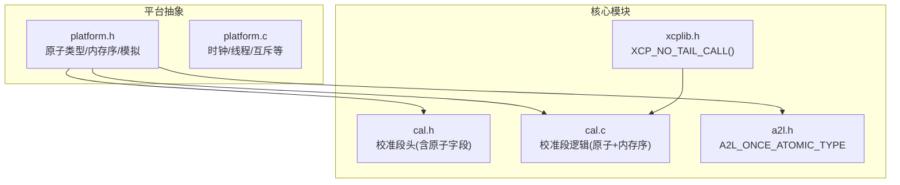
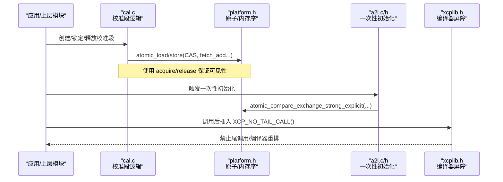
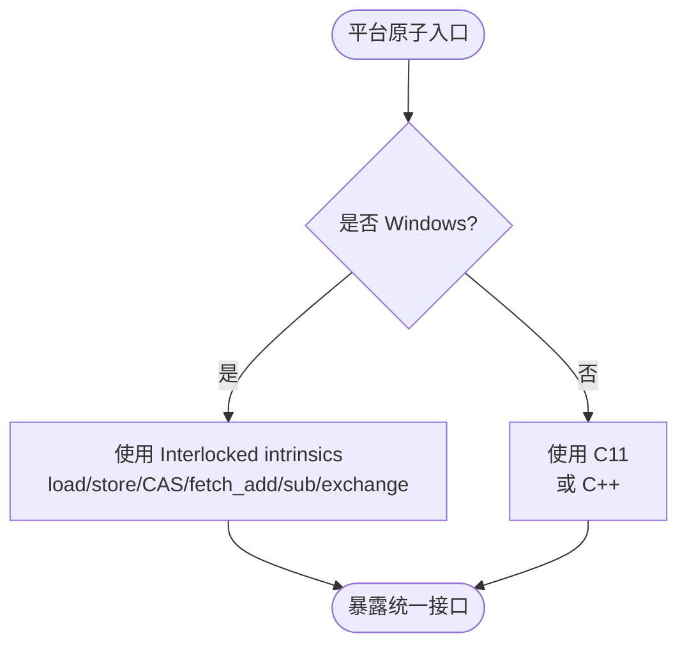
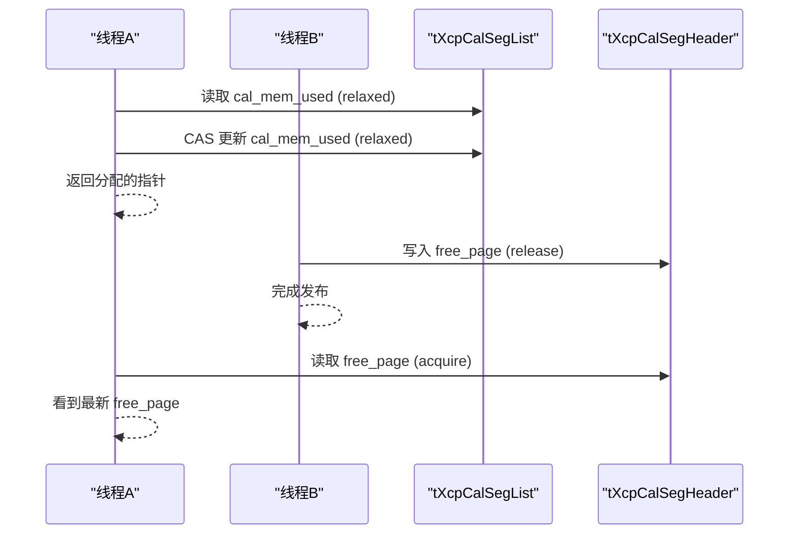
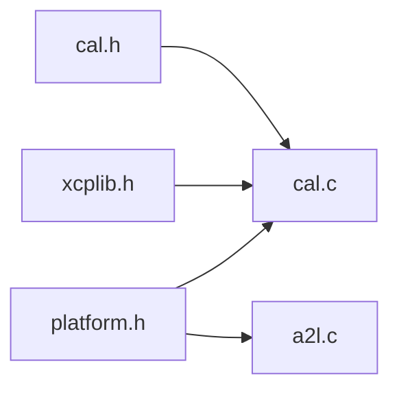

# 原子操作与内存屏障

<cite>
**本文引用的文件**
- [platform.h](file://src/platform.h)
- [platform.c](file://src/platform.c)
- [cal.h](file://src/cal.h)
- [cal.c](file://src/cal.c)
- [a2l.h](file://inc/a2l.h)
- [xcplib.h](file://inc/xcplib.h)
</cite>

## 目录
1. [简介](#简介)
2. [项目结构](#项目结构)
3. [核心组件](#核心组件)
4. [架构总览](#架构总览)
5. [详细组件分析](#详细组件分析)
6. [依赖关系分析](#依赖关系分析)
7. [性能考量](#性能考量)
8. [故障排查指南](#故障排查指南)
9. [结论](#结论)
10. [附录](#附录)

## 简介
本文件系统性梳理 XCPlite 中的原子操作与内存屏障技术，覆盖以下要点：
- 不同平台（Windows、Linux/macOS/QNX、FreeRTOS）的原子实现差异与选择策略
- x86 与 ARM 架构在原子指令与内存模型上的差异及代码如何屏蔽这些差异
- 内存屏障的作用机制、使用场景与顺序语义（relaxed/acquire/release/acq_rel）
- volatile 的正确用法与常见陷阱，以及编译器优化对内存访问的影响与防护
- 原子操作的性能分析与最佳实践指导

## 项目结构
XCPlite 将原子与内存屏障能力集中在平台抽象层与关键模块中：
- 平台抽象层：提供跨平台的原子类型、内存序常量、以及 Windows 下的原子模拟实现
- 校准段（Calibration Segment）模块：以原子字段和 acquire/release 语义维护多核/多线程安全的数据可见性与一致性
- A2L 一次性初始化：使用原子 CAS 保证“仅一次”执行
- 公共头文件：提供编译器级内存屏障宏与尾调用抑制宏，避免编译器重排导致的可见性问题

图表来源
- [platform.h:520-672](file://src/platform.h#L520-L672)
- [cal.h:79-175](file://src/cal.h#L79-L175)
- [cal.c:100-117](file://src/cal.c#L100-L117)
- [a2l.h:586-591](file://inc/a2l.h#L586-L591)
- [xcplib.h:533-545](file://inc/xcplib.h#L533-L545)

章节来源
- [platform.h:23-72](file://src/platform.h#L23-L72)
- [platform.h:520-672](file://src/platform.h#L520-L672)
- [cal.h:79-175](file://src/cal.h#L79-L175)
- [cal.c:100-117](file://src/cal.c#L100-L117)
- [a2l.h:586-591](file://inc/a2l.h#L586-L591)
- [xcplib.h:533-545](file://inc/xcplib.h#L533-L545)

## 核心组件
- 平台原子抽象
  - 通过 platform.h 暴露 atomic_uint_fast*_t、memory_order_* 等，并在启用 OPTION_ATOMIC_EMULATION 时基于 MSVC Interlocked intrinsics 提供 load/store/CAS/fetch_add/fetch_sub/exchange 的模拟实现
  - 非 Windows 路径默认使用 C11 <stdatomic.h>（或 C++ 的 <atomic>），并统一命名空间以便 C/C++ 共用
- 校准段原子状态
  - tXcpCalSegHeader 与 tXcpCalSegList 中使用 atomic_uint_least32_t/atomic_uint_least8_t 等原子字段，配合 memory_order_acquire/release 保证可见性
  - 使用 CAS（compare_exchange_weak/strong）实现无锁 bump allocator
- A2L 一次性初始化
  - 使用 A2L_ONCE_ATOMIC_TYPE（原子 uint_fast64_t）与 CAS 实现“仅一次”进入临界区
- 编译器屏障与尾调用抑制
  - XCP_NO_TAIL_CALL() 防止编译器将函数调用优化为尾调用，确保局部变量在调用期间保持有效；同时作为编译器内存屏障阻止重排

章节来源
- [platform.h:177-197](file://src/platform.h#L177-L197)
- [platform.h:520-672](file://src/platform.h#L520-L672)
- [cal.h:79-175](file://src/cal.h#L79-L175)
- [cal.c:100-117](file://src/cal.c#L100-L117)
- [a2l.h:586-591](file://inc/a2l.h#L586-L591)
- [xcplib.h:533-545](file://inc/xcplib.h#L533-L545)

## 架构总览
下图展示原子与内存屏障在 XCPlite 中的分层与交互：应用层通过 cal.c 的 API 访问校准段，底层依赖 platform.h 提供的原子原语；A2L 一次性初始化与事件触发通过 xcplib.h 的屏障宏保障正确性。

图表来源
- [cal.c:100-117](file://src/cal.c#L100-L117)
- [cal.c:185-193](file://src/cal.c#L185-L193)
- [a2l.h:586-591](file://inc/a2l.h#L586-L591)
- [xcplib.h:533-545](file://inc/xcplib.h#L533-L545)

## 详细组件分析

### 平台原子抽象与内存序
- 目标
  - 统一 C11 原子接口到各平台，Windows 下通过 Interlocked intrinsics 模拟
  - 明确 memory_order 语义：relaxed（仅原子性）、acquire/release（建立 happens-before 关系）、acq_rel（读-写同步）
- 关键点
  - 非 Windows：直接包含 stdatomic.h 或 C++ <atomic>，并将常用原子类型引入全局命名空间
  - Windows 模拟：提供 load/store/exchange/fetch_add/fetch_sub/CAS 的全集，注释说明 Interlocked intrinsics 提供全内存屏障（RMW 操作）
  - 类型大小断言：确保原子类型尺寸符合预期，便于跨平台布局一致

图表来源
- [platform.h:177-197](file://src/platform.h#L177-L197)
- [platform.h:520-672](file://src/platform.h#L520-L672)

章节来源
- [platform.h:177-197](file://src/platform.h#L177-L197)
- [platform.h:520-672](file://src/platform.h#L520-L672)

### 校准段（Calibration Segment）的原子与内存序
- 数据结构
  - tXcpCalSegHeader 包含 ecu_page_next、free_page、ecu_access、lock_count 等原子字段，保证跨线程/进程共享时的原子读写
  - tXcpCalSegList 使用原子偏移数组与 count 字段，配合 CAS 实现无锁分配器
- 典型流程
  - 无锁分配：循环读取 cal_mem_used，计算新值，CAS 更新；失败重试
  - 初始化：用 relaxed 写入初始值，随后用 release 发布可见
  - 获取计数：用 acquire 加载，确保看到之前 release 写入的全部数据
  - 页切换：release 写入 free_page，后续 acquire 读取以建立可见性

图表来源
- [cal.c:100-117](file://src/cal.c#L100-L117)
- [cal.c:185-193](file://src/cal.c#L185-L193)
- [cal.h:79-175](file://src/cal.h#L79-L175)

章节来源
- [cal.h:79-175](file://src/cal.h#L79-L175)
- [cal.c:100-117](file://src/cal.c#L100-L117)
- [cal.c:185-193](file://src/cal.c#L185-L193)

### A2L 一次性初始化（Once）
- 使用 A2L_ONCE_ATOMIC_TYPE（原子 uint_fast64_t）与 compare_exchange_strong_explicit 实现“仅一次”进入
- 内存序选择 relaxed，因为该模式仅用于标志位，且由外部上下文保证其他数据的可见性

章节来源
- [a2l.h:586-591](file://inc/a2l.h#L586-L591)
- [a2l.c:1442-1445](file://src/a2l.c#L1442-L1445)

### 编译器屏障与尾调用抑制
- XCP_NO_TAIL_CALL() 在 GCC/Clang 中展开为内联汇编屏障，阻止编译器将调用优化为尾调用，从而避免栈帧提前释放导致的数据被覆盖问题
- 在事件触发等关键路径后插入该宏，确保局部变量在调用期间保持有效

章节来源
- [xcplib.h:533-545](file://inc/xcplib.h#L533-L545)

## 依赖关系分析
- platform.h 为 cal.c、a2l.c 等模块提供原子原语与内存序常量
- cal.c 依赖 platform.h 的原子接口，并通过 acquire/release 建立跨线程可见性
- a2l.c 使用 platform.h 暴露的原子类型进行一次性初始化
- xcplib.h 提供编译器级屏障，辅助上层模块避免重排与尾调用优化带来的副作用

图表来源
- [platform.h:520-672](file://src/platform.h#L520-L672)
- [cal.c:100-117](file://src/cal.c#L100-L117)
- [a2l.h:586-591](file://inc/a2l.h#L586-L591)
- [xcplib.h:533-545](file://inc/xcplib.h#L533-L545)

章节来源
- [platform.h:520-672](file://src/platform.h#L520-L672)
- [cal.c:100-117](file://src/cal.c#L100-L117)
- [a2l.h:586-591](file://inc/a2l.h#L586-L591)
- [xcplib.h:533-545](file://inc/xcplib.h#L533-L545)

## 性能考量
- 原子操作的开销
  - CAS 在无竞争时接近普通存储，但在高竞争下会引发重试与总线争用；建议尽量降低热点路径的 CAS 频率，或使用 lock-free 队列/计数器设计
  - fetch_add/fetch_sub 在 ARM 上可能退化为 LDREX/STREX 循环，注意忙等与功耗
- 内存序选择
  - 优先使用 relaxed 提升吞吐，仅在需要可见性的边界使用 acquire/release
  - 避免不必要的 acq_rel，除非确实需要同步读与写
- 缓存友好性
  - 将频繁更新的原子变量放在独立缓存行，减少伪共享
  - 合理对齐与填充，避免跨缓存行抖动
- 编译器优化
  - 使用 XCP_NO_TAIL_CALL() 防止尾调用优化破坏局部变量生命周期
  - 谨慎使用 volatile，避免阻碍编译器必要的优化；优先使用原子与内存序表达并发语义

[本节为通用性能指导，不直接分析具体文件]

## 故障排查指南
- 现象：多线程下读到陈旧数据
  - 检查是否在发布端使用了 release 写入，在消费端使用 acquire 读取
  - 确认未错误地将所有访问都设为 relaxed
- 现象：死锁或饥饿
  - 检查 CAS 循环是否缺少回退或超时机制
  - 评估竞争程度，考虑分片或批量更新
- 现象：崩溃或数据损坏
  - 确认原子字段大小与对齐满足要求（如 static_assert 校验）
  - 检查是否误用 volatile 替代原子，导致编译器重排或合并访问
- 现象：事件触发时局部变量丢失
  - 在调用后立即插入 XCP_NO_TAIL_CALL()，避免尾调用优化

章节来源
- [cal.h:117-121](file://src/cal.h#L117-L121)
- [xcplib.h:533-545](file://inc/xcplib.h#L533-L545)

## 结论
XCPlite 通过平台抽象层统一了原子与内存序接口，并在关键模块（校准段、A2L 一次性初始化）中以最小必要的一致性约束实现高效的多线程安全。结合编译器屏障与尾调用抑制，确保了在复杂优化环境下的正确性。遵循本文的最佳实践，可在 x86/ARM 等多平台上获得稳定且高性能的并发行为。

[本节为总结，不直接分析具体文件]

## 附录

### 平台差异与架构注意事项
- x86 与 ARM 的差异
  - x86 具有强内存模型，多数 RMW 指令自带全屏障；ARM 弱内存模型需显式使用 acquire/release 保证可见性
  - XCPlite 通过 C11 原子与内存序屏蔽差异，无需手写特定架构屏障
- FreeRTOS 与嵌入式
  - 32 位目标上 64 位原子可能退化为 CAS 循环，需注意竞争与功耗
  - 建议使用更小的原子类型（如 uint_fast8_t）以减少带宽占用

章节来源
- [platform.h:114-138](file://src/platform.h#L114-L138)
- [platform.h:520-672](file://src/platform.h#L520-L672)

### volatile 的正确使用与陷阱
- 何时使用
  - 与硬件寄存器或信号处理共享的变量，且不需要跨线程可见性
- 常见陷阱
  - 不能替代原子：volatile 不提供原子性或内存序保证
  - 可能被编译器优化掉或重排，导致竞态条件
  - 在多线程环境中应优先使用原子与内存序

[本节为通用指导，不直接分析具体文件]

### 内存屏障的使用场景
- 发布-订阅模式：生产者 release 写入数据，消费者 acquire 读取
- 无锁数据结构：CAS 成功后 release 发布新状态，读取时使用 acquire 获取最新状态
- 事件触发：在调用外部函数前插入编译器屏障，确保局部变量不被优化掉

章节来源
- [cal.c:100-117](file://src/cal.c#L100-L117)
- [xcplib.h:533-545](file://inc/xcplib.h#L533-L545)