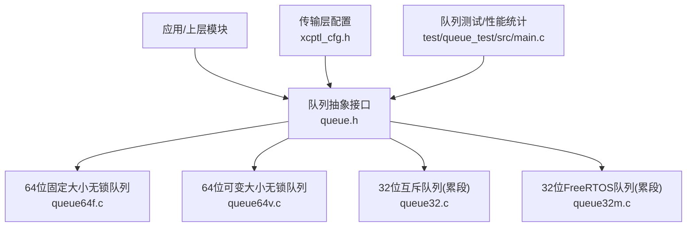
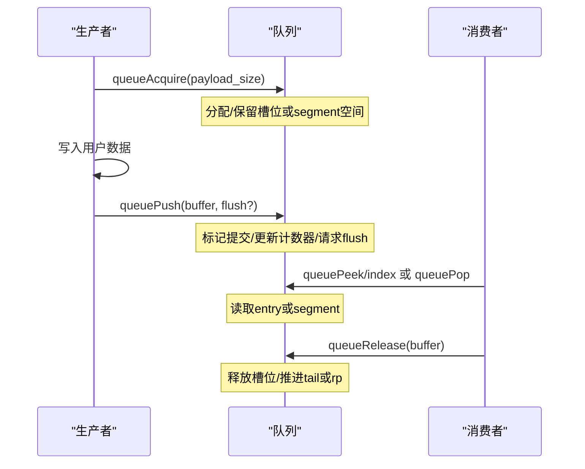
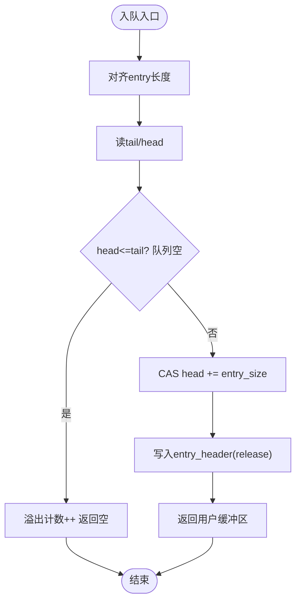
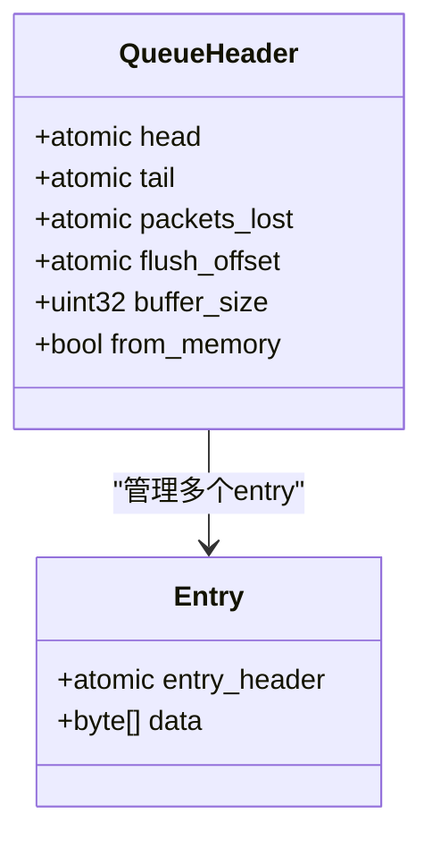
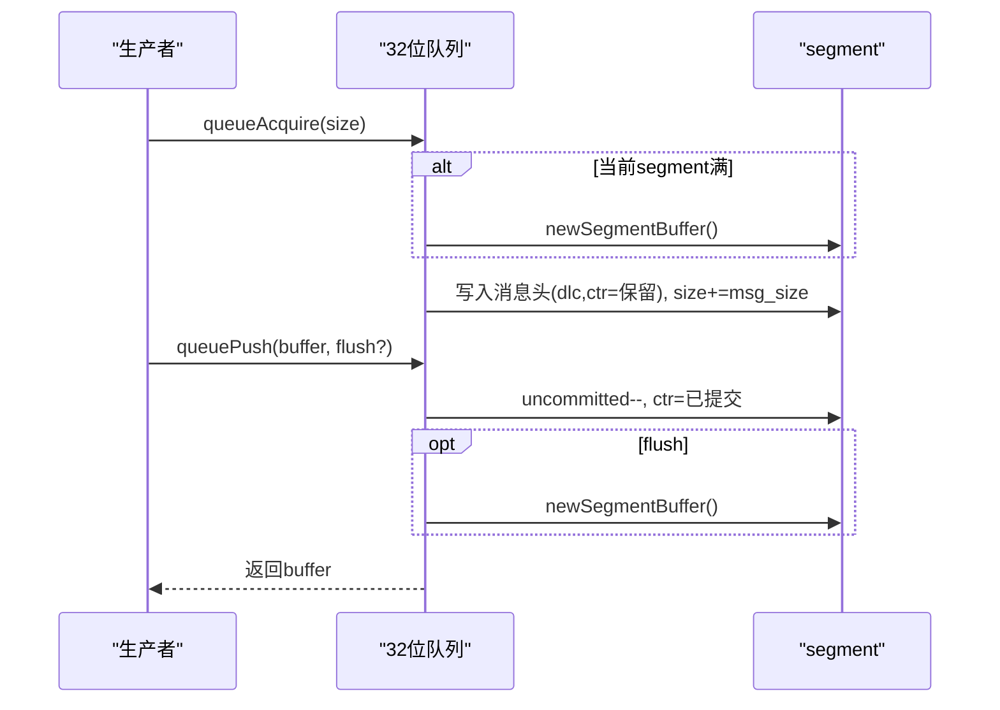
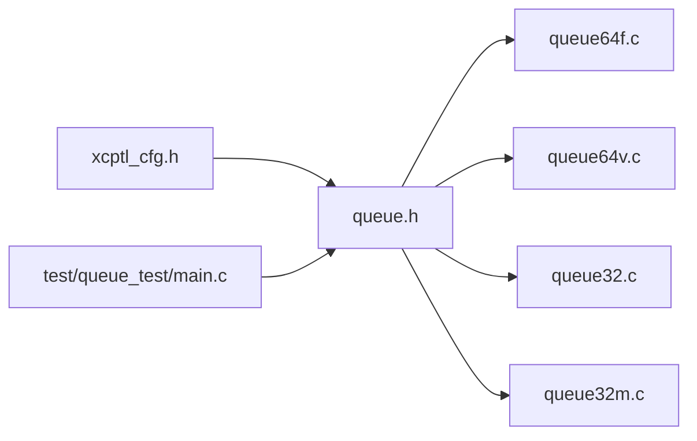

# 无锁队列实现

<cite>
**本文引用的文件**
- [queue.h](file://src/queue.h)
- [queue64f.c](file://src/queue64f.c)
- [queue64v.c](file://src/queue64v.c)
- [queue32.c](file://src/queue32.c)
- [queue32m.c](file://src/queue32m.c)
- [xcptl_cfg.h](file://src/xcptl_cfg.h)
- [main.c](file://test/queue_test/src/main.c)
</cite>

## 目录
1. [简介](#简介)
2. [项目结构](#项目结构)
3. [核心组件](#核心组件)
4. [架构总览](#架构总览)
5. [详细组件分析](#详细组件分析)
6. [依赖关系分析](#依赖关系分析)
7. [性能考量](#性能考量)
8. [故障排查指南](#故障排查指南)
9. [结论](#结论)
10. [附录](#附录)

## 简介
本文件深入解析 XCPlite 中的多实现队列子系统，重点覆盖：
- 环形队列的数据结构设计、头尾指针管理与内存布局优化
- 原子操作在队列操作中的应用（CAS、内存序与屏障）
- 不同队列类型（固定大小 64 位、可变大小 64 位、32 位累段）的实现差异与适用场景
- 多线程环境下的并发安全保证与性能优化策略
- 容量管理、溢出处理与调试工具使用方法

## 项目结构
XCPlite 的队列抽象由统一接口定义，并在不同平台/配置下提供多种实现：
- 通用 API：[queue.h](file://src/queue.h)
- 64 位无锁固定大小实现：[queue64f.c](file://src/queue64f.c)
- 64 位无锁可变大小实现：[queue64v.c](file://src/queue64v.c)
- 32 位互斥量实现（含消息累段）：[queue32.c](file://src/queue32.c)
- 32 位 FreeRTOS 实现（临界区/可选互斥）：[queue32m.c](file://src/queue32m.c)
- 传输层配置（对齐、MTU、头部预留等）：[xcptl_cfg.h](file://src/xcptl_cfg.h)
- 队列测试与性能统计：[main.c](file://test/queue_test/src/main.c)

图表来源
- [queue.h:1-187](file://src/queue.h#L1-L187)
- [queue64f.c:1-664](file://src/queue64f.c#L1-L664)
- [queue64v.c:1-662](file://src/queue64v.c#L1-L662)
- [queue32.c:1-420](file://src/queue32.c#L1-L420)
- [queue32m.c:1-466](file://src/queue32m.c#L1-L466)
- [xcptl_cfg.h:1-143](file://src/xcptl_cfg.h#L1-L143)
- [main.c:1-849](file://test/queue_test/src/main.c#L1-L849)

章节来源
- [queue.h:1-187](file://src/queue.h#L1-L187)
- [xcptl_cfg.h:1-143](file://src/xcptl_cfg.h#L1-L143)

## 核心组件
- 统一队列接口：提供初始化、获取缓冲、提交、弹出/窥视、释放、查询水位、清空等操作。
- 64 位无锁队列：
  - 固定大小：每个槽位包含一个原子 entry_header + 固定长度数据区；通过 head/tail 原子索引实现无锁入队/出队。
  - 可变大小：entry 长度可配，消费者释放时清零已用区域以允许后续生产者复用该空间。
- 32 位累段队列：将多个消息累积到一个 segment（UDP payload），减少系统调用开销；使用互斥或临界区保护。

章节来源
- [queue.h:88-187](file://src/queue.h#L88-L187)
- [queue64f.c:250-294](file://src/queue64f.c#L250-L294)
- [queue64v.c:216-261](file://src/queue64v.c#L216-L261)
- [queue32.c:57-100](file://src/queue32.c#L57-L100)
- [queue32m.c:53-98](file://src/queue32m.c#L53-L98)

## 架构总览
队列子系统围绕“生产者-单消费者”模型设计：
- 生产者侧线程安全（64 位无锁实现中为无锁 CAS 循环；32 位实现中使用互斥/临界区）
- 消费者侧非线程安全，需单线程消费
- 支持 peek/pop 两种消费模式：64 位实现支持 peek（按索引窥视），32 位实现支持 pop（返回累段）

图表来源
- [queue64f.c:399-519](file://src/queue64f.c#L399-L519)
- [queue64v.c:366-485](file://src/queue64v.c#L366-L485)
- [queue32.c:207-304](file://src/queue32.c#L207-L304)
- [queue32m.c:275-361](file://src/queue32m.c#L275-L361)

## 详细组件分析

### 64 位固定大小无锁队列（queue64f.c）
- 数据结构
  - tQueueEntry：原子 entry_header（状态+长度）+ 连续 data 区
  - tQueueHeader：head/tail/packets_lost/flush_offset 等原子字段，缓存行对齐
- 入队流程
  - 计算 entry_len（含用户头+负载，按对齐向上取整）
  - 读 tail/head，检查是否溢出
  - CAS 尝试增加 head，成功后定位 entry 并写入 entry_header（release store）
- 出队流程
  - 读 head/tail，若 head > tail 则存在数据
  - 读取 entry_header（acquire load），校验状态与长度
  - 返回用户缓冲区指针与长度
  - 释放时清零 entry_header 并 release 更新 tail
- 内存序与屏障
  - 生产者：entry_header 使用 memory_order_release
  - 消费者：entry_header 使用 memory_order_acquire
  - tail 默认 relaxed 发布容量信息；可选 OPTION_QUEUE_64_FIX_SIZE_SYNC_TAIL 切换为 acquire/release 同步 tail
- 性能优化
  - 槽位大小对齐到缓存行，避免伪共享
  - 仅当 flush 时设置 flush_offset，消费者可据此优先处理高优先级包

图表来源
- [queue64f.c:399-494](file://src/queue64f.c#L399-L494)
- [queue64f.c:496-519](file://src/queue64f.c#L496-L519)

章节来源
- [queue64f.c:250-294](file://src/queue64f.c#L250-L294)
- [queue64f.c:399-519](file://src/queue64f.c#L399-L519)
- [queue64f.c:528-660](file://src/queue64f.c#L528-L660)

### 64 位可变大小无锁队列（queue64v.c）
- 数据结构
  - 与固定大小类似，但 entry 长度可变；消费者释放时需 memset 清零已用区域，确保后续生产者能安全复用
- 入队流程
  - 同固定大小，但 head 增量等于 entry_len + header_size
  - 同样通过 entry_header 的状态位控制可见性
- 出队流程
  - 支持 queuePeek(index)，内部维护 cached_peek_index/cached_peek_tail 加速顺序窥视
  - 释放时清零 entry 区域并 release 更新 tail
- 内存序与屏障
  - 生产者 entry_header 使用 release
  - 消费者 entry_header 使用 acquire
  - tail 使用 release 发布清理后的内存可见性
- 适用场景
  - 负载大小变化较大且希望减少内存碎片与拷贝的场景
  - 中等吞吐时表现良好；极高吞吐建议对比固定大小实现

图表来源
- [queue64v.c:216-261](file://src/queue64v.c#L216-L261)
- [queue64v.c:265-340](file://src/queue64v.c#L265-L340)
- [queue64v.c:366-485](file://src/queue64v.c#L366-L485)
- [queue64v.c:512-658](file://src/queue64v.c#L512-L658)

章节来源
- [queue64v.c:216-261](file://src/queue64v.c#L216-L261)
- [queue64v.c:366-485](file://src/queue64v.c#L366-L485)
- [queue64v.c:512-658](file://src/queue64v.c#L512-L658)

### 32 位互斥队列（queue32.c）
- 数据结构
  - 以 segment 为单位：tXcpSegmentBuffer 包含未提交消息数、总长度、可选 segment 头预留空间与 msg_buffer
  - 队列数组保存多个 segment，维护 rp（读指针）、len（长度）、msg_ptr（当前未完成 segment）
- 入队流程
  - 对齐负载大小，计算消息长度（含传输层头）
  - 若当前 segment 已满或为空，申请新 segment
  - 写入消息头（ctr=保留值，dlc=长度），标记 uncommitted++
- 出队流程
  - 若尾部 segment 完全提交且队列中有更多 segment，直接返回
  - 否则等待或刷新（flush）
  - 遍历 segment 内所有消息，填充传输层 ctr，返回整个 segment
- 释放流程
  - 推进 rp，减少 len，回收 segment
- 适用场景
  - 需要消息累段以降低发送开销（如以太网 UDP 帧聚合）
  - 32 位平台或 Windows 目标

图表来源
- [queue32.c:104-135](file://src/queue32.c#L104-L135)
- [queue32.c:207-304](file://src/queue32.c#L207-L304)
- [queue32.c:333-417](file://src/queue32.c#L333-L417)

章节来源
- [queue32.c:57-100](file://src/queue32.c#L57-L100)
- [queue32.c:207-304](file://src/queue32.c#L207-L304)
- [queue32.c:333-417](file://src/queue32.c#L333-L417)

### 32 位 FreeRTOS 队列（queue32m.c）
- 与 queue32.c 类似，但针对 FreeRTOS 目标：
  - 使用 taskENTER_CRITICAL()/taskEXIT_CRITICAL() 或 ESP 平台的 portMUX_TYPE
  - 可选择使用互斥量（OPTION_QUEUE32_MUTEX）
  - 静态全局队列与缓冲区，支持按属性放置到 DTCM/非缓存 SRAM，避免 DMA 一致性开销
- 适用场景
  - Cortex-M/ESP 等 RTOS 目标，追求极低中断延迟与确定性

章节来源
- [queue32m.c:100-150](file://src/queue32m.c#L100-L150)
- [queue32m.c:153-177](file://src/queue32m.c#L153-L177)
- [queue32m.c:217-268](file://src/queue32m.c#L217-L268)
- [queue32m.c:275-361](file://src/queue32m.c#L275-L361)
- [queue32m.c:389-463](file://src/queue32m.c#L389-L463)

## 依赖关系分析
- 配置依赖
  - 对齐与 MTU：XCPTL_PACKET_ALIGNMENT、XCPTL_MAX_SEGMENT_SIZE、XCPTL_TX_HEADROOM
  - 最大 DTO 大小：根据是否启用固定大小队列而不同
- 编译期选择
  - 64 位无锁实现要求 C11 atomics 且非 Windows
  - 32 位实现用于 32 位平台、Windows 或启用原子模拟
- 运行时行为
  - 64 位实现支持 peek 与 flush 请求
  - 32 位实现支持消息累段与 ctr 填充

图表来源
- [xcptl_cfg.h:34-114](file://src/xcptl_cfg.h#L34-L114)
- [queue.h:29-83](file://src/queue.h#L29-L83)

章节来源
- [xcptl_cfg.h:34-114](file://src/xcptl_cfg.h#L34-L114)
- [queue.h:29-83](file://src/queue.h#L29-L83)

## 性能考量
- 无锁 vs 有锁
  - 64 位无锁实现通过 CAS 与内存序避免锁开销，适合高并发生产端
  - 32 位实现使用互斥/临界区，但通过消息累段减少系统调用次数
- 内存布局与缓存友好
  - 固定大小实现槽位对齐到缓存行，减少伪共享
  - 可变大小实现释放时清零已用区域，可能带来额外写放大，但在中等吞吐下仍具优势
- 对齐与头部预留
  - 传输层头预留（XCPTL_TX_HEADROOM）仅在累段队列中有效，避免复制链路头
- 窥视优化
  - 可变大小实现维护 cached_peek_index/cached_peek_tail，顺序窥视更高效
- 测量与统计
  - 测试程序提供 acquire 耗时直方图、自旋计数、丢包统计等

章节来源
- [queue64f.c:77-93](file://src/queue64f.c#L77-L93)
- [queue64v.c:233-253](file://src/queue64v.c#L233-L253)
- [queue32.c:39-44](file://src/queue32.c#L39-L44)
- [main.c:105-211](file://test/queue_test/src/main.c#L105-L211)

## 故障排查指南
- 常见错误与断言
  - 非法 packet_len：超出范围会返回空缓冲并记录日志
  - 不一致的 entry 状态：消费者读到既非初始也非已提交的 entry_header 会触发断言
  - 对齐错误：编译期强制 QUEUE_PAYLOAD_SIZE_ALIGNMENT 为 2 的幂且满足最小对齐要求
- 溢出与丢包
  - 64 位实现：packets_lost 原子计数器递增，消费者可通过 peek 参数获取
  - 32 位实现：packets_lost 在 queuePop 时返回并清零
- 调试工具
  - 启用 OPTION_ENABLE_DBG_PRINTS 输出详细日志
  - 使用测试程序的 acquire 耗时统计与直方图定位热点
  - 通过 queueLevel 观察队列水位，调整生产者速率或队列容量

章节来源
- [queue64f.c:404-411](file://src/queue64f.c#L404-L411)
- [queue64f.c:590-617](file://src/queue64f.c#L590-L617)
- [queue64v.c:371-378](file://src/queue64v.c#L371-L378)
- [queue64v.c:561-607](file://src/queue64v.c#L561-L607)
- [queue32.c:216-225](file://src/queue32.c#L216-L225)
- [queue32.c:333-346](file://src/queue32.c#L333-L346)
- [queue32m.c:281-289](file://src/queue32m.c#L281-L289)
- [queue32m.c:389-401](file://src/queue32m.c#L389-L401)
- [main.c:440-500](file://test/queue_test/src/main.c#L440-L500)

## 结论
XCPlite 的队列子系统提供了面向不同平台与场景的多套实现：
- 64 位无锁固定大小队列在高吞吐、低延迟场景中表现优异
- 64 位无锁可变大小队列在负载大小波动较大的应用中更具灵活性
- 32 位累段队列通过消息聚合降低系统调用开销，适用于以太网/UDP 等网络栈
- 统一的抽象接口屏蔽了底层差异，便于移植与扩展
- 通过合理的内存布局、对齐、原子序与 flush 机制，实现了高效且安全的并发通信

## 附录
- 关键配置项说明
  - XCPTL_MAX_DTO_SIZE：最大 DTO 大小，影响 entry 尺寸与缓存友好性
  - XCPTL_MAX_SEGMENT_SIZE：最大 segment 大小，限制 UDP payload
  - XCPTL_PACKET_ALIGNMENT：协议层包对齐，影响消息边界与访问效率
  - XCPTL_TX_HEADROOM：segment 前预留空间，用于零拷贝链路头
- 使用建议
  - 高吞吐固定负载：优先选择 queue64f
  - 负载多变：考虑 queue64v，并评估写放大影响
  - 网络发送聚合：选择 queue32/queue32m，结合 XCPTL_TX_HEADROOM 优化
  - 监控与调优：利用测试程序统计与 queueLevel 观察，动态调整队列容量与生产者速率