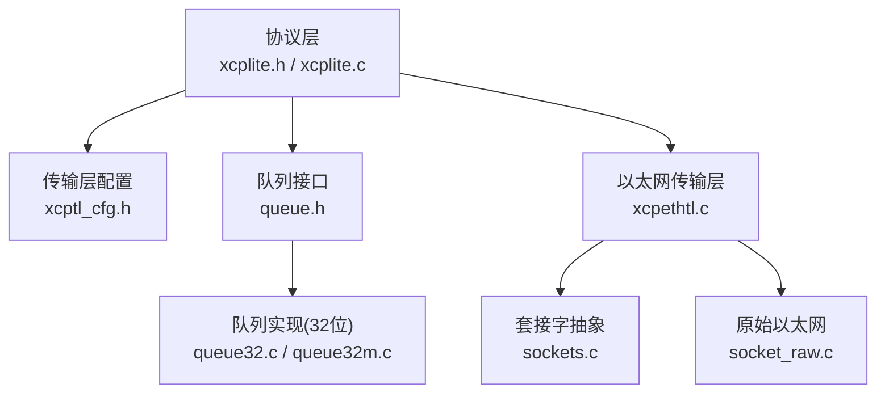
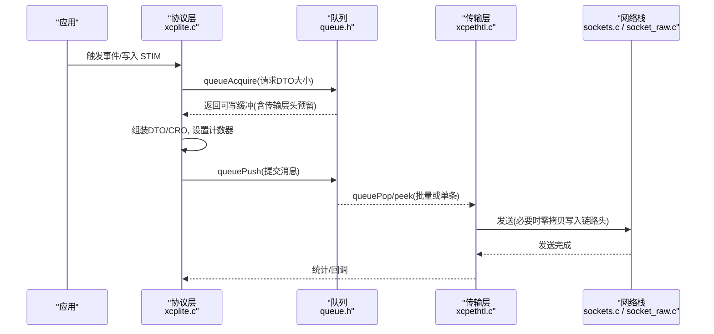
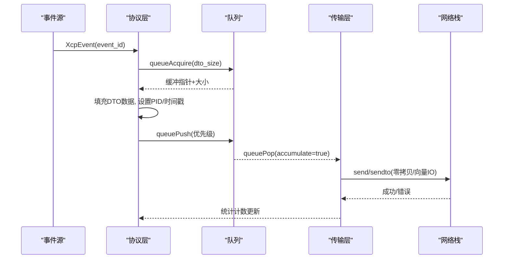
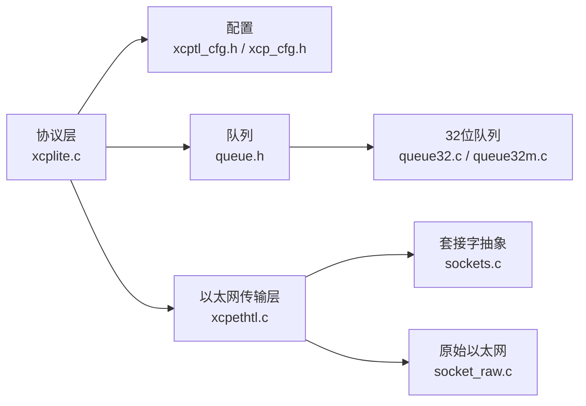

# 缓冲区管理

<cite>
**本文引用的文件**
- [xcplite.h](file://src/xcplite.h)
- [xcp_cfg.h](file://src/xcp_cfg.h)
- [xcptl_cfg.h](file://src/xcptl_cfg.h)
- [queue.h](file://src/queue.h)
- [queue32.c](file://src/queue32.c)
- [queue32m.c](file://src/queue32m.c)
- [socket_raw.c](file://src/socket_raw.c)
- [sockets.c](file://src/sockets.c)
- [xcpethtl.c](file://src/xcpethtl.c)
- [xcplite.c](file://src/xcplite.c)
</cite>

## 目录
1. [简介](#简介)
2. [项目结构](#项目结构)
3. [核心组件](#核心组件)
4. [架构总览](#架构总览)
5. [详细组件分析](#详细组件分析)
6. [依赖关系分析](#依赖关系分析)
7. [性能考虑](#性能考虑)
8. [故障排查指南](#故障排查指南)
9. [结论](#结论)
10. [附录](#附录)

## 简介
本文件系统性说明 XCPlite 的缓冲区管理机制，覆盖 CTO（命令）与 DTO（数据）缓冲区的分配策略、大小配置与内存布局；阐述基于队列的缓冲区池设计（预分配与动态扩展）、不同传输层下的优化技术（零拷贝、内存对齐）、溢出防护与边界检查、以及性能调优与内存监控方法。目标是帮助读者在不深入源码细节的前提下，理解并正确配置 XCPlite 的缓冲区体系。

## 项目结构
XCPlite 将协议层与传输层解耦：协议层负责 XCP 命令处理、DAQ/STIM 数据组织与状态机；传输层提供 UDP/TCP/Raw Ethernet 等抽象，并通过通用队列接口进行消息排队与发送。缓冲区相关的关键位置包括：
- 协议层状态中的 CTO 响应缓冲与 DAQ 表内存块
- 传输层配置中的最大 CTO/DTO/段大小与对齐
- 队列实现中的固定/可变条目、分段累积与头预留空间
- 以太网传输层的零拷贝路径与头部预置

**图示来源**
- [xcplite.h:114-120](file://src/xcplite.h#L114-L120)
- [xcptl_cfg.h:37-114](file://src/xcptl_cfg.h#L37-L114)
- [queue.h:29-55](file://src/queue.h#L29-L55)
- [xcpethtl.c:39-43](file://src/xcpethtl.c#L39-L43)

**章节来源**
- [xcplite.h:114-120](file://src/xcplite.h#L114-L120)
- [xcptl_cfg.h:37-114](file://src/xcptl_cfg.h#L37-L114)
- [queue.h:29-55](file://src/queue.h#L29-L55)

## 核心组件
- CTO 响应缓冲 tXcpCto：协议层全局状态中为每次命令响应预留的紧凑缓冲，按 8 字节对齐，大小由传输层配置的最大 CTO 决定。
- DAQ 表内存块 tXcpDaqLists：静态分配的线性内存块，内部以联合体形式复用同一块内存存放 DAQ 列表、ODT、ODT 条目地址/大小/扩展数组，确保 8 字节对齐。
- 队列缓冲区池：通过 queueInit/queueInitFromMemory 预分配队列内存，支持在共享内存或堆上创建；生产者通过 queueAcquire 获取可写缓冲，消费者通过 queuePop/queuePeek 读取并提交。
- 传输层段与消息：一个“段”可能包含多个“消息”，每个消息带 4 字节传输层头（长度+计数器），段内消息按对齐填充，避免跨消息拷贝。

**章节来源**
- [xcplite.h:114-120](file://src/xcplite.h#L114-L120)
- [xcplite.h:334-376](file://src/xcplite.h#L334-L376)
- [queue.h:88-187](file://src/queue.h#L88-L187)
- [xcptl_cfg.h:86-114](file://src/xcptl_cfg.h#L86-L114)

## 架构总览
下图展示从应用触发 DAQ/STIM 到传输层发送的数据流与缓冲区使用路径，体现零拷贝与对齐优化。

**图示来源**
- [queue.h:122-168](file://src/queue.h#L122-L168)
- [xcpethtl.c:244-244](file://src/xcpethtl.c#L244-L244)
- [xcptl_cfg.h:94-114](file://src/xcptl_cfg.h#L94-L114)

## 详细组件分析

### CTO 与 DTO 缓冲区的分配策略与大小配置
- CTO 缓冲 tXcpCto：
  - 位于协议层全局状态中，作为命令响应的临时缓冲，保证 8 字节对齐，大小等于 XCPTL_MAX_CTO_SIZE。
  - 用于快速构建 RES/ERR 等小报文，减少动态分配。
- DTO 缓冲：
  - 由队列提供，最大条目大小为 XCPTL_MAX_DTO_SIZE + 4 字节传输层头。
  - 队列实现根据平台选择固定或可变条目模式；固定条目利于缓存友好，可变条目更灵活。
- 段大小与 MTU：
  - XCPTL_MAX_SEGMENT_SIZE 由 OPTION_MTU 减去 IP/UDP 头并对齐得到，确保单个段不超过链路 MTU。
  - 以太网传输层要求 CTO/DTO 大小按 8 字节对齐，编译期断言保障。

**章节来源**
- [xcplite.h:114-120](file://src/xcplite.h#L114-L120)
- [xcptl_cfg.h:37-59](file://src/xcptl_cfg.h#L37-L59)
- [xcpethtl.c:39-43](file://src/xcpethtl.c#L39-L43)

### 内存布局与对齐要求
- tXcpCto：
  - 使用 union 以 uint8_t/uint16_t/uint32_t 视图访问，static_assert 确保尺寸与对齐。
- tXcpDaqLists：
  - 单一内存块，内部按顺序放置 DAQ 列表、ODT、ODT 条目地址/大小/扩展数组，整体按 8 字节对齐。
- 队列条目：
  - 用户负载大小上限为 XCPTL_MAX_DTO_SIZE，载荷对齐为 4 字节；32 位队列在段前预留头部空间以便零拷贝写入链路头。

**章节来源**
- [xcplite.h:114-120](file://src/xcplite.h#L114-L120)
- [xcplite.h:334-376](file://src/xcplite.h#L334-L376)
- [queue.h:39-55](file://src/queue.h#L39-L55)

### 缓冲区池设计原理：预分配与动态扩展
- 预分配：
  - 通过 queueInit 或 queueInitFromMemory 一次性分配队列内存，可在共享内存中初始化，避免运行时频繁分配。
  - 32 位队列实现支持将多条消息累积为一个段，减少系统调用次数。
- 动态扩展：
  - 队列本身不动态扩容；若需更大容量，应在初始化时传入更大的 buffer_size。
  - 对于 Raw Ethernet 零拷贝场景，仅 32 位队列保留段头空间，其他队列通过向量发送路径实现高效传输。

**章节来源**
- [queue.h:101-114](file://src/queue.h#L101-L114)
- [queue32.c:159-159](file://src/queue32.c#L159-L159)
- [xcptl_cfg.h:94-110](file://src/xcptl_cfg.h#L94-L110)

### 不同传输层下的缓冲区优化技术
- 零拷贝：
  - Raw Ethernet 路径在段前预留头部空间（XCPTL_TX_HEADROOM），直接写入以太网/IP/UDP 头，无需额外拷贝。
  - 64 位队列通过向量发送路径避免合并拷贝，提高吞吐。
- 内存对齐：
  - 所有 CTO/DTO 大小按 8 字节对齐；队列载荷按 4 字节对齐，确保 CPU 高效访问与 DMA 友好。
- 段累积：
  - 32 位队列可将多条消息累积到一个段，降低开销；消费者在 pop 时获得完整段，便于批量发送。

**章节来源**
- [xcptl_cfg.h:94-110](file://src/xcptl_cfg.h#L94-L110)
- [queue.h:39-55](file://src/queue.h#L39-L55)
- [socket_raw.c:33-33](file://src/socket_raw.c#L33-L33)

### 缓冲区溢出防护、边界检查与安全验证
- 编译期检查：
  - CTO/DTO 大小限制、对齐要求、段大小与 MTU 关系均在编译期断言，防止非法配置。
- 运行期检查：
  - 队列入队时对 packet_size 进行范围校验；出队时对 dlc 进行断言。
  - 以太网传输层对写入长度进行断言，防止越界。
- 安全访问：
  - 应用可通过回调 ApplXcpCheckMemory 进行内存访问权限检查，确保 DAQ/STIM 目标地址合法。

**章节来源**
- [xcplite.c:95-138](file://src/xcplite.c#L95-L138)
- [queue32.c:216-217](file://src/queue32.c#L216-L217)
- [queue32m.c:281-281](file://src/queue32m.c#L281-L281)
- [xcpethtl.c:244-244](file://src/xcpethtl.c#L244-L244)
- [xcplite.h:522-523](file://src/xcplite.h#L522-L523)

### 关键流程时序图：DAQ 事件触发与 DTO 发送

**图示来源**
- [queue.h:122-168](file://src/queue.h#L122-L168)
- [xcpethtl.c:244-244](file://src/xcpethtl.c#L244-L244)
- [sockets.c:166-193](file://src/sockets.c#L166-L193)

## 依赖关系分析
- 协议层依赖传输层配置（最大 CTO/DTO/段大小、对齐、MTU）。
- 队列实现依赖传输层头大小与段头预留，确保消费者可直接写入链路头。
- 以太网传输层依赖套接字抽象，屏蔽平台差异；Raw Ethernet 路径直接操作底层帧。

**图示来源**
- [xcptl_cfg.h:37-114](file://src/xcptl_cfg.h#L37-L114)
- [queue.h:29-55](file://src/queue.h#L29-L55)
- [xcpethtl.c:39-43](file://src/xcpethtl.c#L39-L43)

**章节来源**
- [xcptl_cfg.h:37-114](file://src/xcptl_cfg.h#L37-L114)
- [queue.h:29-55](file://src/queue.h#L29-L55)
- [xcpethtl.c:39-43](file://src/xcpethtl.c#L39-L43)

## 性能考虑
- 选择合适的队列模式：
  - 固定条目队列（64 位）适合高吞吐、低延迟场景；可变条目队列适合灵活负载。
  - 32 位队列支持段累积，减少系统调用，但增加尾部延迟。
- 调整 MTU 与段大小：
  - 合理设置 OPTION_MTU，使 XCPTL_MAX_SEGMENT_SIZE 接近链路 MTU，避免分片。
- 零拷贝与向量化：
  - Raw Ethernet 启用零拷贝可减少拷贝开销；64 位队列向量发送提升带宽利用率。
- 对齐与缓存友好：
  - 保持 8 字节对齐的 CTO/DTO，4 字节对齐的队列载荷，提升 CPU/DMA 效率。

[本节为通用指导，不直接分析具体文件]

## 故障排查指南
- 常见错误与定位：
  - 段大小超过链路 MTU：检查 OPTION_MTU 与 XCPTL_MAX_SEGMENT_SIZE 的关系；Linux/macOS/BSD/Windows 会在 sendto 时报 EMSGSIZE。
  - 队列溢出：监控 queueLevel 与 packets_lost 指标，增大队列缓冲或降低产生速率。
  - 对齐错误：确认 XCPTL_MAX_CTO_SIZE/XCPTL_MAX_DTO_SIZE 满足 8 字节对齐；编译期断言会捕获问题。
- 调试建议：
  - 启用 TEST_ENABLE_DBG_METRICS 收集 TX/RX 包计数、事件计数等指标。
  - 使用 DBG_LEVEL 输出关键路径日志，定位瓶颈。

**章节来源**
- [xcptl_cfg.h:61-81](file://src/xcptl_cfg.h#L61-L81)
- [queue.h:178-182](file://src/queue.h#L178-L182)
- [xcplite.h:637-652](file://src/xcplite.h#L637-L652)

## 结论
XCPlite 的缓冲区管理以“协议层静态缓冲 + 队列池化 + 传输层零拷贝”为核心，通过严格的编译期与运行期检查保障安全性，借助对齐与段累积优化性能。合理配置 MTU、队列大小与对齐参数，结合监控指标，可实现稳定高效的 XCP 数据传输。

[本节为总结性内容，不直接分析具体文件]

## 附录
- 关键配置项速查：
  - XCPTL_MAX_CTO_SIZE：命令报文最大长度（必须 ≤255，≥8，按 8 字节对齐）
  - XCPTL_MAX_DTO_SIZE：数据报文最大长度（必须 ≥CTO，≤段大小）
  - XCPTL_MAX_SEGMENT_SIZE：段大小（由 MTU 推导，按 8 字节对齐）
  - QUEUE_ENTRY_USER_HEADER_SIZE：每消息的传输层头预留（4 字节）
  - QUEUE_SEGMENT_HEADER_SIZE：每段的链路头预留（Raw Ethernet 零拷贝用）

**章节来源**
- [xcptl_cfg.h:37-114](file://src/xcptl_cfg.h#L37-L114)
- [queue.h:39-55](file://src/queue.h#L39-L55)