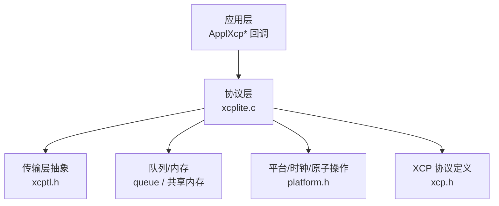
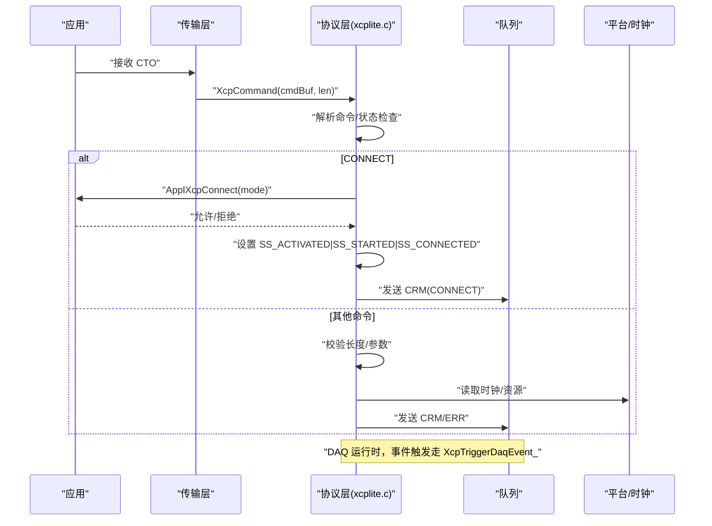
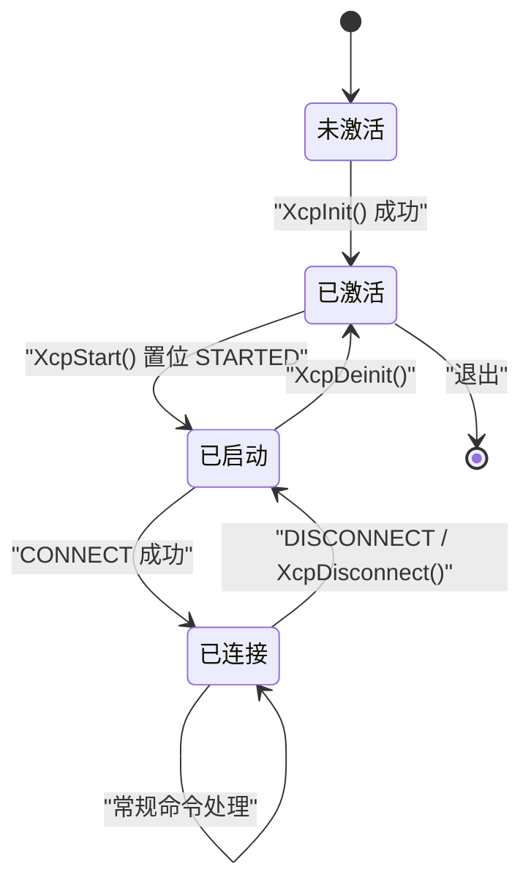
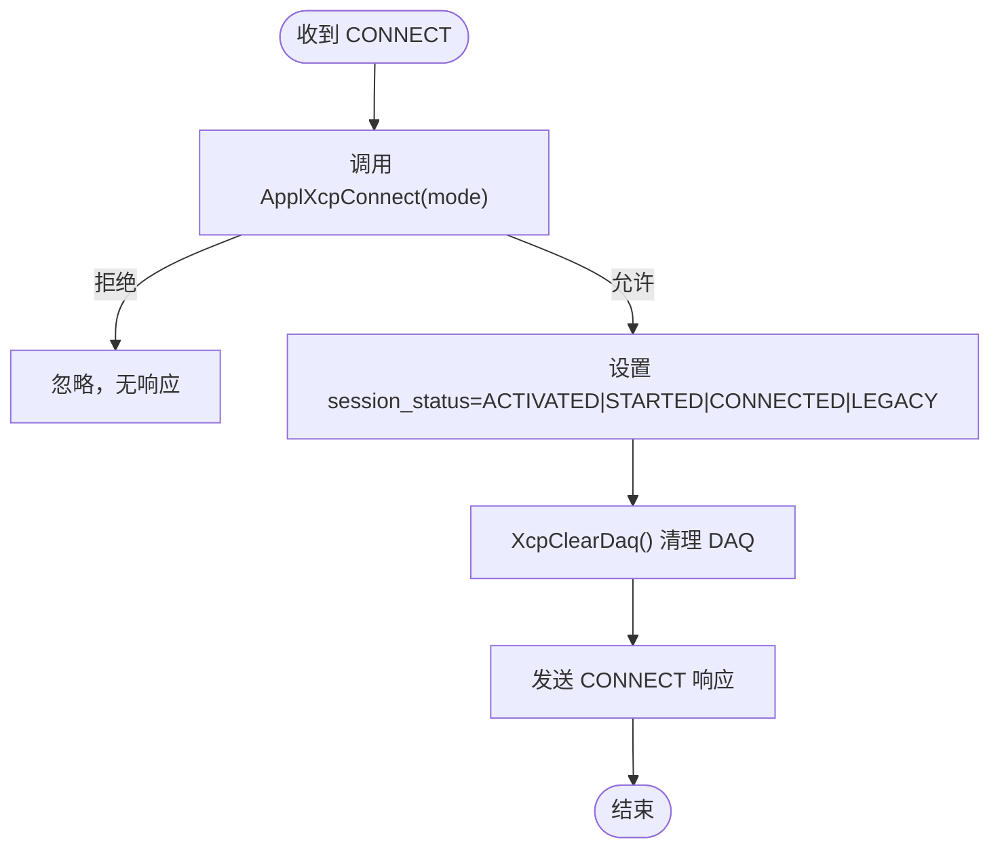
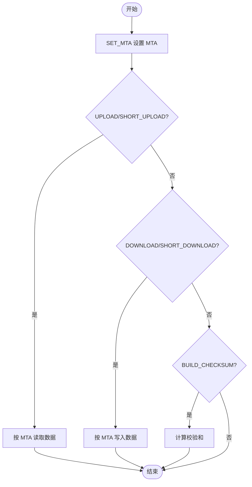
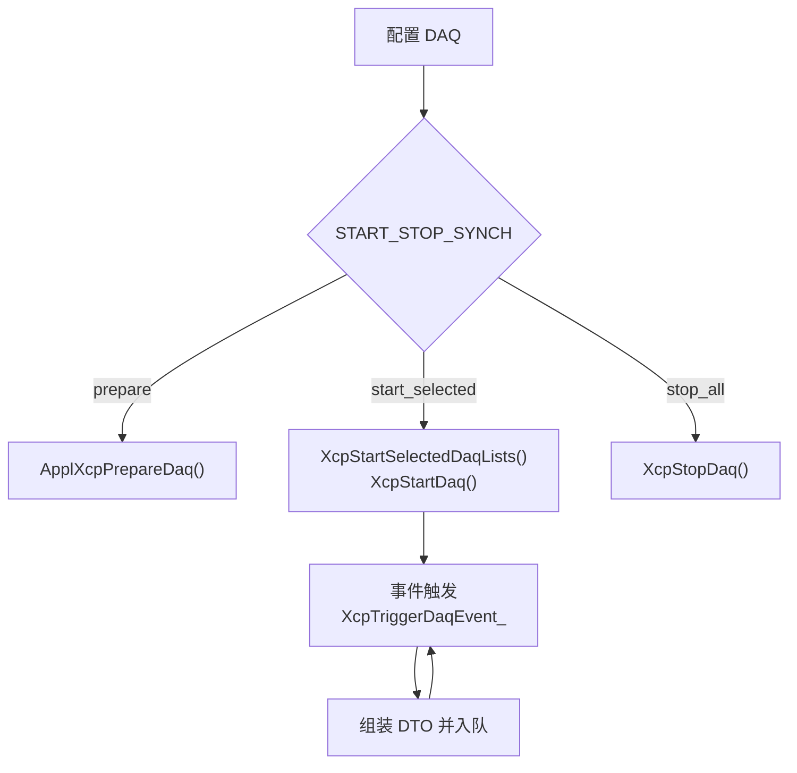
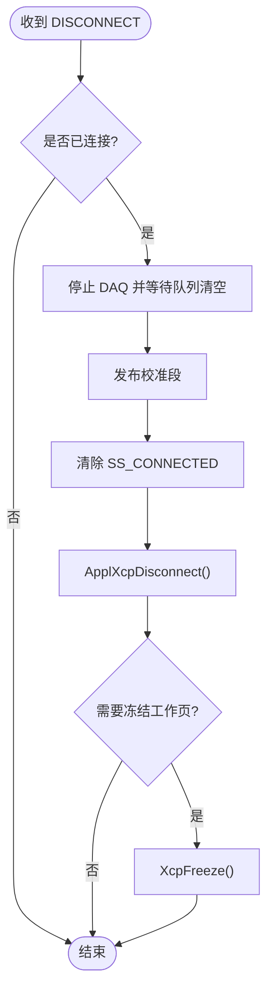
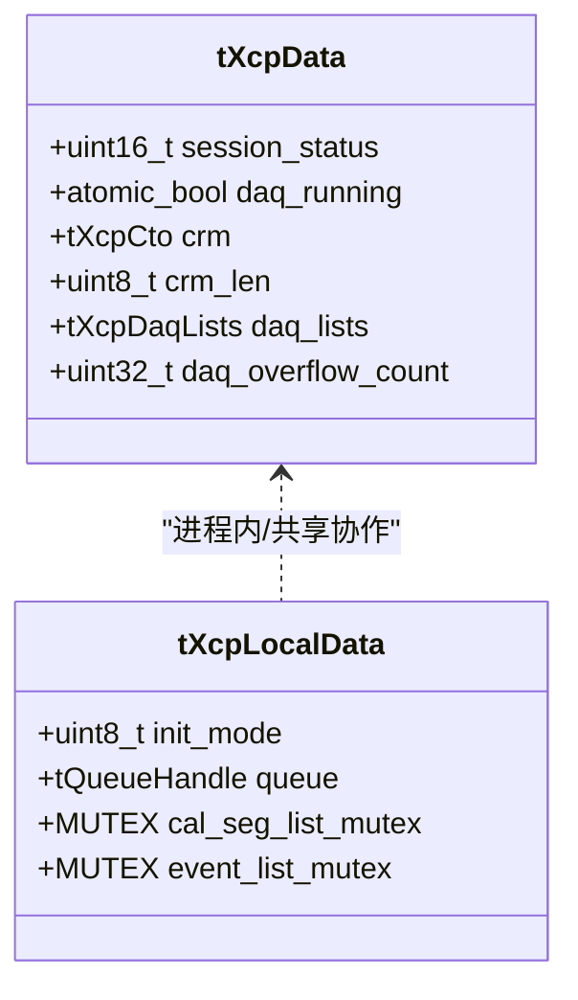
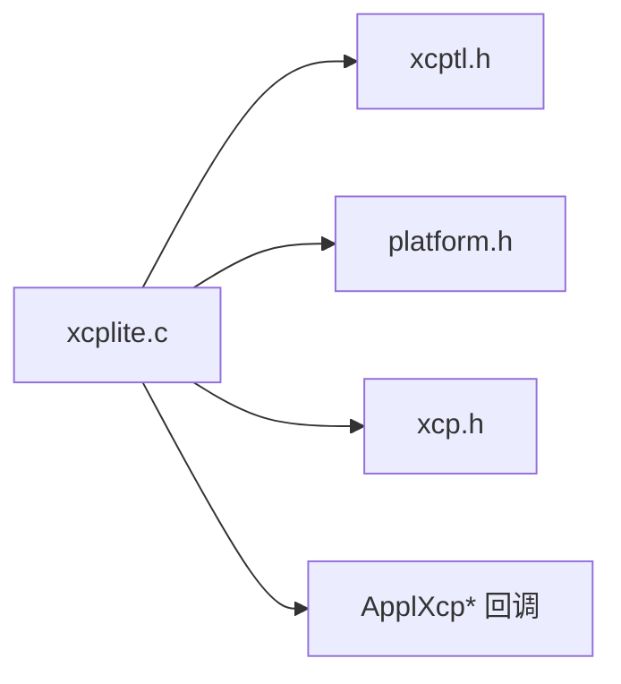

# 协议状态机管理

<cite>
**本文引用的文件**
- [xcplite.c](file://src/xcplite.c)
- [xcplite.h](file://src/xcplite.h)
- [xcp.h](file://src/xcp.h)
- [xcptl.h](file://src/xcptl.h)
</cite>

## 目录
1. [简介](#简介)
2. [项目结构](#项目结构)
3. [核心组件](#核心组件)
4. [架构总览](#架构总览)
5. [详细组件分析](#详细组件分析)
6. [依赖关系分析](#依赖关系分析)
7. [性能考量](#性能考量)
8. [故障排查指南](#故障排查指南)
9. [结论](#结论)
10. [附录](#附录)

## 简介
本文件聚焦于 XCPlite 中 XCP 协议状态机的实现，系统阐述状态定义、转换条件与触发路径，覆盖初始化、连接建立、数据传输（上传/下载/校验和）、DAQ 配置与运行、以及断开连接等关键阶段。同时说明多线程环境下的状态同步机制、线程安全保证、状态监控与调试输出、错误恢复策略，并给出扩展状态机与自定义状态处理的实践指导。

## 项目结构
XCPlite 的协议层核心位于 src/xcplite.c，配合头文件声明与常量定义：
- xcplite.h：内部接口、全局/进程本地数据结构、事件与 DAQ 描述符、回调注册等
- xcp.h：XCP 命令码、响应码、会话状态位、DAQ 模式/属性等协议定义
- xcptl.h：传输层抽象（发送 CRM、等待队列空、获取计数器）
- xcplite.c：协议状态机、命令处理、DAQ 事件处理、初始化/启动/停止、日志与指标

图表来源
- [xcplite.c:2034-2945](file://src/xcplite.c#L2034-L2945)
- [xcptl.h:19-26](file://src/xcptl.h#L19-L26)
- [xcp.h:226-244](file://src/xcp.h#L226-L244)

章节来源
- [xcplite.c:188-241](file://src/xcplite.c#L188-L241)
- [xcplite.h:382-495](file://src/xcplite.h#L382-L495)
- [xcp.h:226-244](file://src/xcp.h#L226-L244)
- [xcptl.h:19-26](file://src/xcptl.h#L19-L26)

## 核心组件
- 会话状态与标志位：通过 session_status 的低字节表示外部可观察状态，高字节表示内部状态（如已激活/已启动/已连接/遗留模式）。这些位由 CONNECT/GET_STATUS/SET_REQUEST 等命令更新与查询。
- 进程内/共享数据：tXcpData 为跨进程共享或单例数据（含会话状态、DAQ 列表、溢出计数、CRM 缓冲等），tXcpLocalData 为进程本地数据（队列句柄、MTA、事件/校准段互斥锁、时钟信息等）。
- 命令处理器：XcpAsyncCommand 统一处理所有 XCP 命令，维护默认响应与错误分支，支持异步挂起命令（动态寻址场景）。
- DAQ 事件处理：XcpTriggerDaqEvent_ 遍历关联的运行中 DAQ 列表，组装 DTO 并入队；支持时间戳、溢出指示、优先级。
- 传输层抽象：XcpTlSendCrm/XcpTlWaitForTransmitQueueEmpty 用于发送响应与等待队列清空。

章节来源
- [xcplite.c:245-256](file://src/xcplite.c#L245-L256)
- [xcplite.c:2034-2945](file://src/xcplite.c#L2034-L2945)
- [xcplite.c:1676-1754](file://src/xcplite.c#L1676-L1754)
- [xcptl.h:19-26](file://src/xcptl.h#L19-L26)

## 架构总览
下图展示从应用调用到协议层状态机与传输层的交互流程，涵盖连接、命令处理、DAQ 运行与断开。

图表来源
- [xcplite.c:2034-2084](file://src/xcplite.c#L2034-L2084)
- [xcplite.c:2916-2945](file://src/xcplite.c#L2916-L2945)
- [xcptl.h:19-26](file://src/xcptl.h#L19-L26)

## 详细组件分析

### 状态机设计与状态定义
- 状态位定义（会话状态低/高字节）：
  - 低字节：存储/清除请求、DAQ 活动、恢复模式等
  - 高字节：块上传、遗留模式、已启动、已连接、已激活
- 状态机入口：
  - 初始化：XcpInit 完成最小化初始化，置位 SS_ACTIVATED，加载持久化数据，预注册事件/校准段
  - 启动：XcpStart 置位 SS_STARTED，可选进入恢复模式
  - 连接：CONNECT 命令将 session_status 设置为 ACTIVATED|STARTED|CONNECTED|LEGACY_MODE，并清理 DAQ
  - 断开：XcpDisconnect 清除 SS_CONNECTED，停止 DAQ，发布校准段，必要时冻结工作页
  - 查询：GET_STATUS 返回当前 session_status 低字节及配置 ID

图表来源
- [xcplite.c:3049-3290](file://src/xcplite.c#L3049-L3290)
- [xcplite.c:3307-3462](file://src/xcplite.c#L3307-L3462)
- [xcplite.c:2051-2084](file://src/xcplite.c#L2051-L2084)
- [xcplite.c:1931-1965](file://src/xcplite.c#L1931-L1965)
- [xcp.h:226-244](file://src/xcp.h#L226-L244)

章节来源
- [xcplite.c:245-256](file://src/xcplite.c#L245-L256)
- [xcplite.c:3049-3290](file://src/xcplite.c#L3049-L3290)
- [xcplite.c:3307-3462](file://src/xcplite.c#L3307-L3462)
- [xcplite.c:2051-2084](file://src/xcplite.c#L2051-L2084)
- [xcplite.c:1931-1965](file://src/xcplite.c#L1931-L1965)
- [xcp.h:226-244](file://src/xcp.h#L226-L244)

### 连接建立流程（CONNECT）
- 命令入口：XcpAsyncCommand 识别 CC_CONNECT
- 应用准备：调用 ApplXcpConnect(mode)，若拒绝则忽略
- 状态设置：session_status = SS_ACTIVATED | SS_STARTED | SS_CONNECTED | SS_LEGACY_MODE
- DAQ 清理：XcpClearDaq() 重置 DAQ 列表与状态
- 响应：填充版本、最大 CTO/DTO、资源能力等

图表来源
- [xcplite.c:2051-2084](file://src/xcplite.c#L2051-L2084)

章节来源
- [xcplite.c:2051-2084](file://src/xcplite.c#L2051-L2084)

### 数据传输（上传/下载/校验和）
- 地址设置：CC_SET_MTA 设置 MTA（绝对/相对/段/应用/动态/EPK），并进行权限检查
- 上传：CC_UPLOAD/SHORT_UPLOAD 根据 MTA 读取数据至 CRM
- 下载：CC_DOWNLOAD/DOWNLOAD_NEXT/DOWNLOAD_MAX/SHORT_DOWNLOAD 写入 MTA
- 校验和：CC_BUILD_CHECKSUM 计算并返回结果
- 动态寻址：当 MTA 为动态地址时，命令被推入待执行队列，在事件上下文中异步执行

图表来源
- [xcplite.c:2238-2363](file://src/xcplite.c#L2238-L2363)
- [xcplite.c:2456-2473](file://src/xcplite.c#L2456-L2473)
- [xcplite.c:618-711](file://src/xcplite.c#L618-L711)

章节来源
- [xcplite.c:2238-2363](file://src/xcplite.c#L2238-L2363)
- [xcplite.c:2456-2473](file://src/xcplite.c#L2456-L2473)
- [xcplite.c:618-711](file://src/xcplite.c#L618-L711)

### DAQ 配置与运行
- 配置阶段：ALLOC_DAQ/ALLOC_ODT/ALLOC_ODT_ENTRY/SET_DAQ_PTR/WRITE_DAQ(WRITE_DAQ_MULTIPLE)/SET_DAQ_LIST_MODE
- 选择/启动：START_STOP_DAQ_LIST（select/start/stop），START_STOP_SYNCH（prepare/start_selected/stop_all）
- 运行阶段：XcpTriggerDaqEvent_ 遍历运行中的 DAQ 列表，组装 DTO（含 ODT 头、时间戳、数据），入队
- 停止：STOP 单个或全部，若全部停止则关闭事件处理

图表来源
- [xcplite.c:2562-2724](file://src/xcplite.c#L2562-L2724)
- [xcplite.c:1676-1754](file://src/xcplite.c#L1676-L1754)

章节来源
- [xcplite.c:2562-2724](file://src/xcplite.c#L2562-L2724)
- [xcplite.c:1676-1754](file://src/xcplite.c#L1676-L1754)

### 断开连接流程（DISCONNECT）
- 入口：CC_DISCONNECT 调用 XcpDisconnect
- 行为：若已连接，则停止 DAQ 并等待传输队列清空，发布校准段，清除 SS_CONNECTED，调用 ApplXcpDisconnect，必要时冻结工作页
- 注意：在 SHM 模式下仅服务器可断开

图表来源
- [xcplite.c:1931-1965](file://src/xcplite.c#L1931-L1965)

章节来源
- [xcplite.c:1931-1965](file://src/xcplite.c#L1931-L1965)

### 多线程与状态同步
- 原子访问：daq_running 使用原子变量读写，确保 DAQ 运行状态的可见性
- 互斥保护：事件列表与校准段列表创建时使用互斥锁，避免并发冲突
- 所有权检查：测试模式下绑定“所有者线程”，防止非所有者线程修改共享状态
- 异步命令：动态寻址场景下，命令被推入待执行队列，在事件上下文中以原子标志保护执行

图表来源
- [xcplite.h:382-495](file://src/xcplite.h#L382-L495)
- [xcplite.c:245-256](file://src/xcplite.c#L245-L256)
- [xcplite.c:792-797](file://src/xcplite.c#L792-L797)
- [xcplite.c:1758-1773](file://src/xcplite.c#L1758-L1773)

章节来源
- [xcplite.h:382-495](file://src/xcplite.h#L382-L495)
- [xcplite.c:245-256](file://src/xcplite.c#L245-L256)
- [xcplite.c:792-797](file://src/xcplite.c#L792-L797)
- [xcplite.c:1758-1773](file://src/xcplite.c#L1758-L1773)

### 状态监控、调试输出与错误恢复
- 状态查询：XcpIsStarted/XcpIsConnected/XcpIsDaqRunning 等提供运行时状态
- 日志与打印：XcpPrintCmd/XcpPrintRes/XcpPrintDaqList 输出命令/响应/DAQ 配置细节
- 错误处理：negative_response 分支统一构造 ERR 响应；busy_response 处理并发忙；no_response 用于多播/延迟执行
- 恢复策略：DAQ 内存溢出时清空配置；批量写入失败时整体回滚；断开时冻结工作页（可选）

章节来源
- [xcplite.c:3492-3943](file://src/xcplite.c#L3492-L3943)
- [xcplite.c:2916-2945](file://src/xcplite.c#L2916-L2945)
- [xcplite.c:1112-1140](file://src/xcplite.c#L1112-L1140)
- [xcplite.c:2644-2651](file://src/xcplite.c#L2644-L2651)

### 状态机扩展与自定义状态处理
- 回调注册：通过 ApplXcpRegister* 系列函数注册连接/DAQ/校准/读写的自定义逻辑
- 新命令扩展：在 XcpAsyncCommand 的 switch 中添加新命令分支，遵循 check_len/check_error/error 模式
- 新状态位：如需新增状态，可在 session_status 高/低字节扩展，并在相关命令中更新/查询
- 事件/DAQ 扩展：通过事件列表与 DAQ 列表机制，结合 XcpCreateEvent/XcpAddOdtEntry 等 API 扩展采集通道

章节来源
- [xcplite.h:606-627](file://src/xcplite.h#L606-L627)
- [xcplite.c:2034-2945](file://src/xcplite.c#L2034-L2945)
- [xcplite.c:882-971](file://src/xcplite.c#L882-L971)
- [xcplite.c:1256-1346](file://src/xcplite.c#L1256-L1346)

## 依赖关系分析
- 协议层依赖传输层进行响应发送与队列管理
- 协议层依赖平台层提供原子操作、时钟、互斥量
- 协议层依赖 xcp.h 中的命令/响应/状态定义
- 应用层通过回调注入业务逻辑（连接、DAQ、校准、内存访问）

图表来源
- [xcplite.c:2034-2945](file://src/xcplite.c#L2034-L2945)
- [xcptl.h:19-26](file://src/xcptl.h#L19-L26)
- [xcp.h:226-244](file://src/xcp.h#L226-L244)

章节来源
- [xcplite.c:2034-2945](file://src/xcplite.c#L2034-L2945)
- [xcptl.h:19-26](file://src/xcptl.h#L19-L26)
- [xcp.h:226-244](file://src/xcp.h#L226-L244)

## 性能考量
- DAQ 事件路径优化：固定 ODT 头大小、时间戳位置、批量入队与优先级标记，减少拷贝与上下文切换
- 队列溢出处理：记录溢出计数，必要时跳过后续条目以简化客户端重同步
- 异步命令：动态寻址场景下避免阻塞，降低 RT 影响
- 日志开关：通过 DBG_LEVEL 控制输出开销，生产环境建议关闭详细日志

[本节为通用指导，不直接分析具体文件]

## 故障排查指南
- 常见问题定位：
  - 连接失败：检查 ApplXcpConnect 返回值与 session_status
  - DAQ 配置错误：查看 XcpCheckDaqLists 与 DAQ 列表打印输出
  - 内存溢出：关注 CRC_MEMORY_OVERFLOW 与溢出计数
  - 队列满：关注 queue overflow 警告与传输队列超时
- 调试工具：
  - XcpPrintCmd/XcpPrintRes 输出命令与响应详情
  - XcpSetLogLevel 调整日志级别
  - 测试指标：gXcpTxPacketCount/gXcpRxPacketCount 等

章节来源
- [xcplite.c:3492-3943](file://src/xcplite.c#L3492-L3943)
- [xcplite.c:1600-1612](file://src/xcplite.c#L1600-L1612)
- [xcplite.c:2954-2982](file://src/xcplite.c#L2954-L2982)

## 结论
XCPlite 的 XCP 协议状态机以清晰的 session_status 位为核心，围绕 CONNECT/DISCONNECT/GET_STATUS 等命令驱动状态转换，并通过 DAQ 事件机制实现高效数据采集。其设计采用原子变量与互斥锁保障多线程安全，提供完善的错误处理与恢复策略，便于扩展与定制。在实际部署中，应合理配置日志与指标，关注队列与内存边界，确保稳定运行。

[本节为总结，不直接分析具体文件]

## 附录
- 关键 API 参考：
  - 初始化/启动/停止：XcpInit/XcpStart/XcpDeinit
  - 状态查询：XcpIsStarted/XcpIsConnected/XcpIsDaqRunning
  - 事件/DAQ：XcpCreateEvent/XcpEvent/XcpEventExt/XcpCheckDaqLists
  - 回调注册：ApplXcpRegister* 系列
- 配置项参考：
  - XCP_DAQ_MEM_SIZE、XCPTL_MAX_CTO_SIZE、XCP_PROTOCOL_LAYER_VERSION 等

[本节为补充信息，不直接分析具体文件]