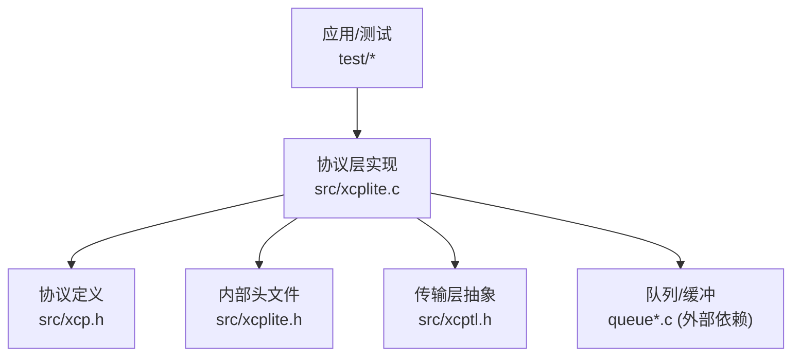
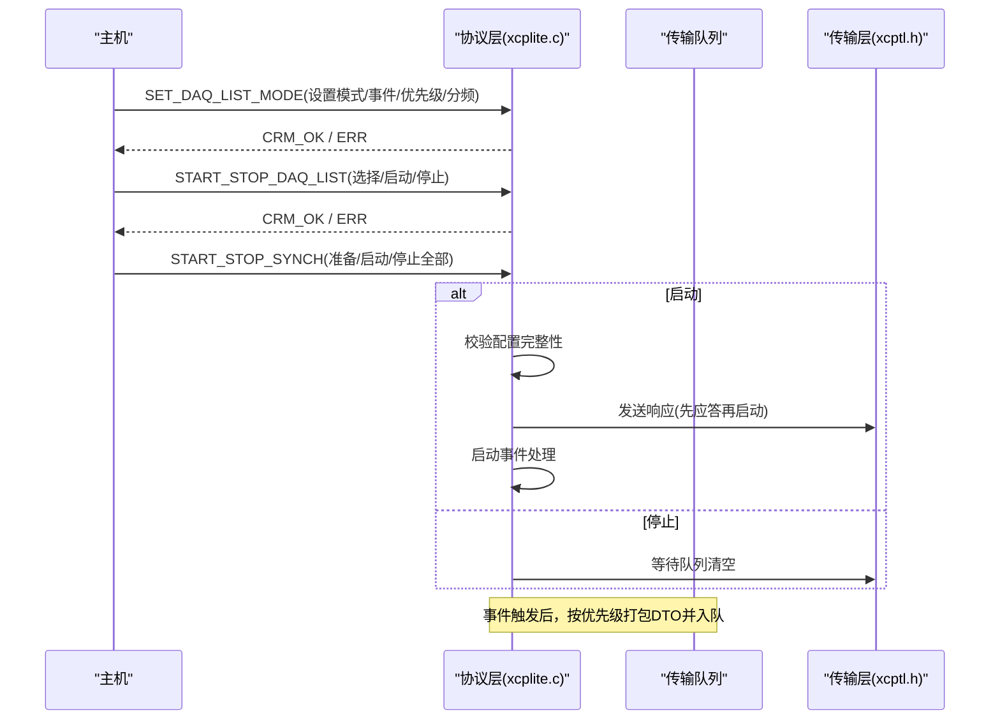
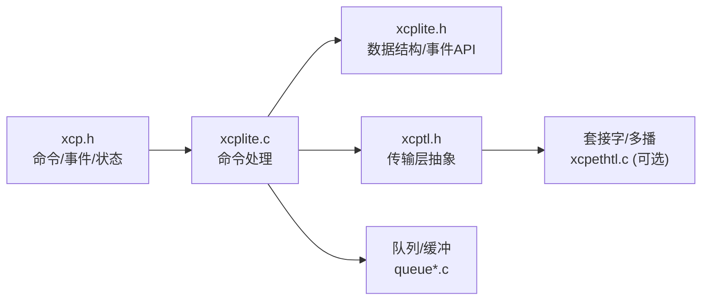

# DAQ事件命令

<cite>
**本文引用的文件**
- [xcp.h](file://src/xcp.h)
- [xcplite.h](file://src/xcplite.h)
- [xcplite.c](file://src/xcplite.c)
- [xcptl.h](file://src/xcptl.h)
- [daq_config_test/main.c](file://test/daq_config_test/src/main.c)
- [daq_test/main.c](file://test/daq_test/src/main.c)
</cite>

## 目录
1. [简介](#简介)
2. [项目结构](#项目结构)
3. [核心组件](#核心组件)
4. [架构总览](#架构总览)
5. [详细组件分析](#详细组件分析)
6. [依赖关系分析](#依赖关系分析)
7. [性能考虑](#性能考虑)
8. [故障排查指南](#故障排查指南)
9. [结论](#结论)
10. [附录](#附录)

## 简介
本文件聚焦于XCPlite中XCP协议的DAQ（数据采集）事件命令处理机制，围绕CLEAR_DAQ、CLEAR_ALL_DAQ、GET_DAQ_CLOCK、START_STOP_DAQ等命令展开，系统阐述：
- DAQ列表管理、事件触发机制与数据采集调度
- ODT（对象描述表）与OCT（对象覆盖表，即ODT Entry）的配置与校验
- 实时数据采集的优先级管理、缓冲区管理与溢出处理
- DAQ性能调优、采样率控制与数据同步策略
- DAQ事件配置的完整示例与最佳实践

## 项目结构
本仓库采用分层组织：协议定义、协议层实现、传输层抽象、应用接口与测试用例。DAQ相关的关键位置如下：
- 协议常量与命令定义：src/xcp.h
- 协议层数据结构与API：src/xcplite.h
- 协议层命令处理与事件调度：src/xcplite.c
- 传输层抽象：src/xcptl.h
- 配置与行为验证：test/daq_config_test/src/main.c、test/daq_test/src/main.c

图表来源
- [xcplite.c:2600-2918](file://src/xcplite.c#L2600-L2918)
- [xcp.h:70-184](file://src/xcp.h#L70-L184)
- [xcplite.h:299-376](file://src/xcplite.h#L299-L376)
- [xcptl.h:19-26](file://src/xcptl.h#L19-L26)

章节来源
- [xcp.h:70-184](file://src/xcp.h#L70-L184)
- [xcplite.h:299-376](file://src/xcplite.h#L299-L376)
- [xcplite.c:2600-2918](file://src/xcplite.c#L2600-L2918)
- [xcptl.h:19-26](file://src/xcptl.h#L19-L26)

## 核心组件
- 命令与错误码：在xcp.h中集中定义，包括DAQ命令、事件码、状态位、模式标志等。
- 协议层数据结构：在xcplite.h中定义tXcpDaqList、tXcpOdt、tXcpEvent、tXcpData等，承载DAQ列表、ODT/OCT、事件与全局状态。
- 命令处理器：在xcplite.c中实现各命令分支，包含SET_DAQ_LIST_MODE、START_STOP_DAQ_LIST、START_STOP_SYNCH、GET_DAQ_CLOCK等。
- 传输层抽象：通过xcptl.h暴露发送与等待队列空等能力，供协议层将DTO/CRM入队或等待。

章节来源
- [xcp.h:70-184](file://src/xcp.h#L70-L184)
- [xcplite.h:299-376](file://src/xcplite.h#L299-L376)
- [xcplite.c:2600-2918](file://src/xcplite.c#L2600-L2918)
- [xcptl.h:19-26](file://src/xcptl.h#L19-L26)

## 架构总览
DAQ事件命令处理的核心流程：
- 主机下发命令（如SET_DAQ_LIST_MODE、START_STOP_DAQ_LIST、START_STOP_SYNCH、GET_DAQ_CLOCK）。
- 协议层解析命令参数，更新DAQ列表状态、关联事件、优先级、分频器。
- 启动时进行配置校验（完整性检查），随后进入运行态。
- 事件触发时按优先级收集ODT数据，组装DTO并写入传输队列；必要时输出事件消息。
- 停止时清理队列并复位状态。

图表来源
- [xcplite.c:2606-2724](file://src/xcplite.c#L2606-L2724)
- [xcptl.h:19-26](file://src/xcptl.h#L19-L26)

章节来源
- [xcplite.c:2606-2724](file://src/xcplite.c#L2606-L2724)
- [xcptl.h:19-26](file://src/xcptl.h#L19-L26)

## 详细组件分析

### CLEAR_DAQ与CLEAR_ALL_DAQ（清除配置）
- CLEAR_DAQ_LIST：释放指定DAQ列表及其ODT/OCT配置，解除事件关联，重置写指针。
- CLEAR_ALL_DAQ：通常通过FREE_DAQ或断开连接完成全量清除；在实现中，分配失败或批量写入错误会触发“配置失效”策略，要求主机重新初始化。
- 行为要点：
  - 清除后所有索引无效，需重新执行ALLOC_*序列。
  - 写指针在清除后必须重新SET_DAQ_PTR，否则WRITE_DAQ返回CRC_SEQUENCE。
  - 测试用例覆盖了FREE_DAQ后的恢复与边界条件。

章节来源
- [xcplite.c:2634-2653](file://src/xcplite.c#L2634-L2653)
- [daq_config_test/main.c:273-332](file://test/daq_config_test/src/main.c#L273-L332)
- [daq_config_test/main.c:334-356](file://test/daq_config_test/src/main.c#L334-L356)

### GET_DAQ_CLOCK（获取时钟）
- 支持扩展格式（64位时间戳、集群ID、同步状态）与兼容格式（32位时间戳）。
- 触发信息标记为“接收时刻采样”，用于多播时钟同步场景。
- 当启用以太网多播时，可通过传输层命令获取多播时钟。

章节来源
- [xcplite.c:2860-2886](file://src/xcplite.c#L2860-L2886)
- [xcplite.c:2788-2823](file://src/xcplite.c#L2788-L2823)
- [xcp.h:742-778](file://src/xcp.h#L742-L778)

### START_STOP_DAQ_LIST与START_STOP_SYNCH（启动/停止）
- START_STOP_DAQ_LIST：对单个DAQ列表进行选择、启动或停止。
  - 选择：置位选中标志。
  - 启动：调用启动列表与全局事件处理。
  - 停止：停止列表，若全部停止则关闭事件处理。
- START_STOP_SYNCH：
  - 准备（可选）：调用ApplXcpPrepareDaq进行资源准备。
  - 启动选中：先发送响应，再启动事件处理，避免竞争。
  - 停止全部：停止DAQ并等待传输队列清空。
- 关键约束：
  - 启动前需确保配置完整（无空洞、地址匹配、尺寸合法）。
  - 运行中禁止修改配置（返回CRC_DAQ_ACTIVE）。

章节来源
- [xcplite.c:2655-2724](file://src/xcplite.c#L2655-L2724)
- [daq_config_test/main.c:224-229](file://test/daq_config_test/src/main.c#L224-L229)
- [daq_config_test/main.c:577-595](file://test/daq_config_test/src/main.c#L577-L595)

### SET_DAQ_LIST_MODE（设置模式/事件/优先级/分频）
- 设置DAQ列表的模式位（仅允许时间戳模式）、关联事件通道、优先级与分频器。
- 运行时不可修改；非法模式位或语法错误立即返回错误。
- 重复设置不会创建重复链接，但可更新优先级并触发队列刷新请求。

章节来源
- [xcplite.c:2606-2624](file://src/xcplite.c#L2606-L2624)
- [daq_config_test/main.c:642-659](file://test/daq_config_test/src/main.c#L642-L659)

### WRITE_DAQ与WRITE_DAQ_MULTIPLE（配置ODT条目）
- WRITE_DAQ：追加一个ODT条目（地址、扩展、大小）。
- WRITE_DAQ_MULTIPLE：批量追加多个条目，任一失败则整体配置失效，需主机重新初始化。
- 限制：
  - 单条最大尺寸受限于XCP_MAX_ODT_ENTRY_SIZE。
  - 批量必须在同一ODT内，且累计不超过DTO上限。
  - 运行中禁止修改配置。

章节来源
- [xcplite.c:2626-2653](file://src/xcplite.c#L2626-L2653)
- [daq_config_test/main.c:495-551](file://test/daq_config_test/src/main.c#L495-L551)

### 事件触发与数据打包（XcpEvent*系列）
- 事件触发函数族（XcpEvent/XcpEventExt/XcpEventAt等）根据事件关联的DAQ列表与优先级，遍历ODT/OCT，读取数据并组装DTO。
- DTO封装包含DAQ头、时间戳与数据载荷；通过队列发送至传输层。
- 事件可绑定动态基址，支持多实例与栈/绝对/模块地址模式。

章节来源
- [xcplite.h:183-199](file://src/xcplite.h#L183-L199)
- [xcplite.c:2988-3009](file://src/xcplite.c#L2988-L3009)
- [daq_test/main.c:263-275](file://test/daq_test/src/main.c#L263-L275)

### ODT与OCT配置与校验
- ODT：描述一个DAQ列表中的连续条目范围（首尾索引、字节数）。
- OCT（ODT Entry）：具体条目，包含地址、扩展、大小。
- 校验规则：
  - 分配阶段：检查内存池是否足够，越界拒绝并可能清配置。
  - 配置阶段：检查条目尺寸、DTO容量、同ODT边界、事件地址匹配。
  - 启动阶段：检查完整性（无空洞、已填充）。
- 测试覆盖了多种边界与回滚策略。

章节来源
- [xcplite.h:301-376](file://src/xcplite.h#L301-L376)
- [daq_config_test/main.c:334-386](file://test/daq_config_test/src/main.c#L334-L386)
- [daq_config_test/main.c:450-465](file://test/daq_config_test/src/main.c#L450-L465)

### 优先级管理与调度
- 每个DAQ列表可设置优先级；相同优先级的DAQ顺序不保证。
- 事件触发时按优先级收集数据，高优先级优先出队。
- 重复设置优先级会触发队列刷新，确保新优先级生效。

章节来源
- [xcplite.c:2606-2624](file://src/xcplite.c#L2606-L2624)
- [daq_config_test/main.c:642-659](file://test/daq_config_test/src/main.c#L642-L659)

### 缓冲区管理与溢出处理
- DTO通过队列缓冲，队列满时记录溢出警告。
- 停止全部DAQ时会等待传输队列清空，避免残留数据。
- 溢出计数可用于监控与告警。

章节来源
- [xcplite.c:2988-3009](file://src/xcplite.c#L2988-L3009)
- [xcplite.c:2715-2720](file://src/xcplite.c#L2715-L2720)
- [xcplite.h:408-416](file://src/xcplite.h#L408-L416)

### 数据同步策略与时钟
- GET_DAQ_CLOCK提供服务器时钟与同步状态，支持扩展格式与多播。
- 事件时间戳基于本地高精度时钟，可在触发时附加精确时间。
- PTP集成（可选）可提供主时钟信息与关系，提升多设备同步精度。

章节来源
- [xcplite.c:2860-2886](file://src/xcplite.c#L2860-L2886)
- [xcplite.c:2788-2823](file://src/xcplite.c#L2788-L2823)
- [xcplite.c:3386-3433](file://src/xcplite.c#L3386-L3433)

## 依赖关系分析

图表来源
- [xcp.h:70-184](file://src/xcp.h#L70-L184)
- [xcplite.c:2600-2918](file://src/xcplite.c#L2600-L2918)
- [xcplite.h:299-376](file://src/xcplite.h#L299-L376)
- [xcptl.h:19-26](file://src/xcptl.h#L19-L26)

章节来源
- [xcp.h:70-184](file://src/xcp.h#L70-L184)
- [xcplite.c:2600-2918](file://src/xcplite.c#L2600-L2918)
- [xcplite.h:299-376](file://src/xcplite.h#L299-L376)
- [xcptl.h:19-26](file://src/xcptl.h#L19-L26)

## 性能考虑
- 采样率控制：
  - 使用事件周期时间与分频器组合控制实际采集频率。
  - 合理设置事件优先级，减少高负载下的抖动。
- 缓冲区与队列：
  - 增大队列容量以覆盖突发流量，避免溢出。
  - 停止DAQ时等待队列清空，降低延迟。
- 数据打包优化：
  - 尽量在同一ODT内批量写入条目，减少跨ODT开销。
  - 控制条目尺寸，避免接近DTO上限导致频繁失败。
- 同步与时间戳：
  - 启用扩展时间戳与PTP（可选）提升多设备同步精度。
  - 使用事件附加时间戳，便于客户端重排序与对齐。

[本节为通用指导，无需特定文件引用]

## 故障排查指南
- 常见错误码与处理：
  - CRC_DAQ_ACTIVE：运行中禁止修改配置，需先停止DAQ。
  - CRC_DAQ_CONFIG：配置不完整或超限，需修复后重试。
  - CRC_OUT_OF_RANGE：参数越界，检查索引与尺寸。
  - CRC_MEMORY_OVERFLOW：内存不足，减少配置规模。
  - CRC_CMD_BUSY：并发冲突，等待或重试。
- 诊断步骤：
  - 检查事件与DAQ关联是否正确（事件名、地址模式）。
  - 确认所有ODT条目已填充，无空洞。
  - 查看队列溢出日志，评估带宽与队列大小。
  - 使用GET_DAQ_CLOCK验证时钟与同步状态。

章节来源
- [xcplite.c:2606-2724](file://src/xcplite.c#L2606-L2724)
- [xcplite.c:2988-3009](file://src/xcplite.c#L2988-L3009)
- [daq_config_test/main.c:577-595](file://test/daq_config_test/src/main.c#L577-L595)

## 结论
XCPlite的DAQ事件命令处理以清晰的命令流、严格的配置校验与高效的队列机制为核心，支持灵活的ODT/OCT配置、事件驱动的数据采集与可扩展的时钟同步。通过合理的优先级管理、缓冲区规划与同步策略，可满足高性能实时采集需求。测试用例覆盖了丰富的边界与异常路径，有助于在生产环境中快速定位问题。

[本节为总结性内容，无需特定文件引用]

## 附录

### DAQ事件配置完整示例（基于测试）
- 基本流程：
  - FREE_DAQ -> ALLOC_DAQ(n) -> ALLOC_ODT(daq, count) -> ALLOC_ODT_ENTRY(daq, odt, entries)
  - SET_DAQ_PTR(daq, odt, entry) -> WRITE_DAQ(size, ext, addr)
  - SET_DAQ_LIST_MODE(daq, event, mode=时间戳, priority, prescaler)
  - START_STOP_DAQ_LIST(daq, mode=选择/启动/停止)
  - START_STOP_SYNCH(mode=准备/启动/停止全部)
- 关键点：
  - 批量写入失败会清除配置，需重新初始化。
  - 运行中禁止修改配置。
  - 事件与地址模式需一致。
  - 启动前确保配置完整。

章节来源
- [daq_config_test/main.c:224-229](file://test/daq_config_test/src/main.c#L224-L229)
- [daq_config_test/main.c:495-551](file://test/daq_config_test/src/main.c#L495-L551)
- [daq_config_test/main.c:577-595](file://test/daq_config_test/src/main.c#L577-L595)

### 最佳实践
- 事件设计：
  - 为不同任务/模块创建独立事件，合理设置周期与优先级。
  - 使用事件名称与实例化机制避免冲突。
- 配置管理：
  - 统一在停止状态下修改配置，避免运行时变更。
  - 批量写入时控制总尺寸，避免超过DTO上限。
- 性能调优：
  - 调整队列大小以匹配峰值带宽。
  - 使用分频器降低高频事件压力。
  - 启用扩展时间戳与PTP（可选）提升同步精度。
- 可靠性：
  - 监听溢出与错误码，及时告警与恢复。
  - 定期统计溢出计数与事件数量，评估系统健康度。

[本节为通用指导，无需特定文件引用]