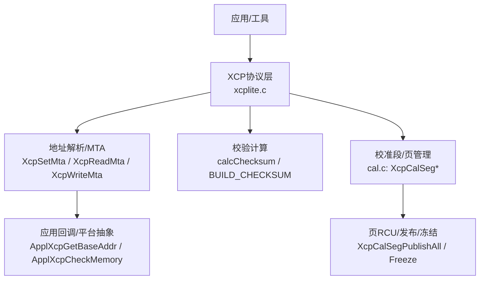
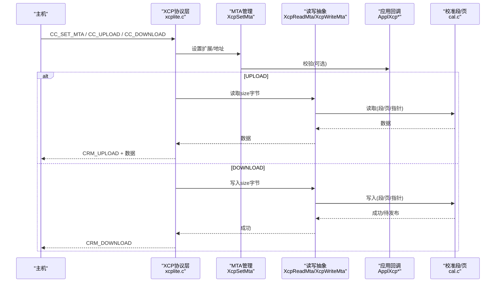
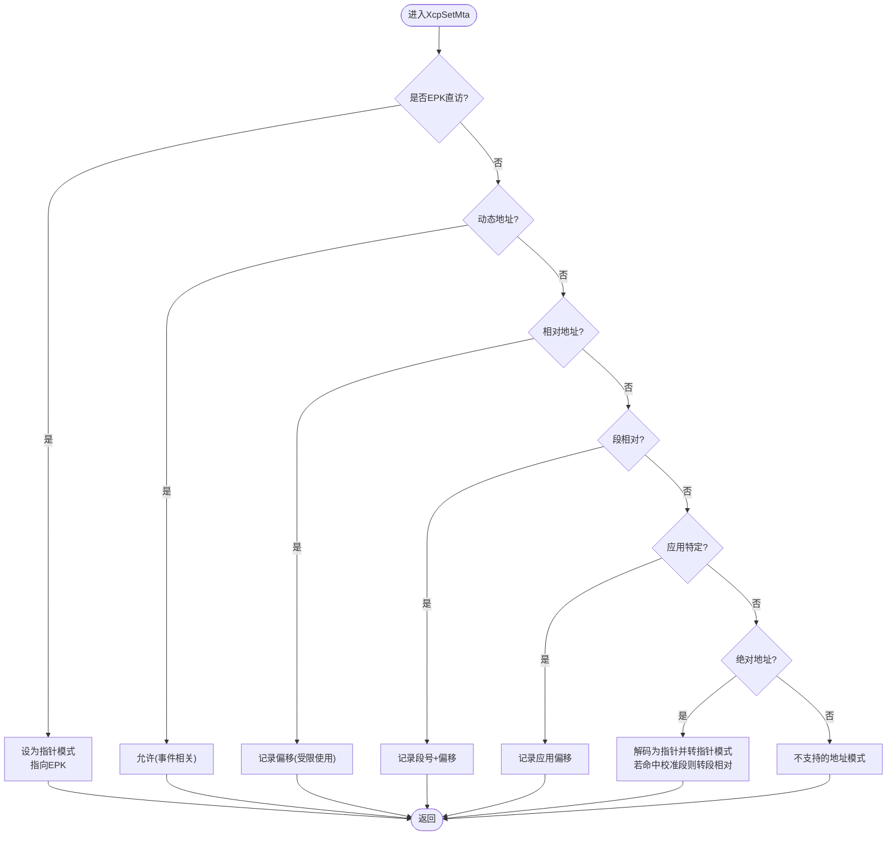
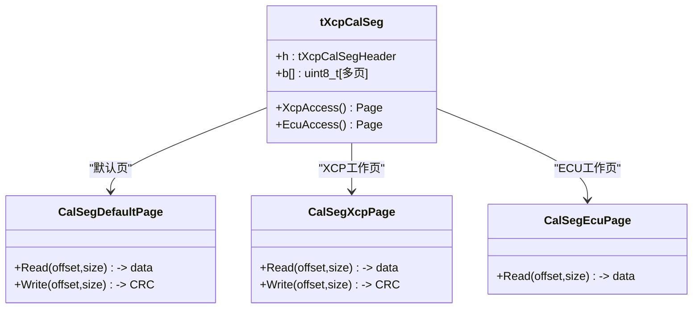
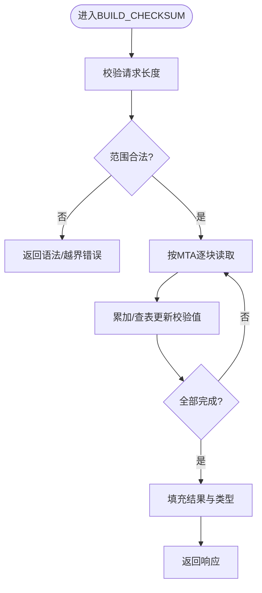
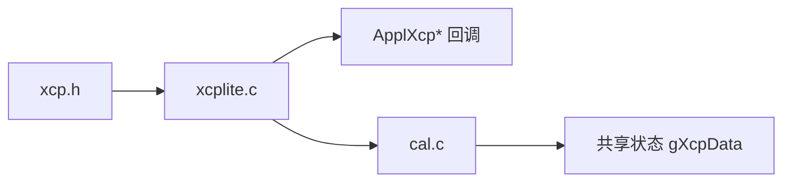

# 内存访问命令

<cite>
**本文引用的文件**
- [xcp.h](file://src/xcp.h)
- [xcplite.c](file://src/xcplite.c)
- [cal.c](file://src/cal.c)
- [XCP_INTRODUCTION.md](file://docs/XCP_INTRODUCTION.md)
</cite>

## 目录
1. [简介](#简介)
2. [项目结构](#项目结构)
3. [核心组件](#核心组件)
4. [架构总览](#架构总览)
5. [详细组件分析](#详细组件分析)
6. [依赖关系分析](#依赖关系分析)
7. [性能考量](#性能考量)
8. [故障排查指南](#故障排查指南)
9. [结论](#结论)
10. [附录](#附录)

## 简介
本文件聚焦于XCPlite中XCP协议的内存访问命令处理，覆盖UPLOAD、DOWNLOAD、SHORT_UPLOAD、SHORT_DOWNLOAD、BUILD_CHECKSUM以及校准页管理（SET_CAL_PAGE/GET_CAL_PAGE/COPY_CAL_PAGE）等。文档重点说明：
- 绝对寻址与相对寻址的实现差异及地址映射流程
- 内存页切换机制、边界检查与安全保护
- 数据校验与完整性验证（BUILD_CHECKSUM）
- 批量数据传输优化、分块与流控制
- 性能优化技巧与错误处理策略
- 典型操作示例与调试方法

## 项目结构
围绕内存访问的核心实现分布在以下文件：
- xcp.h：定义XCP命令码、返回码、协议字段宏等
- xcplite.c：XCP协议层主实现，包含命令分发、MTA设置、上传/下载、校验计算、DAQ配置等
- cal.c：校准段（Calibration Segment）与页管理（RCU）、页发布、冻结/恢复等
- docs/XCP_INTRODUCTION.md：XCP协议背景与概念说明

图表来源
- [xcplite.c:2238-2363](file://src/xcplite.c#L2238-L2363)
- [xcplite.c:738-771](file://src/xcplite.c#L738-L771)
- [cal.c:698-844](file://src/cal.c#L698-L844)

章节来源
- [xcp.h:25-105](file://src/xcp.h#L25-L105)
- [xcplite.c:2238-2471](file://src/xcplite.c#L2238-L2471)
- [cal.c:698-844](file://src/cal.c#L698-L844)

## 核心组件
- 命令与响应定义：在xcp.h中集中定义CC_*命令码、PID_*包类型、CRC_*返回码、各命令CRO/CRM长度与字段偏移宏，便于上层统一解析。
- 协议层主循环：xcplite.c中根据命令码分发到具体处理分支，完成参数校验、地址解析、数据搬运、状态更新与响应组装。
- 内存访问抽象：通过XcpSetMta/XcpReadMta/XcpWriteMta统一封装不同寻址模式（指针、绝对、段相对、应用特定、文件等），并调用应用层回调进行权限与边界检查。
- 校准段与页管理：cal.c提供校准段列表、页RCU、页发布、冻结/恢复、原子事务等能力，确保读一致性与写安全。

章节来源
- [xcp.h:25-105](file://src/xcp.h#L25-L105)
- [xcplite.c:508-711](file://src/xcplite.c#L508-L711)
- [cal.c:698-844](file://src/cal.c#L698-L844)

## 架构总览
下图展示从主机发起的内存访问命令到目标侧的完整路径，包括地址解析、权限检查、数据搬运与响应返回。

图表来源
- [xcplite.c:2238-2363](file://src/xcplite.c#L2238-L2363)
- [xcplite.c:508-711](file://src/xcplite.c#L508-L711)
- [cal.c:698-844](file://src/cal.c#L698-L844)

## 详细组件分析

### 绝对寻址与相对寻址的差异与实现
- 绝对寻址（ABS）：将地址扩展与偏移解码为实际指针，并转换为内部指针模式；若命中校准段则自动转为段相对模式，便于后续页管理。
- 相对寻址（REL）：仅记录偏移，不直接映射到指针；在部分命令（如DOWNLOAD/SHORT_DOWNLOAD/UPLOAD/SHORT_UPLOAD）中被显式拒绝，避免对未绑定基址的相对地址执行写或读。
- 段相对寻址（SEG）：用于校准段访问，结合页RCU实现读写隔离与一致性。

图表来源
- [xcplite.c:618-711](file://src/xcplite.c#L618-L711)

章节来源
- [xcplite.c:618-711](file://src/xcplite.c#L618-L711)

### 内存页切换机制、地址映射与边界检查
- 页模型：每个校准段维护默认页（参考页）、ECU工作页、XCP工作页与空闲页，支持双页RCU与延迟发布。
- 读路径：XcpCalSegReadMemory根据当前XCP访问页选择默认页或XCP工作页，并进行越界检查。
- 写路径：XcpCalSegWriteMemory仅允许写入XCP工作页；若启用延迟/原子模式，标记write_pending并在事务结束时统一发布。
- 边界检查：所有读写均校验offset+size<=segment size，非法访问返回CRC_ACCESS_DENIED。

图表来源
- [cal.c:509-615](file://src/cal.c#L509-L615)
- [cal.c:698-844](file://src/cal.c#L698-L844)

章节来源
- [cal.c:509-615](file://src/cal.c#L509-L615)
- [cal.c:698-844](file://src/cal.c#L698-L844)

### 数据校验与完整性验证（BUILD_CHECKSUM）
- 支持多种校验算法（例如CRC16 CCITT、ADD44），通过calcChecksum按MTA范围迭代计算。
- 命令处理中先校验长度与范围，再调用calcChecksum填充结果与类型。

图表来源
- [xcplite.c:738-771](file://src/xcplite.c#L738-L771)
- [xcplite.c:2456-2471](file://src/xcplite.c#L2456-L2471)

章节来源
- [xcplite.c:738-771](file://src/xcplite.c#L738-L771)
- [xcplite.c:2456-2471](file://src/xcplite.c#L2456-L2471)

### 批量数据传输优化、分块与流控制
- 分块大小限制：UPLOAD/DOWNLOAD受传输层最大CTO/DTO尺寸约束，需按XCPTL_MAX_CTO_SIZE/XCPTL_MAX_DTO_SIZE分块。
- 流控与阻塞：动态地址模式下可能入队等待；相对地址模式在写/读时被拒绝以避免无基址访问。
- 建议实践：
  - 尽量使用对齐的块大小（如4字节对齐）以提升拷贝效率
  - 合理设置块大小以平衡吞吐与延迟
  - 利用短上传/下载（SHORT_*）减少往返开销

章节来源
- [xcplite.c:2277-2363](file://src/xcplite.c#L2277-L2363)

### 错误处理策略
- 常见返回码：CRC_CMD_SYNTAX（语法错误）、CRC_OUT_OF_RANGE（越界）、CRC_ACCESS_DENIED（访问拒绝）、CRC_WRITE_PROTECTED（写保护）、CRC_PAGE_NOT_VALID（无效页）等。
- 关键检查点：
  - 命令长度与字段合法性
  - 地址扩展与寻址模式匹配
  - 校准段页权限（默认页不可写）
  - DAQ运行态下禁止修改配置

章节来源
- [xcp.h:140-166](file://src/xcp.h#L140-L166)
- [xcplite.c:2238-2471](file://src/xcplite.c#L2238-L2471)
- [cal.c:800-844](file://src/cal.c#L800-L844)

## 依赖关系分析
- xcplite.c依赖xcp.h中的命令/响应宏定义，并通过ApplXcp*回调与平台/应用交互。
- cal.c依赖共享状态gXcpData与本地锁，提供线程安全的校准段RCU与发布。
- 命令处理链路：cc_switch -> XcpSetMta -> XcpReadMta/XcpWriteMta -> ApplXcpCheckMemory -> cal.c页访问。

图表来源
- [xcplite.c:508-711](file://src/xcplite.c#L508-L711)
- [cal.c:43-65](file://src/cal.c#L43-L65)

章节来源
- [xcplite.c:508-711](file://src/xcplite.c#L508-L711)
- [cal.c:43-65](file://src/cal.c#L43-L65)

## 性能考量
- 使用按基本类型的“原子”拷贝（1/2/4/8字节）提升写入效率，避免逐字节memcpy。
- 校准段写路径采用RCU与延迟发布，降低频繁页切换开销；必要时可开启懒发布模式。
- 合理设置块大小与对齐，减少总线/内存带宽浪费。
- 在动态地址模式下谨慎使用，避免命令排队带来的额外延迟。

## 故障排查指南
- 常见问题定位：
  - 返回CRC_OUT_OF_RANGE：检查请求长度、地址范围与对齐
  - 返回CRC_ACCESS_DENIED：检查地址扩展、权限与页模式（默认页不可写）
  - 返回CRC_WRITE_PROTECTED：检查是否尝试写入只读页或未解锁资源
  - 返回CRC_PAGE_NOT_VALID：检查页号是否在支持范围内
- 调试建议：
  - 启用调试打印，观察XcpSetMta/XcpReadMta/XcpWriteMta的日志
  - 使用BUILD_CHECKSUM验证数据一致性
  - 通过GET_STATUS/GET_COMM_MODE_INFO确认会话与传输能力
  - 针对校准段变更，使用原子事务Begin/End包裹多次写入，最后统一发布

章节来源
- [xcplite.c:2238-2471](file://src/xcplite.c#L2238-L2471)
- [cal.c:1047-1062](file://src/cal.c#L1047-L1062)

## 结论
XCPlite通过统一的MTA抽象与校准段RCU机制，实现了高效且安全的内存访问。绝对寻址与相对寻址在命令处理中有明确的行为边界，配合严格的边界检查与错误码体系，保障了稳定性与可维护性。借助分块传输、对齐优化与延迟发布，可在保证一致性的前提下获得良好吞吐。

## 附录

### 典型操作流程示例
- 设置MTA并上传数据：
  - 发送CC_SET_MTA（EXT, ADDR）
  - 发送CC_UPLOAD（SIZE）
  - 接收CRM_UPLOAD + 数据
- 短下载：
  - 发送CC_SHORT_DOWNLOAD（EXT, ADDR, SIZE, DATA）
  - 接收CRM_DOWNLOAD
- 构建校验和：
  - 发送CC_BUILD_CHECKSUM（SIZE）
  - 接收CRM_BUILD_CHECKSUM（TYPE, RESULT）

章节来源
- [xcplite.c:2238-2471](file://src/xcplite.c#L2238-L2471)

### 调试方法与技巧
- 打印命令与响应：利用内置打印逻辑观察命令序列与错误码
- 校验一致性：在关键数据区域前后执行BUILD_CHECKSUM对比
- 监控页状态：通过GET_CAL_PAGE/GET_SEGMENT_INFO了解当前页与属性
- 原子事务：对批量校准写入使用Begin/End包裹，减少中间态影响

章节来源
- [xcplite.c:3615-3639](file://src/xcplite.c#L3615-L3639)
- [cal.c:1047-1062](file://src/cal.c#L1047-L1062)