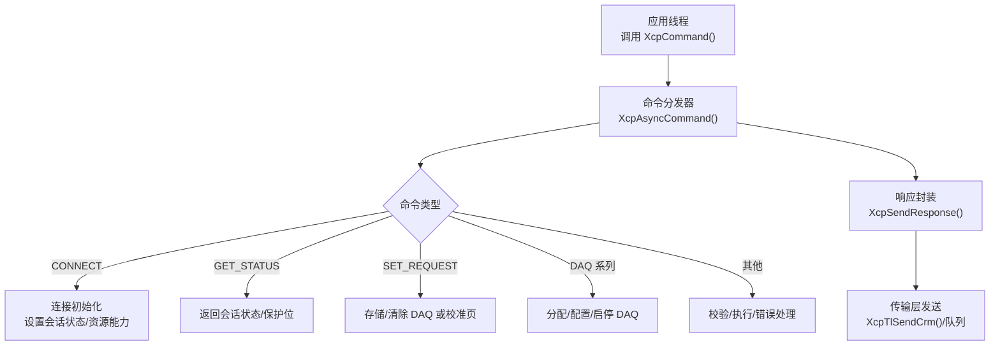
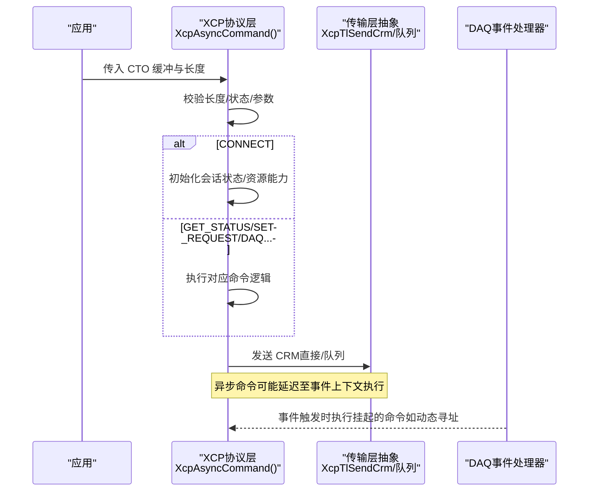
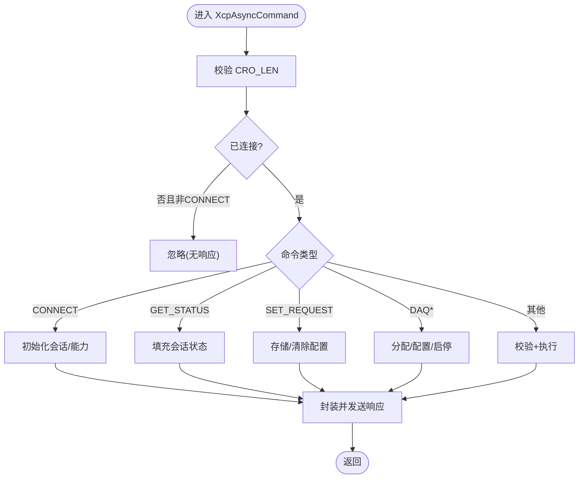
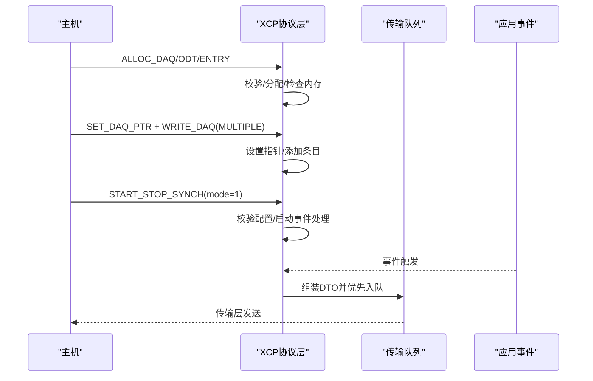
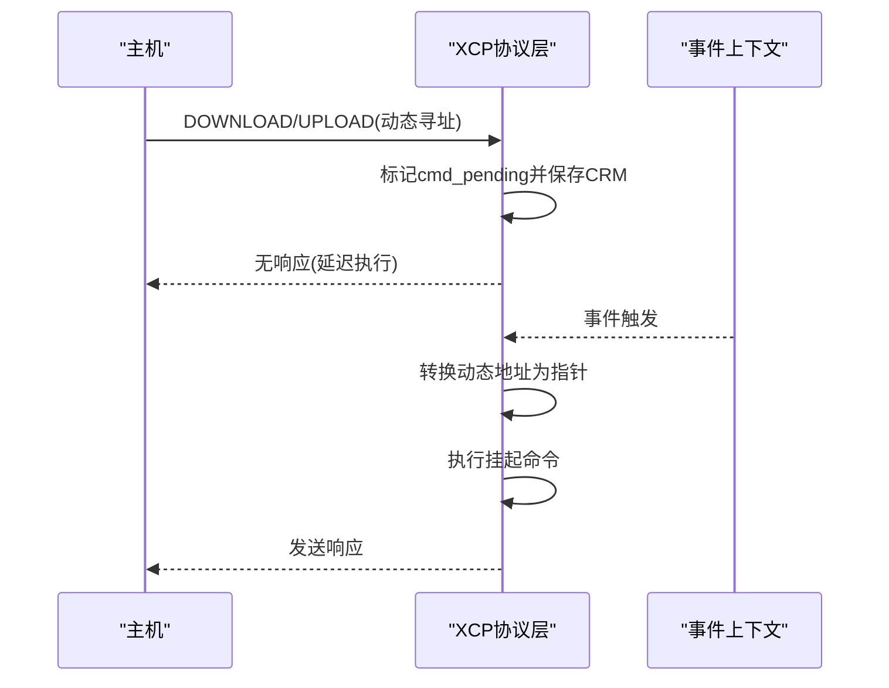
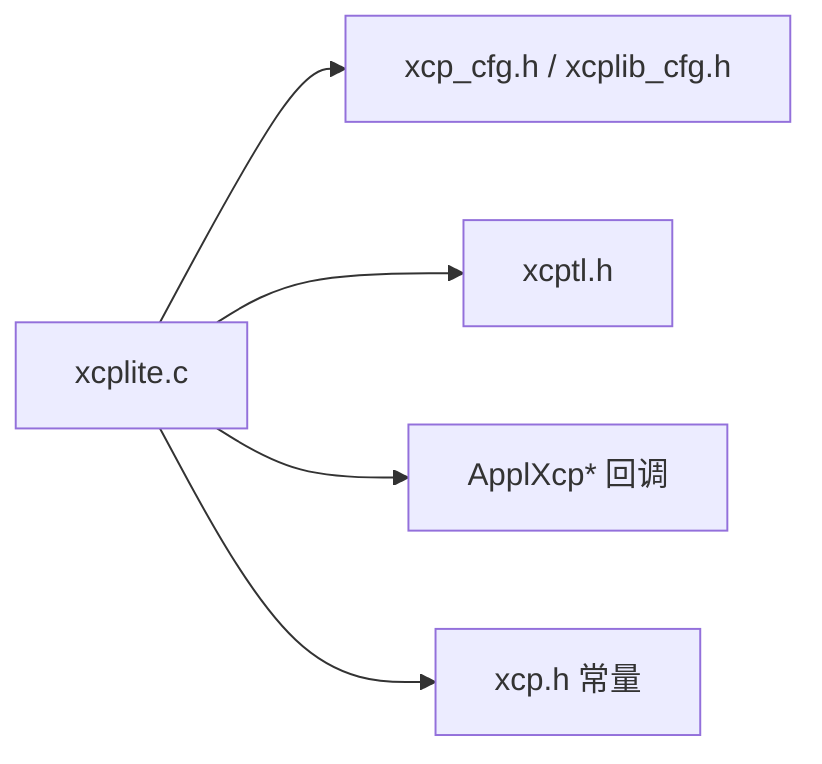

# 命令处理流程

<cite>
**本文引用的文件**
- [src/xcplite.c](file://src/xcplite.c)
- [src/xcp.h](file://src/xcp.h)
- [src/xcp_cfg.h](file://src/xcp_cfg.h)
- [src/xcptl.h](file://src/xcptl.h)
- [src/xcplib_cfg.h](file://src/xcplib_cfg.h)
</cite>

## 目录
1. [简介](#简介)
2. [项目结构](#项目结构)
3. [核心组件](#核心组件)
4. [架构总览](#架构总览)
5. [详细组件分析](#详细组件分析)
6. [依赖关系分析](#依赖关系分析)
7. [性能考量](#性能考量)
8. [故障排查指南](#故障排查指南)
9. [结论](#结论)
10. [附录：新命令添加与自定义处理指南](#附录：新命令添加与自定义处理指南)

## 简介
本文件深入解析 XCPlite 的 XCP 命令处理机制，覆盖 CONNECT、GET_STATUS、SET_REQUEST、DAQ（分配/配置/启停）等核心命令的解析、验证与执行流程；阐述命令队列管理、异步处理与优先级调度；说明超时处理、错误码生成与响应格式化；并给出可配置选项与性能优化技术，以及新增命令的开发指南。

## 项目结构
XCPlite 的命令处理集中在协议层实现中，关键文件职责如下：
- src/xcplite.c：XCP 协议层主实现，包含命令分发、状态机、DAQ 事件触发、响应发送、后台任务等。
- src/xcp.h：XCP 协议常量定义（命令码、返回码、事件码、数据包格式宏等）。
- src/xcp_cfg.h：协议层配置（版本、功能开关、地址扩展模式、DAQ 能力、时钟精度等）。
- src/xcptl.h：传输层抽象接口（发送 CRM、等待队列空、获取计数器）。
- src/xcplib_cfg.h：库级通用配置（日志、队列类型、A2L/ELF 上传、DAQ 内存大小等）。

图表来源
- [src/xcplite.c:2034-2945](file://src/xcplite.c#L2034-L2945)
- [src/xcptl.h:20-25](file://src/xcptl.h#L20-L25)

章节来源
- [src/xcplite.c:2034-2945](file://src/xcplite.c#L2034-L2945)
- [src/xcp.h:19-130](file://src/xcp.h#L19-L130)
- [src/xcptl.h:20-25](file://src/xcptl.h#L20-L25)

## 核心组件
- 命令入口与分发：XcpCommand/XcpAsyncCommand 负责统一入口、长度校验、状态检查、switch 分发到具体命令处理分支。
- 响应封装与发送：XcpSendResponse 将 CRM 缓冲区通过直接发送或队列发送，支持高优先级与异步路径。
- DAQ 事件与触发：XcpEventExt/XcpEvent 在应用侧触发事件，内部遍历关联的 DAQ 列表，组装 DTO 并入队。
- 地址空间与 MTA：XcpSetMta/XcpReadMta/XcpWriteMta 支持绝对、段相对、应用回调、动态事件相对等多种寻址。
- 配置与能力：xcp_cfg.h/xcplib_cfg.h 控制是否启用 DAQ 事件表、预分频、超时、A2L/ELF 上传、队列类型等。

章节来源
- [src/xcplite.c:2034-2945](file://src/xcplite.c#L2034-L2945)
- [src/xcplite.c:509-711](file://src/xcplite.c#L509-L711)
- [src/xcp_cfg.h:29-359](file://src/xcp_cfg.h#L29-L359)
- [src/xcplib_cfg.h:41-169](file://src/xcplib_cfg.h#L41-L169)

## 架构总览
下图展示从命令进入、解析、执行到响应发送的整体流程，以及与传输层的交互。

图表来源
- [src/xcplite.c:2034-2945](file://src/xcplite.c#L2034-L2945)
- [src/xcptl.h:20-25](file://src/xcptl.h#L20-L25)

## 详细组件分析

### 命令入口与分发（XcpAsyncCommand）
- 统一入口：XcpCommand 委托给 XcpAsyncCommand，后者负责所有命令的解析与执行。
- 默认响应准备：CRM_CMD=PID_RES，CRM_LEN=1，后续由具体命令填充。
- 状态检查：非 CONNECT 且未连接则忽略（无响应），长度越界则语法错误。
- 分发策略：switch 按 CC_xxx 分发，未知命令返回 CRC_CMD_UNKNOWN。
- 错误处理：使用 error(e)/check_error(e) 宏跳转到 negative_response，统一封装 PID_ERR。
- 特殊路径：CC_SYNCH 返回 ERR_CMD_SYNCH；CC_NOP 不响应；部分命令走 no_response（如多播、延迟执行）。

图表来源
- [src/xcplite.c:2034-2945](file://src/xcplite.c#L2034-L2945)

章节来源
- [src/xcplite.c:2034-2945](file://src/xcplite.c#L2034-L2945)
- [src/xcp.h:140-184](file://src/xcp.h#L140-L184)

### CONNECT 命令
- 行为：若应用允许连接，则设置会话状态为激活/启动/已连接，并复位 DAQ。
- 响应：返回协议版本、传输版本、最大 CTO/DTO、支持资源（DAQ/CAL）、通信模式。
- 兼容性：默认进入“遗留模式”，可通过时间同步属性切换扩展格式。

章节来源
- [src/xcplite.c:2051-2084](file://src/xcplite.c#L2051-L2084)
- [src/xcp.h:476-485](file://src/xcp.h#L476-L485)

### GET_STATUS 命令
- 行为：返回当前会话状态低字节、保护状态（当前固定为0）、配置ID（若启用恢复）。
- 用途：客户端用于判断 ECU 状态与配置标识。

章节来源
- [src/xcplite.c:2226-2236](file://src/xcplite.c#L2226-L2236)
- [src/xcp.h:491-497](file://src/xcp.h#L491-L497)

### SET_REQUEST 命令
- 行为：根据模式位执行不同操作：
  - 存储/清除 DAQ 配置（若启用恢复）。
  - 冻结校准页（若启用 FREEZE_CAL_PAGE）。
- 错误：未实现模式返回 CRC_OUT_OF_RANGE。

章节来源
- [src/xcplite.c:2243-2275](file://src/xcplite.c#L2243-L2275)
- [src/xcp.h:318-326](file://src/xcp.h#L318-L326)

### DAQ 命令族（ALLOC/SET_MODE/START_STOP 等）
- ALLOC_DAQ/ALLOC_ODT/ALLOC_ODT_ENTRY：动态分配 DAQ 列表、ODT、条目，并进行内存溢出检查与顺序校验。
- SET_DAQ_PTR/WRITE_DAQ/WRITE_DAQ_MULTIPLE：设置指针并添加 ODT 条目，批量写入时任一失败则清空配置。
- START_STOP_DAQ_LIST：选择/启动/停止单个 DAQ 列表；启动会触发事件处理。
- START_STOP_SYNCH：准备/启动/停止选中的 DAQ 列表；启动前可选择性校验配置一致性。
- 事件驱动：DAQ 数据通过事件触发，组装 DTO 并优先入队，支持 overrun 指示与优先级。

图表来源
- [src/xcplite.c:2562-2724](file://src/xcplite.c#L2562-L2724)
- [src/xcplite.c:1584-1754](file://src/xcplite.c#L1584-L1754)

章节来源
- [src/xcplite.c:2562-2724](file://src/xcplite.c#L2562-L2724)
- [src/xcplite.c:1584-1754](file://src/xcplite.c#L1584-L1754)
- [src/xcp.h:328-424](file://src/xcp.h#L328-L424)

### 异步命令与动态寻址
- 动态寻址场景下，某些命令（DOWNLOAD/SHORT_DOWNLOAD/UPLOAD/BUILD_CHECKSUM）无法在当前上下文立即访问目标内存，会被推入待执行队列。
- 当关联的事件触发时，系统会将动态地址转换为实际指针，并执行挂起命令。
- 若已有待执行命令，则返回忙（CRC_CMD_BUSY）。

图表来源
- [src/xcplite.c:2009-2024](file://src/xcplite.c#L2009-L2024)
- [src/xcplite.c:1757-1773](file://src/xcplite.c#L1757-L1773)
- [src/xcplite.c:2277-2363](file://src/xcplite.c#L2277-L2363)
- [src/xcplite.c:2455-2473](file://src/xcplite.c#L2455-L2473)

章节来源
- [src/xcplite.c:2009-2024](file://src/xcplite.c#L2009-L2024)
- [src/xcplite.c:1757-1773](file://src/xcplite.c#L1757-L1773)
- [src/xcplite.c:2277-2363](file://src/xcplite.c#L2277-L2363)
- [src/xcplite.c:2455-2473](file://src/xcplite.c#L2455-L2473)

### 响应封装与发送（XcpSendResponse）
- 非异步路径可直接调用传输层发送；异步路径通过队列发送以确保线程安全。
- 事件产生的响应使用高优先级入队，避免被普通数据积压阻塞。
- 多播响应使用专用函数发送。

章节来源
- [src/xcplite.c:1967-2007](file://src/xcplite.c#L1967-L2007)
- [src/xcptl.h:20-25](file://src/xcptl.h#L20-L25)

### 超时与队列处理
- 停止 DAQ 后等待传输队列清空，防止残留数据影响后续状态。
- 队列溢出时记录 overrun 计数或置位状态位，简化客户端重同步。

章节来源
- [src/xcplite.c:1942-1965](file://src/xcplite.c#L1942-L1965)
- [src/xcplite.c:1601-1612](file://src/xcplite.c#L1601-L1612)
- [src/xcp_cfg.h:388-389](file://src/xcp_cfg.h#L388-L389)

### 错误码与响应格式化
- 错误码集中定义于 xcp.h，涵盖命令未知、语法错误、范围越界、访问拒绝、DAQ 配置错误、内存溢出等。
- 错误路径统一封装为 PID_ERR，长度=2，携带错误码。
- 调试输出提供错误码字符串映射，便于定位问题。

章节来源
- [src/xcp.h:140-184](file://src/xcp.h#L140-L184)
- [src/xcplite.c:2920-2945](file://src/xcplite.c#L2920-L2945)
- [src/xcplite.c:3700-3784](file://src/xcplite.c#L3700-L3784)

## 依赖关系分析
- 协议层依赖传输层抽象进行发送与队列管理。
- 配置头文件决定功能开关与能力上报（如 DAQ 特性、时间戳格式、PAG/PQM 支持等）。
- 应用回调（ApplXcp*）用于内存访问、ID 查询、时钟、DA 启动/停止等。

图表来源
- [src/xcplite.c:2034-2945](file://src/xcplite.c#L2034-L2945)
- [src/xcp_cfg.h:29-359](file://src/xcp_cfg.h#L29-L359)
- [src/xcplib_cfg.h:41-169](file://src/xcplib_cfg.h#L41-L169)
- [src/xcptl.h:20-25](file://src/xcptl.h#L20-L25)
- [src/xcp.h:19-130](file://src/xcp.h#L19-L130)

章节来源
- [src/xcplite.c:2034-2945](file://src/xcplite.c#L2034-L2945)
- [src/xcp_cfg.h:29-359](file://src/xcp_cfg.h#L29-L359)
- [src/xcplib_cfg.h:41-169](file://src/xcplib_cfg.h#L41-L169)
- [src/xcptl.h:20-25](file://src/xcptl.h#L20-L25)
- [src/xcp.h:19-130](file://src/xcp.h#L19-L130)

## 性能考量
- 队列类型：64位平台默认使用可变项大小的无锁队列，兼顾吞吐与内存效率；也可选择固定项大小以最大化性能。
- DTO 累积与优先级：DAQ 数据在高优先级队列中发送，减少延迟；支持包累积以提升带宽利用率。
- 地址访问优化：MTA 读写针对 1/2/4/8 字节采用原子式拷贝，减少循环开销。
- 事件触发优化：事件表支持预注册与索引查找，降低遍历成本；可选禁用事件信息以减少开销。
- 超时与清理：停止 DAQ 后等待队列清空，避免拥塞；队列溢出时快速跳过剩余数据，简化客户端同步。

章节来源
- [src/xcplib_cfg.h:143-162](file://src/xcplib_cfg.h#L143-L162)
- [src/xcplite.c:1584-1754](file://src/xcplite.c#L1584-L1754)
- [src/xcplite.c:509-608](file://src/xcplite.c#L509-L608)
- [src/xcp_cfg.h:388-389](file://src/xcp_cfg.h#L388-L389)

## 故障排查指南
- 常见错误码含义：
  - CRC_CMD_UNKNOWN：未知命令或子命令。
  - CRC_CMD_SYNTAX：命令长度或字段非法。
  - CRC_OUT_OF_RANGE：参数超出范围。
  - CRC_ACCESS_DENIED：访问被拒绝（如相对寻址禁止写入）。
  - CRC_DAQ_CONFIG：DAQ 配置不完整或不一致。
  - CRC_MEMORY_OVERFLOW：DAQ 表内存不足。
  - CRC_CMD_BUSY：存在待执行的异步命令。
- 诊断建议：
  - 检查 CONNECT 后的会话状态与能力。
  - 确认 DAQ 配置顺序：ALLOC -> SET_PTR -> WRITE -> START。
  - 关注队列溢出与 overrun 标志，必要时调整 DTO 大小或事件频率。
  - 使用调试打印查看命令与响应细节。

章节来源
- [src/xcp.h:140-184](file://src/xcp.h#L140-L184)
- [src/xcplite.c:2920-2945](file://src/xcplite.c#L2920-L2945)
- [src/xcplite.c:3700-3784](file://src/xcplite.c#L3700-L3784)

## 结论
XCPlite 的命令处理以统一的 XcpAsyncCommand 为核心，结合严格的参数校验、清晰的错误路径与高效的响应发送机制，实现了稳定可靠的 XCP 协议栈。DAQ 子系统通过事件驱动与优先级队列保障实时性与吞吐。通过丰富的配置选项，可在不同平台上灵活权衡性能与功能。

## 附录：新命令添加与自定义处理指南
- 步骤概览：
  1. 在 xcp.h 中定义命令码与请求/响应结构宏。
  2. 在 xcplite.c 的命令分发 switch 中添加 case 分支，完成参数校验与业务逻辑。
  3. 如需异步执行（动态寻址），使用 XcpPushCommand 挂起并在事件上下文中执行。
  4. 封装响应到 CRM 并通过 XcpSendResponse 发送；错误或忙路径跳转至相应标签。
  5. 更新能力上报（如 GET_COMM_MODE_INFO/GET_DAQ_PROCESSOR_INFO）以暴露新功能。
  6. 在调试输出中增加命令/响应打印，便于联调。
- 注意事项：
  - 保持命令长度与字段对齐，遵循 XCP 规范。
  - 对共享状态变更需考虑线程安全（尤其在事件上下文）。
  - 合理设置优先级与队列策略，避免阻塞关键路径。
  - 若涉及内存访问，确保地址扩展与权限校验。

章节来源
- [src/xcp.h:19-130](file://src/xcp.h#L19-L130)
- [src/xcplite.c:2034-2945](file://src/xcplite.c#L2034-L2945)
- [src/xcplite.c:2009-2024](file://src/xcplite.c#L2009-L2024)
- [src/xcplite.c:3494-3943](file://src/xcplite.c#L3494-L3943)