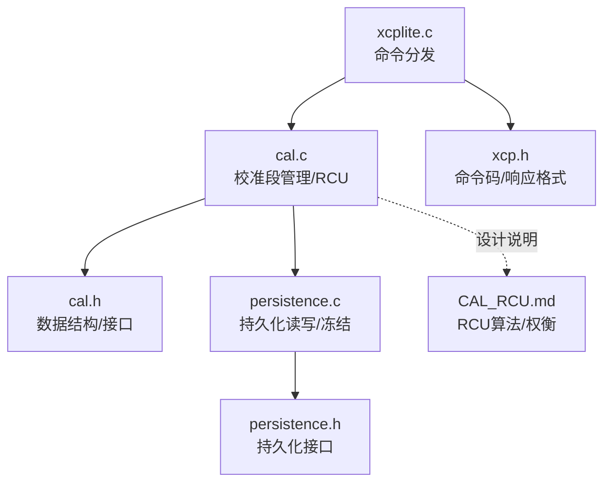
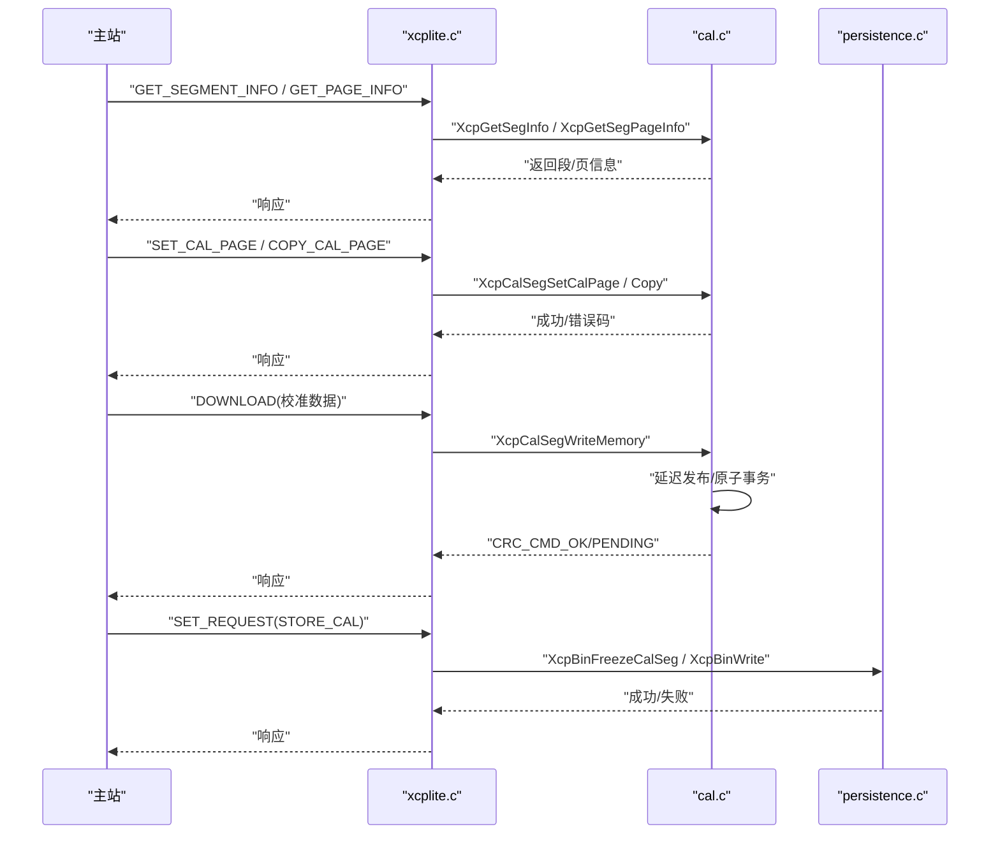
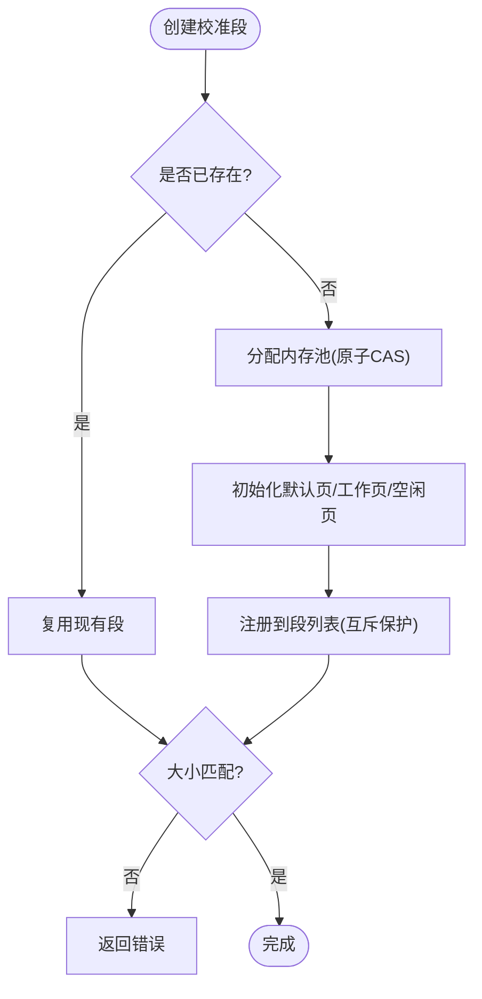
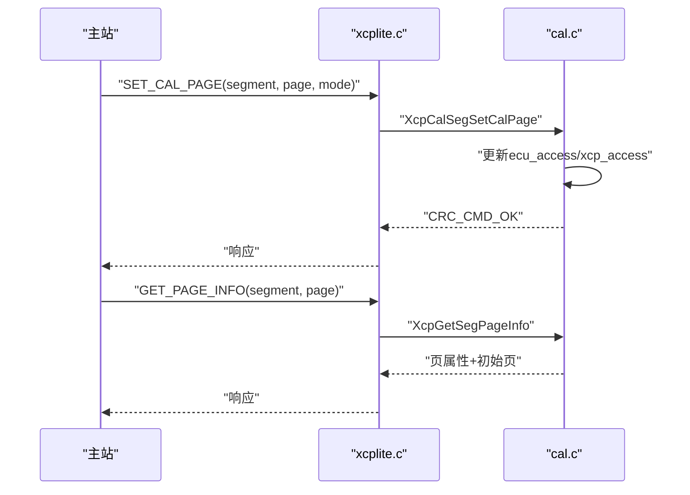
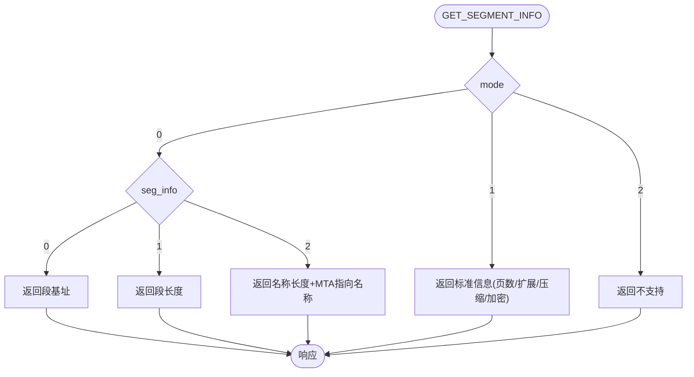
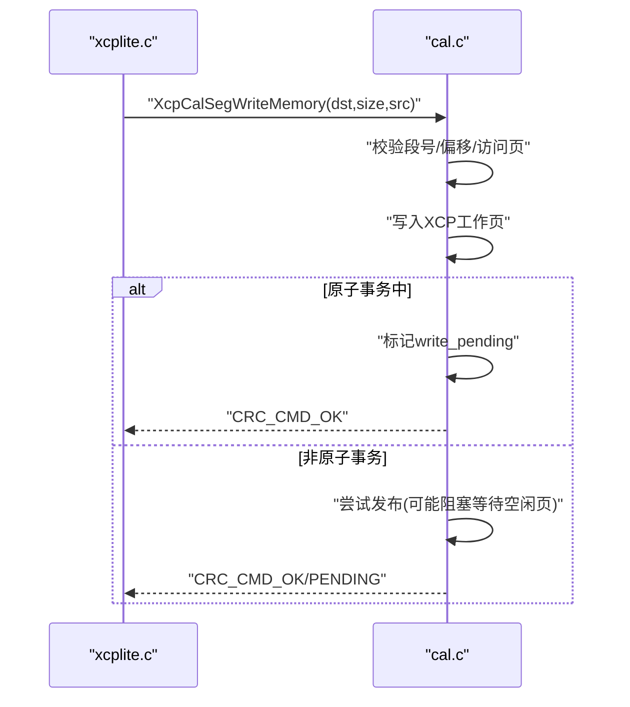
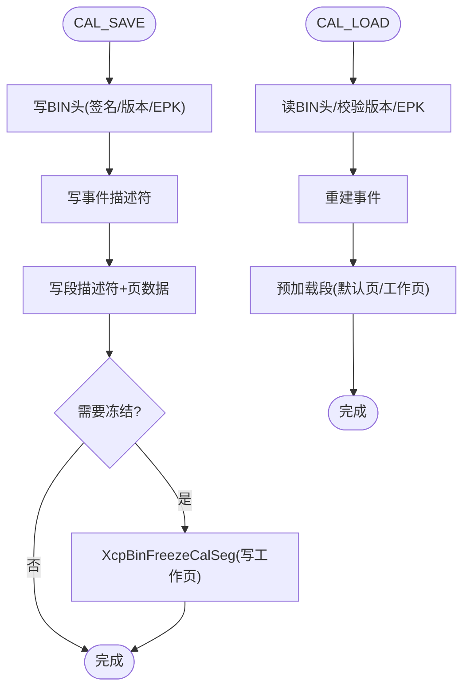
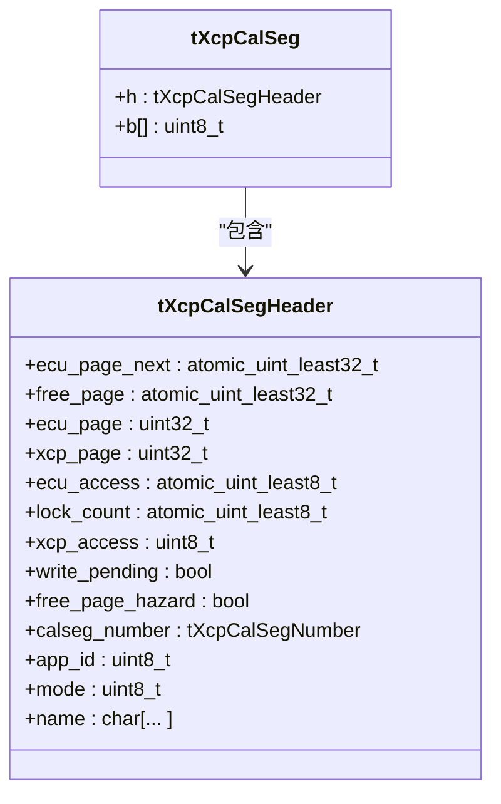
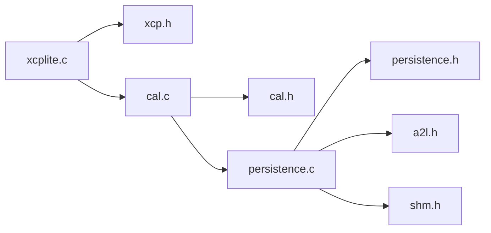

# 校准命令

<cite>
**本文引用的文件**
- [cal.c](file://src/cal.c)
- [cal.h](file://src/cal.h)
- [persistence.c](file://src/persistence.c)
- [persistence.h](file://src/persistence.h)
- [xcp.h](file://src/xcp.h)
- [xcplite.c](file://src/xcplite.c)
- [CAL_RCU.md](file://docs/CAL_RCU.md)
</cite>

## 目录
1. [简介](#简介)
2. [项目结构](#项目结构)
3. [核心组件](#核心组件)
4. [架构总览](#架构总览)
5. [详细组件分析](#详细组件分析)
6. [依赖关系分析](#依赖关系分析)
7. [性能考量](#性能考量)
8. [故障排除指南](#故障排除指南)
9. [结论](#结论)
10. [附录](#附录)

## 简介
本文件深入解析 XCPlite 中 XCP 协议的校准命令处理，覆盖 CAL_GET_ID、CAL_GET_SIZE、CAL_LOAD、CAL_SAVE 等与校准段管理相关的命令。重点说明：
- 校准段（Calibration Segment）与校准块（Calibration Block）的创建、注册与管理
- 版本控制与冲突检测机制（基于名称、大小、页尺寸与预加载位置）
- 校准数据的持久化存储、备份恢复与一致性保证（BIN 文件读写、冻结写入）
- 多线程环境下的安全访问、锁机制与并发控制（RCU 风格无锁读、原子发布）
- 校准工作流程优化、增量更新与回滚策略（延迟发布、原子事务、冻结）
- 完整示例与故障排除要点

## 项目结构
XCPlite 将校准相关逻辑集中在以下模块：
- 协议层常量与命令定义：xcp.h
- 校准段管理与 RCU 实现：cal.c / cal.h
- 持久化（BIN 文件）：persistence.c / persistence.h
- 命令分发与调用：xcplite.c
- 算法与设计说明：docs/CAL_RCU.md

图表来源
- [xcplite.c:2360-2450](file://src/xcplite.c#L2360-L2450)
- [cal.c:872-946](file://src/cal.c#L872-L946)
- [xcp.h:47-68](file://src/xcp.h#L47-L68)
- [persistence.c:248-318](file://src/persistence.c#L248-L318)

章节来源
- [xcplite.c:2360-2450](file://src/xcplite.c#L2360-L2450)
- [cal.c:872-946](file://src/cal.c#L872-L946)
- [xcp.h:47-68](file://src/xcp.h#L47-L68)
- [persistence.c:248-318](file://src/persistence.c#L248-L318)

## 核心组件
- 校准段列表与内存池：线程安全的 bump allocator，维护段索引、偏移与计数
- 段头与页面管理：默认页、ECU工作页、XCP工作页、空闲页；原子指针/偏移
- 命令处理器：GET_SEGMENT_INFO、GET_PAGE_INFO、SET_CAL_PAGE、COPY_CAL_PAGE 等
- 持久化：写 BIN（默认页或工作页）、加载预加载段、冻结工作页到文件
- RCU 发布：延迟发布与原子事务，确保多读者一致性与低开销

章节来源
- [cal.c:91-117](file://src/cal.c#L91-L117)
- [cal.c:185-204](file://src/cal.c#L185-L204)
- [cal.c:427-515](file://src/cal.c#L427-L515)
- [cal.c:623-689](file://src/cal.c#L623-L689)
- [cal.c:723-798](file://src/cal.c#L723-L798)
- [cal.c:803-844](file://src/cal.c#L803-L844)
- [cal.c:872-946](file://src/cal.c#L872-L946)
- [cal.c:1047-1062](file://src/cal.c#L1047-L1062)
- [persistence.c:248-318](file://src/persistence.c#L248-L318)
- [persistence.c:327-365](file://src/persistence.c#L327-L365)
- [persistence.c:375-521](file://src/persistence.c#L375-L521)

## 架构总览
XCP 命令进入 xcplite.c 的分发器，根据命令类型路由到校准段管理函数（cal.c），必要时调用持久化模块（persistence.c）。校准数据通过 RCU 模式在单写者（XCP 服务器线程）与多读者（应用线程）之间安全共享。

图表来源
- [xcplite.c:2360-2450](file://src/xcplite.c#L2360-L2450)
- [cal.c:803-844](file://src/cal.c#L803-L844)
- [cal.c:1047-1062](file://src/cal.c#L1047-L1062)
- [persistence.c:248-318](file://src/persistence.c#L248-L318)
- [persistence.c:327-365](file://src/persistence.c#L327-L365)

## 详细组件分析

### 校准段管理（创建、注册、查找）
- 段列表初始化与销毁：初始化原子计数、内存使用量、互斥锁
- 预注册：从 ELF/Mach-O 节区扫描描述符并创建段
- 创建段/块：支持查找重复名、对齐页大小、分配内存池、初始化默认页/工作页
- 查找：按名称、地址、段号查找，SHM 模式下按 app_id 隔离

图表来源
- [cal.c:122-180](file://src/cal.c#L122-L180)
- [cal.c:375-503](file://src/cal.c#L375-L503)
- [cal.c:398-421](file://src/cal.c#L398-L421)
- [cal.c:509-615](file://src/cal.c#L509-L615)

章节来源
- [cal.c:185-204](file://src/cal.c#L185-L204)
- [cal.c:236-304](file://src/cal.c#L236-L304)
- [cal.c:375-503](file://src/cal.c#L375-L503)
- [cal.c:509-615](file://src/cal.c#L509-L615)

### 页面切换与访问控制（GET/SET_CAL_PAGE, GET_PAGE_INFO）
- SET_CAL_PAGE：设置 ECU/XCP 访问页（默认页或工作页），可批量作用于所有段
- GET_CAL_PAGE：查询当前访问页
- GET_PAGE_INFO：返回页属性（ECU/XCP 读写能力）与初始页

图表来源
- [xcplite.c:2366-2404](file://src/xcplite.c#L2366-L2404)
- [cal.c:950-1001](file://src/cal.c#L950-L1001)
- [cal.c:917-946](file://src/cal.c#L917-L946)

章节来源
- [xcplite.c:2366-2404](file://src/xcplite.c#L2366-L2404)
- [cal.c:950-1001](file://src/cal.c#L950-L1001)
- [cal.c:917-946](file://src/cal.c#L917-L946)

### 段信息查询（GET_SEGMENT_INFO）
- Mode 0：获取基础信息（地址/长度/名称）
- Mode 1：标准信息（最大页数、地址扩展、压缩/加密标志）
- Mode 2：映射信息（未实现）

图表来源
- [cal.c:872-915](file://src/cal.c#L872-L915)
- [xcplite.c:2437-2444](file://src/xcplite.c#L2437-L2444)

章节来源
- [cal.c:872-915](file://src/cal.c#L872-L915)
- [xcplite.c:2437-2444](file://src/xcplite.c#L2437-L2444)

### 写入与发布（DOWNLOAD -> XcpCalSegWriteMemory -> Publish）
- 写入目标为 XCP 工作页，禁止写入默认页
- 支持延迟发布（原子事务期间不立即更新 ECU 页）
- 发布时等待空闲页可用，复制旧 XCP 页到新页，更新 ECU 下一页指针

图表来源
- [cal.c:803-844](file://src/cal.c#L803-L844)
- [cal.c:723-767](file://src/cal.c#L723-L767)
- [cal.c:1047-1062](file://src/cal.c#L1047-L1062)

章节来源
- [cal.c:803-844](file://src/cal.c#L803-L844)
- [cal.c:723-767](file://src/cal.c#L723-L767)
- [cal.c:1047-1062](file://src/cal.c#L1047-L1062)

### 持久化存储、备份恢复与一致性（CAL_SAVE/CAL_LOAD）
- 写 BIN：记录事件、段描述符与工作页/默认页数据，保存 EPK、应用列表（SHM）
- 冻结：将指定段的当前工作页写入 BIN 对应偏移
- 加载：读取 BIN 头部、事件、段描述符，预加载段并恢复页数据
- 版本控制：签名与版本号校验，EPK 匹配检查

图表来源
- [persistence.c:248-318](file://src/persistence.c#L248-L318)
- [persistence.c:327-365](file://src/persistence.c#L327-L365)
- [persistence.c:375-521](file://src/persistence.c#L375-L521)

章节来源
- [persistence.c:248-318](file://src/persistence.c#L248-L318)
- [persistence.c:327-365](file://src/persistence.c#L327-L365)
- [persistence.c:375-521](file://src/persistence.c#L375-L521)

### 多线程安全访问与并发控制
- 读路径：XcpLockCalSeg/XcpUnlockCalSeg，原子 lock_count 与 ecu_page_next 更新，无锁等待
- 写路径：单写者（XCP 服务器线程），原子 CAS 分配空闲页，延迟发布
- 原子事务：Begin/End 包裹多个写入，统一发布，保证一致性
- 竞争与饥饿：在高负载下可能出现可见性延迟或超时，需合理调用 PublishAll

图表来源
- [cal.h:86-157](file://src/cal.h#L86-L157)
- [cal.c:623-689](file://src/cal.c#L623-L689)
- [cal.c:723-767](file://src/cal.c#L723-L767)
- [cal.c:1047-1062](file://src/cal.c#L1047-L1062)

章节来源
- [cal.h:86-157](file://src/cal.h#L86-L157)
- [cal.c:623-689](file://src/cal.c#L623-L689)
- [cal.c:723-767](file://src/cal.c#L723-L767)
- [cal.c:1047-1062](file://src/cal.c#L1047-L1062)

### 版本控制与冲突检测
- 段创建时检查名称与大小一致性，避免重复或冲突
- 预加载段通过文件位置与 EPK 进行版本匹配
- 加载 BIN 时校验签名、版本与 EPK，防止不兼容配置

章节来源
- [cal.c:427-503](file://src/cal.c#L427-L503)
- [persistence.c:375-404](file://src/persistence.c#L375-L404)

### 校准工作流程优化、增量更新与回滚策略
- 延迟发布：在原子事务期间累积写入，减少频繁页交换
- 增量更新：COPY_CAL_PAGE 可将默认页复制到工作页，作为增量基准
- 回滚策略：冻结后写回 BIN，结合预加载可在启动时恢复到已知状态

章节来源
- [cal.c:803-844](file://src/cal.c#L803-L844)
- [cal.c:1003-1044](file://src/cal.c#L1003-L1044)
- [persistence.c:327-365](file://src/persistence.c#L327-L365)

## 依赖关系分析
- xcplite.c 依赖 xcp.h 的命令定义，调用 cal.c 的校准段接口
- cal.c 依赖 cal.h 的数据结构与平台抽象，必要时调用 persistence.c
- persistence.c 依赖 a2l.h、shm.h、xcp_cfg.h 等配置与工具

图表来源
- [xcplite.c:2360-2450](file://src/xcplite.c#L2360-L2450)
- [cal.c:872-946](file://src/cal.c#L872-L946)
- [persistence.c:248-318](file://src/persistence.c#L248-L318)

章节来源
- [xcplite.c:2360-2450](file://src/xcplite.c#L2360-L2450)
- [cal.c:872-946](file://src/cal.c#L872-L946)
- [persistence.c:248-318](file://src/persistence.c#L248-L318)

## 性能考量
- RCU 读路径无锁、等待自由，适合高频读取
- 写路径单写者，原子 CAS 分配空闲页，避免复杂锁
- 延迟发布降低页交换频率，提高吞吐
- 在高竞争场景下可能出现可见性延迟或超时，需合理调度 PublishAll

章节来源
- [CAL_RCU.md:63-92](file://docs/CAL_RCU.md#L63-L92)
- [CAL_RCU.md:187-321](file://docs/CAL_RCU.md#L187-L321)

## 故障排除指南
- 常见错误码：
  - CRC_ACCESS_DENIED：访问默认页或无效段
  - CRC_OUT_OF_RANGE：段号/页号越界
  - CRC_CMD_PENDING：无空闲页，稍后重试
  - CRC_WRITE_PROTECTED：不支持的操作（如非法拷贝）
- 调试建议：
  - 检查段数量与名称是否重复
  - 确认页大小对齐与默认页提供
  - 验证 BIN 文件签名、版本与 EPK 匹配
  - 在原子事务结束后调用 PublishAll 确保可见性

章节来源
- [xcp.h:142-165](file://src/xcp.h#L142-L165)
- [cal.c:803-844](file://src/cal.c#L803-L844)
- [cal.c:872-946](file://src/cal.c#L872-L946)
- [persistence.c:375-404](file://src/persistence.c#L375-L404)

## 结论
XCPlite 通过 RCU 风格的校准段管理实现了高效、安全的校准数据访问。配合持久化模块，提供了可靠的备份恢复与一致性保证。命令分发清晰，错误处理完善，适用于多线程与实时场景。建议在工程中合理使用原子事务与延迟发布，并结合冻结与预加载实现稳健的校准流程。

## 附录
- 校准命令参考：
  - GET_SEGMENT_INFO：查询段基本信息
  - GET_PAGE_INFO：查询页属性
  - SET_CAL_PAGE/COPY_CAL_PAGE：页面切换与复制
  - DOWNLOAD/UPLOAD：校准数据读写
  - SET_REQUEST(STORE_CAL)：触发保存/冻结
- 相关文件路径：
  - 命令定义：xcp.h
  - 校准实现：cal.c / cal.h
  - 持久化：persistence.c / persistence.h
  - 命令分发：xcplite.c
  - 算法说明：CAL_RCU.md