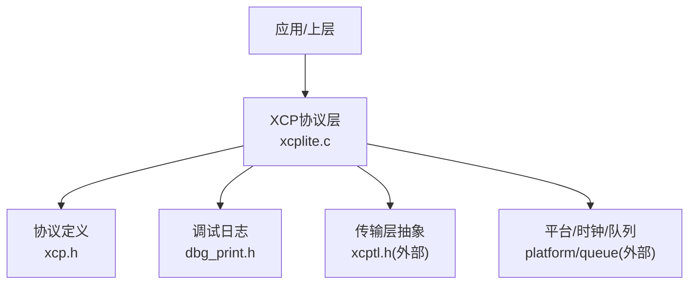
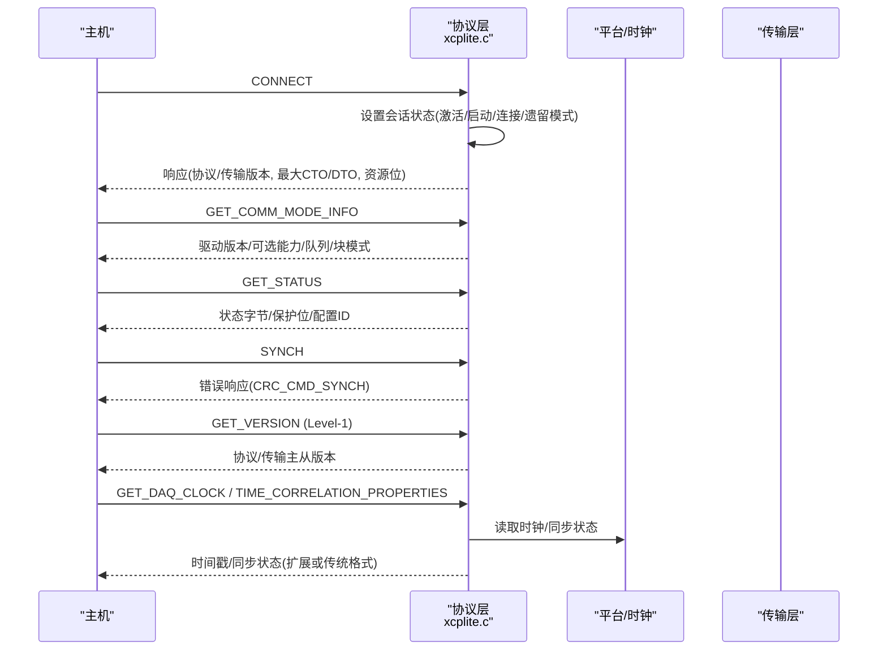
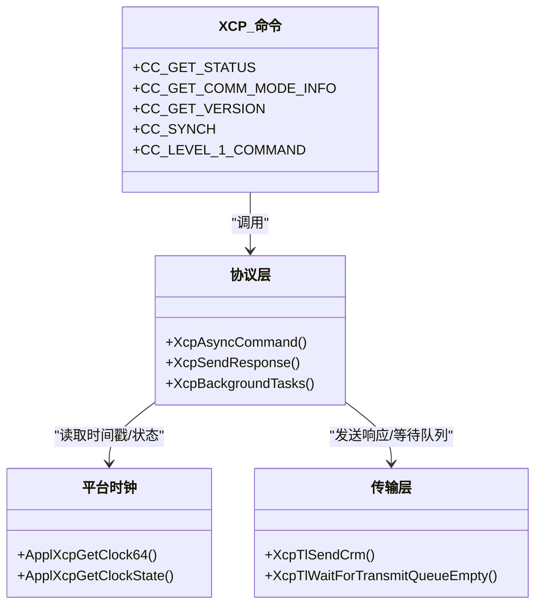

# 系统命令

<cite>
**本文引用的文件**
- [xcp.h](file://src/xcp.h)
- [xcplite.c](file://src/xcplite.c)
- [dbg_print.h](file://src/dbg_print.h)
- [xcplib.h](file://inc/xcplib.h)
</cite>

## 目录
1. [简介](#简介)
2. [项目结构](#项目结构)
3. [核心组件](#核心组件)
4. [架构总览](#架构总览)
5. [详细组件分析](#详细组件分析)
6. [依赖关系分析](#依赖关系分析)
7. [性能考虑](#性能考虑)
8. [故障诊断指南](#故障诊断指南)
9. [结论](#结论)
10. [附录](#附录)

## 简介
本文件聚焦于XCPlite中XCP协议的系统管理命令处理，涵盖GET_STATUS、GET_COMM_MODE_INFO、GET_VERSION、RESUME（通过SET_REQUEST与启动流程协同）、SYNCH等系统级命令。文档解释系统状态监控、通信模式配置、版本信息获取；阐述系统同步机制、时间戳处理与时钟同步；说明系统资源管理、内存使用统计与性能监控；提供系统诊断工具、日志记录与故障诊断方法；并给出命令使用示例与集成要点。

## 项目结构
- 协议定义与常量：位于src/xcp.h，集中定义了标准命令码、事件码、错误码、响应长度与字段偏移等。
- 协议层实现：位于src/xcplite.c，包含命令分发、状态机、DAQ/校准/传输层交互、时钟与同步、后台任务等。
- 调试与日志：位于src/dbg_print.h，提供可配置的日志级别与输出宏。
- 公共API与集成点：位于inc/xcplib.h，暴露初始化、事件触发、校准段管理等接口，供应用集成。

图表来源
- [xcplite.c:2034-2945](file://src/xcplite.c#L2034-L2945)
- [xcp.h:25-130](file://src/xcp.h#L25-L130)
- [dbg_print.h:19-85](file://src/dbg_print.h#L19-L85)

章节来源
- [xcp.h:25-130](file://src/xcp.h#L25-L130)
- [xcplite.c:2034-2945](file://src/xcplite.c#L2034-L2945)
- [dbg_print.h:19-85](file://src/dbg_print.h#L19-L85)

## 核心组件
- 命令分发与执行：XcpAsyncCommand负责解析CRO、填充CRM、调用具体命令处理分支，统一错误与响应路径。
- 会话与状态：通过session_status位域维护激活、已连接、已启动、遗留模式、DAQ运行等状态。
- 通信模式与版本：GET_COMM_MODE_INFO返回驱动版本、可选能力、队列大小、块模式参数；GET_VERSION返回协议与传输层主/次版本号。
- 同步与时间戳：SYNCH用于请求方同步；GET_DAQ_CLOCK支持扩展格式与64位时间戳；TIME_CORRELATION_PROPERTIES用于时间同步能力协商。
- 资源与性能：后台任务发布校准段、等待队列清空、溢出计数统计、日志级别控制。

章节来源
- [xcplite.c:2034-2945](file://src/xcplite.c#L2034-L2945)
- [xcp.h:226-244](file://src/xcp.h#L226-L244)
- [xcplite.c:2860-2886](file://src/xcplite.c#L2860-L2886)
- [xcplite.c:2888-2905](file://src/xcplite.c#L2888-L2905)

## 架构总览
下图展示了系统命令在协议层的处理流程，包括CONNECT后的状态设置、命令分发、错误与响应发送。

图表来源
- [xcplite.c:2051-2084](file://src/xcplite.c#L2051-L2084)
- [xcplite.c:2121-2138](file://src/xcplite.c#L2121-L2138)
- [xcplite.c:2226-2236](file://src/xcplite.c#L2226-L2236)
- [xcplite.c:2860-2886](file://src/xcplite.c#L2860-L2886)
- [xcplite.c:2888-2905](file://src/xcplite.c#L2888-L2905)

## 详细组件分析

### 系统命令：GET_STATUS
- 功能：返回当前会话状态字节、保护状态与配置ID（若启用恢复）。
- 实现要点：
  - 状态字节取自共享状态的低位，保护位固定为0（未实现保护），配置ID在非恢复模式下为0。
  - 适用于工具侧轮询ECU状态、判断是否处于连接/启动/DAQ运行等。
- 典型用法：
  - 连接后周期性查询，确认ECU进入可用状态。
  - 结合GET_COMM_MODE_INFO进行能力探测。

章节来源
- [xcp.h:491-497](file://src/xcp.h#L491-L497)
- [xcplite.c:2226-2236](file://src/xcplite.c#L2226-L2236)

### 系统命令：GET_COMM_MODE_INFO
- 功能：返回通信模式信息，包括驱动版本、可选能力、队列大小、块模式参数等。
- 实现要点：
  - 驱动版本来自编译期常量；可选能力置空；队列大小与块模式参数在当前实现中为0。
  - 工具据此决定是否使用块模式、交错模式等高级特性。
- 典型用法：
  - 连接后立即调用，确定传输层能力与限制。

章节来源
- [xcp.h:509-517](file://src/xcp.h#L509-L517)
- [xcplite.c:2131-2138](file://src/xcplite.c#L2131-L2138)

### 系统命令：GET_VERSION（Level-1）
- 功能：返回XCP协议层与传输层的主/次版本号。
- 实现要点：
  - 通过Level-1命令子类型GET_VERSION获取；协议与传输版本分别取高/低字节。
- 典型用法：
  - 工具端进行兼容性检查，确保与服务器版本匹配。

章节来源
- [xcp.h:124-130](file://src/xcp.h#L124-L130)
- [xcplite.c:2888-2905](file://src/xcplite.c#L2888-L2905)

### 系统命令：SYNCH
- 功能：用于请求方与服务器同步，当前实现总是返回错误响应CRC_CMD_SYNCH。
- 实现要点：
  - 不改变任何状态，仅构造错误包以通知请求方需重新同步。
- 典型用法：
  - 在发生未知错误或需要强制同步时由主机发起。

章节来源
- [xcp.h:504-508](file://src/xcp.h#L504-L508)
- [xcplite.c:2121-2125](file://src/xcplite.c#L2121-L2125)

### 系统命令：RESUME（通过SET_REQUEST与启动流程）
- 功能：在支持恢复的场景下，恢复之前的DAQ配置或会话上下文。
- 实现要点：
  - SET_REQUEST支持存储/清除DAQ配置（若启用恢复）。
  - XcpStart支持resumeMode参数，若存在选中的DAQ列表则进入恢复模式并启动。
- 典型用法：
  - 重启后通过SET_REQUEST指定配置ID，再启动以恢复测量。

章节来源
- [xcp.h:527-532](file://src/xcp.h#L527-L532)
- [xcplite.c:2243-2275](file://src/xcplite.c#L2243-L2275)
- [xcplite.c:3307-3462](file://src/xcplite.c#L3307-L3462)

### 时间戳与时钟同步
- GET_DAQ_CLOCK：
  - 支持传统与扩展格式；扩展格式可携带64位时间戳与同步状态。
  - 通过ApplXcpGetClock64/ApplXcpGetClockState获取底层时钟。
- TIME_CORRELATION_PROPERTIES：
  - 协商时间同步能力、集群ID、服务器配置；可切换扩展响应格式。
- 典型用法：
  - 多节点或多设备场景下，利用GET_DAQ_CLOCK与属性协商实现时间对齐。

章节来源
- [xcp.h:742-778](file://src/xcp.h#L742-L778)
- [xcplite.c:2726-2780](file://src/xcplite.c#L2726-L2780)
- [xcplite.c:2860-2886](file://src/xcplite.c#L2860-L2886)

### 系统资源管理与性能监控
- 后台任务：
  - 定期发布校准段变更，避免长时间延迟；若延迟超过阈值记录警告。
- 队列与溢出：
  - 事件/消息入队失败时记录溢出警告；停止DAQ前等待传输队列清空。
- 统计指标：
  - 提供溢出计数、DAQ运行状态、事件计数等查询接口。
- 典型用法：
  - 在高负载场景下监控队列与溢出，调整DAQ优先级或采样率。

章节来源
- [xcplite.c:2954-2982](file://src/xcplite.c#L2954-L2982)
- [xcplite.c:2988-3009](file://src/xcplite.c#L2988-L3009)
- [xcplite.c:400-429](file://src/xcplite.c#L400-L429)

### 系统诊断与日志
- 日志级别：
  - 支持运行时或编译时固定日志级别；提供ERROR/WARN/INFO/TRACE/DEBUG等多级输出。
- 诊断输出：
  - 命令收发打印、DAQ配置打印、错误与警告提示。
- 典型用法：
  - 将日志级别调至INFO/TRACE定位问题；在生产环境关闭冗余输出以提升性能。

章节来源
- [dbg_print.h:19-85](file://src/dbg_print.h#L19-L85)
- [xcplite.c:3494-3599](file://src/xcplite.c#L3494-L3599)

## 依赖关系分析
- 命令与响应结构：
  - 所有系统命令的CRO/CRM长度与字段偏移均在xcp.h中定义，保证协议一致性。
- 状态与模式：
  - 会话状态位域在xcp.h中定义，xcplite.c中读写与维护。
- 时钟与同步：
  - 通过ApplXcpGetClock64/ApplXcpGetClockState访问平台时钟；TIME_CORRELATION_PROPERTIES用于能力协商。
- 传输层：
  - 通过xcptl.h提供的发送/等待接口完成响应与队列管理。

图表来源
- [xcp.h:25-130](file://src/xcp.h#L25-L130)
- [xcplite.c:2034-2945](file://src/xcplite.c#L2034-L2945)
- [xcplite.c:2860-2886](file://src/xcplite.c#L2860-L2886)

章节来源
- [xcp.h:25-130](file://src/xcp.h#L25-L130)
- [xcplite.c:2034-2945](file://src/xcplite.c#L2034-L2945)

## 性能考虑
- 避免阻塞：
  - 停止DAQ时等待传输队列清空，防止数据丢失；但需注意超时以避免死等。
- 减少开销：
  - 日志级别在生产环境降低以减少printf开销；关键路径避免不必要的字符串格式化。
- 批量操作：
  - 使用WRITE_DAQ_MULTIPLE批量添加ODT条目，提升配置效率。
- 时间戳精度：
  - 根据需求选择传统或扩展格式；64位时间戳增加带宽占用，需权衡。

[本节为通用指导，无需特定文件引用]

## 故障诊断指南
- 常见问题与定位：
  - 非连接状态下的命令会被忽略且无响应，需先CONNECT。
  - SYNCH总是返回错误，用于强制同步；若频繁出现，检查主机时序与状态机。
  - 队列溢出会导致事件丢失，需降低DAQ频率或增大队列。
- 诊断步骤：
  - 提高日志级别，查看命令收发与错误码。
  - 使用GET_STATUS与GET_COMM_MODE_INFO确认状态与能力。
  - 使用GET_DAQ_CLOCK与TIME_CORRELATION_PROPERTIES检查时钟与同步状态。
- 恢复策略：
  - 使用SET_REQUEST保存/清除DAQ配置；必要时重启并进入恢复模式。

章节来源
- [xcplite.c:2094-2097](file://src/xcplite.c#L2094-L2097)
- [xcplite.c:2121-2125](file://src/xcplite.c#L2121-L2125)
- [xcplite.c:2988-3009](file://src/xcplite.c#L2988-L3009)
- [xcplite.c:2243-2275](file://src/xcplite.c#L2243-L2275)

## 结论
XCPlite对XCP系统管理命令提供了完整而清晰的实现：GET_STATUS用于状态监控，GET_COMM_MODE_INFO用于能力探测，GET_VERSION用于版本兼容，SYNCH用于同步协调，RESUME通过SET_REQUEST与启动流程协同恢复测量。时间戳与时钟同步通过GET_DAQ_CLOCK与TIME_CORRELATION_PROPERTIES实现，支持扩展格式与64位时间戳。系统资源管理与性能监控通过后台任务、队列管理与统计接口保障稳定性。调试与日志体系便于问题定位与优化。

[本节为总结性内容，无需特定文件引用]

## 附录
- 使用示例（概念性）：
  - 连接后调用GET_COMM_MODE_INFO，依据返回能力决定是否使用块模式。
  - 周期性调用GET_STATUS，确认ECU处于连接与启动状态。
  - 在需要时调用SYNCH进行同步，随后继续后续命令。
  - 通过GET_VERSION检查协议与传输层版本，确保工具兼容性。
  - 使用GET_DAQ_CLOCK与TIME_CORRELATION_PROPERTIES进行时间对齐。
- 集成要点：
  - 在应用初始化时调用XcpInit/XcpStart，确保队列与平台时钟就绪。
  - 合理配置日志级别，生产环境建议关闭冗余输出。
  - 在高负载场景下监控队列溢出与DAQ状态，动态调整采样率。

[本节为概念性内容，无需特定文件引用]