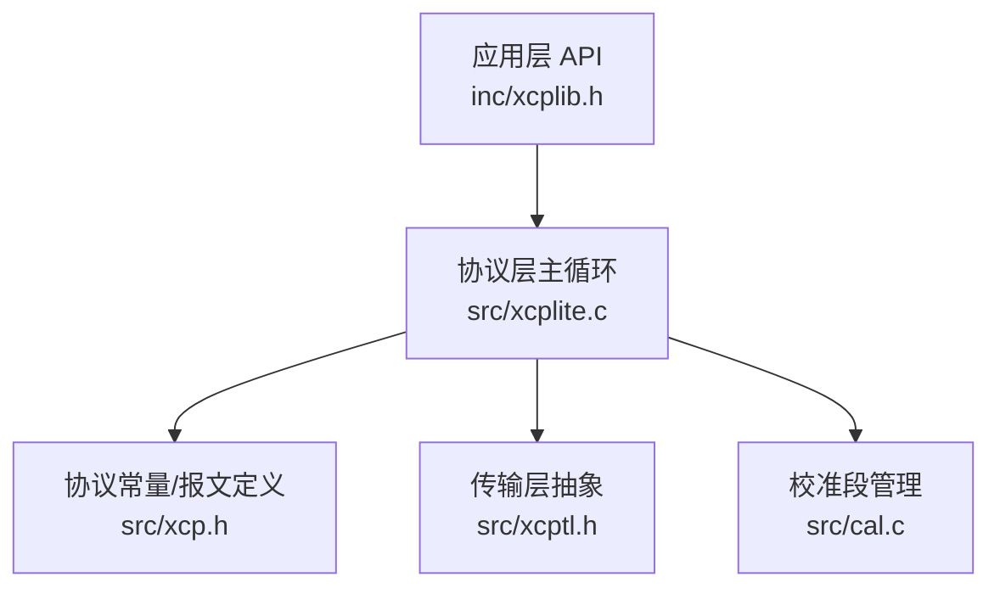
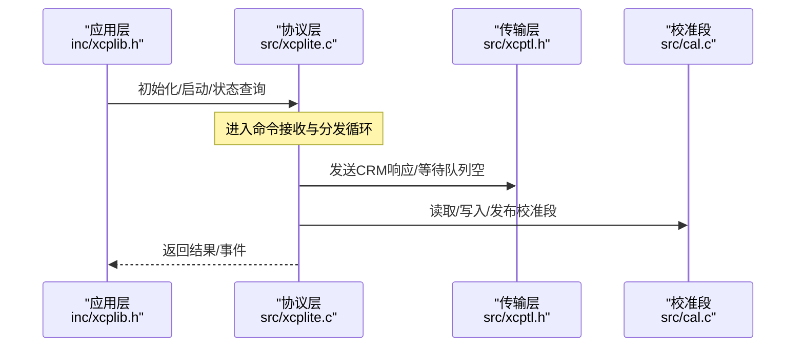
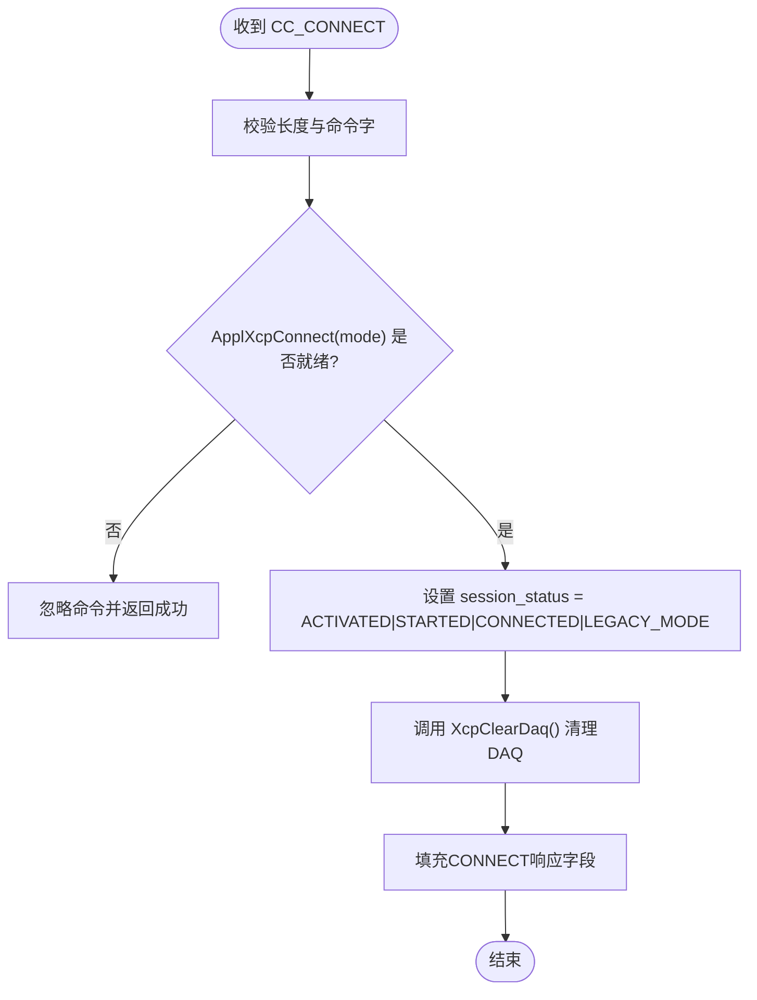
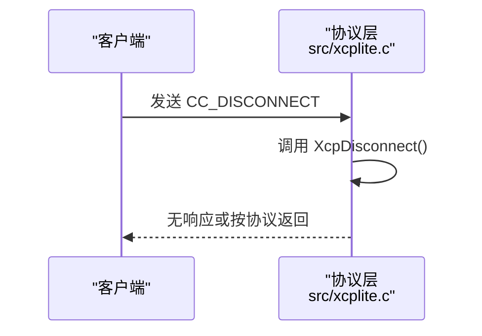
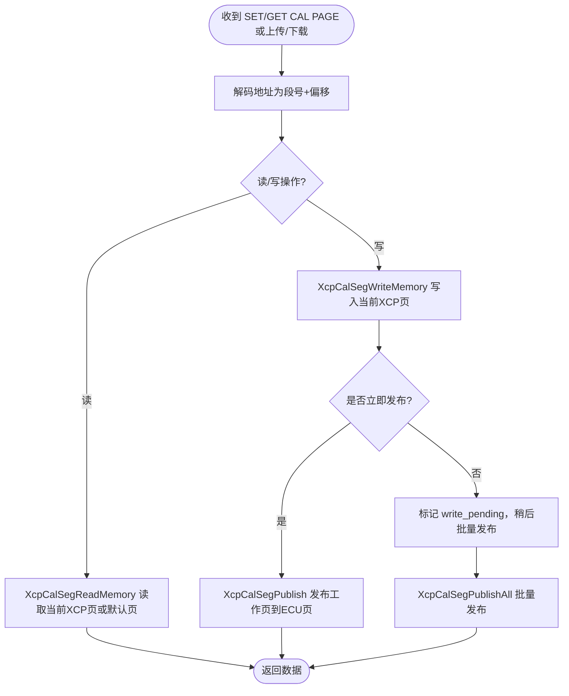
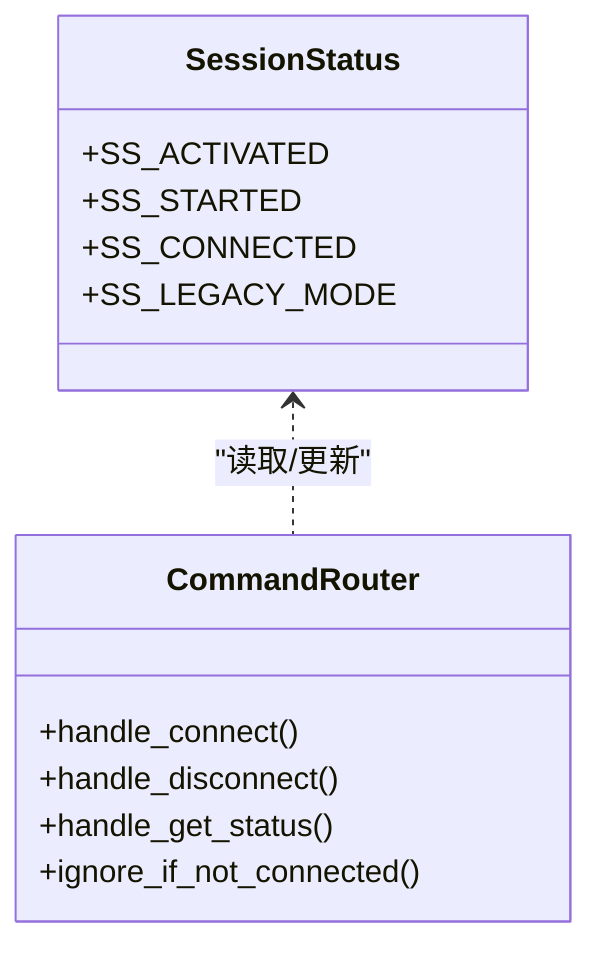
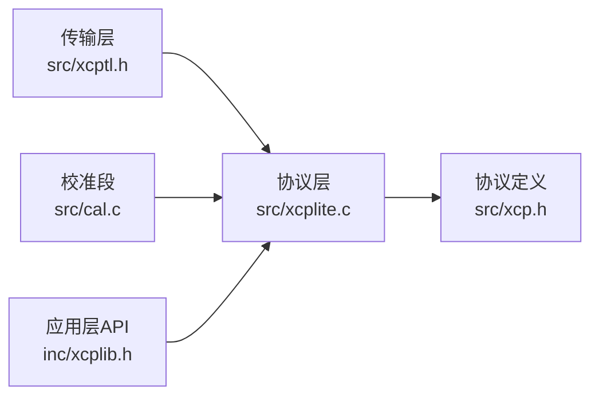

# 连接管理命令

<cite>
**本文引用的文件**
- [src/xcp.h](file://src/xcp.h)
- [src/xcplite.c](file://src/xcplite.c)
- [inc/xcplib.h](file://inc/xcplib.h)
- [src/xcptl.h](file://src/xcptl.h)
- [src/cal.c](file://src/cal.c)
</cite>

## 目录
1. [简介](#简介)
2. [项目结构](#项目结构)
3. [核心组件](#核心组件)
4. [架构总览](#架构总览)
5. [详细组件分析](#详细组件分析)
6. [依赖关系分析](#依赖关系分析)
7. [性能考虑](#性能考虑)
8. [故障排查指南](#故障排查指南)
9. [结论](#结论)
10. [附录](#附录)

## 简介
本章节聚焦于XCPlite中XCP协议的连接管理命令处理机制，重点覆盖CONNECT、DISCONNECT、SET_CAL_OFFSET（通过CAL页面切换与发布流程实现）等关键控制命令。文档阐述连接状态机管理、会话建立与断开流程、连接参数验证与权限检查、资源分配过程，并说明多客户端连接支持、连接超时处理与连接池管理机制的实现现状与限制。最后提供配置选项与故障恢复策略，并通过代码片段路径展示连接处理的实现细节。

## 项目结构
XCPlite将协议层定义与实现分离：
- 协议常量与报文结构定义位于 src/xcp.h
- 协议层主逻辑在 src/xcplite.c 中实现，包含命令分发、状态机、错误码与调试打印
- 传输层抽象接口在 src/xcptl.h，负责发送CRM、等待队列空、获取CTR等
- 应用层API与初始化入口在 inc/xcplib.h，提供服务器初始化、运行状态查询等
- 校准段（CAL）读写与页面发布在 src/cal.c，支撑SET_CAL_PAGE/GET_CAL_PAGE及偏移访问

**图示来源**
- [src/xcplite.c:2050-2249](file://src/xcplite.c#L2050-L2249)
- [src/xcp.h:476-531](file://src/xcp.h#L476-L531)
- [src/xcptl.h:19-26](file://src/xcptl.h#L19-L26)
- [src/cal.c:690-889](file://src/cal.c#L690-L889)

**章节来源**
- [src/xcplite.c:2050-2249](file://src/xcplite.c#L2050-L2249)
- [src/xcp.h:476-531](file://src/xcp.h#L476-L531)
- [src/xcptl.h:19-26](file://src/xcptl.h#L19-L26)
- [inc/xcplib.h:39-59](file://inc/xcplib.h#L39-L59)

## 核心组件
- 连接状态机：使用 session_status 位域表示激活、启动、已连接、遗留模式等状态；提供 isActivated/isStarted/isConnected 宏进行状态判断
- 命令分发器：根据CRO_CMD分派到具体处理分支，CONNECT/DISCONNECT/GET_STATUS/SET_REQUEST等均有明确分支
- 传输层抽象：封装发送CRM、等待队列空、获取CTR等，屏蔽底层以太网/UDP/TCP差异
- 校准段管理：提供读取/写入校准段内存、发布工作页到ECU页的RCU机制，支撑SET_CAL_PAGE/GET_CAL_PAGE与偏移访问

**章节来源**
- [src/xcplite.c:245-255](file://src/xcplite.c#L245-L255)
- [src/xcplite.c:2050-2249](file://src/xcplite.c#L2050-L2249)
- [src/xcptl.h:19-26](file://src/xcptl.h#L19-L26)
- [src/cal.c:690-889](file://src/cal.c#L690-L889)

## 架构总览
下图展示了从应用层到协议层再到传输层的调用链，以及连接管理命令的处理流程。

**图示来源**
- [inc/xcplib.h:39-59](file://inc/xcplib.h#L39-L59)
- [src/xcplite.c:2050-2249](file://src/xcplite.c#L2050-L2249)
- [src/xcptl.h:19-26](file://src/xcptl.h#L19-L26)
- [src/cal.c:690-889](file://src/cal.c#L690-L889)

## 详细组件分析

### CONNECT 命令处理与会话建立
- 触发条件：当收到CC_CONNECT且长度满足要求时进入处理分支
- 应用就绪检查：调用 ApplXcpConnect(mode)，若应用未准备好则忽略该命令并返回成功（不改变状态）
- 状态设置：成功后设置 session_status 为 SS_ACTIVATED | SS_STARTED | SS_CONNECTED | SS_LEGACY_MODE
- DAQ清理：调用 XcpClearDaq() 重置DAQ配置
- 响应填充：填充协议版本、传输版本、最大CTO/DTO大小、资源掩码、基本通信模式等字段

**图示来源**
- [src/xcplite.c:2050-2084](file://src/xcplite.c#L2050-L2084)
- [src/xcp.h:476-485](file://src/xcp.h#L476-L485)

**章节来源**
- [src/xcplite.c:2050-2084](file://src/xcplite.c#L2050-L2084)
- [src/xcp.h:476-485](file://src/xcp.h#L476-L485)

### DISCONNECT 命令处理与会话断开
- 触发条件：收到CC_DISCONNECT时进入处理分支
- 行为：调用 XcpDisconnect() 执行断开流程（清理会话、释放资源、重置状态）
- 后续：其他非连接相关命令在未连接状态下将被忽略并返回CRC_CMD_IGNORED

**图示来源**
- [src/xcplite.c:2140-2142](file://src/xcplite.c#L2140-L2142)

**章节来源**
- [src/xcplite.c:2140-2142](file://src/xcplite.c#L2140-L2142)

### SET_CAL_OFFSET 与 CAL 页面切换/发布
- 协议层面通过 SET_CAL_PAGE/GET_CAL_PAGE 完成页面选择与查询，配合校准段读写实现“偏移”访问
- 读取：XcpCalSegReadMemory 解码地址为段号与偏移，选择当前XCP页或默认页拷贝数据
- 写入：XcpCalSegWriteMemory 写入当前XCP页，并根据配置决定是否立即发布或延迟发布
- 发布：XcpCalSegPublish/XcpCalSegPublishAll 使用RCU机制将修改的工作页发布到ECU页，确保并发安全

**图示来源**
- [src/cal.c:690-889](file://src/cal.c#L690-L889)
- [src/xcp.h:612-624](file://src/xcp.h#L612-L624)

**章节来源**
- [src/cal.c:690-889](file://src/cal.c#L690-L889)
- [src/xcp.h:612-624](file://src/xcp.h#L612-L624)

### 连接状态机与命令路由
- 状态宏：isActivated()/isStarted()/isConnected() 基于 session_status 位域判断
- 命令路由：除CONNECT外，其他命令在非连接状态下被忽略并返回CRC_CMD_IGNORED
- GET_STATUS：返回当前会话状态、保护状态与配置ID（如启用DAV resume）

**图示来源**
- [src/xcplite.c:245-255](file://src/xcplite.c#L245-L255)
- [src/xcplite.c:2094-2097](file://src/xcplite.c#L2094-L2097)
- [src/xcplite.c:2226-2236](file://src/xcplite.c#L2226-L2236)

**章节来源**
- [src/xcplite.c:245-255](file://src/xcplite.c#L245-L255)
- [src/xcplite.c:2094-2097](file://src/xcplite.c#L2094-L2097)
- [src/xcplite.c:2226-2236](file://src/xcplite.c#L2226-L2236)

### 连接参数验证、权限检查与资源分配
- 参数验证：CONNECT长度与模式校验；其他命令长度校验（check_len）
- 权限检查：GET_STATUS返回保护状态；部分命令预留了种子/解锁流程（当前未启用）
- 资源分配：CONNECT响应中声明支持资源掩码（RM_DAQ | RM_CAL_PAG），并在连接时清理DAQ配置

**章节来源**
- [src/xcplite.c:2050-2084](file://src/xcplite.c#L2050-L2084)
- [src/xcplite.c:2226-2236](file://src/xcplite.c#L2226-L2236)
- [src/xcp.h:196-203](file://src/xcp.h#L196-L203)

### 多客户端连接支持、超时与连接池
- 多客户端：当前实现以单例会话为主，未显式维护多客户端连接表；测试用例显示可处理多个连接的帧序列，但服务端侧仍围绕单一会话状态机
- 超时处理：传输层提供等待队列空的超时接口（XcpTlWaitForTransmitQueueEmpty），用于阻塞发送直到队列清空或超时
- 连接池：未发现显式的连接池管理；会话状态集中在 gXcpData/gXcpLocalData 中

**章节来源**
- [src/xcptl.h:22-26](file://src/xcptl.h#L22-L26)
- [src/xcplite.c:188-195](file://src/xcplite.c#L188-L195)

### 配置选项与故障恢复策略
- 配置项：通过 xcplib_cfg.h 与 xcp_cfg.h 控制功能开关（如OPTION_SHM_MODE、XCP_ENABLE_DAQ_RESUME等）
- 故障恢复：
  - CONNECT失败或应用未就绪：忽略命令并保持当前状态
  - 非连接状态下的命令：返回CRC_CMD_IGNORED，避免非法操作
  - 校准段发布失败：返回CRC_CMD_PENDING或CRC_ACCESS_DENIED，支持延迟发布与重试

**章节来源**
- [src/xcplite.c:2065-2067](file://src/xcplite.c#L2065-L2067)
- [src/xcplite.c:2094-2097](file://src/xcplite.c#L2094-L2097)
- [src/cal.c:723-767](file://src/cal.c#L723-L767)

## 依赖关系分析
- 协议层依赖传输层进行消息发送与队列管理
- 协议层依赖校准段模块进行数据访问与页面发布
- 应用层通过公共API初始化与查询状态，间接驱动协议层

**图示来源**
- [src/xcptl.h:19-26](file://src/xcptl.h#L19-L26)
- [src/xcplite.c:2050-2249](file://src/xcplite.c#L2050-L2249)
- [src/cal.c:690-889](file://src/cal.c#L690-L889)
- [inc/xcplib.h:39-59](file://inc/xcplib.h#L39-L59)
- [src/xcp.h:476-531](file://src/xcp.h#L476-L531)

**章节来源**
- [src/xcptl.h:19-26](file://src/xcptl.h#L19-L26)
- [src/xcplite.c:2050-2249](file://src/xcplite.c#L2050-L2249)
- [src/cal.c:690-889](file://src/cal.c#L690-L889)
- [inc/xcplib.h:39-59](file://inc/xcplib.h#L39-L59)
- [src/xcp.h:476-531](file://src/xcp.h#L476-L531)

## 性能考虑
- 连接命令处理尽量轻量：CONNECT仅做必要状态设置与DAQ清理，避免重计算
- 校准段写入采用RCU与延迟发布，减少锁竞争与阻塞，提升高并发场景下的吞吐
- 传输层队列等待提供超时机制，防止长时间阻塞影响实时性

[本节为通用指导，无需特定文件引用]

## 故障排查指南
- 常见错误码：
  - CRC_CMD_IGNORED：非连接状态下收到命令
  - CRC_CMD_SYNTAX：命令长度或格式不正确
  - CRC_OUT_OF_RANGE：参数越界或无效
  - CRC_ACCESS_DENIED：访问被拒绝（如写入默认页）
  - CRC_CMD_PENDING：资源暂时不可用（如校准段发布等待）
- 调试建议：
  - 启用DBG_LEVEL输出，查看命令收发与错误码
  - 检查CONNECT模式与应用就绪回调返回值
  - 确认DAQ配置是否在连接时被正确清理

**章节来源**
- [src/xcplite.c:2094-2097](file://src/xcplite.c#L2094-L2097)
- [src/xcplite.c:2226-2236](file://src/xcplite.c#L2226-L2236)
- [src/cal.c:723-767](file://src/cal.c#L723-L767)

## 结论
XCPlite的连接管理以简洁的状态机为核心，通过CONNECT/DISCONNECT命令完成会话的建立与断开，结合GET_STATUS提供状态可见性。校准段管理通过页面切换与RCU发布机制，实现了高效的数据访问与一致性保证。当前实现侧重单会话模型，传输层提供队列等待与超时能力，适用于多数嵌入式与桌面场景。未来如需多客户端与连接池，可在现有状态机基础上扩展连接表与资源隔离。

[本节为总结性内容，无需特定文件引用]

## 附录
- 代码片段路径（连接处理关键位置）：
  - CONNECT处理与状态设置：[src/xcplite.c:2050-2084](file://src/xcplite.c#L2050-L2084)
  - DISCONNECT处理：[src/xcplite.c:2140-2142](file://src/xcplite.c#L2140-L2142)
  - GET_STATUS返回会话状态：[src/xcplite.c:2226-2236](file://src/xcplite.c#L2226-L2236)
  - 校准段读取/写入/发布：[src/cal.c:690-889](file://src/cal.c#L690-L889)
  - 传输层发送与等待接口：[src/xcptl.h:19-26](file://src/xcptl.h#L19-L26)
  - 应用层初始化与状态查询：[inc/xcplib.h:39-59](file://inc/xcplib.h#L39-L59)
  - 协议常量与报文结构：[src/xcp.h:476-531](file://src/xcp.h#L476-L531)