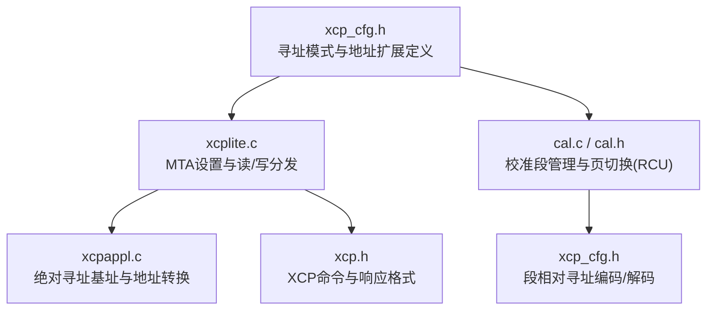
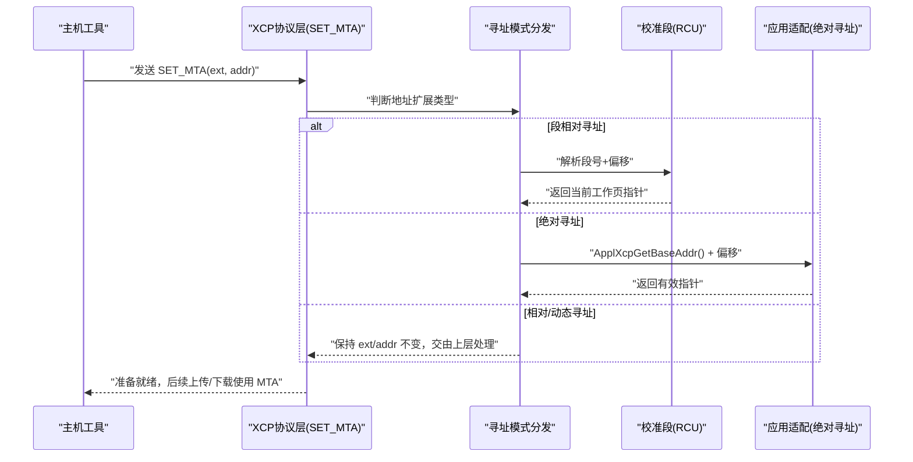
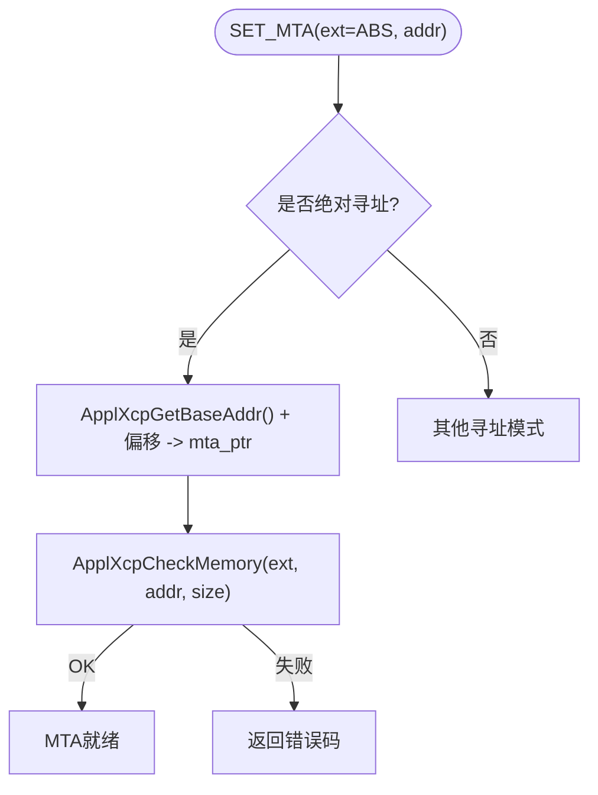
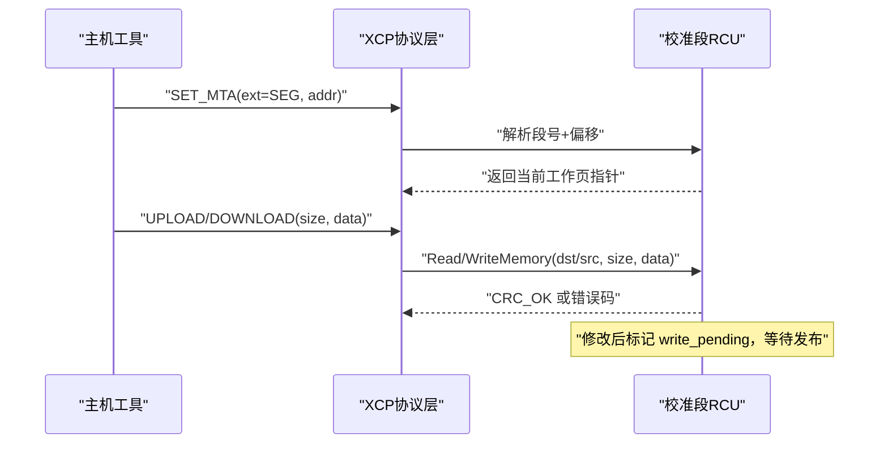
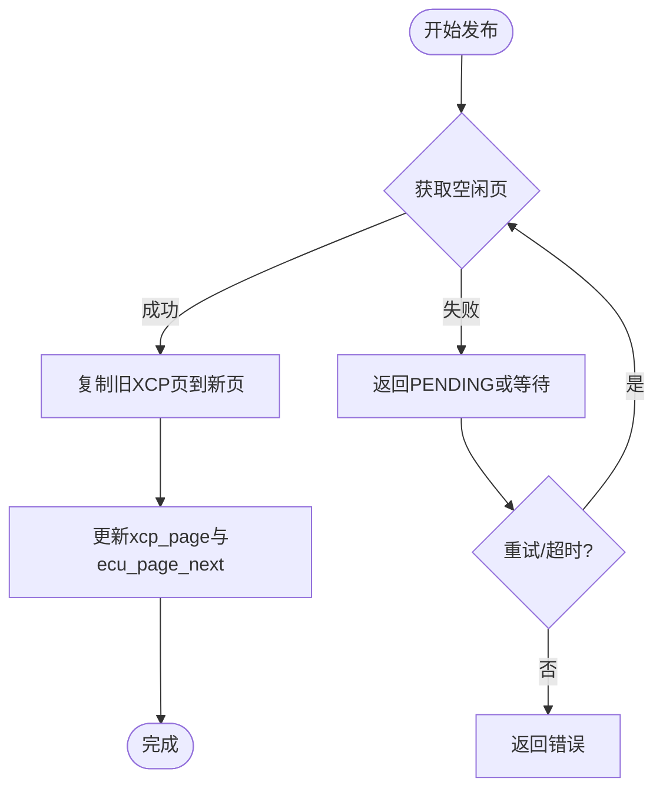
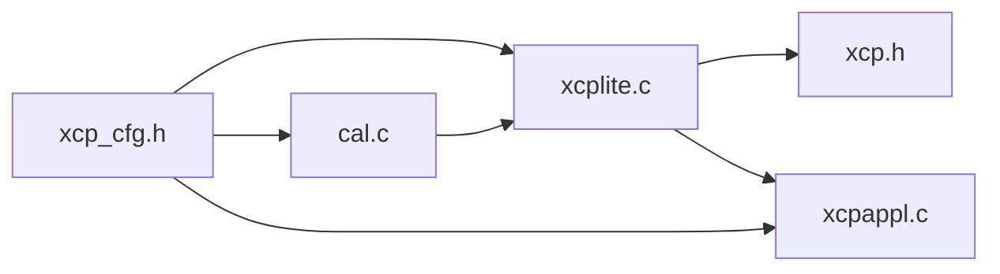

# 寻址模式实现

<cite>
**本文引用的文件**
- [src/xcp_cfg.h](file://src/xcp_cfg.h)
- [src/xcp.h](file://src/xcp.h)
- [src/xcplite.c](file://src/xcplite.c)
- [src/xcplite.h](file://src/xcplite.h)
- [src/cal.c](file://src/cal.c)
- [src/cal.h](file://src/cal.h)
- [src/xcpappl.c](file://src/xcpappl.c)
</cite>

## 目录
1. [简介](#简介)
2. [项目结构](#项目结构)
3. [核心组件](#核心组件)
4. [架构总览](#架构总览)
5. [详细组件分析](#详细组件分析)
6. [依赖关系分析](#依赖关系分析)
7. [性能考量](#性能考量)
8. [故障排查指南](#故障排查指南)
9. [结论](#结论)
10. [附录](#附录)

## 简介
本文件系统性阐述 XCPlite 支持的多种 XCP 寻址模式及其实现，重点覆盖：
- 绝对寻址、相对寻址、段相对寻址的工作原理与适用场景
- 页切换机制（校准段 RCU）、地址映射与内存保护策略
- 校准段管理、动态地址分配与地址空间优化
- 不同寻址模式的性能特点与选择建议
- 寻址模式配置、调试方法与常见问题解决方案
- 自定义寻址模式的扩展指导

XCPlite 通过“地址扩展 + 地址编码/解码宏”的组合，将 A2L 工具生成的逻辑地址在运行时映射到实际物理或虚拟内存。其设计兼顾了多应用共享内存（SHM）环境、跨平台可移植性与高性能 DAQ/STIM 路径。

## 项目结构
围绕寻址模式的关键代码分布在以下模块：
- 配置层：定义寻址模式、地址扩展常量、编码/解码宏
- 协议层：处理 SET_MTA/SHORT_UPLOAD/DOWNLOAD 等命令的 MTA 设置与读写
- 校准段层：提供段相对寻址、页切换（RCU）、发布与一致性保证
- 应用适配层：提供绝对寻址基址、指针到地址转换、内存访问回调

图表来源
- [src/xcp_cfg.h:100-292](file://src/xcp_cfg.h#L100-L292)
- [src/xcplite.c:508-711](file://src/xcplite.c#L508-L711)
- [src/cal.c:693-800](file://src/cal.c#L693-L800)
- [src/xcpappl.c:180-226](file://src/xcpappl.c#L180-L226)
- [src/xcp.h:548-617](file://src/xcp.h#L548-L617)

章节来源
- [src/xcp_cfg.h:100-292](file://src/xcp_cfg.h#L100-L292)
- [src/xcplite.c:508-711](file://src/xcplite.c#L508-L711)
- [src/cal.c:693-800](file://src/cal.c#L693-L800)
- [src/xcpappl.c:180-226](file://src/xcpappl.c#L180-L226)
- [src/xcp.h:548-617](file://src/xcp.h#L548-L617)

## 核心组件
- 寻址模式与地址扩展
  - 绝对寻址：基于基址 + 偏移，适用于全局数据、跨进程/多应用隔离（SHM 中附加 app_id）
  - 段相对寻址：以校准段索引/编号为基准，配合页切换实现安全更新与可见性
  - 相对寻址：栈帧/事件相关相对偏移，支持异步访问（动态地址扩展）
  - 应用特定寻址：通过回调读写，用于外部校准段管理或特殊内存空间
- MTA 设置与读写分发
  - SET_MTA/SHORT_UPLOAD/DOWNLOAD 统一入口，按地址扩展类型分派到具体实现
- 校准段 RCU
  - 双页/三页缓冲、原子状态、延迟发布、冻结/预加载、持久化
- 应用适配
  - 绝对寻址基址获取、指针到地址转换、内存访问检查与回调

章节来源
- [src/xcp_cfg.h:100-292](file://src/xcp_cfg.h#L100-L292)
- [src/xcplite.c:508-711](file://src/xcplite.c#L508-L711)
- [src/cal.c:693-800](file://src/cal.c#L693-L800)
- [src/xcpappl.c:180-226](file://src/xcpappl.c#L180-L226)

## 架构总览
XCPlite 的寻址体系由“配置层宏 + 协议层分发 + 校准段 RCU + 应用适配”构成。SET_MTA 根据地址扩展决定后续读写的目标空间；校准段模式下，所有读写通过段号与偏移解析到具体页面；绝对模式下，通过基址与偏移计算真实指针并执行访问控制。

图表来源
- [src/xcplite.c:618-711](file://src/xcplite.c#L618-L711)
- [src/cal.c:693-717](file://src/cal.c#L693-L717)
- [src/xcpappl.c:201-226](file://src/xcpappl.c#L201-L226)

## 详细组件分析

### 绝对寻址（Absolute Addressing）
- 工作原理
  - 地址编码：ApplXcpGetAddr(p) 计算相对于基址的正偏移，限制在 32 位范围
  - 地址解码：XcpSetMta 中将绝对地址转换为本地指针（mta_ptr），ext 转为内部指针扩展
  - SHM 模式：绝对寻址扩展包含 app_id，确保跨进程访问隔离
- 适用场景
  - 全局变量、静态数据区、模块内数据访问
  - 需要直接指针访问的高吞吐路径（DAQ/STIM）
- 内存保护
  - 通过 ApplXcpCheckMemory 进行权限校验（可扩展）
  - 越界与非法扩展会返回 CRC_ACCESS_DENIED/CRC_OUT_OF_RANGE

图表来源
- [src/xcp_cfg.h:210-228](file://src/xcp_cfg.h#L210-L228)
- [src/xcpappl.c:201-226](file://src/xcpappl.c#L201-L226)
- [src/xcplite.c:676-711](file://src/xcplite.c#L676-L711)

章节来源
- [src/xcp_cfg.h:210-228](file://src/xcp_cfg.h#L210-L228)
- [src/xcpappl.c:201-226](file://src/xcpappl.c#L201-L226)
- [src/xcplite.c:676-711](file://src/xcplite.c#L676-L711)

### 相对寻址（Relative Addressing）
- 工作原理
  - 相对寻址扩展（XCP_ADDR_EXT_REL）保留原 ext/addr，不立即转换为指针
  - 通常用于栈帧相对或事件相关的相对偏移，结合上层上下文使用
- 适用场景
  - 局部变量、函数内临时数据、事件触发时的相对访问
- 注意
  - 相对寻址需确保生命周期与上下文有效性，否则可能访问非法内存

章节来源
- [src/xcp_cfg.h:184-193](file://src/xcp_cfg.h#L184-L193)
- [src/xcplite.c:643-649](file://src/xcplite.c#L643-L649)

### 段相对寻址（Segment Relative Addressing）
- 工作原理
  - 地址编码：XcpAddrEncodeSegIndex(seg_index, offset) 生成带高位的段相对地址
  - 地址解码：XcpAddrDecodeSegNumber/Offset 提取段号与偏移
  - 读取/写入：XcpCalSegReadMemory/WriteMemory 解析段号后访问对应页面
- 页切换机制（RCU）
  - 双页/三页缓冲：默认页、ECU 工作页、XCP 工作页、空闲页
  - 原子状态：ecu_page_next、free_page、ecu_access、xcp_access、write_pending
  - 发布流程：XcpCalSegPublish 将修改内容复制到新 XCP 页，并原子更新 ecu_page_next，消费者在锁定时同步
- 适用场景
  - 校准参数在线更新，保证 ECU 运行期一致性与无锁读取
- 内存保护
  - 边界检查：offset + size <= segment.size
  - 非法段号或越界返回 CRC_ACCESS_DENIED

图表来源
- [src/xcp_cfg.h:230-267](file://src/xcp_cfg.h#L230-L267)
- [src/cal.c:693-800](file://src/cal.c#L693-L800)
- [src/xcplite.c:508-608](file://src/xcplite.c#L508-L608)

章节来源
- [src/xcp_cfg.h:230-267](file://src/xcp_cfg.h#L230-L267)
- [src/cal.c:693-800](file://src/cal.c#L693-L800)
- [src/xcplite.c:508-608](file://src/xcplite.c#L508-L608)

### 页切换机制（校准段 RCU）
- 关键状态
  - ecu_page/ecu_page_next：ECU 当前与下一工作页
  - xcp_page：XCP 访问的工作页
  - free_page：空闲页，用于复制旧页内容
  - write_pending：待发布的标志
- 发布流程
  - 尝试获取空闲页，若不可用则返回 CRC_CMD_PENDING 或阻塞等待
  - 复制旧 XCP 页到新页，更新 xcp_page，原子发布 ecu_page_next
  - 解锁后消费者可看到新版本
- 冻结与预加载
  - 冻结模式：禁止更新，保证一致性快照
  - 预加载：启动时从持久化文件恢复默认页内容

图表来源
- [src/cal.c:719-767](file://src/cal.c#L719-L767)
- [src/cal.c:505-615](file://src/cal.c#L505-L615)

章节来源
- [src/cal.c:505-615](file://src/cal.c#L505-L615)
- [src/cal.c:719-767](file://src/cal.c#L719-L767)

### 校准段管理、动态地址分配与地址空间优化
- 动态分配
  - 校准段列表使用线程安全的 bump allocator，避免碎片与锁竞争
  - 段索引与段号分离：段号用于 XCP/A2L 标识，索引用于内部查找
- 地址空间优化
  - 段相对地址高位标记段空间，低位为偏移，便于快速解析
  - 绝对地址通过基址偏移减少间接寻址开销
- 持久化与冻结
  - 支持二进制持久化文件，启动时恢复校准段状态
  - 冻结模式用于一致性快照，防止并发更新

章节来源
- [src/cal.c:99-117](file://src/cal.c#L99-L117)
- [src/cal.c:370-503](file://src/cal.c#L370-L503)
- [src/cal.h:159-175](file://src/cal.h#L159-L175)

### 不同寻址模式的性能特点与选择建议
- 绝对寻址
  - 优点：直接指针访问，低开销，适合高频 DAQ/STIM
  - 缺点：需严格内存保护与越界检查
  - 建议：全局数据、模块内数据优先使用
- 段相对寻址
  - 优点：天然支持页切换与一致性，适合校准参数在线更新
  - 缺点：发布延迟，单次更新可能阻塞
  - 建议：校准参数、频繁更新的配置数据
- 相对/动态寻址
  - 优点：灵活，支持事件驱动与异步访问
  - 缺点：依赖上下文，需确保生命周期
  - 建议：局部变量、事件触发时的临时数据

章节来源
- [src/xcp_cfg.h:100-292](file://src/xcp_cfg.h#L100-L292)
- [src/xcplite.c:508-711](file://src/xcplite.c#L508-L711)
- [src/cal.c:693-800](file://src/cal.c#L693-L800)

### 寻址模式配置、调试方法与常见问题
- 配置
  - 通过 xcp_cfg.h 中的宏启用/禁用寻址模式与地址扩展
  - SHM 模式自动启用多应用绝对寻址（app_id 嵌入扩展）
- 调试
  - 启用日志级别，观察 SET_MTA 后的 ext/addr 变化
  - 使用断点跟踪 XcpCalSegPublish 调用链，确认发布时机
- 常见问题
  - 绝对寻址越界：检查基址与偏移范围
  - 段相对寻址越界：确认段大小与偏移
  - 发布阻塞：检查空闲页获取与锁竞争

章节来源
- [src/xcp_cfg.h:100-292](file://src/xcp_cfg.h#L100-L292)
- [src/xcplite.c:618-711](file://src/xcplite.c#L618-L711)
- [src/cal.c:719-767](file://src/cal.c#L719-L767)

### 自定义寻址模式的扩展指导
- 步骤
  - 在 xcp_cfg.h 中新增地址扩展常量与编码/解码宏
  - 在 xcplite.c 的 XcpSetMta/XcpReadMta/XcpWriteMta 中添加分支处理
  - 如需页切换或内存保护，参考校准段 RCU 实现
- 注意事项
  - 确保地址空间不与现有扩展冲突
  - 提供必要的内存检查回调（ApplXcpCheckMemory）
  - 测试多线程与跨进程场景下的正确性

章节来源
- [src/xcp_cfg.h:100-292](file://src/xcp_cfg.h#L100-L292)
- [src/xcplite.c:508-711](file://src/xcplite.c#L508-L711)
- [src/cal.c:693-800](file://src/cal.c#L693-L800)

## 依赖关系分析
- 配置层依赖
  - xcp_cfg.h 定义寻址模式与地址扩展，被 xcplite.c、cal.c、xcpappl.c 引用
- 协议层依赖
  - xcplite.c 依赖 xcp.h（命令定义）与 xcp_cfg.h（寻址宏）
- 校准段层依赖
  - cal.c 依赖 xcp_cfg.h（段相对寻址）与 xcplite.h（状态访问）
- 应用适配层依赖
  - xcpappl.c 提供绝对寻址基址与地址转换，被 xcplite.c 调用

图表来源
- [src/xcp_cfg.h:100-292](file://src/xcp_cfg.h#L100-L292)
- [src/xcplite.c:508-711](file://src/xcplite.c#L508-L711)
- [src/cal.c:693-800](file://src/cal.c#L693-L800)
- [src/xcpappl.c:180-226](file://src/xcpappl.c#L180-L226)

章节来源
- [src/xcp_cfg.h:100-292](file://src/xcp_cfg.h#L100-L292)
- [src/xcplite.c:508-711](file://src/xcplite.c#L508-L711)
- [src/cal.c:693-800](file://src/cal.c#L693-L800)
- [src/xcpappl.c:180-226](file://src/xcpappl.c#L180-L226)

## 性能考量
- 绝对寻址：指针直接访问，零拷贝，适合高频 DAQ/STIM
- 段相对寻址：发布延迟引入额外开销，但保证一致性
- 动态寻址：依赖上下文，需避免生命周期问题
- 内存对齐：校准段页对齐提升缓存命中率
- 锁竞争：bump allocator 与原子操作降低锁开销

[本节为通用性能讨论，无需特定文件引用]

## 故障排查指南
- 绝对寻址越界
  - 检查 ApplXcpGetBaseAddr 返回值与偏移范围
  - 确认 ApplXcpCheckMemory 实现是否正确
- 段相对寻址越界
  - 确认段大小与偏移计算
  - 检查 XcpCalSegReadMemory/WriteMemory 的边界判断
- 发布阻塞
  - 检查空闲页获取逻辑与锁竞争
  - 调整 XCP_CALSEG_AQUIRE_FREE_PAGE_TIMEOUT 超时时间
- 多应用冲突（SHM 模式）
  - 确认绝对寻址扩展包含正确的 app_id
  - 验证跨进程访问权限

章节来源
- [src/xcpappl.c:201-226](file://src/xcpappl.c#L201-L226)
- [src/cal.c:693-717](file://src/cal.c#L693-L717)
- [src/cal.c:719-767](file://src/cal.c#L719-L767)
- [src/xcp_cfg.h:210-228](file://src/xcp_cfg.h#L210-L228)

## 结论
XCPlite 通过灵活的寻址模式与强大的校准段 RCU，实现了高效、安全、可配置的 XCP 数据访问。绝对寻址适合高性能路径，段相对寻址保障一致性，相对/动态寻址提供灵活性。合理配置与调试可显著提升系统稳定性与性能。

[本节为总结性内容，无需特定文件引用]

## 附录
- 常用宏与常量
  - XCP_ADDR_EXT_ABS、XCP_ADDR_EXT_SEG、XCP_ADDR_EXT_DYN
  - XcpAddrEncodeAbs、XcpAddrEncodeSegIndex、XcpAddrEncodeDyn
- 关键函数
  - XcpSetMta、XcpReadMta、XcpWriteMta
  - XcpCalSegReadMemory、XcpCalSegWriteMemory
  - ApplXcpGetBaseAddr、ApplXcpGetAddr

章节来源
- [src/xcp_cfg.h:100-292](file://src/xcp_cfg.h#L100-L292)
- [src/xcplite.c:508-711](file://src/xcplite.c#L508-L711)
- [src/cal.c:693-800](file://src/cal.c#L693-L800)
- [src/xcpappl.c:180-226](file://src/xcpappl.c#L180-L226)