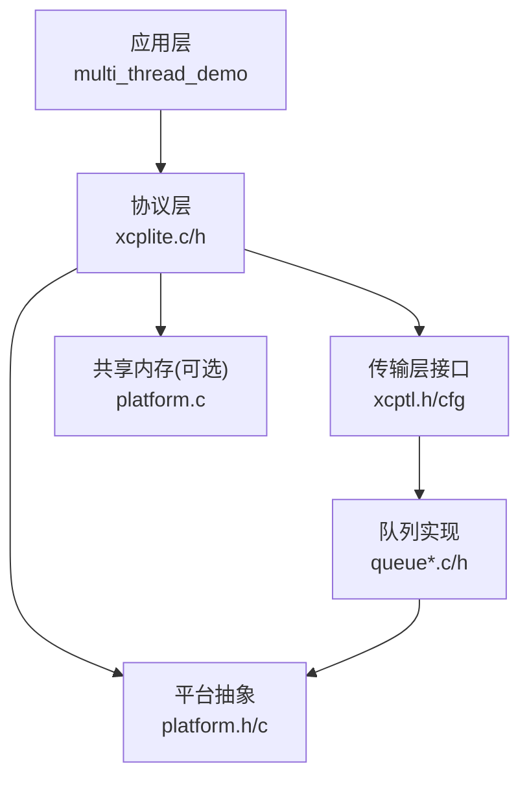
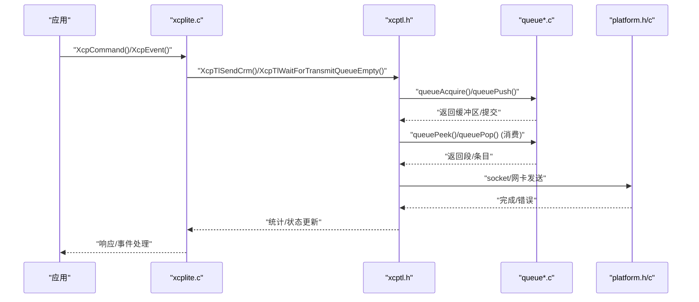
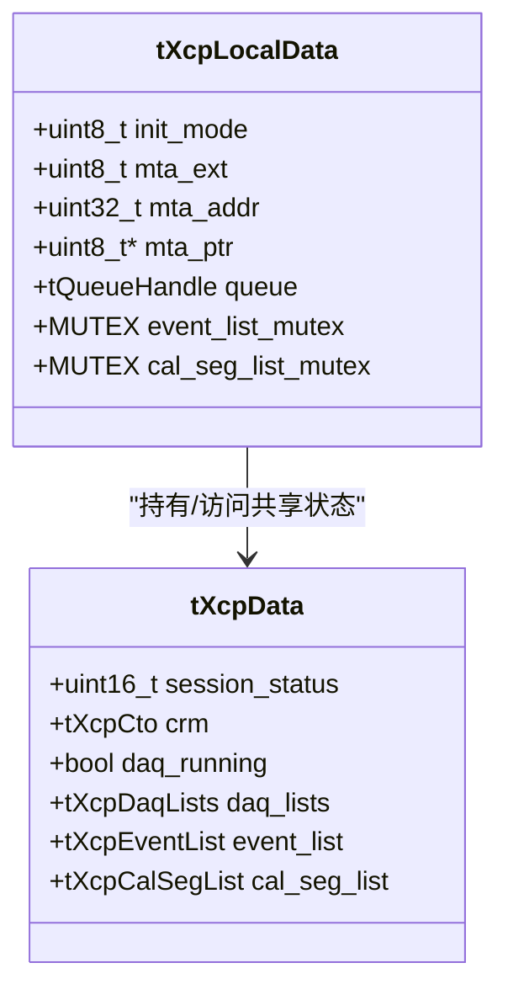
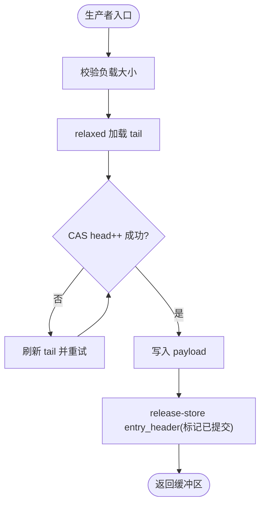
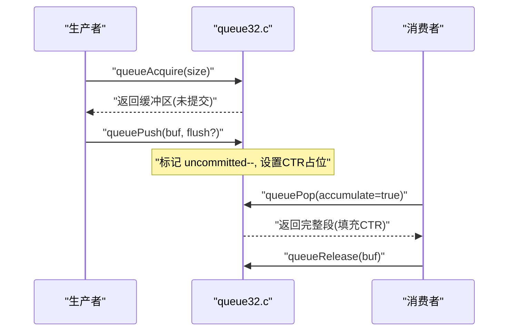
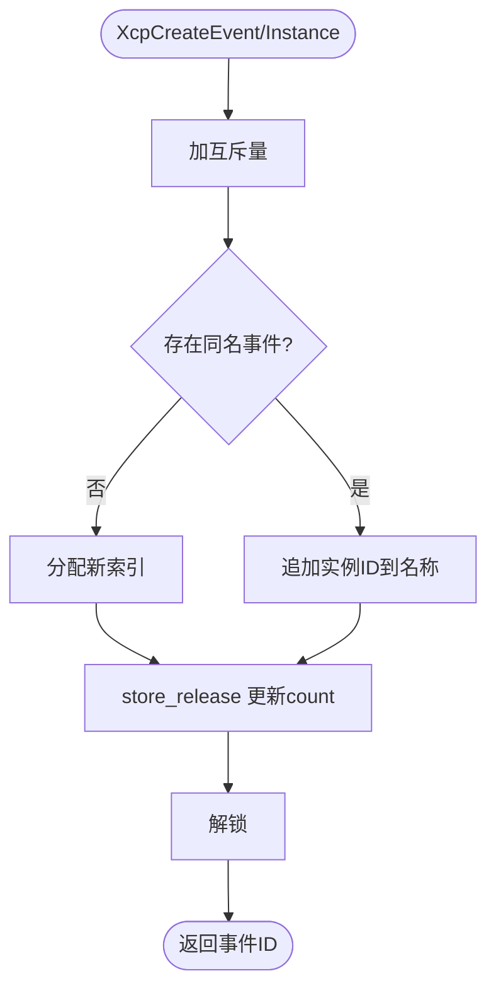
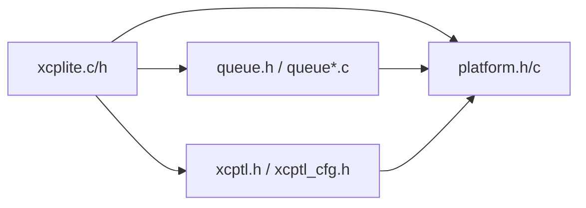

# 线程安全设计

<cite>
**本文引用的文件**
- [src/xcplite.h](file://src/xcplite.h)
- [src/xcplite.c](file://src/xcplite.c)
- [src/platform.h](file://src/platform.h)
- [src/platform.c](file://src/platform.c)
- [src/queue.h](file://src/queue.h)
- [src/queue32.c](file://src/queue32.c)
- [src/queue64f.c](file://src/queue64f.c)
- [src/xcptl.h](file://src/xcptl.h)
- [src/xcptl_cfg.h](file://src/xcptl_cfg.h)
- [examples/multi_thread_demo/src/main.c](file://examples/multi_thread_demo/src/main.c)
</cite>

## 目录
1. [简介](#简介)
2. [项目结构](#项目结构)
3. [核心组件](#核心组件)
4. [架构总览](#架构总览)
5. [详细组件分析](#详细组件分析)
6. [依赖关系分析](#依赖关系分析)
7. [性能考量](#性能考量)
8. [故障排查指南](#故障排查指南)
9. [结论](#结论)
10. [附录](#附录)

## 简介
本文件系统性阐述 XCPlite 的线程安全设计与并发控制机制，覆盖无锁数据结构、原子操作与内存序模型、多线程数据一致性保证、死锁预防与竞态条件避免、线程本地存储、上下文切换与任务调度，以及 POSIX 与 FreeRTOS 平台的差异。同时给出线程安全测试、性能基准与调试工具使用方法，并提供高并发应用的优化指导与最佳实践。

## 项目结构
XCPlite 将协议层（xcplite）、传输层抽象（xcptl）、平台抽象（platform）与队列子系统（queue*）解耦：
- xcplite：XCP 协议状态机、命令处理、DAQ/事件管理、共享/进程本地状态。
- platform：跨平台原子、互斥量、线程、时钟、共享内存等原语。
- queue：多实现（无锁固定长度、带锁可变长度、段聚合），用于传输层消息缓冲。
- xcptl：传输层接口（发送 CRM、等待队列空、获取计数器）。
- 示例：multi_thread_demo 展示多线程触发 DAQ 事件、校准段访问与 A2L 生成。

图表来源
- [src/xcplite.c:188-241](file://src/xcplite.c#L188-L241)
- [src/xcptl.h:19-26](file://src/xcptl.h#L19-L26)
- [src/queue.h:1-55](file://src/queue.h#L1-L55)
- [src/platform.h:300-467](file://src/platform.h#L300-L467)

章节来源
- [src/xcplite.h:382-495](file://src/xcplite.h#L382-L495)
- [src/xcptl_cfg.h:34-143](file://src/xcptl_cfg.h#L34-L143)

## 核心组件
- 共享与进程本地状态分离：tXcpData（可跨进程共享，含 DAQ、事件列表、溢出计数等）与 tXcpLocalData（每进程私有，含 MTA、队列句柄、互斥量等）。
- 原子与内存序：使用 C11 原子或平台内建，关键路径采用 acquire/release 语义；事件计数使用 relaxed/acquire/release 组合以平衡可见性与性能。
- 队列子系统：
  - queue64f.c：无锁固定长度队列，多生产者单消费者，基于 entry_header 发布/消费协议。
  - queue32.c：基于互斥量的可变长度队列，支持段聚合（累积多个消息为一个 UDP 段）。
- 平台抽象：统一线程创建/销毁、互斥量、时钟、POSIX 共享内存、FreeRTOS 任务与信号量。
- 回调与隔离：应用通过回调注册连接/断开/DAQ 启停、内存访问检查、时钟等，避免在协议层硬编码平台细节。

章节来源
- [src/xcplite.h:382-495](file://src/xcplite.h#L382-L495)
- [src/xcplite.c:188-241](file://src/xcplite.c#L188-L241)
- [src/queue.h:1-55](file://src/queue.h#L1-L55)
- [src/queue64f.c:15-43](file://src/queue64f.c#L15-L43)
- [src/queue32.c:1-14](file://src/queue32.c#L1-L14)
- [src/platform.h:300-467](file://src/platform.h#L300-L467)

## 架构总览
下图展示了从应用到传输层的调用链，以及队列与平台原语的协作方式。

图表来源
- [src/xcptl.h:19-26](file://src/xcptl.h#L19-L26)
- [src/queue.h:122-176](file://src/queue.h#L122-L176)
- [src/queue64f.c:399-519](file://src/queue64f.c#L399-L519)
- [src/queue32.c:207-304](file://src/queue32.c#L207-L304)
- [src/platform.c:161-363](file://src/platform.c#L161-L363)

## 详细组件分析

### 共享与进程本地状态及线程所有权
- tXcpData 为共享区，包含 session_status、crm 缓冲、daq_running、event_list、cal_seg_list 等，字段需对跨进程并发安全。
- tXcpLocalData 为进程本地，包含 init_mode、MTA、队列句柄、写指针、事件/校准段互斥量等。
- 通过宏 shared/shared_mut/local/local_mut 区分只读/可变访问；在特定构建下（如 TEST_MUTABLE_ACCESS_OWNERSHIP）会断言可变访问仅由拥有线程执行。

图表来源
- [src/xcplite.h:382-495](file://src/xcplite.h#L382-L495)
- [src/xcplite.c:188-241](file://src/xcplite.c#L188-L241)

章节来源
- [src/xcplite.h:382-495](file://src/xcplite.h#L382-L495)
- [src/xcplite.c:188-241](file://src/xcplite.c#L188-L241)

### 无锁队列（queue64f.c）：原子与内存序
- 每个槽位有固定大小的 atomic entry_header，编码“已提交”状态与用户负载长度。
- 生产者：CAS 推进 head，写入 payload，release-store 设置 entry_header 以发布数据。
- 消费者：acquire-load entry_header 后读取 payload，释放时清零并 release-store 推进 tail。
- 使用 relaxed 加载 tail 以降低竞争开销，必要时通过 flush_offset 提示优先处理。

图表来源
- [src/queue64f.c:399-519](file://src/queue64f.c#L399-L519)

章节来源
- [src/queue64f.c:15-43](file://src/queue64f.c#L15-L43)
- [src/queue64f.c:399-519](file://src/queue64f.c#L399-L519)

### 带锁队列（queue32.c）：互斥与段聚合
- 多生产者单消费者，使用互斥量保护 segment 分配与提交。
- 消息头包含 ctr/len，ctr 在消费阶段填充；支持将多条消息累积到一个 UDP 段中，减少系统调用。
- 提供 queueLevel/packets_lost 统计，便于监控拥塞。

图表来源
- [src/queue32.c:207-304](file://src/queue32.c#L207-L304)
- [src/queue32.c:333-417](file://src/queue32.c#L333-L417)

章节来源
- [src/queue32.c:1-14](file://src/queue32.c#L1-L14)
- [src/queue32.c:207-304](file://src/queue32.c#L207-L304)
- [src/queue32.c:333-417](file://src/queue32.c#L333-L417)

### 事件列表与原子计数
- 事件数量使用 atomic_uint_fast16_t count，读路径用 relaxed 快速路径，写路径用 acquire/release 确保可见性。
- 事件创建/实例化受 event_list_mutex 保护，避免多进程/多线程下的索引冲突。

图表来源
- [src/xcplite.c:779-797](file://src/xcplite.c#L779-L797)
- [src/xcplite.h:224-251](file://src/xcplite.h#L224-L251)

章节来源
- [src/xcplite.c:779-797](file://src/xcplite.c#L779-L797)
- [src/xcplite.h:224-251](file://src/xcplite.h#L224-L251)

### 线程本地存储与上下文
- 平台抽象提供 THREAD_LOCAL 宏，封装不同编译器/平台的线程局部存储。
- 示例中使用线程本地上下文记录 span/context 信息，结合 A2L 相对地址模式进行测量。

章节来源
- [src/platform.h:454-467](file://src/platform.h#L454-L467)
- [examples/multi_thread_demo/src/main.c:78-163](file://examples/multi_thread_demo/src/main.c#L78-L163)

### 平台差异：POSIX 与 FreeRTOS
- 线程与任务：
  - POSIX：pthread_create/join/cancel。
  - FreeRTOS：xTaskCreate/xTaskCreateStatic，vTaskDelete，无阻塞 join。
- 互斥量：
  - POSIX：pthread_mutex_t。
  - FreeRTOS：xSemaphoreCreateMutex/RecursiveMutex，支持静态分配。
- 时钟：
  - POSIX：clock_gettime(CLOCK_MONOTONIC_RAW/REALTIME)。
  - FreeRTOS：xTaskGetTickCount 转换至配置分辨率。
- 共享内存：
  - POSIX：shm_open/mmap/flock 选举 leader/follower。
  - FreeRTOS：不使用 POSIX SHM（平台限制）。

章节来源
- [src/platform.h:300-467](file://src/platform.h#L300-L467)
- [src/platform.c:370-432](file://src/platform.c#L370-L432)
- [src/platform.c:455-500](file://src/platform.c#L455-L500)
- [src/platform.c:505-654](file://src/platform.c#L505-L654)
- [src/platform.c:161-363](file://src/platform.c#L161-L363)

### 数据一致性与竞态避免
- 共享状态读写：
  - 只读路径使用 const 引用与 relaxed 加载，降低开销。
  - 写路径使用互斥量或原子 release-store，配合 acquire-load 保证可见性。
- 事件/校准段创建：
  - 通过 event_list_mutex/cal_seg_list_mutex 串行化，避免索引分配竞态。
- 队列溢出：
  - 无锁队列在无法获得槽位时递增 packets_lost；带锁队列同样维护丢失计数，供上层告警/降级。

章节来源
- [src/xcplite.c:779-797](file://src/xcplite.c#L779-L797)
- [src/queue64f.c:478-487](file://src/queue64f.c#L478-L487)
- [src/queue32.c:260-264](file://src/queue32.c#L260-L264)

### 死锁预防
- 互斥量粒度最小化：仅在必要范围加锁（如事件/校准段创建）。
- 避免嵌套锁：尽量顺序化资源访问，不在持锁期间发起可能再次请求同一锁的操作。
- 超时与健壮性：FreeRTOS 互斥量默认阻塞，注意任务优先级与持有时间；POSIX 互斥量避免长时间占用。

章节来源
- [src/platform.h:300-349](file://src/platform.h#L300-L349)
- [src/platform.c:370-432](file://src/platform.c#L370-L432)

### 任务调度与上下文切换
- POSIX：线程由内核调度，yield 通过 sched_yield。
- FreeRTOS：任务由 RTOS 调度，create_thread 映射为 xTaskCreate/CreateStatic，join 为空操作（通过事件同步）。
- 队列消费侧通常运行在独立接收/发送任务中，避免阻塞命令处理线程。

章节来源
- [src/platform.h:350-433](file://src/platform.h#L350-L433)
- [src/platform.c:370-432](file://src/platform.c#L370-L432)

## 依赖关系分析

图表来源
- [src/xcplite.c:49-85](file://src/xcplite.c#L49-L85)
- [src/queue.h:1-55](file://src/queue.h#L1-L55)
- [src/xcptl_cfg.h:34-143](file://src/xcptl_cfg.h#L34-L143)

章节来源
- [src/xcplite.c:49-85](file://src/xcplite.c#L49-L85)
- [src/queue.h:1-55](file://src/queue.h#L1-L55)
- [src/xcptl_cfg.h:34-143](file://src/xcptl_cfg.h#L34-L143)

## 性能考量
- 无锁队列在高并发场景显著降低锁竞争，适合高频 DAQ 事件。
- 使用 relaxed 读路径提升吞吐，必要时通过 flush_offset 提示优先处理。
- 段聚合减少系统调用次数，提高网络吞吐。
- 合理设置队列大小与 MTU，避免分片与丢包。
- 日志级别与调试指标按需开启，生产环境关闭冗余输出。

[本节为通用指导，不直接分析具体文件]

## 故障排查指南
- 队列溢出：
  - 检查 queueLevel/packets_lost，增大队列或降低产生速率。
- 事件/校准段创建失败：
  - 确认互斥量初始化与生命周期，避免重复创建。
- 共享内存异常：
  - 使用 tools/shm_cleanup.sh 清理残留对象；检查 leader/follower 初始化顺序。
- 时钟不一致：
  - 确认 OPTION_CLOCK_EPOCH_* 配置与目标平台能力。

章节来源
- [src/queue64f.c:478-487](file://src/queue64f.c#L478-L487)
- [src/queue32.c:260-264](file://src/queue32.c#L260-L264)
- [src/platform.c:201-319](file://src/platform.c#L201-L319)

## 结论
XCPlite 通过清晰的共享/进程本地状态分离、细粒度的原子与内存序、无锁与带锁队列的组合、以及平台抽象，实现了高效且安全的并发控制。其设计兼顾了高性能与可移植性，适用于 POSIX 与 FreeRTOS 平台的高并发数据采集与标定场景。

[本节为总结，不直接分析具体文件]

## 附录

### 线程安全测试、性能基准与调试工具
- 线程安全测试：
  - multi_thread_demo：多线程触发 DAQ 事件、访问校准段，验证事件列表与队列并发安全性。
- 性能基准：
  - 队列测试：queue_test 观察 packets_lost、队列深度与延迟分布。
  - 以太网传输测试：eth_transport_test 评估吞吐与时延。
- 调试工具：
  - xcpclient：上传 A2L、捕获/回放 XCP 报文，辅助定位时序问题。
  - shmtool：查看/清理共享内存对象。
  - 日志与指标：启用 TEST_ENABLE_DBG_METRICS 收集内部计数，调整日志级别定位瓶颈。

章节来源
- [examples/multi_thread_demo/src/main.c:343-418](file://examples/multi_thread_demo/src/main.c#L343-L418)
- [src/xcptl_cfg.h:83-143](file://src/xcptl_cfg.h#L83-L143)
- [src/platform.c:445-453](file://src/platform.c#L445-L453)

### 高并发优化指导与最佳实践
- 优先选择无锁队列（queue64f.c）以减少锁竞争。
- 合理设置队列容量与 MTU，避免频繁分片与丢包。
- 使用事件批量触发与段聚合，降低系统调用开销。
- 谨慎使用全局锁，尽量缩小临界区；避免在持锁期间进行 I/O。
- 利用线程本地存储保存上下文，减少共享状态竞争。
- 在生产环境关闭冗余日志，按需启用调试指标。

[本节为通用指导，不直接分析具体文件]