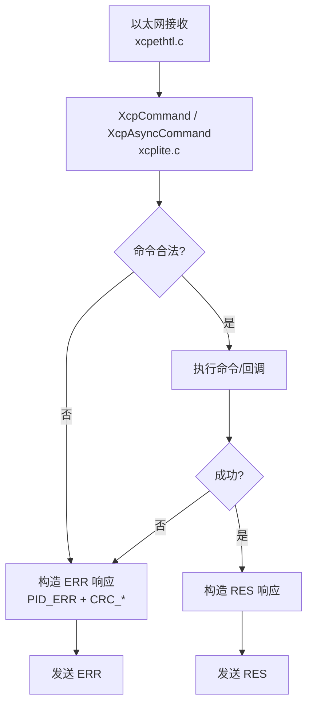
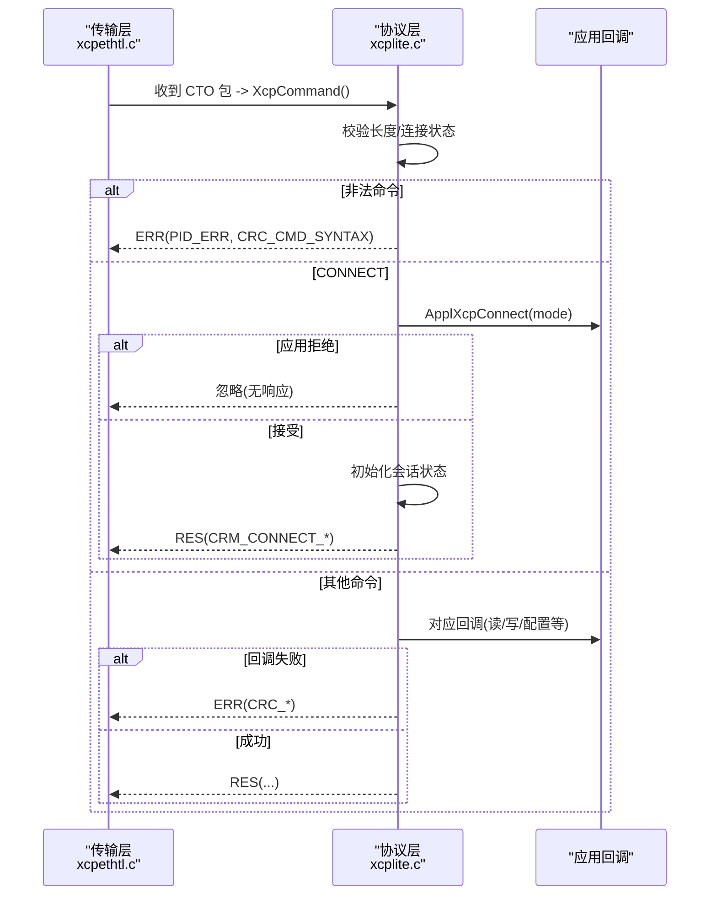
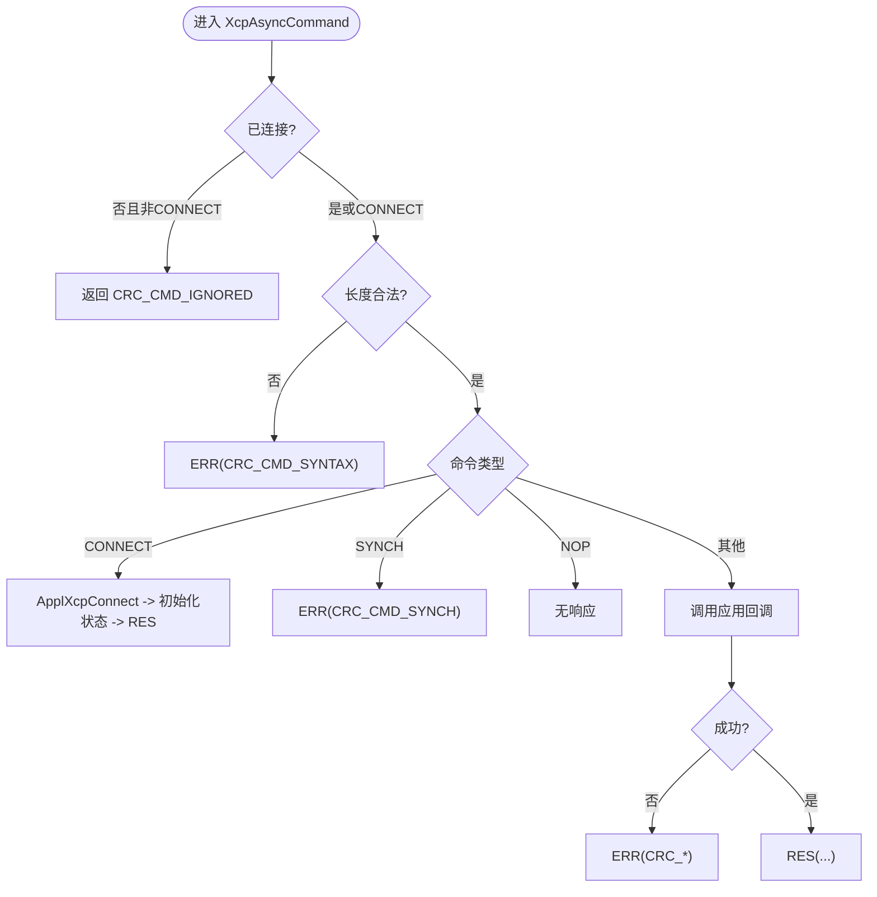
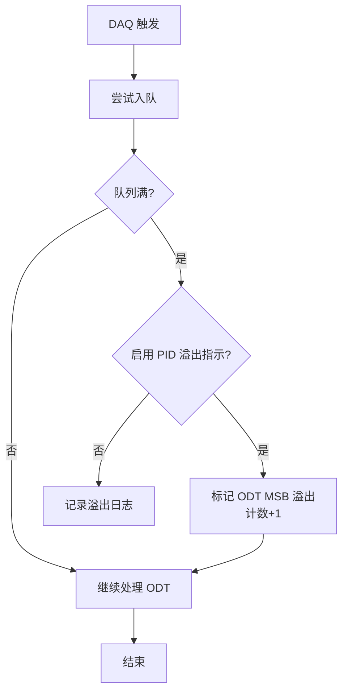
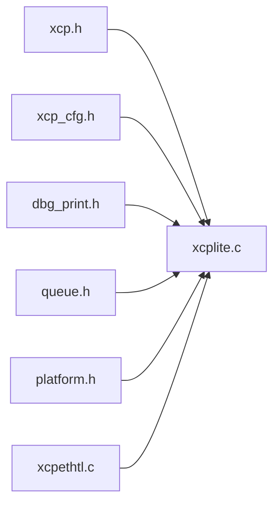

# 错误处理机制

<cite>
**本文引用的文件**
- [xcp.h](file://src/xcp.h)
- [xcplite.c](file://src/xcplite.c)
- [xcplite.h](file://src/xcplite.h)
- [xcp_cfg.h](file://src/xcp_cfg.h)
- [dbg_print.h](file://src/dbg_print.h)
- [xcpethtl.c](file://src/xcpethtl.c)
</cite>

## 目录
1. [简介](#简介)
2. [项目结构](#项目结构)
3. [核心组件](#核心组件)
4. [架构总览](#架构总览)
5. [详细组件分析](#详细组件分析)
6. [依赖关系分析](#依赖关系分析)
7. [性能考量](#性能考量)
8. [故障排查指南](#故障排查指南)
9. [结论](#结论)
10. [附录](#附录)

## 简介
本文件系统性阐述 XCPlite 的错误处理与异常恢复机制，覆盖 XCP 协议错误码定义、错误分类与传播策略；说明异常检测、错误日志与调试信息输出；解释错误恢复算法、重试机制与降级处理；梳理不同错误类型的处理流程与用户通知机制；并提供错误统计、性能影响分析与故障诊断工具建议，以及最佳实践与自定义错误处理器开发指南。

## 项目结构
XCPlite 的错误处理贯穿协议层（xcplite.c）、协议定义（xcp.h）、配置（xcp_cfg.h）、调试打印（dbg_print.h）以及传输层入口（xcpethtl.c）。关键路径如下：
- 协议命令进入点：以太网传输层将收到的 CTO 包交给 XcpCommand 处理
- 命令分发与错误构造：XcpAsyncCommand 解析命令、校验参数、调用应用回调，并在出错时构造 ERR 响应
- 错误码与事件：集中定义于 xcp.h（PID_ERR、CRC_*、EVC_*、SERV_*）
- 日志与调试：通过 dbg_print.h 的分级宏输出，支持运行时或编译期固定级别
- 状态与恢复：会话状态、DAQ 运行态、挂起命令标志等用于恢复与降级

**图表来源**
- [xcpethtl.c:291-357](file://src/xcpethtl.c#L291-L357)
- [xcplite.c:2031-2100](file://src/xcplite.c#L2031-L2100)

**章节来源**
- [xcpethtl.c:291-357](file://src/xcpethtl.c#L291-L357)
- [xcplite.c:2031-2100](file://src/xcplite.c#L2031-L2100)

## 核心组件
- 协议错误码与事件定义：集中在 xcp.h，包括 PID_ERR、CRC_* 系列错误码、EVC_* 事件码、SERV_* 服务请求码
- 命令处理与错误构造：xcplite.c 中的 XcpAsyncCommand 负责命令解析、参数检查、应用回调调用与错误/正常响应构造
- 配置开关：xcp_cfg.h 控制是否启用某些特性（如超时、持久化、测试检查），间接影响错误行为
- 调试日志：dbg_print.h 提供分级日志宏，便于定位错误与性能问题
- 传输层入口：xcpethtl.c 将底层报文转换为 CTO 并调用 XcpCommand

**章节来源**
- [xcp.h:132-189](file://src/xcp.h#L132-L189)
- [xcplite.c:2031-2100](file://src/xcplite.c#L2031-L2100)
- [xcp_cfg.h:325-456](file://src/xcp_cfg.h#L325-L456)
- [dbg_print.h:21-244](file://src/dbg_print.h#L21-L244)
- [xcpethtl.c:291-357](file://src/xcpethtl.c#L291-L357)

## 架构总览
XCPlite 的错误处理采用“命令驱动 + 状态机”的模式：
- 所有命令经 XcpAsyncCommand 统一入口，先进行长度与连接状态检查
- 对非法命令或越界参数直接返回 ERR（PID_ERR + CRC_*）
- 对可延后处理的命令（如动态地址相关）使用挂起标志位，避免阻塞
- DAQ 队列溢出通过事件或状态位指示，配合传输层计数器实现丢包检测
- 会话断开与重连会重置状态，确保一致性

**图表来源**
- [xcpethtl.c:291-357](file://src/xcpethtl.c#L291-L357)
- [xcplite.c:2031-2100](file://src/xcplite.c#L2031-L2100)

## 详细组件分析

### XCP 协议错误码与事件
- 错误包标识：PID_ERR = 0xFE
- 命令返回码（错误类）：CRC_CMD_OK/CRC_CMD_SYNCH/CRC_CMD_PENDING/CRC_CMD_IGNORED/CRC_CMD_BUSY/CRC_DAQ_ACTIVE/CRC_PGM_ACTIVE/CRC_CMD_UNKNOWN/CRC_CMD_SYNTAX/CRC_OUT_OF_RANGE/CRC_WRITE_PROTECTED/CRC_ACCESS_DENIED/CRC_ACCESS_LOCKED/CRC_PAGE_NOT_VALID/CRC_MODE_NOT_VALID/CRC_SEGMENT_NOT_VALID/CRC_SEQUENCE/CRC_DAQ_CONFIG/CRC_MEMORY_OVERFLOW/CRC_GENERIC/CRC_VERIFY/CRC_RESOURCE_TEMPORARY_NOT_ACCESSIBLE/CRC_SUBCMD_UNKNOWN/CRC_TIMECORR_STATE_CHANGE
- 事件码（EVC_*）：用于异步通知（如 DAQ 过载、会话终止、时间同步等）
- 服务请求码（SERV_*）：服务器主动请求（如复位、文本消息）

这些常量在 xcp.h 中统一定义，供协议层与传输层共同使用。

**章节来源**
- [xcp.h:132-189](file://src/xcp.h#L132-L189)

### 命令处理与错误传播（XcpAsyncCommand）
- 入口：XcpCommand 委托给 XcpAsyncCommand
- 默认响应：CRM_CMD=PID_RES，长度初始化为最小值
- 连接检查：非 CONNECT 且未连接则忽略并返回 CRC_CMD_IGNORED
- 长度检查：CTO 长度不合法则返回 CRC_CMD_SYNTAX
- 子命令分发：各 case 分支调用应用回调或内部逻辑，失败时通过 error() 构造 ERR
- 特殊命令：CC_SYNCH 总是返回 ERR(CRC_CMD_SYNCH)，CC_NOP 不响应

**图表来源**
- [xcplite.c:2031-2100](file://src/xcplite.c#L2031-L2100)

**章节来源**
- [xcplite.c:2031-2100](file://src/xcplite.c#L2031-L2100)

### 异常检测与错误日志
- 日志级别：dbg_print.h 支持 1-6 级，可通过 OPTION_FIXED_DBG_LEVEL 或运行时 gXcpLogLevel 控制
- 错误与警告：DBG_PRINT_ERROR/DBG_PRINTF_ERROR、DBG_PRINT_WARNING/DBG_PRINTF_WARNING
- 调试输出：DBG_PRINTF3/4/5/6 用于跟踪命令、DAQ 触发、队列溢出等
- 可选位置信息：开启 DBG_PRINT_ERROR_LOCATION 可在错误中包含文件名与行号

**章节来源**
- [dbg_print.h:21-244](file://src/dbg_print.h#L21-L244)

### 错误恢复算法、重试与降级
- 挂起命令（动态地址场景）：当无法在当前上下文立即执行时，设置 cmd_pending 标志并将 CRM 暂存，后续由后台任务完成；若已有挂起命令则返回 CRC_CMD_BUSY
- DAQ 队列溢出：
  - 若启用 OVERRUN_INDICATION_PID，则在 DTO 头标记溢出并计数
  - 否则通过传输层计数器间隙检测丢包，并记录日志
- 会话恢复：CONNECT 会重置会话状态并清理 DAQ，确保一致性
- 超时与等待：停止 DAQ 后等待传输队列为空，带超时防止阻塞

**图表来源**
- [xcplite.c:1584-1674](file://src/xcplite.c#L1584-L1674)

**章节来源**
- [xcplite.c:1584-1674](file://src/xcplite.c#L1584-L1674)
- [xcplite.c:2011-2023](file://src/xcplite.c#L2011-L2023)

### 不同错误类型的处理流程与用户通知
- 协议层错误：通过 ERR 包（PID_ERR + CRC_*）返回客户端
- 事件通知：EVC_* 用于异步通知（如 DAQ 过载、会话终止、时间同步）
- 服务请求：SERV_TEXT 可用于向客户端发送纯文本消息（需启用 XCP_ENABLE_SERV_TEXT）
- 应用侧错误：应用回调返回错误码，协议层将其映射为相应 CRC_* 并返回

**章节来源**
- [xcp.h:132-189](file://src/xcp.h#L132-L189)
- [xcp_cfg.h:345-358](file://src/xcp_cfg.h#L345-L358)

### 错误统计、性能影响与诊断工具
- 统计指标：TEST_ENABLE_DBG_METRICS 下暴露若干全局计数器（如 TX/RX 包数、事件计数等），便于性能分析
- 性能影响：
  - 扩展错误检查（XCP_ENABLE_TEST_CHECKS）在内层循环增加断言与边界检查，轻微影响 DAQ 性能
  - 日志级别越高，I/O 开销越大；生产环境建议降低级别或固定级别
- 诊断建议：
  - 使用 DBG_PRINTF3/4/5/6 跟踪命令与 DAQ 触发
  - 关注 DAQ 溢出计数与队列状态
  - 结合传输层计数器检测丢包

**章节来源**
- [xcplite.h:637-653](file://src/xcplite.h#L637-L653)
- [xcp_cfg.h:454-456](file://src/xcp_cfg.h#L454-L456)
- [dbg_print.h:21-244](file://src/dbg_print.h#L21-L244)

## 依赖关系分析
- xcplite.c 依赖 xcp.h（错误码/事件/命令定义）、xcp_cfg.h（功能开关）、dbg_print.h（日志）、queue.h（队列）、platform.h（原子操作）
- xcpethtl.c 作为传输层入口，调用 XcpCommand 并处理以太网特定逻辑
- 应用回调（ApplXcp*）由上层实现，决定具体业务错误与恢复策略

**图表来源**
- [xcplite.c:49-85](file://src/xcplite.c#L49-L85)
- [xcpethtl.c:291-357](file://src/xcpethtl.c#L291-L357)

**章节来源**
- [xcplite.c:49-85](file://src/xcplite.c#L49-L85)
- [xcpethtl.c:291-357](file://src/xcpethtl.c#L291-L357)

## 性能考量
- 日志级别与 I/O：高日志级别会增加 CPU 与 I/O 开销，建议在调试阶段启用详细日志，生产环境降低级别
- 内层检查：XCP_ENABLE_TEST_CHECKS 在 DAQ 内层循环引入额外检查，可能带来微小延迟
- 队列溢出：频繁溢出会导致数据丢失，应评估 DAQ 频率与队列深度，必要时调整优先级或减少条目
- 挂起命令：避免在高负载时频繁出现 CRC_CMD_BUSY，优化动态地址处理路径

[本节为通用指导，无需特定文件引用]

## 故障排查指南
- 常见错误码定位：
  - CRC_CMD_SYNTAX：检查 CTO 长度与格式
  - CRC_OUT_OF_RANGE：检查地址/大小参数合法性
  - CRC_WRITE_PROTECTED/CRC_ACCESS_DENIED：检查权限与保护状态
  - CRC_DAQ_CONFIG：检查 DAQ 列表配置是否正确
- 日志采集：
  - 启用 DBG_PRINTF3/4/5/6 捕获命令与 DAQ 触发细节
  - 关注 DAQ 溢出计数与队列状态
- 传输层问题：
  - 使用以太网抓包工具验证 PID_ERR/RES 包
  - 检查传输层计数器间隙以确认丢包
- 应用回调错误：
  - 在 ApplXcp* 回调中返回明确错误码，便于协议层映射为 CRC_*

**章节来源**
- [xcp.h:140-166](file://src/xcp.h#L140-L166)
- [dbg_print.h:21-244](file://src/dbg_print.h#L21-L244)

## 结论
XCPlite 的错误处理以协议标准为基础，结合状态机与回调机制，实现了从命令校验、错误构造到事件通知的完整链路。通过配置开关与日志系统，可在调试与生产环境间灵活切换。对于 DAQ 溢出、挂起命令等场景，提供了明确的恢复与降级策略。建议在生产环境中合理配置日志级别与检查项，并结合传输层工具进行端到端诊断。

[本节为总结性内容，无需特定文件引用]

## 附录

### 最佳实践
- 明确错误分类：区分协议层错误（CRC_*）、事件通知（EVC_*）与服务请求（SERV_*）
- 谨慎启用扩展检查：仅在调试阶段启用 XCP_ENABLE_TEST_CHECKS
- 控制日志级别：生产环境使用较低级别或固定级别，避免 I/O 瓶颈
- 监控 DAQ 健康：定期检查溢出计数与队列状态，必要时调整配置
- 应用回调健壮性：在 ApplXcp* 回调中进行边界检查与错误返回

[本节为通用指导，无需特定文件引用]

### 自定义错误处理器开发指南
- 注册应用回调：通过 ApplXcpRegister*Callback 注册连接、DAQ、内存访问等回调
- 在回调中实现错误检测与恢复逻辑，返回合适的错误码
- 利用事件与服务请求向客户端传递状态与诊断信息
- 结合日志系统输出关键路径信息，便于问题定位

**章节来源**
- [xcplite.h:606-628](file://src/xcplite.h#L606-L628)