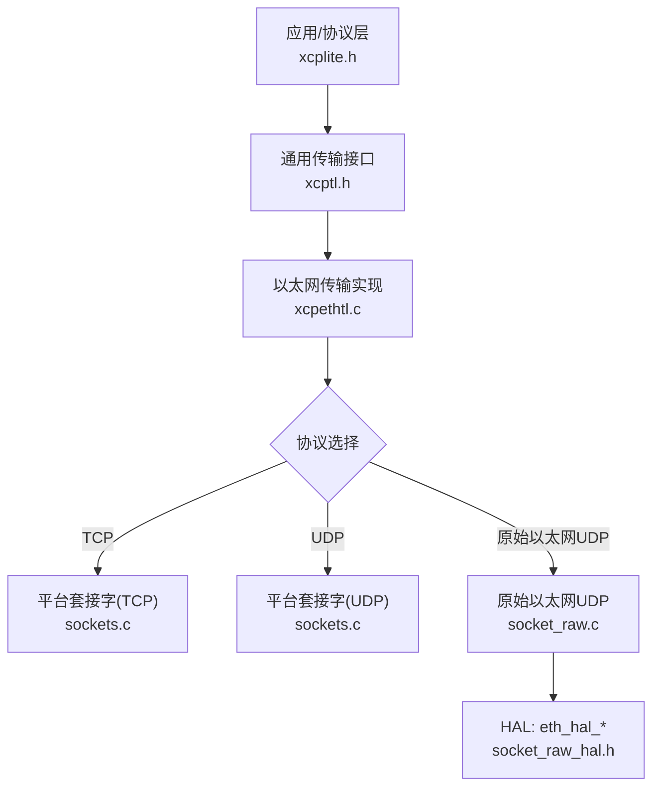
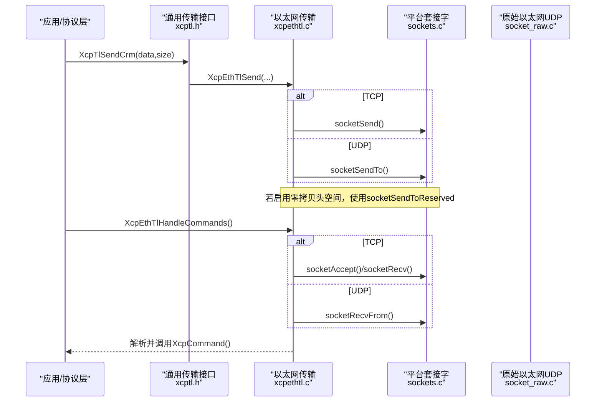
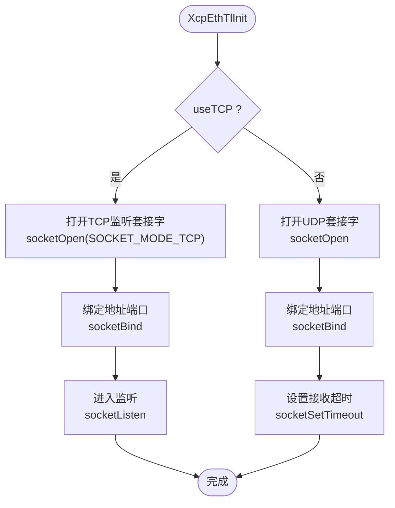
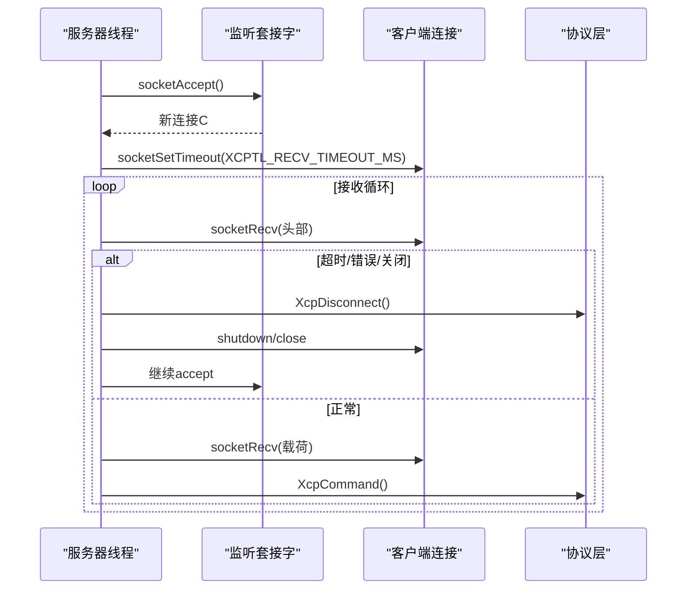
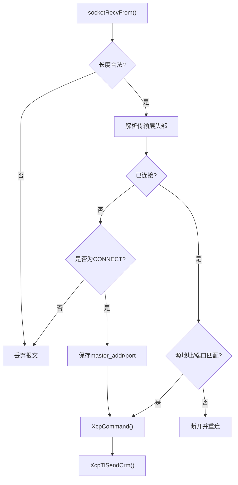
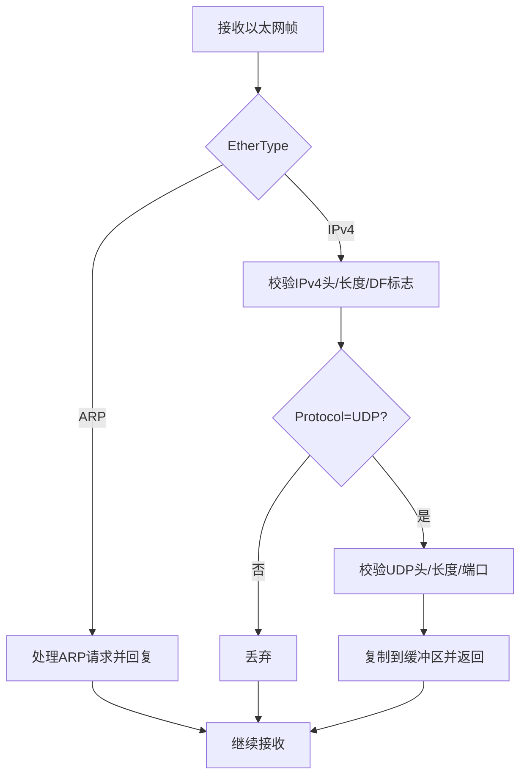
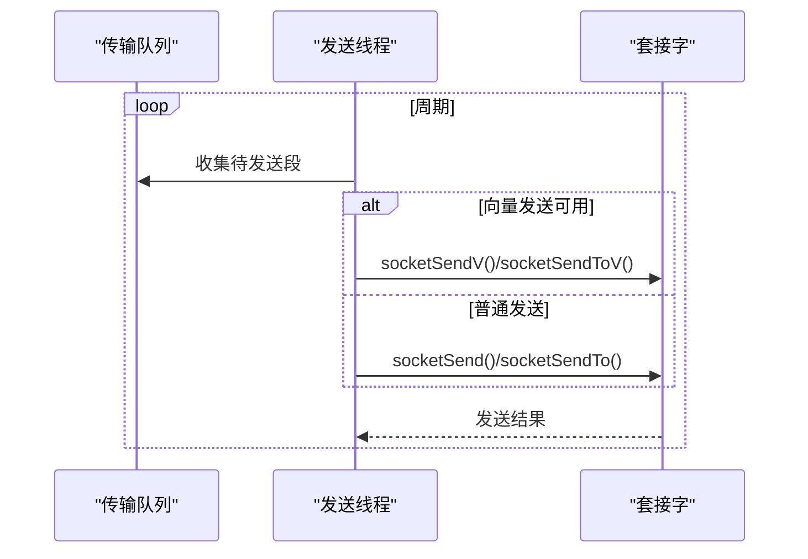
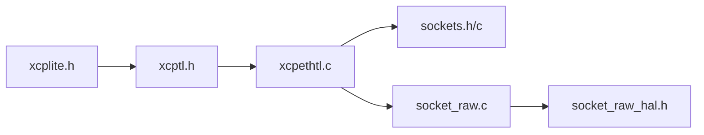

# TCP和UDP协议实现

<cite>
**本文引用的文件**
- [xcpethtl.c](file://src/xcpethtl.c)
- [xcpethtl.h](file://src/xcpethtl.h)
- [xcptl.h](file://src/xcptl.h)
- [xcptl_cfg.h](file://src/xcptl_cfg.h)
- [sockets.h](file://src/sockets.h)
- [sockets.c](file://src/sockets.c)
- [socket_raw.c](file://src/socket_raw.c)
- [socket_raw_hal.h](file://src/socket_raw_hal.h)
- [xcplite.h](file://src/xcplite.h)
- [xcplib_cfg.h](file://src/xcplib_cfg.h)
</cite>

## 目录
1. [简介](#简介)
2. [项目结构](#项目结构)
3. [核心组件](#核心组件)
4. [架构总览](#架构总览)
5. [详细组件分析](#详细组件分析)
6. [依赖关系分析](#依赖关系分析)
7. [性能考量](#性能考量)
8. [故障排查指南](#故障排查指南)
9. [结论](#结论)
10. [附录](#附录)

## 简介
本文件系统性解析XCPlite中TCP与UDP协议的完整实现机制，重点说明：
- 连接建立、数据传输与连接管理的差异
- TCP监听模式、连接接受与状态管理
- UDP无连接通信与数据报处理
- 协议选择逻辑、配置选项与性能特点
- 连接超时、错误恢复与重连策略的实现细节
- 协议选择的指导原则与性能对比

## 项目结构
XCPlite的传输层由“通用传输接口 + 以太网传输实现 + 平台套接字抽象 + 可选原始以太网实现”构成：
- xcpethtl.c/h：XCP在UDP/TCP上的传输层实现（含多播支持）
- xcptl.h：通用传输层对外接口（发送CRM、等待队列空等）
- sockets.h/c：跨平台套接字抽象（Linux/Windows/macOS/QNX/FreeRTOS）
- socket_raw.c：无IP栈的原始以太网UDP实现（与标准UDP/TCP互斥）
- xcptl_cfg.h：传输层编译期参数（MTU、段大小、超时、头空间等）
- xcplib_cfg.h：全局选项开关（是否启用TCP/UDP、队列类型等）

图表来源
- [xcpethtl.c:603-715](file://src/xcpethtl.c#L603-L715)
- [sockets.h:207-357](file://src/sockets.h#L207-L357)
- [socket_raw.c:552-629](file://src/socket_raw.c#L552-L629)
- [socket_raw_hal.h:74-105](file://src/socket_raw_hal.h#L74-L105)

章节来源
- [xcpethtl.c:603-715](file://src/xcpethtl.c#L603-L715)
- [xcptl_cfg.h:16-33](file://src/xcptl_cfg.h#L16-L33)
- [xcplib_cfg.h:76-79](file://src/xcplib_cfg.h#L76-L79)

## 核心组件
- 传输层初始化与关闭：XcpEthTlInit/XcpEthTlShutdown
- 命令接收与分发：XcpEthTlHandleCommands
- 响应发送：XcpTlSendCrm（通过传输层发送单个CRM）
- 队列发送：XcpTlHandleTransmitQueue（批量发送DAQ/EVENT段）
- 平台套接字：socketOpen/Bind/Recv/Send/Listen/Accept/Shutdown/Close
- 原始以太网UDP：socket_raw.c提供无IP栈的UDP收发、ARP/ICMP应答

章节来源
- [xcpethtl.c:241-287](file://src/xcpethtl.c#L241-L287)
- [xcpethtl.c:377-534](file://src/xcpethtl.c#L377-L534)
- [xcpethtl.c:791-860](file://src/xcpethtl.c#L791-L860)
- [sockets.h:207-357](file://src/sockets.h#L207-L357)
- [socket_raw.c:660-720](file://src/socket_raw.c#L660-L720)

## 架构总览
下图展示从上层协议到具体传输路径的调用链与数据流。

图表来源
- [xcpethtl.c:135-179](file://src/xcpethtl.c#L135-L179)
- [xcpethtl.c:377-534](file://src/xcpethtl.c#L377-L534)
- [sockets.h:260-298](file://src/sockets.h#L260-L298)
- [socket_raw.c:660-720](file://src/socket_raw.c#L660-L720)

## 详细组件分析

### 协议选择与初始化
- 编译期选项：
  - OPTION_ENABLE_TCP / OPTION_ENABLE_UDP：决定启用TCP或UDP
  - OPTION_ENABLE_UDP_RAW：与TCP/UDP互斥，用于无IP栈目标
  - XCPTL_ENABLE_MULTICAST：可选的多播支持
- 运行期选择：
  - XcpEthTlInit(addr,port,useTCP,queue)根据useTCP决定创建监听套接字（TCP）或绑定UDP端口
  - isTCP()宏在运行时判断当前工作模式

图表来源
- [xcpethtl.c:603-715](file://src/xcpethtl.c#L603-L715)
- [xcptl_cfg.h:16-33](file://src/xcptl_cfg.h#L16-L33)
- [xcplib_cfg.h:76-79](file://src/xcplib_cfg.h#L76-L79)

章节来源
- [xcpethtl.c:603-715](file://src/xcpethtl.c#L603-L715)
- [xcptl_cfg.h:16-33](file://src/xcptl_cfg.h#L16-L33)
- [xcplib_cfg.h:76-79](file://src/xcplib_cfg.h#L76-L79)

### TCP模式：监听、连接接受与状态管理
- 监听模式：
  - 使用listen_socket进入阻塞accept循环，直到有客户端连接
  - 接受后为连接套接字设置接收超时，便于周期性检查后台任务与关闭信号
- 连接生命周期：
  - 接收头部与载荷时，若发生超时、错误或连接关闭，则断开XCP会话并回到监听模式
  - 对不完整帧或非法长度直接关闭连接，防止资源泄漏
- 状态管理：
  - 已连接状态下，仅处理来自同一连接的命令；未连接时仅处理CONNECT命令以建立会话

图表来源
- [xcpethtl.c:377-488](file://src/xcpethtl.c#L377-L488)

章节来源
- [xcpethtl.c:377-488](file://src/xcpethtl.c#L377-L488)

### UDP模式：无连接通信与数据报处理
- 无连接语义：
  - 不维护连接状态，每个数据报独立处理
  - 首次收到CONNECT时记录主机的IP与端口，后续只接受该源地址/端口的消息
- 数据报校验：
  - 严格校验长度与头部字段，丢弃损坏报文
  - 对超大报文（MSGSIZE）进行容错处理
- 响应发送：
  - 向记录的master_addr:master_port回包；支持多播响应（可选）

图表来源
- [xcpethtl.c:490-534](file://src/xcpethtl.c#L490-L534)
- [xcpethtl.c:241-287](file://src/xcpethtl.c#L241-L287)

章节来源
- [xcpethtl.c:490-534](file://src/xcpethtl.c#L490-L534)
- [xcpethtl.c:241-287](file://src/xcpethtl.c#L241-L287)

### 原始以太网UDP（无IP栈）
- 适用场景：无TCP/IP栈的目标，直接在以太网帧上构建IPv4/UDP
- 关键特性：
  - 仅应答ARP请求，不主动发起ARP请求
  - 从收到的数据报学习对端MAC，禁止广播学习
  - 支持可选ICMP Echo应答，便于链路调试
  - 严格限制单帧大小，避免分片
- 与标准UDP/TCP互斥：编译期强制约束

图表来源
- [socket_raw.c:413-526](file://src/socket_raw.c#L413-L526)
- [socket_raw_hal.h:17-37](file://src/socket_raw_hal.h#L17-L37)

章节来源
- [socket_raw.c:413-526](file://src/socket_raw.c#L413-L526)
- [socket_raw_hal.h:17-37](file://src/socket_raw_hal.h#L17-L37)

### 数据传输与队列聚合
- CRM（命令响应）：
  - 低延迟路径：直接封装为传输层消息并通过套接字发送
  - 可选通过传输队列发送，提升吞吐但增加少量延迟
- DTO/事件（DAQ/EVENT）：
  - 使用传输队列累积多个消息为一个段，减少系统调用开销
  - 支持向量发送（scatter-gather），提高带宽利用率
  - 支持保留头空间（zero-copy）以减少拷贝

图表来源
- [xcpethtl.c:791-860](file://src/xcpethtl.c#L791-L860)
- [sockets.h:300-309](file://src/sockets.h#L300-L309)

章节来源
- [xcpethtl.c:791-860](file://src/xcpethtl.c#L791-L860)
- [sockets.h:300-309](file://src/sockets.h#L300-L309)

### 连接超时、错误恢复与重连策略
- 超时机制：
  - 接收线程设置XCPTL_RECV_TIMEOUT_MS（默认100ms），超时返回0，允许执行后台任务与检查关闭信号
  - 原始以太网UDP内部按截止时间切片轮询HAL，保证阻塞时间可控
- 错误恢复：
  - TCP：遇到连接关闭/重置/超时，立即断开XCP会话，关闭套接字并回到监听模式
  - UDP：丢弃损坏报文；对MSGSIZE进行容错；仅在CONNECT阶段记录源地址/端口
- 重连策略：
  - TCP：自动回到accept等待新连接
  - UDP：无显式重连；客户端需重新发送CONNECT以重建会话

章节来源
- [xcpethtl.c:377-534](file://src/xcpethtl.c#L377-L534)
- [socket_raw.c:660-720](file://src/socket_raw.c#L660-L720)
- [xcptl_cfg.h:83-84](file://src/xcptl_cfg.h#L83-L84)

### 协议选择逻辑与配置选项
- 编译期：
  - OPTION_ENABLE_TCP / OPTION_ENABLE_UDP：启用对应协议
  - OPTION_ENABLE_UDP_RAW：与TCP/UDP互斥，用于无IP栈目标
  - XCPTL_ENABLE_MULTICAST：可选多播支持
- 运行期：
  - XcpEthTlInit的useTCP参数决定工作模式
  - isTCP()宏在运行时区分TCP/UDP路径

章节来源
- [xcptl_cfg.h:16-33](file://src/xcptl_cfg.h#L16-L33)
- [xcplib_cfg.h:76-79](file://src/xcplib_cfg.h#L76-L79)
- [xcpethtl.c:109-117](file://src/xcpethtl.c#L109-L117)

### 性能特点与优化
- 低延迟路径：
  - CRM直接发送，避免队列排队带来的额外延迟
- 高吞吐路径：
  - 向量发送（sendmsg）将多个消息打包为一个段
  - 零拷贝头空间（XCPTL_TX_HEADROOM）减少内存拷贝
- MTU与分片控制：
  - 禁用IP分片，避免丢包与重组抖动
  - 对超出MTU的数据报返回错误，便于快速定位配置问题
- 平台差异：
  - Linux支持硬件时间戳（可选），提升同步精度
  - lwIP平台需确保OPTION_MTU正确，否则可能静默分片或丢包

章节来源
- [xcpethtl.c:135-179](file://src/xcpethtl.c#L135-L179)
- [xcpethtl.c:791-860](file://src/xcpethtl.c#L791-L860)
- [sockets.c:345-371](file://src/sockets.c#L345-L371)
- [xcptl_cfg.h:51-82](file://src/xcptl_cfg.h#L51-L82)

## 依赖关系分析
- 模块耦合：
  - xcpethtl.c依赖xcptl.h提供的通用接口，以及sockets.h的平台套接字API
  - socket_raw.c实现sockets.h的subset，供无IP栈目标使用
- 外部依赖：
  - 平台套接字API（POSIX/Winsock/lwIP）
  - 可选硬件时间戳（Linux）
  - 可选多播（XCPTL_ENABLE_MULTICAST）

图表来源
- [xcplite.h:501-524](file://src/xcplite.h#L501-L524)
- [xcptl.h:19-26](file://src/xcptl.h#L19-L26)
- [xcpethtl.c:13-29](file://src/xcpethtl.c#L13-L29)
- [socket_raw.c:26-34](file://src/socket_raw.c#L26-L34)

章节来源
- [xcplite.h:501-524](file://src/xcplite.h#L501-L524)
- [xcptl.h:19-26](file://src/xcptl.h#L19-L26)
- [xcpethtl.c:13-29](file://src/xcpethtl.c#L13-L29)
- [socket_raw.c:26-34](file://src/socket_raw.c#L26-L34)

## 性能考量
- 选择TCP还是UDP：
  - TCP适合需要可靠连接、顺序交付的场景；具备自动重传与拥塞控制
  - UDP适合低延迟、高吞吐的测量场景；需应用层处理丢包与重传
- 队列与向量发送：
  - 使用向量发送减少系统调用次数，提高带宽利用率
  - 合理设置XCPTL_MAX_SEGMENT_SIZE与OPTION_MTU，避免分片
- 时间戳与同步：
  - Linux可启用硬件时间戳，提升时钟同步精度
  - 多播可用于多设备时间同步（可选）

[本节为通用性能指导，不直接分析具体文件]

## 故障排查指南
- 常见问题：
  - 端口占用：检查bind失败日志，确认端口未被占用
  - MTU过大：出现MSGSIZE错误，降低OPTION_MTU或XCPTL_MAX_SEGMENT_SIZE
  - 连接断开：TCP路径检查socketIsClosed与socketTimeout错误码
  - 原始以太网：确认HAL返回ETH_HAL_ERROR_SIZE或HAL错误
- 诊断建议：
  - 开启调试日志（DBG_LEVEL），观察接收/发送路径
  - 使用ping验证链路（原始以太网支持ICMP Echo）
  - 检查网络配置（IP/MAC/子网/路由）

章节来源
- [sockets.c:794-800](file://src/sockets.c#L794-L800)
- [socket_raw.c:757-799](file://src/socket_raw.c#L757-L799)
- [xcpethtl.c:418-437](file://src/xcpethtl.c#L418-L437)

## 结论
XCPlite提供了灵活且高性能的TCP/UDP传输实现：
- TCP模式提供可靠的连接管理与自动重连能力
- UDP模式提供低延迟与高吞吐的无连接通信
- 原始以太网UDP适用于无IP栈目标，具备完整的ARP/ICMP支持
- 通过编译期选项与运行期配置，可针对不同场景优化性能与可靠性

[本节为总结性内容，不直接分析具体文件]

## 附录
- 配置项速查：
  - OPTION_ENABLE_TCP / OPTION_ENABLE_UDP / OPTION_ENABLE_UDP_RAW
  - XCPTL_RECV_TIMEOUT_MS（接收超时）
  - XCPTL_MAX_SEGMENT_SIZE（段大小）
  - XCPTL_TX_HEADROOM（零拷贝头空间）
- 平台特性：
  - Linux硬件时间戳（可选）
  - 多播支持（可选）

[本节为补充信息，不直接分析具体文件]