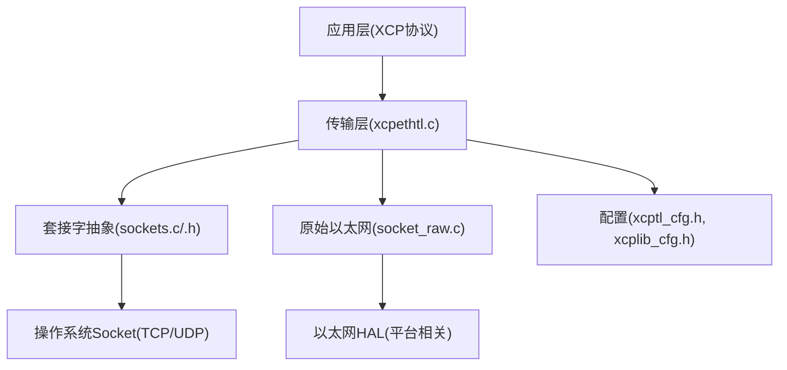
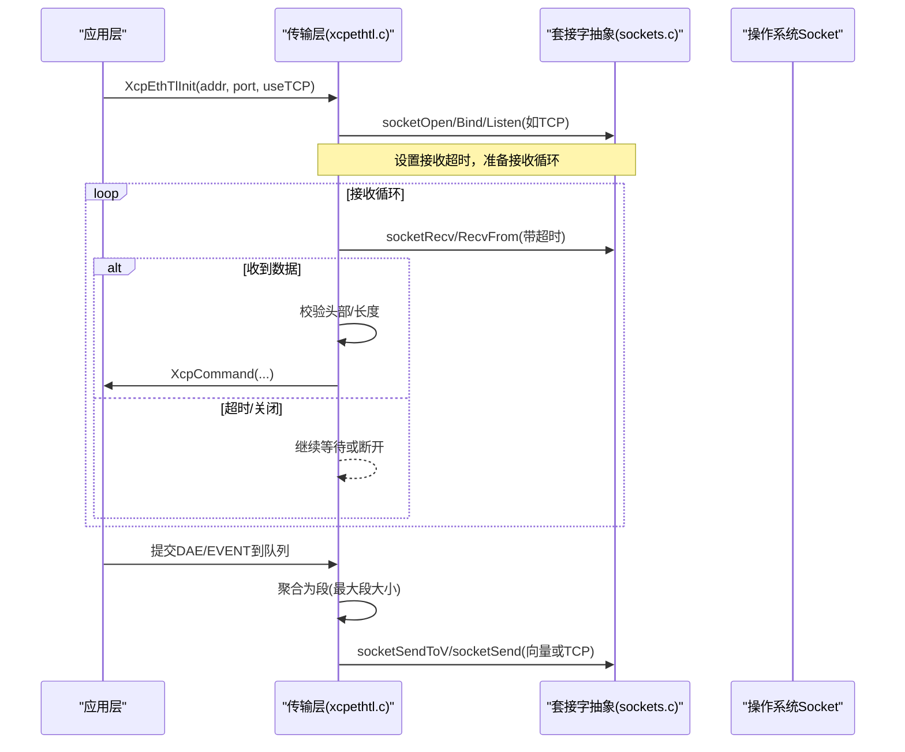
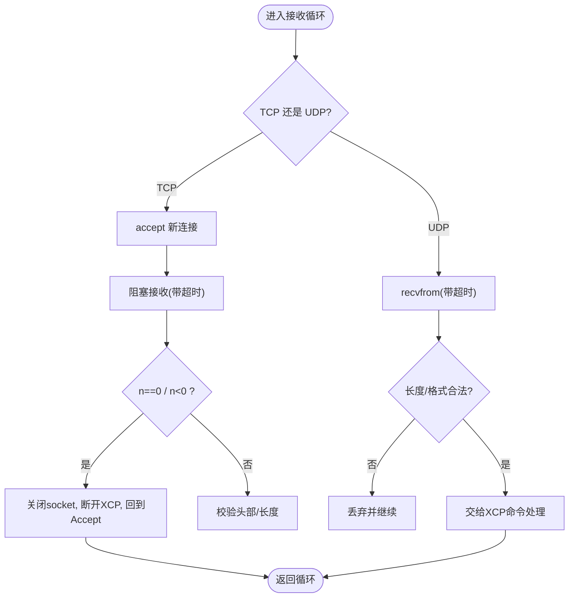
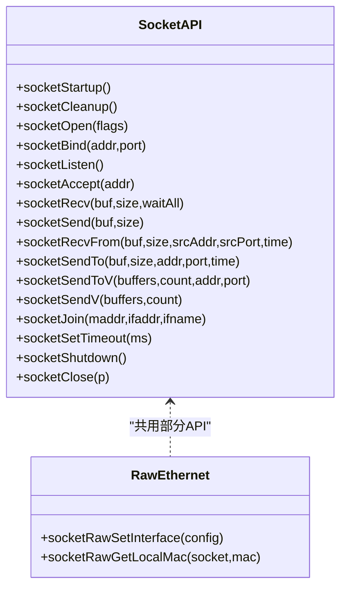
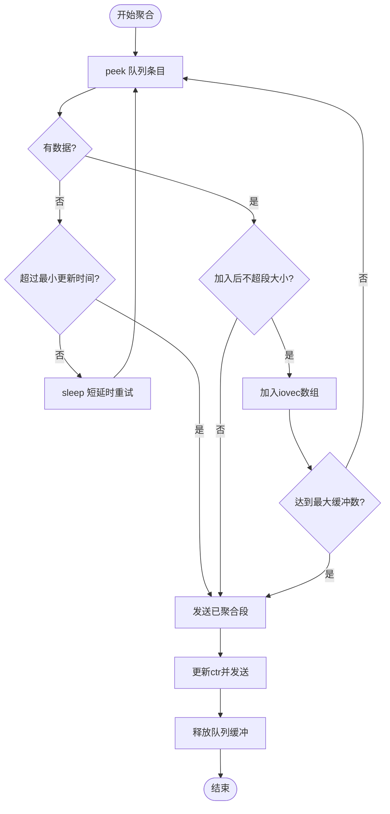
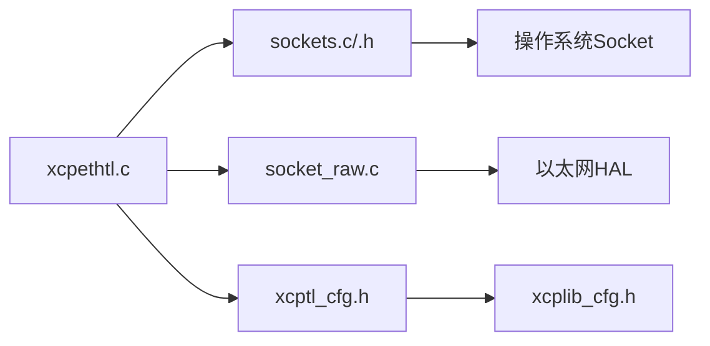

# 以太网传输实现

<cite>
**本文引用的文件**
- [xcpethtl.h](file://src/xcpethtl.h)
- [xcpethtl.c](file://src/xcpethtl.c)
- [sockets.h](file://src/sockets.h)
- [sockets.c](file://src/sockets.c)
- [socket_raw.c](file://src/socket_raw.c)
- [xcptl_cfg.h](file://src/xcptl_cfg.h)
- [xcplib_cfg.h](file://src/xcplib_cfg.h)
</cite>

## 目录
1. [简介](#简介)
2. [项目结构](#项目结构)
3. [核心组件](#核心组件)
4. [架构总览](#架构总览)
5. [详细组件分析](#详细组件分析)
6. [依赖关系分析](#依赖关系分析)
7. [性能考量](#性能考量)
8. [故障排除指南](#故障排除指南)
9. [结论](#结论)
10. [附录](#附录)

## 简介
本文件深入解析 XCPlite 的以太网传输层实现，覆盖 TCP 与 UDP 的差异、连接建立与维护、套接字抽象层设计（socket 封装、地址解析、连接池等）、数据传输缓冲区管理、流控制与性能优化策略、错误处理与超时重连逻辑、网络配置与安全设置、调试工具使用，以及性能调优与故障排除方法。目标是帮助读者在不熟悉源码的情况下也能理解并正确使用该传输层。

## 项目结构
XCPlite 的以太网传输层主要由以下模块构成：
- 传输层主逻辑：负责 TCP/UDP 收发、命令处理、多播支持、发送队列聚合与发送。
- 平台套接字抽象层：屏蔽 Linux/Windows/macOS/QNX/FreeRTOS 差异，提供统一的 socket API。
- 原始以太网传输（可选）：在无 TCP/IP 栈的目标上以 raw Ethernet HAL 实现 UDP/IPv4。
- 配置头：定义 MTU、段大小、对齐、是否启用 TCP/UDP/多播、队列模式等编译期选项。

图表来源
- [xcpethtl.c:603-715](file://src/xcpethtl.c#L603-L715)
- [sockets.h:78-374](file://src/sockets.h#L78-L374)
- [socket_raw.c:531-629](file://src/socket_raw.c#L531-L629)
- [xcptl_cfg.h:16-143](file://src/xcptl_cfg.h#L16-L143)

章节来源
- [xcpethtl.c:603-715](file://src/xcpethtl.c#L603-L715)
- [xcptl_cfg.h:16-143](file://src/xcptl_cfg.h#L16-L143)
- [xcplib_cfg.h:76-80](file://src/xcplib_cfg.h#L76-L80)

## 核心组件
- 传输层接口与状态
  - 初始化/关闭：XcpEthTlInit、XcpEthTlShutdown
  - 命令处理：XcpEthTlHandleCommands（TCP/UDP 接收循环）
  - 信息获取：XcpEthTlGetInfo（MAC/IP/端口/TCP标志）
  - 多播：XcpEthTlSendMulticastCrm、XcpEthTlSetClusterId（可选）
- 发送路径
  - 单包发送：XcpEthTlSend（UDP sendto 或 TCP send）
  - 向量发送：XcpEthTlSendV（scatter-gather，POSIX sendmsg）
  - 队列聚合：XcpTlHandleTransmitQueue（收集多个 XCP DTO/EVENT 为一个段）
- 套接字抽象
  - 统一 API：socketOpen/Bind/Listen/Accept/Recv/Send/RecvFrom/SendTo/V/SetTimeout/Join/Shutdown/Close
  - 硬件时间戳：Linux 下通过 SO_TIMESTAMPING 获取 TX/RX 时间戳
  - 原始以太网：无 TCP/IP 栈时的 UDP/IPv4 手工实现
- 配置项
  - MTU、段大小、对齐、是否启用 TCP/UDP/RAW、队列模式、多播端口等

章节来源
- [xcpethtl.h:24-36](file://src/xcpethtl.h#L24-L36)
- [xcpethtl.c:135-236](file://src/xcpethtl.c#L135-L236)
- [xcpethtl.c:791-918](file://src/xcpethtl.c#L791-L918)
- [sockets.h:207-374](file://src/sockets.h#L207-L374)
- [xcptl_cfg.h:34-143](file://src/xcptl_cfg.h#L34-L143)

## 架构总览
传输层在启动时根据配置选择 TCP 或 UDP，绑定本地地址和端口；TCP 模式下监听并接受连接，UDP 模式下直接 recvfrom。收到数据后校验长度与格式，交由上层 XCP 命令处理。发送侧将 DAQ/EVENT 消息累积到队列，按段大小聚合并通过向量发送减少系统调用开销。

图表来源
- [xcpethtl.c:379-534](file://src/xcpethtl.c#L379-L534)
- [xcpethtl.c:791-918](file://src/xcpethtl.c#L791-L918)
- [sockets.c:1068-1233](file://src/sockets.c#L1068-L1233)
- [sockets.c:1467-1599](file://src/sockets.c#L1467-L1599)

## 详细组件分析

### TCP 与 UDP 的差异与连接维护
- 连接建立
  - TCP：监听端口，accept 新连接，设置接收超时，记录远端 IP。
  - UDP：无需连接，首次收到 CONNECT 命令时记录源地址/端口作为“活跃主机”。
- 连接维护
  - TCP：recv 返回 0 或错误表示对端关闭；错误时断开 XCP 并回到 accept 模式。
  - UDP：若后续数据包来自不同 IP/端口，则断开并重连流程。
- 多播（可选）
  - 独立线程接收多播组，过滤集群 ID，仅处理有效命令。

图表来源
- [xcpethtl.c:379-534](file://src/xcpethtl.c#L379-L534)
- [xcpethtl.c:390-487](file://src/xcpethtl.c#L390-L487)

章节来源
- [xcpethtl.c:379-534](file://src/xcpethtl.c#L379-L534)

### 套接字抽象层设计
- 统一 API：跨平台封装 socket 操作，隐藏 Winsock/POSIX/lwIP 差异。
- 地址解析：bind 到 INADDR_ANY 或指定地址；join 多播组支持按接口名/地址选择。
- 超时与关闭：setsockopt 设置 SO_RCVTIMEO；shutdown 唤醒阻塞接收。
- 向量 I/O：POSIX sendmsg 实现 scatter-gather，降低拷贝与系统调用次数。
- 硬件时间戳：Linux 下通过 SO_TIMESTAMPING 获取精确 TX/RX 时间。
- 原始以太网：无 TCP/IP 栈时，手工构建 Ethernet/IPv4/UDP 帧，ARP 应答与 ICMP Echo 辅助调试。

图表来源
- [sockets.h:78-374](file://src/sockets.h#L78-L374)
- [socket_raw.c:531-629](file://src/socket_raw.c#L531-L629)

章节来源
- [sockets.h:78-374](file://src/sockets.h#L78-L374)
- [socket_raw.c:531-629](file://src/socket_raw.c#L531-L629)

### 数据传输缓冲区管理与流控制
- 队列聚合：将多个 XCP DTO/EVENT 聚合成一个段，达到最大段大小或时间阈值即发送。
- 向量发送：使用 iovec 一次发送多个缓冲，减少内核态切换。
- 计数器一致性：传输层计数器 ctr 在临界区更新，保证段内顺序递增。
- 丢包与溢出：队列溢出时调整 ctr 并记录警告，避免计数错乱。
- 零拷贝优化：原始以太网模式下预留 headroom，直接在段前写入链路头，避免复制。

图表来源
- [xcpethtl.c:791-918](file://src/xcpethtl.c#L791-L918)
- [sockets.c:1467-1599](file://src/sockets.c#L1467-L1599)

章节来源
- [xcpethtl.c:791-918](file://src/xcpethtl.c#L791-L918)

### 错误处理、超时处理与重连逻辑
- 超时处理：接收函数设置超时，返回 0 表示无数据，允许进行后台任务或优雅关闭。
- 错误分类：区分关闭、重置、中断、超时、管道破裂、参数错误等，便于上层决策。
- TCP 重连：连接关闭后回到 accept 模式，重新接受新连接。
- UDP 重连：检测到未知源或端口变化时断开并等待新的 CONNECT。
- 原始以太网：HAL 错误映射为 socket 错误码，提示帧过大或 HAL 失败。

章节来源
- [xcpethtl.c:379-534](file://src/xcpethtl.c#L379-L534)
- [sockets.c:1068-1233](file://src/sockets.c#L1068-L1233)
- [socket_raw.c:757-800](file://src/socket_raw.c#L757-L800)

### 网络配置选项、安全设置与调试工具
- 网络配置
  - MTU 与段大小：OPTION_MTU 决定链路 MTU，XCPTL_MAX_SEGMENT_SIZE 自动计算并 8 字节对齐。
  - 队列模式：64 位变长/定长或 32 位互斥队列，影响内存效率与性能。
  - 多播：可选启用，设置多播端口与集群 ID。
- 安全设置
  - 限制多播来源：可仅接受活跃主机的多播。
  - 禁止分片：非 TCP 路径设置 DF 位，避免分片导致的抖动与丢失。
- 调试工具
  - 日志级别：默认 3，可调至 5/6 输出详细命令与收发细节。
  - 统计指标：可选开启测试指标打印（TX/RX 包计数、向量数量等）。
  - 硬件时间戳：Linux 下启用 SO_TIMESTAMPING，获取精确收发时间。

章节来源
- [xcptl_cfg.h:34-143](file://src/xcptl_cfg.h#L34-L143)
- [xcplib_cfg.h:44-52](file://src/xcplib_cfg.h#L44-L52)
- [sockets.c:307-443](file://src/sockets.c#L307-L443)

## 依赖关系分析
- 传输层依赖套接字抽象层提供的统一 API，屏蔽平台差异。
- 原始以太网传输依赖以太网 HAL，提供 ARP/ICMP 辅助能力。
- 配置头集中管理编译期选项，影响功能开关与性能特性。

图表来源
- [xcpethtl.c:603-715](file://src/xcpethtl.c#L603-L715)
- [sockets.h:78-374](file://src/sockets.h#L78-L374)
- [socket_raw.c:531-629](file://src/socket_raw.c#L531-L629)
- [xcptl_cfg.h:16-143](file://src/xcptl_cfg.h#L16-L143)
- [xcplib_cfg.h:76-80](file://src/xcplib_cfg.h#L76-L80)

章节来源
- [xcpethtl.c:603-715](file://src/xcpethtl.c#L603-L715)
- [xcptl_cfg.h:16-143](file://src/xcptl_cfg.h#L16-L143)

## 性能考量
- 向量 I/O：POSIX sendmsg 将多个缓冲一次性发送，减少拷贝与系统调用。
- 段聚合：将多个小消息合并为大段，提高吞吐并降低开销。
- 零拷贝：原始以太网模式下预留 headroom，直接写入链路头。
- 禁用分片：非 TCP 路径设置 DF 位，避免分片带来的抖动与丢失。
- 硬件时间戳：Linux 下启用 SO_TIMESTAMPING，提升时间同步精度。
- 队列模式选择：64 位变长/定长队列权衡内存效率与性能；32 位队列用于兼容场景。

[本节为通用性能讨论，不直接分析具体文件]

## 故障排除指南
- 常见问题
  - 端口占用：bind 失败提示端口被占用，检查进程或防火墙。
  - 帧过大：EMSGSIZE 错误，需降低 OPTION_MTU 或减小段大小。
  - 无响应：检查接收超时设置与后台任务调度，确保循环不被阻塞。
  - 多播不可用：确认多播组与接口绑定正确，权限足够。
- 诊断步骤
  - 提高日志级别，查看收发详情与错误码。
  - 启用统计指标，观察 TX/RX 包计数与向量数量。
  - 使用 ping 验证链路（原始以太网支持 ICMP Echo）。
  - 检查硬件时间戳是否成功启用。

章节来源
- [sockets.c:1418-1427](file://src/sockets.c#L1418-L1427)
- [socket_raw.c:783-800](file://src/socket_raw.c#L783-L800)
- [xcpethtl.c:379-534](file://src/xcpethtl.c#L379-L534)

## 结论
XCPlite 的以太网传输层提供了稳定高效的 TCP/UDP 支持，并通过套接字抽象层屏蔽平台差异，结合向量 I/O、段聚合与零拷贝优化，满足高吞吐与低延迟需求。原始以太网传输为无 TCP/IP 栈目标提供替代方案。合理的配置与调试手段可进一步提升性能与可靠性。

[本节为总结性内容，不直接分析具体文件]

## 附录
- 关键函数路径参考
  - 初始化与关闭：[xcpethtl.c:603-715](file://src/xcpethtl.c#L603-L715)
  - 接收循环：[xcpethtl.c:379-534](file://src/xcpethtl.c#L379-L534)
  - 发送聚合：[xcpethtl.c:791-918](file://src/xcpethtl.c#L791-L918)
  - 套接字 API：[sockets.h:207-374](file://src/sockets.h#L207-L374)
  - 原始以太网：[socket_raw.c:531-629](file://src/socket_raw.c#L531-L629)
  - 配置项：[xcptl_cfg.h:34-143](file://src/xcptl_cfg.h#L34-L143), [xcplib_cfg.h:76-80](file://src/xcplib_cfg.h#L76-L80)