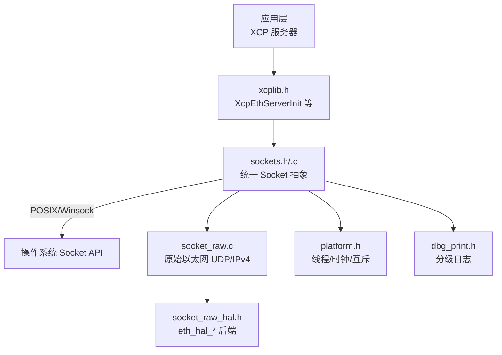
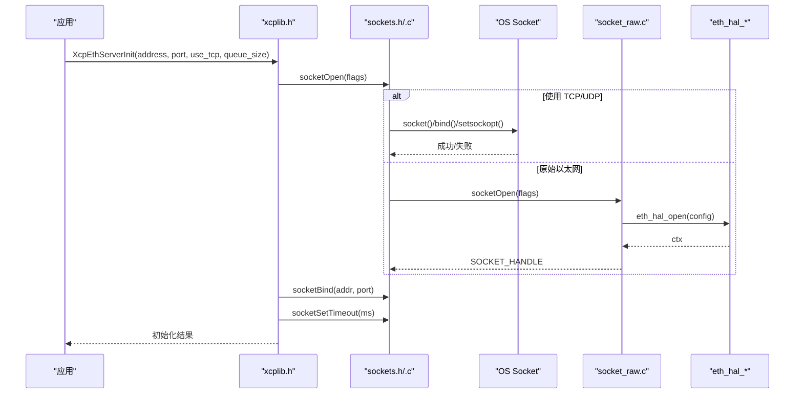
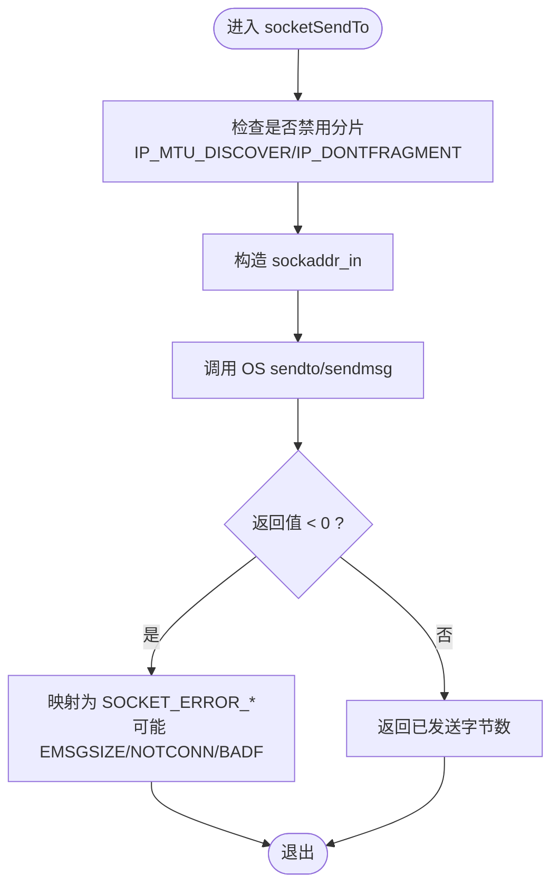
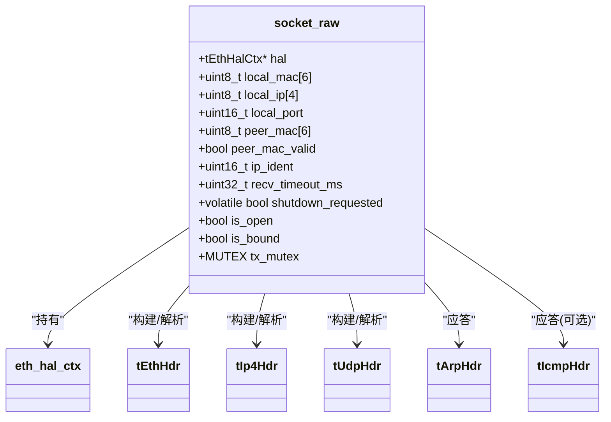
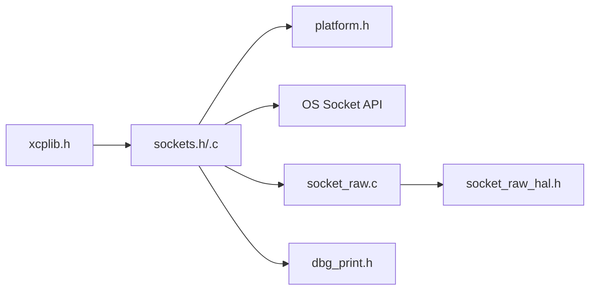

# 套接字抽象层设计

<cite>
**本文引用的文件**
- [sockets.h](file://src/sockets.h)
- [sockets.c](file://src/sockets.c)
- [socket_raw.c](file://src/socket_raw.c)
- [socket_raw_hal.h](file://src/socket_raw_hal.h)
- [platform.h](file://src/platform.h)
- [xcplib.h](file://inc/xcplib.h)
- [dbg_print.h](file://src/dbg_print.h)
</cite>

## 目录
1. [简介](#简介)
2. [项目结构](#项目结构)
3. [核心组件](#核心组件)
4. [架构总览](#架构总览)
5. [详细组件分析](#详细组件分析)
6. [依赖关系分析](#依赖关系分析)
7. [性能考量](#性能考量)
8. [故障排查指南](#故障排查指南)
9. [结论](#结论)
10. [附录](#附录)

## 简介
本文件深入解析 XCPlite 的套接字抽象层，聚焦以下目标：
- 统一 API 设计与跨平台兼容性（Linux/Windows/macOS/QNX/FreeRTOS）
- 地址解析、端口绑定与网络接口选择
- 连接复用、负载均衡与资源回收策略（在 UDP 场景下的“连接”语义）
- 缓冲区管理、I/O 多路复用与异步操作支持
- 错误处理机制、日志记录与调试工具使用

该抽象层通过 sockets.h/c 提供统一的 socket 接口，并通过 socket_raw.c 在无 TCP/IP 栈的目标上以原始以太网 HAL 实现 UDP/IPv4。平台差异由 platform.h 屏蔽，日志由 dbg_print.h 提供分级输出。

## 项目结构
- 公共头文件
  - inc/xcplib.h：上层 XCP 服务对外 API（如 XcpEthServerInit），不直接暴露 socket 细节
- 抽象层
  - src/sockets.h/.c：平台无关的 socket 抽象（TCP/UDP），含超时、关闭、本地地址获取等
  - src/socket_raw.c：无协议栈目标的原始以太网 UDP/IPv4 实现（ARP/ICMP 应答）
  - src/socket_raw_hal.h：原始以太网 HAL 接口（eth_hal_*）
- 平台抽象
  - src/platform.h：线程、互斥、时钟、内存映射、共享内存等
- 调试
  - src/dbg_print.h：多级日志宏（ERROR/WARN/INFO/TRACE/DEBUG）

图表来源
- [xcplib.h:39-58](file://inc/xcplib.h#L39-L58)
- [sockets.h:78-372](file://src/sockets.h#L78-L372)
- [socket_raw.c:136-169](file://src/socket_raw.c#L136-L169)
- [socket_raw_hal.h:71-105](file://src/socket_raw_hal.h#L71-L105)
- [platform.h:255-506](file://src/platform.h#L255-L506)
- [dbg_print.h:19-244](file://src/dbg_print.h#L19-L244)

章节来源
- [xcplib.h:39-58](file://inc/xcplib.h#L39-L58)
- [sockets.h:78-372](file://src/sockets.h#L78-L372)
- [socket_raw.c:136-169](file://src/socket_raw.c#L136-L169)
- [socket_raw_hal.h:71-105](file://src/socket_raw_hal.h#L71-L105)
- [platform.h:255-506](file://src/platform.h#L255-L506)
- [dbg_print.h:19-244](file://src/dbg_print.h#L19-L244)

## 核心组件
- 统一 Socket 抽象（sockets.h/.c）
  - 创建/绑定/监听/接受/收发/关闭/超时设置
  - 可选功能：多播加入、scatter-gather I/O、硬件时间戳（Linux）、本地地址/MAC 查询
- 原始以太网传输（socket_raw.c + HAL）
  - 手工构建 Ethernet/IPv4/UDP 帧，仅实现 UDP 子集
  - ARP 应答、可选 ICMP Echo 应答、VLAN 丢弃
  - 单实例上下文、接收缓冲、发送互斥锁
- 平台抽象（platform.h）
  - 线程/互斥/时钟/原子/共享内存/键盘等
- 调试与日志（dbg_print.h）
  - 可配置的多级日志宏，支持运行时或编译期级别控制

章节来源
- [sockets.h:78-372](file://src/sockets.h#L78-L372)
- [socket_raw.c:136-169](file://src/socket_raw.c#L136-L169)
- [platform.h:255-506](file://src/platform.h#L255-L506)
- [dbg_print.h:19-244](file://src/dbg_print.h#L19-L244)

## 架构总览
XCPlite 将上层 XCP 服务器与底层网络隔离：上层调用 xcplib.h 提供的初始化函数；内部根据配置选择 POSIX/Winsock 路径或原始以太网路径。所有平台差异被封装在 sockets.h/.c 和 platform.h 中。

图表来源
- [xcplib.h:39-58](file://inc/xcplib.h#L39-L58)
- [sockets.c:307-443](file://src/sockets.c#L307-L443)
- [socket_raw.c:552-601](file://src/socket_raw.c#L552-L601)
- [socket_raw_hal.h:74-86](file://src/socket_raw_hal.h#L74-L86)

## 详细组件分析

### 统一 Socket 抽象（sockets.h/.c）
- 设计原则
  - 统一句柄：SOCKET_HANDLE 在不同平台可能是 fd 或包含额外元数据的指针（Linux 硬件时间戳）
  - 统一错误码：定义 SOCKET_ERROR_* 常量与 socketGetErrorString，屏蔽平台差异
  - 阻塞+超时：所有 socket 默认阻塞，通过 socketSetTimeout 控制等待
  - 选项化能力：通过 flags 启用 SO_REUSEADDR、IP_PKTINFO、硬件/软件时间戳等
- 关键流程
  - socketOpen：创建 socket，设置 DF（禁止分片）、可选 IP_PKTINFO、可选 SO_TIMESTAMPING/SO_TIMESTAMPNS
  - socketBind：绑定到 INADDR_ANY 或指定 IPv4 地址与端口
  - socketRecvFrom/socketSendTo：UDP 收发的统一入口，返回字节数、0（超时）、-1（错误/关闭）
  - socketShutdown/socketClose：优雅关闭并释放资源
- 平台分支
  - FreeRTOS/lwIP：仅 UDP，无 TCP；时间戳用系统时钟
  - POSIX：完整 TCP/UDP，scatter-gather sendmsg，可选硬件时间戳
  - Windows：Winsock2，无 scatter-gather，无硬件时间戳

图表来源
- [sockets.c:345-371](file://src/sockets.c#L345-L371)
- [sockets.c:730-778](file://src/sockets.c#L730-L778)
- [sockets.h:221-298](file://src/sockets.h#L221-L298)

章节来源
- [sockets.h:78-372](file://src/sockets.h#L78-L372)
- [sockets.c:307-443](file://src/sockets.c#L307-L443)
- [sockets.c:730-800](file://src/sockets.c#L730-L800)

### 原始以太网传输（socket_raw.c + HAL）
- 设计原则
  - 无协议栈目标：手工构建 Ethernet/IPv4/UDP 帧，仅实现 UDP 子集
  - 安全过滤：按 EtherType、目的 MAC、IPv4 长度、协议、端口快速过滤
  - ARP 应答：被动学习对端 MAC，不主动发起 ARP 请求
  - 单实例：全局 socket_raw 上下文，避免堆分配（裸机友好）
  - 并发保护：发送路径加互斥锁，保证帧构建与发送原子性
- 关键流程
  - socketOpen：打开 HAL，读取本地 MAC，初始化互斥锁
  - socketBind：校验本地 IPv4（非 ANY/广播/组播/环回），保存本地端口
  - socketRecvFrom：循环 HAL 接收，按帧过滤，返回 XCP 数据报；支持超时与 shutdown 唤醒
  - socketSendTo：构建帧头（ETH/IPv4/UDP），计算校验和（可选），调用 HAL 发送
- 错误与诊断
  - 区分 ETH_HAL_ERROR_SIZE（配置问题）与其他 HAL 错误
  - 日志提示 MTU 过大、未学习到对端 MAC 等

图表来源
- [socket_raw.c:136-169](file://src/socket_raw.c#L136-L169)
- [socket_raw.c:59-103](file://src/socket_raw.c#L59-L103)
- [socket_raw_hal.h:71-105](file://src/socket_raw_hal.h#L71-L105)

章节来源
- [socket_raw.c:240-526](file://src/socket_raw.c#L240-L526)
- [socket_raw.c:531-601](file://src/socket_raw.c#L531-L601)
- [socket_raw.c:603-629](file://src/socket_raw.c#L603-L629)
- [socket_raw.c:631-643](file://src/socket_raw.c#L631-L643)
- [socket_raw.c:660-720](file://src/socket_raw.c#L660-L720)
- [socket_raw.c:722-800](file://src/socket_raw.c#L722-L800)
- [socket_raw_hal.h:71-105](file://src/socket_raw_hal.h#L71-L105)

### 地址解析、端口绑定与网络接口选择
- 地址解析
  - 统一使用网络序 IPv4 地址（uint8_t* 4 字节）
  - 原始以太网路径要求具体单播地址（非 ANY/广播/组播/环回）
- 端口绑定
  - POSIX/Winsock：bind 到 INADDR_ANY 或指定地址与端口
  - 原始以太网：保存本地端口用于 UDP 过滤
- 网络接口选择
  - POSIX：可通过 socketJoin 指定 ifaddr/ifname 加入多播；Linux 下可用 socketBindToDevice 绑定设备
  - 原始以太网：通过 socketRawSetInterface 选择后端（如 Linux AF_PACKET 的 eth0）

章节来源
- [sockets.h:230-258](file://src/sockets.h#L230-L258)
- [sockets.c:445-470](file://src/sockets.c#L445-L470)
- [sockets.c:472-498](file://src/sockets.c#L472-L498)
- [socket_raw.c:539-542](file://src/socket_raw.c#L539-L542)
- [socket_raw.c:603-629](file://src/socket_raw.c#L603-L629)

### 连接复用、负载均衡与资源回收
- 连接复用
  - UDP 无连接：通过源地址/端口识别会话；原始以太网从首个数据报学习对端 MAC
  - TCP：accept 后获得独立 SOCKET_HANDLE，需显式关闭
- 负载均衡
  - 抽象层不提供负载均衡；可在上层基于多进程/多线程/多端口分发
- 资源回收
  - socketShutdown：中断阻塞的 recv，使接收线程退出
  - socketClose：关闭 OS socket，释放 SOCKET_HANDLE（Linux 硬件时间戳路径需 free）
  - 原始以太网：关闭 HAL，销毁互斥锁，重置状态

章节来源
- [sockets.h:260-357](file://src/sockets.h#L260-L357)
- [sockets.c:589-615](file://src/sockets.c#L589-L615)
- [socket_raw.c:637-658](file://src/socket_raw.c#L637-L658)

### 缓冲区管理、I/O 多路复用与异步操作
- 缓冲区管理
  - 原始以太网：静态 RX/TX 缓冲，限制最大帧大小（RAW_MAX_FRAME）
  - POSIX：sendmsg scatter-gather 减少拷贝（socketSendToV/socketSendV）
- I/O 多路复用
  - 抽象层未引入 select/poll/epoll；通过阻塞+超时实现协作式调度
- 异步操作
  - 通过 socketSetTimeout 让接收线程周期性返回，执行后台任务
  - 原始以太网：shutdown 唤醒 HAL 阻塞的 recv

章节来源
- [socket_raw.c:157-166](file://src/socket_raw.c#L157-L166)
- [socket_raw.c:660-720](file://src/socket_raw.c#L660-L720)
- [sockets.h:300-357](file://src/sockets.h#L300-L357)

### 错误处理机制、日志记录与调试工具
- 错误处理
  - 统一错误码：SOCKET_ERROR_* 与 socketIsClosed/socketWouldBlock/socketTimeout 宏
  - 原始以太网：区分 HAL 错误与配置错误（ETH_HAL_ERROR_SIZE -> MSGSIZE）
- 日志记录
  - dbg_print.h 提供 ERROR/WARN/INFO/TRACE/DEBUG 五级宏，支持运行时或编译期级别
  - 关键路径均输出诊断信息（MTU、权限、端口占用等）
- 调试工具
  - 可选 ICMP Echo 应答辅助连通性测试
  - 可选 gratuitous ARP 加速邻居表建立

章节来源
- [sockets.h:87-113](file://src/sockets.h#L87-L113)
- [sockets.c:25-50](file://src/sockets.c#L25-L50)
- [socket_raw.c:173-196](file://src/socket_raw.c#L173-L196)
- [dbg_print.h:19-244](file://src/dbg_print.h#L19-L244)

## 依赖关系分析
- 模块耦合
  - xcplib.h 仅依赖 sockets.h 的初始化入口，不暴露 socket 细节
  - sockets.c 依赖 platform.h 的线程/时钟/互斥
  - socket_raw.c 依赖 socket_raw_hal.h 的后端（Linux AF_PACKET 示例）
- 外部依赖
  - POSIX：sys/socket.h、netinet/in.h、arpa/inet.h、ifaddrs.h
  - Windows：winsock2.h、ws2tcpip.h
  - FreeRTOS：lwip/sockets.h（若启用）
- 潜在循环依赖
  - 无直接循环；通过头文件分层清晰

图表来源
- [xcplib.h:39-58](file://inc/xcplib.h#L39-L58)
- [sockets.c:11-22](file://src/sockets.c#L11-L22)
- [socket_raw.c:26-34](file://src/socket_raw.c#L26-L34)
- [platform.h:255-506](file://src/platform.h#L255-L506)
- [dbg_print.h:19-244](file://src/dbg_print.h#L19-L244)

章节来源
- [xcplib.h:39-58](file://inc/xcplib.h#L39-L58)
- [sockets.c:11-22](file://src/sockets.c#L11-L22)
- [socket_raw.c:26-34](file://src/socket_raw.c#L26-L34)
- [platform.h:255-506](file://src/platform.h#L255-L506)
- [dbg_print.h:19-244](file://src/dbg_print.h#L19-L244)

## 性能考量
- 零拷贝/少拷贝
  - POSIX scatter-gather sendmsg 减少多次拷贝
  - 原始以太网：预留 headroom 时可直接写入头部，避免复制
- 分片控制
  - 强制 DF 位，避免分片导致的抖动与丢包
- 时间戳
  - Linux 硬件时间戳降低测量误差；无硬件时回退软件时间戳
- 超时与协作
  - 合理设置超时，避免忙等；接收线程周期性返回执行后台任务

[本节为通用指导，无需特定文件引用]

## 故障排查指南
- 常见问题
  - 端口占用：bind 失败提示 WSAEADDRINUSE/端口被占用
  - 权限不足：绑定低端口或启用硬件时间戳需要 root/CAP_NET_ADMIN
  - MTU 过大：EMSGSIZE 提示段超过链路 MTU，需降低 OPTION_MTU
  - 对端未知：原始以太网未收到数据报前无法发送（peer MAC unknown）
- 定位手段
  - 开启更高级别日志（DBG_LEVEL >= 3/4/5）
  - 使用 ICMP Echo 验证链路（可选）
  - 检查 HAL 返回码（ETH_HAL_ERROR_SIZE vs ETH_HAL_ERROR）

章节来源
- [sockets.c:780-800](file://src/sockets.c#L780-L800)
- [socket_raw.c:757-800](file://src/socket_raw.c#L757-L800)
- [dbg_print.h:19-244](file://src/dbg_print.h#L19-L244)

## 结论
XCPlite 的套接字抽象层通过统一 API、严格错误处理与平台适配，实现了在高可靠、低延迟场景下的稳定通信。其原始以太网路径在无协议栈目标上提供了最小而完整的 UDP 子集，配合 HAL 抽象便于移植。结合超时驱动的协作式调度与可选硬件时间戳，满足 XCP 数据采集与校准的高精度需求。

[本节为总结，无需特定文件引用]

## 附录
- 关键 API 速查
  - 初始化：XcpEthServerInit
  - 生命周期：socketStartup/socketCleanup/socketOpen/socketBind/socketShutdown/socketClose
  - 收发：socketRecvFrom/socketSendTo（UDP），socketRecv/socketSend（TCP）
  - 配置：socketSetTimeout、socketJoin、socketEnableTimestamps（Linux）
  - 原始以太网：socketRawSetInterface、socketRawGetLocalMac

章节来源
- [xcplib.h:39-58](file://inc/xcplib.h#L39-L58)
- [sockets.h:207-372](file://src/sockets.h#L207-L372)
- [socket_raw.c:531-601](file://src/socket_raw.c#L531-L601)