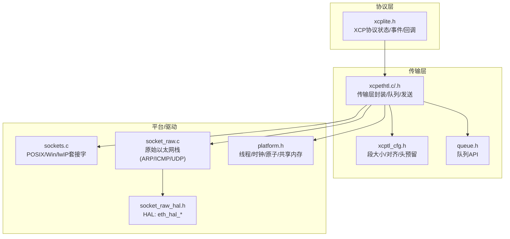
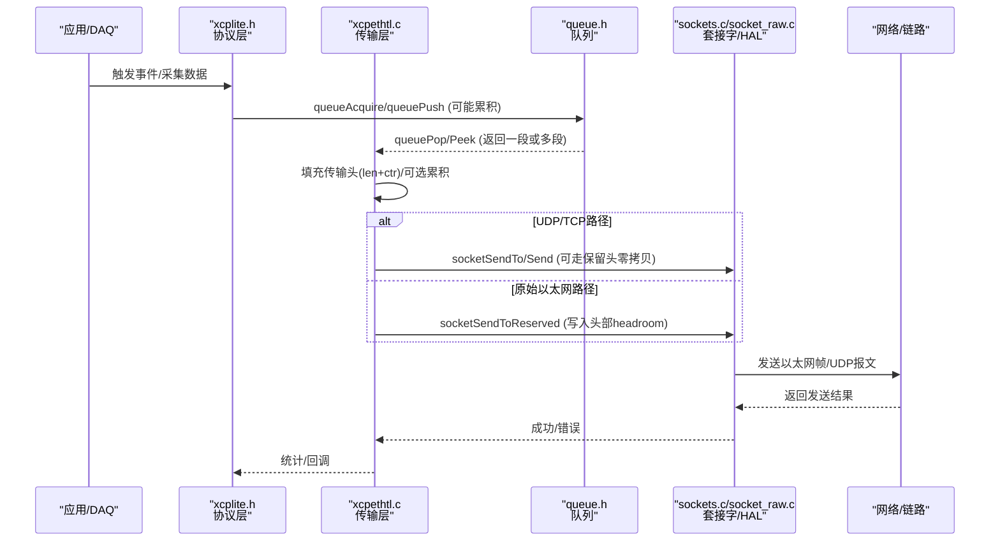
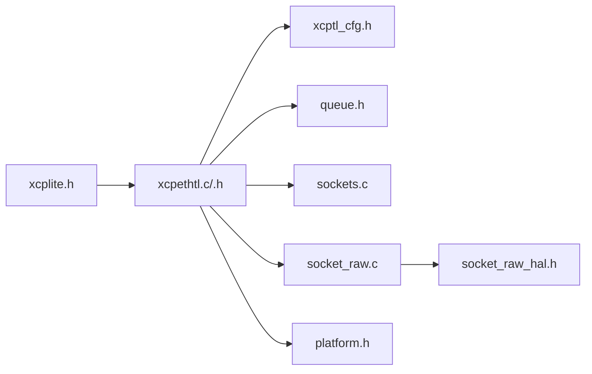

# 数据传输优化机制

<cite>
**本文引用的文件**
- [src/xcplite.h](file://src/xcplite.h)
- [src/xcpethtl.h](file://src/xcpethtl.h)
- [src/xcpethserver.h](file://src/xcpethserver.h)
- [src/socket_raw_hal.h](file://src/socket_raw_hal.h)
- [src/xcptl.h](file://src/xcptl.h)
- [src/xcptl_cfg.h](file://src/xcptl_cfg.h)
- [src/socket_raw.c](file://src/socket_raw.c)
- [src/sockets.c](file://src/sockets.c)
- [src/queue.h](file://src/queue.h)
- [src/platform.h](file://src/platform.h)
- [src/xcpethtl.c](file://src/xcpethtl.c)
- [src/queue32.c](file://src/queue32.c)
- [src/queue64v.c](file://src/queue64v.c)
</cite>

## 目录
1. [简介](#简介)
2. [项目结构](#项目结构)
3. [核心组件](#核心组件)
4. [架构总览](#架构总览)
5. [详细组件分析](#详细组件分析)
6. [依赖关系分析](#依赖关系分析)
7. [性能考量](#性能考量)
8. [故障排查指南](#故障排查指南)
9. [结论](#结论)
10. [附录](#附录)

## 简介
本文件聚焦XCPlite在以太网传输路径上的数据发送与接收优化，围绕以下主题展开：缓冲区管理与内存分配、零拷贝技术、队列与缓冲池管理；流控与拥塞避免、流量整形与带宽限制；向量I/O、批量发送与延迟合并；数据包分段与重组（MTU适配与分片策略）；传输队列管理、优先级调度与丢包处理；以及性能调优参数与监控指标的使用方法。内容基于仓库中传输层、套接字抽象、原始以太网实现与队列子系统的具体代码进行归纳与图示化说明。

## 项目结构
XCPlite的以太网传输由“协议层 + 传输层 + 平台套接字/HAL”三层组成：
- 协议层：维护XCP会话、DAQ事件、命令处理等状态，并通过回调与传输层交互。
- 传输层：负责将XCP消息封装为传输层报文（含计数器、长度），并选择UDP/TCP或原始以太网HAL进行发送/接收。
- 平台层：提供跨平台的套接字接口、时间戳、线程/互斥量、时钟等能力；原始以太网模式通过HAL直接构造以太网帧。

图表来源
- [src/xcplite.h:385-423](file://src/xcplite.h#L385-L423)
- [src/xcpethtl.c:70-105](file://src/xcpethtl.c#L70-L105)
- [src/xcptl_cfg.h:37-114](file://src/xcptl_cfg.h#L37-L114)
- [src/queue.h:29-55](file://src/queue.h#L29-L55)
- [src/sockets.c:307-443](file://src/sockets.c#L307-L443)
- [src/socket_raw.c:136-166](file://src/socket_raw.c#L136-L166)
- [src/socket_raw_hal.h:74-105](file://src/socket_raw_hal.h#L74-L105)
- [src/platform.h:301-451](file://src/platform.h#L301-L451)

章节来源
- [src/xcplite.h:385-423](file://src/xcplite.h#L385-L423)
- [src/xcptl_cfg.h:37-114](file://src/xcptl_cfg.h#L37-L114)
- [src/queue.h:29-55](file://src/queue.h#L29-L55)
- [src/sockets.c:307-443](file://src/sockets.c#L307-L443)
- [src/socket_raw.c:136-166](file://src/socket_raw.c#L136-L166)
- [src/socket_raw_hal.h:74-105](file://src/socket_raw_hal.h#L74-L105)
- [src/platform.h:301-451](file://src/platform.h#L301-L451)

## 核心组件
- 传输层状态与队列：维护发送队列、消息计数器、套接字句柄、多播资源等，并提供发送/等待队列空等接口。
- 配置常量：定义CTO/DTO最大尺寸、段大小、对齐方式、传输头预留空间、接收超时等关键参数。
- 套接字抽象：统一Linux/Windows/macOS/QNX/Freertos(lwIP)的套接字操作，支持DF标志、硬件时间戳等。
- 原始以太网栈：在无TCP/IP栈的目标上手工构建以太网/IPv4/UDP帧，包含ARP应答、ICMP回显、校验和计算等。
- 队列子系统：提供多种队列实现（固定/可变大小、无锁/互斥、是否累积段），用于解耦生产/消费并支持批量发送。

章节来源
- [src/xcpethtl.c:70-105](file://src/xcpethtl.c#L70-L105)
- [src/xcptl_cfg.h:37-114](file://src/xcptl_cfg.h#L37-L114)
- [src/sockets.c:307-443](file://src/sockets.c#L307-L443)
- [src/socket_raw.c:136-166](file://src/socket_raw.c#L136-L166)
- [src/queue.h:29-55](file://src/queue.h#L29-L55)

## 架构总览
下图展示了从应用触发DAQ到最终通过网络发送的端到端流程，包括队列累积、向量发送、零拷贝路径与MTU保护。

图表来源
- [src/xcplite.h:385-423](file://src/xcplite.h#L385-L423)
- [src/xcpethtl.c:126-180](file://src/xcpethtl.c#L126-L180)
- [src/queue.h:122-168](file://src/queue.h#L122-L168)
- [src/sockets.c:307-443](file://src/sockets.c#L307-L443)
- [src/socket_raw.c:722-755](file://src/socket_raw.c#L722-L755)

## 详细组件分析

### 缓冲区管理与内存分配
- 传输层消息与段：
  - CTO/CRM使用固定大小的消息结构，包含长度与计数器字段，便于消费者按字访问。
  - DTO/事件数据以“段”为单位累积，段大小受配置约束，确保不超过链路MTU。
- 队列条目布局：
  - 每个队列条目包含用户负载与可选的用户头（用于插入传输层头）。
  - 32位队列实现支持“段累积”，在段前预留headroom以便直接写入链路头（零拷贝）。
- 内存分配策略：
  - 队列初始化时一次性分配连续内存块，减少频繁分配开销。
  - 固定大小队列（64位）与可变大小队列（64位）在不同平台上选择，兼顾无锁与性能。

章节来源
- [src/xcpethtl.c:58-64](file://src/xcpethtl.c#L58-L64)
- [src/queue.h:29-55](file://src/queue.h#L29-L55)
- [src/queue32.c:70-84](file://src/queue32.c#L70-L84)
- [src/queue64v.c:18-34](file://src/queue64v.c#L18-L34)

### 零拷贝技术与Headroom
- 原始以太网路径：
  - 通过QUEUE_SEGMENT_HEADER_SIZE在段前预留headroom，发送时直接在headroom写入以太网/IPv4/UDP头，避免额外拷贝。
  - 发送函数支持“保留头”路径，将数据指针指向已预留区域，直接调用底层发送。
- 套接字抽象：
  - 对UDP路径提供socketSendToReserved以利用headroom；普通路径则正常sendto。
- 优势：
  - 减少一次内存拷贝，降低CPU占用与延迟，尤其在高吞吐DAQ场景显著。

章节来源
- [src/queue.h:39-50](file://src/queue.h#L39-L50)
- [src/socket_raw.c:722-755](file://src/socket_raw.c#L722-L755)
- [src/xcpethtl.c:126-180](file://src/xcpethtl.c#L126-L180)

### 缓冲区池与队列管理
- 32位队列（累积型）：
  - 将多个消息累积到一个段中，直到达到段上限或需要刷新；适合批量发送。
  - 使用互斥量保护队列，单消费者模型，支持优先级标记。
- 64位队列（无锁）：
  - 变量大小或固定大小两种实现，生产者侧无锁，消费者侧顺序释放。
  - 不支持段累积，但可通过向量I/O批量发送。
- 队列统计与溢出：
  - 提供packets_lost输出，便于监控生产者侧溢出情况。

章节来源
- [src/queue32.c:85-100](file://src/queue32.c#L85-L100)
- [src/queue64v.c:18-34](file://src/queue64v.c#L18-L34)
- [src/queue.h:141-168](file://src/queue.h#L141-L168)

### 流控制算法：拥塞避免、流量整形与带宽限制
- 拥塞避免：
  - 通过队列容量与溢出计数（packets_lost）反映拥塞；上层可根据溢出调整DAQ频率或批大小。
  - 套接字层设置DF标志，防止IP分片导致抖动与丢失；超MTU时立即失败，提示调整配置。
- 流量整形：
  - 队列累积与批量发送天然具备“整形”效果，平滑突发流量。
  - 可通过事件周期与优先级控制不同DAQ流的节奏。
- 带宽限制：
  - 未内置令牌桶/漏桶等限速器；建议在上层根据链路带宽与目标吞吐，调节DAQ事件频率与批大小。
  - 使用队列级别与最大段大小间接限制瞬时带宽峰值。

章节来源
- [src/sockets.c:345-371](file://src/sockets.c#L345-L371)
- [src/queue.h:141-168](file://src/queue.h#L141-L168)
- [src/xcptl_cfg.h:51-82](file://src/xcptl_cfg.h#L51-L82)

### 性能优化：向量I/O、批量发送与延迟合并
- 向量I/O：
  - 64位队列实现配合向量发送路径，将多个队列条目作为iovec数组一次性发送，减少系统调用次数。
- 批量发送：
  - 32位队列累积多个消息为一个段，减少发送次数；64位队列通过peek/pop组合也可实现批量。
- 延迟合并：
  - 队列累积与发送循环中的“等待队列空”机制，有助于合并短时突发，降低上下文切换。

章节来源
- [src/xcpethtl.c:182-200](file://src/xcpethtl.c#L182-L200)
- [src/queue32.c:104-126](file://src/queue32.c#L104-L126)
- [src/queue.h:141-168](file://src/queue.h#L141-L168)

### 数据包分段与重组：MTU适配与分片处理
- MTU适配：
  - 段大小由OPTION_MTU推导，减去IP/UDP头并对齐，保证IP包不超过链路MTU。
  - 非原始以太网路径启用DF标志，禁止IP分片；超限立即报错，提示调整配置。
- 分片处理：
  - 原始以太网路径不执行IP分片，若帧过大返回特定错误码；lwIP路径会警告但不强制拒绝。
- 重组：
  - 传输层不处理IP分片重组；依赖上层保证单报文不超过MTU。

章节来源
- [src/xcptl_cfg.h:51-82](file://src/xcptl_cfg.h#L51-L82)
- [src/sockets.c:345-371](file://src/sockets.c#L345-L371)
- [src/socket_raw.c:757-799](file://src/socket_raw.c#L757-L799)

### 传输队列管理、优先级调度与丢包处理
- 队列管理：
  - 多生产者单消费者模型；32位队列使用互斥量，64位队列无锁。
  - 支持队列清空、获取当前级别与最大级别，便于监控。
- 优先级调度：
  - 队列push支持priority标记，消费者可选择优先处理高优先级条目。
- 丢包处理：
  - 队列满时记录packets_lost；上层可据此告警或降速。
  - 套接字层对EMSGSIZE等错误进行诊断，帮助定位配置问题。

章节来源
- [src/queue.h:122-182](file://src/queue.h#L122-L182)
- [src/queue32.c:85-100](file://src/queue32.c#L85-L100)
- [src/sockets.c:345-371](file://src/sockets.c#L345-L371)

### 原始以太网栈与HAL
- 功能：
  - 手工构建以太网/IPv4/UDP帧，支持ARP应答与ICMP回显，便于调试与快速启动。
  - 通过HAL抽象具体网卡驱动，屏蔽平台差异。
- 约束：
  - 不支持VLAN标签；帧大小必须适应链路MTU；无IP分片。
- 线程契约：
  - 发送路径持有互斥量，接收路径由专用线程调用，唤醒接口支持中断阻塞接收。

章节来源
- [src/socket_raw.c:136-166](file://src/socket_raw.c#L136-L166)
- [src/socket_raw_hal.h:74-105](file://src/socket_raw_hal.h#L74-L105)

## 依赖关系分析

图表来源
- [src/xcplite.h:385-423](file://src/xcplite.h#L385-L423)
- [src/xcpethtl.c:70-105](file://src/xcpethtl.c#L70-L105)
- [src/xcptl_cfg.h:37-114](file://src/xcptl_cfg.h#L37-L114)
- [src/queue.h:29-55](file://src/queue.h#L29-L55)
- [src/sockets.c:307-443](file://src/sockets.c#L307-L443)
- [src/socket_raw.c:136-166](file://src/socket_raw.c#L136-L166)
- [src/socket_raw_hal.h:74-105](file://src/socket_raw_hal.h#L74-L105)
- [src/platform.h:301-451](file://src/platform.h#L301-L451)

章节来源
- [src/xcplite.h:385-423](file://src/xcplite.h#L385-L423)
- [src/xcpethtl.c:70-105](file://src/xcpethtl.c#L70-L105)
- [src/xcptl_cfg.h:37-114](file://src/xcptl_cfg.h#L37-L114)
- [src/queue.h:29-55](file://src/queue.h#L29-L55)
- [src/sockets.c:307-443](file://src/sockets.c#L307-L443)
- [src/socket_raw.c:136-166](file://src/socket_raw.c#L136-L166)
- [src/socket_raw_hal.h:74-105](file://src/socket_raw_hal.h#L74-L105)
- [src/platform.h:301-451](file://src/platform.h#L301-L451)

## 性能考量
- 选择合适的队列实现：
  - 高吞吐、低延迟场景优先使用64位无锁队列；需要段累积时使用32位队列。
- 调整段大小与MTU：
  - 合理设置OPTION_MTU，使XCPTL_MAX_SEGMENT_SIZE匹配链路MTU，避免分片与丢包。
- 启用零拷贝：
  - 原始以太网路径开启headroom，使用保留头发送路径减少拷贝。
- 向量I/O与批量发送：
  - 使用64位队列的向量发送路径，减少系统调用次数。
- 监控与诊断：
  - 关注packets_lost、队列级别、发送错误码（如EMSGSIZE），及时调整DAQ频率或批大小。

[本节为通用指导，无需列出具体文件来源]

## 故障排查指南
- 常见问题与定位：
  - 帧过大：检查OPTION_MTU与XCPTL_MAX_SEGMENT_SIZE，确认链路MTU；查看EMSGSIZE错误。
  - 对端MAC未知（原始以太网）：确认已收到对端报文并学习MAC；检查ARP应答逻辑。
  - lwIP分片风险：注意lwIP不会拒绝超MTU报文，需主动调整配置以避免静默降级。
  - 队列溢出：监控packets_lost，必要时增大队列或降低DAQ速率。
- 调试手段：
  - 启用日志与调试宏，观察发送路径与错误码。
  - 使用ping验证原始以太网栈基础连通性。

章节来源
- [src/sockets.c:345-371](file://src/sockets.c#L345-L371)
- [src/socket_raw.c:757-799](file://src/socket_raw.c#L757-L799)
- [src/queue.h:141-168](file://src/queue.h#L141-L168)

## 结论
XCPlite在以太网传输路径上通过“队列累积 + 向量I/O + 零拷贝headroom + MTU保护”的组合策略，实现了高效、稳定且可扩展的数据传输。其设计将协议层与传输层解耦，借助平台抽象与原始以太网HAL覆盖多种目标环境。实际部署中，应结合队列溢出、错误码与链路MTU进行调优，以获得最佳吞吐与延迟表现。

[本节为总结性内容，无需列出具体文件来源]

## 附录
- 关键配置项参考：
  - XCPTL_MAX_CTO_SIZE / XCPTL_MAX_DTO_SIZE：控制命令与数据报文的最大尺寸。
  - XCPTL_MAX_SEGMENT_SIZE：由OPTION_MTU推导，决定单段最大载荷。
  - XCPTL_TX_HEADROOM：原始以太网路径的headroom大小，用于零拷贝写头。
  - XCPTL_RECV_TIMEOUT_MS：接收线程轮询间隔，影响响应性与功耗。
- 监控指标：
  - packets_lost：队列溢出计数，反映拥塞程度。
  - 队列级别：当前队列占用，评估背压。
  - 发送错误码：如EMSGSIZE、HAL错误，辅助定位配置或驱动问题。

章节来源
- [src/xcptl_cfg.h:37-114](file://src/xcptl_cfg.h#L37-L114)
- [src/queue.h:141-168](file://src/queue.h#L141-L168)
- [src/sockets.c:345-371](file://src/sockets.c#L345-L371)