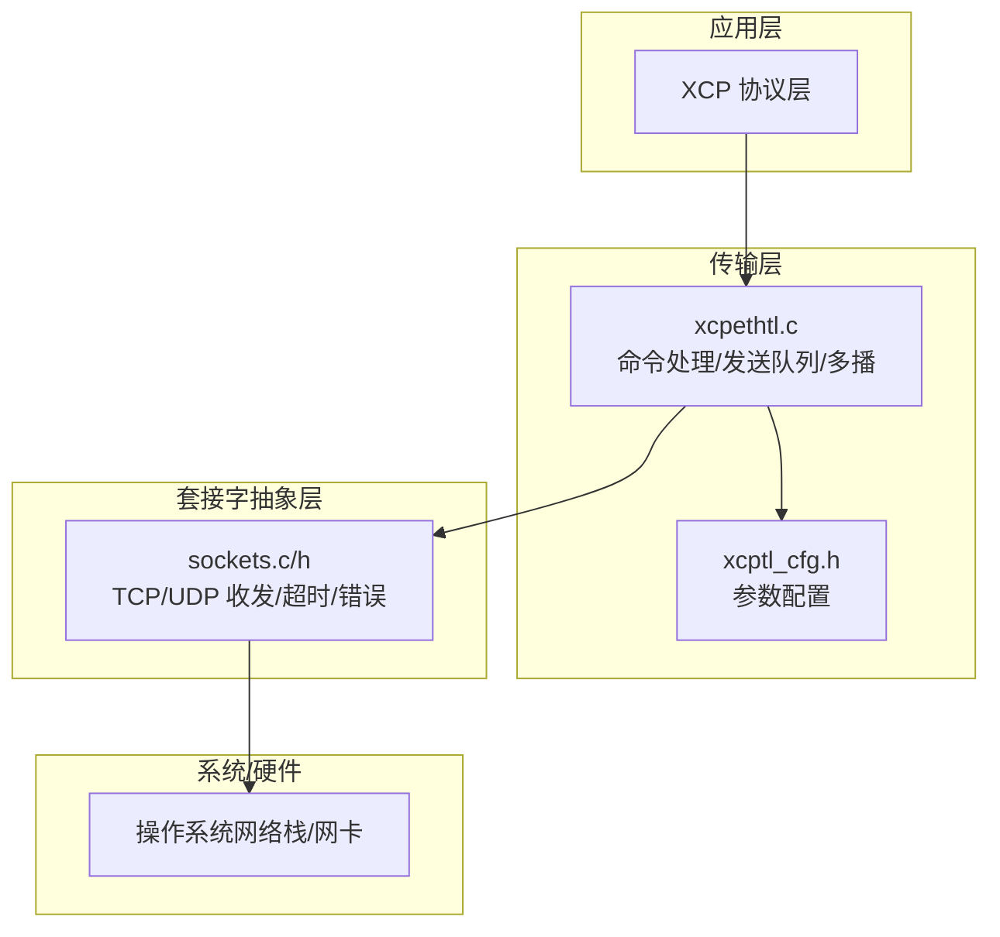
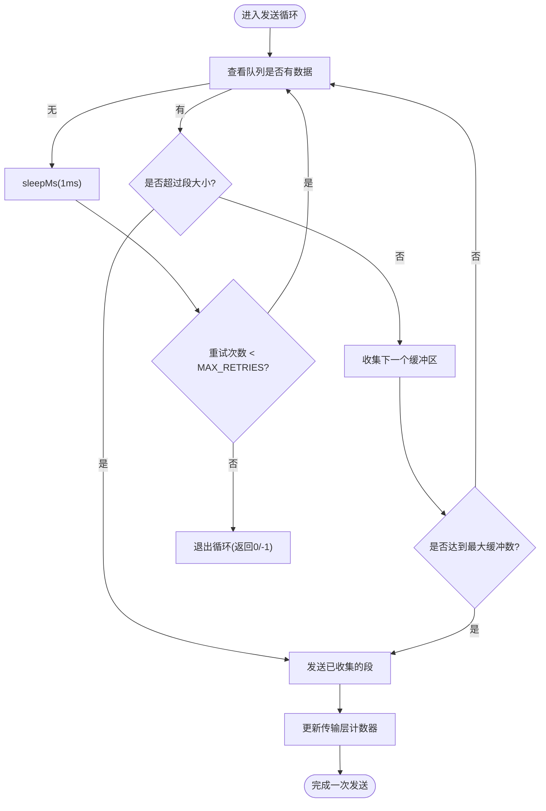
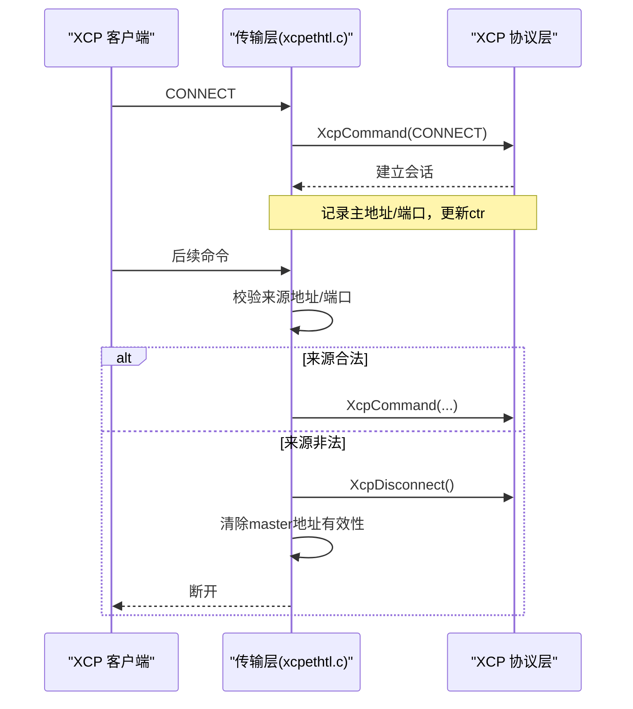
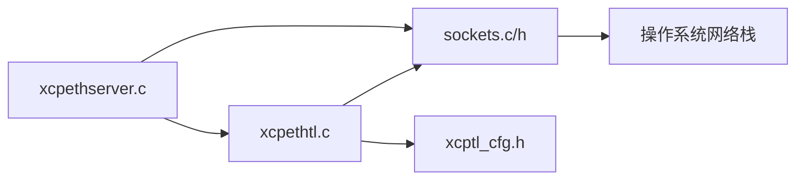

# 错误处理和恢复机制

<cite>
**本文引用的文件**
- [xcpethtl.c](file://src/xcpethtl.c)
- [xcpethtl.h](file://src/xcpethtl.h)
- [sockets.c](file://src/sockets.c)
- [sockets.h](file://src/sockets.h)
- [xcptl_cfg.h](file://src/xcptl_cfg.h)
- [xcpethserver.c](file://src/xcpethserver.c)
- [dbg_print.h](file://src/dbg_print.h)
</cite>

## 目录
1. [简介](#简介)
2. [项目结构](#项目结构)
3. [核心组件](#核心组件)
4. [架构总览](#架构总览)
5. [详细组件分析](#详细组件分析)
6. [依赖关系分析](#依赖关系分析)
7. [性能与可靠性考量](#性能与可靠性考量)
8. [故障排查指南](#故障排查指南)
9. [结论](#结论)
10. [附录](#附录)

## 简介
本文件系统性阐述 XCPlite 以太网传输的错误处理与恢复机制，覆盖网络错误分类（连接错误、超时错误、数据传输错误）、重试策略（含退避与最大重试次数控制）、连接恢复流程（自动重连、状态同步、会话重建）、异常检测（网络分区、对端崩溃、协议违规），以及错误日志记录、诊断信息收集与常见问题的解决方案和最佳实践。内容基于源码实现进行归纳与可视化说明，便于不同技术背景的读者理解与维护。

## 项目结构
XCPlite 的以太网传输层位于 src 目录，关键文件如下：
- xcpethtl.c/h：XCP over UDP/TCP 传输层实现，负责收发、命令处理、队列发送、多播等。
- sockets.c/h：平台无关的 Socket 抽象层，封装 TCP/UDP 收发、超时、错误码、关闭等。
- xcptl_cfg.h：传输层配置（MTU、段大小、接收超时、是否启用 TCP/UDP/多播等）。
- xcpethserver.c：服务器线程模型（接收线程、发送线程）及生命周期管理。
- dbg_print.h：统一调试与错误日志宏。



图表来源
- [xcpethtl.c:603-715](file://src/xcpethtl.c#L603-L715)
- [xcptl_cfg.h:51-84](file://src/xcptl_cfg.h#L51-L84)
- [sockets.c:307-443](file://src/sockets.c#L307-L443)

章节来源
- [xcpethtl.c:603-715](file://src/xcpethtl.c#L603-L715)
- [xcptl_cfg.h:51-84](file://src/xcptl_cfg.h#L51-L84)
- [sockets.c:307-443](file://src/sockets.c#L307-L443)

## 核心组件
- 传输层（xcpethtl.c）
  - 接收循环：阻塞式读取带超时的数据报/流，解析并分发到 XCP 协议层；处理 TCP 连接建立、断开、非法帧；处理 UDP 地址校验、越界包丢弃。
  - 发送路径：将 DAQ/EVENT/CRM 消息打包为段，使用向量 I/O 或零拷贝头空间发送；维护传输层计数器一致性。
  - 多播支持：可选的多播接收线程用于 GET_DAQ_CLOCK 时间同步。
- 套接字抽象层（sockets.c/h）
  - 统一的 socketOpen/Bind/Recv/Send/Shutdown/Close、超时设置、错误码映射、平台差异处理（Linux/macOS/QNX/Windows/FreeRTOS）。
  - 明确区分“超时”“连接关闭”“协议违规”等错误类型，供上层决策。
- 配置（xcptl_cfg.h）
  - MTU、段大小、接收超时、是否启用 TCP/UDP/多播、对齐与头预留等。
- 服务器线程（xcpethserver.c）
  - 接收线程周期性调用传输层处理函数，执行后台任务；发送线程批量发送队列中的段。

章节来源
- [xcpethtl.c:291-534](file://src/xcpethtl.c#L291-L534)
- [xcpethtl.c:791-918](file://src/xcpethtl.c#L791-L918)
- [sockets.c:207-357](file://src/sockets.c#L207-L357)
- [xcptl_cfg.h:51-84](file://src/xcptl_cfg.h#L51-L84)
- [xcpethserver.c:469-586](file://src/xcpethserver.c#L469-L586)

## 架构总览
下图展示从应用层到网络栈的错误处理与控制流：

```mermaid
sequenceDiagram
participant App as "应用/XCP"
participant Srv as "服务器线程(xcpethserver.c)"
participant TL as "传输层(xcpethtl.c)"
participant SK as "套接字(sockets.c)"
participant Net as "网络栈/网卡"
App->>Srv : 启动服务
Srv->>TL : 初始化(绑定端口/模式)
loop 接收循环
Srv->>TL : 处理命令(XcpEthTlHandleCommands)
TL->>SK : recv/recvfrom(带超时)
alt 超时
SK-->>TL : 返回0(超时)
TL-->>Srv : 继续循环(后台任务)
else 正常数据
SK-->>TL : 数据+源地址
TL->>App : XcpCommand(...)
else 连接关闭/错误
SK-->>TL : 错误(关闭/重置/超时)
TL->>TL : 清理/重连(TCP)或丢弃(UDP)
TL-->>Srv : 返回true/false(致命错误)
end
loop 发送循环
Srv->>TL : 发送队列段(XcpTlHandleTransmitQueue)
TL->>SK : send/sendto(向量/零拷贝)
alt 成功
SK-->>TL : 已发送字节数
else 失败
SK-->>TL : 错误(关闭/EMSGSIZE等)
TL-->>Srv : 返回-1(终止发送线程)
end
end
```

图表来源
- [xcpethserver.c:469-586](file://src/xcpethserver.c#L469-L586)
- [xcpethtl.c:379-534](file://src/xcpethtl.c#L379-L534)
- [xcpethtl.c:791-918](file://src/xcpethtl.c#L791-L918)
- [sockets.c:275-357](file://src/sockets.c#L275-L357)

## 详细组件分析

### 网络错误分类与处理策略
- 连接错误
  - TCP 连接建立失败/接受失败：在监听模式下 accept 失败时记录警告并继续等待下一次连接。
  - TCP 连接关闭/重置：recv 返回错误或检测到 socket 关闭/重置时，调用 XcpDisconnect 进入断开态，关闭 socket 并回到监听模式。
  - UDP 无显式连接，但会校验主机的 IP/端口变更，若变化则断开并重连。
- 超时错误
  - 接收超时：socketSetTimeout 后 recv/recvfrom 返回 0，表示无数据可处理，允许线程执行后台任务并继续循环。
  - 发送超时：发送路径不直接暴露超时，但通过队列轮询与 sleepMs 避免长时间占用 CPU。
- 数据传输错误
  - 长度/格式校验失败：如 CTO 长度超限、报文长度与头部不一致，视为协议违规，丢弃并可能关闭 TCP 连接。
  - 数据包过大：UDP 超过路径 MTU 时，平台层返回 EMSGSIZE；代码中针对 Windows 的大包作为接收错误忽略，其他平台通过 DF 标志提前拒绝。
  - 部分接收/粘包：TCP 路径要求严格长度匹配，否则关闭连接；UDP 路径按固定头部长度校验。

章节来源
- [xcpethtl.c:379-534](file://src/xcpethtl.c#L379-L534)
- [sockets.c:152-192](file://src/sockets.c#L152-L192)
- [xcptl_cfg.h:51-84](file://src/xcptl_cfg.h#L51-L84)

### 重试机制与退避策略
- 发送队列重试
  - 在累积发送路径中，当队列为空或达到段大小限制时，短暂 sleepMs(MAX_SLEEP_TIME_MS=1ms) 并增加重试计数，最多 MAX_RETRIES=100 次，以让出时间片给后台任务与优雅关闭。
  - 若队列长期为空且超过 MIN_UPDATE_TIME_MS=50ms 未发送，也会主动退出循环，避免无限等待。
- 指数退避
  - 当前实现采用固定短睡眠（1ms）而非指数退避；该策略适合高频小批量的 DAQ 发送，降低延迟同时避免忙等。
  - 若需更稳健的重试（例如网络拥塞场景），可在发送失败分支引入指数退避（sleepMs(1 << retries) 并限幅），并在日志中记录退避阶段。
- 最大重试次数控制
  - MAX_RETRIES=100 对应约 100ms 的窗口，确保发送线程能及时响应关闭信号与后台任务。
  - 发送失败返回 -1，由发送线程终止，上层可触发重连或告警。



图表来源
- [xcpethtl.c:791-918](file://src/xcpethtl.c#L791-L918)

章节来源
- [xcpethtl.c:791-918](file://src/xcpethtl.c#L791-L918)

### 连接恢复流程（自动重连、状态同步、会话重建）
- 自动重连
  - TCP：当连接关闭或发生错误时，关闭 socket 并回到监听模式，等待新的 accept；随后重新设置接收超时并继续处理。
  - UDP：不维持连接，每次收到 CONNECT 时记录主机地址与端口；若后续来自不同地址/端口，则断开并重连。
- 状态同步
  - 传输层维护 master_addr/master_port 与有效性标志；在 CONNECT 成功后更新，并在后续命令中校验来源。
  - 传输层计数器 ctr 在 CRM/DAQ 间保持一致性，必要时补偿丢失计数。
- 会话重建
  - 当检测到连接断开或协议违规时，调用 XcpDisconnect 将 XCP 协议层置为断开态；客户端重新发起 CONNECT，服务端清空发送队列并处理 CONNECT 命令，重建会话。



图表来源
- [xcpethtl.c:291-375](file://src/xcpethtl.c#L291-L375)
- [xcpethtl.c:379-534](file://src/xcpethtl.c#L379-L534)

章节来源
- [xcpethtl.c:291-375](file://src/xcpethtl.c#L291-L375)
- [xcpethtl.c:379-534](file://src/xcpethtl.c#L379-L534)

### 异常情况检测与处理
- 网络分区
  - 表现为持续超时或连接中断；接收线程周期性检查，发送线程通过队列空转与 sleep 避免忙等；可通过日志与统计指标识别。
- 对端崩溃
  - TCP：对端崩溃导致连接重置或关闭，recv 返回错误并进入 socket_closed 分支，断开并释放资源。
  - UDP：无连接语义，但对端不可达时可能出现 EMSGSIZE 或无效数据，按协议校验丢弃。
- 协议违规
  - 长度字段非法、报文长度与头部不一致、CTO 长度超限等，均视为协议违规；TCP 路径关闭连接，UDP 路径丢弃并继续服务。

章节来源
- [xcpethtl.c:379-534](file://src/xcpethtl.c#L379-L534)
- [sockets.c:152-192](file://src/sockets.c#L152-L192)

### 错误日志记录与诊断信息
- 日志级别
  - 提供 ERROR/WARNING/INFO/TRACE/DEBUG 多级日志，支持运行时或编译期固定级别。
- 关键日志点
  - 接收/发送错误、连接关闭、协议违规、队列溢出、MTU 警告等。
- 诊断信息
  - 传输层统计（发送/接收包计数、IOVEC 数量）、队列溢出计数、最后发送时间戳等。
  - 平台错误字符串映射，便于定位具体错误原因。

章节来源
- [dbg_print.h:19-147](file://src/dbg_print.h#L19-L147)
- [xcpethtl.c:1030-1040](file://src/xcpethtl.c#L1030-L1040)
- [sockets.c:25-50](file://src/sockets.c#L25-L50)

## 依赖关系分析
- 模块耦合
  - xcpethtl.c 依赖 sockets.c/h 进行底层收发，依赖 xcptl_cfg.h 获取参数，依赖 xcpethserver.c 提供的线程模型。
  - sockets.c/h 屏蔽平台差异，向上提供统一 API。
- 外部依赖
  - 操作系统网络栈与网卡驱动；FreeRTOS/lwIP 平台特殊处理。
- 潜在循环依赖
  - 无直接循环依赖；各层职责清晰，接口稳定。



图表来源
- [xcpethtl.c:603-715](file://src/xcpethtl.c#L603-L715)
- [sockets.c:307-443](file://src/sockets.c#L307-L443)
- [xcpethserver.c:279-386](file://src/xcpethserver.c#L279-L386)

章节来源
- [xcpethtl.c:603-715](file://src/xcpethtl.c#L603-L715)
- [sockets.c:307-443](file://src/sockets.c#L307-L443)
- [xcpethserver.c:279-386](file://src/xcpethserver.c#L279-L386)

## 性能与可靠性考量
- 发送路径优化
  - 向量 I/O 与零拷贝头空间减少内存拷贝，提高吞吐。
  - 段大小与 MTU 配置合理，避免分片导致的丢包与抖动。
- 接收路径健壮性
  - 超时机制保证线程可执行后台任务与优雅关闭。
  - 严格的长度与格式校验防止恶意或损坏报文影响服务。
- 可靠性增强建议
  - 在发送失败分支引入指数退避与最大重试次数，提升网络波动下的稳定性。
  - 增加连接健康检查与告警阈值（如连续超时次数、队列溢出频率）。
  - 对 lwIP 平台特别关注 MTU 配置，避免静默分片或丢包。

[本节为通用指导，无需特定文件引用]

## 故障排查指南
- 常见问题
  - 端口被占用：绑定失败，检查端口冲突与权限。
  - MTU 过大：UDP 发送失败（EMSGSIZE），调整 OPTION_MTU 或段大小。
  - 频繁断开：检查对端是否崩溃或网络分区，观察日志中的连接关闭与超时。
  - 队列溢出：监控队列级别与丢失计数，适当增大队列或降低采集速率。
- 诊断步骤
  - 提升日志级别至 WARNING/ERROR，捕获关键错误信息。
  - 检查传输层统计（发送/接收包计数、IOVEC 数量、丢失计数）。
  - 确认平台错误字符串与实际 errno 对应关系。
- 解决建议
  - 调整 MTU 与段大小，确保不超过链路 MTU。
  - 在网络不稳定场景启用指数退避与重连策略。
  - 对 lwIP 平台，确保 OPTION_MTU 设置正确，避免静默分片。

章节来源
- [xcptl_cfg.h:51-84](file://src/xcptl_cfg.h#L51-L84)
- [sockets.c:25-50](file://src/sockets.c#L25-L50)
- [xcpethtl.c:1030-1040](file://src/xcpethtl.c#L1030-L1040)

## 结论
XCPlite 的以太网传输层具备完善的错误处理与恢复机制：通过超时与校验保障健壮性，通过队列与向量 I/O 提升性能，通过连接管理与状态同步实现可靠重连。当前实现采用固定短睡眠的重试策略，建议在需要更强鲁棒性的场景中引入指数退避与告警机制。结合详细的日志与诊断信息，可有效定位与解决常见网络问题。

[本节为总结，无需特定文件引用]

## 附录
- 关键配置项
  - XCPTL_RECV_TIMEOUT_MS：接收超时（毫秒），控制接收线程周期。
  - XCPTL_MAX_SEGMENT_SIZE：段大小，受 MTU 限制。
  - OPTION_MTU：链路 MTU，影响段大小与发送行为。
- 关键函数
  - XcpEthTlHandleCommands：接收与命令处理。
  - XcpTlHandleTransmitQueue：发送队列处理。
  - socketSetTimeout/socketSendTo/socketRecvFrom：套接字操作。

章节来源
- [xcptl_cfg.h:51-84](file://src/xcptl_cfg.h#L51-L84)
- [xcpethtl.c:379-534](file://src/xcpethtl.c#L379-L534)
- [xcpethtl.c:791-918](file://src/xcpethtl.c#L791-L918)
- [sockets.c:275-357](file://src/sockets.c#L275-L357)