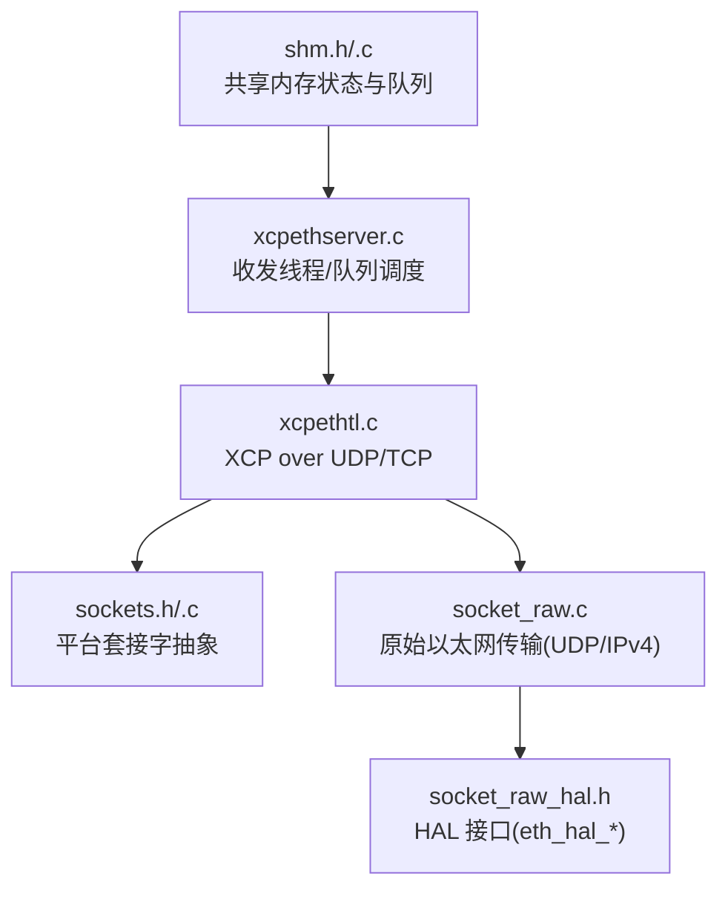
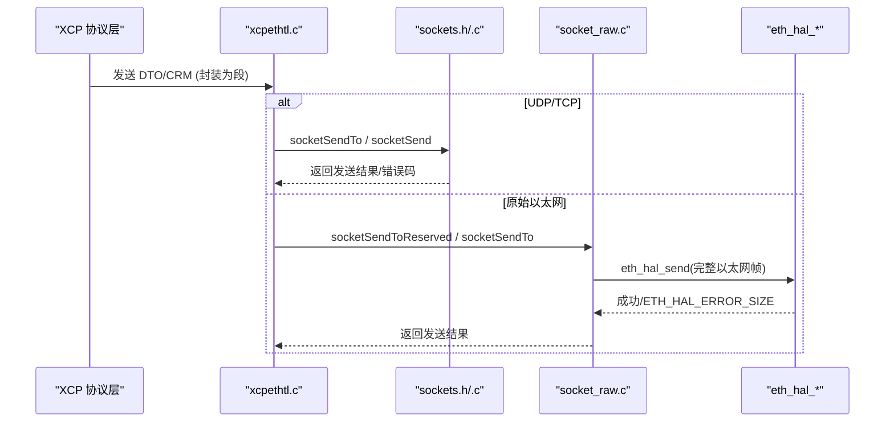
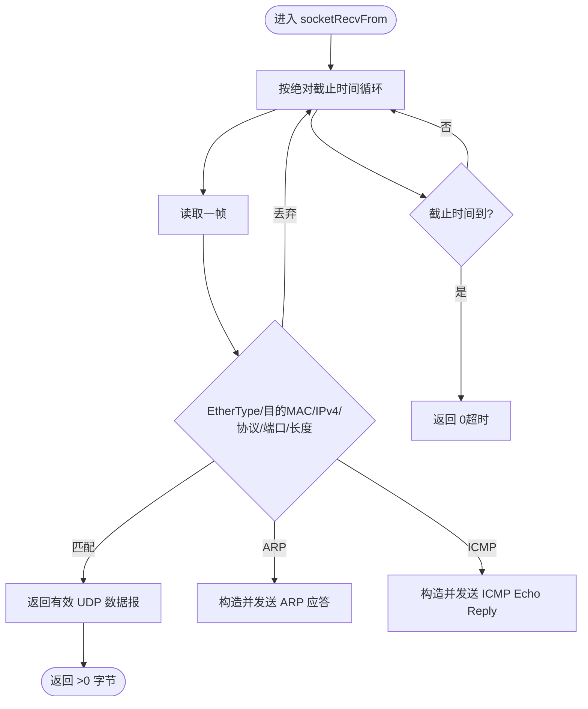
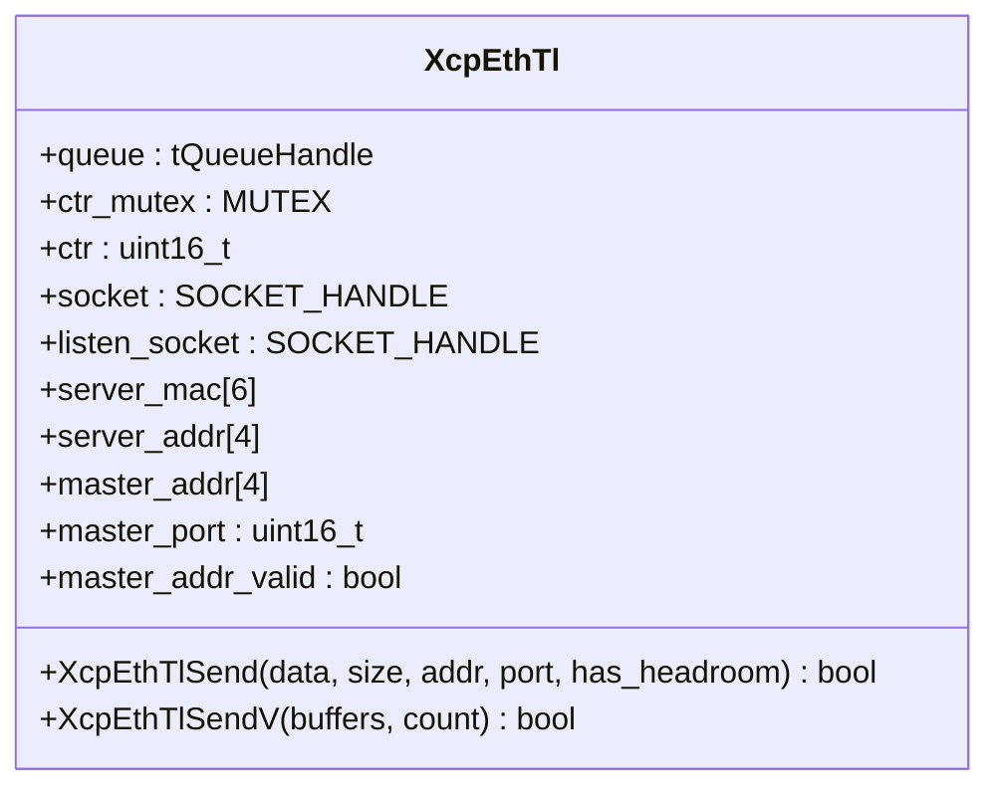
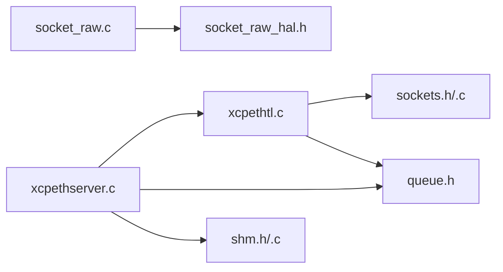

# 传输层抽象

<cite>
**本文引用的文件**
- [src/xcptl.h](file://src/xcptl.h)
- [src/xcptl_cfg.h](file://src/xcptl_cfg.h)
- [src/sockets.h](file://src/sockets.h)
- [src/sockets.c](file://src/sockets.c)
- [src/socket_raw_hal.h](file://src/socket_raw_hal.h)
- [src/socket_raw.c](file://src/socket_raw.c)
- [src/xcpethtl.c](file://src/xcpethtl.c)
- [src/xcpethserver.c](file://src/xcpethserver.c)
- [src/shm.h](file://src/shm.h)
- [src/shm.c](file://src/shm.c)
- [docs/SOCKET_RAW.md](file://docs/SOCKET_RAW.md)
</cite>

## 目录
1. [简介](#简介)
2. [项目结构](#项目结构)
3. [核心组件](#核心组件)
4. [架构总览](#架构总览)
5. [详细组件分析](#详细组件分析)
6. [依赖关系分析](#依赖关系分析)
7. [性能考虑](#性能考虑)
8. [故障排查指南](#故障排查指南)
9. [结论](#结论)
10. [附录：新传输层开发接口规范与实现指南](#附录：新传输层开发接口规范与实现指南)

## 简介
本文件系统性解析 XCPlite 的传输层抽象设计与实现，覆盖以太网（UDP/TCP）、原始套接字（无 TCP/IP 栈时的自研 UDP/IPv4）以及共享内存模式下的多进程协作。重点说明：
- 传输层抽象如何统一上层 XCP 协议对多种介质的访问
- TCP/UDP 的连接管理、数据流控制与队列化发送
- 原始套接字的实现原理、网络包捕获与过滤机制
- 配置选项、错误处理与性能优化技术
- 新增传输层的接口规范与实现步骤

## 项目结构
XCPlite 的传输层由“协议层接口 + 平台套接字抽象 + 具体传输实现”三层构成：
- 协议层接口：定义统一的发送/接收、队列处理、计数器管理等 API
- 平台套接字抽象：屏蔽 Linux/Windows/macOS/QNX/FreeRTOS/lwIP 差异，提供 socket 系列函数
- 具体传输实现：
  - xcpethtl.c：XCP over UDP/TCP 的传输层逻辑（含多段累积、向量发送、TCP 连接管理）
  - socket_raw.c：在无 TCP/IP 栈的目标上实现的 UDP/IPv4 传输（含 ARP/ICMP 应答、帧过滤）
  - shm.*：共享内存模式下跨进程的状态与队列共享

图表来源
- [src/xcpethtl.c:1-200](file://src/xcpethtl.c#L1-L200)
- [src/sockets.h:1-379](file://src/sockets.h#L1-L379)
- [src/socket_raw.c:1-200](file://src/socket_raw.c#L1-L200)
- [src/socket_raw_hal.h:1-108](file://src/socket_raw_hal.h#L1-L108)
- [src/xcpethserver.c:1-200](file://src/xcpethserver.c#L1-L200)
- [src/shm.h:1-131](file://src/shm.h#L1-L131)

章节来源
- [src/xcptl.h:1-26](file://src/xcptl.h#L1-L26)
- [src/xcptl_cfg.h:1-143](file://src/xcptl_cfg.h#L1-L143)
- [src/sockets.h:1-379](file://src/sockets.h#L1-L379)
- [src/socket_raw_hal.h:1-108](file://src/socket_raw_hal.h#L1-L108)
- [src/xcpethtl.c:1-200](file://src/xcpethtl.c#L1-L200)
- [src/xcpethserver.c:1-200](file://src/xcpethserver.c#L1-L200)
- [src/shm.h:1-131](file://src/shm.h#L1-L131)

## 核心组件
- 传输层通用接口（xcptl.h）
  - 发送 CRM、等待发送队列空、获取消息计数器等
- 传输层配置（xcptl_cfg.h）
  - 启用 UDP/TCP/RAW、MTU、段大小、对齐、头预留空间、超时等
- 平台套接字抽象（sockets.h/.c）
  - 统一 socketOpen/Bind/RecvFrom/SendTo/Listen/Accept/Shutdown/Close 等
  - 支持硬件时间戳、向量化发送、本地地址/MAC 查询等
- 原始以太网传输（socket_raw.c + HAL）
  - 自实现 IPv4/UDP、ARP 应答、ICMP Echo 应答、严格帧过滤
  - 零拷贝发送（headroom）、按绝对截止时间的接收循环
- XCP over UDP/TCP（xcpethtl.c）
  - 传输层消息累积、向量发送、TCP 连接维护、多播（可选）
- 服务器与线程调度（xcpethserver.c）
  - 接收线程、发送线程、队列管理、SHM 模式后台线程
- 共享内存（shm.h/.c）
  - 多进程共享 tXcpData、应用注册表、A2L 协调、存活检测

章节来源
- [src/xcptl.h:1-26](file://src/xcptl.h#L1-L26)
- [src/xcptl_cfg.h:1-143](file://src/xcptl_cfg.h#L1-L143)
- [src/sockets.h:1-379](file://src/sockets.h#L1-L379)
- [src/socket_raw.c:1-200](file://src/socket_raw.c#L1-L200)
- [src/xcpethtl.c:1-200](file://src/xcpethtl.c#L1-L200)
- [src/xcpethserver.c:1-200](file://src/xcpethserver.c#L1-L200)
- [src/shm.h:1-131](file://src/shm.h#L1-L131)

## 架构总览
传输层抽象将“协议层”与“具体介质”解耦：
- 协议层通过 xcptl.h 暴露的最小接口进行发送与队列管理
- xcpethtl.c 在 UDP/TCP 场景下实现传输层逻辑，调用 sockets.h 提供的统一 API
- 在无 TCP/IP 栈目标上，socket_raw.c 以 HAL 为边界，向上提供 sockets.h 子集，向下对接 eth_hal_*
- xcpethserver.c 组织收发线程与队列，支持 SHM 模式的多进程协作

图表来源
- [src/xcpethtl.c:120-200](file://src/xcpethtl.c#L120-L200)
- [src/sockets.h:207-357](file://src/sockets.h#L207-L357)
- [src/socket_raw.c:130-200](file://src/socket_raw.c#L130-L200)
- [src/socket_raw_hal.h:74-105](file://src/socket_raw_hal.h#L74-L105)

## 详细组件分析

### 传输层通用接口（xcptl.h）
- 职责
  - 为协议层提供统一的发送 CRM、等待发送队列空、获取消息计数器等能力
- 设计要点
  - 最小化接口，避免协议层感知底层细节
  - 计数器用于保证消息顺序与工具兼容性

章节来源
- [src/xcptl.h:16-26](file://src/xcptl.h#L16-L26)

### 传输层配置（xcptl_cfg.h）
- 关键常量
  - 最大 CTO/DTO 尺寸、段大小（基于 MTU 计算并 8 字节对齐）
  - 接收超时、数据包对齐、发送头预留空间（零拷贝）
  - 传输层版本、是否启用多播等
- 构建期约束
  - RAW 与 UDP/TCP 互斥；RAW 要求 32 位队列；SHM 模式与 RAW 不兼容
- 设计意图
  - 通过编译期宏裁剪功能，确保不同目标的最优路径

章节来源
- [src/xcptl_cfg.h:16-143](file://src/xcptl_cfg.h#L16-L143)

### 平台套接字抽象（sockets.h/.c）
- 统一 API
  - 启动/清理、打开/绑定/监听/接受、收发、关闭、超时设置、向量化发送、本地地址/MAC 查询
- 平台差异
  - POSIX（Linux/macOS/QNX）：sendmsg 向量化、硬件时间戳（Linux）
  - Windows：Winsock2，无向量化与硬件时间戳
  - FreeRTOS/lwIP：仅 UDP，无 DF 标志，需正确配置 MTU
- 错误模型
  - 统一 SOCKET_ERROR_* 宏与 socketGetLastError/socketIsClosed/socketWouldBlock/socketTimeout
- 原始以太网模式
  - 提供受限子集（不含 TCP、多播、向量化），并通过 socketRawSetInterface/socketRawGetLocalMac 暴露后端配置

章节来源
- [src/sockets.h:1-379](file://src/sockets.h#L1-L379)
- [src/sockets.c:1-200](file://src/sockets.c#L1-L200)

### 原始以太网传输（socket_raw.c + HAL）
- 协议栈
  - 自实现 IPv4/UDP，构造校验和，DF 位设置，禁止分片
- ARP/ICMP
  - 仅应答本机 IP 的 ARP 请求；默认开启 ICMP Echo 应答便于调试
- 接收过滤
  - EtherType → 目的 MAC → IPv4 完整性 → 协议 → 目的端口 → 载荷长度
  - 使用绝对截止时间循环，避免每收到一个无关帧就触发一次上层背景任务
- 发送序列化
  - 接收线程生成 ARP/ICMP 回复，命令响应与 DAQ 段从各自路径发送，使用 tx_mutex 保护头部构建与 eth_hal_send
- 零拷贝发送
  - 队列段预留 headroom，直接写入以太网/IPv4/UDP 头，避免额外拷贝
- HAL 契约
  - 发送/接收完整以太网帧（不含 FCS），返回 ETH_HAL_ERROR_SIZE 表示链路无法承载该帧

图表来源
- [docs/SOCKET_RAW.md:195-231](file://docs/SOCKET_RAW.md#L195-L231)
- [src/socket_raw.c:130-200](file://src/socket_raw.c#L130-L200)
- [src/socket_raw_hal.h:74-105](file://src/socket_raw_hal.h#L74-L105)

章节来源
- [src/socket_raw.c:1-200](file://src/socket_raw.c#L1-L200)
- [src/socket_raw_hal.h:1-108](file://src/socket_raw_hal.h#L1-L108)
- [docs/SOCKET_RAW.md:1-478](file://docs/SOCKET_RAW.md#L1-L478)

### XCP over UDP/TCP（xcpethtl.c）
- 传输层消息
  - 固定 4 字节头（长度+计数器），多个 XCP 消息可累积到一个段中
- 发送路径
  - UDP：socketSendTo 或 socketSendToReserved（零拷贝）
  - TCP：socketSend（内部循环直到全部发送）
  - 向量发送：POSIX sendmsg 减少拷贝与系统调用次数
- 连接管理
  - 记录主从地址/端口，维护 master_addr_valid；TCP 时维护 listen_socket 与 accept 的新连接
- 多播（可选）
  - 支持 GET_DAQ_CLOCK_MULTICAST，需要 XCPTL_ENABLE_MULTICAST

图表来源
- [src/xcpethtl.c:60-120](file://src/xcpethtl.c#L60-L120)
- [src/xcpethtl.c:120-200](file://src/xcpethtl.c#L120-L200)

章节来源
- [src/xcpethtl.c:1-200](file://src/xcpethtl.c#L1-L200)

### 服务器与线程调度（xcpethserver.c）
- 线程模型
  - 接收线程：阻塞式 recvfrom/recv，超时驱动后台任务
  - 发送线程：从队列弹出段并发送，支持向量化发送
- 队列管理
  - 初始化队列（本地或共享内存），维护发送队列句柄
- SHM 模式
  - 非服务器进程创建后台线程轮询 A2L 完成标志并递增存活计数

章节来源
- [src/xcpethserver.c:1-200](file://src/xcpethserver.c#L1-L200)

### 共享内存（shm.h/.c）
- 数据结构
  - tShmHeader：控制区与应用列表，包含魔法数、版本、大小、领导者 PID、应用计数、A2L 完成标志等
  - tApp：每个应用的元信息（项目名、EPK、A2L 文件名、PID、角色、存活计数等）
- 生命周期
  - 首进程创建共享内存成为 leader；其他进程 attach 成为 follower
  - 服务器负责 A2L 最终化协调，follower 周期性证明存活
- 作用
  - 使多个进程共享 XCP 状态与队列，提升多应用协同效率

章节来源
- [src/shm.h:29-131](file://src/shm.h#L29-L131)
- [src/shm.c:1-200](file://src/shm.c#L1-L200)

## 依赖关系分析
- 耦合性
  - xcpethtl.c 依赖 sockets.h 与 queue.h；socket_raw.c 依赖 socket_raw_hal.h
  - xcpethserver.c 依赖 xcpethtl.c、sockets.h、queue.h、shm.h（可选）
- 外部依赖
  - 平台套接字库（POSIX/Winsock2/lwIP）
  - 内核特性（如 Linux 硬件时间戳、AF_PACKET）
- 潜在循环
  - 各模块通过明确接口解耦，未见循环依赖

图表来源
- [src/xcpethtl.c:1-200](file://src/xcpethtl.c#L1-L200)
- [src/sockets.h:1-379](file://src/sockets.h#L1-L379)
- [src/socket_raw.c:1-200](file://src/socket_raw.c#L1-L200)
- [src/socket_raw_hal.h:1-108](file://src/socket_raw_hal.h#L1-L108)
- [src/xcpethserver.c:1-200](file://src/xcpethserver.c#L1-L200)
- [src/shm.h:1-131](file://src/shm.h#L1-L131)

章节来源
- [src/xcpethtl.c:1-200](file://src/xcpethtl.c#L1-L200)
- [src/sockets.h:1-379](file://src/sockets.h#L1-L379)
- [src/socket_raw.c:1-200](file://src/socket_raw.c#L1-L200)
- [src/socket_raw_hal.h:1-108](file://src/socket_raw_hal.h#L1-L108)
- [src/xcpethserver.c:1-200](file://src/xcpethserver.c#L1-L200)
- [src/shm.h:1-131](file://src/shm.h#L1-L131)

## 性能考虑
- 段累积与向量发送
  - 将多个 XCP 消息累积为一个段，减少系统调用与拷贝开销
  - POSIX 使用 sendmsg 向量化发送，进一步降低拷贝与上下文切换
- 零拷贝发送（RAW）
  - 队列段预留 headroom，直接写入以太网/IPv4/UDP 头，避免额外缓冲拷贝
- MTU 与分片
  - 通过 DF 位禁止分片，超大数据报直接失败并报告，便于快速定位配置问题
- 接收循环
  - 原始以太网采用绝对截止时间循环，避免高负载下频繁唤醒导致 CPU 抖动
- 时间戳
  - Linux 支持硬件时间戳，提高同步精度与时序测量质量

章节来源
- [src/xcptl_cfg.h:51-114](file://src/xcptl_cfg.h#L51-L114)
- [src/sockets.h:207-357](file://src/sockets.h#L207-L357)
- [docs/SOCKET_RAW.md:385-447](file://docs/SOCKET_RAW.md#L385-L447)

## 故障排查指南
- 常见错误与定位
  - EMSGSIZE/MSGSIZE：段过大，检查 OPTION_MTU 与链路 MTU 是否匹配
  - 超时/中断：socketTimeout 判定，确认 socketSetTimeout 与接收循环逻辑
  - 连接重置/中止：socketIsClosed 判定，退出接收循环并清理资源
- RAW 模式特有
  - ETH_HAL_ERROR_SIZE：帧超过链路承载能力，检查接口 MTU 与配置
  - 未识别 EtherType/VLAN：被丢弃并告警，确认网络拓扑与 VLAN 标签
- 调试建议
  - 启用 ICMP Echo 应答，先 ping 验证链路
  - 使用 tcpdump/Wireshark 抓包，核对头部字段与校验和
  - 逐步验证：ARP → ICMP → CONNECT → UPLOAD/DOWNLOAD → DAQ

章节来源
- [src/sockets.h:150-193](file://src/sockets.h#L150-L193)
- [src/socket_raw.c:170-200](file://src/socket_raw.c#L170-L200)
- [docs/SOCKET_RAW.md:32-79](file://docs/SOCKET_RAW.md#L32-L79)

## 结论
XCPlite 的传输层通过清晰的抽象与模块化设计，实现了以太网（UDP/TCP）与原始以太网的高效互通，并在共享内存模式下支持多进程协作。其关键优势包括：
- 统一的套接字抽象，屏蔽平台差异
- 灵活的配置与构建期裁剪，适配嵌入式与主机环境
- 高性能的数据路径：段累积、向量发送、零拷贝、严格过滤与截止时间循环
- 完善的错误模型与调试手段，便于快速定位问题

## 附录：新传输层开发接口规范与实现指南
- 目标
  - 在不修改上层协议的前提下，接入新的传输介质（如自定义总线、专用网卡驱动等）
- 必须实现的接口
  - 遵循 sockets.h 定义的子集（至少 socketStartup/Cleanup/Open/Bind/RecvFrom/SendTo/SetTimeout/Shutdown/Close）
  - 若为原始帧传输，需提供 socket_raw_hal.h 的 eth_hal_* 接口
- 关键实现要点
  - 错误模型：返回统一错误码，支持 socketIsClosed/socketWouldBlock/socketTimeout
  - 超时与唤醒：阻塞 I/O 需支持超时与外部唤醒（如 eventfd/poll）
  - 帧/报文边界：明确单帧/单报文的起止，避免截断与粘包
  - 地址与端口：正确传递源/目的地址与端口，必要时学习对端 MAC/地址
  - 校验与完整性：按需实现校验和、FCS 处理
  - 并发与序列化：确保发送路径的线程安全（如 tx_mutex）
- 配置与构建
  - 通过 xcptl_cfg.h 的宏控制启用/禁用特定传输
  - 若为 RAW 模式，需满足队列与 MTU 约束（见 xcptl_cfg.h 与 docs/SOCKET_RAW.md）
- 测试与验证
  - 单元测试：校验头部构建、校验和、过滤器行为
  - 集成测试：端到端 CONNECT/UPLOAD/DOWNLOAD/DAQ 流程
  - 压力测试：高负载下的 CPU 占用、丢包率、延迟抖动

章节来源
- [src/sockets.h:1-379](file://src/sockets.h#L1-L379)
- [src/socket_raw_hal.h:1-108](file://src/socket_raw_hal.h#L1-L108)
- [src/xcptl_cfg.h:16-143](file://src/xcptl_cfg.h#L16-L143)
- [docs/SOCKET_RAW.md:1-478](file://docs/SOCKET_RAW.md#L1-L478)