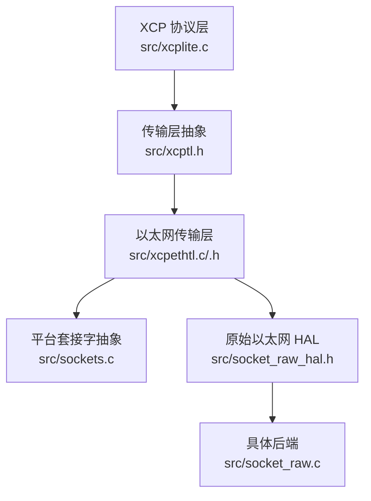
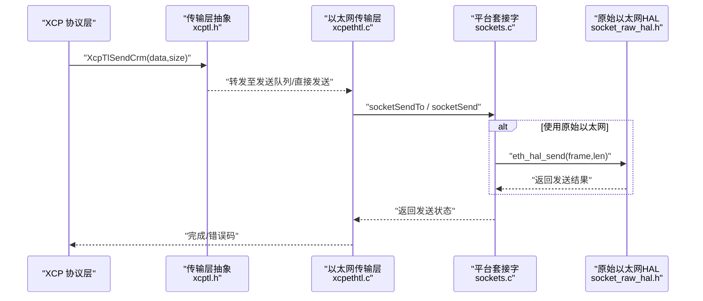
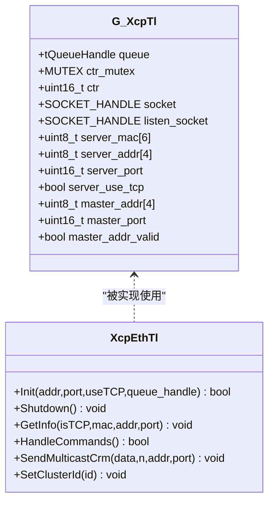
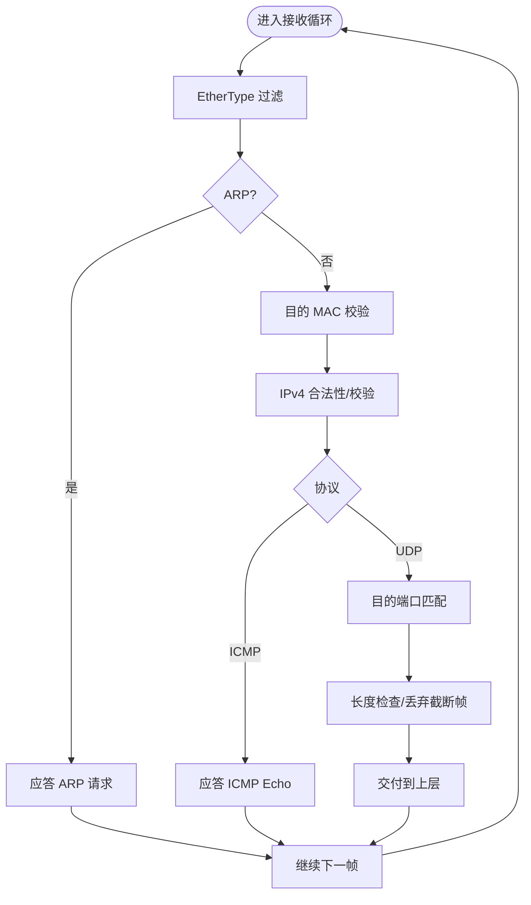
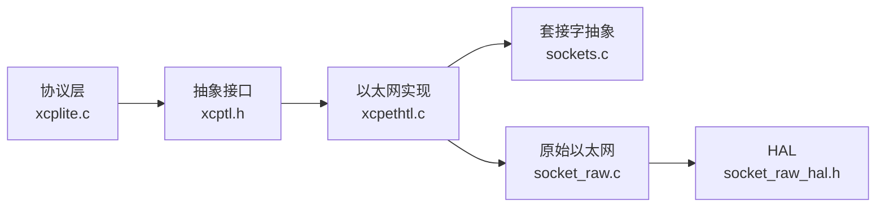

# 传输层接口设计

<cite>
**本文引用的文件**
- [src/xcptl.h](file://src/xcptl.h)
- [src/xcptl_cfg.h](file://src/xcptl_cfg.h)
- [src/xcpethtl.h](file://src/xcpethtl.h)
- [src/xcpethtl.c](file://src/xcpethtl.c)
- [src/socket_raw_hal.h](file://src/socket_raw_hal.h)
- [src/socket_raw.c](file://src/socket_raw.c)
- [src/sockets.c](file://src/sockets.c)
- [inc/xcplib.h](file://inc/xcplib.h)
- [src/xcplite.c](file://src/xcplite.c)
- [docs/SOCKET_RAW.md](file://docs/SOCKET_RAW.md)
</cite>

## 目录
1. [简介](#简介)
2. [项目结构](#项目结构)
3. [核心组件](#核心组件)
4. [架构总览](#架构总览)
5. [详细组件分析](#详细组件分析)
6. [依赖关系分析](#依赖关系分析)
7. [性能考虑](#性能考虑)
8. [故障排查指南](#故障排查指南)
9. [结论](#结论)
10. [附录](#附录)

## 简介
本文件系统性阐述 XCPlite 传输层抽象接口的设计原理与实现机制，解释其如何为上层 XCP 协议提供统一的通信抽象，涵盖数据传输、连接管理、错误处理等核心能力。文档同时说明接口的模块化原则与扩展性考量，给出配置选项的作用与配置方法，详述接口函数、参数与返回值规范，并提供新传输层实现的开发指南与最佳实践。

## 项目结构
XCPlite 的传输层抽象位于 src 目录，通过一组内部头文件与实现文件将“协议层”与“具体网络栈/硬件”解耦：
- 通用传输层接口：src/xcptl.h（供协议层调用）
- 传输层配置：src/xcptl_cfg.h（MTU、段大小、对齐、队列策略等）
- 以太网传输层实现：src/xcpethtl.c/.h（UDP/TCP 路径）
- 平台套接字抽象：src/sockets.c（POSIX/lwIP 等）
- 原始以太网 HAL：src/socket_raw_hal.h + src/socket_raw.c（无 TCP/IP 栈时的 UDP/IPv4/ARP/ICMP）
- 应用入口与服务器初始化：inc/xcplib.h（对外 API），src/xcplite.c（协议层主逻辑）

图示来源
- [src/xcptl.h:19-25](file://src/xcptl.h#L19-L25)
- [src/xcpethtl.c:70-105](file://src/xcpethtl.c#L70-L105)
- [src/socket_raw.c:136-152](file://src/socket_raw.c#L136-L152)

章节来源
- [src/xcptl.h:19-25](file://src/xcptl.h#L19-L25)
- [src/xcptl_cfg.h:34-114](file://src/xcptl_cfg.h#L34-L114)
- [src/xcpethtl.h:24-31](file://src/xcpethtl.h#L24-L31)
- [src/socket_raw_hal.h:74-105](file://src/socket_raw_hal.h#L74-L105)
- [src/socket_raw.c:136-152](file://src/socket_raw.c#L136-L152)
- [src/sockets.c:23-50](file://src/sockets.c#L23-L50)
- [inc/xcplib.h:39-58](file://inc/xcplib.h#L39-L58)
- [src/xcplite.c:49-82](file://src/xcplite.c#L49-L82)

## 核心组件
- 传输层抽象接口（xcptl.h）
  - 面向协议层的统一发送与等待接口：发送 CRM 响应、获取消息计数器、等待发送队列清空。
- 以太网传输层（xcpethtl.c/.h）
  - 维护发送队列、计数器、套接字句柄、对端地址；封装 UDP/TCP 发送；可选多播支持。
- 平台套接字抽象（sockets.c）
  - 屏蔽 POSIX 与 lwIP 差异，提供 socketOpen/Bind/RecvFrom/SendTo/Shutdown/Close 等。
- 原始以太网 HAL（socket_raw_hal.h + socket_raw.c）
  - 在裸机或无 IP 栈目标上实现 UDP/IPv4/ARP/ICMP，并通过 HAL 暴露 eth_hal_* 接口给 socket_raw.c。
- 配置（xcptl_cfg.h）
  - 定义 MTU、最大 DTO/CTO、段大小、对齐、队列策略、是否启用多播等编译期常量。

章节来源
- [src/xcptl.h:19-25](file://src/xcptl.h#L19-L25)
- [src/xcpethtl.h:24-31](file://src/xcpethtl.h#L24-L31)
- [src/sockets.c:23-50](file://src/sockets.c#L23-L50)
- [src/socket_raw_hal.h:74-105](file://src/socket_raw_hal.h#L74-L105)
- [src/xcptl_cfg.h:34-114](file://src/xcptl_cfg.h#L34-L114)

## 架构总览
传输层采用“协议层 → 抽象接口 → 具体传输实现 → 平台/硬件”的分层设计：
- 协议层仅依赖 xcptl.h 提供的最小集接口，不感知底层是 UDP/TCP 还是原始以太网。
- xcpethtl.c 负责将 XCP 数据组装成传输层消息（长度+计数器+载荷），并交由 sockets 或 raw HAL 发送。
- 原始以太网路径通过 socket_raw.c 自行构建 IPv4/UDP/ARP/ICMP，并通过 HAL 与 EMAC 交互。

图示来源
- [src/xcptl.h:23-25](file://src/xcptl.h#L23-L25)
- [src/xcpethtl.c:135-179](file://src/xcpethtl.c#L135-L179)
- [src/socket_raw_hal.h:88-105](file://src/socket_raw_hal.h#L88-L105)

## 详细组件分析

### 传输层抽象接口（xcptl.h）
- 职责
  - 向协议层暴露最小且稳定的发送与同步接口，屏蔽具体传输细节。
- 关键函数
  - XcpTlHandleTransmitQueue：由服务器线程周期性调用，处理发送队列中的段。
  - XcpTlWaitForTransmitQueueEmpty：阻塞等待发送队列清空，超时返回 false。
  - XcpTlSendCrm：发送单条 XCP 命令响应（CRM）。
  - XcpTlGetCtr：获取下一个传输层消息计数器。
- 设计要点
  - 将 CRM 与 DAQ 数据分离：DAQ 走批量队列，CRM 可走低延迟直发或队列（可配置）。
  - 计数器一致性：通过互斥保护确保跨线程单调递增。

章节来源
- [src/xcptl.h:19-25](file://src/xcptl.h#L19-L25)
- [src/xcpethtl.c:70-105](file://src/xcpethtl.c#L70-L105)

### 以太网传输层（xcpethtl.c/.h）
- 职责
  - 维护发送队列、计数器、套接字、对端地址；实现 UDP/TCP 发送；可选多播。
- 关键数据结构
  - 全局 gXcpTl：包含 queue、ctr_mutex、ctr、socket、listen_socket、server/master 地址端口、多播资源等。
- 关键流程
  - 初始化：创建队列、打开/绑定套接字、启动接收/发送线程（由上层服务器管理）。
  - 发送：将 XCP 消息包装为“长度+计数器+载荷”，调用 socketSendTo/Send 或保留头空间的零拷贝路径。
  - 接收：从套接字读取报文，解析后交给协议层处理。
- 多播
  - 若启用，提供独立的多播线程与套接字用于 GET_DAQ_CLOCK_MULTICAST。

图示来源
- [src/xcpethtl.c:70-105](file://src/xcpethtl.c#L70-L105)
- [src/xcpethtl.h:24-31](file://src/xcpethtl.h#L24-L31)

章节来源
- [src/xcpethtl.c:70-105](file://src/xcpethtl.c#L70-L105)
- [src/xcpethtl.c:135-179](file://src/xcpethtl.c#L135-L179)
- [src/xcpethtl.h:24-31](file://src/xcpethtl.h#L24-L31)

### 平台套接字抽象（sockets.c）
- 职责
  - 统一 POSIX 与 FreeRTOS/lwIP 的差异，提供一致的 socket 操作。
- 关键点
  - 错误字符串映射、超时处理、关闭/重启语义。
  - 在 lwIP 路径中，注意 DF 标志与分片行为，以及 MTU 检查的诊断输出。

章节来源
- [src/sockets.c:23-50](file://src/sockets.c#L23-L50)
- [src/sockets.c:84-198](file://src/sockets.c#L84-L198)

### 原始以太网 HAL（socket_raw_hal.h + socket_raw.c）
- 职责
  - 在无 TCP/IP 栈的目标上实现 UDP/IPv4/ARP/ICMP，并通过 HAL 暴露帧级收发能力。
- HAL 接口
  - eth_hal_open/close：打开/关闭以太网接口。
  - eth_hal_get_mac：获取本地 MAC。
  - eth_hal_send/recv：发送/接收完整以太网帧（不含 FCS）。
  - eth_hal_wakeup：唤醒阻塞的 recv。
- 架构要点
  - 只暴露帧级能力，协议细节在 socket_raw.c 内实现。
  - 支持零拷贝发送：队列段预留头部空间，直接在 headroom 写入以太网/IPv4/UDP 头。
  - 接收过滤链：按 EtherType、目的 MAC、IPv4 校验、目的端口等快速丢弃无关帧。

图示来源
- [docs/SOCKET_RAW.md:195-217](file://docs/SOCKET_RAW.md#L195-L217)
- [src/socket_raw.c:136-152](file://src/socket_raw.c#L136-L152)

章节来源
- [src/socket_raw_hal.h:74-105](file://src/socket_raw_hal.h#L74-L105)
- [docs/SOCKET_RAW.md:140-231](file://docs/SOCKET_RAW.md#L140-L231)
- [docs/SOCKET_RAW.md:385-447](file://docs/SOCKET_RAW.md#L385-L447)
- [src/socket_raw.c:136-152](file://src/socket_raw.c#L136-L152)

### 配置选项（xcptl_cfg.h）
- 传输层版本与兼容性
  - XCP_TRANSPORT_LAYER_VERSION：标识传输层版本。
- 包大小与对齐
  - XCPTL_MAX_CTO_SIZE：命令包最大尺寸（需 %8 对齐）。
  - XCPTL_MAX_DTO_SIZE：数据包最大尺寸（受队列与缓存行影响）。
  - XCPTL_PACKET_ALIGNMENT：协议层报文对齐粒度（固定为 4）。
- MTU 与分段
  - OPTION_MTU：链路 MTU（不含以太网头），XCPTL_MAX_SEGMENT_SIZE 据此计算并向下对齐。
  - 过大 MTU 会在运行时报错（EMSGSIZE 或 ETH_HAL_ERROR_SIZE），不会触发 IP 分片。
- 发送头预留
  - XCPTL_TX_HEADROOM：为原始以太网路径预留头部空间以支持零拷贝。
- 其他
  - XCPTL_RECV_TIMEOUT_MS：接收线程后台任务轮询周期。
  - 可选：XCPTL_CRM_VIA_TRANSMIT_QUEUE、XCPTL_EXCLUDE_CRM_FROM_CTR、XCPTL_ENABLE_MULTICAST。

章节来源
- [src/xcptl_cfg.h:34-114](file://src/xcptl_cfg.h#L34-L114)
- [docs/SOCKET_RAW.md:32-79](file://docs/SOCKET_RAW.md#L32-L79)

### 应用集成与服务器初始化（xcplib.h）
- 对外 API
  - XcpEthServerInit：初始化 XCP over Ethernet 服务器（指定地址、端口、TCP/UDP、测量队列大小）。
  - XcpEthServerShutdown：关闭服务器。
  - 状态查询：XcpIsStarted/Connected/DaqRunning。
- 作用
  - 作为应用侧入口，驱动传输层初始化与生命周期管理。

章节来源
- [inc/xcplib.h:39-58](file://inc/xcplib.h#L39-L58)

## 依赖关系分析
- 耦合与内聚
  - 协议层仅依赖 xcptl.h 的最小接口，内聚于 XCP 协议处理。
  - xcpethtl.c 集中管理队列、计数器和套接字，内聚于以太网传输。
  - sockets.c 屏蔽平台差异，内聚于套接字操作。
  - socket_raw.c 与 HAL 解耦，内聚于原始以太网协议栈。
- 外部依赖
  - 平台套接字（POSIX/lwIP）、队列实现、时钟与互斥原语。
- 潜在循环依赖
  - 通过头文件分层避免循环：协议层→抽象→实现→平台/硬件。

图示来源
- [src/xcplite.c:49-82](file://src/xcplite.c#L49-L82)
- [src/xcptl.h:19-25](file://src/xcptl.h#L19-L25)
- [src/xcpethtl.c:70-105](file://src/xcpethtl.c#L70-L105)
- [src/socket_raw.c:136-152](file://src/socket_raw.c#L136-L152)

章节来源
- [src/xcplite.c:49-82](file://src/xcplite.c#L49-L82)
- [src/xcptl.h:19-25](file://src/xcptl.h#L19-L25)
- [src/xcpethtl.c:70-105](file://src/xcpethtl.c#L70-L105)
- [src/socket_raw.c:136-152](file://src/socket_raw.c#L136-L152)

## 性能考虑
- 队列与零拷贝
  - 64 位平台默认使用可变/固定大小的无锁队列；原始以太网路径支持零拷贝发送，减少内存带宽占用。
- 累积与对齐
  - 传输层消息按对齐填充，提高缓存友好性与访问效率。
- 多路径选择
  - UDP/TCP 与原始以太网根据配置编译，避免不必要的代码路径。
- 监控与诊断
  - 可通过调试宏统计发送包数、缓冲区直方图等（测试开关）。

章节来源
- [src/xcptl_cfg.h:44-59](file://src/xcptl_cfg.h#L44-L59)
- [docs/SOCKET_RAW.md:385-447](file://docs/SOCKET_RAW.md#L385-L447)
- [src/xcpethtl.c:182-200](file://src/xcpethtl.c#L182-L200)

## 故障排查指南
- 常见错误与定位
  - 帧过大：EMSGSIZE 或 ETH_HAL_ERROR_SIZE，提示降低 OPTION_MTU。
  - 对端未知：未学习到对端 MAC，检查 CONNECT 首帧与 ARP。
  - 接收卡死：确认 HAL 的 wakeup 与超时设置，避免无限阻塞。
- 排查步骤
  - 先 ping 验证 HAL、ARP、IPv4 头与校验和。
  - 使用抓包工具确认完整段大小与头部字段。
  - 逐步启用更严格的校验（如 UDP 软件校验）定位问题。

章节来源
- [docs/SOCKET_RAW.md:32-79](file://docs/SOCKET_RAW.md#L32-L79)
- [src/socket_raw.c:173-196](file://src/socket_raw.c#L173-L196)

## 结论
XCPlite 传输层通过清晰的抽象与分层，为 XCP 协议提供了稳定、可扩展的通信基础。其模块化设计使 UDP/TCP 与原始以太网路径可并行存在，配置项覆盖 MTU、对齐、队列策略与多播等关键维度。遵循本文档的接口规范与最佳实践，可高效实现新的传输后端并集成到现有系统中。

## 附录

### 接口函数参考（摘要）
- 传输层抽象（xcptl.h）
  - XcpTlHandleTransmitQueue：处理发送队列，返回处理结果（int32_t）。
  - XcpTlWaitForTransmitQueueEmpty：等待队列清空，超时返回 false。
  - XcpTlSendCrm：发送 CRM 响应（data,size）。
  - XcpTlGetCtr：获取下一个计数器值（uint16_t）。
- 以太网传输层（xcpethtl.h/.c）
  - XcpEthTlInit：初始化传输层（地址、端口、TCP/UDP、队列句柄），返回布尔。
  - XcpEthTlShutdown：关闭传输层。
  - XcpEthTlGetInfo：获取当前信息（是否 TCP、MAC、地址、端口）。
  - XcpEthTlHandleCommands：处理传入命令，返回布尔。
  - 多播（可选）：XcpEthTlSendMulticastCrm、XcpEthTlSetClusterId。
- 平台套接字（sockets.c）
  - socketStartup/Cleanup：启动/清理套接字子系统。
  - socketOpen/Bind/RecvFrom/SendTo/Shutdown/Close：标准套接字操作。
- 原始以太网 HAL（socket_raw_hal.h）
  - eth_hal_open/close/get_mac/send/recv/wakeup：帧级收发与上下文管理。

章节来源
- [src/xcptl.h:19-25](file://src/xcptl.h#L19-L25)
- [src/xcpethtl.h:24-31](file://src/xcpethtl.h#L24-L31)
- [src/sockets.c:23-50](file://src/sockets.c#L23-L50)
- [src/socket_raw_hal.h:74-105](file://src/socket_raw_hal.h#L74-L105)

### 新传输层实现指南与最佳实践
- 选择实现路径
  - 基于现有 UDP/TCP：复用 sockets.c 抽象，实现 socketRaw* 或适配 sockets 接口。
  - 无 TCP/IP 栈：实现 socket_raw_hal.h 的 HAL 接口，并在 socket_raw.c 之上工作。
- 关键约束
  - 保持帧/段大小不超过 XCPTL_MAX_SEGMENT_SIZE，避免 IP 分片。
  - 保证发送路径线程安全（必要时加锁），维持计数器单调递增。
  - 正确实现接收超时与唤醒，避免阻塞无法退出。
- 调试建议
  - 开启日志与调试宏，捕获发送包数与错误码。
  - 使用抓包工具验证头部字段与长度。
  - 先在隔离环境（命名空间/虚拟网卡）验证 ARP/ICMP/UDP 通路。

章节来源
- [docs/SOCKET_RAW.md:234-293](file://docs/SOCKET_RAW.md#L234-L293)
- [src/xcptl_cfg.h:34-114](file://src/xcptl_cfg.h#L34-L114)
- [src/socket_raw.c:136-152](file://src/socket_raw.c#L136-L152)