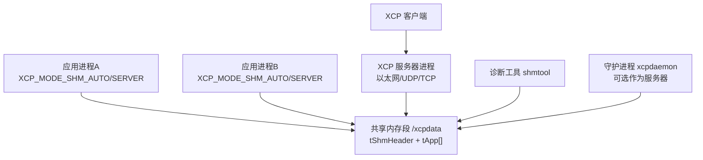
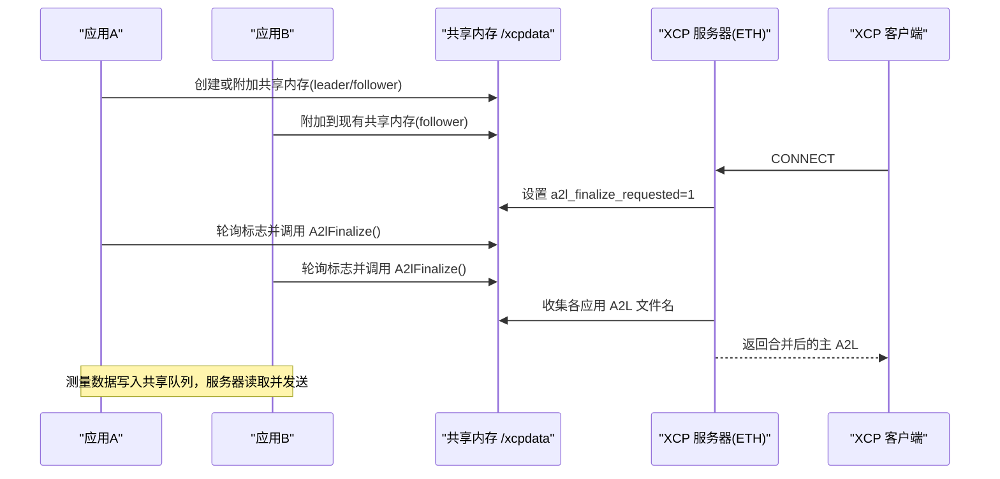
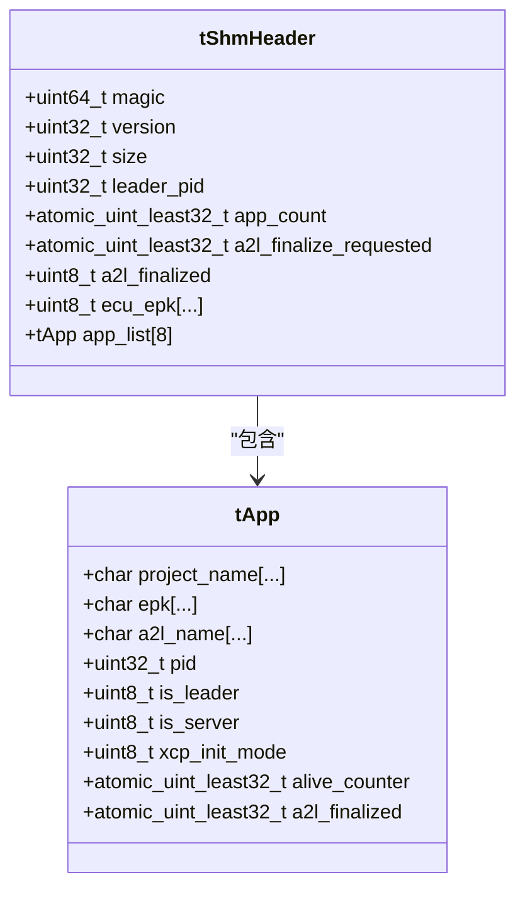
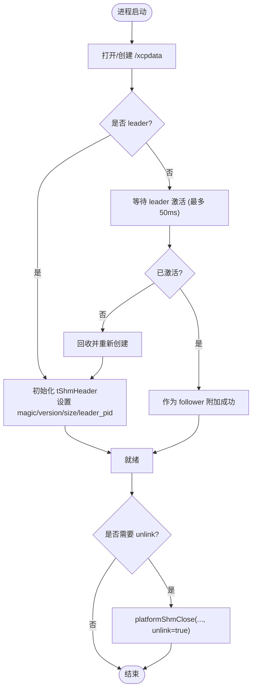
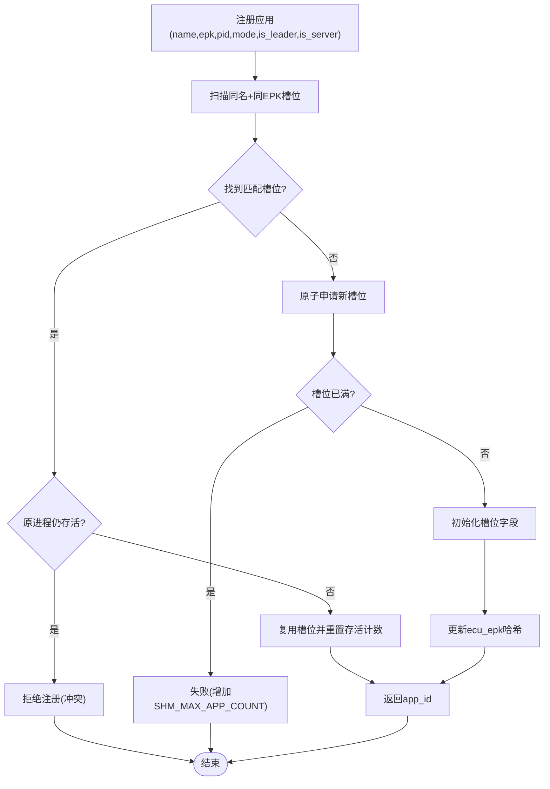
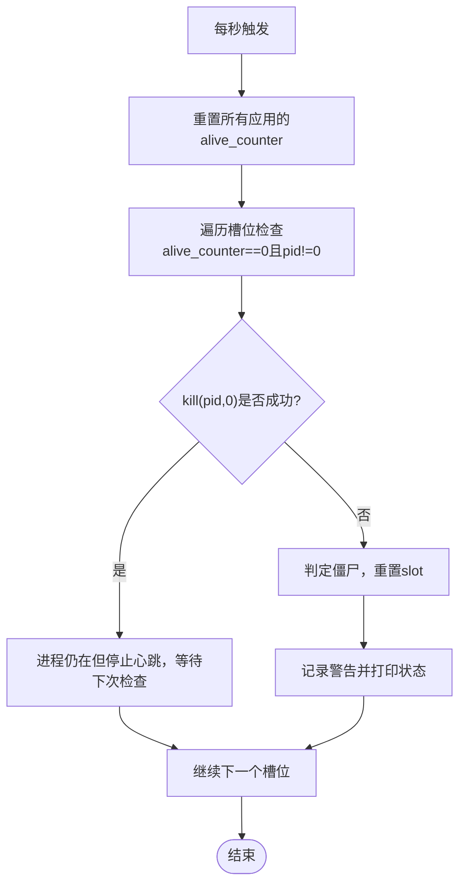
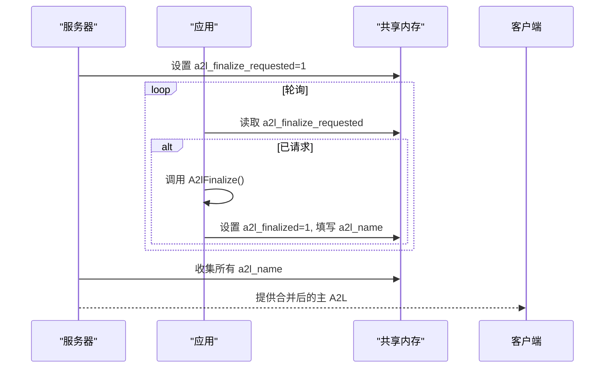
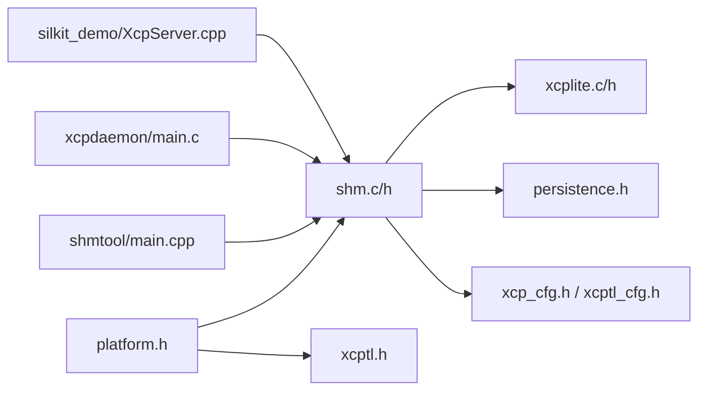

# 共享内存传输

<cite>
**本文引用的文件**
- [docs/SHM.md](file://docs/SHM.md)
- [src/shm.h](file://src/shm.h)
- [src/shm.c](file://src/shm.c)
- [src/xcpshmserver.h](file://src/xcpshmserver.h)
- [src/xcplib_shm_cfg.h](file://src/xcplib_shm_cfg.h)
- [tools/shmtool/src/main.cpp](file://tools/shmtool/src/main.cpp)
- [tools/xcpdaemon/src/main.c](file://tools/xcpdaemon/src/main.c)
- [examples/silkit_demo/src/XcpServer.cpp](file://examples/silkit_demo/src/XcpServer.cpp)
- [src/platform.h](file://src/platform.h)
- [src/xcptl.h](file://src/xcptl.h)
</cite>

## 目录
1. [简介](#简介)
2. [项目结构](#项目结构)
3. [核心组件](#核心组件)
4. [架构总览](#架构总览)
5. [详细组件分析](#详细组件分析)
6. [依赖关系分析](#依赖关系分析)
7. [性能考量](#性能考量)
8. [故障排查指南](#故障排查指南)
9. [结论](#结论)
10. [附录](#附录)

## 简介
本文件深入解析 XCPlite 的共享内存（Shared Memory, SHM）传输机制与应用场景。内容涵盖：
- 共享内存工作原理、内存映射技术与进程间通信优势
- 共享内存服务器设计与实现：内存池管理、同步机制与并发访问控制
- 数据结构定义、消息格式与生命周期管理
- 与 XCP 协议的集成方式、性能优势与适用场景
- 配置方法、监控工具与调试技巧
- 多进程环境下的使用指南与最佳实践

## 项目结构
围绕共享内存传输的关键代码与文档分布如下：
- 文档说明：docs/SHM.md
- 共享内存核心接口与数据结构：src/shm.h、src/shm.c
- 服务器初始化接口：src/xcpshmserver.h
- 模式开关配置：src/xcplib_shm_cfg.h
- 平台抽象（原子操作、线程、共享内存映射等）：src/platform.h
- 传输层通用接口：src/xcptl.h
- 诊断工具：tools/shmtool/src/main.cpp
- 守护进程示例（作为 XCP 服务器接入多个应用）：tools/xcpdaemon/src/main.c
- 示例中声明为 SHM 服务器的用法：examples/silkit_demo/src/XcpServer.cpp

图表来源
- [src/shm.h:65-81](file://src/shm.h#L65-L81)
- [src/shm.c:162-208](file://src/shm.c#L162-L208)
- [tools/shmtool/src/main.cpp:71-166](file://tools/shmtool/src/main.cpp#L71-L166)
- [tools/xcpdaemon/src/main.c:346-360](file://tools/xcpdaemon/src/main.c#L346-L360)

章节来源
- [docs/SHM.md:6-26](file://docs/SHM.md#L6-L26)
- [src/shm.h:38-81](file://src/shm.h#L38-L81)
- [src/shm.c:162-208](file://src/shm.c#L162-L208)

## 核心组件
- 共享内存头与进程表
  - tShmHeader：包含魔数、版本、大小、leader PID、应用计数、A2L 最终化标志、ECU EPK 等，以及固定大小的应用列表数组。
  - tApp：每个注册应用的槽位，包含项目名称、EPK、A2L 文件名、PID、角色标记（leader/server）、初始化模式、存活计数器、A2L 完成标志等。
- 共享内存生命周期
  - 首次创建者成为 leader，后续进程以 follower 形式附加到已有共享内存；若发现无效状态，可回收并重新创建。
- 同步与并发
  - 通过原子变量（如 app_count、a2l_finalize_requested、alive_counter）实现无锁或低锁并发访问。
  - 存活计数器用于检测僵尸进程并清理槽位。
- A2L 生成协调
  - 服务器在首个客户端连接时请求所有应用最终化其 A2L 文件，leader 收集各应用生成的 A2L 名称并合并主 A2L。
- 服务器角色
  - 可由第一个启动的应用自动成为服务器，也可由专用守护进程承担服务器职责。

章节来源
- [src/shm.h:38-124](file://src/shm.h#L38-L124)
- [src/shm.c:69-130](file://src/shm.c#L69-L130)
- [src/shm.c:283-369](file://src/shm.c#L283-L369)
- [src/shm.c:433-517](file://src/shm.c#L433-L517)
- [src/shm.c:523-608](file://src/shm.c#L523-L608)

## 架构总览
XCPlite 在多应用模式下，所有应用进程共享同一份 XCP 协议状态和测量队列。仅一个进程充当 XCP 服务器处理客户端连接与 DAQ 数据发送。共享内存提供跨进程的零拷贝数据通路，降低内核态切换与网络栈开销。

图表来源
- [src/shm.c:162-208](file://src/shm.c#L162-L208)
- [src/shm.c:283-369](file://src/shm.c#L283-L369)
- [tools/xcpdaemon/src/main.c:346-360](file://tools/xcpdaemon/src/main.c#L346-L360)

## 详细组件分析

### 共享内存数据结构与布局
- tShmHeader
  - 控制区（首 64 字节，单缓存行）：magic、version、size、leader_pid、app_count、a2l_finalize_requested、a2l_finalized、ecu_epk。
  - 应用列表：tApp[SHM_MAX_APP_COUNT]，每槽位 512 字节，便于未来扩展。
- tApp
  - 字段包括 project_name、epk、a2l_name、pid、is_leader、is_server、xcp_init_mode、alive_counter、a2l_finalized。
- 关键设计点
  - 原子变量保证跨进程可见性与顺序性。
  - 固定布局与静态断言确保二进制兼容性。
  - 通过 magic/version 校验避免加载不兼容或损坏的共享内存。

图表来源
- [src/shm.h:45-81](file://src/shm.h#L45-L81)

章节来源
- [src/shm.h:38-124](file://src/shm.h#L38-L124)

### 共享内存生命周期与附加/创建流程
- 首次打开（leader）：创建命名共享内存对象，初始化头部信息，设置 leader_pid。
- 后续打开（follower）：附加到已有共享内存，等待 leader 完成激活；若检测到无效状态则尝试回收并重新创建。
- 解引用（unlink）：阻止新进程加入，但保留已映射区域的可用性直至进程退出。

图表来源
- [src/shm.c:162-208](file://src/shm.c#L162-L208)
- [src/shm.c:210-215](file://src/shm.c#L210-L215)

章节来源
- [src/shm.c:162-215](file://src/shm.c#L162-L215)

### 应用注册与槽位管理
- 注册流程
  - 扫描是否存在同名且同 EPK 的槽位，若存在且原进程已死则复用；否则拒绝重复注册。
  - 若为新应用，原子递增 app_count 并初始化槽位字段。
  - 更新 ECU EPK（对所有应用 EPK 进行 FNV-1a 哈希）。
- 注销与清理
  - 关闭时将 pid 清零、重置角色标记；若无活跃应用则 unlink 共享内存以便下一轮重建。

图表来源
- [src/shm.c:523-608](file://src/shm.c#L523-L608)

章节来源
- [src/shm.c:523-608](file://src/shm.c#L523-L608)

### 存活检测与僵尸进程清理
- 每个应用周期性地自增 alive_counter，服务器每秒检查一次。
- 若某应用存活计数为零且进程不存在（kill 0 返回 ESRCH），则视为僵尸并重置槽位。
- 日志输出变化，便于运维观察。

图表来源
- [src/shm.c:433-517](file://src/shm.c#L433-L517)

章节来源
- [src/shm.c:433-517](file://src/shm.c#L433-L517)

### A2L 文件生成与合并
- 服务器在首个客户端连接时设置 a2l_finalize_requested=1。
- 各应用轮询该标志并调用 A2lFinalize()，完成后将 a2l_finalized 置位并填写 a2l_name。
- 服务器等待超时收集所有应用的 A2L 文件名，合并为主 A2L 提供给客户端。

图表来源
- [src/shm.c:283-369](file://src/shm.c#L283-L369)
- [tools/shmtool/src/main.cpp:173-266](file://tools/shmtool/src/main.cpp#L173-L266)

章节来源
- [src/shm.c:283-369](file://src/shm.c#L283-L369)
- [tools/shmtool/src/main.cpp:173-266](file://tools/shmtool/src/main.cpp#L173-L266)

### 与 XCP 协议的集成
- 共享内存模式启用：在配置文件中定义 OPTION_SHM_MODE。
- 初始化模式：
  - XCP_MODE_SHM：在共享内存中分配并激活 XCP 状态。
  - XCP_MODE_SHM_AUTO：自动选择 leader 作为服务器。
  - XCP_MODE_SHM_SERVER：指定当前应用为服务器。
- 传输层接口：
  - 服务器侧通过 XcpTlHandleTransmitQueue 处理发送队列。
  - 协议层通过 XcpTlSendCrm 发送响应包，并通过 XcpTlGetCtr 获取消息计数器。

章节来源
- [src/xcplib_shm_cfg.h:28-37](file://src/xcplib_shm_cfg.h#L28-L37)
- [docs/SHM.md:28-42](file://docs/SHM.md#L28-L42)
- [src/xcptl.h:19-25](file://src/xcptl.h#L19-L25)

### 服务器实现与守护进程
- 服务器初始化：XcpShmServerInit 负责基于共享内存模式的服务器初始化（测量队列大小等）。
- 守护进程示例：xcpdaemon 可作为独立进程运行，使用 XCP_MODE_SHM_SERVER 接入多个应用，支持 TCP/UDP、日志级别、队列大小等参数。
- 示例用法：silkit_demo 中直接以 XCP_MODE_SHM_SERVER 初始化服务器。

章节来源
- [src/xcpshmserver.h:19-30](file://src/xcpshmserver.h#L19-L30)
- [tools/xcpdaemon/src/main.c:346-360](file://tools/xcpdaemon/src/main.c#L346-L360)
- [examples/silkit_demo/src/XcpServer.cpp:30-39](file://examples/silkit_demo/src/XcpServer.cpp#L30-L39)

## 依赖关系分析
- 平台抽象层
  - 原子操作、线程、时钟、共享内存映射等通过 platform.h 统一抽象，屏蔽 Linux/macOS/QNX 差异。
- 共享内存模块
  - 依赖 persistence（持久化 BIN/A2L）、dbg_print（调试输出）、xcp_cfg/xcptl_cfg（协议与传输配置）、xcplite（协议层接口）。
- 工具链
  - shmtool 直接 mmap 共享内存进行诊断与操作。
  - xcpdaemon 作为服务器端，结合 A2L 生成与 XCP 传输。

图表来源
- [src/platform.h:274-297](file://src/platform.h#L274-L297)
- [src/shm.c:12-37](file://src/shm.c#L12-L37)
- [tools/shmtool/src/main.cpp:42-48](file://tools/shmtool/src/main.cpp#L42-L48)
- [tools/xcpdaemon/src/main.c:17-25](file://tools/xcpdaemon/src/main.c#L17-L25)
- [examples/silkit_demo/src/XcpServer.cpp:1-7](file://examples/silkit_demo/src/XcpServer.cpp#L1-L7)

章节来源
- [src/platform.h:274-297](file://src/platform.h#L274-L297)
- [src/shm.c:12-37](file://src/shm.c#L12-L37)

## 性能考量
- 零拷贝与低延迟
  - 共享内存避免了网络栈与系统调用开销，适合高吞吐测量数据流。
- 无锁/低锁设计
  - 原子变量减少互斥锁竞争；读路径几乎无锁，写路径集中在队列头尾偏移。
- 缓存友好
  - 控制区限制在单缓存行内，减少伪共享影响。
- 可扩展性
  - 可通过为每个应用引入独立队列来降低写竞争（当前实现共享单一队列）。

章节来源
- [docs/SHM.md:14-26](file://docs/SHM.md#L14-L26)
- [src/shm.h:65-81](file://src/shm.h#L65-L81)

## 故障排查指南
- 常见问题
  - 共享内存未激活或魔数/版本不匹配：需清理后重建。
  - 应用重复注册：同名同 EPK 且进程仍存活时会拒绝。
  - 僵尸进程占用槽位：通过存活计数检测并清理。
  - A2L 最终化超时：检查各应用是否正确轮询并调用 A2lFinalize。
- 诊断工具
  - shmtool status：查看共享内存内容与状态。
  - shmtool finalize：设置最终化标志并轮询确认。
  - shmtool clean：清理共享内存与锁文件。
- 守护进程命令
  - xcpdaemon status/clean/cleanall：查看状态、清理资源或删除所有应用 A2L。

章节来源
- [tools/shmtool/src/main.cpp:71-166](file://tools/shmtool/src/main.cpp#L71-L166)
- [tools/shmtool/src/main.cpp:173-266](file://tools/shmtool/src/main.cpp#L173-L266)
- [tools/shmtool/src/main.cpp:272-302](file://tools/shmtool/src/main.cpp#L272-L302)
- [tools/xcpdaemon/src/main.c:121-204](file://tools/xcpdaemon/src/main.c#L121-L204)

## 结论
XCPlite 的共享内存传输在多应用模式下提供了高效、低延迟的数据通道，通过无锁/低锁设计、原子变量与缓存友好的布局，实现了跨进程的高吞吐测量与标定能力。配合 A2L 生成协调、存活检测与完善的工具链，使得系统在复杂工程环境中具备高可用性与易维护性。推荐在高带宽、低延迟需求的场景中采用共享内存传输，并结合守护进程统一管理服务器角色。

## 附录

### 配置方法
- 启用共享内存模式：在配置文件中定义 OPTION_SHM_MODE。
- 初始化模式选择：
  - XCP_MODE_SHM：在共享内存中分配并激活 XCP。
  - XCP_MODE_SHM_AUTO：自动选择 leader 作为服务器。
  - XCP_MODE_SHM_SERVER：指定当前应用为服务器。

章节来源
- [src/xcplib_shm_cfg.h:28-37](file://src/xcplib_shm_cfg.h#L28-L37)
- [docs/SHM.md:28-42](file://docs/SHM.md#L28-L42)

### 监控与调试技巧
- 使用 shmtool 查看共享内存状态、触发 A2L 最终化、清理残留资源。
- 在守护进程中开启适当日志级别，定期打印共享内存状态。
- 关注存活计数变化与槽位状态，及时识别异常应用。

章节来源
- [tools/shmtool/src/main.cpp:71-166](file://tools/shmtool/src/main.cpp#L71-L166)
- [tools/xcpdaemon/src/main.c:401-408](file://tools/xcpdaemon/src/main.c#L401-L408)

### 多进程使用指南与最佳实践
- 应用启动顺序无关：任何顺序均可工作，首个应用可自动成为服务器或由专用守护进程担任。
- 版本一致性：不同 EPK 会触发持久化状态重置，确保 A2L 与共享内存一致。
- 队列容量规划：根据测量数据量合理设置测量队列大小，避免溢出。
- 健康检查：利用存活计数与守护进程定期检查，及时处理僵尸进程。
- 资源清理：在部署脚本中加入清理步骤，避免遗留共享内存导致的问题。

章节来源
- [docs/SHM.md:8-26](file://docs/SHM.md#L8-L26)
- [src/shm.c:523-608](file://src/shm.c#L523-L608)
- [tools/xcpdaemon/src/main.c:121-204](file://tools/xcpdaemon/src/main.c#L121-L204)