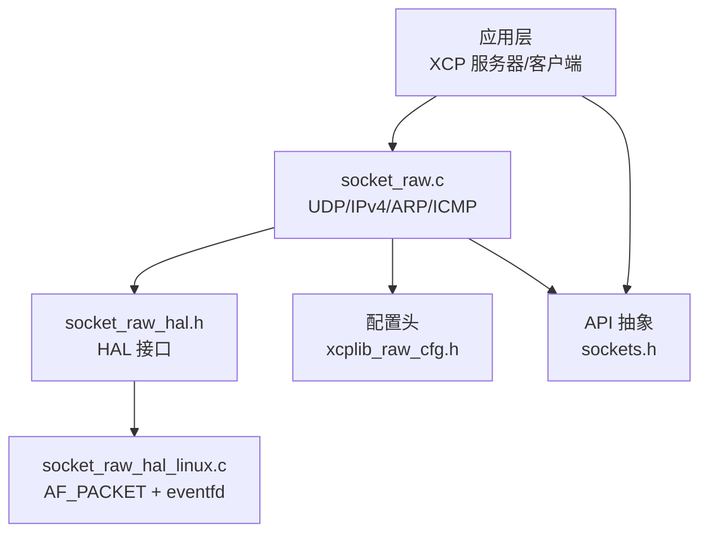
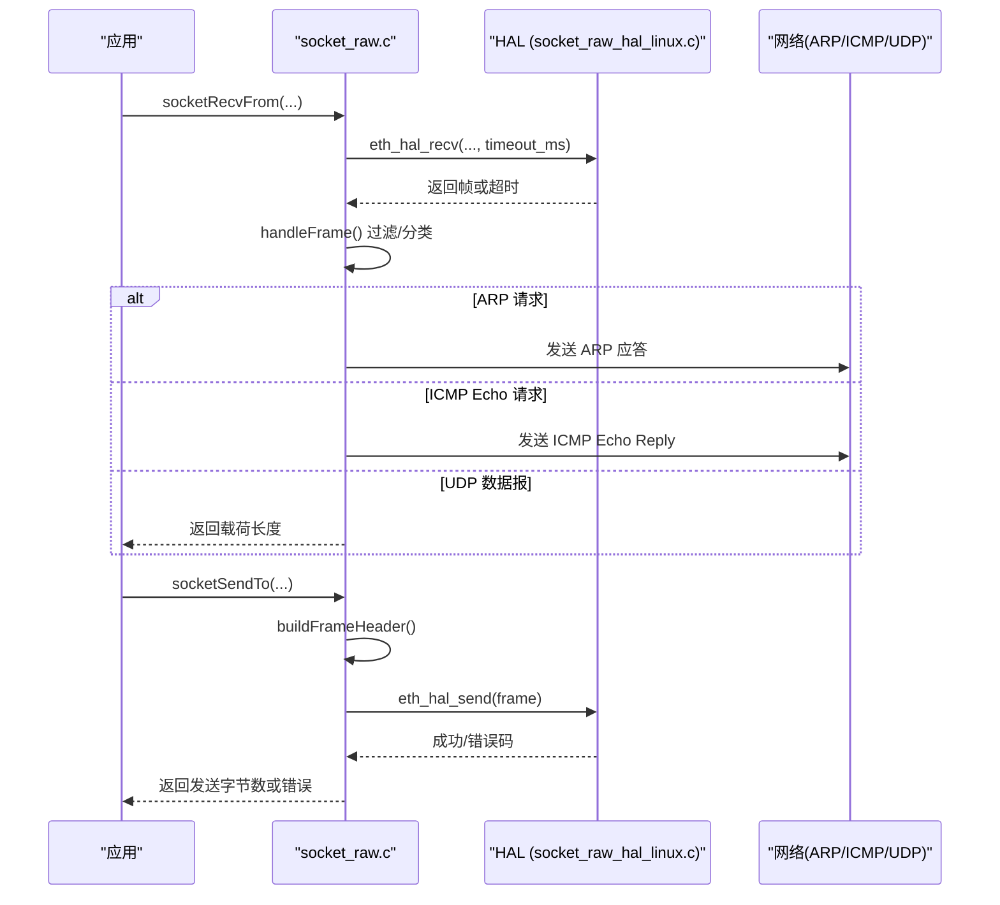
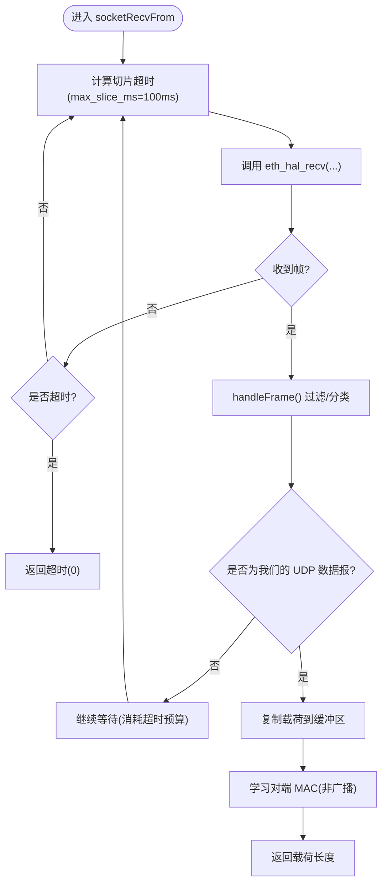
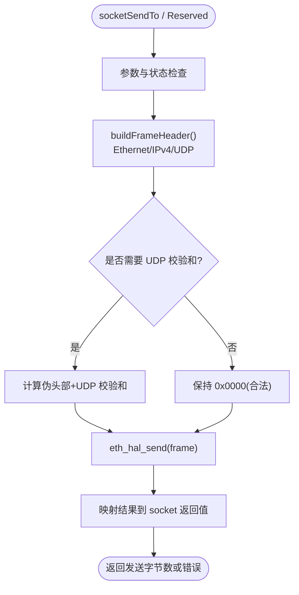
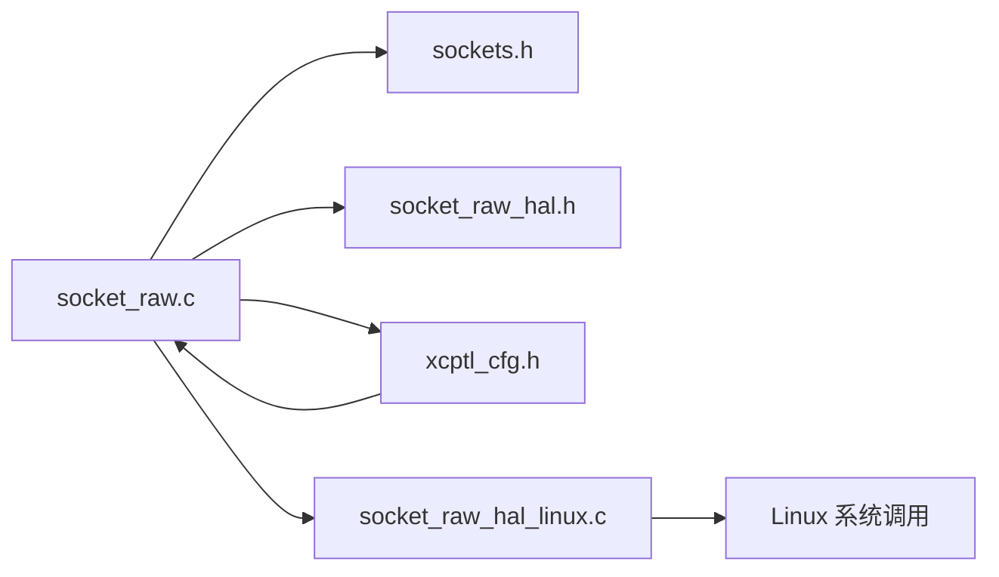

# 原始套接字传输

<cite>
**本文引用的文件**
- [src/socket_raw.c](file://src/socket_raw.c)
- [src/socket_raw_hal.h](file://src/socket_raw_hal.h)
- [src/socket_raw_hal_linux.c](file://src/socket_raw_hal_linux.c)
- [src/sockets.h](file://src/sockets.h)
- [src/xcplib_raw_cfg.h](file://src/xcplib_raw_cfg.h)
- [docs/SOCKET_RAW.md](file://docs/SOCKET_RAW.md)
- [examples/udp_raw_demo/src/main.c](file://examples/udp_raw_demo/src/main.c)
</cite>

## 目录
1. [简介](#简介)
2. [项目结构](#项目结构)
3. [核心组件](#核心组件)
4. [架构总览](#架构总览)
5. [详细组件分析](#详细组件分析)
6. [依赖关系分析](#依赖关系分析)
7. [性能考量](#性能考量)
8. [故障排查指南](#故障排查指南)
9. [结论](#结论)
10. [附录](#附录)

## 简介
本文件系统性解析 XCPlite 的“原始套接字传输”实现，聚焦以下目标：
- 原始套接字工作机制与数据包捕获、过滤技术
- 硬件抽象层（HAL）的设计模式与平台特定实现
- Linux 平台的 AF_PACKET 实现：包格式、协议处理、性能优化
- 数据包结构定义、序列号管理与可靠性保证机制
- 配置选项、权限要求与调试方法
- 跨平台移植指南与常见问题解决方案

该实现为无 TCP/IP 栈的目标提供 XCP over UDP/IPv4 的纯软件协议栈，直接基于以太网帧收发，并通过 HAL 屏蔽底层差异。

## 项目结构
围绕原始套接字传输的关键文件与职责：
- socket_raw.c：实现 UDP/IPv4、ARP、ICMP 以及接收过滤与发送路径，暴露 sockets.h 子集 API
- socket_raw_hal.h：HAL 接口定义，规定 eth_hal_* 函数契约
- socket_raw_hal_linux.c：Linux 后端，使用 AF_PACKET + eventfd/poll
- xcplib_raw_cfg.h：raw 构建的配置覆盖（MTU、队列、校验和策略等）
- sockets.h：平台无关的 sockets 抽象，在 raw 模式下仅暴露必要 API
- docs/SOCKET_RAW.md：完整设计文档、测试流程、零拷贝与性能说明
- examples/udp_raw_demo/src/main.c：演示程序，展示如何配置接口与 IP 并启动服务

图表来源
- [src/socket_raw.c:1-120](file://src/socket_raw.c#L1-L120)
- [src/socket_raw_hal.h:1-108](file://src/socket_raw_hal.h#L1-L108)
- [src/socket_raw_hal_linux.c:1-60](file://src/socket_raw_hal_linux.c#L1-L60)
- [src/xcplib_raw_cfg.h:1-105](file://src/xcplib_raw_cfg.h#L1-L105)
- [src/sockets.h:80-115](file://src/sockets.h#L80-L115)

章节来源
- [docs/SOCKET_RAW.md:1-160](file://docs/SOCKET_RAW.md#L1-L160)
- [src/sockets.h:80-115](file://src/sockets.h#L80-L115)

## 核心组件
- 原始套接字上下文与状态管理：维护本地 MAC/IP、端口、对端 MAC、超时、关闭标志、互斥锁等
- ARP 应答器：仅应答请求，不主动发起；从已接受的数据报学习对端 MAC
- ICMP Echo 应答：便于带外验证链路、MAC 过滤、ARP 应答、IPv4 头部与校验和
- 接收过滤器：按最廉价且最具区分度的顺序过滤（EtherType、目的 MAC、IPv4 完整性、协议、端口、载荷大小），避免截断
- 发送路径：构建 Ethernet/IPv4/UDP 头部，计算校验和（可选），通过 HAL 发送；支持零拷贝写入预留头空间
- HAL 抽象：eth_hal_open/close/get_mac/send/recv/wakeup，屏蔽平台差异

章节来源
- [src/socket_raw.c:130-170](file://src/socket_raw.c#L130-L170)
- [src/socket_raw.c:275-346](file://src/socket_raw.c#L275-L346)
- [src/socket_raw.c:348-403](file://src/socket_raw.c#L348-L403)
- [src/socket_raw.c:405-526](file://src/socket_raw.c#L405-L526)
- [src/socket_raw.c:722-800](file://src/socket_raw.c#L722-L800)
- [src/socket_raw_hal.h:17-38](file://src/socket_raw_hal.h#L17-L38)

## 架构总览
整体数据流：
- 上层调用 sockets.h 提供的 socketRecvFrom/socketSendTo
- socket_raw.c 负责协议封装/解封装、过滤、校验和、线程安全
- 通过 HAL 与 Linux AF_PACKET 交互，eventfd 用于中断阻塞接收
- 配置由 xcplib_raw_cfg.h 控制 MTU、队列、校验和策略等

图表来源
- [src/socket_raw.c:660-720](file://src/socket_raw.c#L660-L720)
- [src/socket_raw.c:722-800](file://src/socket_raw.c#L722-L800)
- [src/socket_raw_hal_linux.c:204-255](file://src/socket_raw_hal_linux.c#L204-L255)

## 详细组件分析

### 原始套接字上下文与生命周期
- 上下文包含 HAL 句柄、本地 MAC/IP、端口、对端 MAC、IP ident、接收超时、关闭标志、打开/绑定状态、发送互斥锁
- 生命周期：socketStartup -> socketOpen -> socketBind -> socketRecvFrom/socketSendTo -> socketShutdown -> socketClose
- 单实例限制：raw 模式仅支持一个 socket，避免多实例竞争

章节来源
- [src/socket_raw.c:130-170](file://src/socket_raw.c#L130-L170)
- [src/socket_raw.c:531-601](file://src/socket_raw.c#L531-L601)
- [src/socket_raw.c:631-658](file://src/socket_raw.c#L631-L658)

### ARP 与 ICMP 处理
- ARP：仅应答请求，不主动发送请求；从已接受的 UDP 数据报学习对端 MAC，防止被无关主机重定向
- ICMP：Echo Request -> Echo Reply，便于快速验证链路、MAC 过滤、ARP 应答、IPv4 头部与校验和
- Gratuitous ARP：可选，在 bind 时广播自身 IP/MAC，加速交换机 MAC 表与客户端 ARP 缓存预热

章节来源
- [src/socket_raw.c:275-346](file://src/socket_raw.c#L275-L346)
- [src/socket_raw.c:348-403](file://src/socket_raw.c#L348-L403)

### 接收路径与过滤逻辑
- 过滤器顺序：EtherType -> 目的 MAC -> IPv4 完整性（版本、IHL、总长、分片检查）-> 目的 IP -> 协议 -> 目的端口 -> 载荷大小
- 严格拒绝分片：不进行重组，避免复杂性与安全风险
- 载荷不截断：若载荷大于缓冲区则丢弃，避免上层出现“Corrupt message received!”
- 绝对截止时间循环：每次进入 socketRecvFrom 计算一次截止时间，内部循环直到命中目标或超时，避免外部负载影响调度节奏

图表来源
- [src/socket_raw.c:660-720](file://src/socket_raw.c#L660-L720)
- [src/socket_raw.c:405-526](file://src/socket_raw.c#L405-L526)

章节来源
- [src/socket_raw.c:405-526](file://src/socket_raw.c#L405-L526)
- [src/socket_raw.c:660-720](file://src/socket_raw.c#L660-L720)

### 发送路径与零拷贝
- 构建 Ethernet/IPv4/UDP 头部：设置 DF、TTL、协议、源/目的地址、长度、校验和
- 校验和策略：可软件计算、硬件插入或置零（IPv4 允许零校验表示“无校验”）
- 零拷贝：在队列段前预留头空间，直接写入 42 字节头部，避免额外拷贝
- 线程安全：发送互斥锁保护头部构建与 HAL 发送，确保并发安全

图表来源
- [src/socket_raw.c:722-800](file://src/socket_raw.c#L722-L800)

章节来源
- [src/socket_raw.c:722-800](file://src/socket_raw.c#L722-L800)

### Linux 平台 HAL 实现（AF_PACKET）
- 使用 AF_PACKET + SOCK_RAW + ETH_P_ALL 捕获所有 EtherType（包括 ARP）
- 需要 CAP_NET_RAW 权限；可通过 setcap 授予
- 使用 eventfd + poll 实现可中断阻塞接收，避免 SO_RCVTIMEO 的延迟问题
- 忽略自身发出的帧：优先使用 PACKET_IGNORE_OUTGOING，回退到 sll_pkttype 检查
- 获取接口索引、MAC、MTU，并在错误时输出诊断信息

章节来源
- [src/socket_raw_hal_linux.c:1-60](file://src/socket_raw_hal_linux.c#L1-L60)
- [src/socket_raw_hal_linux.c:55-157](file://src/socket_raw_hal_linux.c#L55-L157)
- [src/socket_raw_hal_linux.c:176-202](file://src/socket_raw_hal_linux.c#L176-L202)
- [src/socket_raw_hal_linux.c:204-255](file://src/socket_raw_hal_linux.c#L204-L255)
- [src/socket_raw_hal_linux.c:257-263](file://src/socket_raw_hal_linux.c#L257-L263)

### 数据结构与协议字段
- Ethernet 头部：目的 MAC、源 MAC、EtherType
- IPv4 头部：版本/IHL、总长、标识、标志/片偏移、TTL、协议、校验和、源/目的 IP
- UDP 头部：源/目的端口、长度、校验和
- ARP：类型、协议类型、操作码、发送/目标 MAC/IP
- ICMP：类型、代码、校验和

章节来源
- [src/socket_raw.c:57-103](file://src/socket_raw.c#L57-L103)

### 序列号管理与可靠性
- 序列号管理：由上层 XCP 传输层负责消息计数器单调递增，与 socket_raw 的 tx_mutex 独立；socket_raw 仅负责可靠传输语义（丢包/超限报错）
- 可靠性保证：
  - 严格拒绝分片，避免重组复杂性
  - 载荷不截断，错误上报而非静默失败
  - 对端 MAC 仅从已接受的数据报学习，防止 ARP 欺骗重定向
  - 校验和验证（可选）帮助定位解析错误

章节来源
- [src/socket_raw.c:218-238](file://src/socket_raw.c#L218-L238)
- [src/socket_raw.c:458-479](file://src/socket_raw.c#L458-L479)
- [src/socket_raw.c:519-523](file://src/socket_raw.c#L519-L523)
- [docs/SOCKET_RAW.md:219-231](file://docs/SOCKET_RAW.md#L219-L231)

### 配置选项与权限
- 关键配置：
  - OPTION_ENABLE_UDP_RAW：启用 raw 传输（与 TCP/UDP 互斥）
  - OPTION_QUEUE_32：强制使用 32 位队列（raw 不支持 scatter-gather）
  - OPTION_MTU：链路 MTU，需考虑 28 字节头开销并对齐
  - OPTION_UDP_RAW_IFNAME：默认接口名
  - OPTION_UDP_RAW_ENABLE_ICMP_ECHO：启用 ping 应答
  - OPTION_UDP_RAW_UDP_CHECKSUM_ZERO/_COMPUTE/_HW：校验和策略
  - OPTION_UDP_RAW_VERIFY_RX_CHECKSUM：接收时校验 IPv4 头部
  - OPTION_UDP_RAW_GRATUITOUS_ARP：可选 gratuitous ARP
  - OPTION_UDP_RAW_ZERO_COPY：零拷贝发送
- 权限要求：CAP_NET_RAW（Linux），通过 setcap 授予二进制文件

章节来源
- [src/xcplib_raw_cfg.h:33-105](file://src/xcplib_raw_cfg.h#L33-L105)
- [docs/SOCKET_RAW.md:82-113](file://docs/SOCKET_RAW.md#L82-L113)
- [docs/SOCKET_RAW.md:259-271](file://docs/SOCKET_RAW.md#L259-L271)

### 示例与用法
- 示例程序 udp_raw_demo：
  - 命令行参数指定接口与 IP
  - 初始化 XCP 服务器与 A2L
  - 触发测量事件并运行主循环
  - 优雅关闭

章节来源
- [examples/udp_raw_demo/src/main.c:103-209](file://examples/udp_raw_demo/src/main.c#L103-L209)

## 依赖关系分析
- socket_raw.c 依赖：
  - sockets.h：暴露 raw 模式下的最小 API 集合
  - socket_raw_hal.h：HAL 接口
  - xcptl_cfg.h：传输层配置（如最大段大小）
  - platform.h：平台相关定义
- socket_raw_hal_linux.c 依赖：
  - Linux 系统调用：socket、bind、ioctl、poll、recvfrom、write/read
  - 事件驱动：eventfd 用于唤醒阻塞接收
- 配置依赖：
  - xcplib_raw_cfg.h：覆盖默认配置，适配 raw 模式

图表来源
- [src/socket_raw.c:26-34](file://src/socket_raw.c#L26-L34)
- [src/socket_raw_hal_linux.c:21-43](file://src/socket_raw_hal_linux.c#L21-L43)
- [src/xcplib_raw_cfg.h:33-70](file://src/xcplib_raw_cfg.h#L33-L70)

章节来源
- [src/socket_raw.c:26-34](file://src/socket_raw.c#L26-L34)
- [src/socket_raw_hal_linux.c:21-43](file://src/socket_raw_hal_linux.c#L21-L43)
- [src/xcplib_raw_cfg.h:33-70](file://src/xcplib_raw_cfg.h#L33-L70)

## 性能考量
- 零拷贝发送：在队列段前预留头空间，避免额外拷贝，提升嵌入式目标吞吐
- 过滤器顺序：先做低成本判断（EtherType、目的 MAC、端口），减少后续处理
- 绝对截止时间循环：避免在高负载下频繁返回 0 导致调用方任务抖动
- 校验和策略：默认置零以减少开销，调试阶段可切换为软件计算以验证链路
- 线程安全：发送互斥锁短临界区，降低争用

章节来源
- [docs/SOCKET_RAW.md:385-447](file://docs/SOCKET_RAW.md#L385-L447)
- [src/socket_raw.c:405-526](file://src/socket_raw.c#L405-L526)
- [src/socket_raw.c:722-800](file://src/socket_raw.c#L722-L800)

## 故障排查指南
- 权限问题：缺少 CAP_NET_RAW 导致 AF_PACKET 创建失败
  - 解决：sudo setcap cap_net_raw+ep <binary>
- 接口不存在或绑定失败：检查接口名称与权限
- 地址冲突：确保目标 IP 未被内核占用，否则内核会响应 ARP 并丢弃 UDP 端口不可达
- 分片与 MTU：raw 模式不处理分片，超大数据报会被拒绝；调整 OPTION_MTU 或减小段大小
- VLAN 标签：当前实现不支持 802.1Q，遇到 tagged 帧会丢弃并打印警告
- 校验和错误：开启 OPTION_UDP_RAW_VERIFY_RX_CHECKSUM 与 OPTION_UDP_RAW_UDP_CHECKSUM_COMPUTE 辅助定位

章节来源
- [src/socket_raw_hal_linux.c:72-84](file://src/socket_raw_hal_linux.c#L72-L84)
- [docs/SOCKET_RAW.md:32-79](file://docs/SOCKET_RAW.md#L32-L79)
- [docs/SOCKET_RAW.md:355-371](file://docs/SOCKET_RAW.md#L355-L371)

## 结论
XCPlite 的原始套接字传输在无 TCP/IP 栈的目标上提供了高效、可控的 XCP over UDP/IPv4 能力。通过 HAL 抽象屏蔽平台差异，结合严格的接收过滤、可靠的发送路径与灵活的配置选项，既满足嵌入式场景的性能需求，又便于开发与调试。Linux 后端基于 AF_PACKET 与 eventfd 实现了低延迟、可中断的收发，配合零拷贝与校验和策略，达到良好的吞吐与时延平衡。

## 附录
- 构建与测试：参考 docs/SOCKET_RAW.md 中的测试脚本与步骤
- 跨平台移植：通过实现 socket_raw_hal.h 定义的 HAL 接口，可在不同平台复用 socket_raw.c 的协议栈
- 常见问题：
  - 无法 ping：检查 HAL、MAC 过滤、ARP 应答、IPv4 头部与校验和
  - 连接失败：确认对端 MAC 学习、端口匹配与 MTU 配置
  - 高 CPU：检查接收循环是否正确使用截止时间与切片超时

章节来源
- [docs/SOCKET_RAW.md:321-382](file://docs/SOCKET_RAW.md#L321-L382)
- [docs/SOCKET_RAW.md:449-478](file://docs/SOCKET_RAW.md#L449-L478)