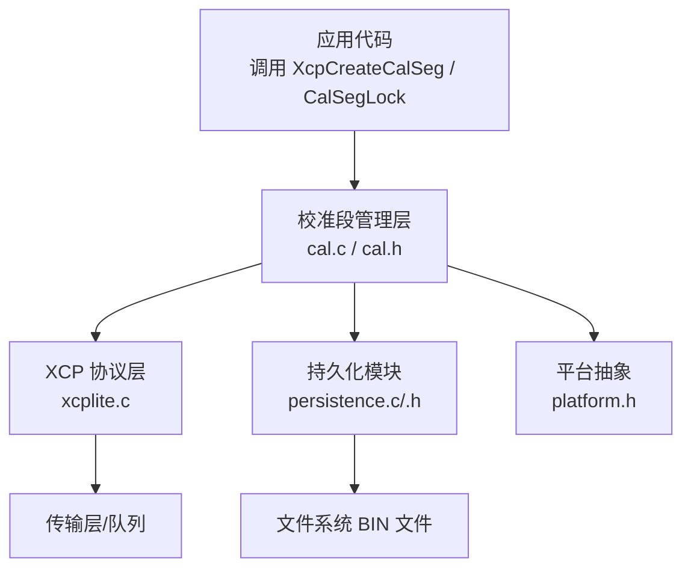
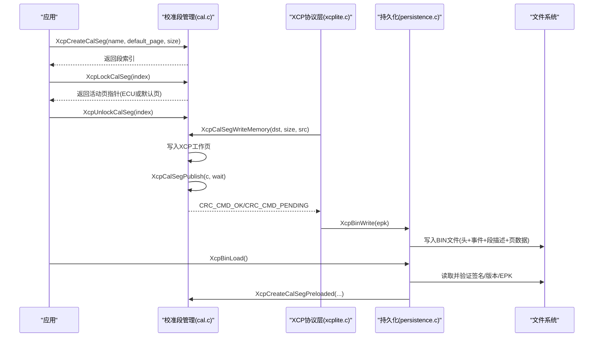
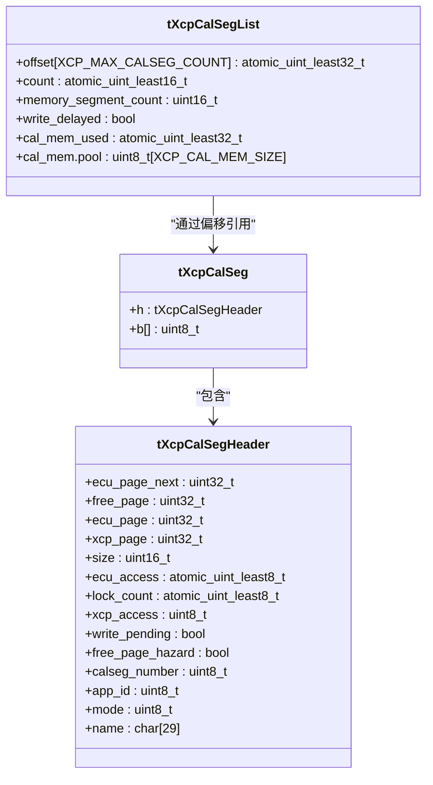
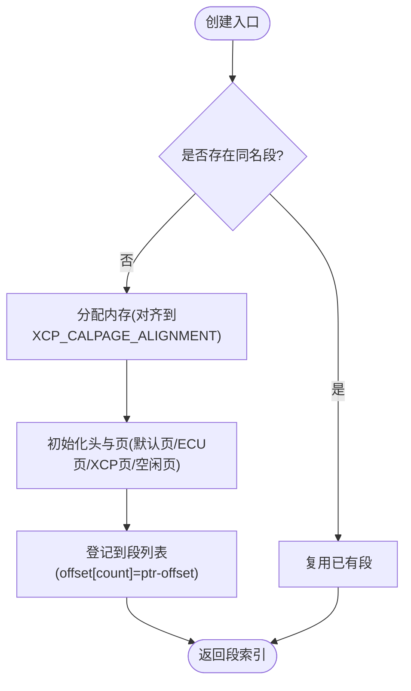
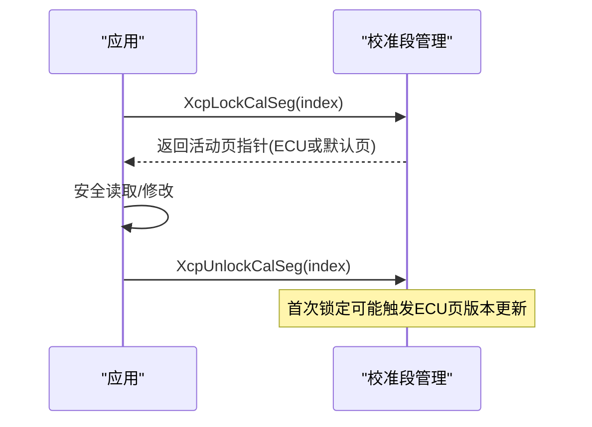
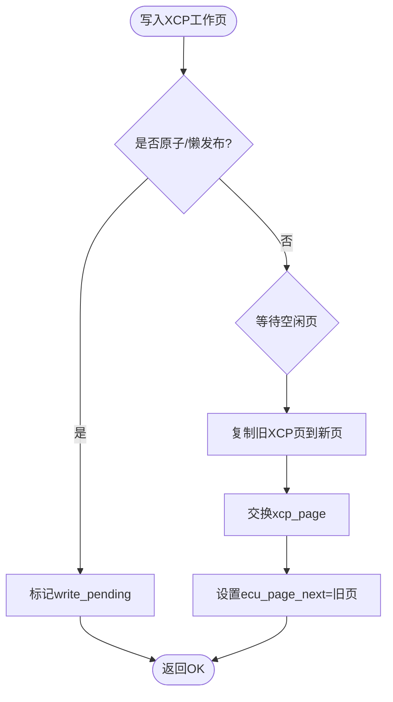
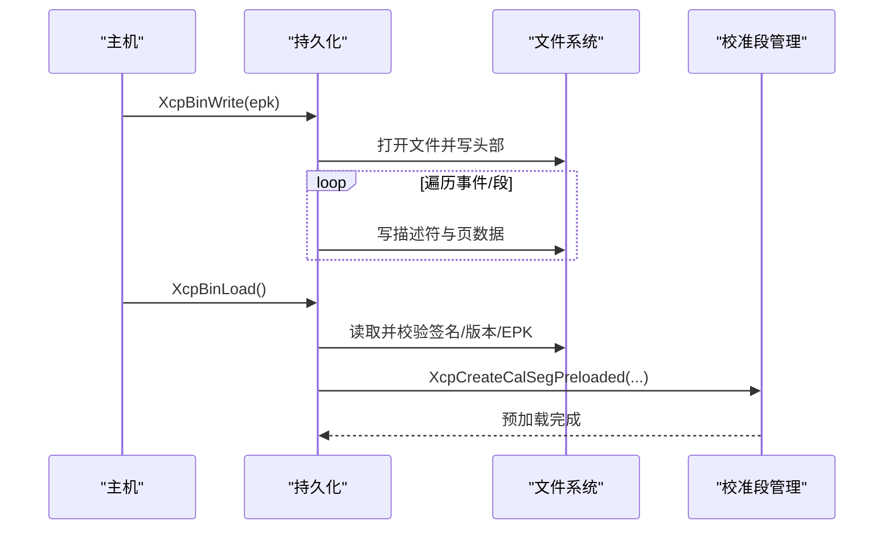
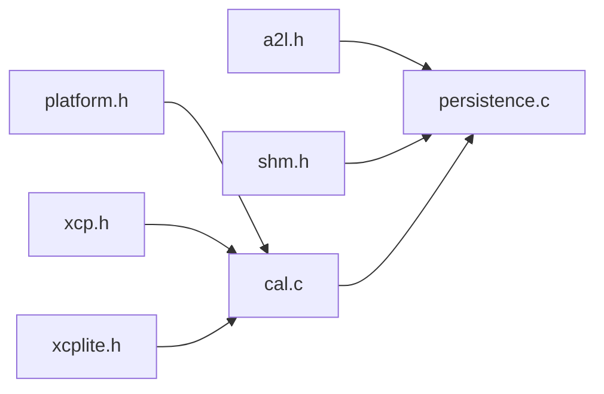

# 校准段管理

<cite>
**本文引用的文件**
- [cal.c](file://src/cal.c)
- [cal.h](file://src/cal.h)
- [persistence.c](file://src/persistence.c)
- [persistence.h](file://src/persistence.h)
- [xcplib.h](file://inc/xcplib.h)
- [xcplite.c](file://src/xcplite.c)
- [platform.h](file://src/platform.h)
</cite>

## 目录
1. [简介](#简介)
2. [项目结构](#项目结构)
3. [核心组件](#核心组件)
4. [架构总览](#架构总览)
5. [详细组件分析](#详细组件分析)
6. [依赖关系分析](#依赖关系分析)
7. [性能考量](#性能考量)
8. [故障排查指南](#故障排查指南)
9. [结论](#结论)
10. [附录](#附录)

## 简介
本文件深入解析 XCPlite 的校准段（Calibration Segment）管理系统，覆盖以下主题：
- 校准段的创建、管理与访问机制
- 相对寻址模式与页切换算法（RCU：读-复制-更新）
- 持久化存储的实现原理（数据序列化、版本兼容性与故障恢复）
- 多线程环境下的同步、内存映射与缓存策略
- 性能优化、内存使用监控与调试工具
- 扩展与自定义存储后端的开发指导

## 项目结构
校准段管理主要位于 src/cal.c 与 src/cal.h；持久化在 src/persistence.c/.h；公共 API 在 inc/xcplib.h；初始化与协议层集成在 src/xcplite.c；平台抽象（原子操作、线程等）在 src/platform.h。

图表来源
- [cal.c:185-615](file://src/cal.c#L185-L615)
- [cal.h:79-175](file://src/cal.h#L79-L175)
- [persistence.c:248-318](file://src/persistence.c#L248-L318)
- [xcplite.c:164-182](file://src/xcplite.c#L164-L182)
- [platform.h:101-199](file://src/platform.h#L101-L199)

章节来源
- [cal.c:185-615](file://src/cal.c#L185-L615)
- [cal.h:79-175](file://src/cal.h#L79-L175)
- [persistence.c:248-318](file://src/persistence.c#L248-L318)
- [xcplite.c:164-182](file://src/xcplite.c#L164-L182)
- [platform.h:101-199](file://src/platform.h#L101-L199)

## 核心组件
- 校准段列表与内存池：无锁 bump allocator，按页对齐分配 tXcpCalSeg，维护偏移表与计数。
- 校准段结构体：包含头信息（名称、大小、页指针偏移、访问控制位、锁计数、ECU/XCP 页号等）和可变长度页数据区。
- RCU 页切换：通过“默认页 + ECU 工作页 + XCP 工作页 + 空闲页”实现无锁并发读写与一致性发布。
- 持久化：二进制 BIN 文件，包含事件、校准段描述符与页数据，支持版本校验与 EPK 匹配。
- 原子事务：BEGIN/END 原子写，延迟发布，批量提交。
- 平台抽象：跨平台原子、互斥、睡眠、时钟等。

章节来源
- [cal.h:79-175](file://src/cal.h#L79-L175)
- [cal.c:99-117](file://src/cal.c#L99-L117)
- [cal.c:509-615](file://src/cal.c#L509-L615)
- [persistence.c:40-95](file://src/persistence.c#L40-L95)
- [platform.h:101-199](file://src/platform.h#L101-L199)

## 架构总览
校准段管理在 XCP 协议层之上提供统一的段管理能力，对外暴露创建、锁定、查询、写入、发布等接口；内部通过 RCU 保证多读者（ECU/应用）与单写者（XCP 服务器线程）的一致性；持久化模块负责将当前状态序列化为 BIN 文件，并在启动时加载以恢复。

图表来源
- [cal.c:375-503](file://src/cal.c#L375-L503)
- [cal.c:623-689](file://src/cal.c#L623-L689)
- [cal.c:800-844](file://src/cal.c#L800-L844)
- [cal.c:723-798](file://src/cal.c#L723-L798)
- [persistence.c:248-318](file://src/persistence.c#L248-L318)
- [persistence.c:375-521](file://src/persistence.c#L375-L521)

## 详细组件分析

### 校准段数据结构与内存布局
- 头结构 tXcpCalSegHeader：固定 64 字节，包含页偏移、访问标志、锁计数、段号、应用 ID、名称等。所有页引用使用相对于段起始地址的偏移，确保位置无关，便于共享内存。
- 页布局：
  - 相对寻址模式：默认页 + ECU 工作页 + XCP 工作页 + 空闲页（4 页）。
  - 绝对寻址模式：默认页为静态指针，ECU/XCP/空闲页在分配区中（3 页）。
- 段列表：offset[] 数组保存每个段在内存池中的偏移，count 记录数量，memory_segment_count 统计带段号的段数。

图表来源
- [cal.h:79-175](file://src/cal.h#L79-L175)

章节来源
- [cal.h:79-175](file://src/cal.h#L79-L175)

### 校准段创建与注册
- 动态创建：XcpCreateCalSeg / XcpCreateCalBlk 检查是否已存在同名段，不存在则从内存池分配并初始化。
- 预注册：XcpRegisterSectionCalSegs 扫描链接器节 xcp_cals，自动为声明的段创建实例。
- 预加载：XcpCreateCalSegPreloaded 从 BIN 文件恢复段，标记为预加载，后续完成初始化。

图表来源
- [cal.c:375-503](file://src/cal.c#L375-L503)
- [cal.c:122-180](file://src/cal.c#L122-L180)
- [cal.c:343-368](file://src/cal.c#L343-L368)

章节来源
- [cal.c:122-180](file://src/cal.c#L122-L180)
- [cal.c:375-503](file://src/cal.c#L375-L503)
- [cal.c:343-368](file://src/cal.c#L343-L368)

### 访问与锁定：ECU/XCP 双视图
- 应用侧通过 XcpLockCalSeg 获取活动页指针（ECU 或默认页），解锁后释放引用。
- XCP 侧通过 XcpCalSegReadMemory / XcpCalSegWriteMemory 访问 XCP 工作页或默认页。
- 页选择由 ecu_access/xcp_access 控制，支持 GET/SET CAL_PAGE。

图表来源
- [cal.c:623-689](file://src/cal.c#L623-L689)
- [cal.c:698-717](file://src/cal.c#L698-L717)

章节来源
- [cal.c:623-689](file://src/cal.c#L623-L689)
- [cal.c:698-717](file://src/cal.c#L698-L717)

### 页切换算法（RCU）与发布流程
- 写路径：XcpCalSegWriteMemory 写入 XCP 工作页；若处于原子事务或懒发布模式，仅标记 write_pending；否则尝试发布。
- 发布：XcpCalSegPublish 等待空闲页可用，复制旧 XCP 页到新页，交换 xcp_page，并通过 ecu_page_next 通知 ECU 端更新。
- 风险规避：free_page_hazard 防止在首个锁定前释放页；wait 参数控制阻塞等待。

图表来源
- [cal.c:800-844](file://src/cal.c#L800-L844)
- [cal.c:723-767](file://src/cal.c#L723-L767)

章节来源
- [cal.c:800-844](file://src/cal.c#L800-L844)
- [cal.c:723-767](file://src/cal.c#L723-L767)

### 相对寻址模式与页切换算法
- 相对寻址模式下，段内地址通过段号与偏移编码；XCP 命令解码得到段索引与偏移，再定位到对应页。
- 页切换通过原子变量与 hazard 标志协同，确保 ECU 与 XCP 视图一致且无竞争。

章节来源
- [cal.c:698-717](file://src/cal.c#L698-L717)
- [cal.c:723-767](file://src/cal.c#L723-L767)

### 持久化存储：序列化、版本与恢复
- 文件格式：固定头部（签名、版本、事件/段计数、EPK）、事件描述、段描述与页数据、可选应用列表（SHM 模式）。
- 写入：XcpBinWrite 遍历事件与段，写出描述符与默认页数据；XcpBinFreezeCalSeg 可冻结当前活动页。
- 加载：XcpBinLoad 校验签名与版本，必要时校验 EPK；重建事件与段，预加载默认页内容。
- 兼容性：版本不匹配直接拒绝；EPK 不匹配可选择跳过加载。

图表来源
- [persistence.c:248-318](file://src/persistence.c#L248-L318)
- [persistence.c:327-365](file://src/persistence.c#L327-L365)
- [persistence.c:375-521](file://src/persistence.c#L375-L521)

章节来源
- [persistence.c:248-318](file://src/persistence.c#L248-L318)
- [persistence.c:327-365](file://src/persistence.c#L327-L365)
- [persistence.c:375-521](file://src/persistence.c#L375-L521)

### 多线程同步、内存映射与缓存策略
- 同步：
  - 段列表插入使用互斥量保护（创建阶段）。
  - 运行时访问使用原子变量（锁计数、页号、空闲页、hazard 标志）。
  - 发布路径在 XCP 服务器线程单线程执行，避免复杂锁竞争。
- 内存映射：
  - 相对寻址模式下，段数据连续存放于内存池，页通过偏移访问，适合共享内存场景。
  - 绝对寻址模式下，默认页为静态指针，减少拷贝。
- 缓存策略：
  - 应用侧通过锁定获取活动页指针，避免重复查找。
  - XCP 侧读写直接命中 XCP 工作页或默认页，减少额外拷贝。

章节来源
- [cal.c:99-117](file://src/cal.c#L99-L117)
- [cal.c:398-421](file://src/cal.c#L398-L421)
- [cal.c:623-689](file://src/cal.c#L623-L689)
- [cal.c:723-767](file://src/cal.c#L723-L767)

### 原子事务与批量发布
- BEGIN：设置 write_delayed 标志，重置各段 write_pending。
- END：清除标志并调用 XcpCalSegPublishAll(wait=true)，批量发布所有待处理变更。

章节来源
- [cal.c:1047-1062](file://src/cal.c#L1047-L1062)
- [cal.c:769-798](file://src/cal.c#L769-L798)

### 页控制与复制
- GET/SET CAL_PAGE：查询或设置 ECU/XCP 访问页，支持全段统一设置。
- COPY CAL PAGE：从默认页复制到工作页，支持旧版 CANape 兼容模式。

章节来源
- [cal.c:948-1045](file://src/cal.c#L948-L1045)

## 依赖关系分析
- cal.c 依赖 platform.h（原子/互斥/睡眠）、xcp.h（协议常量）、xcplite.h（全局状态）。
- persistence.c 依赖 a2l.h（项目名）、shm.h（SHM 模式）、xcp_cfg.h（配置）。
- xcplib.h 提供公共 API 与宏，供应用侧快速创建与访问校准段。

图表来源
- [cal.c:13-38](file://src/cal.c#L13-L38)
- [persistence.c:13-35](file://src/persistence.c#L13-L35)

章节来源
- [cal.c:13-38](file://src/cal.c#L13-L38)
- [persistence.c:13-35](file://src/persistence.c#L13-L35)

## 性能考量
- 无锁发布：RCU 设计使应用侧锁定为无锁，发布仅在 XCP 服务器线程进行，降低争用。
- 懒发布：XCP_ENABLE_CALSEG_LAZY_WRITE 允许非阻塞写入，提升吞吐。
- 内存对齐：页面按 XCP_CALPAGE_ALIGNMENT 对齐，提高缓存友好性。
- 批量发布：原子事务减少多次发布的开销。
- 监控指标：可通过 TEST_ENABLE_DBG_METRICS 统计 pending 与发布次数（需启用编译选项）。

章节来源
- [cal.c:723-767](file://src/cal.c#L723-L767)
- [cal.c:800-844](file://src/cal.c#L800-L844)
- [cal.c:1047-1062](file://src/cal.c#L1047-L1062)

## 故障排查指南
- 常见错误码：
  - CRC_ACCESS_DENIED：非法段号、越界访问、试图写入默认页。
  - CRC_OUT_OF_RANGE：无效段号或页号。
  - CRC_CMD_PENDING：无空闲页或 hazard 未清，稍后重试。
- 诊断要点：
  - 检查段数量与内存池使用（atomic cal_mem_used）。
  - 查看日志输出（DBG_PRINTF/DBG_PRINT_ERROR）定位失败点。
  - 确认 EPK 与版本匹配，避免持久化文件加载失败。
  - 在 SHM 模式下，确认 app_id 匹配，避免跨进程误访问。

章节来源
- [cal.c:698-717](file://src/cal.c#L698-L717)
- [cal.c:800-844](file://src/cal.c#L800-L844)
- [persistence.c:375-404](file://src/persistence.c#L375-L404)

## 结论
XCPlite 的校准段管理通过 RCU 实现了高效、安全的并发访问，结合原子事务与懒发布机制，在保证一致性的同时最大化性能。持久化模块提供可靠的序列化与恢复能力，支持版本与 EPK 校验。整体设计清晰、可扩展，适用于多种平台与部署场景。

## 附录

### 扩展与自定义存储后端
- 目标：替换或增强持久化后端（如内存映射、网络存储、加密存储）。
- 步骤：
  1. 实现与 persistence.c 相同的接口（XcpBinWrite/XcpBinLoad/XcpBinFreezeCalSeg）。
  2. 保持 tBinHeader/tBinCalSeg 格式兼容，或定义新格式并提供迁移逻辑。
  3. 在构建系统中启用 OPTION_ENABLE_PERSISTENCE，并确保 XCP_ENABLE_DAQ_EVENT_LIST 与 XCP_ENABLE_CALSEG_LIST 开启。
  4. 测试：验证写入/加载/冻结流程，检查 EPK 与版本兼容性。
- 注意事项：
  - 保持原子性与幂等性，避免部分写入导致不一致。
  - 在 SHM 模式下考虑多进程并发访问。
  - 提供回滚机制与校验和，确保数据完整性。

章节来源
- [persistence.c:248-318](file://src/persistence.c#L248-L318)
- [persistence.c:375-521](file://src/persistence.c#L375-L521)
- [persistence.h:30-46](file://src/persistence.h#L30-L46)