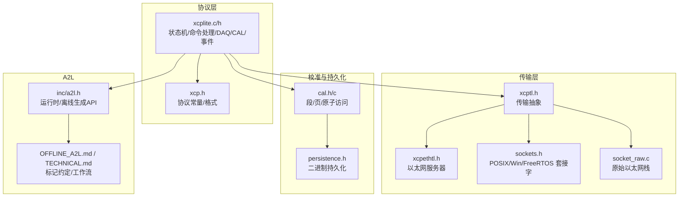
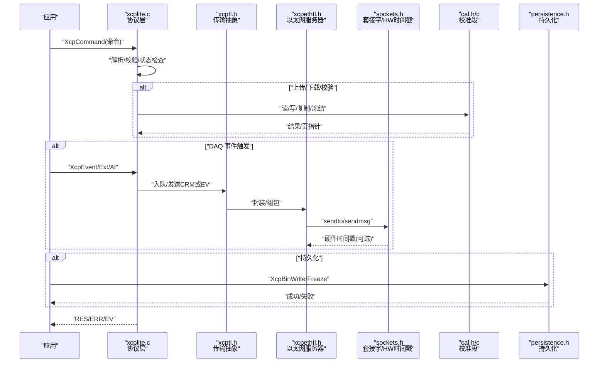
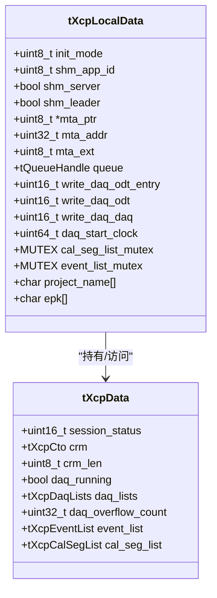
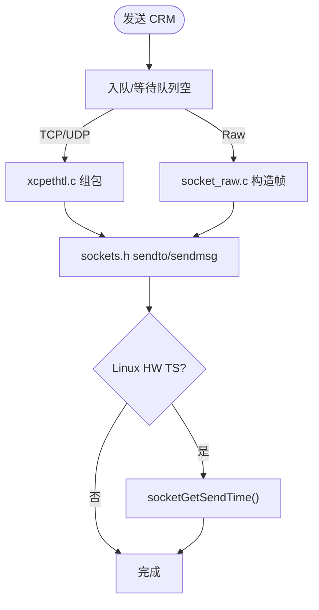
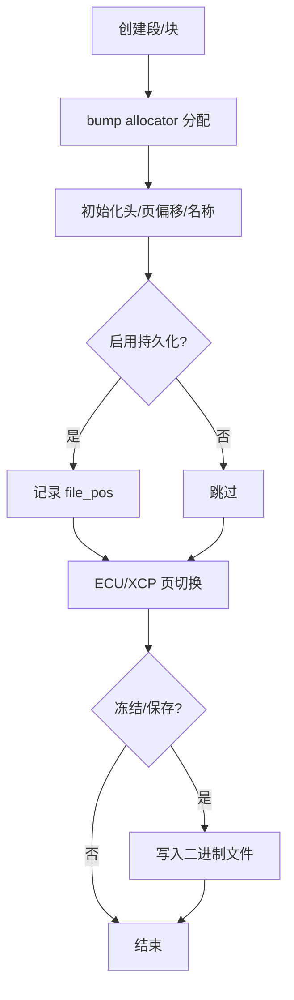
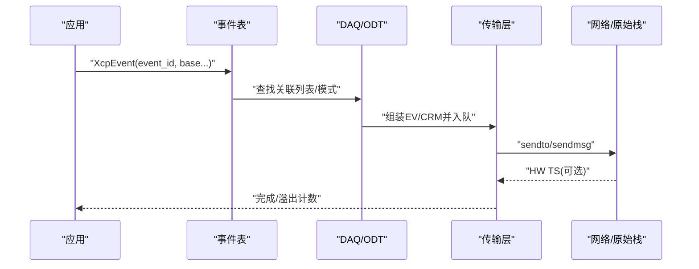
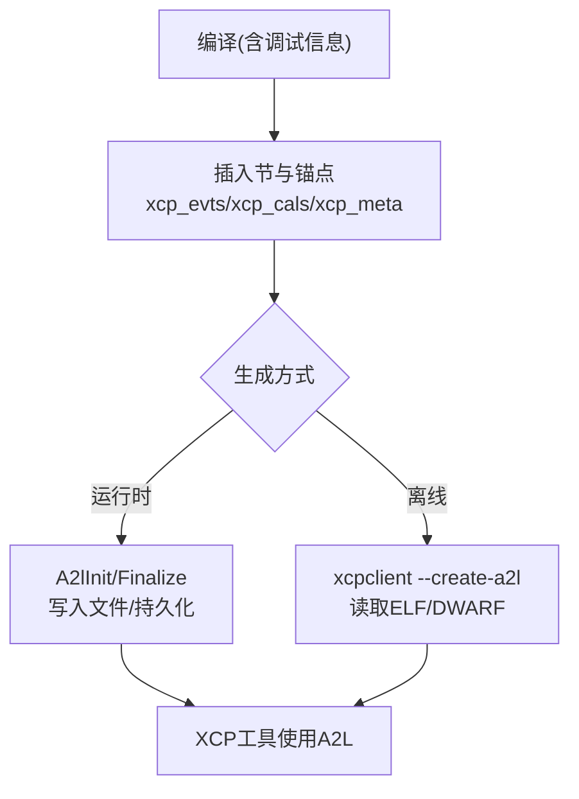
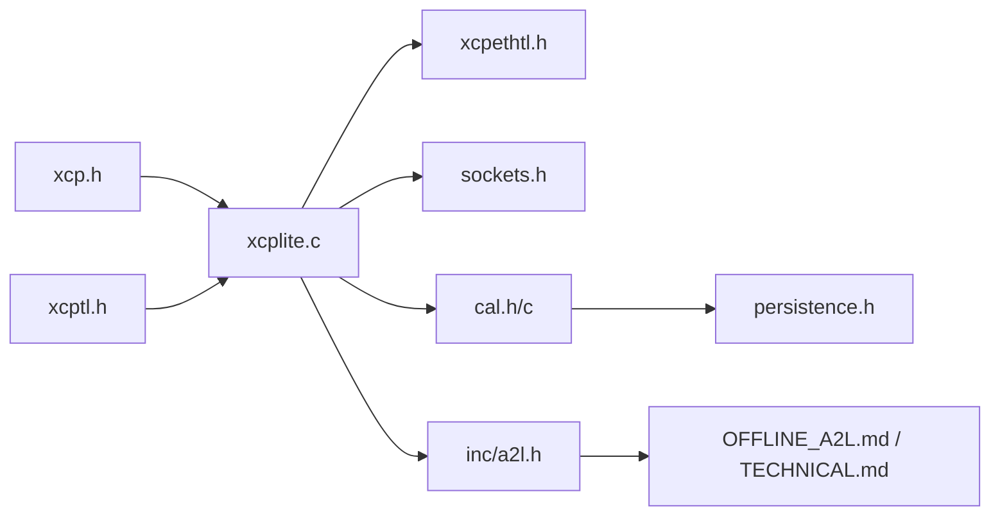

# 核心模块详解

<cite>
**本文引用的文件**
- [src/xcplite.h](file://src/xcplite.h)
- [src/xcplite.c](file://src/xcplite.c)
- [src/xcp.h](file://src/xcp.h)
- [src/xcptl.h](file://src/xcptl.h)
- [src/cal.h](file://src/cal.h)
- [src/cal.c](file://src/cal.c)
- [inc/a2l.h](file://inc/a2l.h)
- [src/persistence.h](file://src/persistence.h)
- [src/sockets.h](file://src/sockets.h)
- [src/socket_raw.c](file://src/socket_raw.c)
- [src/xcpethtl.h](file://src/xcpethtl.h)
- [docs/OFFLINE_A2L.md](file://docs/OFFLINE_A2L.md)
- [docs/TECHNICAL.md](file://docs/TECHNICAL.md)
</cite>

## 目录
1. [简介](#简介)
2. [项目结构](#项目结构)
3. [核心组件](#核心组件)
4. [架构总览](#架构总览)
5. [详细组件分析](#详细组件分析)
6. [依赖关系分析](#依赖关系分析)
7. [性能考量](#性能考量)
8. [故障排查指南](#故障排查指南)
9. [结论](#结论)
10. [附录](#附录)

## 简介
本文件面向高级用户与扩展开发者，深入解析 XCPlite 的核心模块实现，覆盖 XCP 协议层、状态管理、内存管理策略；传输层抽象接口、以太网传输与原始套接字支持；校准段管理（页切换与持久化）；DAQ 事件系统架构、采集流程与性能优化；以及 A2L 生成器的工作原理、元数据处理与离线生成工具使用。文档以代码级视图为主，辅以架构图与时序图，帮助读者快速定位关键实现并指导二次开发。

## 项目结构
XCPlite 采用分层设计：
- 协议层：xcp.h 定义命令/响应/事件等协议常量与格式；xcplite.c/h 实现协议状态机、命令分发、DAQ/CAL 管理、事件触发与后台任务。
- 传输层抽象：xcptl.h 提供统一发送/队列等待接口；具体实现包括以太网服务器 xcpethtl.h 及 sockets.h 的 POSIX/Windows/FreeRTOS 套接字封装，以及 socket_raw.c 的原始以太网栈。
- 校准段管理：cal.h/c 实现段列表、页切换、原子访问、持久化集成。
- 持久化：persistence.h 暴露二进制文件的读写冻结接口。
- A2L 生成：inc/a2l.h 提供运行时与离线生成所需的宏与 API；docs/OFFLINE_A2L.md 与 docs/TECHNICAL.md 描述标记约定与工作机制。

**图表来源**
- [src/xcplite.c:184-195](file://src/xcplite.c#L184-L195)
- [src/xcptl.h:19-25](file://src/xcptl.h#L19-L25)
- [src/xcpethtl.h:24-31](file://src/xcpethtl.h#L24-L31)
- [src/sockets.h:78-379](file://src/sockets.h#L78-L379)
- [src/cal.h:86-175](file://src/cal.h#L86-L175)
- [src/persistence.h:30-46](file://src/persistence.h#L30-L46)
- [inc/a2l.h:644-729](file://inc/a2l.h#L644-L729)

**章节来源**
- [src/xcplite.c:184-195](file://src/xcplite.c#L184-L195)
- [src/xcptl.h:19-25](file://src/xcptl.h#L19-L25)
- [src/xcpethtl.h:24-31](file://src/xcpethtl.h#L24-L31)
- [src/sockets.h:78-379](file://src/sockets.h#L78-L379)
- [src/cal.h:86-175](file://src/cal.h#L86-L175)
- [src/persistence.h:30-46](file://src/persistence.h#L30-L46)
- [inc/a2l.h:644-729](file://inc/a2l.h#L644-L729)

## 核心组件
- XCP 协议层：维护全局 tXcpData 与进程本地 tXcpLocalData，实现连接/会话/资源控制、命令解析、错误码、事件与 DAQ 列表管理、CAL 段操作、时钟同步与 PTP 信息。
- 传输层抽象：通过 xcptl.h 暴露发送 CRM 与等待队列空接口；上层可替换为 TCP/UDP/原始以太网。
- 校准段管理：基于无锁 bump allocator 分配段对象，三段式页模型（默认页/ECU 页/XCP 页），原子字段保证跨进程安全；支持冻结/预加载与持久化。
- DAQ 事件系统：支持链接期/运行期事件注册，事件表与 ODT/DAQ 列表映射，优先级与分频器，时间戳与多播时钟。
- A2L 生成：运行时写入文件与离线 ELF/DWARF 扫描两种路径；通过 xcp_evts/xcp_cals/xcp_meta 等节与 DWARF 作用域锚点完成变量/类型/元数据自动发现。

**章节来源**
- [src/xcplite.h:382-495](file://src/xcplite.h#L382-L495)
- [src/xcp.h:19-183](file://src/xcp.h#L19-L183)
- [src/cal.h:86-175](file://src/cal.h#L86-L175)
- [src/xcptl.h:19-25](file://src/xcptl.h#L19-L25)
- [inc/a2l.h:644-729](file://inc/a2l.h#L644-L729)

## 架构总览
下图展示从应用侧到协议层、传输层与存储的交互路径，涵盖命令处理、DAQ 事件触发与校准段访问。

**图表来源**
- [src/xcplite.c:184-195](file://src/xcplite.c#L184-L195)
- [src/xcptl.h:19-25](file://src/xcptl.h#L19-L25)
- [src/xcpethtl.h:24-31](file://src/xcpethtl.h#L24-L31)
- [src/sockets.h:207-379](file://src/sockets.h#L207-L379)
- [src/cal.h:186-310](file://src/cal.h#L186-L310)
- [src/persistence.h:30-46](file://src/persistence.h#L30-L46)

## 详细组件分析

### XCP 协议层与状态管理
- 全局/共享状态 tXcpData：包含会话状态、响应缓冲、DAQ 列表、事件列表、可选校准段列表等；在 SHM 模式下通过指针指向共享内存，字段需跨进程原子访问。
- 进程本地状态 tXcpLocalData：初始化模式、SHM 角色、MTA 地址、队列句柄、SET_DAQ_PTR 游标、DAQ 起始时钟、互斥量、项目名/EPK、时钟信息等。
- 启动与生命周期：XcpInit 设置模式（LOCAL/SHM/DEACTIVATE/PERSISTENCE），XcpStart 绑定队列并进入主循环，XcpBackgroundTasks 处理非实时后台任务，XcpDeinit 释放资源。
- 命令处理：XcpCommand 接收 CRO，按 xcp.h 定义的 CC_* 分发，填充 CRM 或返回 ERR；支持 Level 1 子命令与 V1.3/V1.4 特性。
- 事件与 DAQ：事件表与 DAQ/ODT 列表映射，支持优先级、分频器、时间戳、PID 关闭、打包模式等；支持 GET_DAQ_CLOCK/MULTICAST。
- 回调机制：ApplXcp* 系列回调用于连接/断开、DAQ 启停、内存访问权限检查、读/写/刷新、时钟获取、ID/文件上传等。

**图表来源**
- [src/xcplite.h:382-495](file://src/xcplite.h#L382-L495)

**章节来源**
- [src/xcplite.h:46-108](file://src/xcplite.h#L46-L108)
- [src/xcplite.h:382-495](file://src/xcplite.h#L382-L495)
- [src/xcp.h:19-183](file://src/xcp.h#L19-L183)
- [src/xcplite.c:184-195](file://src/xcplite.c#L184-L195)

### 传输层抽象与以太网/原始套接字
- 抽象接口：xcptl.h 暴露 XcpTlSendCrm、XcpTlWaitForTransmitQueueEmpty、XcpTlGetCtr，屏蔽底层差异。
- 以太网服务器：xcpethtl.h 提供初始化、命令处理、多播时钟支持；内部复用 sockets.h 的 sendmsg/scatter-gather 与硬件时间戳能力。
- 套接字抽象：sockets.h 统一 POSIX/Windows/FreeRTOS 的 socket 操作，支持 TCP/UDP、多播、硬件时间戳、sendv 向量发送；在 Linux 上 SOCKET_HANDLE 可携带接口元信息用于时间戳。
- 原始以太网：socket_raw.c 在无 OS 网络栈目标上实现自包含 UDP/IPv4 栈，配合 HAL 进行收发；不支持 TCP/多播/向量发送/硬件时间戳。

**图表来源**
- [src/xcptl.h:19-25](file://src/xcptl.h#L19-L25)
- [src/xcpethtl.h:24-31](file://src/xcpethtl.h#L24-L31)
- [src/sockets.h:207-379](file://src/sockets.h#L207-L379)
- [src/socket_raw.c](file://src/socket_raw.c)

**章节来源**
- [src/xcptl.h:19-25](file://src/xcptl.h#L19-L25)
- [src/xcpethtl.h:24-31](file://src/xcpethtl.h#L24-L31)
- [src/sockets.h:78-379](file://src/sockets.h#L78-L379)
- [src/socket_raw.c](file://src/socket_raw.c)

### 校准段管理与页切换、持久化
- 数据结构：tXcpCalSegHeader 固定 64 字节，包含 ECU/XCP 页偏移、free_page、持久化位置、大小、访问标志、名称等；tXcpCalSeg 将头部与可变长度页数据块组合，便于原子访问与跨进程安全。
- 内存池：tXcpCalSegList 使用无锁 bump allocator，atomic_compare_exchange 分配，避免锁竞争；offset[i] 指向第 i 个段的起始偏移。
- 页切换：支持默认页/ECU 页/XCP 页三页模型（绝对寻址）或四页模型（相对寻址含 free swap page）；通过 ApplXcpSetCalPage/GetCalPage 与 XcpCalSegSetCalPage/GetCalPage 协同。
- 持久化：persistence.h 提供 XcpBinWrite/Freeze/Load/Delete；cal.c 在创建/更新时记录 file_pos，冻结时将工作页写入二进制文件，下次启动预加载。
- 线程安全：段列表创建/销毁使用互斥量；段内字段使用原子类型；跨进程共享内存下仅使用偏移而非指针。

**图表来源**
- [src/cal.h:86-175](file://src/cal.h#L86-L175)
- [src/cal.c:99-117](file://src/cal.c#L99-L117)
- [src/persistence.h:30-46](file://src/persistence.h#L30-L46)

**章节来源**
- [src/cal.h:86-175](file://src/cal.h#L86-L175)
- [src/cal.c:99-117](file://src/cal.c#L99-L117)
- [src/persistence.h:30-46](file://src/persistence.h#L30-L46)

### DAQ 事件系统与数据采集流程
- 事件注册：支持链接期（xcp_evts 节）与运行期（XcpCreateEvent/Instance）两种方式；事件表 tXcpEventList 维护周期、优先级、关联 DAQ 列表索引与名称。
- DAQ/ODT 列表：tXcpDaqLists 线性布局包含 DAQ 列表、ODT、地址/尺寸/扩展数组；支持 SET_DAQ_PTR/WRITE_DAQ 动态配置。
- 触发与发送：XcpEvent/Ext/At 系列函数将数据入队并通过传输层发送 EV/CRM；支持时间戳、PID 关闭、打包模式与多播时钟。
- 性能优化：无锁生产者路径、批量发送（sendv）、硬件时间戳、事件优先级与分频器、溢出计数监控。

**图表来源**
- [src/xcplite.h:126-293](file://src/xcplite.h#L126-L293)
- [src/xcplite.h:299-376](file://src/xcplite.h#L299-L376)
- [src/xcptl.h:19-25](file://src/xcptl.h#L19-L25)
- [src/sockets.h:207-379](file://src/sockets.h#L207-L379)

**章节来源**
- [src/xcplite.h:126-293](file://src/xcplite.h#L126-L293)
- [src/xcplite.h:299-376](file://src/xcplite.h#L299-L376)
- [src/xcptl.h:19-25](file://src/xcptl.h#L19-L25)
- [src/sockets.h:207-379](file://src/sockets.h#L207-L379)

### A2L 生成器与元数据处理
- 运行时生成：A2lInit/A2lFinalize 控制写入策略（一次/总是/连接时），支持自动分组、符号前缀、模板输出、嵌入 AML 等；结合 EPK 与持久化确保一致性。
- 离线生成：xcpclient 读取 ELF/DWARF，依据 xcp_evts/xcp_cals/xcp_meta 节与触发锚点 trg__<modes>__name 推导事件、段、变量、类型与元数据；支持过滤、模板、默认事件等。
- 元数据：XCP_UNIT/XCP_LIMITS/XCP_COMMENT/XCP_READ_WRITE 等宏注入 xcp_meta 节，工具匹配后生成 A2L 属性；捕获结构 cap__event 用于寄存器变量的测量。
- 工作流：构建带调试信息 -> 离线/在线生成 A2L -> 使用工具连接目标或导入 A2L；支持上传 ELF 与限制变量范围。

**图表来源**
- [inc/a2l.h:644-729](file://inc/a2l.h#L644-L729)
- [docs/OFFLINE_A2L.md:1-289](file://docs/OFFLINE_A2L.md#L1-L289)
- [docs/TECHNICAL.md:96-200](file://docs/TECHNICAL.md#L96-L200)

**章节来源**
- [inc/a2l.h:644-729](file://inc/a2l.h#L644-L729)
- [docs/OFFLINE_A2L.md:1-289](file://docs/OFFLINE_A2L.md#L1-L289)
- [docs/TECHNICAL.md:96-200](file://docs/TECHNICAL.md#L96-L200)

## 依赖关系分析
- 协议层依赖：xcp.h（协议常量）、xcptl.h（传输抽象）、platform.h（原子/互斥）、queue.h（队列）。
- 传输层依赖：xcpethtl.h（以太网服务器）、sockets.h（平台套接字）、socket_raw.c（原始以太网）。
- 校准与持久化：cal.h/c 依赖 platform.h 与 persistence.h；persistence.h 依赖 xcplib_cfg.h。
- A2L：inc/a2l.h 依赖 xcplib.h 与平台特性；文档说明与 xcpclient 工具链协作。

**图表来源**
- [src/xcplite.c:184-195](file://src/xcplite.c#L184-L195)
- [src/xcptl.h:19-25](file://src/xcptl.h#L19-L25)
- [src/xcpethtl.h:24-31](file://src/xcpethtl.h#L24-L31)
- [src/sockets.h:78-379](file://src/sockets.h#L78-L379)
- [src/cal.h:86-175](file://src/cal.h#L86-L175)
- [src/persistence.h:30-46](file://src/persistence.h#L30-L46)
- [inc/a2l.h:644-729](file://inc/a2l.h#L644-L729)

**章节来源**
- [src/xcplite.c:184-195](file://src/xcplite.c#L184-L195)
- [src/xcptl.h:19-25](file://src/xcptl.h#L19-L25)
- [src/xcpethtl.h:24-31](file://src/xcpethtl.h#L24-L31)
- [src/sockets.h:78-379](file://src/sockets.h#L78-L379)
- [src/cal.h:86-175](file://src/cal.h#L86-L175)
- [src/persistence.h:30-46](file://src/persistence.h#L30-L46)
- [inc/a2l.h:644-729](file://inc/a2l.h#L644-L729)

## 性能考量
- 无锁生产者路径：DAQ 触发与数据传输尽量无锁，降低中断/高频路径开销。
- 批量发送：POSIX 平台使用 sendmsg 向量发送减少系统调用次数。
- 硬件时间戳：Linux 上启用 NIC 驱动时间戳，提升时序精度。
- 事件优先级与分频器：合理设置优先级与 prescaler 平衡负载。
- 内存池：校准段使用 bump allocator，避免频繁分配/释放。
- 队列大小：传输队列应足够大以覆盖预期峰值流量（建议至少 10ms 流量）。

[本节为通用性能指导，不直接分析具体文件]

## 故障排查指南
- 事件未出现：检查是否使用了 DaqCreateEvent/DaqCreateAndTriggerEvent 等宏以注入 xcp_evts 节；确认触发函数未被内联（必要时加 XCP_NOINLINE）。
- 变量缺失：确保局部变量 volatile 或使用捕获宏；检查 DWARF 位置与帧基一致。
- 校准段地址错误：确认构建签名（ACSDD/CASDD/CXSDD）与目标一致；检查默认页静态生命周期。
- 持久化失败：验证 EPK 匹配与文件权限；使用 XcpBinWrite/Freeze 正确冻结工作页。
- 传输异常：检查 socket 错误码与超时设置；原始以太网需配置后端接口；Linux 时间戳需 root 权限。

**章节来源**
- [docs/OFFLINE_A2L.md:85-269](file://docs/OFFLINE_A2L.md#L85-L269)
- [docs/TECHNICAL.md:96-200](file://docs/TECHNICAL.md#L96-L200)
- [src/sockets.h:207-379](file://src/sockets.h#L207-L379)
- [src/persistence.h:30-46](file://src/persistence.h#L30-L46)

## 结论
XCPlite 通过清晰的层次划分与严格的内存/并发设计，提供了高性能的 XCP 协议实现。其传输层抽象使以太网与原始以太网无缝切换；校准段管理以原子与无锁策略保障跨进程安全；DAQ 事件系统兼顾灵活性与低开销；A2L 生成器支持运行时与离线两种路径，极大简化工程集成。高级用户可基于回调与抽象接口扩展功能，如自定义传输、持久化策略与元数据处理。

[本节为总结性内容，不直接分析具体文件]

## 附录
- 参考文档：docs/OFFLINE_A2L.md、docs/TECHNICAL.md 提供标记约定与工作流细节。
- 示例工程：examples 下多种演示（hello_xcp、freertos_demo、no_a2l_demo 等）展示不同配置与用法。
- 工具链：tools/xcpclient 提供离线 A2L 生成与测试执行；tools/shmtool/ptptool 辅助共享内存与 PTP。

[本节为补充信息，不直接分析具体文件]