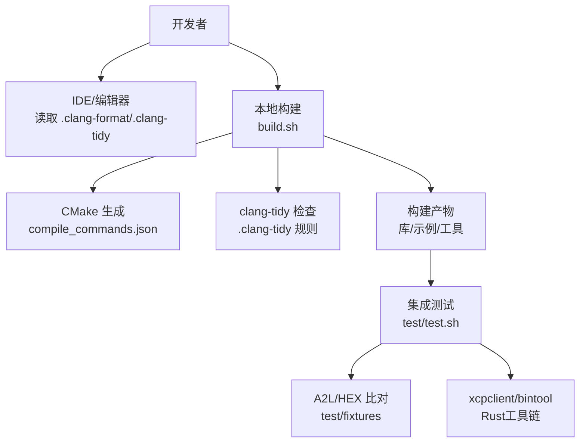
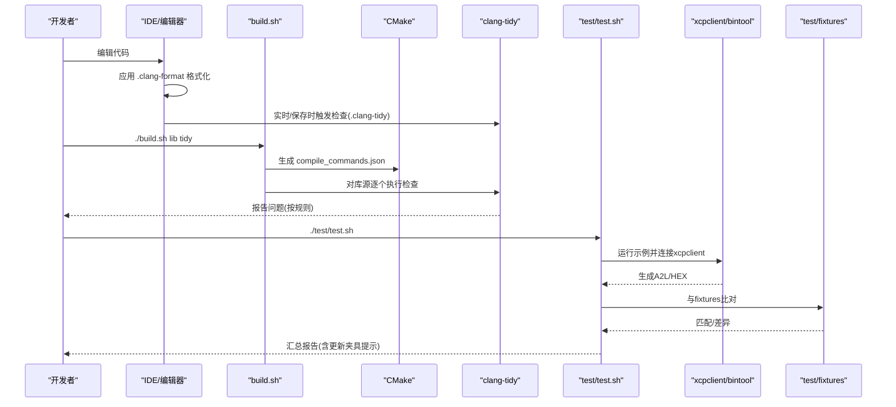
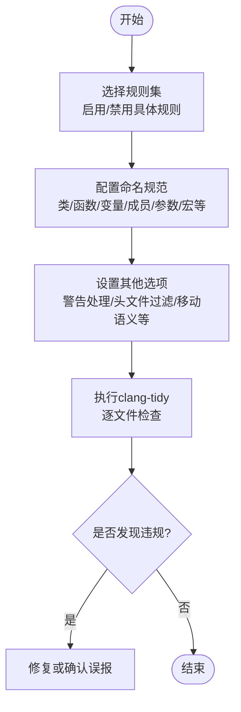
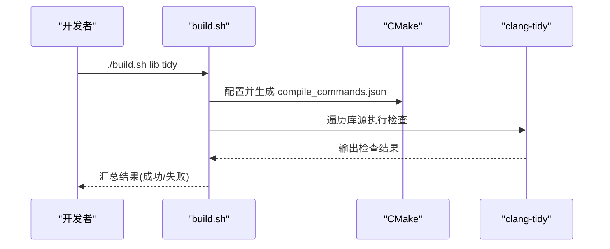
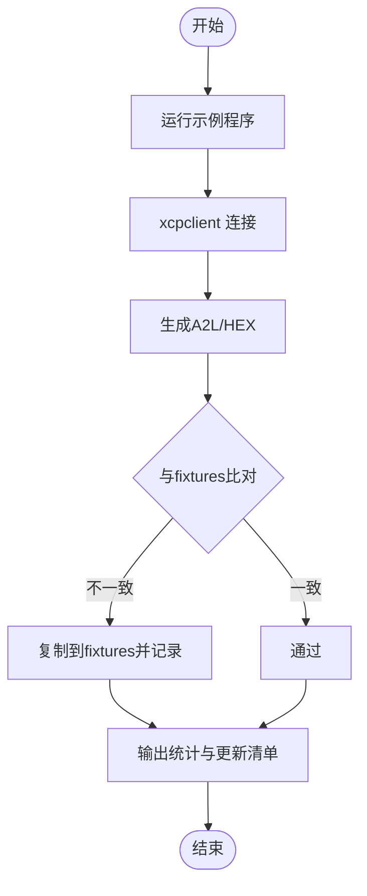
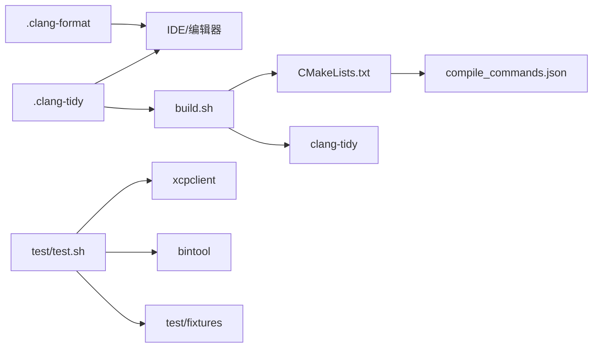

# 代码质量工具

<cite>
**本文引用的文件**
- [.clang-tidy](file://.clang-tidy)
- [.clang-format](file://.clang-format)
- [CMakeLists.txt](file://CMakeLists.txt)
- [build.sh](file://build.sh)
- [test/test.sh](file://test/test.sh)
- [tools/xcpclient/rustfmt.toml](file://tools/xcpclient/rustfmt.toml)
- [docs/BUILDING.md](file://docs/BUILDING.md)
- [README.md](file://README.md)
</cite>

## 目录
1. [简介](#简介)
2. [项目结构](#项目结构)
3. [核心组件](#核心组件)
4. [架构总览](#架构总览)
5. [详细组件分析](#详细组件分析)
6. [依赖关系分析](#依赖关系分析)
7. [性能考虑](#性能考虑)
8. [故障排查指南](#故障排查指南)
9. [结论](#结论)
10. [附录](#附录)

## 简介
本文件面向XCPlite项目的代码质量保证体系，覆盖静态分析、格式化、测试夹具管理、自动化检查与门禁、代码风格与命名约定、常见问题诊断与修复建议、以及性能优化提示。目标是帮助团队在开发、提交与CI流程中统一质量基线，降低回归风险，提升可维护性与协作效率。

## 项目结构
围绕质量工具的相关配置与脚本分布如下：
- 静态分析与格式化：根目录的 .clang-tidy、.clang-format；Rust工具使用 rustfmt.toml
- 构建与质量门禁：根目录 build.sh（封装CMake并支持tidy）、CMakeLists.txt（启用编译命令等）
- 测试与夹具：test/test.sh（示例运行、A2L/HEX比对与夹具更新）、test/fixtures（A2L/HEX基准）
- 文档：docs/BUILDING.md（构建与目标矩阵）、README.md（项目概览）

图示来源
- [build.sh:192-282](file://build.sh#L192-L282)
- [CMakeLists.txt:156-162](file://CMakeLists.txt#L156-L162)
- [.clang-tidy:6-79](file://.clang-tidy#L6-L79)
- [.clang-format:1-10](file://.clang-format#L1-L10)
- [test/test.sh:252-308](file://test/test.sh#L252-L308)
- [test/test.sh:367-500](file://test/test.sh#L367-L500)

章节来源
- [build.sh:192-282](file://build.sh#L192-L282)
- [CMakeLists.txt:156-162](file://CMakeLists.txt#L156-L162)
- [.clang-tidy:6-79](file://.clang-tidy#L6-L79)
- [.clang-format:1-10](file://.clang-format#L1-L10)
- [test/test.sh:252-308](file://test/test.sh#L252-L308)
- [test/test.sh:367-500](file://test/test.sh#L367-L500)

## 核心组件
- clang-tidy 静态分析
  - 规则集：启用诊断、分析器、可读性、易错、现代化、并发、性能、CERT、C++核心准则、HICPP、可移植性等子集，并显式关闭部分过于严格或不适用的规则
  - 命名规范：通过 readability-identifier-naming 配置类/函数/变量/成员/参数/模板/宏等的命名大小写与前缀后缀
  - 其他选项：头文件过滤、警告不视为错误、移动语义相关开关等
- clang-format 代码格式
  - 基于LLVM风格，缩进4空格、列宽180、统一使用空格制表符、语言为Cpp（同时覆盖C/C++）
- Rust 工具格式化
  - tools/xcpclient/rustfmt.toml 定义最大宽度180、Unix换行风格
- 构建与质量门禁
  - build.sh 提供 tidy 模式，自动确保 compile_commands.json 存在并对库源逐一执行 clang-tidy
  - CMakeLists.txt 在顶层开启 CMAKE_EXPORT_COMPILE_COMMANDS，便于IDE与工具链消费
- 测试与夹具管理
  - test/test.sh 负责启动示例、连接xcpclient、生成A2L/HEX并与 fixtures 对比，差异时自动更新并记录变更清单
  - 输出包含统计信息（通过/失败/跳过、HEX/A2L对比结果、更新的夹具列表）

章节来源
- [.clang-tidy:6-135](file://.clang-tidy#L6-L135)
- [.clang-format:1-10](file://.clang-format#L1-L10)
- [tools/xcpclient/rustfmt.toml:1-7](file://tools/xcpclient/rustfmt.toml#L1-L7)
- [build.sh:255-282](file://build.sh#L255-L282)
- [CMakeLists.txt:156-162](file://CMakeLists.txt#L156-L162)
- [test/test.sh:131-159](file://test/test.sh#L131-L159)
- [test/test.sh:252-308](file://test/test.sh#L252-L308)
- [test/test.sh:367-500](file://test/test.sh#L367-L500)
- [test/test.sh:515-600](file://test/test.sh#L515-L600)

## 架构总览
质量工具在开发到CI的流程中的交互如下：

图示来源
- [.clang-format:1-10](file://.clang-format#L1-L10)
- [.clang-tidy:6-79](file://.clang-tidy#L6-L79)
- [build.sh:255-282](file://build.sh#L255-L282)
- [CMakeLists.txt:156-162](file://CMakeLists.txt#L156-L162)
- [test/test.sh:252-308](file://test/test.sh#L252-L308)
- [test/test.sh:367-500](file://test/test.sh#L367-L500)

## 详细组件分析

### clang-tidy 静态分析
- 规则选择策略
  - 采用“白名单+黑名单”方式：先启用一组高质量规则集合，再关闭不适用的项，避免误报过多
  - 启用的主要类别包括：诊断、静态分析、可读性、易错、现代化、并发、性能、CERT、C++核心准则、HICPP、可移植性
- 命名规范（readability-identifier-naming）
  - 类/结构体/枚举/联合：CamelCase
  - 函数/方法：CamelCase
  - 非静态/静态非常量变量与指针：lower_case
  - 静态/全局/constexpr常量：CamelCase + 前缀 k_
  - 成员变量：lower_case + 后缀 _
  - 参数：lower_case
  - 模板参数：CamelCase / 值模板参数任意大小写
  - 命名空间：lower_case
  - 宏定义：UPPER_CASE，忽略特定正则（如头文件保护宏）
  - 类型别名/typedef：CamelCase
- 其他关键选项
  - WarningsAsErrors 为空：警告不直接作为错误退出
  - HeaderFilterRegex 匹配所有头文件：分析包含的头文件（非系统头）
  - vector-noexcept-special-functions：仅包含Swap
  - hicpp-move-const-arg 与 performance-move-const-arg：禁用对平凡可拷贝类型的移动检查

图示来源
- [.clang-tidy:6-79](file://.clang-tidy#L6-L79)
- [.clang-tidy:84-135](file://.clang-tidy#L84-L135)

章节来源
- [.clang-tidy:6-79](file://.clang-tidy#L6-L79)
- [.clang-tidy:84-135](file://.clang-tidy#L84-L135)

### clang-format 代码格式化工具
- 基础风格：基于LLVM
- 缩进与列宽：缩进4空格，列宽180
- 制表符：不使用Tab
- 语言：Cpp（同时覆盖C与C++）
- 团队协作规范建议
  - 提交前统一格式化，IDE保存时自动格式化
  - CI中加入格式检查步骤，防止不一致提交
  - 大型历史代码可分阶段逐步规范化

章节来源
- [.clang-format:1-10](file://.clang-format#L1-L10)

### Rust 工具格式化
- 最大宽度180，Unix换行风格
- 建议在Rust工具目录内使用rustfmt进行格式化与检查

章节来源
- [tools/xcpclient/rustfmt.toml:1-7](file://tools/xcpclient/rustfmt.toml#L1-L7)

### 构建与自动化检查（build.sh）
- 功能要点
  - 支持多配置、多目标（lib/examples/tests/tools/rust_tools/all）
  - 支持 tidy 模式：自动生成 compile_commands.json 并对库源逐一执行 clang-tidy
  - 支持安装库与cargo install工具
- 质量门禁建议
  - 将 ./build.sh lib tidy 加入CI，作为合并前必检项
  - 结合CMake导出编译命令，使IDE与CI保持一致

图示来源
- [build.sh:192-282](file://build.sh#L192-L282)
- [CMakeLists.txt:156-162](file://CMakeLists.txt#L156-L162)

章节来源
- [build.sh:192-282](file://build.sh#L192-L282)
- [CMakeLists.txt:156-162](file://CMakeLists.txt#L156-L162)

### A2L 文件测试夹具管理与版本控制
- 夹具位置：test/fixtures（存放各示例的期望A2L/HEX）
- 运行流程
  - 启动示例进程，等待初始化
  - 使用 xcpclient 连接并触发服务端生成A2L/HEX
  - 将生成的A2L/HEX与 fixtures 中对应文件比对
  - 若不一致，自动复制新文件到 fixtures 并记录更新清单
- 版本控制建议
  - 将 fixtures 纳入版本控制，任何变更需经审查
  - 当行为有意变化时，更新夹具并提交说明
  - 对于时间戳/地址等不稳定字段，应在脚本层面做归一化后再比对（当前脚本已尽量剥离头部信息）

图示来源
- [test/test.sh:252-308](file://test/test.sh#L252-L308)
- [test/test.sh:367-500](file://test/test.sh#L367-L500)
- [test/test.sh:515-600](file://test/test.sh#L515-L600)

章节来源
- [test/test.sh:252-308](file://test/test.sh#L252-L308)
- [test/test.sh:367-500](file://test/test.sh#L367-L500)
- [test/test.sh:515-600](file://test/test.sh#L515-L600)

### 代码审查流程与质量门禁标准
- 建议流程
  - 本地：IDE格式化 + clang-tidy 检查通过
  - 提交：PR/MR 必须通过 CI（构建 + tidy + 测试）
  - 审查：关注规则变更、夹具更新、行为影响
- 门禁标准
  - 构建成功
  - clang-tidy 无新增违规
  - 测试全部通过（示例运行、xcpclient连接、A2L/HEX比对）
  - 夹具变更需附带说明

章节来源
- [build.sh:255-282](file://build.sh#L255-L282)
- [test/test.sh:515-600](file://test/test.sh#L515-L600)

### 代码风格指南、命名约定与最佳实践
- 风格
  - 统一使用 clang-format（LLVM风格，4空格缩进，列宽180）
  - Rust工具遵循 rustfmt.toml（最大宽度180，Unix换行）
- 命名约定（clang-tidy readability-identifier-naming）
  - 类/结构体/枚举/联合：CamelCase
  - 函数/方法：CamelCase
  - 变量：lower_case；成员变量：lower_case_
  - 常量：CamelCase + 前缀 k_
  - 参数：lower_case
  - 命名空间：lower_case
  - 宏：UPPER_CASE（忽略头文件保护宏）
- 最佳实践
  - 提交前运行 ./build.sh lib tidy
  - 修改公共接口或行为时同步更新夹具与文档
  - 保持规则最小化与稳定，避免频繁调整导致噪音

章节来源
- [.clang-format:1-10](file://.clang-format#L1-L10)
- [.clang-tidy:84-135](file://.clang-tidy#L84-L135)
- [tools/xcpclient/rustfmt.toml:1-7](file://tools/xcpclient/rustfmt.toml#L1-L7)

## 依赖关系分析
质量工具之间的依赖关系如下：

图示来源
- [.clang-format:1-10](file://.clang-format#L1-L10)
- [.clang-tidy:6-79](file://.clang-tidy#L6-L79)
- [build.sh:255-282](file://build.sh#L255-L282)
- [CMakeLists.txt:156-162](file://CMakeLists.txt#L156-L162)
- [test/test.sh:252-308](file://test/test.sh#L252-L308)
- [test/test.sh:367-500](file://test/test.sh#L367-L500)

章节来源
- [.clang-format:1-10](file://.clang-format#L1-L10)
- [.clang-tidy:6-79](file://.clang-tidy#L6-L79)
- [build.sh:255-282](file://build.sh#L255-L282)
- [CMakeLists.txt:156-162](file://CMakeLists.txt#L156-L162)
- [test/test.sh:252-308](file://test/test.sh#L252-L308)
- [test/test.sh:367-500](file://test/test.sh#L367-L500)

## 性能考虑
- clang-tidy
  - 仅在必要范围（库源）执行，减少扫描开销
  - 合理关闭不适用规则，降低误报与重排成本
- clang-format
  - 列宽180适合现代显示器与长表达式场景，但需评估团队偏好
- 测试
  - 示例运行超时控制（约2秒），避免阻塞CI
  - HEX/A2L比对仅比较有效内容，忽略头部信息，提高稳定性

[本节为通用指导，无需特定文件引用]

## 故障排查指南
- clang-tidy 未找到
  - 现象：build.sh tidy 报错找不到 clang-tidy
  - 处理：安装 llvm/clang-tidy 并确保PATH正确
- compile_commands.json 缺失
  - 现象：clang-tidy无法解析编译参数
  - 处理：重新配置CMake以生成该文件（build.sh tidy会自动处理）
- 测试失败
  - 现象：xcpclient崩溃或连接失败
  - 处理：查看日志文件，确认端口占用、示例可执行文件权限、网络环境
- 夹具不一致
  - 现象：HEX/A2L与fixtures不同
  - 处理：确认是否为预期变更；若是，脚本会自动更新夹具并列出变更清单；否则定位差异原因

章节来源
- [build.sh:255-282](file://build.sh#L255-L282)
- [test/test.sh:252-308](file://test/test.sh#L252-L308)
- [test/test.sh:367-500](file://test/test.sh#L367-L500)
- [test/test.sh:515-600](file://test/test.sh#L515-L600)

## 结论
本项目已形成较为完整的代码质量保证体系：以clang-tidy与clang-format为核心，配合构建脚本与测试夹具管理，形成从编码到提交的闭环。建议将质量门禁固化到CI，持续维护规则与夹具，确保团队一致性。

[本节为总结性内容，无需特定文件引用]

## 附录
- 快速命令参考
  - 构建并运行静态检查：./build.sh lib tidy
  - 运行示例与测试：./test/test.sh
  - 仅清理构建目录：./build.sh cleanall
- 相关文档
  - 构建与目标矩阵：docs/BUILDING.md
  - 项目概览：README.md

章节来源
- [docs/BUILDING.md:85-170](file://docs/BUILDING.md#L85-L170)
- [README.md:94-110](file://README.md#L94-L110)