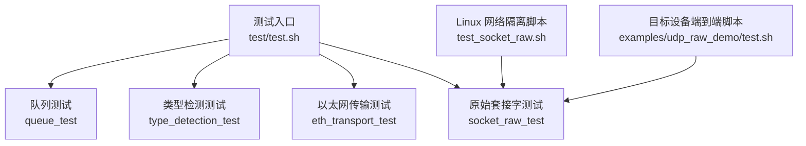
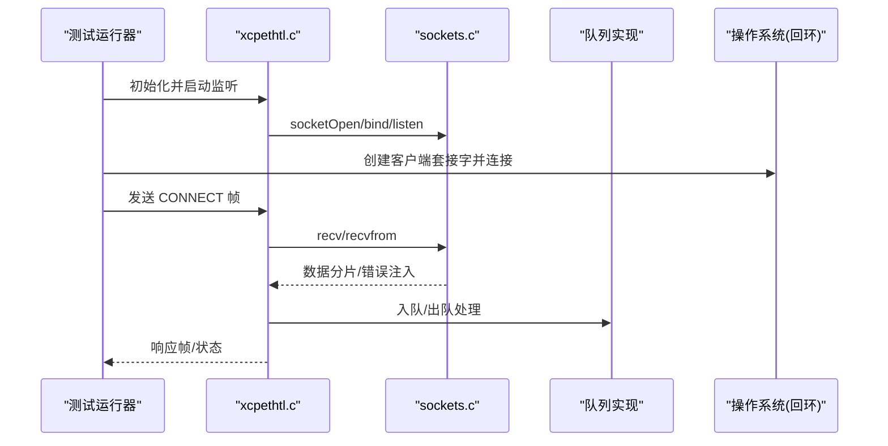
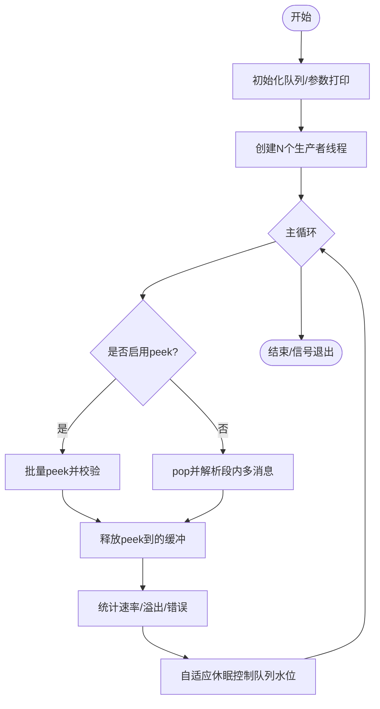
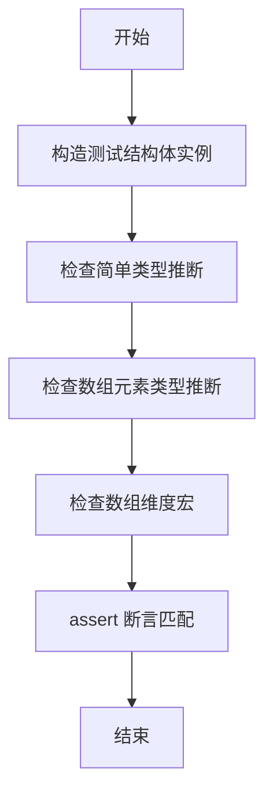
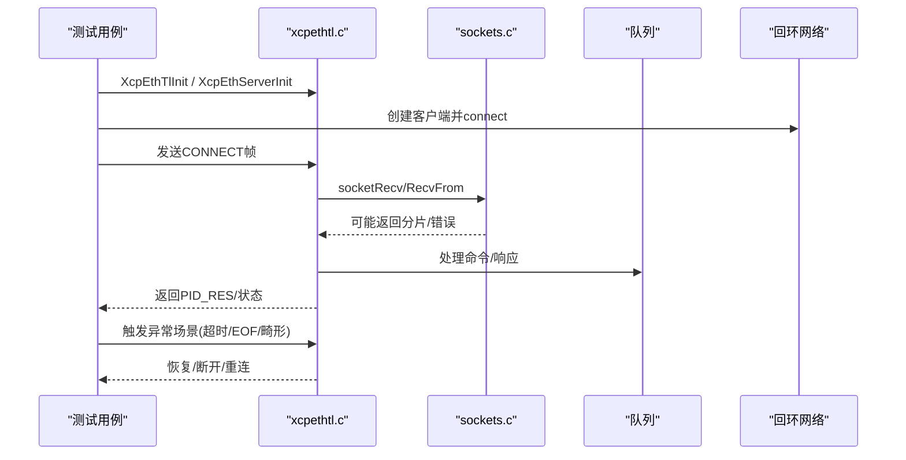
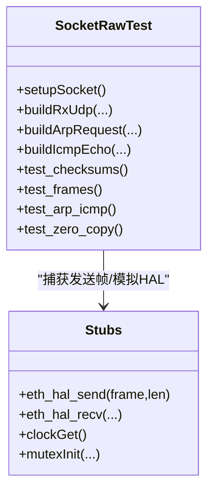
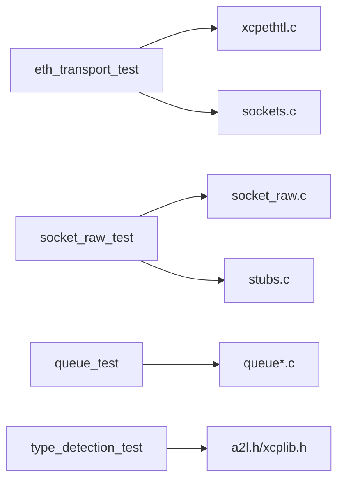

# 单元测试和集成测试

<cite>
**本文引用的文件**
- [test/test.sh](file://test/test.sh)
- [test/queue_test/src/main.c](file://test/queue_test/src/main.c)
- [test/type_detection_test/src/main.c](file://test/type_detection_test/src/main.c)
- [test/type_detection_test/src/c_version_test.c](file://test/type_detection_test/src/c_version_test.c)
- [test/eth_transport_test/src/main.c](file://test/eth_transport_test/src/main.c)
- [test/eth_transport_test/src/socket_recv_test.c](file://test/eth_transport_test/src/socket_recv_test.c)
- [test/socket_raw_test/src/main.c](file://test/socket_raw_test/src/main.c)
- [test/socket_raw_test/src/stubs.c](file://test/socket_raw_test/src/stubs.c)
- [test/test_socket_raw.sh](file://test/test_socket_raw.sh)
- [examples/udp_raw_demo/test.sh](file://examples/udp_raw_demo/test.sh)
</cite>

## 目录
1. [简介](#简介)
2. [项目结构](#项目结构)
3. [核心组件](#核心组件)
4. [架构总览](#架构总览)
5. [详细组件分析](#详细组件分析)
6. [依赖关系分析](#依赖关系分析)
7. [性能与覆盖率](#性能与覆盖率)
8. [故障排查指南](#故障排查指南)
9. [结论](#结论)
10. [附录](#附录)

## 简介
本文件系统性说明 XCPlite 项目的单元测试与集成测试实施方案，覆盖队列测试、类型检测测试、以太网传输测试、原始套接字测试等关键模块。文档阐述测试隔离机制、模拟对象的使用、依赖注入模式、测试数据与环境配置、自动化执行流程，以及断言与常见测试模式。同时给出端到端验证方法与性能基准建议，帮助读者在本地或目标设备上稳定复现并扩展测试。

## 项目结构
XCPlite 的测试位于 test 目录，按功能域组织：
- queue_test：多线程高吞吐队列的并发、溢出、peek/pop 行为与锁竞争统计
- type_detection_test：A2L 类型推断与 C/C++ 类型识别正确性
- eth_transport_test：基于真实回环套接字的 TCP/UDP 命令帧处理、错误恢复与边界条件
- socket_raw_test：纯逻辑的原始以太网收发、校验和、ARP/ICMP 响应、零拷贝发送
- 辅助脚本：test/test.sh（示例集成）、test_socket_raw.sh（Linux 网络命名空间隔离）、examples/udp_raw_demo/test.sh（目标设备端到端）

**图表来源**
- [test/test.sh:131-159](file://test/test.sh#L131-L159)
- [test/test_socket_raw.sh:1-157](file://test/test_socket_raw.sh#L1-L157)
- [examples/udp_raw_demo/test.sh:1-213](file://examples/udp_raw_demo/test.sh#L1-L213)

**章节来源**
- [test/test.sh:131-159](file://test/test.sh#L131-L159)

## 核心组件
- 队列测试：多线程生产者/消费者模型，支持共享内存模式；提供获取锁时间直方图统计；验证消息对齐、计数器连续性、溢出计数与 peek 能力。
- 类型检测测试：通过 A2lGetTypeId 对基础类型、数组元素、二维数组元素进行断言，确保 A2L 生成时类型推断正确。
- 以太网传输测试：直接包含 xcpethtl.c 以注入 socketRecv/socketRecvFrom 钩子，构造畸形帧、超时、EOF、错误码等场景，验证连接建立、状态查询、恢复与流控。
- 原始套接字测试：直接包含 socket_raw.c，使用自定义 HAL stubs.c 捕获发送帧，验证 IPv4/UDP 校验和、帧构建、接收过滤、ARP/ICMP 响应、零拷贝发送路径。

**章节来源**
- [test/queue_test/src/main.c:40-118](file://test/queue_test/src/main.c#L40-L118)
- [test/type_detection_test/src/main.c:14-97](file://test/type_detection_test/src/main.c#L14-L97)
- [test/eth_transport_test/src/main.c:25-34](file://test/eth_transport_test/src/main.c#L25-L34)
- [test/socket_raw_test/src/main.c:1-16](file://test/socket_raw_test/src/main.c#L1-L16)
- [test/socket_raw_test/src/stubs.c:1-64](file://test/socket_raw_test/src/stubs.c#L1-L64)

## 架构总览
测试整体采用“可插拔依赖 + 最小化外部依赖”的策略：
- 单元测试通过 include 源文件的方式将待测实现纳入测试二进制，从而在不修改生产代码的前提下注入钩子或替换函数（如 socketRecv、socketRecvFrom）。
- 针对硬件/系统调用（如以太网 HAL、socket），提供轻量 stubs，仅保留必要接口，便于在无网络环境下验证协议逻辑。
- 集成测试通过真实套接字（回环）或 Linux 网络命名空间隔离环境，验证端到端行为与异常恢复。

**图表来源**
- [test/eth_transport_test/src/main.c:138-160](file://test/eth_transport_test/src/main.c#L138-L160)
- [test/eth_transport_test/src/main.c:194-237](file://test/eth_transport_test/src/main.c#L194-L237)
- [test/eth_transport_test/src/socket_recv_test.c:94-152](file://test/eth_transport_test/src/socket_recv_test.c#L94-L152)

## 详细组件分析

### 队列测试（并发、溢出、锁竞争统计）
- 多线程生产者：每个线程周期性 acquire 缓冲区、填充头部与载荷、push；支持突发写入与过载退避。
- 消费者：支持 peek 与 pop 两种模式；校验消息头、计数器递增、载荷一致性；统计丢包与错误。
- 共享内存模式：可选 --producer/--consumer 分离进程，通过 POSIX SHM 通信；消费者先创建并初始化队列，再发布 PID；生产者轮询存活后附加。
- 锁竞争统计：采集 acquire 锁耗时，输出直方图与均值/最大值，用于评估不同队列实现的同步开销。

**图表来源**
- [test/queue_test/src/main.c:519-563](file://test/queue_test/src/main.c#L519-L563)
- [test/queue_test/src/main.c:592-756](file://test/queue_test/src/main.c#L592-L756)

**章节来源**
- [test/queue_test/src/main.c:40-118](file://test/queue_test/src/main.c#L40-L118)
- [test/queue_test/src/main.c:220-351](file://test/queue_test/src/main.c#L220-L351)
- [test/queue_test/src/main.c:359-435](file://test/queue_test/src/main.c#L359-L435)
- [test/queue_test/src/main.c:519-792](file://test/queue_test/src/main.c#L519-L792)

### 类型检测测试（A2L 类型推断）
- 定义包含多种基本类型与多维数组的结构体实例。
- 对每个字段调用 A2lGetTypeId，并与期望类型枚举对比，使用 assert 断言。
- 对一维/二维数组元素类型进行验证，确保复杂表达式也能正确推导。
- 附带 C 语言版本与编译器信息输出，便于跨平台复现。

**图表来源**
- [test/type_detection_test/src/main.c:14-97](file://test/type_detection_test/src/main.c#L14-L97)
- [test/type_detection_test/src/c_version_test.c:3-66](file://test/type_detection_test/src/c_version_test.c#L3-L66)

**章节来源**
- [test/type_detection_test/src/main.c:14-97](file://test/type_detection_test/src/main.c#L14-L97)
- [test/type_detection_test/src/c_version_test.c:3-66](file://test/type_detection_test/src/c_version_test.c#L3-L66)

### 以太网传输测试（TCP/UDP 命令帧与错误恢复）
- 通过 #define socketRecv/RecvFrom 为 checked_* 包装，注入错误与只读头部场景。
- 直接 include xcpethtl.c，使测试能访问内部全局状态（如监听端口、连接状态）。
- 用例覆盖：
  - TCP：超大帧拒绝、无效长度、负载超时、空闲超时、部分帧、EOF 与陈旧错误、accept 失败、流式分段、服务端恢复。
  - UDP：畸形报文丢弃、超大报文丢弃、其他对端干扰、接收错误分类、服务端恢复。
- 使用 CHECK 宏统一失败退出，保证测试稳定性。

**图表来源**
- [test/eth_transport_test/src/main.c:25-34](file://test/eth_transport_test/src/main.c#L25-L34)
- [test/eth_transport_test/src/main.c:138-160](file://test/eth_transport_test/src/main.c#L138-L160)
- [test/eth_transport_test/src/main.c:194-237](file://test/eth_transport_test/src/main.c#L194-L237)
- [test/eth_transport_test/src/main.c:253-339](file://test/eth_transport_test/src/main.c#L253-L339)
- [test/eth_transport_test/src/main.c:474-561](file://test/eth_transport_test/src/main.c#L474-L561)
- [test/eth_transport_test/src/main.c:594-653](file://test/eth_transport_test/src/main.c#L594-L653)

**章节来源**
- [test/eth_transport_test/src/main.c:25-34](file://test/eth_transport_test/src/main.c#L25-L34)
- [test/eth_transport_test/src/main.c:138-160](file://test/eth_transport_test/src/main.c#L138-L160)
- [test/eth_transport_test/src/main.c:194-237](file://test/eth_transport_test/src/main.c#L194-L237)
- [test/eth_transport_test/src/main.c:253-339](file://test/eth_transport_test/src/main.c#L253-L339)
- [test/eth_transport_test/src/main.c:474-561](file://test/eth_transport_test/src/main.c#L474-L561)
- [test/eth_transport_test/src/main.c:594-653](file://test/eth_transport_test/src/main.c#L594-L653)
- [test/eth_transport_test/src/socket_recv_test.c:94-152](file://test/eth_transport_test/src/socket_recv_test.c#L94-L152)

### 原始套接字测试（校验和、帧构建、ARP/ICMP、零拷贝）
- 直接 include socket_raw.c，配合 src/stubs.c 提供的 fake Ethernet HAL，捕获发送帧而不真正发往网卡。
- 校验和与线格式：使用 RFC 参考向量验证 IPv4 校验和计算与结构体打包。
- 帧构建与接收过滤：构造合法/非法帧，验证端口、MAC/IP 过滤、分片丢弃、超大帧丢弃、VLAN 标签丢弃。
- ARP/ICMP 响应：对 ARP Request 回复、忽略非本机 IP 请求与未请求 Reply；对 ICMP Echo Request 回复并校验载荷与长度。
- 零拷贝发送：当配置允许时，验证 headroom 布局、右对齐写头、不复制载荷、与拷贝路径生成相同帧。

**图表来源**
- [test/socket_raw_test/src/main.c:51-85](file://test/socket_raw_test/src/main.c#L51-L85)
- [test/socket_raw_test/src/main.c:136-177](file://test/socket_raw_test/src/main.c#L136-L177)
- [test/socket_raw_test/src/main.c:182-288](file://test/socket_raw_test/src/main.c#L182-L288)
- [test/socket_raw_test/src/main.c:293-356](file://test/socket_raw_test/src/main.c#L293-L356)
- [test/socket_raw_test/src/main.c:374-441](file://test/socket_raw_test/src/main.c#L374-L441)
- [test/socket_raw_test/src/stubs.c:34-64](file://test/socket_raw_test/src/stubs.c#L34-L64)

**章节来源**
- [test/socket_raw_test/src/main.c:1-16](file://test/socket_raw_test/src/main.c#L1-L16)
- [test/socket_raw_test/src/main.c:136-177](file://test/socket_raw_test/src/main.c#L136-L177)
- [test/socket_raw_test/src/main.c:182-288](file://test/socket_raw_test/src/main.c#L182-L288)
- [test/socket_raw_test/src/main.c:293-356](file://test/socket_raw_test/src/main.c#L293-L356)
- [test/socket_raw_test/src/main.c:374-441](file://test/socket_raw_test/src/main.c#L374-L441)
- [test/socket_raw_test/src/stubs.c:1-64](file://test/socket_raw_test/src/stubs.c#L1-L64)

### 集成测试与端到端验证
- 示例集成测试（test/test.sh）：
  - 自动发现已构建的可执行示例，逐个启动并等待初始化。
  - 若存在 xcpclient，则根据示例协议（TCP/UDP）发起连接，验证连通性与 A2L 生成。
  - 收集生成的 .bin/.hex 与 .a2l 文件，与 fixtures 比对，差异时提示并更新 fixture。
  - 汇总通过/失败/跳过统计，记录日志。
- 原始以太网端到端（test_socket_raw.sh）：
  - 在 Linux 上创建网络命名空间与 veth 对，目标侧无内核 IP，由 socket_raw.c 接管。
  - 启动 udp_raw_demo，验证 ARP、ICMP Echo、XCP CONNECT 响应。
- 目标设备端到端（examples/udp_raw_demo/test.sh）：
  - 通过 rsync/ssh 同步源码到目标，远程构建并赋予 raw 权限。
  - 启动目标程序，等待就绪后使用 xcpclient 上传 A2L、列举测量/标定项，执行短时测量。

**章节来源**
- [test/test.sh:206-341](file://test/test.sh#L206-L341)
- [test/test.sh:367-500](file://test/test.sh#L367-L500)
- [test/test.sh:508-600](file://test/test.sh#L508-L600)
- [test/test_socket_raw.sh:1-157](file://test/test_socket_raw.sh#L1-L157)
- [examples/udp_raw_demo/test.sh:1-213](file://examples/udp_raw_demo/test.sh#L1-L213)

## 依赖关系分析
- 测试与实现耦合方式：
  - 以太网传输测试通过 #define 替换 socketRecv/RecvFrom，并在 include 前设置 expect_header_only/receive_error 等状态，达到“依赖注入”的效果，无需改动生产代码。
  - 原始套接字测试通过 include socket_raw.c，并使用 stubs.c 提供 eth_hal_* 接口，屏蔽真实网卡依赖。
- 外部依赖：
  - 集成测试依赖 xcpclient、bintool、a2ltool 等工具链。
  - 原始以太网测试依赖 Linux 网络命名空间与 root 权限。
- 潜在循环依赖：
  - 测试通过 include 实现文件，避免头文件循环；但需注意编译单元顺序与宏作用域（如 #undef 清理）。

**图表来源**
- [test/eth_transport_test/src/main.c:25-34](file://test/eth_transport_test/src/main.c#L25-L34)
- [test/eth_transport_test/src/socket_recv_test.c:14-35](file://test/eth_transport_test/src/socket_recv_test.c#L14-L35)
- [test/socket_raw_test/src/main.c:1-16](file://test/socket_raw_test/src/main.c#L1-L16)
- [test/socket_raw_test/src/stubs.c:1-64](file://test/socket_raw_test/src/stubs.c#L1-L64)

**章节来源**
- [test/eth_transport_test/src/main.c:25-34](file://test/eth_transport_test/src/main.c#L25-L34)
- [test/eth_transport_test/src/socket_recv_test.c:14-35](file://test/eth_transport_test/src/socket_recv_test.c#L14-L35)
- [test/socket_raw_test/src/main.c:1-16](file://test/socket_raw_test/src/main.c#L1-L16)
- [test/socket_raw_test/src/stubs.c:1-64](file://test/socket_raw_test/src/stubs.c#L1-L64)

## 性能与覆盖率
- 性能基准：
  - 队列测试提供锁竞争时间直方图与采样率调节，可用于比较不同队列实现与参数下的延迟分布与吞吐。
  - 以太网传输测试覆盖 TCP 流式分段与 UDP 分片读取，有助于定位网络栈与协议层瓶颈。
- 覆盖率收集与分析：
  - 仓库中未发现显式的 gcov/lcov 配置或覆盖率脚本。建议在 CI 中为各测试目标开启编译期覆盖率选项（如 -fprofile-arcs -ftest-coverage），并在运行后生成覆盖率报告，重点关注：
    - 代码覆盖率：行覆盖率、函数覆盖率
    - 分支覆盖率：条件分支、错误路径（如 UDP 畸形帧、TCP EOF、接收错误）
  - 结合队列测试的锁计时与以太网测试的错误注入，可针对性提升关键路径的分支覆盖率。

[本节为通用指导，不直接分析具体文件]

## 故障排查指南
- 以太网传输测试常见问题：
  - 连接失败：检查回环地址绑定、端口占用、超时设置；确认 setup/teardown 成对调用。
  - 畸形帧被丢弃：确认 expect_udp_drop 与 receive_error 注入点；核对帧长度与载荷一致性。
  - 服务端恢复：验证在 accept/recv 失败后，服务仍可接受新连接。
- 原始套接字测试常见问题：
  - 校验和不匹配：检查 IPv4/UDP 头字段字节序与 checksum 计算路径。
  - 帧被丢弃：确认目的 MAC/IP、端口、分片标志位与 VLAN 标签是否符合预期。
  - 零拷贝路径：验证 headroom 布局与右对齐写头，确保与拷贝路径生成一致帧。
- 队列测试常见问题：
  - 溢出与丢包：调整消费者休眠时间与 burst size，观察队列水位变化。
  - 锁竞争高：关注直方图长尾，考虑优化临界区或队列实现。

**章节来源**
- [test/eth_transport_test/src/main.c:253-339](file://test/eth_transport_test/src/main.c#L253-L339)
- [test/eth_transport_test/src/main.c:474-561](file://test/eth_transport_test/src/main.c#L474-L561)
- [test/socket_raw_test/src/main.c:136-177](file://test/socket_raw_test/src/main.c#L136-L177)
- [test/socket_raw_test/src/main.c:182-288](file://test/socket_raw_test/src/main.c#L182-L288)
- [test/queue_test/src/main.c:105-211](file://test/queue_test/src/main.c#L105-L211)

## 结论
XCPlite 的测试体系围绕“可插拔依赖、最小外部依赖、强断言与回归用例”展开：
- 单元测试通过 include 实现与 stubs 隔离系统依赖，聚焦协议与算法正确性。
- 集成测试利用真实套接字与网络命名空间，覆盖端到端交互与异常恢复。
- 队列测试提供性能与锁竞争洞察，类型检测测试保障 A2L 生成质量。
- 建议引入覆盖率收集与持续集成，进一步提升健壮性与可维护性。

[本节为总结性内容，不直接分析具体文件]

## 附录
- 测试执行要点：
  - 本地示例集成：运行 test/test.sh，可选择 clean 与指定示例；需预先构建并安装 xcpclient/bintool/a2ltool。
  - 原始以太网测试：在 Linux 下以 root 运行 test/test_socket_raw.sh，验证 ARP/ICMP/XCP。
  - 目标设备端到端：使用 examples/udp_raw_demo/test.sh 同步、构建、授权并执行测量。
- 断言与模式：
  - 使用 assert 与自定义 CHECK 宏进行强断言，失败即终止测试。
  - 常见模式：fixture 初始化/清理、错误注入、边界值遍历、随机化参数（如 payload 大小）。

**章节来源**
- [test/test.sh:206-341](file://test/test.sh#L206-L341)
- [test/test_socket_raw.sh:1-157](file://test/test_socket_raw.sh#L1-L157)
- [examples/udp_raw_demo/test.sh:1-213](file://examples/udp_raw_demo/test.sh#L1-L213)
- [test/eth_transport_test/src/main.c:43-50](file://test/eth_transport_test/src/main.c#L43-L50)
- [test/eth_transport_test/src/socket_recv_test.c:43-50](file://test/eth_transport_test/src/socket_recv_test.c#L43-L50)