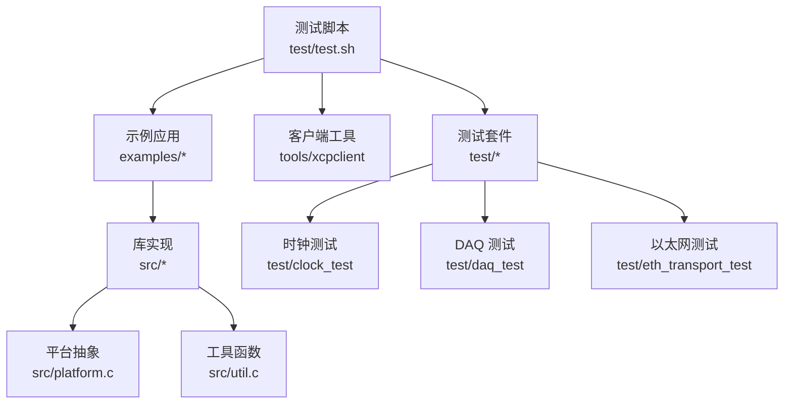
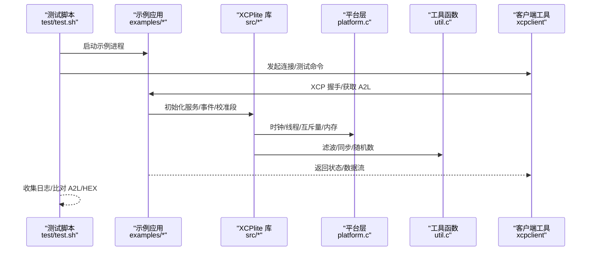
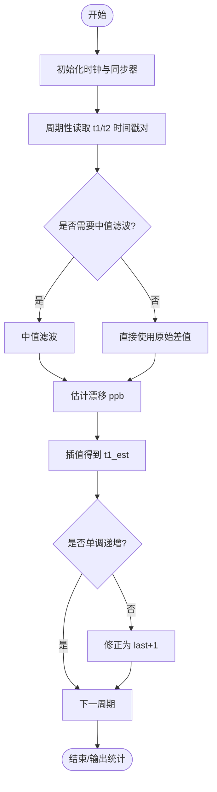
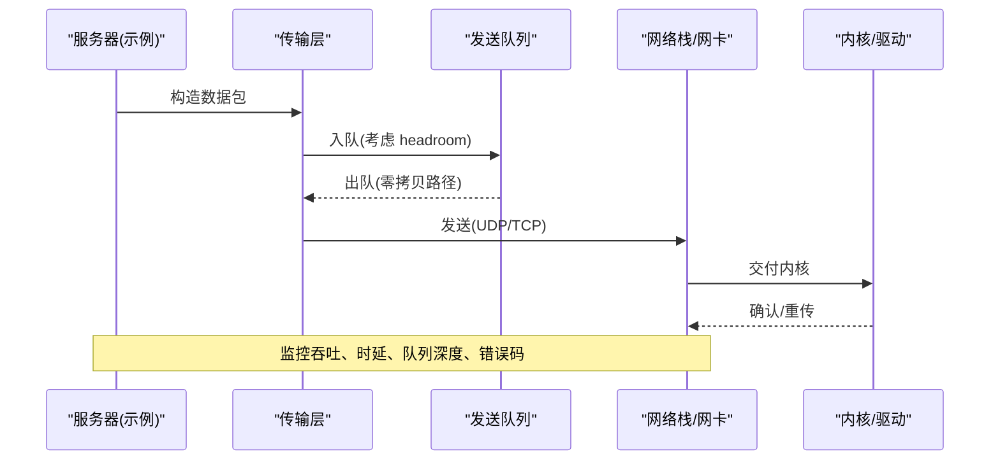
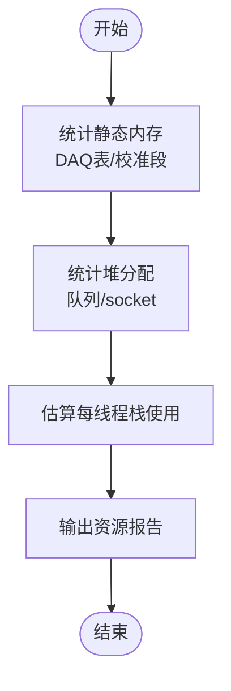
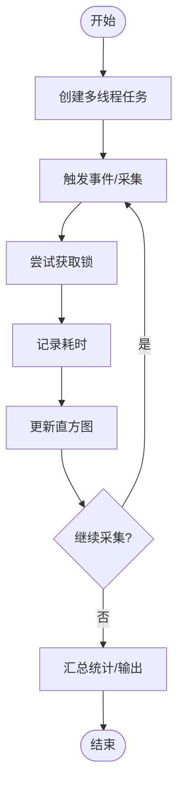
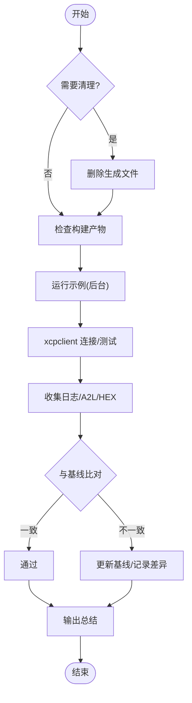
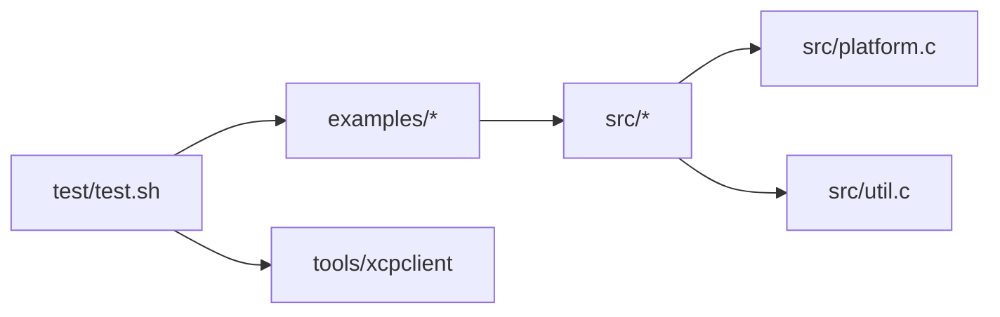

# 性能测试和基准测试

<cite>
**本文引用的文件**
- [README.md](file://README.md)
- [TECHNICAL.md](file://docs/TECHNICAL.md)
- [platform.c](file://src/platform.c)
- [util.c](file://src/util.c)
- [test.sh](file://test/test.sh)
- [clock_test/README.md](file://test/clock_test/README.md)
- [daq_test/README.md](file://test/daq_test/README.md)
- [cmp_demo/README.md](file://examples/cmp_demo/README.md)
</cite>

## 目录
1. [简介](#简介)
2. [项目结构](#项目结构)
3. [核心组件](#核心组件)
4. [架构总览](#架构总览)
5. [详细组件分析](#详细组件分析)
6. [依赖关系分析](#依赖关系分析)
7. [性能考量](#性能考量)
8. [故障排查指南](#故障排查指南)
9. [结论](#结论)
10. [附录](#附录)

## 简介
本指南面向在 XCPlite 工程中进行性能测试与基准测试的工程师，覆盖时钟精度测试、网络传输性能测试、内存使用分析等关键指标的测量方法；说明如何搭建测试环境、生成测试负载、统计与分析测试结果；提供瓶颈识别、热点分析与优化策略；介绍基准测试框架的使用、用例设计与结果对比；并给出性能回归检测、趋势分析与告警机制的建议。同时结合仓库中的示例与工具，给出可操作的实践路径。

## 项目结构
XCPlite 提供了丰富的示例与测试套件，便于开展端到端的性能验证：
- 示例应用：涵盖 TCP/UDP 传输、多线程采集、点云数据、PTP 时间同步、eBPF 系统调用追踪等场景
- 测试脚本：统一的自动化测试流程，支持构建、运行、日志收集、A2L/HEX 比对与汇总
- 专用测试：时钟漂移/抖动模拟、DAQ 吞吐与锁竞争直方图、以太网接收路径测试
- 工具链：xcpclient（连接与测试）、bintool（二进制转 HEX）、a2ltool（A2L 处理）

图表来源
- [test.sh:131-178](file://test/test.sh#L131-L178)
- [README.md:55-76](file://README.md#L55-L76)

章节来源
- [README.md:55-76](file://README.md#L55-L76)
- [test.sh:131-178](file://test/test.sh#L131-L178)

## 核心组件
- 平台时钟与计时
  - 多平台时钟实现（FreeRTOS/POSIX/Windows），支持纳秒/微秒分辨率与单调时钟
  - 提供 last-value 缓存以减少系统调用开销
- 时钟同步器与滤波
  - 轻量级时钟同步器，支持两点估计与 PI 控制模式，内置中值滤波抑制异常对漂移估计的影响
  - 平均滤波、线性回归滤波用于趋势与偏差分析
- 测试与基准
  - 统一测试脚本驱动示例与客户端工具，自动完成连接、A2L/HEX 比对与结果汇总
  - 专用测试：时钟漂移/抖动注入、DAQ 锁竞争直方图、以太网接收路径测试
- 网络传输与 MTU 约束
  - 通过 CMP 隧道演示了外层封装带来的 MTU 预算限制与分片规避策略

章节来源
- [platform.c:435-655](file://src/platform.c#L435-L655)
- [util.c:503-740](file://src/util.c#L503-L740)
- [test.sh:206-340](file://test/test.sh#L206-L340)
- [cmp_demo/README.md:150-180](file://examples/cmp_demo/README.md#L150-L180)

## 架构总览
下图展示了从测试脚本到示例应用、再到库与平台层的调用关系，以及关键性能指标（时钟、吞吐、内存）的观测点。

图表来源
- [test.sh:206-340](file://test/test.sh#L206-L340)
- [platform.c:435-655](file://src/platform.c#L435-L655)
- [util.c:503-740](file://src/util.c#L503-L740)

## 详细组件分析

### 时钟精度测试
目标：评估系统单调时钟/实时时钟的分辨率、稳定性与可预测性，验证 DAQ 时间戳质量。

- 环境与准备
  - 选择 POSIX 或 FreeRTOS 时钟源，配置 CLOCK_TICKS_PER_S（ns/us）
  - 启用可选统计开关以记录 clockGet 调用次数
- 测试方法
  - 读取单调时钟序列，计算相邻差值的分布（均值、方差、长尾）
  - 注入偏移、漂移与抖动，观察下游时间轴是否保持单调且稳定
  - 使用时钟同步器将硬件/软件时间戳对齐，评估插值误差
- 观测指标
  - 分辨率（最小可分辨间隔）
  - 抖动（标准差/百分位）
  - 漂移（ppb 估计）
  - 单调性违反次数
- 参考实现
  - 平台时钟接口与 last-value 缓存
  - 时钟同步器（默认两点估计与 PI 模式）
  - 中值滤波抑制异常值

图表来源
- [platform.c:505-655](file://src/platform.c#L505-L655)
- [util.c:561-740](file://src/util.c#L561-L740)

章节来源
- [platform.c:435-655](file://src/platform.c#L435-L655)
- [util.c:503-740](file://src/util.c#L503-L740)
- [clock_test/README.md:1-18](file://test/clock_test/README.md#L1-L18)

### 网络传输性能测试
目标：评估 XCP over Ethernet（TCP/UDP）吞吐、延迟与丢包影响，验证 MTU 与分片策略。

- 测试方法
  - 使用 xcpclient 连接示例应用，开启高吞吐 DAQ 流
  - 调整队列大小、MTU、Jumbo Frame 等参数，观察吞吐与 CPU 占用
  - 在 CMP 隧道场景中，注意外层封装导致的 MTU 预算缩减
- 观测指标
  - 吞吐（MB/s）、时延分布（P50/P95/P99）
  - 队列长度与溢出率
  - MTU 超限错误计数
- 参考实现
  - 测试脚本自动启动示例与客户端，收集 A2L/HEX 与日志
  - CMP 文档明确 MTU 预算与最大内帧尺寸

图表来源
- [test.sh:206-340](file://test/test.sh#L206-L340)
- [cmp_demo/README.md:150-180](file://examples/cmp_demo/README.md#L150-L180)

章节来源
- [test.sh:206-340](file://test/test.sh#L206-L340)
- [cmp_demo/README.md:150-180](file://examples/cmp_demo/README.md#L150-L180)

### 内存使用分析
目标：量化静态/堆/栈内存消耗，评估队列与 DAQ 表、校准段页面对资源的影响。

- 分析方法
  - 统计静态内存（DAQ 表、校准段页）
  - 监控堆分配（发送队列、socket 抽象）
  - 估算每线程栈使用（收发线程）
- 参考依据
  - 技术文档给出 hello_xcp 示例的静态/堆/栈估算
  - 平台层共享内存与映射接口可用于跨进程场景

图表来源
- [TECHNICAL.md:5-24](file://docs/TECHNICAL.md#L5-L24)
- [platform.c:161-363](file://src/platform.c#L161-L363)

章节来源
- [TECHNICAL.md:5-24](file://docs/TECHNICAL.md#L5-L24)
- [platform.c:161-363](file://src/platform.c#L161-L363)

### DAQ 锁竞争与时序直方图
目标：在高并发下评估生产者侧锁获取时间的分布，定位热点与尾部延迟。

- 测试方法
  - 使用 daq_test 示例，创建多线程任务，产生不同采样率与时间扰动
  - 统计锁获取时间的直方图与分位数
- 观测指标
  - 平均/最大锁时间
  - 各区间占比（例如 0-10ns、10-20ns、…）
- 参考实现
  - daq_test README 提供典型输出与解读方式

图表来源
- [daq_test/README.md:1-142](file://test/daq_test/README.md#L1-L142)

章节来源
- [daq_test/README.md:1-142](file://test/daq_test/README.md#L1-L142)

### 基准测试框架与用例设计
- 统一入口
  - test/test.sh 负责清理、构建、运行示例、连接客户端、收集日志、比对 A2L/HEX 并输出总结
- 用例组织
  - 按协议区分 TCP/UDP 示例，自动选择参数
  - 支持指定单一示例或全量执行
- 结果对比
  - 自动生成 HEX/A2L 并与 fixtures 比对，差异时提示并更新基线
- 扩展建议
  - 增加性能指标采集（吞吐、时延、CPU、内存）并写入结构化日志
  - 引入阈值判定与失败快速退出

图表来源
- [test.sh:63-127](file://test/test.sh#L63-L127)
- [test.sh:206-340](file://test/test.sh#L206-L340)
- [test.sh:455-500](file://test/test.sh#L455-L500)

章节来源
- [test.sh:63-127](file://test/test.sh#L63-L127)
- [test.sh:206-340](file://test/test.sh#L206-L340)
- [test.sh:455-500](file://test/test.sh#L455-L500)

## 依赖关系分析
- 组件耦合
  - 测试脚本依赖示例与客户端工具；示例依赖库；库依赖平台抽象与工具函数
- 外部依赖
  - 操作系统时钟/线程/内存接口
  - 网络栈与网卡驱动
  - CANape 等第三方工具（可选）
- 潜在循环依赖
  - 无直接循环；通过 HAL/回调解耦后端实现

图表来源
- [test.sh:131-178](file://test/test.sh#L131-L178)
- [README.md:55-76](file://README.md#L55-L76)

章节来源
- [test.sh:131-178](file://test/test.sh#L131-L178)
- [README.md:55-76](file://README.md#L55-L76)

## 性能考量
- 时钟与时间戳
  - 优先使用单调时钟减少跳变；必要时用 PTP/外部时钟源
  - 利用 last-value 缓存降低高频调用成本
- 队列与缓冲
  - 发送队列需足够大以覆盖预期峰值流量（如至少 10ms 流量）
  - 合理设置 MTU，避免分片与超大帧导致错误
- 锁与并发
  - 关注生产者侧锁竞争；在高并发下观察直方图尾部
  - 尽量采用无锁或细粒度锁，减少临界区
- 内存与零拷贝
  - 尽量使用零拷贝路径，减少复制与序列化
  - 预分配静态内存，避免运行时频繁分配
- 网络路径
  - 在 CMP 隧道场景注意外层封装开销与 MTU 预算
  - 监控内核/驱动层面的丢包与重传

[本节为通用指导，不直接分析具体文件]

## 故障排查指南
- 常见问题
  - 端口占用：测试前杀掉旧进程，释放端口
  - A2L/HEX 不一致：检查版本/地址变化，必要时更新 fixtures
  - 超时/崩溃：捕获退出码与日志，定位 xcpclient 或示例进程问题
- 诊断步骤
  - 查看 test_all.log 或单个示例日志
  - 使用 bintool/a2ltool 解析二进制与描述文件
  - 针对时钟问题，检查单调性与漂移估计
- 参考位置
  - 测试脚本的错误处理与汇总逻辑
  - 平台层错误打印与资源管理

章节来源
- [test.sh:237-340](file://test/test.sh#L237-L340)
- [test.sh:515-600](file://test/test.sh#L515-L600)
- [platform.c:161-363](file://src/platform.c#L161-L363)

## 结论
通过仓库提供的测试脚本、示例与工具，可以系统化地实施时钟精度、网络吞吐与内存使用的性能测试与基准测试。结合时钟同步器与滤波算法，能够稳健地评估时间轴质量；借助统一测试流程，可实现回归检测与基线对比；通过对锁竞争、队列与 MTU 的分析，定位并优化性能瓶颈。建议在 CI 中集成上述流程，持续跟踪趋势并设置告警阈值。

[本节为总结，不直接分析具体文件]

## 附录
- 快速开始
  - 构建所有示例并运行：参考根目录构建说明
  - 仅运行特定示例：使用测试脚本参数
- 常用命令
  - 连接与测试：xcpclient --udp/--tcp
  - 上传 A2L：xcpclient --upload-a2l
  - 解析二进制：bintool --dump/--hex
- 参考文档
  - 技术细节与资源消耗
  - 各示例与工具的 README

[本节为补充信息，不直接分析具体文件]