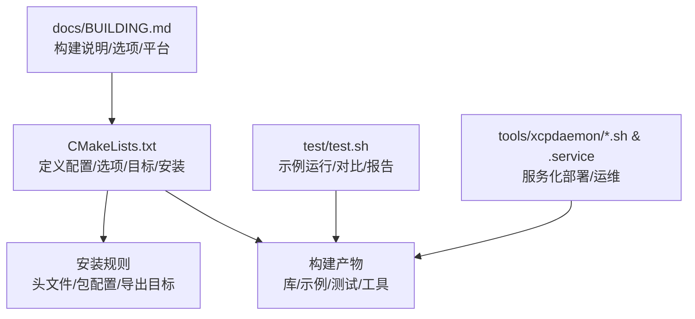
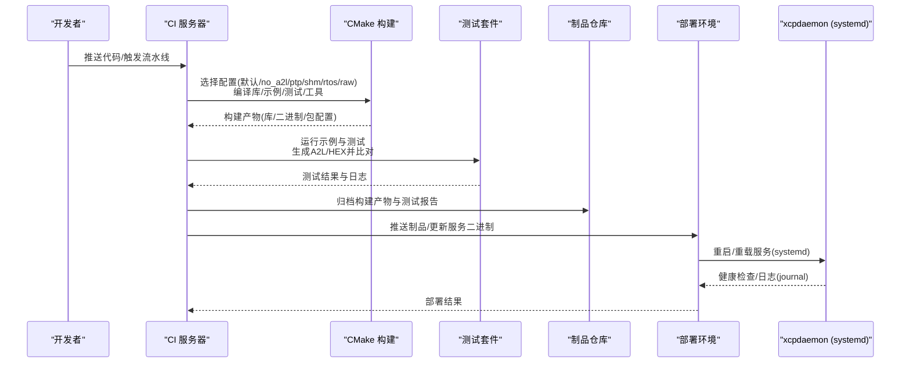
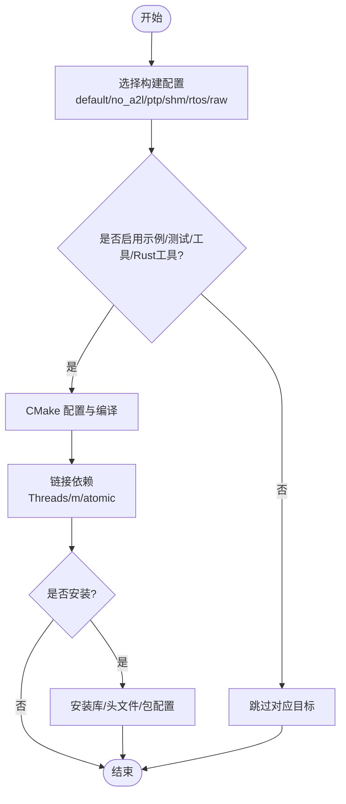
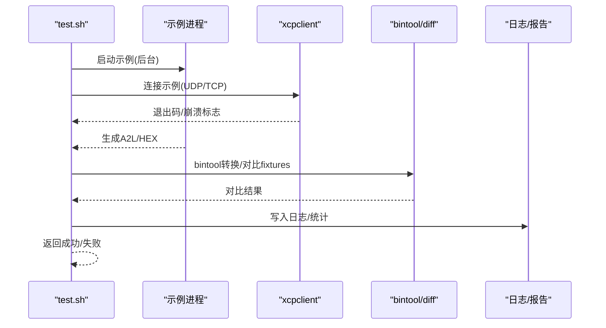
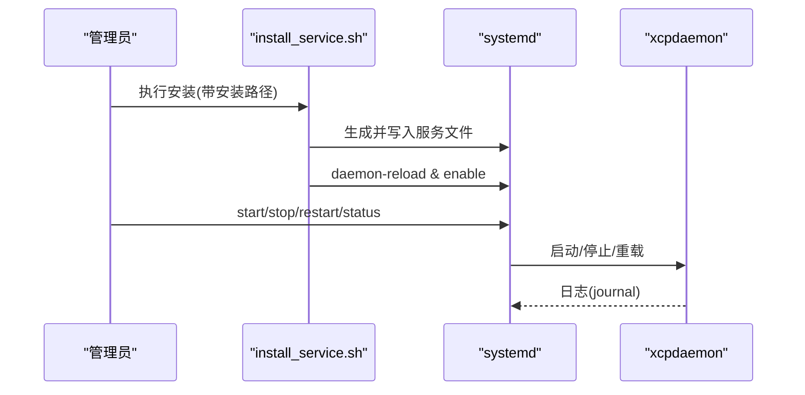
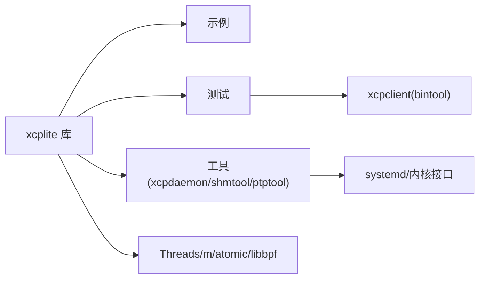

# 持续集成和部署

<cite>
**本文引用的文件**
- [CMakeLists.txt](file://CMakeLists.txt)
- [BUILDING.md](file://docs/BUILDING.md)
- [README.md](file://README.md)
- [test.sh](file://test/test.sh)
- [xcpdaemon.service](file://tools/xcpdaemon/xcpdaemon.service)
- [install_service.sh](file://tools/xcpdaemon/install_service.sh)
- [xcpdaemon_ctl.sh](file://tools/xcpdaemon/xcpdaemon_ctl.sh)
</cite>

## 目录
1. [简介](#简介)
2. [项目结构](#项目结构)
3. [核心组件](#核心组件)
4. [架构总览](#架构总览)
5. [详细组件分析](#详细组件分析)
6. [依赖关系分析](#依赖关系分析)
7. [性能与构建优化](#性能与构建优化)
8. [故障排查指南](#故障排查指南)
9. [结论](#结论)
10. [附录](#附录)

## 简介
本方案围绕 XCPlite 项目的持续集成与自动化部署，提供端到端的流水线设计：从多配置、多平台构建，到交叉编译与依赖管理；从自动化测试执行、结果收集与报告生成，到容器化部署、环境变量与服务启动脚本；并覆盖发布流程、版本控制与回滚策略，以及故障恢复、监控告警与日志收集。目标是让开发团队拥有一套标准化、可重复、可观测的构建与部署实践。

## 项目结构
XCPlite 使用 CMake 作为构建系统，通过互斥的“构建配置”（configuration）选择不同功能集，并通过选项开关控制示例、测试、工具与 Rust 工具的构建。顶层 CMake 负责库目标、安装规则、编译器/平台检测与特性开关；文档提供了详细的构建说明与跨平台注意事项；测试脚本驱动示例运行、A2L/HEX 产物对比与汇总报告；服务化部署由 systemd 单元与辅助脚本完成。

图表来源
- [CMakeLists.txt:1-656](file://CMakeLists.txt#L1-L656)
- [BUILDING.md:1-416](file://docs/BUILDING.md#L1-L416)
- [test.sh:1-601](file://test/test.sh#L1-L601)
- [xcpdaemon.service:1-21](file://tools/xcpdaemon/xcpdaemon.service#L1-L21)
- [install_service.sh:1-47](file://tools/xcpdaemon/install_service.sh#L1-L47)
- [xcpdaemon_ctl.sh:1-79](file://tools/xcpdaemon/xcpdaemon_ctl.sh#L1-L79)

章节来源
- [CMakeLists.txt:1-656](file://CMakeLists.txt#L1-L656)
- [BUILDING.md:1-416](file://docs/BUILDING.md#L1-L416)
- [README.md:1-130](file://README.md#L1-L130)

## 核心组件
- 构建系统与配置
  - 互斥构建配置：default/no_a2l/ptp/shm/rtos/raw，分别启用不同功能集与目标。
  - 构建选项：示例、测试、工具、Rust 工具、BPF 演示、安装规则等。
  - 平台与编译器检测：Windows/macOS/Linux/QNX/FreeRTOS；GCC/Clang/MSVC。
  - 标准与警告：C11/C++17（Windows C++20），统一警告与构建类型优化级别。
- 测试与验证
  - 单元测试与集成测试：按配置启用不同测试目标。
  - 示例驱动测试：启动示例进程，连接 xcpclient，生成/比对 A2L 与 HEX 产物，输出结构化日志与统计。
- 工具链与外部依赖
  - Rust 工具：xcpclient、bintool，通过 cargo 构建并可安装至 ~/.cargo/bin。
  - 可选依赖：libbpf（bpf_demo）、线程库、数学库、atomic 支持。
- 安装与分发
  - 标准 CMake 安装：库、头文件、CMake 包配置与版本信息。
  - 消费方式：find_package 或 FetchContent，保持命名空间 xcplite::xcplite。
- 服务化部署
  - systemd 单元：xcpdaemon 作为简单服务，日志输出到 journal。
  - 安装与远程运维：一键安装服务、SSH 远程启停/查看状态/跟随日志。

章节来源
- [CMakeLists.txt:15-155](file://CMakeLists.txt#L15-L155)
- [CMakeLists.txt:172-311](file://CMakeLists.txt#L172-L311)
- [CMakeLists.txt:314-586](file://CMakeLists.txt#L314-L586)
- [CMakeLists.txt:588-656](file://CMakeLists.txt#L588-L656)
- [BUILDING.md:11-83](file://docs/BUILDING.md#L11-L83)
- [BUILDING.md:85-218](file://docs/BUILDING.md#L85-L218)
- [BUILDING.md:267-341](file://docs/BUILDING.md#L267-L341)
- [test.sh:1-120](file://test/test.sh#L1-L120)
- [test.sh:206-506](file://test/test.sh#L206-L506)
- [test.sh:508-601](file://test/test.sh#L508-L601)
- [xcpdaemon.service:1-21](file://tools/xcpdaemon/xcpdaemon.service#L1-L21)
- [install_service.sh:1-47](file://tools/xcpdaemon/install_service.sh#L1-L47)
- [xcpdaemon_ctl.sh:1-79](file://tools/xcpdaemon/xcpdaemon_ctl.sh#L1-L79)

## 架构总览
下图展示 CI/CD 流水线的关键阶段与工件流转：源码经 CMake 多配置构建，产出库与工具；测试阶段运行示例与单测，生成 A2L/HEX 并与基线对比；制品归档后进入部署阶段，服务以 systemd 形式在目标机运行，日志接入系统日志。

图表来源
- [CMakeLists.txt:15-155](file://CMakeLists.txt#L15-L155)
- [CMakeLists.txt:314-586](file://CMakeLists.txt#L314-L586)
- [test.sh:206-506](file://test/test.sh#L206-L506)
- [xcpdaemon.service:1-21](file://tools/xcpdaemon/xcpdaemon.service#L1-L21)
- [install_service.sh:30-47](file://tools/xcpdaemon/install_service.sh#L30-L47)

## 详细组件分析

### 构建与多平台支持
- 构建配置矩阵
  - default：64位、目标端 A2L 生成、文件系统、以太网 UDP/TCP。
  - no_a2l：无目标端 A2L，A2L 由 xcpclient 从 ELF 离线生成。
  - ptp：启用套接字硬件时间戳（Linux）。
  - shm：共享内存多应用模式（macOS/Linux）。
  - rtos：嵌入式 FreeRTOS 目标（减少占用、无文件系统）。
  - raw：原始以太网传输（Linux，AF_PACKET）。
- 平台与编译器
  - Windows/macOS/Linux/QNX/FreeRTOS；GCC/Clang/MSVC。
  - 自动设置 C11/C++17（Windows C++20），统一警告与构建类型优化级别。
- 依赖与链接
  - 线程库、数学库、atomic 支持检测与链接。
  - Rust 工具通过 cargo 构建，可选择 release/debug。
- 安装与消费
  - 标准安装：库、头文件、CMake 包配置与版本文件。
  - find_package/FetchContent 两种消费路径，命名空间 xcplite::xcplite。

图表来源
- [CMakeLists.txt:15-155](file://CMakeLists.txt#L15-L155)
- [CMakeLists.txt:172-311](file://CMakeLists.txt#L172-L311)
- [CMakeLists.txt:588-656](file://CMakeLists.txt#L588-L656)
- [BUILDING.md:11-83](file://docs/BUILDING.md#L11-L83)
- [BUILDING.md:85-218](file://docs/BUILDING.md#L85-L218)

章节来源
- [CMakeLists.txt:15-155](file://CMakeLists.txt#L15-L155)
- [CMakeLists.txt:172-311](file://CMakeLists.txt#L172-L311)
- [CMakeLists.txt:588-656](file://CMakeLists.txt#L588-L656)
- [BUILDING.md:11-83](file://docs/BUILDING.md#L11-L83)
- [BUILDING.md:85-218](file://docs/BUILDING.md#L85-L218)

### 自动化测试执行、结果收集与报告
- 测试范围
  - 按配置启用不同测试目标（如 a2l_test、cal_test、daq_test、clock_test、queue_test、socket_raw_test 等）。
  - 示例驱动测试：启动示例进程，使用 xcpclient 连接，生成 A2L/HEX 并与 fixtures 对比。
- 执行流程
  - 清理/准备：可选清理生成的 .a2l/.bin/.hex。
  - 运行示例：后台启动，超时等待，捕获输出。
  - 连接与校验：调用 xcpclient，记录退出码与崩溃情况。
  - 产物对比：bintool 转 HEX，diff 与 fixtures 比较；A2L diff。
  - 报告输出：控制台彩色输出 + 持久化日志，统计通过/失败/跳过/差异项。
- 结果处理
  - 若 fixture 缺失则创建新基线；若不一致则记录差异并更新基线（需人工审核）。
  - 返回非零退出码表示失败，便于 CI 标记失败。

图表来源
- [test.sh:206-506](file://test/test.sh#L206-L506)
- [test.sh:508-601](file://test/test.sh#L508-L601)

章节来源
- [test.sh:1-120](file://test/test.sh#L1-L120)
- [test.sh:206-506](file://test/test.sh#L206-L506)
- [test.sh:508-601](file://test/test.sh#L508-L601)

### 容器化部署方案与环境变量
- 容器镜像建议
  - 基础镜像：基于 Linux（如 Ubuntu/Alpine），预装 CMake、GCC/Clang、Rust 工具链（如需构建 Rust 工具）。
  - 依赖：Threads、math、atomic（必要时）、libbpf（如需构建 bpf_demo）。
  - 工作目录：挂载源码与构建目录，避免污染宿主。
- 环境变量与配置
  - 构建阶段：CC/CXX、CMAKE_BUILD_TYPE、XCPLITE_CONFIGURATION、XCPLITE_BUILD_* 选项。
  - 运行阶段：xcpdaemon 的服务参数（如监听端口、SHM 路径等，依据实际二进制参数）。
- 构建与运行命令
  - 构建：cmake -B build -S . -DCMAKE_BUILD_TYPE=Release -DXCPLITE_CONFIGURATION=default -DXCPLITE_BUILD_TESTS=ON && cmake --build build --parallel
  - 测试：./test/test.sh（确保已构建示例与 xcpclient）
  - 运行：将 xcpdaemon 二进制放入镜像，配合 systemd 或前台进程启动。
- 安全与权限
  - 如需 raw Ethernet HAL，需要 CAP_NET_RAW；PTP 需要网卡支持硬件时间戳。
  - 最小权限原则：仅授予必要能力，避免 root 运行。

[本节为通用指导，不直接分析具体文件]

### 服务启动脚本与 systemd 集成
- systemd 单元
  - Type=simple，After=network.target，日志输出到 journal。
  - Restart=on-failure，RestartSec 控制重试间隔。
- 安装脚本
  - 自动生成服务文件，替换 User/WorkingDirectory/ExecStart，启用并加载服务。
- 远程运维
  - 通过 SSH 远程启停、查看状态、重载、跟随日志、清理 SHM。

图表来源
- [xcpdaemon.service:1-21](file://tools/xcpdaemon/xcpdaemon.service#L1-L21)
- [install_service.sh:30-47](file://tools/xcpdaemon/install_service.sh#L30-L47)
- [xcpdaemon_ctl.sh:28-73](file://tools/xcpdaemon/xcpdaemon_ctl.sh#L28-L73)

章节来源
- [xcpdaemon.service:1-21](file://tools/xcpdaemon/xcpdaemon.service#L1-L21)
- [install_service.sh:1-47](file://tools/xcpdaemon/install_service.sh#L1-L47)
- [xcpdaemon_ctl.sh:1-79](file://tools/xcpdaemon/xcpdaemon_ctl.sh#L1-L79)

### 发布流程管理、版本控制与回滚策略
- 版本与标签
  - 使用语义化版本号（参考项目版本），打 tag 并关联发布说明。
- 发布产物
  - 库与头文件、CMake 包配置、示例/测试/工具二进制、A2L/HEX 基线。
  - 构建日志与测试报告归档。
- 回滚策略
  - 保留上一稳定版本的二进制与配置；灰度发布时先小流量验证。
  - 服务层支持快速回滚：切换二进制并重启服务；数据库/配置变更采用可逆迁移。
- 质量门禁
  - 全配置构建与测试通过；A2L/HEX 基线一致；静态检查（clang-tidy）通过。

[本节为通用指导，不直接分析具体文件]

### 故障恢复、监控告警与日志收集
- 故障恢复
  - systemd 自动重启失败服务；健康检查探针（HTTP/TCP/自定义命令）。
  - 数据一致性：SHM 清理与重建；异常退出后重新初始化。
- 监控告警
  - 指标采集：CPU/内存/网络/队列长度（根据业务实现）。
  - 告警规则：错误率、延迟、资源使用阈值；通知渠道（邮件/IM/短信）。
- 日志收集
  - 系统日志：journalctl 集中收集；结构化日志格式便于检索。
  - 日志轮转与保留策略；敏感信息脱敏。

[本节为通用指导，不直接分析具体文件]

## 依赖关系分析
- 内部依赖
  - 库目标 xcplite 被示例、测试、工具引用；命名空间 xcplite::xcplite 保证消费者一致链接。
  - 配置头 xcplib_cfg.h 与各配置的覆盖头决定编译期行为。
- 外部依赖
  - 线程库、数学库、atomic；可选 libbpf；Rust 工具链用于 xcpclient/bintool。
- 平台相关
  - Linux：PTP、raw Ethernet、systemd。
  - Windows：MSVC 限制与性能差异；原子操作模拟。
  - QNX/FreeRTOS：交叉编译与工具链配置。

图表来源
- [CMakeLists.txt:245-311](file://CMakeLists.txt#L245-L311)
- [CMakeLists.txt:314-586](file://CMakeLists.txt#L314-L586)
- [BUILDING.md:239-249](file://docs/BUILDING.md#L239-L249)

章节来源
- [CMakeLists.txt:245-311](file://CMakeLists.txt#L245-L311)
- [CMakeLists.txt:314-586](file://CMakeLists.txt#L314-L586)
- [BUILDING.md:239-249](file://docs/BUILDING.md#L239-L249)

## 性能与构建优化
- 构建类型
  - Release：-O2 与 NDEBUG；RelWithDebInfo：-O1 与调试符号；Debug：-O0 与完整调试信息。
  - MSVC 等价优化与帧指针设置。
- 并行构建
  - 使用 --parallel 加速；合理划分任务（构建/测试/打包）。
- 缓存与增量
  - 利用 CMake 缓存与 Ninja 后端提升增量构建速度。
- 资源受限环境
  - RTOS 配置减少占用；关闭不必要功能；选择合适队列实现（mutex vs atomic）。

章节来源
- [CMakeLists.txt:218-243](file://CMakeLists.txt#L218-L243)
- [BUILDING.md:85-218](file://docs/BUILDING.md#L85-L218)

## 故障排查指南
- 构建问题
  - 确认 C11/C++17 要求；检查编译器与平台；清理旧构建目录后重试。
  - 缺少依赖：安装 Threads/m/atomic/libbpf；Rust 工具链用于 xcpclient/bintool。
- 测试问题
  - 端口占用：测试前杀掉残留进程；调整超时与重试。
  - A2L/HEX 差异：核对基线；必要时更新 fixtures 并评审。
  - xcpclient 崩溃：关注退出码 134（abort/panic），定位日志。
- 服务问题
  - systemd 状态与日志：systemctl status/journalctl -u xcpdaemon。
  - 权限与能力：raw Ethernet 需要 CAP_NET_RAW；PTP 需要网卡支持。
  - 远程运维：使用 xcpdaemon_ctl.sh 进行启停、状态、日志跟随。

章节来源
- [BUILDING.md:364-416](file://docs/BUILDING.md#L364-L416)
- [test.sh:237-308](file://test/test.sh#L237-L308)
- [test.sh:367-500](file://test/test.sh#L367-L500)
- [test.sh:515-601](file://test/test.sh#L515-L601)
- [xcpdaemon_ctl.sh:28-73](file://tools/xcpdaemon/xcpdaemon_ctl.sh#L28-L73)

## 结论
通过 CMake 的多配置构建、严格的测试与产物基线对比、systemd 服务化部署与完善的运维脚本，XCPlite 提供了可扩展、可观测、可回滚的 CI/CD 基础。结合容器化与监控告警，可实现从开发到生产的全链路自动化与稳定性保障。建议团队遵循本文最佳实践，逐步完善流水线与治理机制。

## 附录
- 常用命令速查
  - 构建：cmake -B build -S . -DCMAKE_BUILD_TYPE=Release -DXCPLITE_CONFIGURATION=default -DXCPLITE_BUILD_EXAMPLES=ON && cmake --build build --parallel
  - 测试：./test/test.sh
  - 安装：cmake --install build
  - 服务：sudo systemctl start/stop/restart/status xcpdaemon；journalctl -u xcpdaemon -f
  - 远程：./tools/xcpdaemon/xcpdaemon_ctl.sh <command>

[本节为通用指导，不直接分析具体文件]