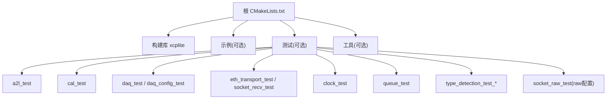
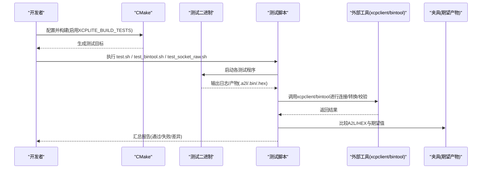
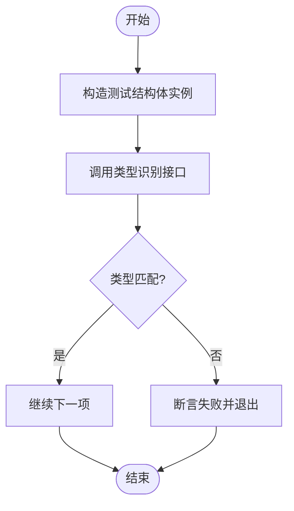
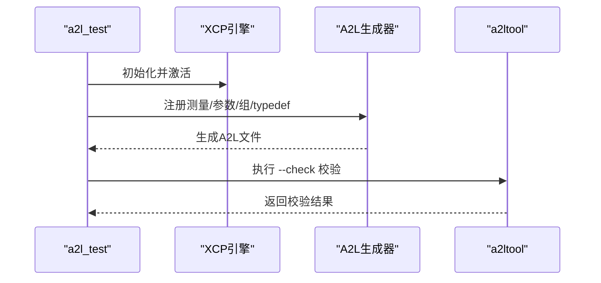
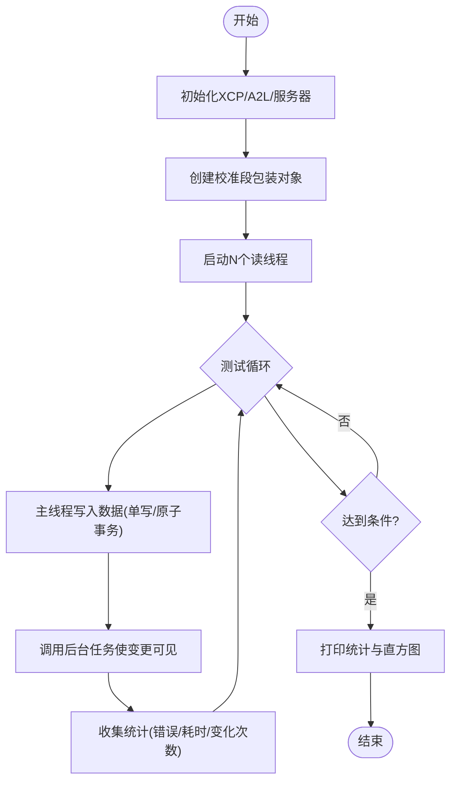
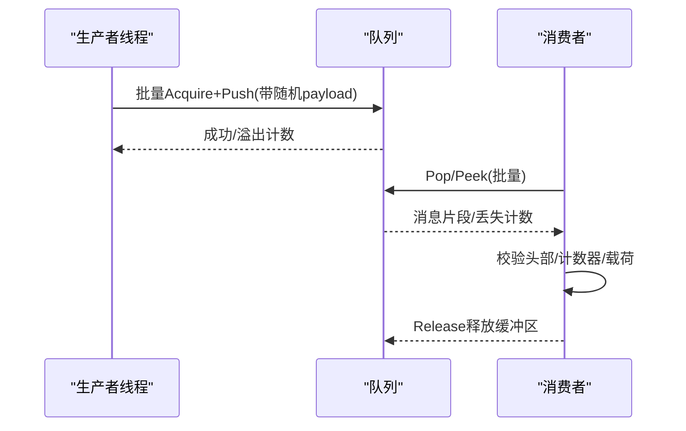
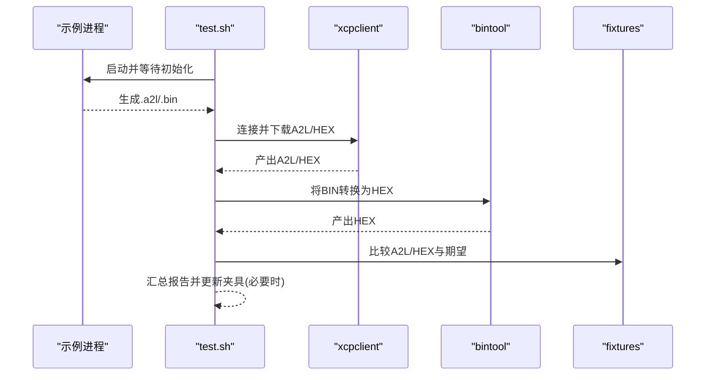
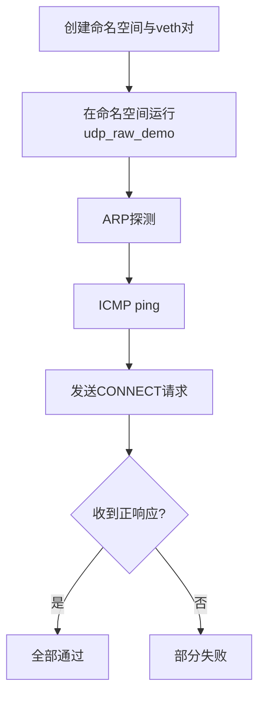
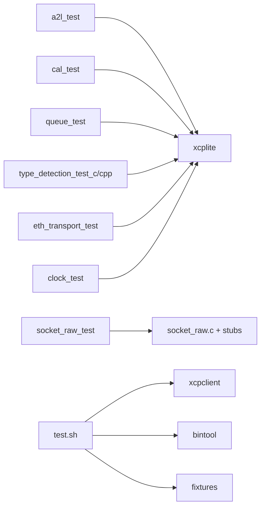

# 测试和质量保证

<cite>
**本文引用的文件**
- [CMakeLists.txt](file://CMakeLists.txt)
- [.clang-tidy](file://.clang-tidy)
- [.clang-format](file://.clang-format)
- [test/test.sh](file://test/test.sh)
- [test/test_bintool.sh](file://test/test_bintool.sh)
- [test/test_socket_raw.sh](file://test/test_socket_raw.sh)
- [test/a2l_test/src/main.c](file://test/a2l_test/src/main.c)
- [test/cal_test/src/main.cpp](file://test/cal_test/src/main.cpp)
- [test/queue_test/src/main.c](file://test/queue_test/src/main.c)
- [test/type_detection_test/src/main.c](file://test/type_detection_test/src/main.c)
</cite>

## 目录
1. [简介](#简介)
2. [项目结构](#项目结构)
3. [核心组件](#核心组件)
4. [架构总览](#架构总览)
5. [详细组件分析](#详细组件分析)
6. [依赖关系分析](#依赖关系分析)
7. [性能考虑](#性能考虑)
8. [故障排查指南](#故障排查指南)
9. [结论](#结论)
10. [附录](#附录)

## 简介
本文件为 XCPlite 项目的测试与质量保证体系说明，覆盖单元测试、集成测试、性能基准测试、代码质量检查（clang-tidy、clang-format）、持续集成构建与部署流程，以及常见问题排查、调试技巧与性能优化建议。目标是帮助开发团队建立标准化、可重复的质量保障流程与最佳实践。

## 项目结构
XCPlite 使用 CMake 作为构建系统，通过选项开关控制是否构建示例、测试与工具。测试相关目标由 CMake 集中管理，并通过脚本统一执行与验证。

图表来源
- [CMakeLists.txt:111-155](file://CMakeLists.txt#L111-L155)
- [CMakeLists.txt:426-502](file://CMakeLists.txt#L426-L502)

章节来源
- [CMakeLists.txt:111-155](file://CMakeLists.txt#L111-L155)
- [CMakeLists.txt:426-502](file://CMakeLists.txt#L426-L502)

## 核心组件
- 构建与测试开关：通过 CMake 选项启用测试目标，不同配置下可用测试集不同。
- 测试套件组织：按功能域分目录（a2l、cal、daq、eth_transport、queue、type_detection、socket_raw），每个子目录包含独立的可执行程序与必要资源。
- 自动化执行：提供统一的测试脚本，支持清理、逐个或全部运行、日志记录、产物对比与结果汇总。
- 工具链与规则：clang-tidy 与 clang-format 配置文件定义代码风格与静态检查规则。

章节来源
- [CMakeLists.txt:111-155](file://CMakeLists.txt#L111-L155)
- [CMakeLists.txt:426-502](file://CMakeLists.txt#L426-L502)
- [.clang-tidy:1-136](file://.clang-tidy#L1-L136)
- [.clang-format:1-12](file://.clang-format#L1-L12)

## 架构总览
下图展示从构建到测试执行的端到端流程，包括 CMake 生成测试目标、脚本驱动运行、外部工具参与校验与对比。

图表来源
- [CMakeLists.txt:426-502](file://CMakeLists.txt#L426-L502)
- [test/test.sh:1-601](file://test/test.sh#L1-L601)
- [test/test_bintool.sh:1-467](file://test/test_bintool.sh#L1-L467)

## 详细组件分析

### 构建系统与测试目标
- 通过选项 XCPLITE_BUILD_TESTS 启用测试目标；不同配置下可用测试不同（default、ptp、raw）。
- 在 default 配置下，会构建类型检测、A2L、校准、DAQ、以太网传输、时钟、队列等测试。
- raw 配置下提供 socket_raw_test，不链接 xcplite，直接编译 socket_raw.c 并提供伪造 HAL 以在无网络权限环境下验证协议栈行为。

章节来源
- [CMakeLists.txt:111-155](file://CMakeLists.txt#L111-L155)
- [CMakeLists.txt:426-502](file://CMakeLists.txt#L426-L502)

### 单元测试：类型检测
- 目的：验证 A2L 类型推导在不同表达式下的正确性（基本类型、数组索引、二维数组等）。
- 方法：构造包含多种类型的结构体实例，调用类型识别接口并断言预期类型。
- 关键点：确保复杂表达式的元素类型推导稳定一致。

图表来源
- [test/type_detection_test/src/main.c:1-98](file://test/type_detection_test/src/main.c#L1-L98)

章节来源
- [test/type_detection_test/src/main.c:1-98](file://test/type_detection_test/src/main.c#L1-L98)

### 单元测试：A2L 生成与校验
- 目的：验证运行时 A2L 生成的完整性与合规性。
- 方法：初始化 XCP/A2L，注册测量与参数，最终化 A2L 后调用外部 a2ltool 进行检查。
- 关键点：确保事件、组、typedef、曲线/地图、轴等元数据正确生成。

图表来源
- [test/a2l_test/src/main.c:229-455](file://test/a2l_test/src/main.c#L229-L455)
- [test/a2l_test/src/main.c:456-517](file://test/a2l_test/src/main.c#L456-L517)

章节来源
- [test/a2l_test/src/main.c:229-455](file://test/a2l_test/src/main.c#L229-L455)
- [test/a2l_test/src/main.c:456-517](file://test/a2l_test/src/main.c#L456-L517)

### 单元测试：校准段多线程一致性
- 目的：验证多读线程对校准段的一致访问与可见性语义。
- 方法：创建多个工作线程周期性读取校准段，主线程写入数据并触发后台任务，统计错误与锁耗时分布。
- 关键点：关注写后读可见性、原子事务、锁时间直方图与最大延迟。

图表来源
- [test/cal_test/src/main.cpp:336-708](file://test/cal_test/src/main.cpp#L336-L708)

章节来源
- [test/cal_test/src/main.cpp:336-708](file://test/cal_test/src/main.cpp#L336-L708)

### 单元测试：队列吞吐与拥塞处理
- 目的：评估队列在高并发下的吞吐、丢包与拥塞行为，并测量获取锁的时延分布。
- 方法：多生产者线程批量入队，消费者轮询出队；支持 peek 模式；可选共享内存模式跨进程通信。
- 关键点：payload 大小随机化、拥塞时的退避策略、计数器一致性与丢失检测。

图表来源
- [test/queue_test/src/main.c:355-435](file://test/queue_test/src/main.c#L355-L435)
- [test/queue_test/src/main.c:519-794](file://test/queue_test/src/main.c#L519-L794)

章节来源
- [test/queue_test/src/main.c:355-435](file://test/queue_test/src/main.c#L355-L435)
- [test/queue_test/src/main.c:519-794](file://test/queue_test/src/main.c#L519-L794)

### 集成测试：示例与工具联动
- 目的：端到端验证示例应用与 xcpclient/bintool 的协作，生成并对比 A2L/HEX 产物。
- 方法：启动示例进程，等待其生成 A2L/BIN，调用 xcpclient 连接并下载 A2L/HEX，再用 bintool 将 BIN 转 HEX 并与 xcpclient 生成的 HEX 对比；同时与 fixtures 中的期望文件比对。
- 关键点：端口占用清理、超时控制、产物命名与定位、差异分析与自动更新夹具。

图表来源
- [test/test.sh:1-601](file://test/test.sh#L1-L601)

章节来源
- [test/test.sh:1-601](file://test/test.sh#L1-L601)

### 集成测试：原始以太网传输
- 目的：在无内核 IP 栈干扰的环境下，验证 socket_raw.c 的 ARP/ICMP/XCP CONNECT 响应。
- 方法：创建网络命名空间与 veth 对，在命名空间内运行 udp_raw_demo，主机侧执行 arping/ping/xcpclient 连通性测试。
- 关键点：需要 root 权限；目标侧不分配 IP，由应用层接管；严格隔离避免内核抢占。

图表来源
- [test/test_socket_raw.sh:1-157](file://test/test_socket_raw.sh#L1-L157)

章节来源
- [test/test_socket_raw.sh:1-157](file://test/test_socket_raw.sh#L1-L157)

### 性能基准测试实施方案与分析
- 队列吞吐与时延：
  - 指标：消息速率、字节率、溢出计数、错误计数、获取锁时延直方图（最小/平均/最大）。
  - 方法：多生产者高负载入队，消费者尽力拉取；开启计时采集，输出直方图与统计摘要。
  - 分析：观察长尾延迟来源（调度/抢占），调整队列大小、线程数、payload 大小与消费睡眠策略。
- 校准段锁耗时：
  - 指标：锁获取时间分布、最大延迟、平均延迟。
  - 方法：在 cal_test 中记录每次 lock() 耗时，输出直方图。
  - 分析：结合写频率与原子事务比例，评估 RCU/无锁实现的可见性代价。
- 以太网传输：
  - 指标：CONNECT 成功率、ARP/ICMP 响应情况。
  - 方法：在隔离命名空间中进行链路级验证。
  - 分析：确认 MAC/IPv4/UDP 头与校验和正确性。

章节来源
- [test/queue_test/src/main.c:101-211](file://test/queue_test/src/main.c#L101-L211)
- [test/cal_test/src/main.cpp:83-175](file://test/cal_test/src/main.cpp#L83-L175)
- [test/test_socket_raw.sh:90-145](file://test/test_socket_raw.sh#L90-L145)

### 代码质量检查工具配置与使用
- clang-format：
  - 基于 LLVM 风格，缩进 4 空格，列宽限制 180，语言设置为 Cpp（兼容 C/C++）。
  - 使用方式：在项目根目录放置 .clang-format，IDE 或 CI 中调用 clang-format 进行格式化。
- clang-tidy：
  - 启用诊断、分析器、可读性、bugprone、modernize、concurrency、performance、cert、cppcoreguidelines、hicpp、portability 等规则集。
  - 关闭部分过于严格或不适用的规则（如函数复杂度、宏使用、魔法数字等），并对标识符命名进行细化配置。
  - 使用方式：在 CI 或本地通过 clang-tidy 扫描源码与头文件。

章节来源
- [.clang-format:1-12](file://.clang-format#L1-L12)
- [.clang-tidy:1-136](file://.clang-tidy#L1-L136)

### 持续集成流程（构建与部署）
- 构建阶段：
  - 选择配置（default/no_a2l/ptp/shm/rtos/raw），启用 XCPLITE_BUILD_TESTS 与 XCPLITE_BUILD_TOOLS。
  - 生成测试目标与工具（xcpclient、bintool、ptptool、shmtool、xcpdaemon）。
- 测试阶段：
  - 执行 test.sh 进行示例与工具联动测试；执行 test_bintool.sh 进行 HEX/BIN 往返校验；执行 test_socket_raw.sh 进行原始以太网链路测试。
- 部署阶段：
  - 使用 cmake --install 安装库与头文件、包配置；Rust 工具需通过 cargo install 手动安装至 PATH。
  - 注意：cmake --install 不会自动运行 cargo install，需在 CI 中显式调用。

章节来源
- [CMakeLists.txt:555-586](file://CMakeLists.txt#L555-L586)
- [CMakeLists.txt:588-656](file://CMakeLists.txt#L588-L656)

## 依赖关系分析
- 测试目标依赖 xcplite 库；socket_raw_test 在 raw 配置下不链接 xcplite，而是直接编译 socket_raw.c 并提供 stubs。
- 测试脚本依赖外部工具：xcpclient、bintool、a2ltool（可选），以及 Linux 网络工具（arping、ip、tcpdump）。
- 平台相关：PTP 与 raw Ethernet 测试仅在 Linux 上可用；Windows 下部分测试跳过。

图表来源
- [CMakeLists.txt:426-502](file://CMakeLists.txt#L426-L502)
- [test/test.sh:1-601](file://test/test.sh#L1-L601)

章节来源
- [CMakeLists.txt:426-502](file://CMakeLists.txt#L426-L502)
- [test/test.sh:1-601](file://test/test.sh#L1-L601)

## 性能考虑
- 队列测试：
  - 合理设置队列大小与线程数，避免长期拥塞导致溢出。
  - 使用 CLOCK_MONOTONIC_RAW 测量短延迟更准确；注意系统调度造成的长尾。
- 校准段：
  - 原子事务可减少不一致窗口，但引入额外开销；根据写频率权衡。
  - 关注锁时间直方图的尾部，必要时降低竞争或批量化操作。
- 以太网传输：
  - 在隔离命名空间中测试，避免内核协议栈干扰；确保网卡具备所需能力（如 AF_PACKET）。
- 构建优化：
  - Release 使用 -O2 并关闭断言；RelWithDebInfo 使用 -O1 保留调试信息用于测量。

章节来源
- [test/queue_test/src/main.c:101-211](file://test/queue_test/src/main.c#L101-L211)
- [test/cal_test/src/main.cpp:83-175](file://test/cal_test/src/main.cpp#L83-L175)
- [CMakeLists.txt:218-243](file://CMakeLists.txt#L218-L243)

## 故障排查指南
- 端口占用与进程冲突：
  - 测试脚本会在运行前尝试终止已有示例进程，避免端口冲突。若失败，请手动清理。
- 工具缺失：
  - xcpclient、bintool、a2ltool 未安装会导致测试中断；请在 PATH 中安装或通过 cargo install 安装。
- 权限问题：
  - test_socket_raw.sh 需要 root 权限以创建命名空间和使用 AF_PACKET；请以 sudo 运行。
- 产物差异：
  - A2L/HEX 与 fixtures 不一致时，脚本会自动更新夹具；请审查差异原因（时间戳、地址等）。
- 网络连通性：
  - 在 raw 测试中，确认 veth 对已创建、目标侧无 IP 分配、应用层绑定正确。

章节来源
- [test/test.sh:237-308](file://test/test.sh#L237-L308)
- [test/test_socket_raw.sh:46-86](file://test/test_socket_raw.sh#L46-L86)
- [test/test_bintool.sh:171-200](file://test/test_bintool.sh#L171-L200)

## 结论
XCPlite 提供了完善的测试与质量保证体系：通过 CMake 灵活组织测试目标，借助脚本实现端到端集成测试与产物校验；针对关键路径（队列、校准段、以太网传输）提供性能基准与可视化分析；配合 clang-tidy/clang-format 保障代码质量；CI 流程覆盖构建、测试与部署。遵循本文档的流程与实践，可有效提升稳定性、可维护性与交付质量。

## 附录
- 快速开始：
  - 构建并运行测试：启用 XCPLITE_BUILD_TESTS，执行 test.sh。
  - 原始以太网测试：sudo ./test/test_socket_raw.sh。
  - HEX/BIN 往返测试：执行 test_bintool.sh。
- 常用命令：
  - cmake -B build -S . -DXCPLITE_CONFIGURATION=default -DXCPLITE_BUILD_TESTS=ON
  - cmake --build build --target <test_target>
  - cargo install --path tools/xcpclient && cargo install --path tools/bintool