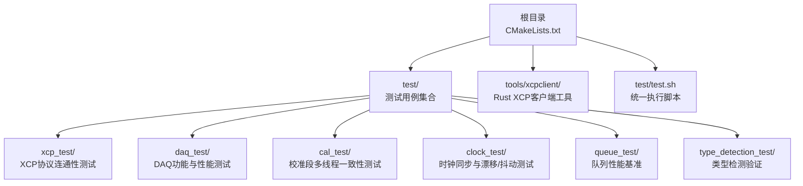
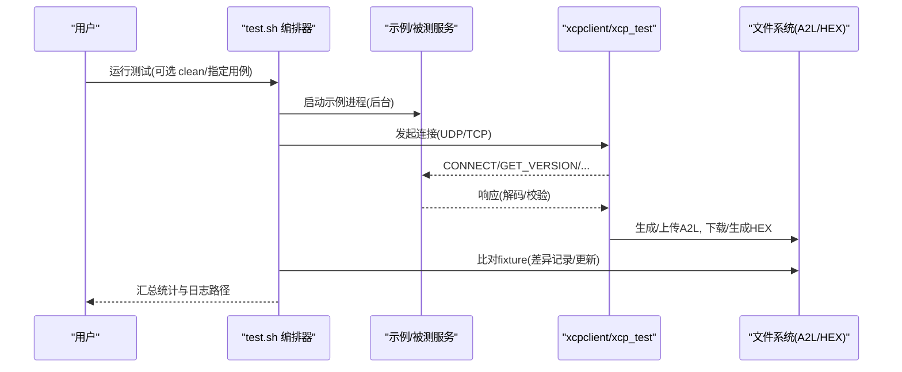
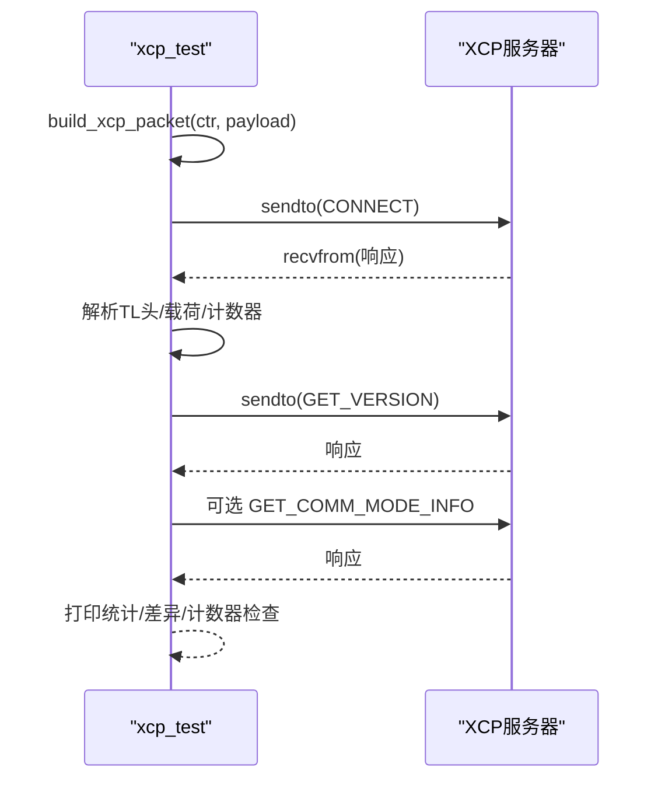
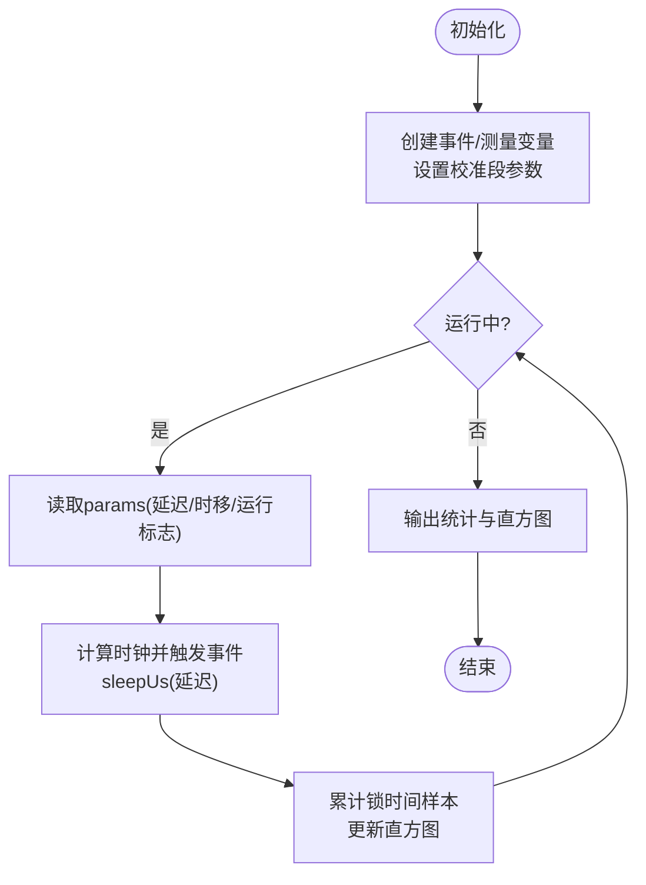
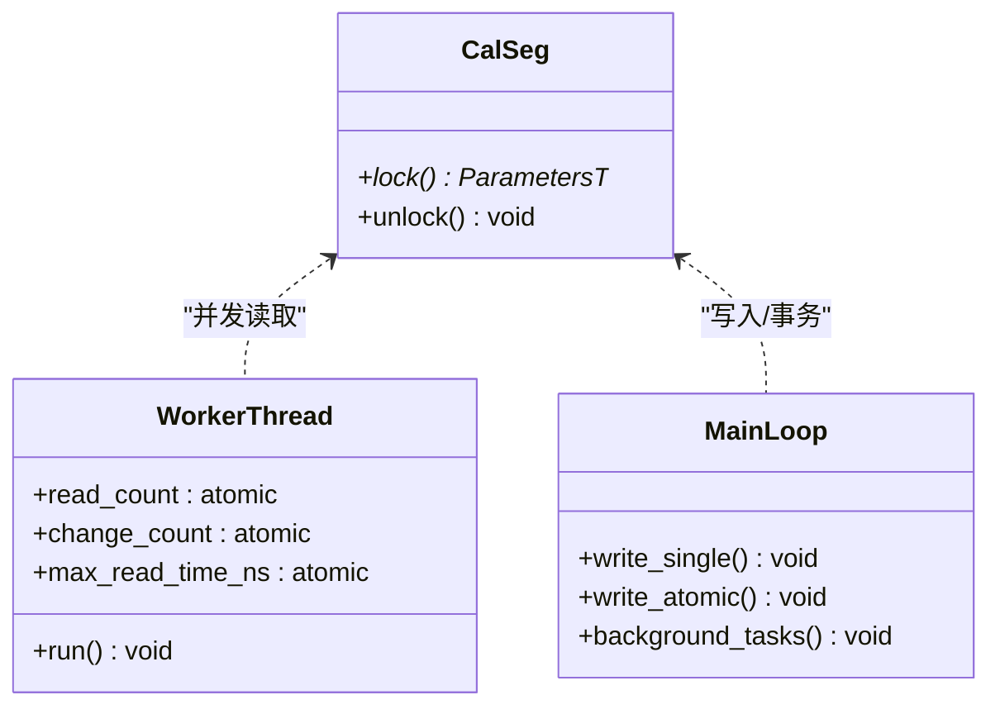
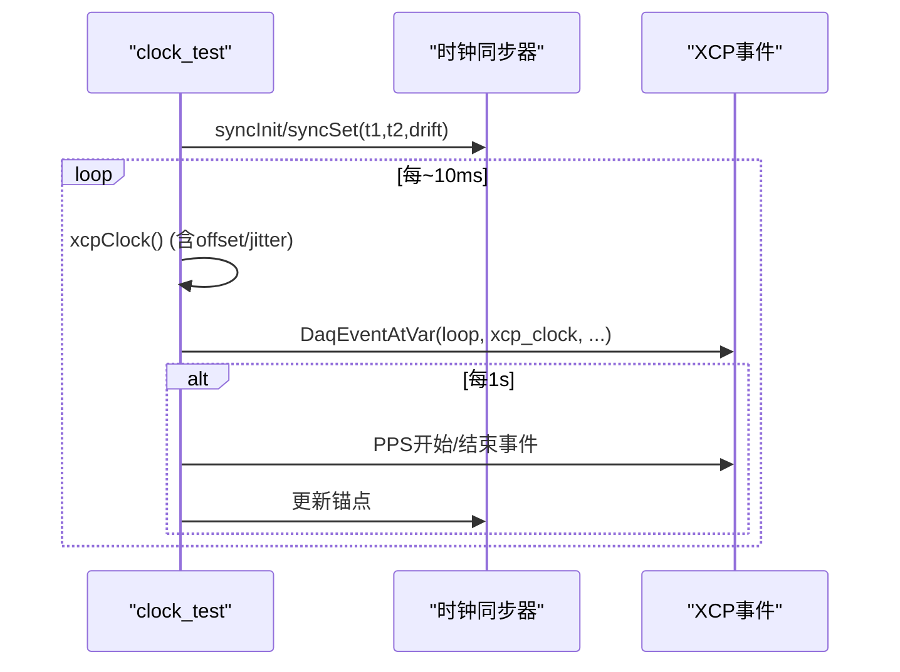
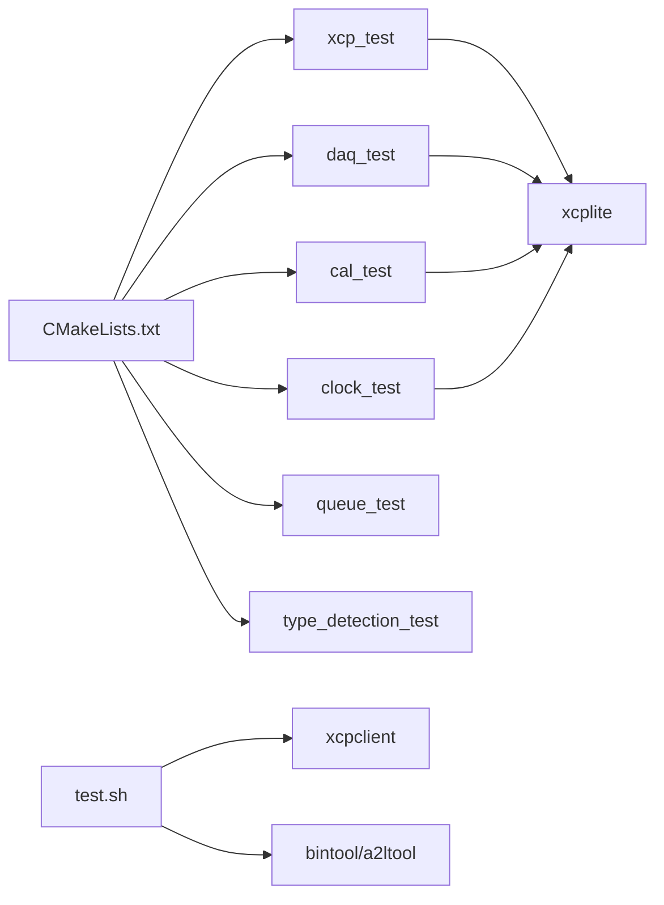

# 测试框架和套件

<cite>
**本文引用的文件**
- [CMakeLists.txt](file://CMakeLists.txt)
- [test.sh](file://test/test.sh)
- [xcp_test/README.md](file://test/xcp_test/README.md)
- [xcp_test/src/main.cpp](file://test/xcp_test/src/main.cpp)
- [daq_test/README.md](file://test/daq_test/README.md)
- [daq_test/src/main.c](file://test/daq_test/src/main.c)
- [cal_test/README.md](file://test/cal_test/README.md)
- [cal_test/src/main.cpp](file://test/cal_test/src/main.cpp)
- [clock_test/README.md](file://test/clock_test/README.md)
- [clock_test/src/main.cpp](file://test/clock_test/src/main.cpp)
- [queue_test/README.md](file://test/queue_test/README.md)
- [type_detection_test/src/main.c](file://test/type_detection_test/src/main.c)
- [tools/xcpclient/README.md](file://tools/xcpclient/README.md)
</cite>

## 目录
1. [简介](#简介)
2. [项目结构](#项目结构)
3. [核心组件](#核心组件)
4. [架构总览](#架构总览)
5. [详细组件分析](#详细组件分析)
6. [依赖关系分析](#依赖关系分析)
7. [性能考量](#性能考量)
8. [故障排查指南](#故障排查指南)
9. [结论](#结论)
10. [附录](#附录)

## 简介
本文件面向XCPlite的测试框架与测试套件，系统性说明测试层次结构、组织方式与各模块职责，覆盖XCP协议连通性测试、DAQ功能与性能测试、校准段多线程一致性测试、时钟同步与抖动漂移测试等。文档同时给出测试数据准备与清理机制、环境配置要求、执行流程、结果分析与报告生成方法，并提供用例编写指南与最佳实践，帮助开发者扩展与维护测试套件。

## 项目结构
测试相关代码与脚本主要位于 test/ 目录，按功能划分为多个子目录；顶层 CMakeLists.txt 负责构建选项与目标注册；test/test.sh 提供统一的集成测试入口，驱动示例程序与 xcpclient 完成端到端验证与产物对比。

图表来源
- [CMakeLists.txt:111-155](file://CMakeLists.txt#L111-L155)
- [CMakeLists.txt:426-502](file://CMakeLists.txt#L426-L502)
- [test.sh:131-178](file://test/test.sh#L131-L178)

章节来源
- [CMakeLists.txt:111-155](file://CMakeLists.txt#L111-L155)
- [CMakeLists.txt:426-502](file://CMakeLists.txt#L426-L502)
- [test.sh:131-178](file://test/test.sh#L131-L178)

## 核心组件
- 统一执行器：test/test.sh 负责启动示例进程、调用 xcpclient 进行连接与A2L/HEX比对、收集日志并输出统计摘要。
- XCP协议测试：test/xcp_test 发送CONNECT/GET_VERSION/GET_COMM_MODE_INFO序列，校验传输层头、计数器递增与响应字段解析。
- DAQ测试：test/daq_test 创建多任务事件与测量变量，评估高吞吐下的锁时间与直方图分布，支持参数化线程数、延迟与时移。
- 校准段测试：test/cal_test 使用CalSeg/CalBlk封装并发读写，验证RCU可见性、原子事务与一致性。
- 时钟同步测试：test/clock_test 通过可配置的偏移/漂移/抖动模拟XCP时间尺度，结合PPS事件验证客户端鲁棒性。
- 队列基准：test/queue_test 比较不同队列实现与同步策略在高负载下的吞吐、丢包与锁时间分布。
- 类型检测：test/type_detection_test 验证A2lGetTypeId对基础类型、数组与多维表达式的识别正确性。
- 外部工具：tools/xcpclient 提供在线/离线A2L生成、CAL读写、DAQ采集与测试序列执行能力，被test.sh集成用于自动化验证。

章节来源
- [test.sh:206-506](file://test/test.sh#L206-L506)
- [xcp_test/README.md:1-92](file://test/xcp_test/README.md#L1-L92)
- [xcp_test/src/main.cpp:50-78](file://test/xcp_test/src/main.cpp#L50-L78)
- [daq_test/README.md:1-142](file://test/daq_test/README.md#L1-L142)
- [daq_test/src/main.c:28-47](file://test/daq_test/src/main.c#L28-L47)
- [cal_test/README.md:1-13](file://test/cal_test/README.md#L1-L13)
- [cal_test/src/main.cpp:25-44](file://test/cal_test/src/main.cpp#L25-L44)
- [clock_test/README.md:1-18](file://test/clock_test/README.md#L1-L18)
- [clock_test/src/main.cpp:27-34](file://test/clock_test/src/main.cpp#L27-L34)
- [queue_test/README.md:1-14](file://test/queue_test/README.md#L1-L14)
- [type_detection_test/src/main.c:12-26](file://test/type_detection_test/src/main.c#L12-L26)
- [tools/xcpclient/README.md:10-22](file://tools/xcpclient/README.md#L10-L22)

## 架构总览
测试执行采用“服务端示例 + 客户端工具”的双端模式：
- 服务端：各测试用例（或示例）启动XCP服务器，暴露事件、测量与校准段。
- 客户端：xcpclient或xcp_test发起连接、下发命令、采集数据、生成/比对A2L与HEX。
- 编排：test.sh协调生命周期、端口清理、超时控制、日志聚合与结果判定。

图表来源
- [test.sh:237-308](file://test/test.sh#L237-L308)
- [test.sh:367-500](file://test/test.sh#L367-L500)
- [tools/xcpclient/README.md:10-22](file://tools/xcpclient/README.md#L10-L22)

## 详细组件分析

### XCP协议测试（xcp_test）
- 设计思路：构造最小化的XCP握手序列，验证传输层帧格式、载荷长度与计数器单调递增，兼容不同平台socket实现。
- 测试场景：默认端口5555，支持自定义IP与接收超时；打印TX/RX原始字节，解析CONNECT/GET_VERSION/GET_COMM_MODE_INFO响应字段。
- 验证方法：比较头部payload_len与实际UDP载荷长度，检查计数器+1推进；若不支持可选通信模式则跳过相应命令。

图表来源
- [xcp_test/src/main.cpp:101-113](file://test/xcp_test/src/main.cpp#L101-L113)
- [xcp_test/src/main.cpp:122-174](file://test/xcp_test/src/main.cpp#L122-L174)
- [xcp_test/src/main.cpp:414-479](file://test/xcp_test/src/main.cpp#L414-L479)

章节来源
- [xcp_test/README.md:1-92](file://test/xcp_test/README.md#L1-L92)
- [xcp_test/src/main.cpp:50-78](file://test/xcp_test/src/main.cpp#L50-L78)
- [xcp_test/src/main.cpp:101-174](file://test/xcp_test/src/main.cpp#L101-L174)
- [xcp_test/src/main.cpp:414-479](file://test/xcp_test/src/main.cpp#L414-L479)

### DAQ功能与性能测试（daq_test）
- 设计思路：创建多任务事件实例，为每个任务注册栈地址模式的测量变量，周期性触发事件并上报计数与波形信号；通过校准段参数动态调整线程延迟与时移，形成不同采样率与时间交错。
- 测试场景：可调线程数、延迟、时移；启用事件计时直方图统计生产者获取锁的时间分布；支持在停止时输出统计。
- 验证方法：统计最大/平均锁时间、直方图区间计数；通过回调检查DAQ列表状态；最终输出事件耗时分布与吞吐量指标。

图表来源
- [daq_test/src/main.c:152-169](file://test/daq_test/src/main.c#L152-L169)
- [daq_test/src/main.c:184-278](file://test/daq_test/src/main.c#L184-L278)
- [daq_test/src/main.c:288-403](file://test/daq_test/src/main.c#L288-L403)

章节来源
- [daq_test/README.md:1-142](file://test/daq_test/README.md#L1-L142)
- [daq_test/src/main.c:28-47](file://test/daq_test/src/main.c#L28-L47)
- [daq_test/src/main.c:152-169](file://test/daq_test/src/main.c#L152-L169)
- [daq_test/src/main.c:184-278](file://test/daq_test/src/main.c#L184-L278)
- [daq_test/src/main.c:288-403](file://test/daq_test/src/main.c#L288-L403)

### 校准段多线程一致性测试（cal_test）
- 设计思路：使用CalSeg/CalBlk封装校准段，多线程并发读；主循环以单写或原子事务方式写入，验证RCU可见性与一致性；可选开启锁时间直方图统计。
- 测试场景：RAM/FLASH页切换、连续写后多次读、原子事务分段写；统计错误数、变更次数、平均/最大锁时间。
- 验证方法：断言数据一致性；必要时调用后台任务使更新可见；输出最终统计与成功/失败信息。

图表来源
- [cal_test/src/main.cpp:63-78](file://test/cal_test/src/main.cpp#L63-L78)
- [cal_test/src/main.cpp:219-300](file://test/cal_test/src/main.cpp#L219-L300)
- [cal_test/src/main.cpp:556-632](file://test/cal_test/src/main.cpp#L556-L632)

章节来源
- [cal_test/README.md:1-13](file://test/cal_test/README.md#L1-L13)
- [cal_test/src/main.cpp:25-44](file://test/cal_test/src/main.cpp#L25-L44)
- [cal_test/src/main.cpp:219-300](file://test/cal_test/src/main.cpp#L219-L300)
- [cal_test/src/main.cpp:556-632](file://test/cal_test/src/main.cpp#L556-L632)

### 时钟同步与漂移/抖动测试（clock_test）
- 设计思路：通过可配置的offset/drift/drift_drift/jitter生成XCP时间尺度，结合系统单调时钟或PTP时钟；周期性产生PPS事件，验证客户端对跳变、漂移与抖动的容忍度。
- 测试场景：无PTP时使用单调时钟；可选启用PTP并获取本地/主时钟UUID；每10ms近似一次系统时间采样，每秒输出PPS边界事件。
- 验证方法：比较XCP时钟与系统时钟差值；定期更新同步器锚点；输出关键时间戳与状态。

图表来源
- [clock_test/src/main.cpp:158-209](file://test/clock_test/src/main.cpp#L158-L209)
- [clock_test/src/main.cpp:259-305](file://test/clock_test/src/main.cpp#L259-L305)
- [clock_test/src/main.cpp:329-395](file://test/clock_test/src/main.cpp#L329-L395)

章节来源
- [clock_test/README.md:1-18](file://test/clock_test/README.md#L1-L18)
- [clock_test/src/main.cpp:27-34](file://test/clock_test/src/main.cpp#L27-L34)
- [clock_test/src/main.cpp:158-209](file://test/clock_test/src/main.cpp#L158-L209)
- [clock_test/src/main.cpp:259-305](file://test/clock_test/src/main.cpp#L259-L305)
- [clock_test/src/main.cpp:329-395](file://test/clock_test/src/main.cpp#L329-L395)

### 队列性能基准（queue_test）
- 设计思路：对比不同队列实现与同步策略在高负载下的吞吐、丢包与锁时间分布；支持小/大载荷与不同时钟源测量。
- 测试场景：固定大小/可变大小条目；entry_header释放+relaxed tail vs tail release/acquire；CLOCK_MONOTONIC_RAW与CLOCK_THREAD_CPUTIME_ID对比。
- 验证方法：统计消息/字节速率、最大队列水位、生产者获取锁时间直方图与丢失包数量；发布基准结论。

章节来源
- [queue_test/README.md:1-14](file://test/queue_test/README.md#L1-L14)
- [queue_test/README.md:21-210](file://test/queue_test/README.md#L21-L210)
- [queue_test/README.md:214-356](file://test/queue_test/README.md#L214-L356)
- [queue_test/README.md:360-534](file://test/queue_test/README.md#L360-L534)
- [queue_test/README.md:538-756](file://test/queue_test/README.md#L538-L756)

### 类型检测验证（type_detection_test）
- 设计思路：通过结构体成员与数组表达式调用类型检测API，验证基础类型、数组元素与二维数组元素识别正确性。
- 测试场景：uint8/16/32、float/double、bool、一维/二维数组、有符号数组。
- 验证方法：断言返回类型ID与预期一致。

章节来源
- [type_detection_test/src/main.c:12-26](file://test/type_detection_test/src/main.c#L12-L26)
- [type_detection_test/src/main.c:55-98](file://test/type_detection_test/src/main.c#L55-L98)

## 依赖关系分析
- 构建与目标：CMakeLists.txt根据配置启用不同测试目标（default/ptp/raw），并将xcp_test、daq_test、cal_test、clock_test等链接至xcplite库。
- 运行时依赖：test.sh依赖bintool、a2ltool、xcpclient；xcp_test依赖平台socket库；clock_test可选依赖PTP工具链。
- 外部工具：xcpclient提供A2L生成、CAL读写、DAQ采集与测试序列执行，被test.sh集成用于自动化验证。

图表来源
- [CMakeLists.txt:426-502](file://CMakeLists.txt#L426-L502)
- [test.sh:32-35](file://test/test.sh#L32-L35)
- [tools/xcpclient/README.md:10-22](file://tools/xcpclient/README.md#L10-L22)

章节来源
- [CMakeLists.txt:426-502](file://CMakeLists.txt#L426-L502)
- [test.sh:32-35](file://test/test.sh#L32-L35)
- [tools/xcpclient/README.md:10-22](file://tools/xcpclient/README.md#L10-L22)

## 性能考量
- DAQ事件锁时间：通过直方图观察短尾与长尾分布，区分OS调度影响与真实瓶颈；建议在高负载下关注峰值与均值变化。
- 队列同步策略：entry_header释放+relaxed tail通常在高负载下表现更优；tail release/acquire可能在某些平台带来额外缓存行压力。
- 时钟同步：合理设置漂移与抖动范围，避免客户端时间插值溢出；PPS事件有助于对齐与验证。
- 校准段访问：注意RCU可见性规则，必要时调用后台任务确保更新可见；原子事务可减少中间态不一致风险。

[本节为通用指导，不直接分析具体文件]

## 故障排查指南
- 连接失败/端口占用：test.sh会在运行前尝试终止同名进程并等待端口释放；若仍失败，检查防火墙与绑定地址。
- A2L/HEX比对失败：test.sh会记录差异并自动更新fixture；确认是否因时间戳或地址导致差异，必要时重新生成fixture。
- xcpclient崩溃/异常：脚本捕获退出码134（abort/panic）并单独统计；查看日志定位问题。
- 队列丢包：在高负载下可能出现丢包，需增大队列容量或降低生产速率；参考queue_test README中的基准结论调整策略。
- 时钟不同步：检查PTP配置与pmc命令可用性；确认同步器锚点定期更新。

章节来源
- [test.sh:237-308](file://test/test.sh#L237-L308)
- [test.sh:367-500](file://test/test.sh#L367-L500)
- [queue_test/README.md:1-14](file://test/queue_test/README.md#L1-L14)
- [clock_test/README.md:1-18](file://test/clock_test/README.md#L1-L18)

## 结论
XCPlite测试框架通过分层清晰的测试套件与统一编排脚本，实现了从协议连通性到高性能DAQ、校准段一致性与时钟同步的全方位验证。借助xcpclient与bintool等工具，测试过程具备自动化、可重复与可追溯特性。建议在新功能开发中遵循现有用例结构与统计输出规范，持续完善fixture与基准数据，确保回归质量。

[本节为总结，不直接分析具体文件]

## 附录

### 测试执行流程（test.sh）
- 清理：可选择删除工作区根目录的.a2l/.bin/.hex文件。
- 启动：按顺序启动示例进程，后台运行并捕获输出。
- 连接：调用xcpclient进行连接与测试，记录协议与响应。
- 产物：生成Intel-HEX并与fixture比对，自动生成新fixture。
- 汇总：输出通过/失败/跳过统计，以及HEX/A2L比对结果与更新清单。

章节来源
- [test.sh:63-87](file://test/test.sh#L63-L87)
- [test.sh:206-308](file://test/test.sh#L206-L308)
- [test.sh:367-500](file://test/test.sh#L367-L500)
- [test.sh:515-600](file://test/test.sh#L515-L600)

### 测试数据准备与清理机制
- 数据准备：示例运行时会生成A2L与BIN；xcpclient可从目标上传A2L或从ELF离线生成；bintool将BIN转为Intel-HEX。
- 清理机制：test.sh支持clean模式删除工作区根目录的.a2l/.bin/.hex；示例进程启动前尝试终止旧进程释放端口。
- Fixture管理：首次运行缺失fixture时自动创建；后续运行比对差异并提示更新。

章节来源
- [test.sh:63-87](file://test/test.sh#L63-L87)
- [test.sh:367-500](file://test/test.sh#L367-L500)
- [tools/xcpclient/README.md:24-37](file://tools/xcpclient/README.md#L24-L37)

### 测试环境配置要求
- 构建选项：通过CMakeLists.txt的XCPLITE_BUILD_TESTS与XCPLITE_CONFIGURATION选择测试目标与配置（default/ptp/raw）。
- 工具链：需要cargo安装xcpclient与bintool；Linux下raw配置需要AF_PACKET权限。
- 网络：默认监听端口5555；支持TCP/UDP；PTP模式需Linux与ptp4l配合。

章节来源
- [CMakeLists.txt:111-155](file://CMakeLists.txt#L111-L155)
- [CMakeLists.txt:426-502](file://CMakeLists.txt#L426-L502)
- [tools/xcpclient/README.md:194-199](file://tools/xcpclient/README.md#L194-L199)

### 结果分析与报告生成
- 日志：test.sh将控制台输出与彩色转义去除后写入test_*.log；包含xcpclient输出与示例输出。
- 统计：汇总总数、通过/失败/跳过、xcpclient崩溃/失败次数、HEX/A2L比对结果与更新的fixture清单。
- 判定：存在失败或xcpclient异常或HEX不匹配时返回非零退出码；A2L差异可能为预期（时间戳/地址）。

章节来源
- [test.sh:92-119](file://test/test.sh#L92-L119)
- [test.sh:515-600](file://test/test.sh#L515-L600)

### 测试用例编写指南与最佳实践
- 命名与组织：按功能划分目录（如xcp_test、daq_test），保持README说明用例目的与用法。
- 参数化：使用宏或配置项控制线程数、延迟、队列大小、日志级别等，便于在不同平台复现实验。
- 统计输出：提供锁时间直方图、吞吐、丢包、错误计数等关键指标，便于回归对比。
- 资源管理：确保进程退出时关闭套接字、释放队列与A2L资源；信号处理保证优雅退出。
- 可移植性：跨平台socket与线程抽象，避免平台特定API硬编码；必要时条件编译。
- 回归友好：维护fixture与基准结果，差异时明确原因（时间戳/地址）并更新基线。

[本节为通用指导，不直接分析具体文件]