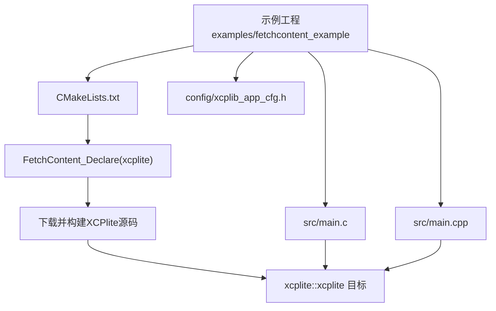
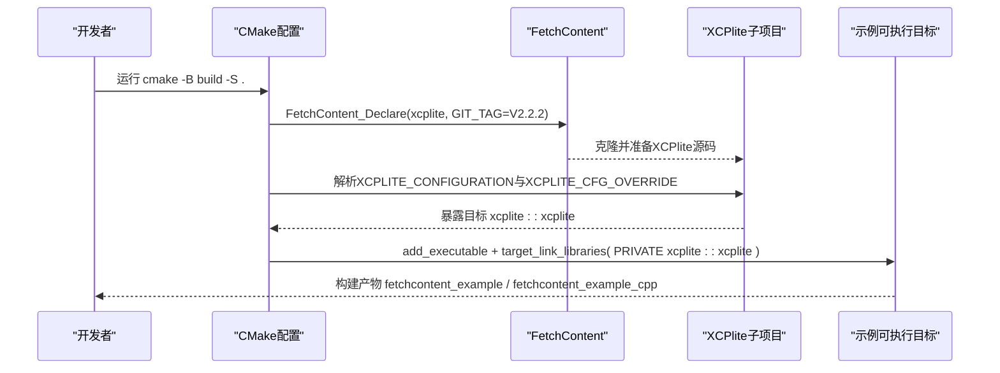
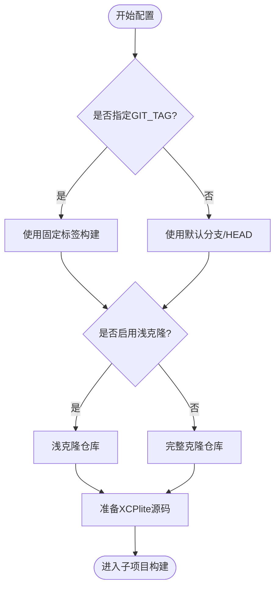
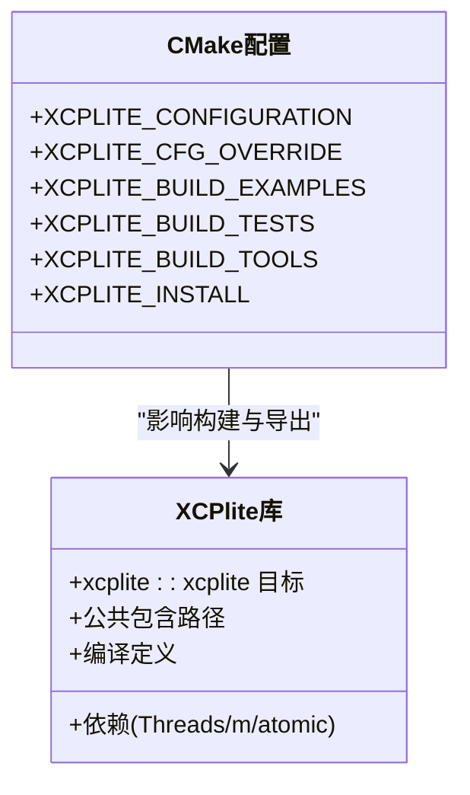
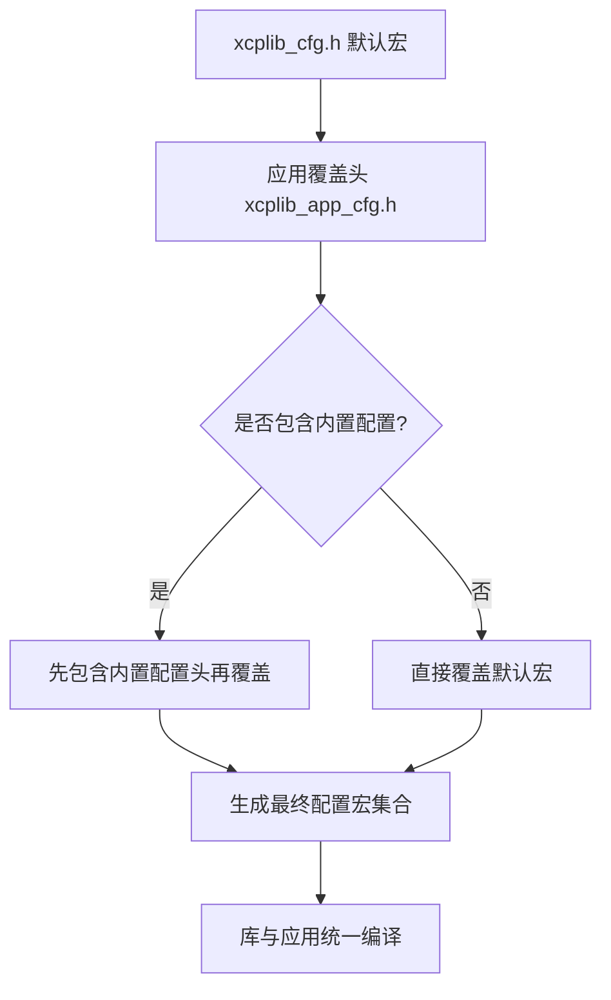
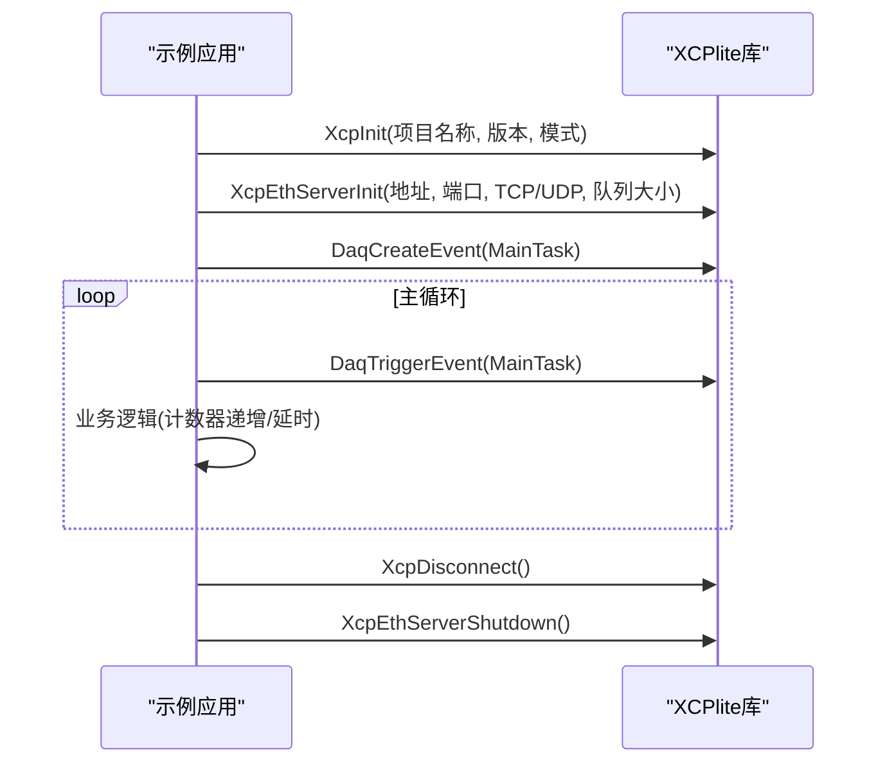
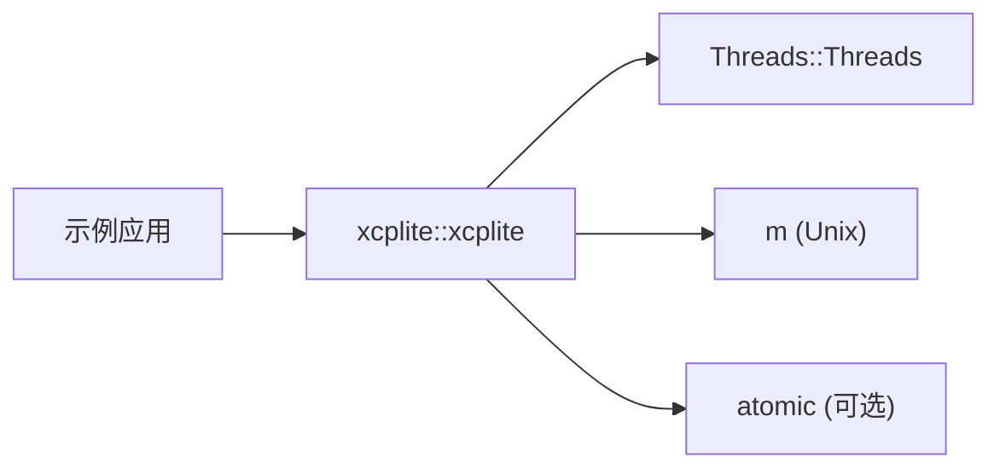

# FetchContent集成示例

<cite>
**本文引用的文件**
- [examples/fetchcontent_example/CMakeLists.txt](file://examples/fetchcontent_example/CMakeLists.txt)
- [examples/fetchcontent_example/README.md](file://examples/fetchcontent_example/README.md)
- [examples/fetchcontent_example/config/xcplib_app_cfg.h](file://examples/fetchcontent_example/config/xcplib_app_cfg.h)
- [examples/fetchcontent_example/src/main.c](file://examples/fetchcontent_example/src/main.c)
- [examples/fetchcontent_example/src/main.cpp](file://examples/fetchcontent_example/src/main.cpp)
- [examples/fetchcontent_example/test_build.sh](file://examples/fetchcontent_example/test_build.sh)
- [CMakeLists.txt](file://CMakeLists.txt)
- [cmake/xcpliteConfig.cmake.in](file://cmake/xcpliteConfig.cmake.in)
- [docs/xcplib_cfg.md](file://docs/xcplib_cfg.md)
</cite>

## 目录
1. [简介](#简介)
2. [项目结构](#项目结构)
3. [核心组件](#核心组件)
4. [架构总览](#架构总览)
5. [详细组件分析](#详细组件分析)
6. [依赖关系分析](#依赖关系分析)
7. [性能考虑](#性能考虑)
8. [故障排查指南](#故障排查指南)
9. [结论](#结论)
10. [附录：完整集成工作流](#附录完整集成工作流)

## 简介
本文件围绕XCPlite的FetchContent集成示例，系统说明如何通过CMake FetchContent模块在项目中直接获取并构建XCPlite源码，完成依赖管理、版本控制与构建系统集成。文档重点覆盖：
- CMake配置结构与自定义选项（编译标志、链接选项、平台特定设置）
- 应用配置头文件的生成与管理机制（配置宏定义与条件编译）
- 从项目初始化到最终构建的端到端工作流程
- 常见问题解决方案与性能优化建议
- 与其他第三方库的集成模式与冲突解决方法

## 项目结构
fetchcontent_example是一个独立的可构建示例工程，通过FetchContent将XCPlite作为子项目纳入自身构建树，无需预先安装XCPlite。其关键目录与职责如下：
- CMakeLists.txt：声明FetchContent、设置XCPlite版本与构建选项、创建可执行目标并链接xcplite::xcplite
- config/xcplib_app_cfg.h：应用级配置覆盖头文件，用于定制OPTION_*宏以裁剪功能与内存占用
- src/main.c / main.cpp：C与C++两个最小化XCP服务器示例，展示初始化、事件触发与A2L生成（可选）
- test_build.sh：便捷脚本，支持本地源码树构建、清理与编译器选择

图表来源
- [examples/fetchcontent_example/CMakeLists.txt:21-82](file://examples/fetchcontent_example/CMakeLists.txt#L21-L82)
- [CMakeLists.txt:245-258](file://CMakeLists.txt#L245-L258)

章节来源
- [examples/fetchcontent_example/README.md:12-24](file://examples/fetchcontent_example/README.md#L12-L24)
- [examples/fetchcontent_example/CMakeLists.txt:1-20](file://examples/fetchcontent_example/CMakeLists.txt#L1-L20)

## 核心组件
- FetchContent声明与版本锁定：通过GIT_REPOSITORY与GIT_TAG固定版本，支持浅克隆加速首次构建；可通过缓存变量或命令行参数切换仓库与标签
- XCPlite构建选项：XCPLITE_CONFIGURATION、XCPLITE_BUILD_EXAMPLES/TESTS/TOOLS等，控制库特性与是否构建示例/测试/工具
- 应用配置覆盖：XCPLITE_CFG_OVERRIDE指向应用自定义头文件，仅对default配置有效；该头文件在xcplib_cfg.h末尾被包含，允许#undef/#define OPTION_*宏
- 目标链接与接口：链接xcplite::xcplite后自动获得include路径、编译定义与依赖（Threads、m、atomic等）
- 平台与编译器标志：根据GNU/Clang/MSVC设置警告级别；RelWithDebInfo下为应用目标追加-O1以保留局部变量地址以便事件触发测量

章节来源
- [examples/fetchcontent_example/CMakeLists.txt:23-69](file://examples/fetchcontent_example/CMakeLists.txt#L23-L69)
- [examples/fetchcontent_example/CMakeLists.txt:71-117](file://examples/fetchcontent_example/CMakeLists.txt#L71-L117)
- [CMakeLists.txt:111-155](file://CMakeLists.txt#L111-L155)
- [CMakeLists.txt:204-243](file://CMakeLists.txt#L204-L243)

## 架构总览
下图展示了示例工程通过FetchContent引入XCPlite，并在同一构建树中编译与链接的整体流程。

图表来源
- [examples/fetchcontent_example/CMakeLists.txt:21-82](file://examples/fetchcontent_example/CMakeLists.txt#L21-L82)
- [CMakeLists.txt:245-258](file://CMakeLists.txt#L245-L258)

## 详细组件分析

### 组件A：FetchContent与版本控制
- 版本锁定：通过GIT_TAG固定到发布标签（如V2.2.2），确保可重复构建；也可改为分支或提交哈希
- 浅克隆：GIT_SHALLOW TRUE减少网络与磁盘开销
- 本地开发覆盖：通过FETCHCONTENT_SOURCE_DIR_XCPLITE指向本地已检出源码，避免网络拉取
- 命令行动态覆盖：可在cmake命令行直接修改XCPLITE_GIT_REPOSITORY与XCPLITE_GIT_TAG

图表来源
- [examples/fetchcontent_example/CMakeLists.txt:23-40](file://examples/fetchcontent_example/CMakeLists.txt#L23-L40)
- [examples/fetchcontent_example/README.md:115-127](file://examples/fetchcontent_example/README.md#L115-L127)

章节来源
- [examples/fetchcontent_example/CMakeLists.txt:23-40](file://examples/fetchcontent_example/CMakeLists.txt#L23-L40)
- [examples/fetchcontent_example/README.md:48-75](file://examples/fetchcontent_example/README.md#L48-L75)

### 组件B：XCPlite构建选项与配置
- XCPLITE_CONFIGURATION：选择内置配置（default/no_a2l/ptp/shm/rtos/raw），影响宏定义与可用功能
- 应用配置覆盖：XCPLITE_CFG_OVERRIDE仅在default配置下有效；头文件名需避开内置命名以避免冲突
- 构建开关：XCPLITE_BUILD_EXAMPLES/TESTS/TOOLS控制是否构建示例、测试与工具
- 安装规则：当作为子项目时默认不安装；如需随父项目安装可显式开启XCPLITE_INSTALL

图表来源
- [CMakeLists.txt:111-155](file://CMakeLists.txt#L111-L155)
- [CMakeLists.txt:245-311](file://CMakeLists.txt#L245-L311)

章节来源
- [CMakeLists.txt:111-155](file://CMakeLists.txt#L111-L155)
- [examples/fetchcontent_example/CMakeLists.txt:42-69](file://examples/fetchcontent_example/CMakeLists.txt#L42-L69)

### 组件C：应用配置头文件机制
- xcplib_app_cfg.h：通过#undef/#define OPTION_*对默认配置进行覆盖，实现功能裁剪与内存优化
- 生效时机：在xcplib_cfg.h末尾被包含；库与应用必须使用相同配置，CMake通过PUBLIC用法要求保证一致性
- 典型覆盖项：日志级别、校准段管理、DAQ内存、MTU、队列类型、传输层（UDP/TCP）等

图表来源
- [examples/fetchcontent_example/config/xcplib_app_cfg.h:1-30](file://examples/fetchcontent_example/config/xcplib_app_cfg.h#L1-L30)
- [docs/xcplib_cfg.md:1-24](file://docs/xcplib_cfg.md#L1-L24)

章节来源
- [examples/fetchcontent_example/config/xcplib_app_cfg.h:32-112](file://examples/fetchcontent_example/config/xcplib_app_cfg.h#L32-L112)
- [docs/xcplib_cfg.md:1-24](file://docs/xcplib_cfg.md#L1-L24)

### 组件D：示例应用与API调用流程
- C与C++示例均初始化XCP、启动以太网服务器、创建事件并周期性触发测量
- 可选A2L生成：若启用运行时A2L生成，则在连接时生成/写入A2L文件
- 信号处理：捕获SIGINT/SIGTERM优雅退出，关闭服务器与资源

图表来源
- [examples/fetchcontent_example/src/main.c:67-126](file://examples/fetchcontent_example/src/main.c#L67-L126)
- [examples/fetchcontent_example/src/main.cpp:60-118](file://examples/fetchcontent_example/src/main.cpp#L60-L118)

章节来源
- [examples/fetchcontent_example/src/main.c:1-127](file://examples/fetchcontent_example/src/main.c#L1-L127)
- [examples/fetchcontent_example/src/main.cpp:1-119](file://examples/fetchcontent_example/src/main.cpp#L1-L119)

## 依赖关系分析
- 外部依赖：Threads（线程）、m（数学库，Unix）、atomic（部分平台原子支持）
- 内部依赖：xcplite::xcplite目标提供包含路径、编译定义与依赖传播
- 包配置：安装后可通过find_package(xcplite)消费；xcpliteConfig.cmake.in注入已安装的配置信息

图表来源
- [CMakeLists.txt:297-311](file://CMakeLists.txt#L297-L311)
- [cmake/xcpliteConfig.cmake.in:1-29](file://cmake/xcpliteConfig.cmake.in#L1-L29)

章节来源
- [CMakeLists.txt:297-311](file://CMakeLists.txt#L297-L311)
- [cmake/xcpliteConfig.cmake.in:1-29](file://cmake/xcpliteConfig.cmake.in#L1-L29)

## 性能考虑
- 构建类型与优化：RelWithDebInfo下为应用目标追加-O1，使更多局部变量驻留内存，利于事件触发时的栈上测量；库本身无被测局部变量，保持构建类型默认优化
- 帧指针与尾调用：事件触发函数使用__builtin_frame_address强制帧指针；触发宏末尾使用XCP_NO_TAIL_CALL避免尾调用优化导致丢失上下文
- 队列与内存：通过OPTION_QUEUE_32/64_VAR_SIZE/64_FIX_SIZE选择队列实现；DAQ_MEM_SIZE与CAL相关宏控制内存占用
- MTU与网络：合理设置OPTION_MTU，避免分片；必要时启用Jumbo Frames并验证网络路径

章节来源
- [examples/fetchcontent_example/CMakeLists.txt:92-110](file://examples/fetchcontent_example/CMakeLists.txt#L92-L110)
- [examples/fetchcontent_example/config/xcplib_app_cfg.h:82-112](file://examples/fetchcontent_example/config/xcplib_app_cfg.h#L82-L112)
- [docs/xcplib_cfg.md:30-63](file://docs/xcplib_cfg.md#L30-L63)

## 故障排查指南
- 配置不可见错误：若应用未看到__XCPLIB_CFG_H__，检查XCPLITE_CFG_OVERRIDE是否正确设置且位于default配置下
- 名称冲突：应用覆盖头文件名不得与内置配置同名（如xcplib_no_a2l_cfg.h），否则会被优先找到导致意外行为
- 构建失败：确认已安装git与网络可达；首次配置会克隆仓库；若离线环境，使用FETCHCONTENT_SOURCE_DIR_XCPLITE指向本地源码
- 平台差异：Windows/macOS/Linux的编译器标志与依赖不同，确保正确检测与链接（如m、atomic）
- A2L生成：若启用运行时A2L生成，确保A2L_MODE与XCP_MODE匹配，并在连接时完成写入/最终化

章节来源
- [examples/fetchcontent_example/config/xcplib_app_cfg.h:1-30](file://examples/fetchcontent_example/config/xcplib_app_cfg.h#L1-L30)
- [CMakeLists.txt:68-108](file://CMakeLists.txt#L68-L108)
- [examples/fetchcontent_example/README.md:87-113](file://examples/fetchcontent_example/README.md#L87-L113)

## 结论
通过CMake FetchContent集成XCPlite，可以在单一构建树内完成依赖拉取、版本锁定与构建，简化CI与跨平台场景。结合应用配置头文件，能够灵活裁剪功能与内存占用，并通过统一的xcplite::xcplite目标获得一致的接口与依赖管理。遵循本文的工作流与最佳实践，可高效、稳定地将XCPlite集成至各类C/C++项目。

## 附录：完整集成工作流
以下为从零开始的端到端步骤，适用于Linux/macOS/Windows（注意平台差异）：

- 准备环境
  - 安装CMake（>=3.14）、Git、C/C++编译器
  - 确保首次配置时可访问网络以克隆XCPlite仓库

- 克隆示例工程
  - 进入examples/fetchcontent_example目录

- 配置与构建
  - 标准构建：./test_build.sh
  - 使用本地源码树构建（无需网络）：./test_build.sh local
  - 指定编译器：./test_build.sh gcc 或 ./test_build.sh clang
  - 清理构建：./test_build.sh clean

- 运行示例
  - 构建产物位于build目录：fetchcontent_example（C）与fetchcontent_example_cpp（C++）
  - 启动后可通过CANape或其他XCP客户端连接对应端口进行测量与标定

- 自定义配置
  - 编辑config/xcplib_app_cfg.h调整OPTION_*宏（如日志级别、DAQ内存、MTU、队列类型等）
  - 如需基于内置配置扩展，可在覆盖头中先#include内置配置头再进行覆盖

- 版本与仓库控制
  - 修改CMakeLists.txt中的XCPLITE_GIT_REPOSITORY与XCPLITE_GIT_TAG以切换版本
  - 或通过命令行：cmake -DXCPLITE_GIT_REPOSITORY=... -DXCPLITE_GIT_TAG=...

- 与第三方库集成
  - 通过target_link_libraries添加其他库；注意避免与XCPlite的编译定义冲突
  - 若第三方库也使用FetchContent，确保各自源目录隔离（FetchContent默认在build/_deps下隔离）
  - 对于共享头或宏冲突，使用命名空间或重命名策略，或在覆盖头中谨慎#undef/#define

- 性能调优
  - 使用RelWithDebInfo并保留-O1以获得更好的调试与测量能力
  - 根据应用需求调整DAQ_MEM_SIZE、队列实现与MTU
  - 禁用不必要的功能（如校准段、持久化、动态事件）以减少内存与代码体积

章节来源
- [examples/fetchcontent_example/README.md:26-46](file://examples/fetchcontent_example/README.md#L26-L46)
- [examples/fetchcontent_example/test_build.sh:1-64](file://examples/fetchcontent_example/test_build.sh#L1-L64)
- [examples/fetchcontent_example/CMakeLists.txt:23-69](file://examples/fetchcontent_example/CMakeLists.txt#L23-L69)
- [docs/xcplib_cfg.md:1-24](file://docs/xcplib_cfg.md#L1-L24)