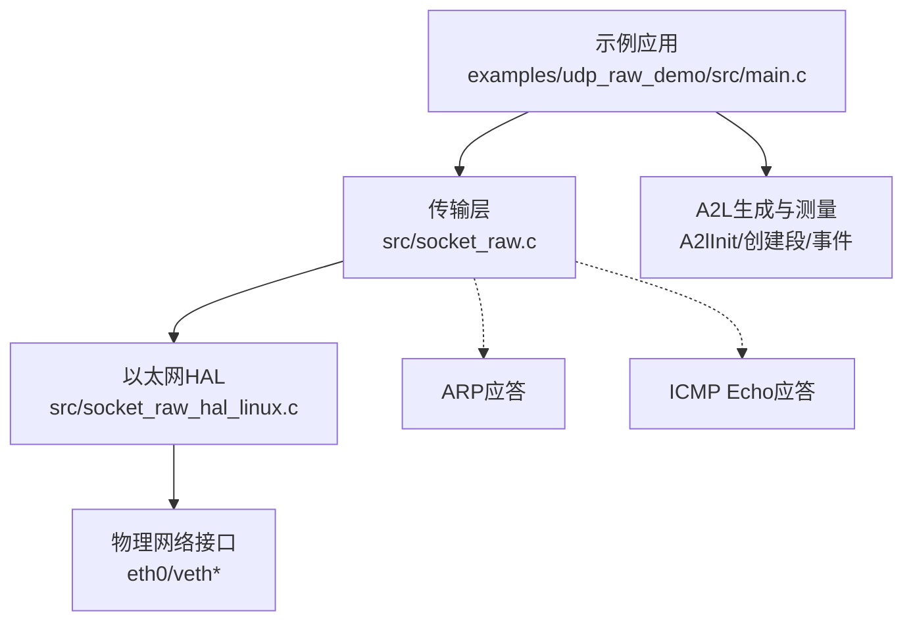
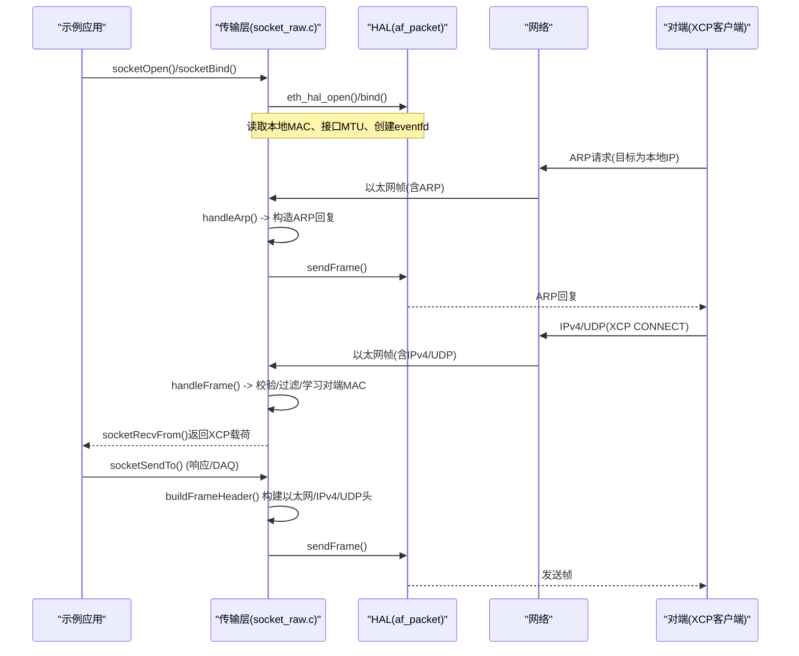
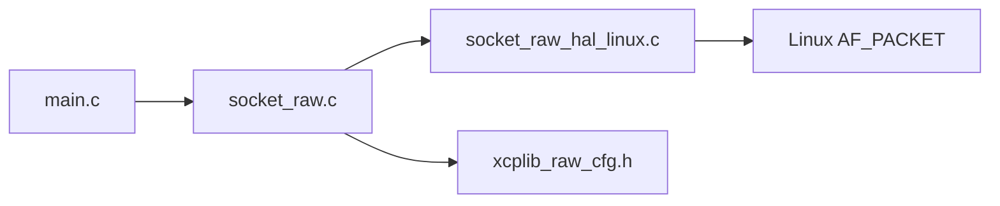

# UDP原始套接字示例

<cite>
**本文引用的文件**
- [examples/udp_raw_demo/src/main.c](file://examples/udp_raw_demo/src/main.c)
- [src/socket_raw.c](file://src/socket_raw.c)
- [src/socket_raw_hal_linux.c](file://src/socket_raw_hal_linux.c)
- [src/socket_raw_hal.h](file://src/socket_raw_hal.h)
- [docs/SOCKET_RAW.md](file://docs/SOCKET_RAW.md)
- [examples/udp_raw_demo/README.md](file://examples/udp_raw_demo/README.md)
- [src/xcplib_raw_cfg.h](file://src/xcplib_raw_cfg.h)
</cite>

## 目录
1. [简介](#简介)
2. [项目结构](#项目结构)
3. [核心组件](#核心组件)
4. [架构总览](#架构总览)
5. [详细组件分析](#详细组件分析)
6. [依赖关系分析](#依赖关系分析)
7. [性能考量](#性能考量)
8. [故障排除指南](#故障排除指南)
9. [结论](#结论)
10. [附录](#附录)

## 简介
本文件围绕“UDP原始套接字示例”展开，重点说明基于原始以太网HAL的XCP over UDP实现。该实现不依赖操作系统TCP/IP协议栈，直接在以太网帧级别构建IPv4/UDP头部、处理ARP与ICMP Echo，并通过原始以太网接口收发数据。文档涵盖数据包格式、网络接口配置、IP地址绑定机制、无TCP/IP栈环境下的通信原理、命令行参数解析、权限设置（CAP_NET_RAW）、网络测试方法、防火墙与端口配置、以及性能优化建议与最佳实践。

## 项目结构
- 示例应用：examples/udp_raw_demo/src/main.c 提供命令行参数解析、服务器初始化、A2L生成、测量事件与主循环。
- 传输层：src/socket_raw.c 实现UDP/IPv4、ARP应答、ICMP Echo应答、接收过滤与超时控制、发送路径等。
- HAL后端：src/socket_raw_hal_linux.c 基于Linux AF_PACKET实现原始以太网收发；src/socket_raw_hal.h 定义HAL接口契约。
- 配置：src/xcplib_raw_cfg.h 启用RAW传输、设置MTU、队列模式与可选特性开关。
- 文档：docs/SOCKET_RAW.md 详细说明设计、编译选项、API子集、架构、测试流程与零拷贝等。

图表来源
- [examples/udp_raw_demo/src/main.c:103-178](file://examples/udp_raw_demo/src/main.c#L103-L178)
- [src/socket_raw.c:413-526](file://src/socket_raw.c#L413-L526)
- [src/socket_raw_hal_linux.c:55-148](file://src/socket_raw_hal_linux.c#L55-L148)

章节来源
- [examples/udp_raw_demo/src/main.c:1-209](file://examples/udp_raw_demo/src/main.c#L1-L209)
- [docs/SOCKET_RAW.md:1-160](file://docs/SOCKET_RAW.md#L1-L160)

## 核心组件
- 示例应用（main.c）
  - 命令行参数解析：--if、--ip、--port，默认值与校验逻辑。
  - XCP服务器初始化：指定本地IPv4地址与端口，禁用TCP（raw仅UDP）。
  - A2L与测量：创建校准段、测量事件与变量。
- 传输层（socket_raw.c）
  - 数据包格式：以太网头、IPv4头、UDP头、ARP头、ICMP头结构体定义与常量。
  - 地址与校验：本地IP有效性检查、IPv4/UDP校验和计算。
  - 接收路径：按EtherType分类、MAC/IP/端口过滤、ARP/ICMP处理、学习对端MAC。
  - 发送路径：构建以太网/IPv4/UDP头、写入对端MAC与端口、可选UDP校验。
  - 错误处理：统一错误码与字符串映射，区分HAL错误、尺寸超限、未知对端等。
- HAL后端（socket_raw_hal_linux.c）
  - 使用AF_PACKET/SOCK_RAW/ETH_P_ALL监听所有类型帧。
  - 获取接口索引、MAC、MTU；绑定到指定接口；忽略自发自收。
  - 通过eventfd+poll实现可中断阻塞接收，支持立即唤醒关闭。
- 配置（xcplib_raw_cfg.h）
  - 启用OPTION_ENABLE_UDP_RAW，强制OPTION_QUEUE_32，设置OPTION_MTU=1420。
  - 可选：ICMP Echo、UDP校验计算/硬件插入、接收校验验证、 Gratuitous ARP、零拷贝。

章节来源
- [examples/udp_raw_demo/src/main.c:67-178](file://examples/udp_raw_demo/src/main.c#L67-L178)
- [src/socket_raw.c:57-131](file://src/socket_raw.c#L57-L131)
- [src/socket_raw.c:203-238](file://src/socket_raw.c#L203-L238)
- [src/socket_raw.c:413-526](file://src/socket_raw.c#L413-L526)
- [src/socket_raw.c:725-755](file://src/socket_raw.c#L725-L755)
- [src/socket_raw_hal_linux.c:55-148](file://src/socket_raw_hal_linux.c#L55-L148)
- [src/xcplib_raw_cfg.h:36-105](file://src/xcplib_raw_cfg.h#L36-L105)

## 架构总览
下图展示从应用到网络的完整调用链与数据流，包括ARP/ICMP在内联处理与接收过滤。

图表来源
- [src/socket_raw.c:282-319](file://src/socket_raw.c#L282-L319)
- [src/socket_raw.c:413-526](file://src/socket_raw.c#L413-L526)
- [src/socket_raw.c:725-755](file://src/socket_raw.c#L725-L755)
- [src/socket_raw_hal_linux.c:176-255](file://src/socket_raw_hal_linux.c#L176-L255)

## 详细组件分析

### 数据包格式与头部构建
- 以太网头：目的MAC、源MAC、EtherType（IPv4或ARP）。
- IPv4头：版本/长度、TOS、总长度、标识、标志/片偏移、TTL、协议、校验和、源/目的IP（网络序）。
- UDP头：源/目的端口、长度、校验和（可为0或软件计算/硬件插入）。
- ARP头：硬件类型、协议类型、硬件/协议长度、操作码、发送方/目标方MAC与IP。
- ICMP头：类型、代码、校验和（Echo Request/Reply）。

构建要点
- 小端主机需进行字节序转换；IPv4/UDP字段在网络序下直接写入。
- IPv4总长度包含IPv4头+UDP头+载荷；DF位设置禁止分片。
- UDP校验和可选择：0（合法）、软件计算（RFC 768伪头+UDP头+载荷）、硬件插入。
- 校验和计算采用RFC 1071算法，IPv4头校验在发送前清零后计算。

章节来源
- [src/socket_raw.c:57-131](file://src/socket_raw.c#L57-L131)
- [src/socket_raw.c:203-238](file://src/socket_raw.c#L203-L238)
- [src/socket_raw.c:725-755](file://src/socket_raw.c#L725-L755)

### 无TCP/IP栈环境下的网络通信原理
- ARP处理：仅应答模式。收到针对本地IP的ARP请求时，构造ARP回复并发送；不主动发起ARP请求，避免被无关主机误导。
- IPv4头部构建：每次发送时构建，设置DF位、递增标识、计算校验和；接收时校验版本、长度、协议、IP地址匹配与可选校验和验证。
- 错误处理策略：
  - 非法地址：拒绝0.0.0.0、广播、组播、回环地址。
  - 帧过大：返回特定错误（ETH_HAL_ERROR_SIZE），提示降低OPTION_MTU。
  - 未知对端：首次发送前必须已接收过数据以学习对端MAC。
  - 截断帧：丢弃而非截断，避免上层出现“Corrupt message received!”。
  - 分片帧：直接丢弃并告警，因为未实现重组。

章节来源
- [src/socket_raw.c:243-255](file://src/socket_raw.c#L243-L255)
- [src/socket_raw.c:282-319](file://src/socket_raw.c#L282-L319)
- [src/socket_raw.c:413-526](file://src/socket_raw.c#L413-L526)
- [src/socket_raw.c:758-799](file://src/socket_raw.c#L758-L799)

### 网络接口配置与IP地址绑定机制
- 接口选择：通过socketRawSetInterface(ifname)在启动前指定；默认来自配置（如eth0）。
- IP绑定：XcpEthServerInit传入具体IPv4地址；socketBind拒绝ANY/广播/组播/回环，确保无IP栈环境下地址明确。
- MAC获取：由HAL提供本地MAC；用于以太网头源地址与ARP回复。
- 可选Gratuitous ARP：绑定后可主动广播自身IP/MAC，加速交换机MAC表与客户端ARP缓存预热。

章节来源
- [examples/udp_raw_demo/src/main.c:103-156](file://examples/udp_raw_demo/src/main.c#L103-L156)
- [src/socket_raw.c:539-629](file://src/socket_raw.c#L539-L629)
- [src/socket_raw_hal_linux.c:55-148](file://src/socket_raw_hal_linux.c#L55-L148)

### 命令行参数解析与权限设置
- 参数：--if（接口名）、--ip（本地IPv4地址）、--port（UDP端口）。
- 地址解析：解析a.b.c.d并校验每段范围；无效则退出。
- 权限：需要CAP_NET_RAW；可通过setcap授予二进制文件或root运行。
- 帮助信息：打印用法、默认值、权限要求与网络设置参考。

章节来源
- [examples/udp_raw_demo/src/main.c:67-123](file://examples/udp_raw_demo/src/main.c#L67-L123)
- [examples/udp_raw_demo/README.md:60-79](file://examples/udp_raw_demo/README.md#L60-L79)
- [src/socket_raw_hal_linux.c:72-84](file://src/socket_raw_hal_linux.c#L72-L84)

### 网络测试方法与验证步骤
- ping测试：验证以太网HAL、MAC过滤、ARP应答、IPv4头与校验和。
- arping：隔离ARP行为。
- tcpdump：抓包观察帧结构与校验和；开启UDP校验计算以便工具验证。
- xcpclient连接：CONNECT/GET_STATUS/UPLOAD/DOWNLOAD/DAQ测量。
- 隔离环境：使用veth对与网络命名空间，避免内核抢占ARP/ICMP。

章节来源
- [docs/SOCKET_RAW.md:321-383](file://docs/SOCKET_RAW.md#L321-L383)
- [examples/udp_raw_demo/README.md:83-105](file://examples/udp_raw_demo/README.md#L83-L105)

### 完整的网络配置指南（防火墙、端口、故障排除）
- 防火墙设置：
  - 允许UDP端口入站（默认5555）。
  - 若启用ICMP Echo，允许ICMP Echo Request/Reply。
  - 注意避免内核拦截：目标IP不应被系统接口占用。
- 端口配置：
  - 通过--port指定；确保不与其它服务冲突。
  - 在路由器/NAT环境中，确保端口转发规则指向目标设备。
- 故障排除：
  - 无法ping：检查CAP_NET_RAW、接口是否存在、目标IP是否被内核占用。
  - 无法CONNECT：确认对端能解析本机IP（ARP）、端口可达、防火墙放行。
  - 帧过大：降低OPTION_MTU，使单帧不超过链路MTU+14。
  - VLAN标签：当前实现不支持802.1Q，会丢弃并告警。

章节来源
- [docs/SOCKET_RAW.md:32-79](file://docs/SOCKET_RAW.md#L32-L79)
- [docs/SOCKET_RAW.md:188-217](file://docs/SOCKET_RAW.md#L188-L217)
- [examples/udp_raw_demo/README.md:77-79](file://examples/udp_raw_demo/README.md#L77-L79)

## 依赖关系分析
- 应用依赖传输层API（sockets.h子集）：socketOpen/Bind/RecvFrom/SendTo/SetTimeout/Shutdown/Close。
- 传输层依赖HAL接口：eth_hal_open/close/get_mac/send/recv/wakeup。
- 配置影响编译与运行时行为：MTU、队列模式、校验和策略、ICMP Echo、Gratuitous ARP、零拷贝。

图表来源
- [examples/udp_raw_demo/src/main.c:103-178](file://examples/udp_raw_demo/src/main.c#L103-L178)
- [src/socket_raw.c:531-629](file://src/socket_raw.c#L531-L629)
- [src/socket_raw_hal_linux.c:55-148](file://src/socket_raw_hal_linux.c#L55-L148)
- [src/xcplib_raw_cfg.h:36-105](file://src/xcplib_raw_cfg.h#L36-L105)

章节来源
- [src/socket_raw_hal.h:1-108](file://src/socket_raw_hal.h#L1-L108)
- [docs/SOCKET_RAW.md:116-137](file://docs/SOCKET_RAW.md#L116-L137)

## 性能考量
- 零拷贝发送（OPTION_UDP_RAW_ZERO_COPY）：在队列段前预留头部空间，直接写入以太网/IPv4/UDP头，避免复制载荷；在嵌入式目标上显著减少内存带宽消耗。
- 接收过滤顺序：优先按EtherType、MAC、IPv4完整性、协议、端口快速丢弃非目标帧，降低CPU开销。
- 超时与调度：接收循环使用绝对截止时间与切片等待，避免忙轮询；shutdown通过eventfd立即唤醒。
- 校验和策略：开发阶段启用UDP软件校验便于工具验证；生产环境可使用硬件插入或零校验以降低CPU负载。
- MTU与帧大小：确保OPTION_MTU适配链路MTU；避免分片与丢包；必要时调整队列与累积策略。

章节来源
- [docs/SOCKET_RAW.md:385-447](file://docs/SOCKET_RAW.md#L385-L447)
- [src/socket_raw.c:672-720](file://src/socket_raw.c#L672-L720)
- [src/socket_raw.c:413-526](file://src/socket_raw.c#L413-L526)

## 故障排除指南
- 权限问题：
  - 现象：AF_PACKET socket denied。
  - 解决：授予CAP_NET_RAW（sudo setcap cap_net_raw+ep <binary>）或以root运行。
- 地址冲突：
  - 现象：内核占用目标IP导致ARP/ICMP抢先响应。
  - 解决：使用空闲IP，不在DHCP池内，且不被系统接口绑定。
- 帧过大：
  - 现象：ETH_HAL_ERROR_SIZE或EMSGSIZE。
  - 解决：降低OPTION_MTU，确保单帧不超过链路MTU+14。
- VLAN标签：
  - 现象：802.1Q帧被丢弃。
  - 解决：当前实现不支持VLAN；使用untagged链路或外部封装。
- 校验和错误：
  - 现象：tcpdump/Wireshark报bad ip cksum或UDP校验失败。
  - 解决：临时启用UDP软件校验；检查IPv4头构建与校验和计算。

章节来源
- [src/socket_raw_hal_linux.c:72-84](file://src/socket_raw_hal_linux.c#L72-L84)
- [src/socket_raw.c:758-799](file://src/socket_raw.c#L758-L799)
- [docs/SOCKET_RAW.md:32-79](file://docs/SOCKET_RAW.md#L32-L79)

## 结论
本示例展示了在无TCP/IP栈环境下，通过原始以太网HAL实现XCP over UDP的完整方案。其核心在于精确的数据包格式构建、严格的接收过滤与错误处理、以及对ARP与ICMP的内联应答。通过合理的配置（MTU、队列、校验策略）与测试流程（ping、arping、tcpdump、xcpclient），可在真实网络或隔离环境中稳定运行。零拷贝与高效过滤进一步提升了性能，适用于嵌入式目标与高吞吐场景。

## 附录
- 构建与运行
  - 构建：./build.sh raw examples 或 cmake -B build-raw -S . -DXCPLITE_CONFIGURATION=raw ...
  - 运行：sudo ./test/test_socket_raw.sh 或手动启动udp_raw_demo --if eth0 --ip 192.168.1.240
- 使用xcpclient
  - 下载A2L：--upload-a2l --a2l ./udp_raw_demo.a2l
  - 列出变量：--list-mea . --list-cal .
  - 测量：--mea counter --time 2
- 移植到无IP栈目标
  - 实现socket_raw_hal.h中的eth_hal_*函数；保持上层UDP/IPv4/ARP/ICMP不变。

章节来源
- [examples/udp_raw_demo/README.md:40-105](file://examples/udp_raw_demo/README.md#L40-L105)
- [examples/udp_raw_demo/README.md:131-179](file://examples/udp_raw_demo/README.md#L131-L179)
- [examples/udp_raw_demo/README.md:206-228](file://examples/udp_raw_demo/README.md#L206-L228)