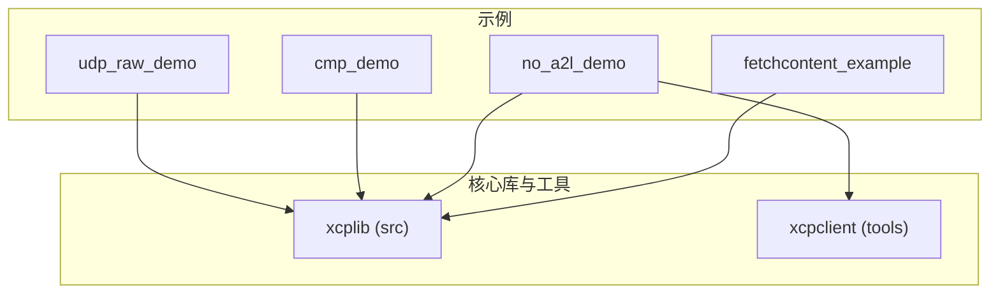
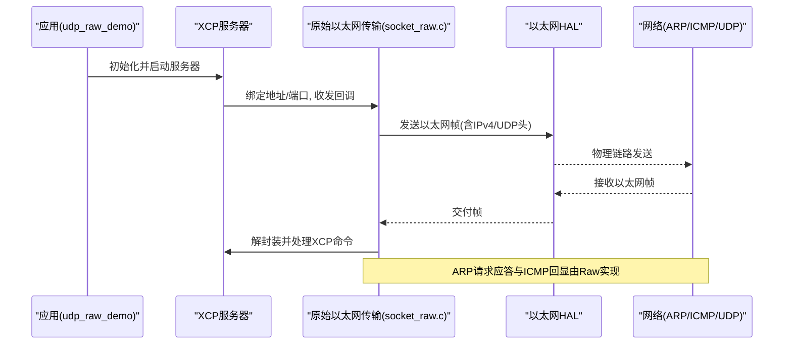
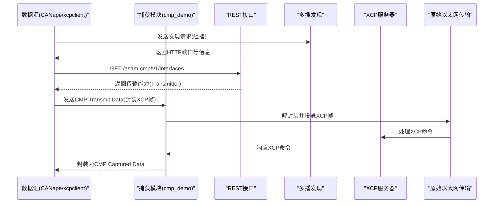
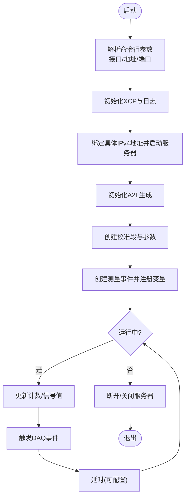
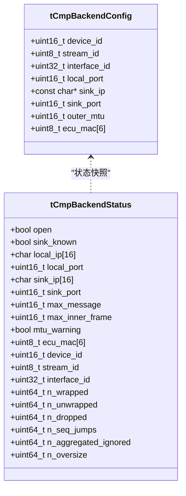
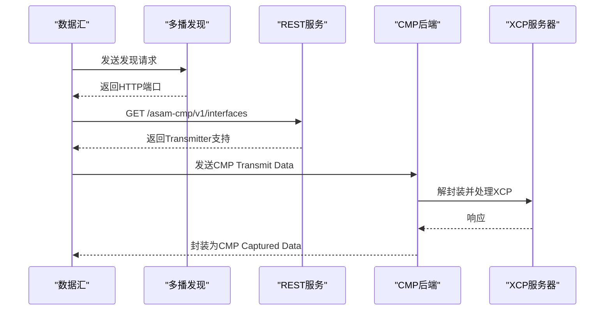
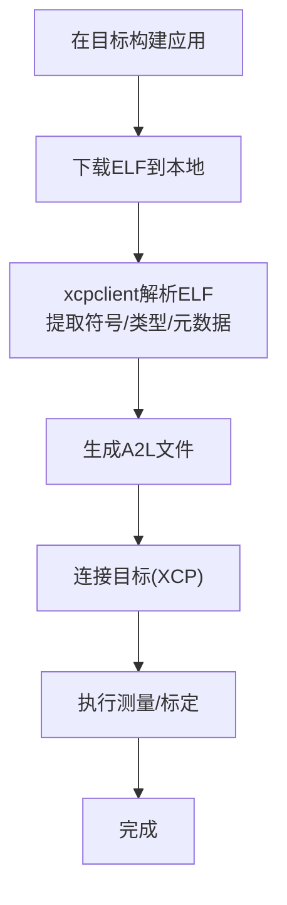
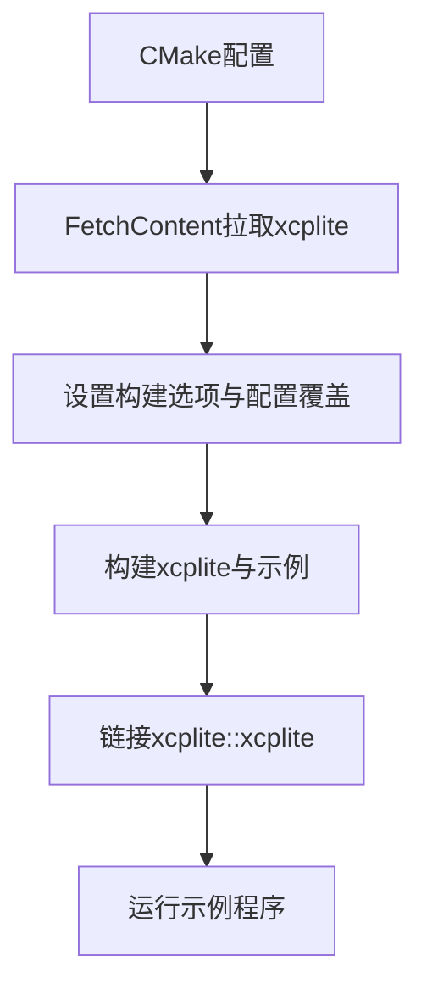
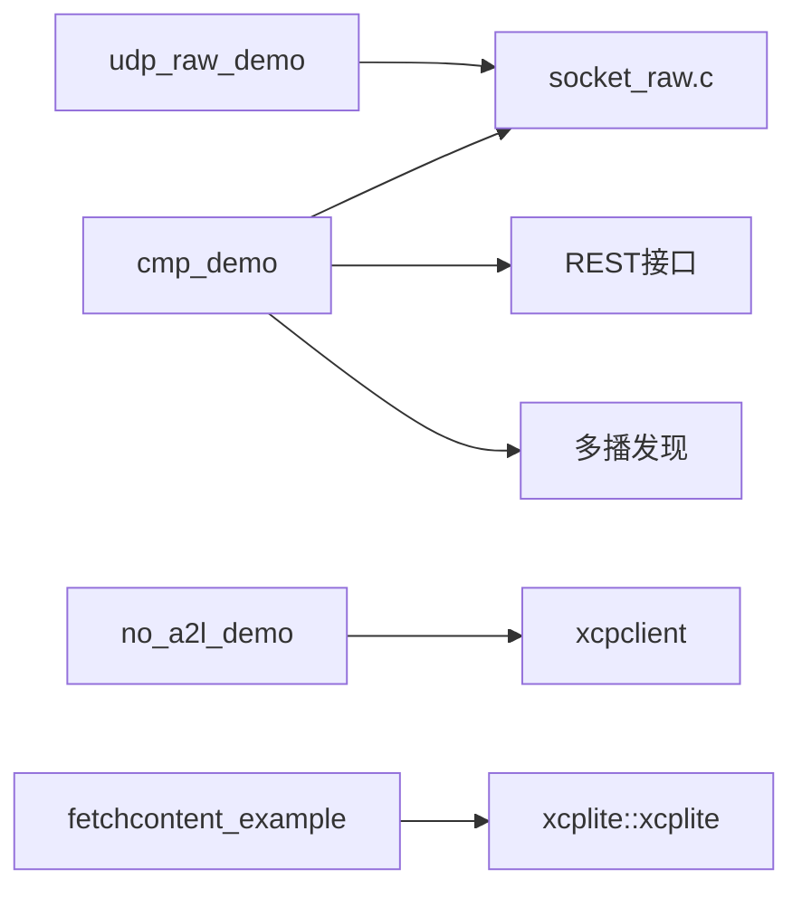

# 传输协议示例

<cite>
**本文引用的文件**
- [examples/udp_raw_demo/src/main.c](file://examples/udp_raw_demo/src/main.c)
- [examples/udp_raw_demo/README.md](file://examples/udp_raw_demo/README.md)
- [src/socket_raw.c](file://src/socket_raw.c)
- [examples/cmp_demo/src/main.c](file://examples/cmp_demo/src/main.c)
- [examples/cmp_demo/src/cmp_backend.h](file://examples/cmp_demo/src/cmp_backend.h)
- [examples/cmp_demo/src/cmp_discovery.h](file://examples/cmp_demo/src/cmp_discovery.h)
- [examples/cmp_demo/src/cmp_rest.h](file://examples/cmp_demo/src/cmp_rest.h)
- [examples/cmp_demo/src/cmp_transport_udp.c](file://examples/cmp_demo/src/cmp_transport_udp.c)
- [examples/no_a2l_demo/src/main.c](file://examples/no_a2l_demo/src/main.c)
- [examples/no_a2l_demo/create_a2l.sh](file://examples/no_a2l_demo/create_a2l.sh)
- [examples/fetchcontent_example/CMakeLists.txt](file://examples/fetchcontent_example/CMakeLists.txt)
- [examples/fetchcontent_example/src/main.c](file://examples/fetchcontent_example/src/main.c)
</cite>

## 目录
1. [简介](#简介)
2. [项目结构](#项目结构)
3. [核心组件](#核心组件)
4. [架构总览](#架构总览)
5. [详细组件分析](#详细组件分析)
6. [依赖关系分析](#依赖关系分析)
7. [性能考量](#性能考量)
8. [故障排查指南](#故障排查指南)
9. [结论](#结论)
10. [附录](#附录)

## 简介
本文件围绕四个传输协议相关示例，系统阐述其设计、实现与使用要点：
- udp_raw_demo：基于原始以太网（无TCP/IP栈）的UDP/XCP实现，涵盖数据包格式、错误处理与重传策略。
- cmp_demo：通过ASAM CMP封装XCP，展示自定义后端、服务发现与REST API集成。
- no_a2l_demo：运行时A2L生成（离线ELF→A2L），包括元数据提取、动态类型识别与文件格式生成流程。
- fetchcontent_example：通过CMake FetchContent集成XCPlite库的方法，覆盖CMake配置、依赖管理与版本控制。

此外，提供不同传输协议的选型指导与性能对比分析，帮助读者在工程实践中做出合理选择。

## 项目结构
四个示例分别位于 examples 目录下，各自包含独立的源码、构建脚本与文档说明；核心传输与工具能力由 src 与 tools 提供支撑。

**图表来源**
- [examples/udp_raw_demo/src/main.c:1-209](file://examples/udp_raw_demo/src/main.c#L1-L209)
- [examples/cmp_demo/src/main.c:1-370](file://examples/cmp_demo/src/main.c#L1-L370)
- [examples/no_a2l_demo/src/main.c:1-340](file://examples/no_a2l_demo/src/main.c#L1-L340)
- [examples/fetchcontent_example/CMakeLists.txt:1-117](file://examples/fetchcontent_example/CMakeLists.txt#L1-L117)
- [src/socket_raw.c:1-200](file://src/socket_raw.c#L1-L200)

**章节来源**
- [examples/udp_raw_demo/src/main.c:1-209](file://examples/udp_raw_demo/src/main.c#L1-L209)
- [examples/cmp_demo/src/main.c:1-370](file://examples/cmp_demo/src/main.c#L1-L370)
- [examples/no_a2l_demo/src/main.c:1-340](file://examples/no_a2l_demo/src/main.c#L1-L340)
- [examples/fetchcontent_example/CMakeLists.txt:1-117](file://examples/fetchcontent_example/CMakeLists.txt#L1-L117)

## 核心组件
- 原始UDP套接字传输（udp_raw_demo + socket_raw.c）
  - 在目标无TCP/IP栈时，由xcplib自行构建以太网/IPv4/UDP帧，并通过HAL发送接收。
  - 支持ARP请求应答与ICMP回显，便于基础连通性验证。
- CMP隧道（cmp_demo）
  - 将XCP帧封装进CMP消息，通过普通UDP套接字在“捕获模块”与“数据汇”之间传输。
  - 提供基于多播的服务发现与只读REST接口，供数据汇自动发现并启用传输能力。
- 运行时A2L生成（no_a2l_demo）
  - 应用侧不生成A2L文件，运行期通过xcpclient从目标ELF解析符号、类型与元数据，离线生成A2L。
  - 支持复杂类型、枚举、数组、结构体等动态识别。
- CMake FetchContent集成（fetchcontent_example）
  - 通过FetchContent在配置阶段拉取XCPlite源码，统一构建与链接，支持版本锁定与应用层配置覆盖。

**章节来源**
- [src/socket_raw.c:1-200](file://src/socket_raw.c#L1-L200)
- [examples/cmp_demo/src/cmp_backend.h:1-75](file://examples/cmp_demo/src/cmp_backend.h#L1-L75)
- [examples/cmp_demo/src/cmp_discovery.h:1-65](file://examples/cmp_demo/src/cmp_discovery.h#L1-L65)
- [examples/cmp_demo/src/cmp_rest.h:1-41](file://examples/cmp_demo/src/cmp_rest.h#L1-L41)
- [examples/no_a2l_demo/create_a2l.sh:1-178](file://examples/no_a2l_demo/create_a2l.sh#L1-L178)
- [examples/fetchcontent_example/CMakeLists.txt:1-117](file://examples/fetchcontent_example/CMakeLists.txt#L1-L117)

## 架构总览
下图展示了udp_raw_demo与socket_raw.c之间的调用关系与数据路径，以及cmp_demo中CMP封装与REST/发现机制的交互。

**图表来源**
- [examples/udp_raw_demo/src/main.c:132-158](file://examples/udp_raw_demo/src/main.c#L132-L158)
- [src/socket_raw.c:1-200](file://src/socket_raw.c#L1-L200)

**图表来源**
- [examples/cmp_demo/src/main.c:283-304](file://examples/cmp_demo/src/main.c#L283-L304)
- [examples/cmp_demo/src/cmp_discovery.h:37-65](file://examples/cmp_demo/src/cmp_discovery.h#L37-L65)
- [examples/cmp_demo/src/cmp_rest.h:8-41](file://examples/cmp_demo/src/cmp_rest.h#L8-L41)
- [examples/cmp_demo/src/cmp_transport_udp.c:67-200](file://examples/cmp_demo/src/cmp_transport_udp.c#L67-L200)

## 详细组件分析

### udp_raw_demo：原始UDP套接字实现
- 数据包格式
  - 以太网帧头 + IPv4头 + UDP头 + XCP负载，全部由xcplib在raw模式下手工构造，无需操作系统协议栈参与。
  - 支持ARP请求应答与ICMP回显，便于连通性自检。
- 错误处理
  - 明确区分超时、句柄无效、HAL错误、帧过大、对端MAC未知等错误码，并提供可读错误字符串。
  - 对MTU限制进行校验，防止分片导致的不确定性。
- 重传机制
  - 该示例未实现应用层重传；可靠性由上层工具或网络环境保证。若需可靠传输，应在应用层实现重试逻辑或使用更高层协议。
- 关键流程
  - 命令行参数解析（接口、IP、端口）。
  - 设置日志级别、初始化XCP、绑定具体IPv4地址、启动A2L生成。
  - 创建校准段与测量事件，主循环触发DAQ采集。

**图表来源**
- [examples/udp_raw_demo/src/main.c:67-158](file://examples/udp_raw_demo/src/main.c#L67-L158)
- [examples/udp_raw_demo/src/main.c:166-208](file://examples/udp_raw_demo/src/main.c#L166-L208)

**章节来源**
- [examples/udp_raw_demo/src/main.c:1-209](file://examples/udp_raw_demo/src/main.c#L1-L209)
- [examples/udp_raw_demo/README.md:1-228](file://examples/udp_raw_demo/README.md#L1-L228)
- [src/socket_raw.c:1-200](file://src/socket_raw.c#L1-L200)

### cmp_demo：自定义消息协议（ASAM CMP）
- 编解码器实现
  - 外层使用普通UDP套接字承载CMP消息；内层由xcplib的raw模式构建以太网/IPv4/UDP帧作为CMP载荷。
  - 支持聚合消息、序列号检测、超限丢弃等统计指标，便于问题定位。
- 服务发现机制
  - 基于多播的XCP风格发现（固定组播地址与端口），用于告知数据汇REST端口。
  - 可选禁用发现，采用静态配置。
- REST API集成
  - 提供只读REST接口，暴露版本、设备标识、接口能力（是否支持传输）等，供数据汇自动发现与配置。
- 关键流程
  - 配置CMP后端（设备ID、流ID、接口ID、本地端口、外部MTU、ECU MAC等）。
  - 启动XCP服务器、发现服务与REST服务。
  - 主循环中读取CMP消息，解封装后交给xcplib处理，并将响应封装回CMP消息发回数据汇。

**图表来源**
- [examples/cmp_demo/src/cmp_backend.h:25-69](file://examples/cmp_demo/src/cmp_backend.h#L25-L69)

**图表来源**
- [examples/cmp_demo/src/cmp_discovery.h:37-65](file://examples/cmp_demo/src/cmp_discovery.h#L37-L65)
- [examples/cmp_demo/src/cmp_rest.h:8-41](file://examples/cmp_demo/src/cmp_rest.h#L8-L41)
- [examples/cmp_demo/src/cmp_transport_udp.c:67-200](file://examples/cmp_demo/src/cmp_transport_udp.c#L67-L200)

**章节来源**
- [examples/cmp_demo/src/main.c:1-370](file://examples/cmp_demo/src/main.c#L1-L370)
- [examples/cmp_demo/src/cmp_backend.h:1-75](file://examples/cmp_demo/src/cmp_backend.h#L1-L75)
- [examples/cmp_demo/src/cmp_discovery.h:1-65](file://examples/cmp_demo/src/cmp_discovery.h#L1-L65)
- [examples/cmp_demo/src/cmp_rest.h:1-41](file://examples/cmp_demo/src/cmp_rest.h#L1-L41)
- [examples/cmp_demo/src/cmp_transport_udp.c:1-200](file://examples/cmp_demo/src/cmp_transport_udp.c#L1-L200)

### no_a2l_demo：运行时A2L生成
- 技术实现
  - 应用侧不直接生成A2L，而是通过xcpclient工具在本地读取目标ELF，解析符号、类型、结构与枚举信息，结合应用侧标注的元数据（如单位、限值、注释），离线生成A2L。
  - 支持多种数据类型（基本类型、数组、结构体、枚举）、局部变量捕获（寄存器溢出到栈）与线程局部变量。
- 元数据提取
  - 通过注解与宏定义（如XCP_LIMITS、XCP_UNIT、XCP_COMMENT）嵌入元数据，xcpclient在ELF解析时提取。
- 动态类型识别
  - xcpclient从调试信息中推断变量类型与布局，支持复杂嵌套结构。
- 文件格式生成
  - 生成标准A2L文件，包含测量与标定变量描述，供CANape或其他工具加载。
- 关键流程
  - 同步源码至目标、编译、下载ELF、运行xcpclient生成A2L、连接目标进行测量。

**图表来源**
- [examples/no_a2l_demo/create_a2l.sh:110-139](file://examples/no_a2l_demo/create_a2l.sh#L110-L139)
- [examples/no_a2l_demo/src/main.c:75-114](file://examples/no_a2l_demo/src/main.c#L75-L114)

**章节来源**
- [examples/no_a2l_demo/src/main.c:1-340](file://examples/no_a2l_demo/src/main.c#L1-L340)
- [examples/no_a2l_demo/create_a2l.sh:1-178](file://examples/no_a2l_demo/create_a2l.sh#L1-L178)

### fetchcontent_example：通过FetchContent集成XCPlite
- CMake配置
  - 使用FetchContent_Declare声明xcplite仓库与标签，配置构建选项（默认配置、关闭示例/测试/工具）。
  - 通过XCPLITE_CFG_OVERRIDE引入应用级配置头，覆盖默认选项。
- 依赖管理
  - 将xcplite作为子目录加入构建，导出目标xcplite::xcplite，自动传递包含路径、编译定义与依赖（Threads、数学库、原子操作）。
- 版本控制
  - 通过GIT_TAG锁定版本，确保可重复构建；开发时可切换为本地源目录以绕过克隆。
- 关键流程
  - 配置阶段拉取源码，构建阶段编译并链接，生成C/C++两个可执行文件。

**图表来源**
- [examples/fetchcontent_example/CMakeLists.txt:21-69](file://examples/fetchcontent_example/CMakeLists.txt#L21-L69)
- [examples/fetchcontent_example/CMakeLists.txt:71-117](file://examples/fetchcontent_example/CMakeLists.txt#L71-L117)

**章节来源**
- [examples/fetchcontent_example/CMakeLists.txt:1-117](file://examples/fetchcontent_example/CMakeLists.txt#L1-L117)
- [examples/fetchcontent_example/src/main.c:1-127](file://examples/fetchcontent_example/src/main.c#L1-L127)

## 依赖关系分析
- udp_raw_demo依赖socket_raw.c提供的原始以太网传输能力，并在无TCP/IP栈环境下工作。
- cmp_demo依赖xcplib的raw传输，并通过自定义CMP后端与REST/发现服务扩展功能。
- no_a2l_demo依赖xcpclient工具进行ELF解析与A2L生成，应用侧通过注解提供元数据。
- fetchcontent_example通过CMake FetchContent管理xcplite依赖，实现可复现构建。

**图表来源**
- [examples/udp_raw_demo/src/main.c:132-158](file://examples/udp_raw_demo/src/main.c#L132-L158)
- [src/socket_raw.c:1-200](file://src/socket_raw.c#L1-L200)
- [examples/cmp_demo/src/cmp_rest.h:8-41](file://examples/cmp_demo/src/cmp_rest.h#L8-L41)
- [examples/cmp_demo/src/cmp_discovery.h:37-65](file://examples/cmp_demo/src/cmp_discovery.h#L37-L65)
- [examples/no_a2l_demo/create_a2l.sh:110-139](file://examples/no_a2l_demo/create_a2l.sh#L110-L139)
- [examples/fetchcontent_example/CMakeLists.txt:71-117](file://examples/fetchcontent_example/CMakeLists.txt#L71-L117)

**章节来源**
- [examples/udp_raw_demo/src/main.c:132-158](file://examples/udp_raw_demo/src/main.c#L132-L158)
- [src/socket_raw.c:1-200](file://src/socket_raw.c#L1-L200)
- [examples/cmp_demo/src/cmp_rest.h:8-41](file://examples/cmp_demo/src/cmp_rest.h#L8-L41)
- [examples/cmp_demo/src/cmp_discovery.h:37-65](file://examples/cmp_demo/src/cmp_discovery.h#L37-L65)
- [examples/no_a2l_demo/create_a2l.sh:110-139](file://examples/no_a2l_demo/create_a2l.sh#L110-L139)
- [examples/fetchcontent_example/CMakeLists.txt:71-117](file://examples/fetchcontent_example/CMakeLists.txt#L71-L117)

## 性能考量
- 原始UDP传输（udp_raw_demo）
  - 零拷贝优化：将以太网/IPv4/UDP头写入队列头部空间，减少内存带宽占用，适合嵌入式场景。
  - MTU限制：确保单帧不超过链路MTU，避免分片带来的不确定性。
  - 校验和：可选择计算UDP校验和以便抓包工具验证，或在生产环境使用零校验和以提升性能。
- CMP隧道（cmp_demo）
  - 外层MTU约束：需考虑IPv4/UDP头开销，确保CMP消息不超出路径MTU。
  - 聚合与序列号：利用聚合消息提升吞吐，同时监控序列号跳跃与丢弃计数以评估网络质量。
- A2L生成（no_a2l_demo）
  - 优化级别影响：较高优化可能将局部变量保留在寄存器，无法通过栈捕获；建议使用RelWithDebInfo并保持-O1以平衡性能与可测性。
  - 调试信息：生成带调试符号的ELF，便于xcpclient准确解析类型与布局。
- 构建集成（fetchcontent_example）
  - 可重复构建：通过GIT_TAG锁定版本，确保不同环境一致。
  - 配置覆盖：应用层可通过配置头覆盖默认选项，灵活适配不同平台与需求。

[本节为通用性能讨论，不直接分析具体文件]

## 故障排查指南
- udp_raw_demo
  - 权限问题：需要CAP_NET_RAW或root权限才能使用原始套接字。
  - 地址冲突：绑定的IPv4地址不能与内核接口地址冲突，否则可能被内核拦截。
  - 连通性检查：先ping确认以太网HAL、ARP与IPv4头构建正确，再连接XCP工具。
- cmp_demo
  - 端口占用：确保本地监听端口未被占用，且防火墙允许UDP通信。
  - 发现失败：若禁用发现，需静态配置数据汇地址；启用发现时需确保组播可达。
  - REST不可用：REST端口需开放，数据汇通过REST检测传输能力。
- no_a2l_demo
  - ELF缺失：确保成功下载目标ELF，xcpclient能访问调试信息。
  - 类型解析失败：检查编译选项是否保留调试符号，避免过度优化导致局部变量不可见。
- fetchcontent_example
  - 网络问题：首次配置需联网拉取xcplite源码，确保网络可达。
  - 版本冲突：通过GIT_TAG锁定版本，避免上游变更导致构建不一致。

**章节来源**
- [examples/udp_raw_demo/README.md:68-105](file://examples/udp_raw_demo/README.md#L68-L105)
- [examples/cmp_demo/src/main.c:273-304](file://examples/cmp_demo/src/main.c#L273-L304)
- [examples/no_a2l_demo/create_a2l.sh:110-139](file://examples/no_a2l_demo/create_a2l.sh#L110-L139)
- [examples/fetchcontent_example/CMakeLists.txt:21-69](file://examples/fetchcontent_example/CMakeLists.txt#L21-L69)

## 结论
- udp_raw_demo适用于无TCP/IP栈的目标，提供轻量、可控的UDP/XCP传输，但需关注权限、地址与MTU限制。
- cmp_demo通过ASAM CMP封装XCP，便于在现有测量网络中集成，具备服务发现与REST管理能力。
- no_a2l_demo通过xcpclient实现运行时A2L生成，简化部署流程，支持复杂类型与元数据。
- fetchcontent_example展示了现代CMake集成的最佳实践，确保可重复构建与灵活配置。
- 选型建议：
  - 资源受限、无协议栈：优先udp_raw_demo。
  - 已有测量网络、需工具兼容：选择cmp_demo。
  - 需要快速生成A2L、减少人工维护：采用no_a2l_demo。
  - 希望统一管理依赖与版本：使用fetchcontent_example。

[本节为总结性内容，不直接分析具体文件]

## 附录
- 参考文档
  - 原始以太网传输设计：docs/SOCKET_RAW.md（参见udp_raw_demo README引用）
  - ASAM CMP规范：示例中的多播发现与REST接口遵循相关章节
  - xcpclient工具：用于ELF解析与A2L生成

[本节为补充信息，不直接分析具体文件]