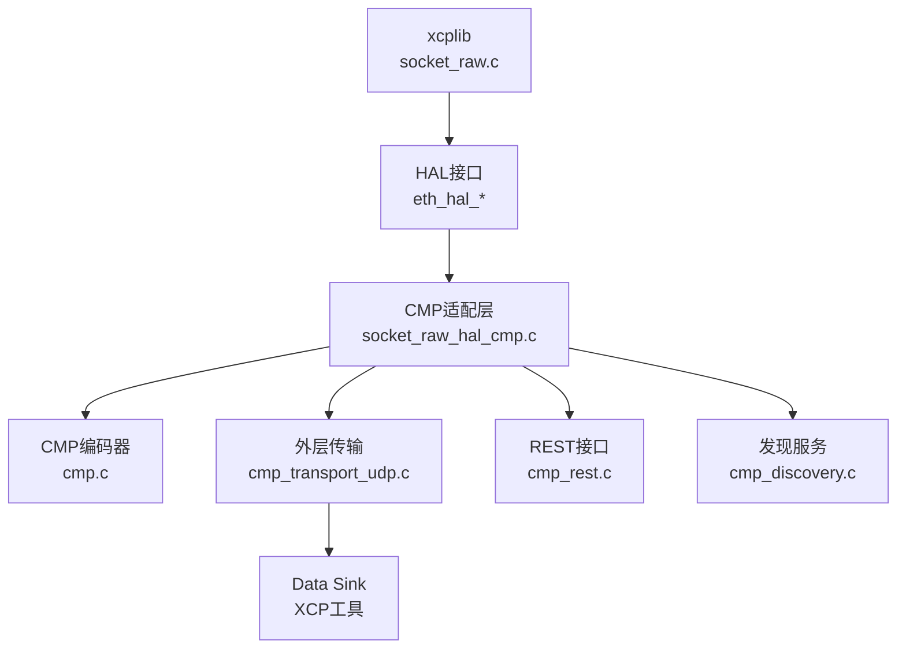
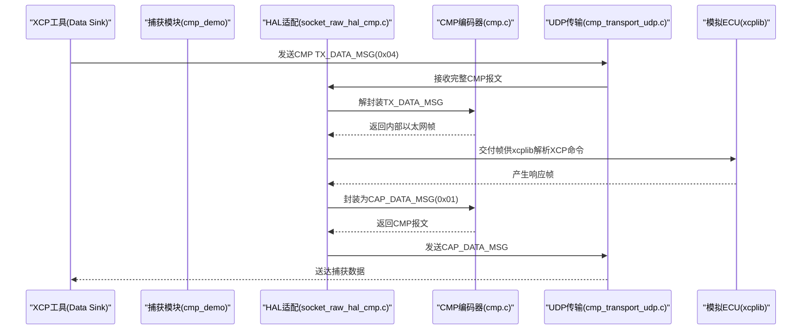
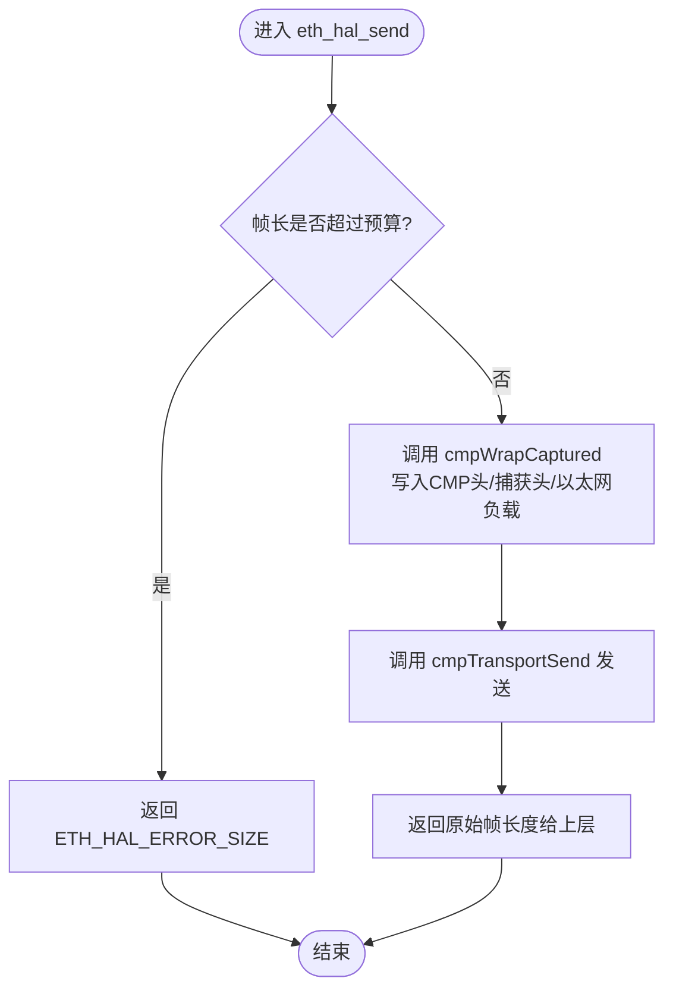
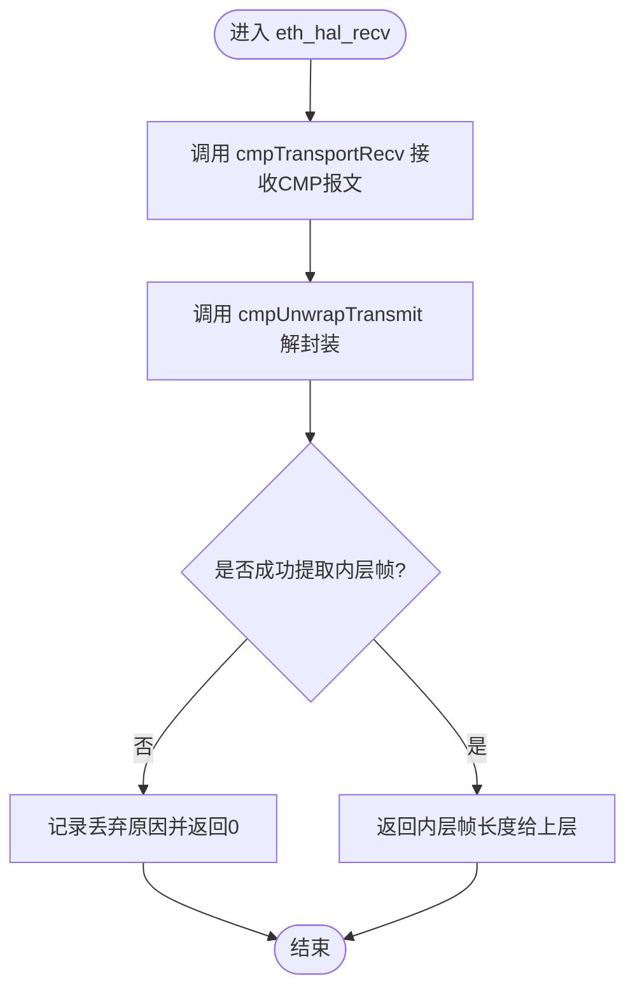
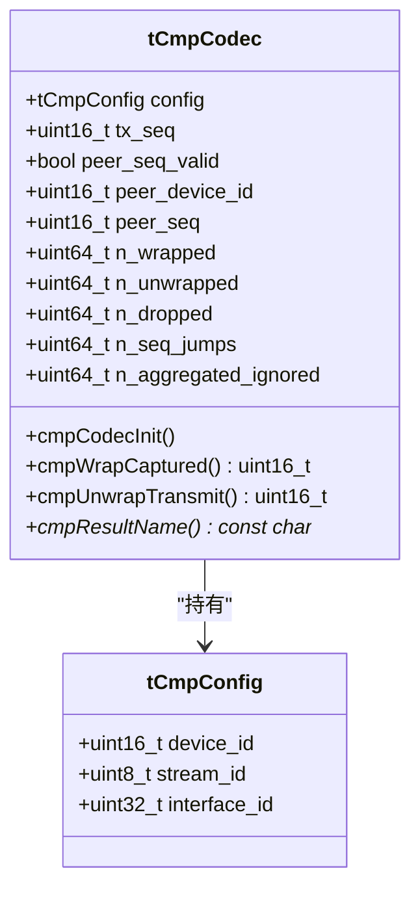
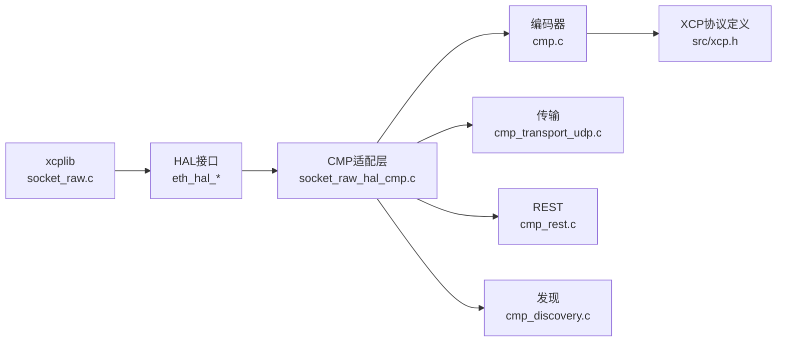

# CMP协议概述

<cite>
**本文引用的文件**
- [examples/cmp_demo/README.md](file://examples/cmp_demo/README.md)
- [examples/cmp_demo/src/cmp.h](file://examples/cmp_demo/src/cmp.h)
- [examples/cmp_demo/src/cmp.c](file://examples/cmp_demo/src/cmp.c)
- [examples/cmp_demo/src/cmp_transport.h](file://examples/cmp_demo/src/cmp_transport.h)
- [examples/cmp_demo/src/socket_raw_hal_cmp.c](file://examples/cmp_demo/src/socket_raw_hal_cmp.c)
- [examples/cmp_demo/src/cmp_discovery.h](file://examples/cmp_demo/src/cmp_discovery.h)
- [examples/cmp_demo/src/cmp_rest.h](file://examples/cmp_demo/src/cmp_rest.h)
- [docs/SOCKET_RAW.md](file://docs/SOCKET_RAW.md)
- [docs/XCP_INTRODUCTION.md](file://docs/XCP_INTRODUCTION.md)
- [src/xcp.h](file://src/xcp.h)
</cite>

## 目录
1. [简介](#简介)
2. [项目结构](#项目结构)
3. [核心组件](#核心组件)
4. [架构总览](#架构总览)
5. [详细组件分析](#详细组件分析)
6. [依赖关系分析](#依赖关系分析)
7. [性能考量](#性能考量)
8. [故障排查指南](#故障排查指南)
9. [结论](#结论)
10. [附录：使用场景与配置选项](#附录使用场景与配置选项)

## 简介
本概述聚焦于ASAM CMP（Capture Module Protocol）在XCPlite中的实现与作用。CMP用于测试通过“捕获模块”通信的XCP工具链，将XCP数据以捕获/注入的方式在工具与模拟ECU之间隧道传输。该示例实现了CMP 1.1.0的关键能力：基于UDP的数据消息封装（方向为工具→捕获模块→ECU，以及ECU→捕获模块→工具），以及只读REST接口用于发现与能力通告。

CMP不是ECU开发功能，因此不进入libxcplite核心库；它作为外部HAL后端接入xcplib的原始以太网传输路径，使xcplib继续构建/解析标准以太网/IPv4/UDP帧，而由CMP层负责信封封装与解封装。

**章节来源**
- [examples/cmp_demo/README.md:1-14](file://examples/cmp_demo/README.md#L1-L14)
- [docs/SOCKET_RAW.md:304-318](file://docs/SOCKET_RAW.md#L304-L318)

## 项目结构
CMP相关代码集中在示例工程 examples/cmp_demo 中，采用分层设计：
- 纯编码层：cmp.h/cmp.c，仅处理CMP信封编解码，无I/O、无全局状态
- 外层传输层：cmp_transport.h（及udp实现），负责CMP报文在UDP上的收发
- HAL适配层：socket_raw_hal_cmp.c，实现xcplib的eth_hal_*接口，桥接编码层与传输层
- 发现与REST：cmp_discovery.h（XCP-based发现）、cmp_rest.h（只读REST端点）
- 主程序：main.c（不在本节展开），负责命令行参数、服务启动、A2L生成等

**图表来源**
- [examples/cmp_demo/src/socket_raw_hal_cmp.c:14-27](file://examples/cmp_demo/src/socket_raw_hal_cmp.c#L14-L27)
- [examples/cmp_demo/src/cmp_transport.h:12-27](file://examples/cmp_demo/src/cmp_transport.h#L12-L27)
- [examples/cmp_demo/src/cmp.h:8-24](file://examples/cmp_demo/src/cmp.h#L8-L24)

**章节来源**
- [examples/cmp_demo/README.md:72-88](file://examples/cmp_demo/README.md#L72-L88)
- [docs/SOCKET_RAW.md:140-158](file://docs/SOCKET_RAW.md#L140-L158)

## 核心组件
- CMP编码器（cmp.c/h）：定义CMP版本、消息类型、负载类型、头部长度、标志位、配置结构体与序列号监控；提供捕获方向封装与发送方向解封装函数
- 传输抽象（cmp_transport.h）：定义UDP传输配置、打开/关闭、发送/接收、唤醒、最大报文长度查询、本地/远端端点信息获取
- HAL适配（socket_raw_hal_cmp.c）：实现eth_hal_open/close/get_mac/send/recv/wakeup，维护设备ID、流ID、接口ID、MTU预算、MAC推导、统计计数
- 发现（cmp_discovery.h）：基于XCP的组播发现（239.255.0.0:5556），响应包含HTTP端口以便工具访问REST
- REST（cmp_rest.h）：实现只读端点，关键为接口能力通告，表明支持传输（Transmitter.TransmissionSupportBitmask）

**章节来源**
- [examples/cmp_demo/src/cmp.h:32-86](file://examples/cmp_demo/src/cmp.h#L32-L86)
- [examples/cmp_demo/src/cmp.c:51-83](file://examples/cmp_demo/src/cmp.c#L51-L83)
- [examples/cmp_demo/src/cmp_transport.h:38-68](file://examples/cmp_demo/src/cmp_transport.h#L38-L68)
- [examples/cmp_demo/src/socket_raw_hal_cmp.c:44-73](file://examples/cmp_demo/src/socket_raw_hal_cmp.c#L44-L73)
- [examples/cmp_demo/src/cmp_discovery.h:37-58](file://examples/cmp_demo/src/cmp_discovery.h#L37-L58)
- [examples/cmp_demo/src/cmp_rest.h:17-26](file://examples/cmp_demo/src/cmp_rest.h#L17-L26)

## 架构总览
CMP在工具链中的位置：
- XCP工具（Data Sink）通过UDP发送CMP报文到捕获模块
- 捕获模块将工具发来的TX_DATA_MSG解封装为内部以太网帧，交给xcplib解析并驱动模拟ECU
- ECU产生的以太网帧被捕获模块封装为CAP_DATA_MSG回传给工具
- 工具通过REST接口发现模块能力（是否支持注入）

**图表来源**
- [examples/cmp_demo/src/socket_raw_hal_cmp.c:14-27](file://examples/cmp_demo/src/socket_raw_hal_cmp.c#L14-L27)
- [examples/cmp_demo/src/cmp.c:88-137](file://examples/cmp_demo/src/cmp.c#L88-L137)
- [examples/cmp_demo/src/cmp.c:161-249](file://examples/cmp_demo/src/cmp.c#L161-L249)

**章节来源**
- [examples/cmp_demo/README.md:17-37](file://examples/cmp_demo/README.md#L17-L37)
- [docs/SOCKET_RAW.md:304-318](file://docs/SOCKET_RAW.md#L304-L318)

## 详细组件分析

### CMP数据包格式与用途
- 通用CMP头（8字节）：版本、保留、DeviceId、MessageType、StreamId、StreamSequenceCounter
- 捕获数据消息头（16字节）：Timestamp、InterfaceId、CommonFlags、PayloadType=0x08、PayloadLength
- 传输数据消息头（24字节）：Timestamp、Deadline、InterfaceId、TransmissionOptions、CommonFlags、PayloadType=0x08、PayloadLength
- 以太网数据负载（6+数据）：Flags、Reserved、DataLength、DATA（从目的MAC到FCS）

用途说明：
- CAP_DATA_MSG（0x01）：捕获方向，ECU→工具，携带以太网帧
- TX_DATA_MSG（0x04）：注入方向，工具→ECU，承载要注入的以太网帧

注意：
- 所有CMP字段为大端序
- 本实现不使用RAW_ETHERNET（0x0D），因为需要前导码+SFD，对合成ECU无意义
- FCS_SUPPORT=0，DATA末尾补4字节零占位FCS；解封装时剥离

**章节来源**
- [examples/cmp_demo/README.md:38-60](file://examples/cmp_demo/README.md#L38-L60)
- [examples/cmp_demo/src/cmp.h:32-62](file://examples/cmp_demo/src/cmp.h#L32-L62)
- [examples/cmp_demo/src/cmp.c:88-137](file://examples/cmp_demo/src/cmp.c#L88-L137)
- [examples/cmp_demo/src/cmp.c:161-249](file://examples/cmp_demo/src/cmp.c#L161-L249)

### 捕获方向流程（CAP_DATA_MSG）

**图表来源**
- [examples/cmp_demo/src/socket_raw_hal_cmp.c:220-258](file://examples/cmp_demo/src/socket_raw_hal_cmp.c#L220-L258)
- [examples/cmp_demo/src/cmp.c:88-137](file://examples/cmp_demo/src/cmp.c#L88-L137)

**章节来源**
- [examples/cmp_demo/src/socket_raw_hal_cmp.c:220-258](file://examples/cmp_demo/src/socket_raw_hal_cmp.c#L220-L258)
- [examples/cmp_demo/src/cmp.c:88-137](file://examples/cmp_demo/src/cmp.c#L88-L137)

### 注入方向流程（TX_DATA_MSG）

**图表来源**
- [examples/cmp_demo/src/socket_raw_hal_cmp.c:260-287](file://examples/cmp_demo/src/socket_raw_hal_cmp.c#L260-L287)
- [examples/cmp_demo/src/cmp.c:161-249](file://examples/cmp_demo/src/cmp.c#L161-L249)

**章节来源**
- [examples/cmp_demo/src/socket_raw_hal_cmp.c:260-287](file://examples/cmp_demo/src/socket_raw_hal_cmp.c#L260-L287)
- [examples/cmp_demo/src/cmp.c:161-249](file://examples/cmp_demo/src/cmp.c#L161-L249)

### 类图：CMP编码器与状态

**图表来源**
- [examples/cmp_demo/src/cmp.h:87-127](file://examples/cmp_demo/src/cmp.h#L87-L127)
- [examples/cmp_demo/src/cmp.c:51-83](file://examples/cmp_demo/src/cmp.c#L51-L83)

**章节来源**
- [examples/cmp_demo/src/cmp.h:87-127](file://examples/cmp_demo/src/cmp.h#L87-L127)
- [examples/cmp_demo/src/cmp.c:51-83](file://examples/cmp_demo/src/cmp.c#L51-L83)

### 与传统以太网XCP的区别
- 地址解析：传统以太网XCP直接基于IP/MAC寻址；CMP通过DeviceId/StreamId/InterfaceId进行逻辑寻址，ECU IP仅在CMP负载内部出现，无需真实路由可达
- MAC地址处理：传统XCP直接使用真实MAC；CMP中模拟ECU的MAC由设备ID派生或显式配置，且出现在内层帧中
- 网络拓扑：传统XCP要求端到端可达；CMP允许工具与ECU之间通过捕获模块隧道化，工具不直接访问ECU IP
- MTU约束：CMP禁止IP分片，外层UDP/IP头占用额外空间，需调整OPTION_MTU与段大小以避免溢出

**章节来源**
- [examples/cmp_demo/README.md:141-147](file://examples/cmp_demo/README.md#L141-L147)
- [examples/cmp_demo/README.md:150-181](file://examples/cmp_demo/README.md#L150-L181)
- [examples/cmp_demo/src/socket_raw_hal_cmp.c:86-98](file://examples/cmp_demo/src/socket_raw_hal_cmp.c#L86-L98)
- [docs/SOCKET_RAW.md:32-78](file://docs/SOCKET_RAW.md#L32-L78)

## 依赖关系分析
- xcplib socket_raw.c 依赖 eth_hal_* 接口；本示例通过静态链接覆盖默认后端，避免引入内置AF_PACKET实现
- CMP编码器独立于传输层，便于单元测试与跨平台复用
- 发现与REST运行在独立线程或复用REST线程的poll循环，不侵入核心传输路径
- XCP命令集定义位于 src/xcp.h，CMP仅承载其底层以太网帧

**图表来源**
- [docs/SOCKET_RAW.md:140-158](file://docs/SOCKET_RAW.md#L140-L158)
- [examples/cmp_demo/src/socket_raw_hal_cmp.c:8-13](file://examples/cmp_demo/src/socket_raw_hal_cmp.c#L8-L13)
- [src/xcp.h:25-44](file://src/xcp.h#L25-L44)

**章节来源**
- [docs/SOCKET_RAW.md:272-293](file://docs/SOCKET_RAW.md#L272-L293)
- [examples/cmp_demo/src/socket_raw_hal_cmp.c:8-13](file://examples/cmp_demo/src/socket_raw_hal_cmp.c#L8-L13)

## 性能考量
- 零拷贝路径不参与CMP信封：信封应用在半区缓冲，避免影响XCPTL_TX_HEADROOM与零拷贝优化
- MTU预算严格：外层UDP/IP头占用28字节，CMP信封增加34或42字节，需在1500字节路径上限制内层帧尺寸
- 大帧拒绝而非分片：超过预算的帧直接返回错误，避免违反“禁止IP分片”的规范
- 统计与诊断：记录包裹/解包/丢弃/序列跳跃/聚合忽略等计数，便于定位问题

[本节为通用指导，不直接分析具体文件]

## 故障排查指南
常见问题与定位要点：
- 无法连接：确认REST接口已启动且Transmitter对象通告了传输支持
- 注入失败：检查TX_DATA_MSG是否被正确解封装，关注丢弃原因（版本、消息类型、负载类型、接口ID、分段、畸形、FCS缺失、过大）
- 捕获丢失：关注INSYNC标志与序列计数器跳跃，可能指示时间同步或丢帧
- MTU问题：若出现SOCKET_ERROR_MSGSIZE，降低OPTION_MTU或提高外层MTU（jumbo path）
- 发现不可达：组播回复可能被AP过滤，尝试直连回复方式

**章节来源**
- [examples/cmp_demo/src/cmp.c:59-83](file://examples/cmp_demo/src/cmp.c#L59-L83)
- [examples/cmp_demo/src/socket_raw_hal_cmp.c:173-183](file://examples/cmp_demo/src/socket_raw_hal_cmp.c#L173-L183)
- [examples/cmp_demo/README.md:191-249](file://examples/cmp_demo/README.md#L191-L249)

## 结论
CMP在XCPlite中以外部HAL后端形式存在，专注于测试通过捕获模块通信的XCP工具链。其核心价值在于：
- 将XCP数据隧道化，使工具无需直接访问ECU IP/MAC
- 提供标准化信封格式与REST能力通告，便于工具自动发现与配置
- 保持与xcplib核心解耦，便于移植与单元测试

对于生产环境，建议根据链路能力合理设置MTU，确保CAP/TX方向帧尺寸满足单报文限制；同时启用REST与发现以提升可运维性。

[本节为总结性内容，不直接分析具体文件]

## 附录：使用场景与配置选项
基本使用场景：
- 在主机或目标设备上运行cmp_demo，暴露UDP端口与REST接口
- 使用XCP工具（如CANape）通过CMP UDP端口连接，工具先查询REST接口确认支持注入
- 工具发送CONNECT等XCP命令，经CMP隧道到达模拟ECU，完成测量与标定

关键配置选项（来自示例）：
- --sink <a.b.c.d:port>：Data Sink地址，默认可从首个CMP消息学习
- --listen <port>：监听CMP入站UDP端口（默认55555）
- --mtu <bytes>：外层路径MTU（默认1500，最大9000）
- --rest-port <port>：REST端口（默认8080，0禁用）
- --device-id, --stream-id, --interface-id：CMP身份标识
- --ecu-mac <xx:…:xx>：模拟ECU MAC，默认由设备ID派生
- --ip, --port：模拟ECU的IP与端口，仅出现在CMP负载内部

REST端点（只读）：
- GET /asam-cmp/version-info
- GET /asam-cmp/v1/identification
- GET /asam-cmp/v1/interfaces（关键：Transmitter.TransmissionSupportBitmask）
- GET /asam-cmp/v1/measurement

发现机制：
- XCP-based组播发现（239.255.0.0:5556），响应携带HTTP端口供工具配置

**章节来源**
- [examples/cmp_demo/README.md:124-147](file://examples/cmp_demo/README.md#L124-L147)
- [examples/cmp_demo/README.md:252-281](file://examples/cmp_demo/README.md#L252-L281)
- [examples/cmp_demo/README.md:191-249](file://examples/cmp_demo/README.md#L191-L249)
- [examples/cmp_demo/src/cmp_rest.h:17-26](file://examples/cmp_demo/src/cmp_rest.h#L17-L26)
- [examples/cmp_demo/src/cmp_discovery.h:37-58](file://examples/cmp_demo/src/cmp_discovery.h#L37-L58)