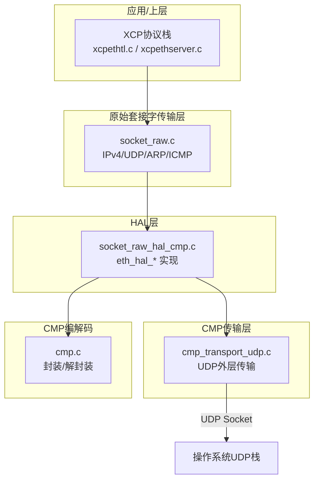
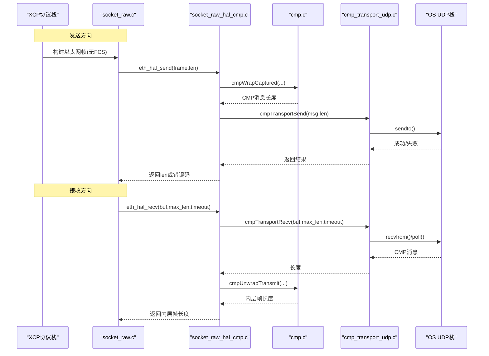

# CMP后端实现

<cite>
**本文引用的文件**
- [socket_raw_hal_cmp.c](file://examples/cmp_demo/src/socket_raw_hal_cmp.c)
- [socket_raw_hal.h](file://src/socket_raw_hal.h)
- [cmp_transport_udp.c](file://examples/cmp_demo/src/cmp_transport_udp.c)
- [cmp_backend.h](file://examples/cmp_demo/src/cmp_backend.h)
- [cmp.h](file://examples/cmp_demo/src/cmp.h)
- [cmp_transport.h](file://examples/cmp_demo/src/cmp_transport.h)
- [socket_raw.c](file://src/socket_raw.c)
- [SOCKET_RAW.md](file://docs/SOCKET_RAW.md)
</cite>

## 目录
1. [简介](#简介)
2. [项目结构](#项目结构)
3. [核心组件](#核心组件)
4. [架构总览](#架构总览)
5. [详细组件分析](#详细组件分析)
6. [依赖关系分析](#依赖关系分析)
7. [性能考量](#性能考量)
8. [故障排查指南](#故障排查指南)
9. [结论](#结论)
10. [附录：自定义传输层开发指南与最佳实践](#附录自定义传输层开发指南与最佳实践)

## 简介
本技术文档聚焦于XCPlite的CMP（Capture Module Protocol）后端实现，重点解析示例工程中的HAL接口实现文件 socket_raw_hal_cmp.c，以及其与xcplib原始套接字传输层的集成方式。文档涵盖以下主题：
- eth_hal_* 系列函数的具体实现细节与调用契约
- CMP封装/解封装流程（CAP_DATA_MSG、TX_DATA_MSG）
- UDP外层传输的配置与管理（端口绑定、MTU限制、数据Sink地址学习）
- 错误处理机制与网络异常恢复策略
- 如何基于该模式扩展自定义传输层并遵循最佳实践

## 项目结构
CMP后端由三层组成：
- HAL层：socket_raw_hal_cmp.c，实现socket_raw_hal.h定义的eth_hal_*接口，负责将xcplib产生的以太网帧封装为CMP消息并通过UDP发送，或将接收到的CMP消息解封装后交给xcplib
- 传输层：cmp_transport_udp.c，提供CMP over UDP（ASAM 6.4.2）的收发、端口绑定、MTU预算计算、Data Sink地址学习等
- 编解码层：cmp.c/cmp.h，纯函数式实现CMP信封的封装与解封装，不含I/O和全局状态

图表来源
- [socket_raw.c:1-200](file://src/socket_raw.c#L1-L200)
- [socket_raw_hal_cmp.c:102-287](file://examples/cmp_demo/src/socket_raw_hal_cmp.c#L102-L287)
- [cmp_transport_udp.c:67-325](file://examples/cmp_demo/src/cmp_transport_udp.c#L67-L325)
- [cmp.h:88-159](file://examples/cmp_demo/src/cmp.h#L88-L159)

章节来源
- [socket_raw_hal.h:1-108](file://src/socket_raw_hal.h#L1-L108)
- [SOCKET_RAW.md:1-200](file://docs/SOCKET_RAW.md#L1-L200)

## 核心组件
- tEthHalCtx：HAL上下文，持有CMP编解码器、传输句柄、MAC、最大内层帧预算、统计计数等
- tCmpCodec：CMP编解码状态，维护设备ID、流ID、接口ID、序列号、丢弃统计等
- tCmpTransport：UDP传输实例，包含fd、唤醒管道、本地端口、最大消息长度、Data Sink地址等
- tCmpBackendConfig/tCmpBackendStatus：后端配置与状态快照，供REST查询与日志输出

关键职责划分：
- socket_raw_hal_cmp.c：实现eth_hal_open/close/get_mac/send/recv/wakeup；管理CMP封装/解封装与UDP传输；统计与告警
- cmp_transport_udp.c：创建UDP socket、绑定端口、设置非阻塞、poll等待、sendto/recvfrom、地址学习、wakeup
- cmp.c：按ASAM CMP规范进行信封组装与解析，不接触任何I/O

章节来源
- [socket_raw_hal_cmp.c:44-76](file://examples/cmp_demo/src/socket_raw_hal_cmp.c#L44-L76)
- [cmp_transport_udp.c:35-45](file://examples/cmp_demo/src/cmp_transport_udp.c#L35-L45)
- [cmp.h:88-127](file://examples/cmp_demo/src/cmp.h#L88-L127)

## 架构总览
CMP后端在xcplib的原始套接字传输层之上，通过HAL抽象屏蔽底层差异。发送路径将xcplib构建的以太网帧封装为CMP Captured Data Message，经UDP发送到Data Sink；接收路径从UDP读取CMP Transmit Data Message，解封装出内层以太网帧交给xcplib处理。

图表来源
- [socket_raw_hal_cmp.c:220-287](file://examples/cmp_demo/src/socket_raw_hal_cmp.c#L220-L287)
- [cmp_transport_udp.c:171-265](file://examples/cmp_demo/src/cmp_transport_udp.c#L171-L265)
- [cmp.h:132-156](file://examples/cmp_demo/src/cmp.h#L132-L156)

## 详细组件分析

### HAL层：eth_hal_* 接口实现
- eth_hal_open
  - 校验outer MTU不超过上限
  - 分配并初始化tEthHalCtx
  - 初始化CMP编解码器（device_id/stream_id/interface_id）
  - 推导或复制ECU MAC（避免全零MAC）
  - 打开UDP传输（local_port/sink_ip/sink_port/outer_mtu）
  - 计算max_inner_frame = max_message - CMP_CAP_OVERHEAD
  - 若xcplib可能产生超过budget的帧，打印一次性警告
  - 记录本地IP/端口、Data Sink信息、ECU MAC、frame budget
- eth_hal_close
  - 打印统计信息（wrapped/unwrapped/dropped/seq jumps/oversize）
  - 关闭传输并释放上下文
- eth_hal_get_mac
  - 返回模拟ECU的源MAC（用于xcplib构建的帧源地址）
- eth_hal_send
  - 检查帧长是否超出预算，超限则计数并返回ETH_HAL_ERROR_SIZE
  - 使用clockGet()作为捕获时间戳，INSYNC=false
  - 调用cmpWrapCaptured生成CMP消息
  - 通过cmpTransportSend发送；未知Data Sink时返回0表示“暂不发送”
  - 返回值是原始帧长度，对上层透明
- eth_hal_recv
  - 调用cmpTransportRecv获取CMP消息
  - 调用cmpUnwrapTransmit解封装；若非目标接口或类型不符，丢弃并记录
  - 返回内层帧长度；超时或唤醒返回0
- eth_hal_wakeup
  - 通过自管管道触发阻塞的recv提前返回

错误与恢复要点：
- 尺寸错误：返回ETH_HAL_ERROR_SIZE，上层映射为SOCKET_ERROR_MSGSIZE
- 未知Data Sink：发送方向静默丢弃，直到收到第一条来自Sink的消息完成地址学习
- 非法/非目标CMP消息：丢弃并计数，避免影响主循环

章节来源
- [socket_raw_hal_cmp.c:102-187](file://examples/cmp_demo/src/socket_raw_hal_cmp.c#L102-L187)
- [socket_raw_hal_cmp.c:190-287](file://examples/cmp_demo/src/socket_raw_hal_cmp.c#L190-L287)
- [socket_raw_hal.h:65-105](file://src/socket_raw_hal.h#L65-L105)

### 传输层：CMP over UDP（6.4.2）
- 打开与配置
  - 校验outer MTU大于IP+UDP头长度
  - 可选配置Data Sink IP/Port；否则首次收到消息时自动学习
  - 创建AF_INET SOCK_DGRAM socket，设置SO_REUSEADDR
  - 绑定到local_port（可为0以获取临时端口）
  - 创建非阻塞pipe用于wakeup
- 发送
  - sink未知时直接返回0（非错误），保持安静
  - sendto循环处理EINTR；EMSGSIZE视为路径MTU超限
  - 部分发送视为错误
- 接收
  - poll监听UDP fd与wakeup pipe
  - 若wakeup事件，清空pipe并返回0
  - 若UDP可读，recvfrom获取消息；EINTR/EAGAIN/EWOULDBLOCK返回0
  - 首次收到消息且sink未配置时，记录source为sink并标记learned
- 辅助
  - cmpTransportMaxMessage：outer_mtu - (IP4+UDP头)
  - cmpTransportGetLocal：当sink已知时，通过connect探测源地址
  - cmpTransportGetSink：返回已知的sink地址

多播组设置说明：
- 当前实现不使用多播；采用单播UDP，Data Sink地址可显式配置或在首包中自动学习
- 因此无需配置IGMP或多播组；路由表决定出站源地址

MTU处理：
- outer_mtu限制CMP消息大小，确保不触发IP分片（规范6.4.2禁止）
- 若路径MTU更小，sendto会返回EMSGSIZE，上层应降低OPTION_MTU或增大outer_mtu

章节来源
- [cmp_transport_udp.c:67-151](file://examples/cmp_demo/src/cmp_transport_udp.c#L67-L151)
- [cmp_transport_udp.c:171-265](file://examples/cmp_demo/src/cmp_transport_udp.c#L171-L265)
- [cmp_transport_udp.c:278-325](file://examples/cmp_demo/src/cmp_transport_udp.c#L278-L325)
- [cmp_transport.h:38-69](file://examples/cmp_demo/src/cmp_transport.h#L38-L69)

### 编解码层：CMP信封封装/解封装
- 封装（Captured Data Message）
  - 输入：完整以太网帧（无FCS）、时间戳、同步标志
  - 输出：CMP消息（含头部、捕获数据头部、以太网载荷、占位FCS）
  - 更新tx_seq与n_wrapped
- 解封装（Transmit Data Message）
  - 校验版本、消息类型、载荷类型、长度一致性
  - 支持聚合但仅交付第一个以太网载荷，其余计数忽略
  - 监控对端StreamSequenceCounter，检测跳跃并计数
  - 剥离尾部FCS，返回无FCS的内层帧以满足HAL契约

章节来源
- [cmp.h:88-159](file://examples/cmp_demo/src/cmp.h#L88-L159)
- [cmp.c:51-83](file://examples/cmp_demo/src/cmp.c#L51-L83)
- [cmp.c:88-137](file://examples/cmp_demo/src/cmp.c#L88-L137)
- [cmp.c:142-200](file://examples/cmp_demo/src/cmp.c#L142-L200)

### 与xcplib原始套接字传输层的集成
- socket_raw.c通过socket_raw_hal.h提供的eth_hal_*接口与后端解耦
- 发送路径：socket_raw.c构建以太网帧 -> eth_hal_send -> CMP封装 -> UDP发送
- 接收路径：UDP接收CMP -> 解封装 -> eth_hal_recv返回内层帧 -> socket_raw.c继续解析UDP/XCP
- 线程契约：eth_hal_send在发送互斥下调用；eth_hal_recv仅在XCP接收线程调用；eth_hal_wakeup可从任意线程调用

章节来源
- [socket_raw.c:1-200](file://src/socket_raw.c#L1-L200)
- [socket_raw_hal.h:29-38](file://src/socket_raw_hal.h#L29-L38)

## 依赖关系分析
- socket_raw_hal_cmp.c依赖：
  - socket_raw_hal.h（HAL接口定义）
  - cmp.h/cmp.c（CMP编解码）
  - cmp_transport.h/cmp_transport_udp.c（UDP传输）
  - platform.h（时钟与选项）
- cmp_transport_udp.c依赖：
  - 标准POSIX socket/poll/fcntl
  - cmp_transport.h（接口定义）
- socket_raw.c依赖：
  - socket_raw_hal.h（HAL抽象）
  - xcptl_cfg.h（段大小与头预留）

耦合与内聚：
- HAL层与传输层通过明确接口分离，便于替换不同外层传输（如未来实现IEEE 802.3 EtherType 0x99FE）
- 编解码层完全无I/O，易于单元测试与验证

潜在循环依赖：
- 无直接循环；各层单向依赖

外部依赖：
- 操作系统UDP栈（AF_INET/SOCK_DGRAM）
- 平台时钟（clockGet）

章节来源
- [socket_raw_hal_cmp.c:31-39](file://examples/cmp_demo/src/socket_raw_hal_cmp.c#L31-L39)
- [cmp_transport_udp.c:18-29](file://examples/cmp_demo/src/cmp_transport_udp.c#L18-L29)
- [socket_raw.c:26-34](file://src/socket_raw.c#L26-L34)

## 性能考量
- 零拷贝路径隔离：CMP封装不占用发送队列headroom，避免干扰XCPTL_TX_HEADROOM
- 内存分配：HAL上下文与传输对象在open时分配，close时释放；避免频繁malloc/free
- 缓冲大小：CMP_MAX_MESSAGE=9216，支持jumbo路径；inner frame预算受outer MTU限制
- I/O模型：UDP接收使用poll+自管pipe，支持非阻塞与及时唤醒
- 统计开销：轻量计数器，无锁快照（测试环境可接受）

优化建议：
- 在高吞吐DAQ场景，适当提高outer_mtu并确保链路支持jumbo帧
- 合理设置OPTION_MTU，使XCPTL段大小与路径MTU匹配，避免EMSGSIZE
- 复用缓冲区（已在HAL中预分配tx/rx缓冲）

[本节为通用指导，不直接分析具体文件]

## 故障排查指南
常见错误与定位：
- ETH_HAL_ERROR_SIZE：帧过大无法装入单个CMP消息；检查outer_mtu与OPTION_MTU
- EMSGSIZE：UDP发送超出路径MTU；减少segment size或提升链路MTU
- 未知Data Sink：发送方向静默丢弃；确认首包能从Sink到达或显式配置sink_ip/sink_port
- 丢弃消息：检查interface_id、消息类型、载荷类型、长度一致性
- 序列跳跃：对端StreamSequenceCounter不连续，可能丢包或重传

诊断信息：
- 启动日志：设备ID、流ID、接口ID、本地IP/端口、outer MTU、Data Sink、ECU MAC、frame budget
- 关闭摘要：wrapped/unwrapped/dropped/seq jumps/oversize计数
- REST状态：cmpBackendGetStatus提供运行时快照

章节来源
- [socket_raw_hal_cmp.c:161-183](file://examples/cmp_demo/src/socket_raw_hal_cmp.c#L161-L183)
- [socket_raw_hal_cmp.c:190-207](file://examples/cmp_demo/src/socket_raw_hal_cmp.c#L190-L207)
- [cmp_transport_udp.c:182-200](file://examples/cmp_demo/src/cmp_transport_udp.c#L182-L200)
- [cmp_transport_udp.c:251-262](file://examples/cmp_demo/src/cmp_transport_udp.c#L251-L262)

## 结论
CMP后端通过清晰的HAL抽象与分层设计，将xcplib的原始套接字传输与ASAM CMP测量网络无缝集成。其核心优势包括：
- 明确的接口契约与职责分离
- 严格的MTU预算与无IP分片约束
- 灵活的Data Sink地址学习与配置
- 完善的错误处理与诊断统计
该实现可作为扩展自定义传输层的参考模板，满足测试与仿真场景的高可靠性需求。

[本节为总结性内容，不直接分析具体文件]

## 附录：自定义传输层开发指南与最佳实践
- 接口对齐
  - 实现socket_raw_hal.h定义的eth_hal_*函数族，遵守线程契约与错误码约定
  - 若需替换外层传输，保持cmp_transport.h接口不变，仅替换cmp_transport_udp.c的实现
- 配置管理
  - 通过tCmpBackendConfig集中管理设备标识、端口、MTU、ECU MAC等
  - 在XcpEthServerInit之前完成配置，确保transport正确打开
- 安全与健壮性
  - 严格校验输入参数与长度，避免越界
  - 处理EINTR/EAGAIN等非致命错误，保证循环稳定
  - 对未知或非法消息采取丢弃并计数策略，不影响主流程
- 性能与资源
  - 预分配固定大小缓冲，避免热点路径动态分配
  - 合理使用non-blocking I/O与poll，避免忙等
  - 谨慎设置MTU，确保CMP消息不触发IP分片
- 调试与观测
  - 利用启动日志与关闭摘要快速定位问题
  - 暴露REST状态接口，便于外部工具查询运行态
- 兼容性
  - 遵循ASAM CMP规范（版本、字段顺序、字节序）
  - 保持向后兼容，新增字段时注意默认行为

[本节为通用指导，不直接分析具体文件]