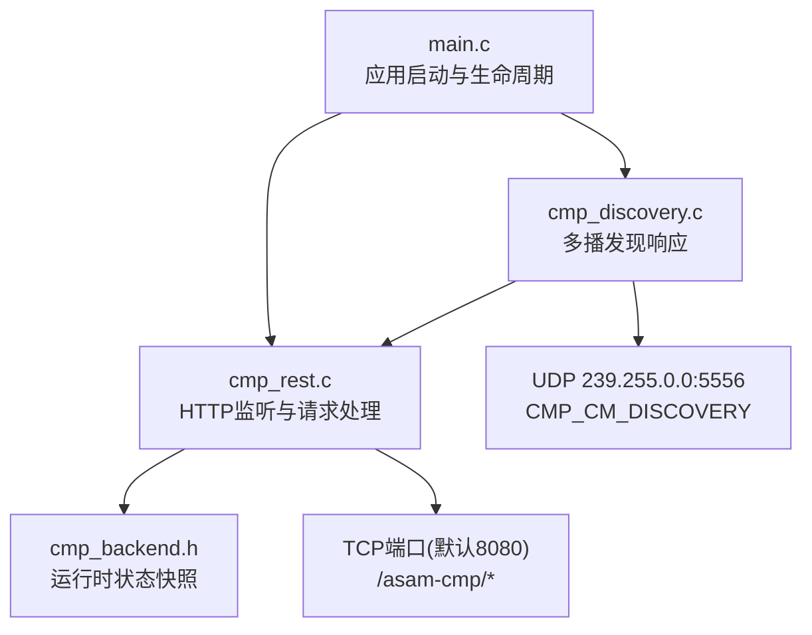
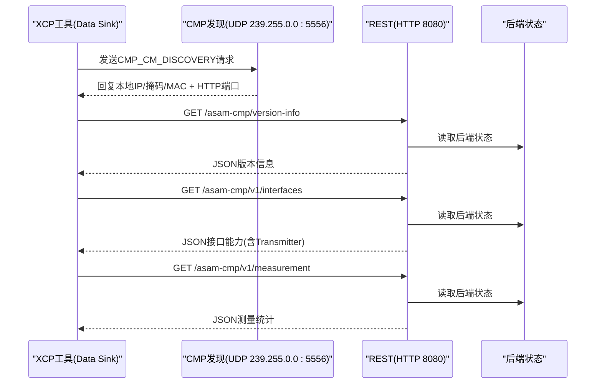
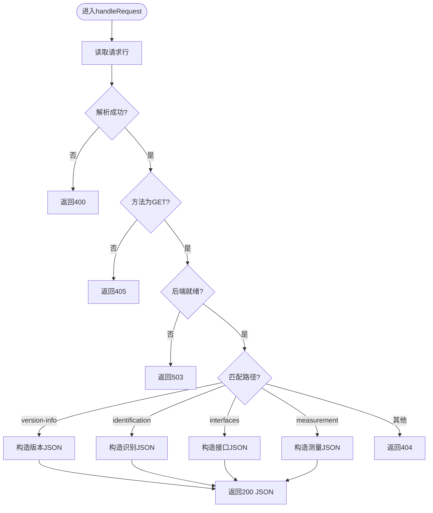
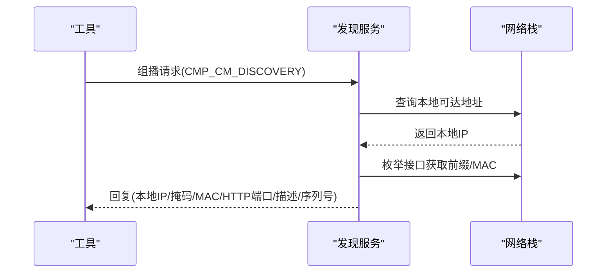
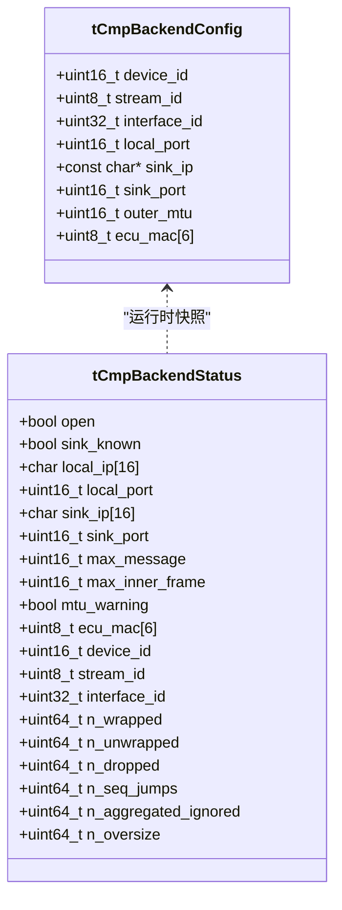
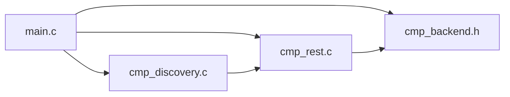

# REST API接口

<cite>
**本文引用的文件**
- [cmp_rest.c](file://examples/cmp_demo/src/cmp_rest.c)
- [cmp_rest.h](file://examples/cmp_demo/src/cmp_rest.h)
- [cmp_discovery.c](file://examples/cmp_demo/src/cmp_discovery.c)
- [cmp_discovery.h](file://examples/cmp_demo/src/cmp_discovery.h)
- [main.c](file://examples/cmp_demo/src/main.c)
- [cmp_backend.h](file://examples/cmp_demo/src/cmp_backend.h)
- [README.md](file://examples/cmp_demo/README.md)
</cite>

## 目录
1. [简介](#简介)
2. [项目结构](#项目结构)
3. [核心组件](#核心组件)
4. [架构总览](#架构总览)
5. [详细组件分析](#详细组件分析)
6. [依赖关系分析](#依赖关系分析)
7. [性能与并发特性](#性能与并发特性)
8. [故障排查指南](#故障排查指南)
9. [结论](#结论)
10. [附录：API参考](#附录api参考)

## 简介
本章节面向使用XCPlite示例工程中的CMP（Capture Module Protocol）REST接口的开发者，系统性说明HTTP服务器的实现、请求路由、响应格式与状态码管理；详述REST端点设计（设备状态查询、配置管理与监控信息获取）；解析HTTP请求处理流程（并发模型、错误处理、资源管理）；解释REST API与CMP服务发现的集成方式；并提供完整的API参考、客户端集成指南与调试技巧。

该实现遵循ASAM CMP 1.1规范中关于只读REST接口（12.3）的要求，用于让Data Sink发现捕获模块并探测是否支持注入传输（Transmit Data Message），从而通过CMP隧道承载XCP通信。

## 项目结构
CMP REST相关代码位于示例工程 examples/cmp_demo/src 下，主要包含：
- cmp_rest.c/h：最小化HTTP/1.1服务器，提供只读REST端点
- cmp_discovery.c/h：基于IP多播的CMP_CM_DISCOVERY响应器（12.1.1）
- main.c：应用入口，负责初始化XCP、后端、发现与REST服务
- cmp_backend.h：后端配置与运行时状态结构定义，供REST读取以生成响应

图表来源
- [main.c:181-304](file://examples/cmp_demo/src/main.c#L181-L304)
- [cmp_rest.c:229-329](file://examples/cmp_demo/src/cmp_rest.c#L229-L329)
- [cmp_discovery.c:180-249](file://examples/cmp_demo/src/cmp_discovery.c#L180-L249)

章节来源
- [main.c:181-304](file://examples/cmp_demo/src/main.c#L181-L304)
- [cmp_rest.h:1-41](file://examples/cmp_demo/src/cmp_rest.h#L1-L41)
- [cmp_discovery.h:1-65](file://examples/cmp_demo/src/cmp_discovery.h#L1-L65)
- [README.md:252-281](file://examples/cmp_demo/README.md#L252-L281)

## 核心组件
- HTTP服务器（cmp_rest.c）
  - 单线程、单连接模型，Connection: close
  - 使用poll复用HTTP监听套接字与发现UDP套接字
  - 仅支持GET方法，返回JSON或纯文本
- 服务发现（cmp_discovery.c）
  - 监听组播地址239.255.0.0:5556，响应CMP_CM_DISCOVERY请求
  - 动态计算本地可达地址、前缀长度与MAC，并回显HTTP端口
- 后端状态（cmp_backend.h）
  - 提供设备ID、流ID、接口ID、MTU预算、计数器等，供REST端点构建响应体
- 应用主循环（main.c）
  - 初始化XCP、后端、发现与REST；按顺序启动以保证发现能正确携带HTTP端口

章节来源
- [cmp_rest.c:1-344](file://examples/cmp_demo/src/cmp_rest.c#L1-L344)
- [cmp_discovery.c:1-378](file://examples/cmp_demo/src/cmp_discovery.c#L1-L378)
- [cmp_backend.h:1-75](file://examples/cmp_demo/src/cmp_backend.h#L1-L75)
- [main.c:181-304](file://examples/cmp_demo/src/main.c#L181-L304)

## 架构总览
下图展示了从工具发起发现到REST查询的端到端流程：

图表来源
- [cmp_discovery.c:265-377](file://examples/cmp_demo/src/cmp_discovery.c#L265-L377)
- [cmp_rest.c:174-223](file://examples/cmp_demo/src/cmp_rest.c#L174-L223)
- [cmp_backend.h:45-69](file://examples/cmp_demo/src/cmp_backend.h#L45-L69)

## 详细组件分析

### HTTP服务器与请求路由
- 监听与线程模型
  - 在独立线程中运行，绑定TCP端口（默认8080），使用poll同时监听HTTP与发现UDP
  - accept后串行处理单个请求，完成后关闭连接
- 路由表
  - /asam-cmp/version-info：返回CmpVersion与ApiVersion
  - /asam-cmp/v1/identification：返回VendorId、设备描述、序列号、硬件/软件版本、DeviceId、监听IP/Port等
  - /asam-cmp/v1/interfaces：返回Interface、Stream、Transmitter能力（关键：暴露是否支持注入传输）
  - /asam-cmp/v1/measurement：返回捕获模块状态、消息计数、各流状态
- 方法与参数
  - 仅支持GET；其他方法返回405 Method Not Allowed
  - 忽略查询字符串（当前端点均不接收参数）
- 响应格式
  - JSON：Content-Type application/json，带Content-Length
  - 纯文本：Content-Type text/plain
- 状态码
  - 200 OK：成功
  - 400 Bad Request：请求行格式错误
  - 404 Not Found：未实现的路径
  - 405 Method Not Allowed：非GET方法
  - 500 Internal Server Error：响应体过大
  - 503 Service Unavailable：后端尚未就绪

图表来源
- [cmp_rest.c:174-223](file://examples/cmp_demo/src/cmp_rest.c#L174-L223)
- [cmp_rest.c:145-172](file://examples/cmp_demo/src/cmp_rest.c#L145-L172)

章节来源
- [cmp_rest.c:69-141](file://examples/cmp_demo/src/cmp_rest.c#L69-L141)
- [cmp_rest.c:174-223](file://examples/cmp_demo/src/cmp_rest.c#L174-L223)
- [cmp_rest.h:17-26](file://examples/cmp_demo/src/cmp_rest.h#L17-L26)

### 服务发现（CMP_CM_DISCOVERY）
- 协议要点
  - 使用XCP传输层命令CC_TRANSPORT_LAYER_CMD(0xF2)，子命令DISCOVERY(0x10)
  - 目标组播地址239.255.0.0，端口5556
  - 响应中包含本地IPv4、前缀长度、MAC、HTTP端口、设备描述与序列号
- 实现细节
  - 通过connect到对端临时UDP套接字，查询“从本机哪个地址可到达请求者”
  - 枚举接口，计算前缀长度与链路层MAC
  - 根据请求携带的目标地址与端口进行单播或多播回复
  - 设置IP_MULTICAST_IF确保多播回复走正确的出接口
- 与REST集成
  - 由REST线程统一poll，避免额外线程开销
  - 发现响应必须携带REST端口，以便工具后续访问REST

图表来源
- [cmp_discovery.c:95-176](file://examples/cmp_demo/src/cmp_discovery.c#L95-L176)
- [cmp_discovery.c:265-377](file://examples/cmp_demo/src/cmp_discovery.c#L265-L377)

章节来源
- [cmp_discovery.c:180-249](file://examples/cmp_demo/src/cmp_discovery.c#L180-L249)
- [cmp_discovery.c:265-377](file://examples/cmp_demo/src/cmp_discovery.c#L265-L377)
- [cmp_discovery.h:37-65](file://examples/cmp_demo/src/cmp_discovery.h#L37-L65)

### 后端状态与数据流
- 状态结构
  - 包含open/sink_known、本地/远端IP与端口、最大消息尺寸、ECU MAC、设备/流/接口ID、各类计数器
- 数据流
  - 捕获方向：xcplib生成的以太网帧经HAL封装为CMP Captured Data Message发送至Data Sink
  - 注入方向：工具发送CMP Transmit Data Message，后端解封装后将内层帧交给xcplib处理XCP命令
- REST使用
  - 所有REST端点通过cmpBackendGetStatus读取快照，构造JSON响应

图表来源
- [cmp_backend.h:25-69](file://examples/cmp_demo/src/cmp_backend.h#L25-L69)

章节来源
- [cmp_backend.h:25-69](file://examples/cmp_demo/src/cmp_backend.h#L25-L69)

## 依赖关系分析
- main.c依赖
  - XCP库初始化与A2L生成
  - 后端配置（cmp_backend.h）
  - 发现服务（cmp_discovery.*）
  - REST服务（cmp_rest.*）
- 启动顺序
  - 先配置后端，再启动XCP服务器
  - 先启动发现（以便其携带HTTP端口），再启动REST
  - 最后初始化A2L与测量事件

图表来源
- [main.c:268-304](file://examples/cmp_demo/src/main.c#L268-L304)
- [cmp_rest.c:229-329](file://examples/cmp_demo/src/cmp_rest.c#L229-L329)
- [cmp_discovery.c:180-249](file://examples/cmp_demo/src/cmp_discovery.c#L180-L249)

章节来源
- [main.c:268-304](file://examples/cmp_demo/src/main.c#L268-L304)

## 性能与并发特性
- 并发模型
  - 单线程、单连接：每个HTTP请求串行处理，适合轻量级监控与配置探测
  - 使用poll将HTTP与发现合并处理，减少上下文切换
- 资源管理
  - 连接立即关闭（Connection: close），避免长连接占用
  - 发现UDP套接字与HTTP监听套接字在停止时正确关闭
- 错误处理
  - 对EINTR/EAGAIN/EWOULDBLOCK等可恢复错误进行重试或跳过
  - 对bind/listen/socket失败输出诊断信息并安全退出
- 性能建议
  - 若需更高吞吐，可在外部增加反向代理或扩展为多线程/异步IO
  - 控制日志级别，避免频繁I/O影响实时性

章节来源
- [cmp_rest.c:229-267](file://examples/cmp_demo/src/cmp_rest.c#L229-L267)
- [cmp_rest.c:272-343](file://examples/cmp_demo/src/cmp_rest.c#L272-L343)
- [cmp_discovery.c:265-377](file://examples/cmp_demo/src/cmp_discovery.c#L265-L377)

## 故障排查指南
- 无法绑定端口
  - 检查端口占用与权限（低于1024需要特权）
  - 查看错误日志中的errno与提示
- 发现无响应
  - 确认组播地址与端口配置一致
  - 检查网络是否允许组播转发（某些AP会过滤）
  - 使用discovery_probe.py进行双向探测（组播与单播）
- REST返回503
  - 后端尚未就绪，等待capture module启动完成后再查询
- 404/405
  - 确认使用GET方法且路径正确
- MTU限制导致丢包
  - 注意外层封装开销，合理设置--mtu
  - 关注max_inner_frame与n_oversize计数

章节来源
- [cmp_rest.c:272-329](file://examples/cmp_demo/src/cmp_rest.c#L272-L329)
- [cmp_discovery.c:180-249](file://examples/cmp_demo/src/cmp_discovery.c#L180-L249)
- [README.md:150-181](file://examples/cmp_demo/README.md#L150-L181)

## 结论
该实现提供了符合ASAM CMP 1.1规范的只读REST接口与XCP-based服务发现，使Data Sink能够自动发现捕获模块并探测注入能力，进而通过CMP隧道承载XCP通信。整体采用简洁的单线程模型，易于理解与部署；通过清晰的状态快照与严格的错误处理，保证了稳定性。对于生产环境，可根据需求扩展并发与功能面。

## 附录：API参考

### 通用约定
- 协议：HTTP/1.1
- 字符集：UTF-8
- 内容类型：application/json（JSON响应）、text/plain（错误/提示）
- 连接：Connection: close
- 缓存：Cache-Control: no-store

### 端点列表
- GET /asam-cmp/version-info
  - 描述：返回捕获模块版本与API版本
  - 响应体字段：CmpVersion, ApiVersion
  - 状态码：200 OK
- GET /asam-cmp/v1/identification
  - 描述：返回设备标识信息
  - 响应体字段：VendorId, DeviceDescription, SerialNumber, HardwareVersion, SoftwareVersion, DeviceId, CmpListeningTransportOption, CmpListeningMac, CmpListeningIP, CmpListeningPort
  - 状态码：200 OK
- GET /asam-cmp/v1/interfaces
  - 描述：返回接口与流能力，以及Transmitter对象（是否支持注入）
  - 响应体关键字段：Interfaces[].InterfaceId, DataMessagePayloadType, InterfaceStatus, Streams[], Transmitter.{TransmissionSupportBitmask, FeatureSupportBitmask, AggregationMtu, AggregationCount}
  - 状态码：200 OK
- GET /asam-cmp/v1/measurement
  - 描述：返回捕获模块状态与统计
  - 响应体字段：CaptureModuleState, Message, StateOfStreams[]
  - 状态码：200 OK

### 错误与状态码
- 400 Bad Request：请求行格式错误
- 404 Not Found：未实现的路径
- 405 Method Not Allowed：非GET方法
- 500 Internal Server Error：响应体过大
- 503 Service Unavailable：后端尚未就绪

### 客户端集成指南
- 步骤
  1) 通过CMP_CM_DISCOVERY发现模块，获取本地IP与HTTP端口
  2) 调用GET /asam-cmp/v1/interfaces，检查Transmitter.TransmissionSupportBitmask是否启用
  3) 如需监控，轮询GET /asam-cmp/v1/measurement
  4) 通过CMP UDP端口发送TX_DATA_MSG注入XCP命令
- 注意事项
  - 仅支持GET方法
  - 忽略查询字符串
  - 正确处理超时与重试
  - 关注MTU限制，避免分片

### 调试技巧
- 使用curl或浏览器访问REST端点验证
- 使用Wireshark抓取CMP报文（EtherType 0x99FE）
- 使用discovery_probe.py验证发现路径（组播/单播）
- 观察日志中的错误信息与计数（如n_oversize、n_dropped）

章节来源
- [cmp_rest.c:69-141](file://examples/cmp_demo/src/cmp_rest.c#L69-L141)
- [cmp_rest.c:174-223](file://examples/cmp_demo/src/cmp_rest.c#L174-L223)
- [cmp_discovery.c:265-377](file://examples/cmp_demo/src/cmp_discovery.c#L265-L377)
- [README.md:252-281](file://examples/cmp_demo/README.md#L252-L281)