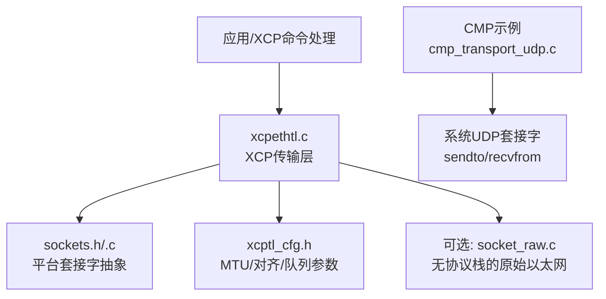
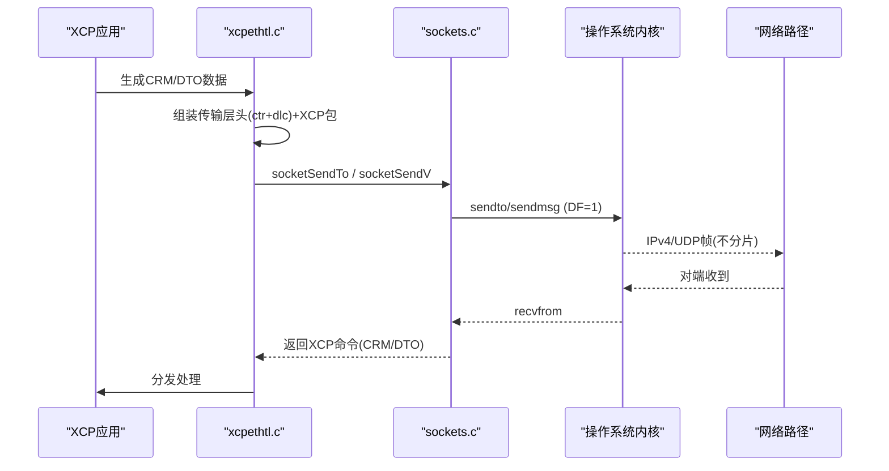
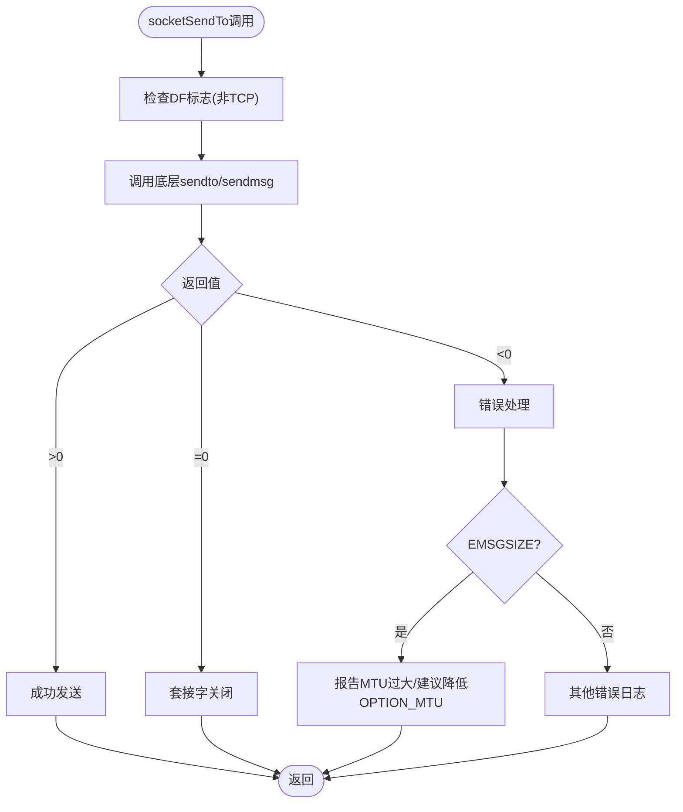
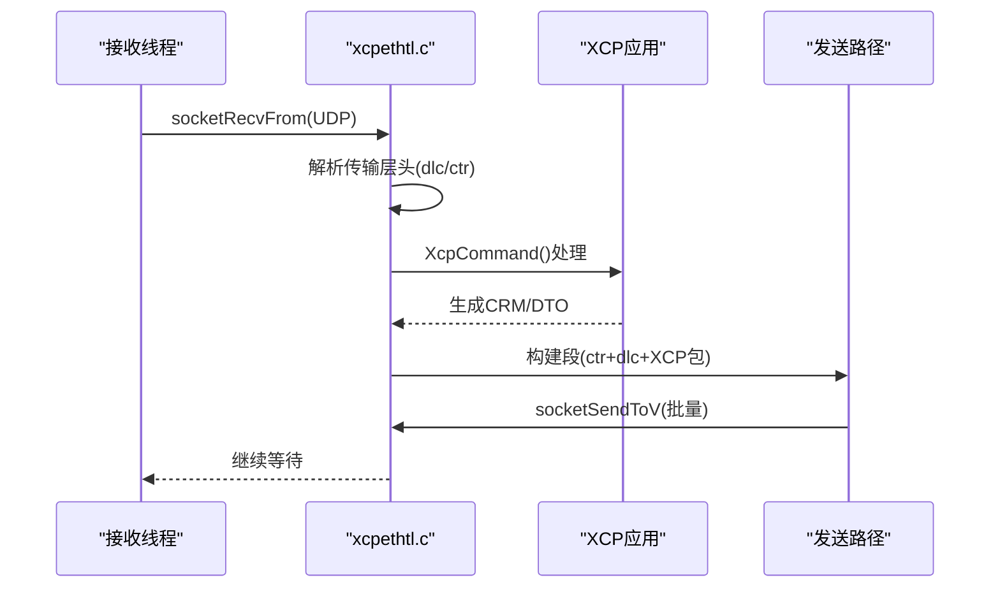
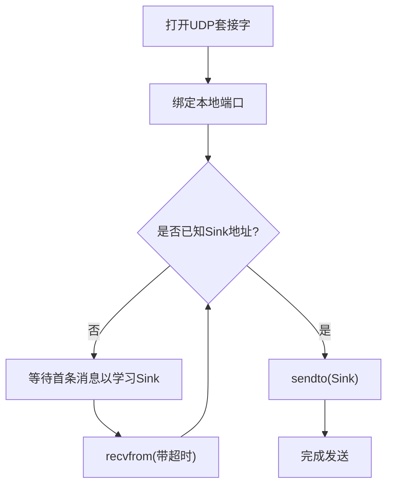
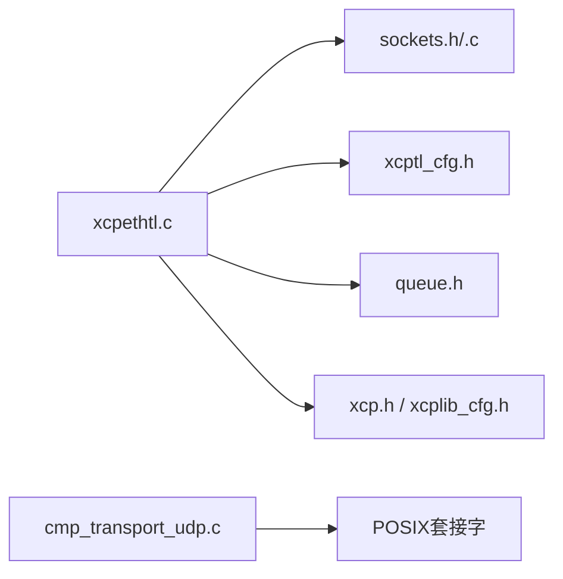

# UDP传输层

<cite>
**本文引用的文件**
- [src/sockets.h](file://src/sockets.h)
- [src/sockets.c](file://src/sockets.c)
- [src/xcpethtl.h](file://src/xcpethtl.h)
- [src/xcpethtl.c](file://src/xcpethtl.c)
- [src/xcptl_cfg.h](file://src/xcptl_cfg.h)
- [examples/cmp_demo/src/cmp_transport_udp.c](file://examples/cmp_demo/src/cmp_transport_udp.c)
- [examples/cmp_demo/src/cmp_transport.h](file://examples/cmp_demo/src/cmp_transport.h)
- [docs/SOCKET_RAW.md](file://docs/SOCKET_RAW.md)
</cite>

## 目录
1. [简介](#简介)
2. [项目结构](#项目结构)
3. [核心组件](#核心组件)
4. [架构总览](#架构总览)
5. [详细组件分析](#详细组件分析)
6. [依赖关系分析](#依赖关系分析)
7. [性能考量](#性能考量)
8. [故障诊断指南](#故障诊断指南)
9. [结论](#结论)
10. [附录](#附录)

## 简介
本技术文档聚焦于XCPlite中的UDP传输层实现，覆盖以下主题：
- UDP套接字的跨平台抽象与错误处理
- CMP消息的封装格式（外层UDP头部与内层XCP数据）
- MTU管理与分片策略（禁止IP分片、路径MTU感知）
- 网络性能优化（缓冲区管理、批量发送、零拷贝、延迟优化）
- UDP传输配置选项与调优指南
- 网络故障诊断与性能分析方法

## 项目结构
与UDP传输相关的关键代码分布在如下位置：
- 套接字抽象层：src/sockets.h/.c
- XCP以太网传输层：src/xcpethtl.h/.c
- 传输层配置：src/xcptl_cfg.h
- CMP over UDP示例：examples/cmp_demo/src/cmp_transport_udp.c, cmp_transport.h
- 原始以太网传输说明：docs/SOCKET_RAW.md

图表来源
- [src/xcpethtl.c:126-179](file://src/xcpethtl.c#L126-L179)
- [src/sockets.h:207-318](file://src/sockets.h#L207-L318)
- [src/xcptl_cfg.h:51-82](file://src/xcptl_cfg.h#L51-L82)
- [examples/cmp_demo/src/cmp_transport_udp.c:67-151](file://examples/cmp_demo/src/cmp_transport_udp.c#L67-L151)

章节来源
- [src/sockets.h:207-318](file://src/sockets.h#L207-L318)
- [src/sockets.c:304-443](file://src/sockets.c#L304-L443)
- [src/xcpethtl.c:126-179](file://src/xcpethtl.c#L126-L179)
- [src/xcptl_cfg.h:51-82](file://src/xcptl_cfg.h#L51-L82)
- [examples/cmp_demo/src/cmp_transport_udp.c:67-151](file://examples/cmp_demo/src/cmp_transport_udp.c#L67-L151)

## 核心组件
- 套接字抽象层（sockets.h/.c）
  - 提供socketOpen/socketBind/socketSendTo/socketRecvFrom等统一接口
  - 在Linux/macOS/QNX/Windows上设置DF标志以禁用IP分片
  - 支持硬件时间戳（Linux）、多播加入、超时控制、关闭/重启
- XCP以太网传输层（xcpethtl.c/.h）
  - 负责XCP命令响应（CRM）和DAQ/EVENT数据的发送与接收
  - 使用向量I/O将多个XCP DTO打包进一个UDP段，提升吞吐
  - 维护主从地址、端口、连接状态及多播线程（可选）
- 传输层配置（xcptl_cfg.h）
  - 定义最大CTO/DTO大小、段大小（基于OPTION_MTU）、对齐方式、接收超时
  - 定义是否启用多播、是否通过队列发送CRM、TX头预留空间等
- CMP over UDP（cmp_transport_udp.c/.h）
  - 演示如何在普通UDP套接字上承载CMP消息
  - 计算外层MTU预算，限制最大CMP消息长度，避免IP分片

章节来源
- [src/sockets.h:207-318](file://src/sockets.h#L207-L318)
- [src/sockets.c:304-443](file://src/sockets.c#L304-L443)
- [src/xcpethtl.c:126-179](file://src/xcpethtl.c#L126-L179)
- [src/xcptl_cfg.h:37-114](file://src/xcptl_cfg.h#L37-L114)
- [examples/cmp_demo/src/cmp_transport_udp.c:67-151](file://examples/cmp_demo/src/cmp_transport_udp.c#L67-L151)
- [examples/cmp_demo/src/cmp_transport.h:38-69](file://examples/cmp_demo/src/cmp_transport.h#L38-L69)

## 架构总览
下图展示了从XCP应用到UDP网络的完整数据流，包括命令响应与DAQ数据路径。

图表来源
- [src/xcpethtl.c:126-179](file://src/xcpethtl.c#L126-L179)
- [src/sockets.c:304-443](file://src/sockets.c#L304-L443)

## 详细组件分析

### 套接字抽象层（sockets.h/.c）
- 功能要点
  - 创建UDP/TCP套接字，设置SO_REUSEADDR
  - 在非Windows平台为UDP设置DF标志（IP_PMTUDISC_DO/IP_DONTFRAG），确保路径MTU感知并拒绝分片
  - 提供socketSendTo/socketRecvFrom，支持可选的时间戳获取（Linux硬件/软件时间戳）
  - 提供socketSetTimeout用于阻塞模式下的周期性检查
  - Windows下特殊处理WSA错误码，提供socketGetErrorString
- 错误处理
  - 统一错误宏：SOCKET_ERROR_MSGSIZE、SOCKET_ERROR_TIMEDOUT等
  - socketIsClosed/socketWouldBlock/socketTimeout辅助判断
- 性能特性
  - Linux下支持scatter-gather I/O（socketSendToV/socketSendV）
  - 支持硬件时间戳（SOF_TIMESTAMPING_*）

图表来源
- [src/sockets.c:345-371](file://src/sockets.c#L345-L371)
- [src/sockets.c:730-778](file://src/sockets.c#L730-L778)
- [src/xcptl_cfg.h:51-82](file://src/xcptl_cfg.h#L51-L82)

章节来源
- [src/sockets.h:207-318](file://src/sockets.h#L207-L318)
- [src/sockets.c:304-443](file://src/sockets.c#L304-L443)
- [src/sockets.c:730-778](file://src/sockets.c#L730-L778)

### XCP以太网传输层（xcpethtl.c/.h）
- 功能要点
  - 初始化UDP/TCP监听或绑定，设置接收超时
  - 处理XCP命令：CONNECT建立后记录主机的IP与端口，后续仅接受来自该地址的请求
  - 发送CRM：构造传输层头（ctr+dlc+packet），走向量发送路径以避免重排序
  - 发送DAQ/EVENT：累积多个XCP DTO为一个UDP段，使用socketSendToV批量发送
  - 多播支持（可选）：独立线程接收GET_DAQ_CLOCK_MULTICAST
- 错误处理
  - 校验接收长度与头部一致性，丢弃损坏报文
  - 对EMSGSIZE进行特定处理（Windows接收超大报文的错误）
- 性能特性
  - 向量I/O减少系统调用次数
  - 队列累积策略提高吞吐，同时保持低延迟阈值

图表来源
- [src/xcpethtl.c:241-287](file://src/xcpethtl.c#L241-L287)
- [src/xcpethtl.c:377-534](file://src/xcpethtl.c#L377-L534)
- [src/xcpethtl.c:771-800](file://src/xcpethtl.c#L771-L800)

章节来源
- [src/xcpethtl.c:126-179](file://src/xcpethtl.c#L126-L179)
- [src/xcpethtl.c:241-287](file://src/xcpethtl.c#L241-L287)
- [src/xcpethtl.c:377-534](file://src/xcpethtl.c#L377-L534)
- [src/xcpethtl.c:771-800](file://src/xcpethtl.c#L771-L800)

### CMP over UDP（示例）
- 封装格式
  - 外层：IPv4 + UDP（由操作系统内核处理）
  - 内层：CMP消息（由上层编解码器生成）
  - 最大CMP消息长度 = outer_mtu - IP4_UDP_HDR_LEN（28字节）
- 行为
  - 支持动态学习Data Sink地址（首次收到消息时记录源地址）
  - 发送失败时区分EMSGSIZE（超过路径MTU）与其他错误
  - 使用poll实现带超时的接收，支持wakeup中断阻塞

图表来源
- [examples/cmp_demo/src/cmp_transport_udp.c:67-151](file://examples/cmp_demo/src/cmp_transport_udp.c#L67-L151)
- [examples/cmp_demo/src/cmp_transport_udp.c:171-201](file://examples/cmp_demo/src/cmp_transport_udp.c#L171-L201)
- [examples/cmp_demo/src/cmp_transport_udp.c:203-265](file://examples/cmp_demo/src/cmp_transport_udp.c#L203-L265)
- [examples/cmp_demo/src/cmp_transport.h:38-69](file://examples/cmp_demo/src/cmp_transport.h#L38-L69)

章节来源
- [examples/cmp_demo/src/cmp_transport_udp.c:67-151](file://examples/cmp_demo/src/cmp_transport_udp.c#L67-L151)
- [examples/cmp_demo/src/cmp_transport_udp.c:171-201](file://examples/cmp_demo/src/cmp_transport_udp.c#L171-L201)
- [examples/cmp_demo/src/cmp_transport_udp.c:203-265](file://examples/cmp_demo/src/cmp_transport_udp.c#L203-L265)
- [examples/cmp_demo/src/cmp_transport.h:38-69](file://examples/cmp_demo/src/cmp_transport.h#L38-L69)

### 原始以太网传输（无协议栈）
- 适用场景
  - 目标设备无TCP/IP协议栈，仅提供原始以太网收发能力
- 关键机制
  - 在socket_raw.c中手工构建IPv4/UDP头部，计算校验和
  - ARP应答、ICMP Echo应答（便于调试）
  - 严格过滤：只接收目标MAC、目标IP、目标UDP端口，丢弃片段
  - 零拷贝发送：在队列段前预留头部空间，直接写入链路层/网络层/传输层头
- MTU与分片
  - 明确禁止IP分片；若帧过大，HAL返回错误并上报具体接口MTU

章节来源
- [docs/SOCKET_RAW.md:32-79](file://docs/SOCKET_RAW.md#L32-L79)
- [docs/SOCKET_RAW.md:140-231](file://docs/SOCKET_RAW.md#L140-L231)
- [docs/SOCKET_RAW.md:385-447](file://docs/SOCKET_RAW.md#L385-L447)

## 依赖关系分析
- xcpethtl.c依赖
  - sockets.h/.c：统一的套接字API
  - xcptl_cfg.h：段大小、对齐、超时、多播等配置
  - queue.h：队列缓冲与向量发送
  - xcp.h/xcplib_cfg.h：XCP协议与平台选项
- sockets.c依赖
  - 平台头文件（netinet/in.h、sys/socket.h等）
  - 可选：Linux时间戳、ifaddrs接口信息
- cmp_transport_udp.c依赖
  - 标准POSIX套接字API
  - poll用于超时等待

图表来源
- [src/xcpethtl.c:13-30](file://src/xcpethtl.c#L13-L30)
- [src/sockets.c:11-22](file://src/sockets.c#L11-L22)
- [examples/cmp_demo/src/cmp_transport_udp.c:18-29](file://examples/cmp_demo/src/cmp_transport_udp.c#L18-L29)

章节来源
- [src/xcpethtl.c:13-30](file://src/xcpethtl.c#L13-L30)
- [src/sockets.c:11-22](file://src/sockets.c#L11-L22)
- [examples/cmp_demo/src/cmp_transport_udp.c:18-29](file://examples/cmp_demo/src/cmp_transport_udp.c#L18-L29)

## 性能考量
- 缓冲区管理
  - 使用队列累积多个XCP DTO为一个UDP段，减少系统调用次数
  - 向量I/O（socketSendToV）进一步降低拷贝开销
- 批量发送
  - 在xcpethtl.c中通过XcpEthTlSendV将多个缓冲区一次性发送
  - 限制每段最大缓冲数量（MAX_BUFFERS）与最小更新时间（MIN_UPDATE_TIME_MS）
- 延迟优化
  - CRM可通过队列发送（XCPTL_CRM_VIA_TRANSMIT_QUEUE）以降低竞争，但可能增加少量延迟
  - 接收线程使用超时（XCPTL_RECV_TIMEOUT_MS）定期让出CPU执行后台任务
- 零拷贝
  - 原始以太网模式下，预留头部空间避免复制payload，显著降低内存带宽占用
- 时间戳
  - Linux支持硬件时间戳（SOF_TIMESTAMPING_*），可用于高精度同步与测量

章节来源
- [src/xcpethtl.c:182-237](file://src/xcpethtl.c#L182-L237)
- [src/xcpethtl.c:771-800](file://src/xcpethtl.c#L771-L800)
- [src/xcptl_cfg.h:83-114](file://src/xcptl_cfg.h#L83-L114)
- [docs/SOCKET_RAW.md:385-447](file://docs/SOCKET_RAW.md#L385-L447)

## 故障诊断指南
- 常见错误与定位
  - EMSGSIZE：数据包超过路径MTU，需降低OPTION_MTU或调整分段大小
  - 超时（ETIMEDOUT/EAGAIN）：检查接收超时设置与网络负载
  - 连接重置/中止：检查对端是否主动断开或防火墙拦截
- 诊断步骤
  - 使用tcpdump/wireshark抓包验证外层UDP头部与载荷
  - 确认DF标志已设置，避免IP分片
  - 在原始以太网模式下，先ping测试ARP/ICMP，再驱动XCP CONNECT/UPLOAD/DOWNLOAD
- 日志与指标
  - 启用调试级别日志查看收发细节
  - 统计发送/接收包数、向量计数、缓冲区直方图（如TEST_ENABLE_DBG_METRICS）

章节来源
- [src/sockets.c:345-371](file://src/sockets.c#L345-L371)
- [src/sockets.c:730-778](file://src/sockets.c#L730-L778)
- [src/xcpethtl.c:490-534](file://src/xcpethtl.c#L490-L534)
- [docs/SOCKET_RAW.md:32-79](file://docs/SOCKET_RAW.md#L32-L79)

## 结论
XCPlite的UDP传输层通过统一的套接字抽象、严格的MTU管理、向量批量发送与可选的零拷贝路径，实现了高吞吐、低延迟且可移植的XCP over UDP方案。CMP over UDP示例展示了如何在普通UDP套接字上安全承载CMP消息，避免IP分片并确保端到端正确性。结合硬件时间戳与合理的队列策略，可在多种平台上获得稳定的测量与标定性能。

## 附录

### 配置选项与调优指南
- OPTION_MTU
  - 设置为链路MTU（不含以太网头），段大小为(OPTION_MTU - 28)对齐到8字节
  - 过大会导致EMSGSIZE；过小会降低吞吐
- XCPTL_MAX_SEGMENT_SIZE
  - 由OPTION_MTU推导，决定每个UDP段的最大载荷
- XCPTL_RECV_TIMEOUT_MS
  - 接收线程超时周期，影响后台任务调度与响应延迟
- XCPTL_CRM_VIA_TRANSMIT_QUEUE
  - 通过队列发送CRM可降低竞争，但可能引入微小延迟
- 多播（XCPTL_ENABLE_MULTICAST）
  - 仅在需要多播时钟同步时启用，会增加额外线程与资源占用
- 原始以太网模式（OPTION_ENABLE_UDP_RAW）
  - 适用于无协议栈的目标，需实现HAL后端；注意零拷贝与校验和配置

章节来源
- [src/xcptl_cfg.h:51-114](file://src/xcptl_cfg.h#L51-L114)
- [docs/SOCKET_RAW.md:82-113](file://docs/SOCKET_RAW.md#L82-L113)