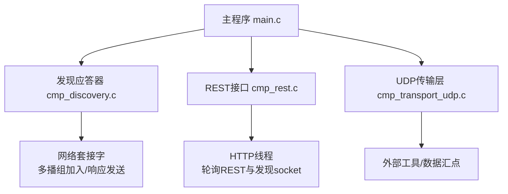
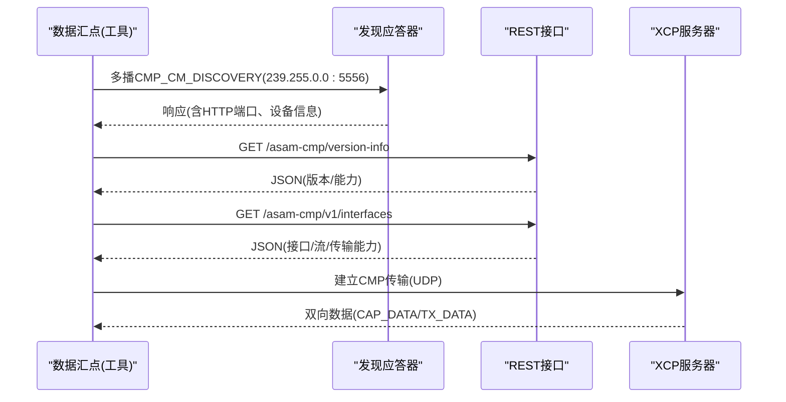
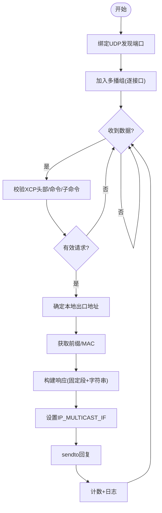
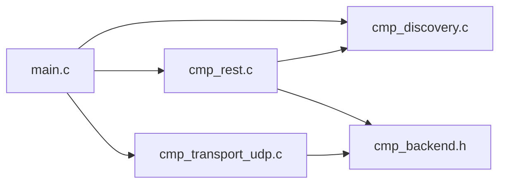

# 服务发现机制

<cite>
**本文引用的文件**
- [cmp_discovery.c](file://examples/cmp_demo/src/cmp_discovery.c)
- [cmp_discovery.h](file://examples/cmp_demo/src/cmp_discovery.h)
- [cmp_rest.c](file://examples/cmp_demo/src/cmp_rest.c)
- [cmp_transport_udp.c](file://examples/cmp_demo/src/cmp_transport_udp.c)
- [main.c](file://examples/cmp_demo/src/main.c)
- [XCP_DISCOVERY.md](file://docs/XCP_DISCOVERY.md)
- [discovery_probe.py](file://examples/cmp_demo/test/discovery_probe.py)
</cite>

## 目录
1. [简介](#简介)
2. [项目结构](#项目结构)
3. [核心组件](#核心组件)
4. [架构总览](#架构总览)
5. [详细组件分析](#详细组件分析)
6. [依赖关系分析](#依赖关系分析)
7. [性能考虑](#性能考虑)
8. [故障排除指南](#故障排除指南)
9. [结论](#结论)
10. [附录：API参考与使用示例](#附录api参考与使用示例)

## 简介
本文件聚焦于XCPlite中CMP（Capture Module Protocol）服务发现机制，围绕CMP_CM_DISCOVERY消息的处理流程展开，涵盖设备扫描、能力协商与连接管理；详细说明多播通信的实现要点（组加入、TTL设置与响应处理）；解析服务发现的配置参数（HTTP端口、序列号、描述信息）；解释静态配置模式与动态发现模式的切换机制；并提供故障排除指南、性能优化建议以及完整的API参考与使用示例。

## 项目结构
CMP服务发现在示例工程examples/cmp_demo中实现，核心由以下模块组成：
- 发现应答器：负责监听并响应CMP_CM_DISCOVERY请求，构造并发送包含设备信息的响应
- REST接口：提供只读的ASAM CMP REST端点，供数据汇点查询设备能力与状态
- UDP传输层：封装/解封装CMP报文，承载捕获数据与控制/传输数据
- 主程序：初始化XCP服务器、REST与发现模块，组织主循环

图表来源
- [main.c:181-338](file://examples/cmp_demo/src/main.c#L181-L338)
- [cmp_discovery.c:180-250](file://examples/cmp_demo/src/cmp_discovery.c#L180-L250)
- [cmp_rest.c:225-268](file://examples/cmp_demo/src/cmp_rest.c#L225-L268)
- [cmp_transport_udp.c:67-151](file://examples/cmp_demo/src/cmp_transport_udp.c#L67-L151)

章节来源
- [main.c:181-338](file://examples/cmp_demo/src/main.c#L181-L338)
- [cmp_discovery.h:37-65](file://examples/cmp_demo/src/cmp_discovery.h#L37-L65)

## 核心组件
- CMP发现应答器（cmp_discovery.c/h）
  - 绑定UDP到发现端口，加入多播组，接收CMP_CM_DISCOVERY请求
  - 解析请求，计算本地可达地址、前缀长度与MAC，组装响应（含HTTP端口、描述、序列号）
  - 通过正确的出接口将响应发回请求者（支持多播或单播回复）
- REST接口（cmp_rest.c）
  - 提供版本、识别、接口、测量等只读JSON端点
  - 单线程轮询HTTP与发现socket，复用同一事件循环
- UDP传输层（cmp_transport_udp.c）
  - 维护CMP over UDP的收发，支持从首个入站报文学习数据汇点地址
  - 计算最大可承载CMP消息大小（基于路径MTU减去IP/UDP头）
- 主程序（main.c）
  - 初始化XCP服务器、REST与发现模块
  - 根据命令行参数启用/禁用发现，配置设备标识与网络参数

章节来源
- [cmp_discovery.c:180-378](file://examples/cmp_demo/src/cmp_discovery.c#L180-L378)
- [cmp_rest.c:69-141](file://examples/cmp_demo/src/cmp_rest.c#L69-L141)
- [cmp_transport_udp.c:67-151](file://examples/cmp_demo/src/cmp_transport_udp.c#L67-L151)
- [main.c:181-338](file://examples/cmp_demo/src/main.c#L181-L338)

## 架构总览
CMP服务发现采用“XCP传输层命令”的多播发现方式：数据汇点向固定多播组与端口广播CMP_CM_DISCOVERY请求，捕获模块在收到后以请求携带的目标地址和端口进行回复，回复中包含捕获模块的IP、子网前缀、网关、MAC、HTTP端口、设备描述与序列号。随后数据汇点通过REST接口完成能力协商与连接管理。

图表来源
- [cmp_discovery.c:265-378](file://examples/cmp_demo/src/cmp_discovery.c#L265-L378)
- [cmp_rest.c:174-223](file://examples/cmp_demo/src/cmp_rest.c#L174-L223)
- [cmp_transport_udp.c:171-265](file://examples/cmp_demo/src/cmp_transport_udp.c#L171-L265)

## 详细组件分析

### CMP_CM_DISCOVERY消息处理流程
- 监听与组加入
  - 创建UDP套接字，绑定INADDR_ANY与发现端口
  - 枚举所有IPv4且支持多播的接口，逐个加入多播组（避免INADDR_ANY在多平台失效的问题）
- 请求解析
  - 校验XCP头部长度、命令码与子命令
  - 提取请求中的回复目标地址与端口（若为空则退化为请求源）
- 本地信息获取
  - 通过connect+getsockname确定对请求者的“本地出口地址”
  - 枚举接口获取前缀长度与MAC
- 响应构建与发送
  - 填充固定字段（IP、前缀、网关占位、MAC、IP版本、保留位、HTTP端口）
  - 追加设备描述与序列号（按A_UINT16长度+A_UTF8零终止并偶数对齐）
  - 设置IP_MULTICAST_IF为本地出口地址，确保响应从正确接口发出
  - 发送响应至请求指定的地址/端口

图表来源
- [cmp_discovery.c:180-250](file://examples/cmp_demo/src/cmp_discovery.c#L180-L250)
- [cmp_discovery.c:265-378](file://examples/cmp_demo/src/cmp_discovery.c#L265-L378)

章节来源
- [cmp_discovery.c:180-250](file://examples/cmp_demo/src/cmp_discovery.c#L180-L250)
- [cmp_discovery.c:265-378](file://examples/cmp_demo/src/cmp_discovery.c#L265-L378)

### 多播通信实现要点
- 多播组与端口
  - 组地址：239.255.0.0，端口：5556（CMP规范定义）
- 组加入策略
  - 遍历所有IPv4接口，仅对IFF_UP且IFF_MULTICAST的接口加入组
  - 避免使用INADDR_ANY作为imr_interface（跨平台不可靠）
- TTL设置
  - 当前实现未显式设置IP_MULTICAST_TTL；默认值取决于系统栈
  - 如需控制多播范围，可在发送前设置该选项
- 响应处理
  - 优先使用请求中携带的回复目标地址/端口
  - 若为空则回退到请求源地址/端口
  - 通过IP_MULTICAST_IF指定出接口，确保响应经请求者所在接口返回

章节来源
- [cmp_discovery.c:210-249](file://examples/cmp_demo/src/cmp_discovery.c#L210-L249)
- [cmp_discovery.c:297-366](file://examples/cmp_demo/src/cmp_discovery.c#L297-L366)
- [XCP_DISCOVERY.md:97-129](file://docs/XCP_DISCOVERY.md#L97-L129)

### 服务发现配置参数
- HTTP端口
  - 在tCmpDiscoveryConfig.http_port中设置，用于REST接口寻址
  - 默认在示例中为8080（可通过命令行--rest-port调整）
- 序列号与描述
  - tCmpDiscoveryConfig.serial与.description用于响应中的设备标识
  - 示例中序列号格式为“cmp_demo-XXXX”，描述为固定文本
- 其他
  - 发现端口与组地址为常量，遵循规范
  - 设备ID、流ID、接口ID由后端配置决定，影响REST接口上报

章节来源
- [cmp_discovery.h:43-47](file://examples/cmp_demo/src/cmp_discovery.h#L43-L47)
- [main.c:285-297](file://examples/cmp_demo/src/main.c#L285-L297)
- [cmp_rest.c:74-127](file://examples/cmp_demo/src/cmp_rest.c#L74-L127)

### 静态配置模式与动态发现模式切换
- 动态发现模式
  - 启动时调用cmpDiscoveryStart，加入多播组并监听发现请求
  - 通过REST接口暴露HTTP端口，供数据汇点自动发现
- 静态配置模式
  - 通过命令行参数--no-discovery禁用发现
  - 数据汇点需手动配置捕获模块的IP与端口
- 切换逻辑
  - main.c中根据命令行参数决定是否启用发现
  - 若REST未启用或发现失败，仍允许以静态模式运行

章节来源
- [main.c:223-297](file://examples/cmp_demo/src/main.c#L223-L297)
- [cmp_discovery.h:49-52](file://examples/cmp_demo/src/cmp_discovery.h#L49-L52)

### 连接管理与能力协商
- 能力协商
  - 数据汇点通过REST接口查询版本、识别、接口与测量信息
  - 接口信息包含传输选项、目的地址/端口、MTU、聚合能力等
- 连接管理
  - 首次收到数据汇点的传输请求时，UDP传输层学习其地址
  - 后续CAP_DATA/TX_DATA在该地址上双向传输
  - 若未学习到地址，捕获方向保持静默直到有入站请求

章节来源
- [cmp_rest.c:174-223](file://examples/cmp_demo/src/cmp_rest.c#L174-L223)
- [cmp_transport_udp.c:251-265](file://examples/cmp_demo/src/cmp_transport_udp.c#L251-L265)

## 依赖关系分析
- 主程序依赖
  - 初始化XCP服务器、REST与发现模块
  - 根据配置选择是否启用发现
- 发现模块依赖
  - 系统网络接口枚举（ifaddrs）
  - 多播组加入与出接口设置
- REST模块依赖
  - 后端状态查询（设备ID、流ID、接口ID、MTU等）
  - 与发现模块共享事件循环（poll）
- 传输层依赖
  - UDP套接字收发
  - 自唤醒管道用于非阻塞等待

图表来源
- [main.c:181-338](file://examples/cmp_demo/src/main.c#L181-L338)
- [cmp_rest.c:225-268](file://examples/cmp_demo/src/cmp_rest.c#L225-L268)
- [cmp_transport_udp.c:67-151](file://examples/cmp_demo/src/cmp_transport_udp.c#L67-L151)

章节来源
- [main.c:181-338](file://examples/cmp_demo/src/main.c#L181-L338)
- [cmp_rest.c:225-268](file://examples/cmp_demo/src/cmp_rest.c#L225-L268)
- [cmp_transport_udp.c:67-151](file://examples/cmp_demo/src/cmp_transport_udp.c#L67-L151)

## 性能考虑
- 多播组加入开销
  - 逐接口加入可能带来额外系统调用，建议在启动时缓存接口列表
- 响应构建与发送
  - 字符串拼接与内存拷贝应尽量避免重复分配
  - 设置IP_MULTICAST_IF仅在多播回复时执行
- 事件循环
  - REST与发现共用poll，注意超时与中断处理
- MTU与分片
  - 外层UDP报文不得被IP分片，需根据路径MTU限制CMP消息大小
  - 过大消息会导致发送失败或丢包

[本节为通用指导，不直接分析具体文件]

## 故障排除指南
- 无法加入多播组
  - 检查接口是否支持多播且处于UP状态
  - 确认未因权限问题导致setsockopt失败
- 收不到多播响应
  - 检查路由器/AP是否转发多播流量（无线环境常见）
  - 尝试让请求方同时请求单播回复（协议允许）
- 响应未到达请求者
  - 确认设置了IP_MULTICAST_IF为本地出口地址
  - 验证请求中携带的回复地址/端口是否正确
- REST不可用
  - 检查端口是否被占用或需要特权（低于1024）
  - 确认REST线程已启动并进入轮询
- 传输方向无数据
  - 确认已学习到数据汇点地址（首次入站请求会触发学习）
  - 检查路径MTU是否过小导致消息被丢弃

章节来源
- [cmp_discovery.c:210-249](file://examples/cmp_demo/src/cmp_discovery.c#L210-L249)
- [cmp_discovery.c:297-366](file://examples/cmp_demo/src/cmp_discovery.c#L297-L366)
- [cmp_rest.c:272-330](file://examples/cmp_demo/src/cmp_rest.c#L272-L330)
- [cmp_transport_udp.c:171-265](file://examples/cmp_demo/src/cmp_transport_udp.c#L171-L265)
- [XCP_DISCOVERY.md:97-129](file://docs/XCP_DISCOVERY.md#L97-L129)

## 结论
CMP服务发现通过标准的多播机制实现设备自动发现与能力协商，结合REST接口完成连接管理。实现中重点关注了跨平台多播组加入、出接口设置与响应路由，确保在不同网络环境下可靠工作。通过静态与动态模式的灵活切换，既满足自动化部署需求，也兼容传统手工配置场景。

[本节为总结性内容，不直接分析具体文件]

## 附录：API参考与使用示例

### API参考
- 发现模块
  - cmpDiscoveryStart(config): 启动发现，绑定端口并加入多播组
  - cmpDiscoveryFd(): 获取发现socket用于轮询
  - cmpDiscoveryService(): 处理一个发现请求并发送响应
  - cmpDiscoveryStop(): 停止发现并关闭socket
  - cmpDiscoveryCount(): 获取已响应的发现请求计数
- REST模块
  - cmpRestStart(port): 启动REST服务，单线程轮询HTTP与发现socket
  - cmpRestStop(): 停止REST服务并回收资源
- 传输层
  - cmpTransportOpen(config, transportp): 打开UDP传输，计算最大消息大小
  - cmpTransportSend/Recv/Wakeup: 发送、接收与唤醒
  - cmpTransportMaxMessage/GetSink/GetLocal: 查询能力与地址信息

章节来源
- [cmp_discovery.h:43-65](file://examples/cmp_demo/src/cmp_discovery.h#L43-L65)
- [cmp_rest.c:272-344](file://examples/cmp_demo/src/cmp_rest.c#L272-L344)
- [cmp_transport_udp.c:67-151](file://examples/cmp_demo/src/cmp_transport_udp.c#L67-L151)

### 使用示例
- 启动捕获模块并启用发现
  - 运行示例程序，默认启用REST与发现
  - 数据汇点可通过多播发现获取HTTP端口并访问REST接口
- 使用测试脚本探测发现
  - 运行discovery_probe.py，发送CMP_CM_DISCOVERY请求并解码响应
  - 支持指定回复端口、超时与期望HTTP端口
- 禁用发现并使用静态配置
  - 添加--no-discovery参数，数据汇点需手动配置捕获模块地址

章节来源
- [main.c:181-338](file://examples/cmp_demo/src/main.c#L181-L338)
- [discovery_probe.py:99-204](file://examples/cmp_demo/test/discovery_probe.py#L99-L204)