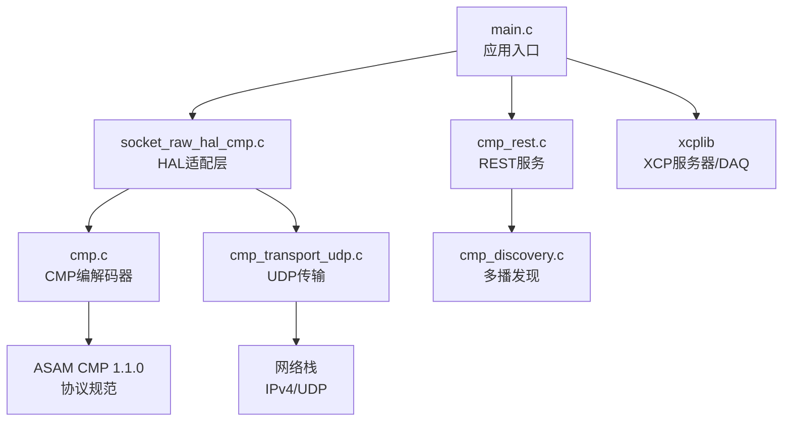
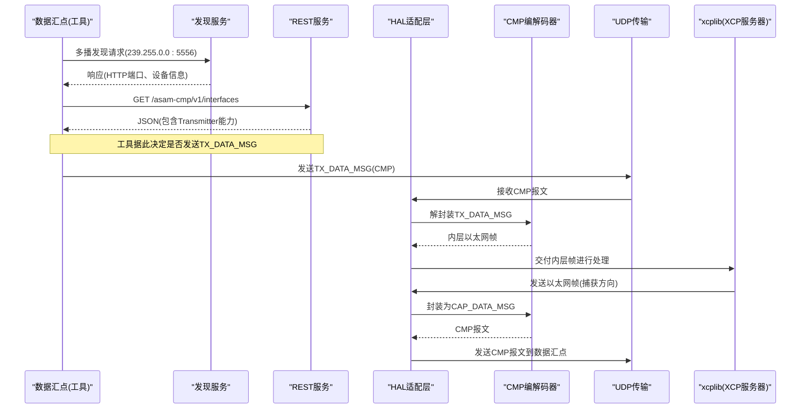
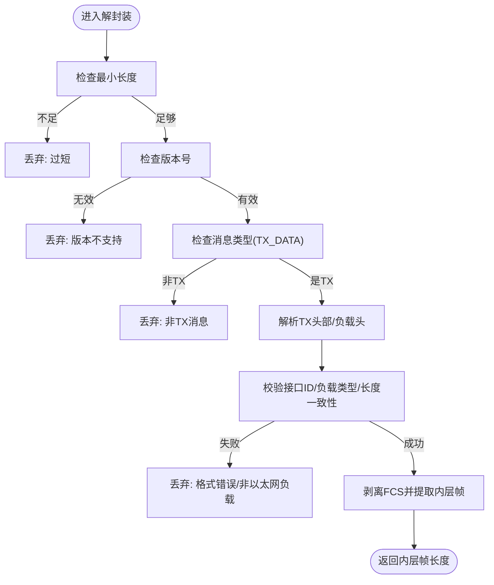
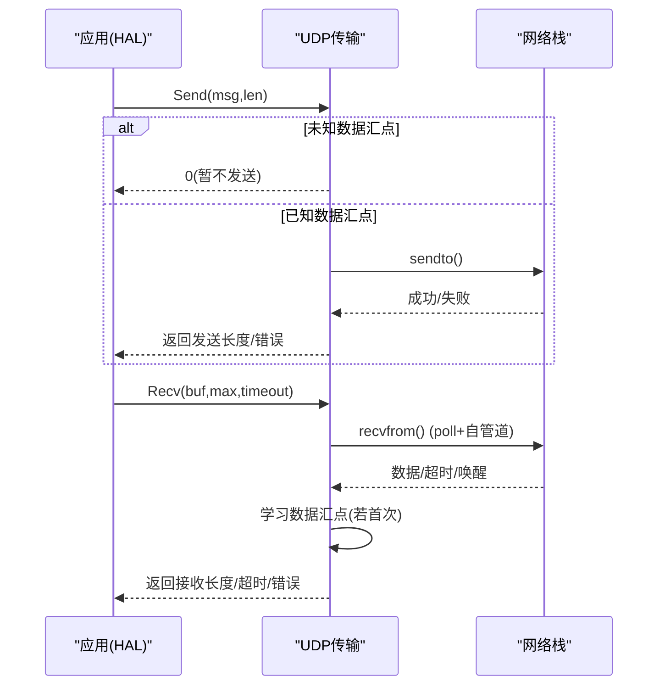
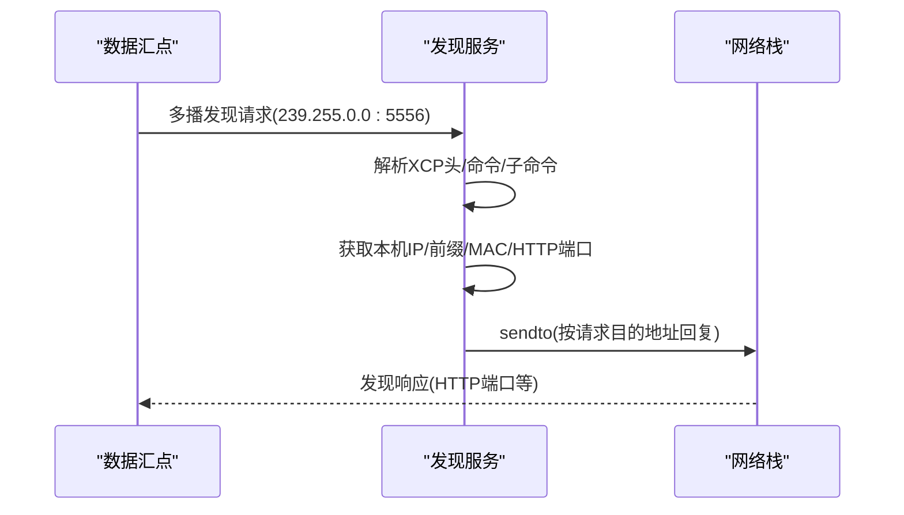
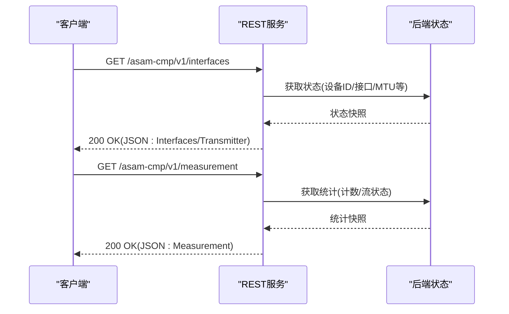
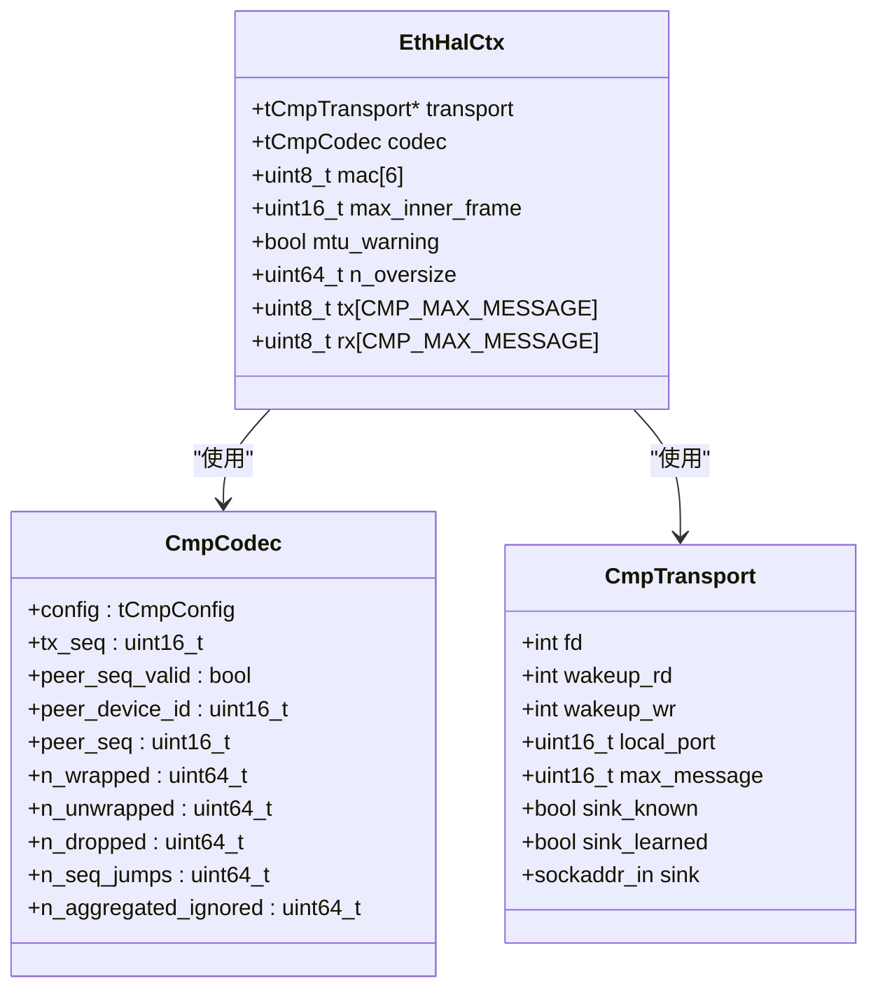
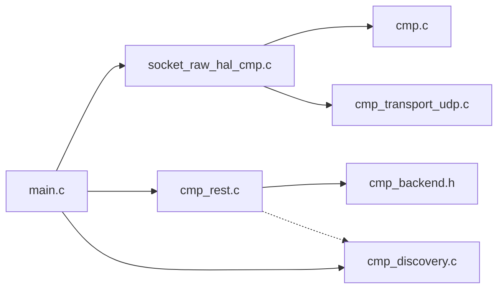

# 自定义消息协议示例

<cite>
**本文引用的文件**
- [examples/cmp_demo/src/cmp.h](file://examples/cmp_demo/src/cmp.h)
- [examples/cmp_demo/src/cmp.c](file://examples/cmp_demo/src/cmp.c)
- [examples/cmp_demo/src/cmp_transport.h](file://examples/cmp_demo/src/cmp_transport.h)
- [examples/cmp_demo/src/cmp_transport_udp.c](file://examples/cmp_demo/src/cmp_transport_udp.c)
- [examples/cmp_demo/src/cmp_discovery.h](file://examples/cmp_demo/src/cmp_discovery.h)
- [examples/cmp_demo/src/cmp_discovery.c](file://examples/cmp_demo/src/cmp_discovery.c)
- [examples/cmp_demo/src/cmp_rest.h](file://examples/cmp_demo/src/cmp_rest.h)
- [examples/cmp_demo/src/cmp_rest.c](file://examples/cmp_demo/src/cmp_rest.c)
- [examples/cmp_demo/src/socket_raw_hal_cmp.c](file://examples/cmp_demo/src/socket_raw_hal_cmp.c)
- [examples/cmp_demo/src/cmp_backend.h](file://examples/cmp_demo/src/cmp_backend.h)
- [examples/cmp_demo/src/main.c](file://examples/cmp_demo/src/main.c)
- [examples/cmp_demo/README.md](file://examples/cmp_demo/README.md)
- [examples/cmp_demo/test/discovery_probe.py](file://examples/cmp_demo/test/discovery_probe.py)
</cite>

## 目录
1. [简介](#简介)
2. [项目结构](#项目结构)
3. [核心组件](#核心组件)
4. [架构总览](#架构总览)
5. [详细组件分析](#详细组件分析)
6. [依赖关系分析](#依赖关系分析)
7. [性能考量](#性能考量)
8. [故障排查指南](#故障排查指南)
9. [结论](#结论)
10. [附录：API参考与使用示例](#附录api参考与使用示例)

## 简介
本示例实现了一个符合 ASAM CMP（Capture Module Protocol）1.1.0 的“捕获模块”模拟器，用于在测试环境中将 XCP 流量通过 CMP 隧道传输。其设计目标包括：
- 提供纯实现的 CMP 编解码器（无 I/O、无全局状态），便于单元测试与跨平台验证。
- 基于 UDP 的外层传输（CMP 6.4.2），无需 root 或 AF_PACKET，具备良好可移植性。
- 实现设备发现（CMP 12.1.1，XCP 多播发现）与只读 REST 接口（CMP 12.3），供数据汇点（Data Sink）自动发现并配置。
- 通过 HAL 适配层将 xcplib 的以太网帧封装为 CMP Captured Data Message（CAP_DATA_MSG, 0x01），并将来自数据汇点的 Transmit Data Message（TX_DATA_MSG, 0x04）解封装后交给 xcplib 处理。

该示例不修改 libxcplite，仅通过外部 HAL 覆盖实现，保持库与演示分离，便于复用和扩展。

## 项目结构
示例位于 examples/cmp_demo，关键目录与职责如下：
- src/cmp.{h,c}：CMP 信封编解码器，定义协议字段、长度常量、错误码及编解码函数。
- src/cmp_transport.{h,c}：外层传输抽象与 UDP 实现，负责绑定端口、收发完整 CMP 报文、学习数据汇点地址等。
- src/cmp_discovery.{h,c}：基于 XCP 的多播发现响应器（12.1.1），监听组播并返回 HTTP 端口等信息。
- src/cmp_rest.{h,c}：只读 REST 服务器（HTTP/1.1），实现版本信息、设备识别、接口能力与测量统计端点。
- src/socket_raw_hal_cmp.c：HAL 适配层，连接编解码器与传输层，实现 eth_hal_* 系列函数。
- src/cmp_backend.h：后端配置与状态结构体，贯穿 main、REST 与 HAL。
- src/main.c：应用入口，解析命令行参数，初始化 XCP/A2L，启动发现与 REST，进入主循环。
- test/discovery_probe.py：Python 工具，模拟数据汇点发送发现请求并解析响应。

图表来源
- [examples/cmp_demo/src/main.c:181-338](file://examples/cmp_demo/src/main.c#L181-L338)
- [examples/cmp_demo/src/socket_raw_hal_cmp.c:102-287](file://examples/cmp_demo/src/socket_raw_hal_cmp.c#L102-L287)
- [examples/cmp_demo/src/cmp.c:88-249](file://examples/cmp_demo/src/cmp.c#L88-L249)
- [examples/cmp_demo/src/cmp_transport_udp.c:67-325](file://examples/cmp_demo/src/cmp_transport_udp.c#L67-L325)
- [examples/cmp_demo/src/cmp_rest.c:174-344](file://examples/cmp_demo/src/cmp_rest.c#L174-L344)
- [examples/cmp_demo/src/cmp_discovery.c:180-378](file://examples/cmp_demo/src/cmp_discovery.c#L180-L378)

章节来源
- [examples/cmp_demo/README.md:1-120](file://examples/cmp_demo/README.md#L1-L120)
- [examples/cmp_demo/src/main.c:181-338](file://examples/cmp_demo/src/main.c#L181-L338)

## 核心组件
- CMP 编解码器（cmp.h/cmp.c）
  - 定义协议常量（EtherType、消息类型、负载类型、头部长度、标志位）。
  - 实现捕获方向封装（CAP_DATA_MSG）与传输方向解封装（TX_DATA_MSG）。
  - 维护流序列号、对端序列监控、丢弃计数等诊断信息。
- 传输层（cmp_transport.h/cmp_transport_udp.c）
  - 基于普通 UDP 套接字，支持本地端口绑定、外路径 MTU 限制、数据汇点地址学习。
  - 提供唤醒机制（自管道）以中断阻塞接收。
- 设备发现（cmp_discovery.h/cmp_discovery.c）
  - 监听多播组 239.255.0.0:5556，响应 XCP 传输层命令（CC_TRANSPORT_LAYER_CMD + 子命令 0x10）。
  - 返回本机 IP、前缀长度、MAC、HTTP 端口等，支持单播或多播回复。
- REST 接口（cmp_rest.h/cmp_rest.c）
  - 实现只读端点：版本信息、设备识别、接口能力（含发射器能力）、测量统计。
  - 单线程、Connection: close，简单可靠，适合测试环境。
- HAL 适配层（socket_raw_hal_cmp.c）
  - 将 xcplib 的以太网帧封装为 CMP 报文发送；从 CMP TX_DATA_MSG 解封装出内层帧交给 xcplib。
  - 管理最大内帧尺寸、MTU 警告、MAC 派生、统计输出。

章节来源
- [examples/cmp_demo/src/cmp.h:32-160](file://examples/cmp_demo/src/cmp.h#L32-L160)
- [examples/cmp_demo/src/cmp.c:88-249](file://examples/cmp_demo/src/cmp.c#L88-L249)
- [examples/cmp_demo/src/cmp_transport.h:35-69](file://examples/cmp_demo/src/cmp_transport.h#L35-L69)
- [examples/cmp_demo/src/cmp_transport_udp.c:67-325](file://examples/cmp_demo/src/cmp_transport_udp.c#L67-L325)
- [examples/cmp_demo/src/cmp_discovery.h:37-65](file://examples/cmp_demo/src/cmp_discovery.h#L37-L65)
- [examples/cmp_demo/src/cmp_discovery.c:180-378](file://examples/cmp_demo/src/cmp_discovery.c#L180-L378)
- [examples/cmp_demo/src/cmp_rest.h:31-41](file://examples/cmp_demo/src/cmp_rest.h#L31-L41)
- [examples/cmp_demo/src/cmp_rest.c:69-223](file://examples/cmp_demo/src/cmp_rest.c#L69-L223)
- [examples/cmp_demo/src/socket_raw_hal_cmp.c:102-326](file://examples/cmp_demo/src/socket_raw_hal_cmp.c#L102-L326)

## 架构总览
整体数据流分为两条路径：
- 捕获方向（ECU → 工具）：xcplib 构建的以太网帧经 eth_hal_send 被封装为 CAP_DATA_MSG，通过 UDP 发送给数据汇点。
- 传输方向（工具 → ECU）：数据汇点发送 TX_DATA_MSG，经 UDP 到达后由 eth_hal_recv 解封装得到内层帧，交由 xcplib 处理。

控制面：
- 设备发现：数据汇点多播发现请求，捕获模块返回 HTTP 端口，以便后续通过 REST 查询能力。
- REST 接口：提供只读 API，暴露设备标识、接口能力（含发射器支持）、测量统计等。

图表来源
- [examples/cmp_demo/src/cmp_discovery.c:265-378](file://examples/cmp_demo/src/cmp_discovery.c#L265-L378)
- [examples/cmp_demo/src/cmp_rest.c:174-223](file://examples/cmp_demo/src/cmp_rest.c#L174-L223)
- [examples/cmp_demo/src/socket_raw_hal_cmp.c:220-287](file://examples/cmp_demo/src/socket_raw_hal_cmp.c#L220-L287)
- [examples/cmp_demo/src/cmp.c:88-249](file://examples/cmp_demo/src/cmp.c#L88-L249)
- [examples/cmp_demo/src/cmp_transport_udp.c:171-265](file://examples/cmp_demo/src/cmp_transport_udp.c#L171-L265)

## 详细组件分析

### CMP 编解码器（cmp.h/cmp.c）
- 设计要点
  - 纯函数式：无 I/O、无全局状态，便于单元测试与跨平台链接。
  - 大端序访问：所有 CMP 头字段按规范为大端序，手动实现 put/get 函数避免平台宏差异。
  - 捕获方向封装：计算 payload_length、追加零值 FCS、设置 INSYNC 标志、递增流序列号。
  - 传输方向解封装：校验版本、消息类型、负载类型、接口 ID、分段标志、长度一致性；剥离 FCS；忽略聚合中的额外数据消息。
  - 错误处理：定义 tCmpResult 枚举，记录丢弃原因，便于日志与诊断。
- 复杂度
  - 封装/解封装均为 O(n)，n 为报文长度；主要开销在内存拷贝与字段解析。
- 优化机会
  - 预分配缓冲区减少动态分配；批量处理聚合消息时避免重复解析。
- 错误处理
  - 严格校验长度与标志位，区分“非本接口”“不支持负载类型”“格式错误”等场景。

图表来源
- [examples/cmp_demo/src/cmp.c:161-249](file://examples/cmp_demo/src/cmp.c#L161-L249)

章节来源
- [examples/cmp_demo/src/cmp.h:32-160](file://examples/cmp_demo/src/cmp.h#L32-L160)
- [examples/cmp_demo/src/cmp.c:88-249](file://examples/cmp_demo/src/cmp.c#L88-L249)

### UDP 传输层（cmp_transport.h/cmp_transport_udp.c）
- 设计要点
  - 使用普通 UDP 套接字，无需 root 或 AF_PACKET；内核处理 IPv4/UDP 与 ARP。
  - 支持数据汇点地址学习：首次收到报文时记录源地址，后续单向发送。
  - 外路径 MTU 限制：计算最大可承载 CMP 报文大小，防止 IP 分片。
  - 唤醒机制：通过自管道实现可中断的阻塞接收，支持多线程安全唤醒。
- 错误处理
  - 处理 EMSGSIZE（超过路径 MTU）、EINTR/EAGAIN（重试或超时）、bind/connect 失败等。
- 性能特性
  - 非阻塞 I/O + poll 模型，低延迟、可扩展；自管道唤醒避免忙轮询。

图表来源
- [examples/cmp_demo/src/cmp_transport_udp.c:171-265](file://examples/cmp_demo/src/cmp_transport_udp.c#L171-L265)

章节来源
- [examples/cmp_demo/src/cmp_transport.h:35-69](file://examples/cmp_demo/src/cmp_transport.h#L35-L69)
- [examples/cmp_demo/src/cmp_transport_udp.c:67-325](file://examples/cmp_demo/src/cmp_transport_udp.c#L67-L325)

### 设备发现（cmp_discovery.h/cmp_discovery.c）
- 原理
  - 监听多播组 239.255.0.0:5556，解析 XCP 传输层命令（CC_TRANSPORT_LAYER_CMD + 子命令 0x10）。
  - 构造响应：包含本机 IP、前缀长度、MAC、HTTP 端口、描述与序列号。
  - 回复策略：优先按请求中指定的目的地址与端口回复；若为空则回退到请求源地址与端口。
- 实现细节
  - 遍历所有支持多播的接口加入组播组，确保跨接口可达。
  - 设置 IP_MULTICAST_IF 指定回复出口，避免默认路由导致不可达。
  - 小端序读写辅助函数，显式处理字符串长度与填充。
- 错误处理
  - 忽略非 CMP_CM_DISCOVERY 请求；IPv6 请求打印警告（当前仅支持 IPv4）。

图表来源
- [examples/cmp_demo/src/cmp_discovery.c:265-378](file://examples/cmp_demo/src/cmp_discovery.c#L265-L378)

章节来源
- [examples/cmp_demo/src/cmp_discovery.h:37-65](file://examples/cmp_demo/src/cmp_discovery.h#L37-L65)
- [examples/cmp_demo/src/cmp_discovery.c:180-378](file://examples/cmp_demo/src/cmp_discovery.c#L180-L378)

### REST 接口（cmp_rest.h/cmp_rest.c）
- 设计模式
  - 只读 HTTP/1.1 服务器，单线程、Connection: close，简化实现。
  - 路由匹配：/asam-cmp/version-info、/asam-cmp/v1/identification、/asam-cmp/v1/interfaces、/asam-cmp/v1/measurement。
  - 响应格式：JSON 文本，Content-Type: application/json，状态码 200/400/404/405/500/503。
- 关键能力
  - /interfaces 中的 Transmitter 对象声明发射器支持（TransmissionSupportBitmask=1），使工具知道可发送 TX_DATA_MSG。
  - /measurement 报告捕获/传输/丢弃计数与流状态。
- 错误处理
  - 非法方法返回 405；未实现路径返回 404；内部错误返回 500；服务未就绪返回 503。

图表来源
- [examples/cmp_demo/src/cmp_rest.c:69-223](file://examples/cmp_demo/src/cmp_rest.c#L69-L223)

章节来源
- [examples/cmp_demo/src/cmp_rest.h:31-41](file://examples/cmp_demo/src/cmp_rest.h#L31-L41)
- [examples/cmp_demo/src/cmp_rest.c:174-344](file://examples/cmp_demo/src/cmp_rest.c#L174-L344)

### HAL 适配层（socket_raw_hal_cmp.c）
- 职责
  - 实现 eth_hal_open/close/send/recv/wakeup，桥接 xcplib 与 CMP 编解码器/传输层。
  - 派生 ECU MAC（本地管理单播），计算最大内帧尺寸，输出 MTU 警告。
  - 统计捕获/传输/丢弃/超限等指标，供 REST 与关闭日志使用。
- 数据流
  - 发送：xcplib 帧 → 封装 CAP_DATA_MSG → UDP 发送。
  - 接收：UDP 接收 CMP → 解封装 TX_DATA_MSG → 交付内层帧给 xcplib。
- 错误处理
  - 帧过大返回 ETH_HAL_ERROR_SIZE；未知数据汇点时丢弃但不报错；首次丢弃记录日志。

图表来源
- [examples/cmp_demo/src/socket_raw_hal_cmp.c:63-73](file://examples/cmp_demo/src/socket_raw_hal_cmp.c#L63-L73)
- [examples/cmp_demo/src/cmp.h:111-127](file://examples/cmp_demo/src/cmp.h#L111-L127)
- [examples/cmp_demo/src/cmp_transport.h:35-45](file://examples/cmp_demo/src/cmp_transport.h#L35-L45)

章节来源
- [examples/cmp_demo/src/socket_raw_hal_cmp.c:102-326](file://examples/cmp_demo/src/socket_raw_hal_cmp.c#L102-L326)
- [examples/cmp_demo/src/cmp_backend.h:20-75](file://examples/cmp_demo/src/cmp_backend.h#L20-L75)

## 依赖关系分析
- 模块耦合
  - main.c 依赖 HAL、REST、发现服务，负责生命周期管理。
  - HAL 依赖编解码器与传输层，屏蔽协议细节。
  - REST 依赖后端状态，读取运行时信息。
  - 发现服务独立于 REST，但共享同一线程的 poll 循环。
- 外部依赖
  - POSIX 套接字（Linux/macOS），平台无关的线程抽象（platform.h）。
  - xcplib 静态库，通过 HAL 符号覆盖内置后端。
- 潜在循环依赖
  - 无直接循环；REST 与发现服务均不反向依赖 HAL，仅通过状态接口读取。

图表来源
- [examples/cmp_demo/src/main.c:181-338](file://examples/cmp_demo/src/main.c#L181-L338)
- [examples/cmp_demo/src/socket_raw_hal_cmp.c:102-326](file://examples/cmp_demo/src/socket_raw_hal_cmp.c#L102-L326)
- [examples/cmp_demo/src/cmp_rest.c:174-344](file://examples/cmp_demo/src/cmp_rest.c#L174-L344)
- [examples/cmp_demo/src/cmp_discovery.c:180-378](file://examples/cmp_demo/src/cmp_discovery.c#L180-L378)

章节来源
- [examples/cmp_demo/src/main.c:181-338](file://examples/cmp_demo/src/main.c#L181-L338)
- [examples/cmp_demo/src/cmp_backend.h:20-75](file://examples/cmp_demo/src/cmp_backend.h#L20-L75)

## 性能考量
- MTU 约束
  - CMP 6.4.2 禁止 IP 分片，外层 IPv4/UDP 头占 28 字节，信封占 34 字节，标准 1500 MTU 下最大内帧为 1438 字节。
  - 示例在启动时检查 xcplib 最大帧是否超出预算，若超出发出警告并提供调整建议（提高 outer MTU 或降低 OPTION_MTU）。
- 零拷贝路径
  - 信封应用于后端自有缓冲区，不参与零拷贝路径，避免影响 XCPTL_TX_HEADROOM。
- 并发与阻塞
  - 传输层使用 poll + 自管道唤醒，避免忙轮询；REST 与发现共享单线程 poll 循环，轻量高效。
- 优化建议
  - 在高吞吐场景考虑 jumbo MTU（需网络设备支持）；减少聚合消息处理开销；合理设置队列大小与日志级别。

章节来源
- [examples/cmp_demo/README.md:150-181](file://examples/cmp_demo/README.md#L150-L181)
- [examples/cmp_demo/src/socket_raw_hal_cmp.c:150-183](file://examples/cmp_demo/src/socket_raw_hal_cmp.c#L150-L183)

## 故障排查指南
- 常见问题
  - 数据汇点无法发现：检查多播组与端口（239.255.0.0:5556），确认路由器/AP 允许组播回程。
  - 传输失败（MSGSIZE）：确认 outer MTU 设置与路径实际 MTU 一致；降低 xcplib OPTION_MTU 或启用 jumbo。
  - REST 不可用：确认端口未被占用；检查权限（低于 1024 端口需特权）。
  - 帧丢弃：查看日志中的丢弃原因（版本、负载类型、接口 ID、分段等）。
- 调试工具
  - discovery_probe.py：模拟数据汇点发送发现请求，验证发现流程。
  - Wireshark：使用内置 ASAM CMP 解析器（EtherType 0x99FE）抓包分析。
  - 日志输出：关注“CMP capture module”“frame budget”“dropped message”等关键字。

章节来源
- [examples/cmp_demo/test/discovery_probe.py:99-204](file://examples/cmp_demo/test/discovery_probe.py#L99-L204)
- [examples/cmp_demo/src/socket_raw_hal_cmp.c:274-287](file://examples/cmp_demo/src/socket_raw_hal_cmp.c#L274-L287)
- [examples/cmp_demo/README.md:210-248](file://examples/cmp_demo/README.md#L210-L248)

## 结论
本示例提供了一个完整、可移植且易于测试的 CMP 捕获模块实现，涵盖协议编解码、UDP 传输、设备发现与 REST 接口。其设计强调：
- 协议与传输解耦，便于替换底层实现（如未来支持 Ethernet EtherType 0x99FE）。
- 只读 REST 接口满足工具能力探测需求，确保注入路径可用。
- 严格的 MTU 管理与错误处理，保障稳定性与可观测性。
对于生产环境，可在此基础上扩展 Ethernet 传输、时间同步、聚合与分段等功能。

## 附录：API参考与使用示例

### REST API 参考
- GET /asam-cmp/version-info
  - 返回 CMP 版本与 API 版本。
- GET /asam-cmp/v1/identification
  - 返回设备描述、序列号、硬件/软件版本、DeviceId、监听端口等。
- GET /asam-cmp/v1/interfaces
  - 返回接口列表、数据负载类型、流信息、发射器能力（TransmissionSupportBitmask、AggregationMtu、AggregationCount）。
- GET /asam-cmp/v1/measurement
  - 返回捕获模块状态、消息计数、流状态。

章节来源
- [examples/cmp_demo/src/cmp_rest.c:69-141](file://examples/cmp_demo/src/cmp_rest.c#L69-L141)

### 使用示例
- 启动捕获模块（静态配置）
  - ./build/cmp_demo --sink 192.168.0.10:55555
- 启用发现与 REST
  - ./build/cmp_demo --rest-port 8080
- 查询版本信息
  - curl http://<host>:8080/asam-cmp/version-info
- 查询接口能力（确认发射器支持）
  - curl http://<host>:8080/asam-cmp/v1/interfaces
- 运行发现探针
  - python3 test/discovery_probe.py --expect-http 8080

章节来源
- [examples/cmp_demo/README.md:124-147](file://examples/cmp_demo/README.md#L124-L147)
- [examples/cmp_demo/README.md:252-281](file://examples/cmp_demo/README.md#L252-L281)
- [examples/cmp_demo/test/discovery_probe.py:99-204](file://examples/cmp_demo/test/discovery_probe.py#L99-L204)