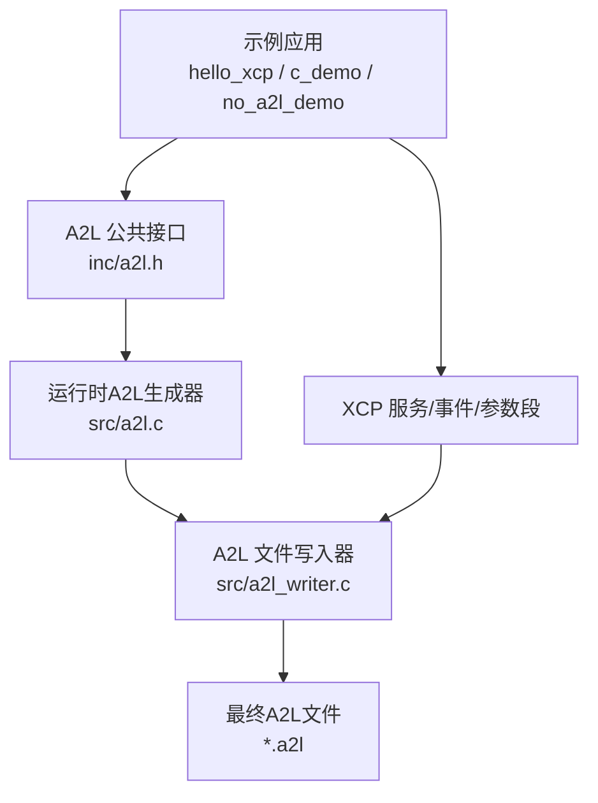
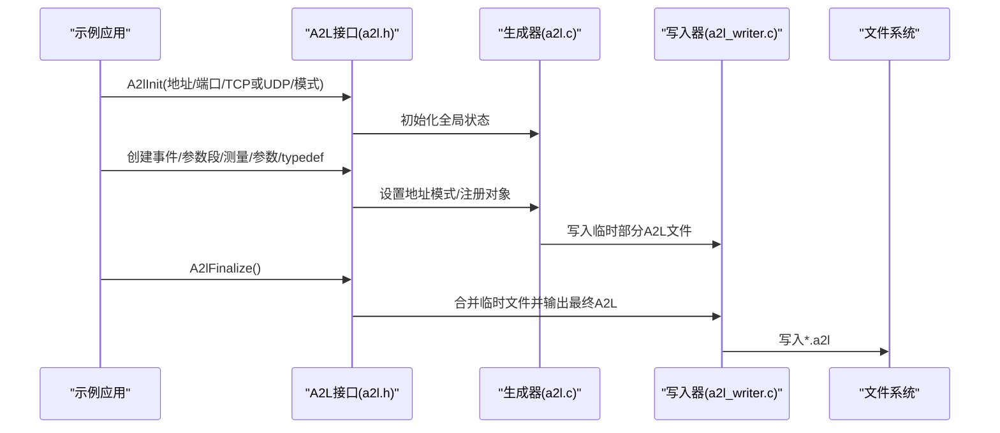
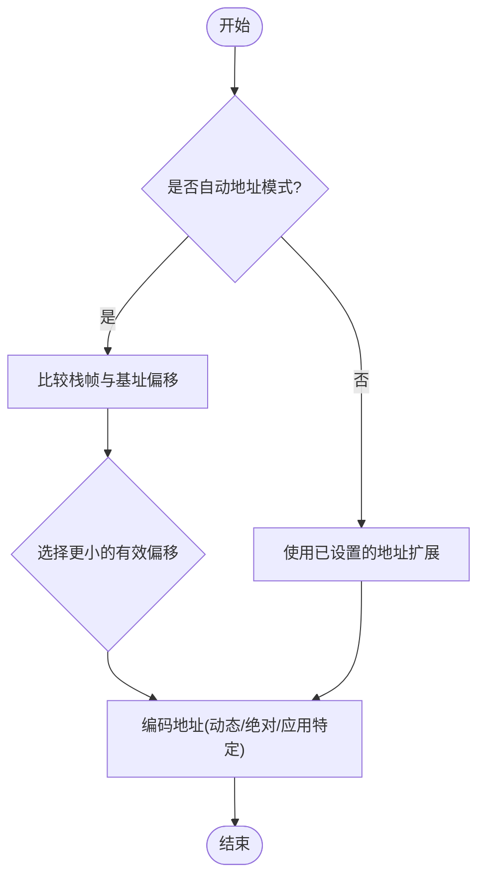
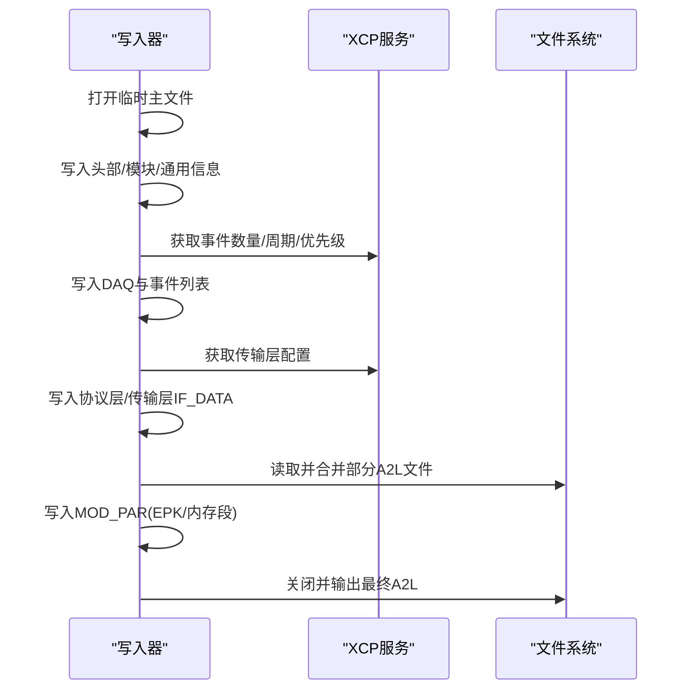
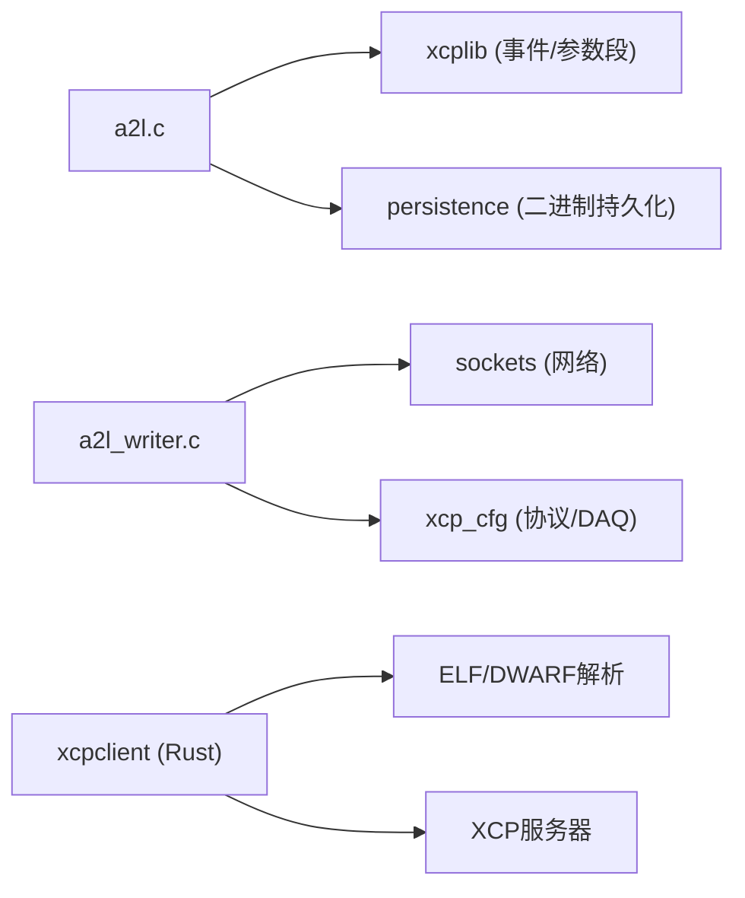

# 运行时A2L生成示例

<cite>
**本文引用的文件**
- [a2l.h](file://inc/a2l.h)
- [a2l.c](file://src/a2l.c)
- [a2l_writer.c](file://src/a2l_writer.c)
- [OFFLINE_A2L.md](file://docs/OFFLINE_A2L.md)
- [TECHNICAL.md](file://docs/TECHNICAL.md)
- [hello_xcp main.c](file://examples/hello_xcp/src/main.c)
- [c_demo main.c](file://examples/c_demo/src/main.c)
- [no_a2l_demo main.c](file://examples/no_a2l_demo/src/main.c)
- [xcpclient README.md](file://tools/xcpclient/README.md)
</cite>

## 目录
1. [简介](#简介)
2. [项目结构](#项目结构)
3. [核心组件](#核心组件)
4. [架构总览](#架构总览)
5. [详细组件分析](#详细组件分析)
6. [依赖关系分析](#依赖关系分析)
7. [性能与资源管理](#性能与资源管理)
8. [故障排查指南](#故障排查指南)
9. [结论](#结论)
10. [附录](#附录)

## 简介
本文件面向“运行时A2L生成”的完整实现与使用，聚焦以下目标：
- 动态A2L文件生成的技术实现：元数据提取、类型识别、文件格式输出。
- 运行时A2L与构建时（离线）A2L的区别与适用场景。
- A2L生成器内部工作机制：数据结构映射、属性处理、文件输出。
- A2L验证工具使用方法与调试技巧。
- 性能优化策略与资源管理最佳实践。
- 与CANape等工具的集成方式与兼容性考虑。

## 项目结构
围绕运行时A2L生成，仓库的关键位置如下：
- 公共API与类型定义：inc/a2l.h
- 运行时A2L生成逻辑：src/a2l.c
- A2L文件写入与合并：src/a2l_writer.c
- 示例应用（演示不同地址模式、事件、参数段、typedef等）：examples/*
- 离线A2L生成说明与工具：docs/OFFLINE_A2L.md, docs/TECHNICAL.md, tools/xcpclient/README.md

图表来源
- [a2l.h:644-726](file://inc/a2l.h#L644-L726)
- [a2l.c:36-80](file://src/a2l.c#L36-L80)
- [a2l_writer.c:451-530](file://src/a2l_writer.c#L451-L530)

章节来源
- [a2l.h:644-726](file://inc/a2l.h#L644-L726)
- [a2l.c:36-80](file://src/a2l.c#L36-L80)
- [a2l_writer.c:451-530](file://src/a2l_writer.c#L451-L530)

## 核心组件
- A2L公共接口（inc/a2l.h）
  - 提供初始化、模式控制、类型检测、地址模式设置、测量/参数/typedef创建、分组、转换、线程安全等宏与函数。
- 运行时A2L生成器（src/a2l.c）
  - 维护全局状态（事件、默认事件、地址扩展、帧指针、基址、分段索引）、自动地址模式选择、IF_DATA注入、临时文件管理、统计信息。
- A2L写入器（src/a2l_writer.c）
  - 负责写头部、协议层、DAQ事件列表、传输层IF_DATA、MOD_PAR（含校准段）、合并多个部分A2L文件并输出最终A2L。

章节来源
- [a2l.h:55-730](file://inc/a2l.h#L55-L730)
- [a2l.c:36-80](file://src/a2l.c#L36-L80)
- [a2l_writer.c:42-530](file://src/a2l_writer.c#L42-L530)

## 架构总览
运行时A2L生成流程概览：
- 应用通过A2L接口注册事件、参数段、测量/参数、typedef、转换等。
- 生成器在运行时将上述信息写入多个临时文件（对象、typedef、分组、转换），并在finalize阶段合并为最终A2L。
- 写入器根据XCP配置生成IF_DATA（协议层、DAQ、传输层），并写入EPK与内存段信息。

图表来源
- [a2l.c:36-80](file://src/a2l.c#L36-L80)
- [a2l_writer.c:451-530](file://src/a2l_writer.c#L451-L530)
- [a2l.h:644-726](file://inc/a2l.h#L644-L726)

## 详细组件分析

### 运行时A2L生成器（src/a2l.c）
- 全局状态
  - 固定事件、默认事件、地址扩展、帧指针、基址、分段索引、输入量名称、统计计数等。
- 地址模式
  - 支持绝对、相对、栈帧相对、自动（混合栈/基址）、分段相对、应用特定地址模式。
  - 自动模式在变量注册时根据地址差值选择最优基址（栈帧或用户基址），溢出时回退到绝对或应用特定模式。
- IF_DATA注入
  - 为测量对象注入FIXED_EVENT_LIST或DEFAULT_EVENT_LIST，以适配XCP工具对事件同步的要求。
- 文件名与持久化
  - 根据项目名与EPK生成唯一文件名；支持模板模式、包含AML文件等。

图表来源
- [a2l.c:713-800](file://src/a2l.c#L713-L800)

章节来源
- [a2l.c:36-80](file://src/a2l.c#L36-L80)
- [a2l.c:456-708](file://src/a2l.c#L456-L708)
- [a2l.c:713-800](file://src/a2l.c#L713-L800)

### A2L写入器（src/a2l_writer.c）
- 头部与模块信息
  - 写入ASAP2版本、项目/模块头、字节序与对齐等通用信息。
- 协议层与DAQ
  - 写入XCP协议层能力、可选命令、DAQ配置、时间戳单位、事件列表。
- 传输层IF_DATA
  - 根据TCP/UDP与绑定地址生成XCP_ON_TCP_IP或XCP_ON_UDP_IP块。
- MOD_PAR与内存段
  - 写入EPK、遍历校准段列表生成MEMORY_SEGMENT与IF_DATA SEGMENT/PAGE/CHECKSUM。
- 合并部分A2L
  - 读取应用生成的对象、typedef、分组、转换部分文件，合并入主A2L，并清理临时文件。

图表来源
- [a2l_writer.c:42-530](file://src/a2l_writer.c#L42-L530)

章节来源
- [a2l_writer.c:42-530](file://src/a2l_writer.c#L42-L530)

### 类型识别与元数据映射
- 类型识别
  - C++模板特化与C _Generic机制，将C/C++基本类型映射到A2L数据类型（如UBYTE、SWORD、FLOAT32_IEEE等）。
  - 支持一维/二维数组元素类型推导。
- 元数据
  - 通过宏（如XCP_UNIT、XCP_LIMITS、XCP_COMMENT）在ELF中留下标记，供离线工具或运行时解析；运行时用于标注测量/参数的单位、范围、注释等。
- 复杂类型
  - typedef结构体作为TYPEDEF_STRUCTURE+INSTANCE；嵌套结构体/类展开为嵌套typedef；成员偏移由宏计算。

章节来源
- [a2l.h:99-321](file://inc/a2l.h#L99-L321)
- [a2l_writer.c:484-508](file://src/a2l_writer.c#L484-L508)
- [OFFLINE_A2L.md:196-213](file://docs/OFFLINE_A2L.md#L196-L213)

### 示例应用中的运行时A2L用法
- hello_xcp
  - 展示事件创建、参数段与typedef、绝对/栈帧地址模式、线性转换、一次性注册（A2lOnce）。
- c_demo
  - 展示typedef参数段、共享轴曲线/地图、应用特定地址模式、一致性检查、多类型测量。
- no_a2l_demo
  - 演示无运行时A2L的场景，配合离线A2L生成（ELF/DWARF解析）。

章节来源
- [hello_xcp main.c:146-282](file://examples/hello_xcp/src/main.c#L146-L282)
- [c_demo main.c:130-376](file://examples/c_demo/src/main.c#L130-L376)
- [no_a2l_demo main.c:233-339](file://examples/no_a2l_demo/src/main.c#L233-L339)

## 依赖关系分析
- 运行时A2L生成器依赖：
  - 平台抽象（文件、线程、互斥锁）、XCP服务（事件/参数段枚举）、持久化（二进制文件）。
- 写入器依赖：
  - XCP配置（协议层、DAQ、传输层）、套接字（本地地址探测）、文件系统（读写临时与最终A2L）。
- 外部工具：
  - xcpclient用于离线A2L生成、连接XCP服务器、上传/下载A2L/ELF/BIN、测量与标定。

图表来源
- [a2l.c:13-33](file://src/a2l.c#L13-L33)
- [a2l_writer.c:13-33](file://src/a2l_writer.c#L13-L33)
- [xcpclient README.md:24-37](file://tools/xcpclient/README.md#L24-L37)

章节来源
- [a2l.c:13-33](file://src/a2l.c#L13-L33)
- [a2l_writer.c:13-33](file://src/a2l_writer.c#L13-L33)
- [xcpclient README.md:24-37](file://tools/xcpclient/README.md#L24-L37)

## 性能与资源管理
- 资源消耗
  - 静态内存约10KB（DAQ表、参数段页），堆内存约32KB（传输队列），每线程栈约1KB。
- 触发与传输
  - DAQ触发与数据传输采用无锁生产者实现；首次事件查找可能缓存结果。
- 文件IO
  - 运行时A2L生成使用文件IO，避免大内存占用；临时文件在finalize时合并并删除。
- 优化建议
  - 合理设置队列大小以覆盖预期流量峰值。
  - 使用A2lSetAutomaticAddrMode减少显式切换地址模式的开销。
  - 利用A2lOnce/A2lThreadOnce确保一次性注册，避免重复开销。
  - 在大型工程中启用自动分组（A2L_MODE_AUTO_GROUPS）提升可读性与组织性。

章节来源
- [TECHNICAL.md:5-27](file://docs/TECHNICAL.md#L5-L27)
- [TECHNICAL.md:28-52](file://docs/TECHNICAL.md#L28-L52)
- [a2l.c:56-80](file://src/a2l.c#L56-L80)
- [a2l_writer.c:405-445](file://src/a2l_writer.c#L405-L445)

## 故障排查指南
- 常见问题定位
  - 变量未出现在A2L：检查DW_AT_location是否存在（寄存器变量需volatile或使用捕获）；确认事件存在且地址模式正确。
  - 元数据不生效：确认命名路径（__分隔字段）与作用域匹配；检查作用域前缀。
  - EPK不匹配：确保A2L与目标软件版本一致，必要时使用--yes跳过检查。
  - 地址溢出：自动模式下若偏移超出限制，会回退到绝对或应用特定模式；检查基址与帧指针设置。
- 诊断信息
  - 编译器信息与优化级别、帧指针设置会在日志中记录；错误/警告级别可帮助定位问题。
- 工具辅助
  - 使用xcpclient列出测量/参数、过滤编译单元与变量名、仅包含带元数据的变量、生成模板A2L。

章节来源
- [OFFLINE_A2L.md:244-269](file://docs/OFFLINE_A2L.md#L244-L269)
- [xcpclient README.md:122-160](file://tools/xcpclient/README.md#L122-L160)

## 结论
运行时A2L生成为XCPlite提供了灵活、可扩展的测量与标定描述能力。通过类型识别、地址模式选择、元数据标注与文件合并，能够在目标设备上动态生成符合ASAM标准的A2L文件。结合离线A2L生成工具，可在无文件系统或受限环境中获得一致的A2L体验。与CANape等工具的集成依赖于正确的IF_DATA、事件列表与校准段描述，遵循本文档的实践可获得稳定高效的开发调试流程。

## 附录

### 运行时A2L与构建时（离线）A2L对比
- 运行时A2L
  - 优点：无需额外工具链；可随目标运行态调整；支持持久化与冻结。
  - 适用：具备文件系统、允许运行时生成A2L的目标。
- 离线A2L
  - 优点：无运行时开销；适用于MCU/RTOS无文件系统场景；可通过ELF/DWARF精确重建。
  - 适用：资源受限或不允许运行时文件IO的目标。

章节来源
- [OFFLINE_A2L.md:1-11](file://docs/OFFLINE_A2L.md#L1-L11)
- [TECHNICAL.md:89-94](file://docs/TECHNICAL.md#L89-L94)

### 与CANape等工具的集成与兼容性
- 关键要求
  - 正确的IF_DATA（协议层、DAQ、传输层）、事件列表、校准段描述。
  - 注意CANape对某些特性的行为差异（如共享轴、地址扩展忽略、GET_ID模式等）。
- 兼容建议
  - 使用稳定的事件顺序与确定性注册顺序，保证A2L稳定。
  - 对于校准段，优先使用段相对或绝对地址模式，避免工具不支持的地址扩展。
  - 在需要时提供EPK并通过下载方式提供给工具，确保版本一致性。

章节来源
- [TECHNICAL.md:396-412](file://docs/TECHNICAL.md#L396-L412)
- [a2l_writer.c:97-177](file://src/a2l_writer.c#L97-L177)

### 常用命令与用法（xcpclient）
- 离线生成A2L模板与完整A2L
  - 从ELF生成模板：xcpclient --offline --elf <binary> --create-a2l-template --a2l <out>.a2l
  - 从ELF生成完整A2L：xcpclient --offline --elf <binary> --create-a2l --a2l <out>.a2l
- 在线生成A2L（结合XCP服务器信息）
  - xcpclient --dest-addr <ip:port> --udp --create-a2l --elf <binary> --a2l <out>.a2l
- 测量与标定
  - 列出变量：--list-mea/--list-cal
  - 采集数据：--mea ".*" --time 5
  - 设置参数：--cal <name> <value>

章节来源
- [xcpclient README.md:24-37](file://tools/xcpclient/README.md#L24-L37)
- [xcpclient README.md:259-275](file://tools/xcpclient/README.md#L259-L275)
- [xcpclient README.md:277-296](file://tools/xcpclient/README.md#L277-L296)