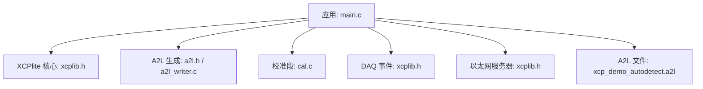
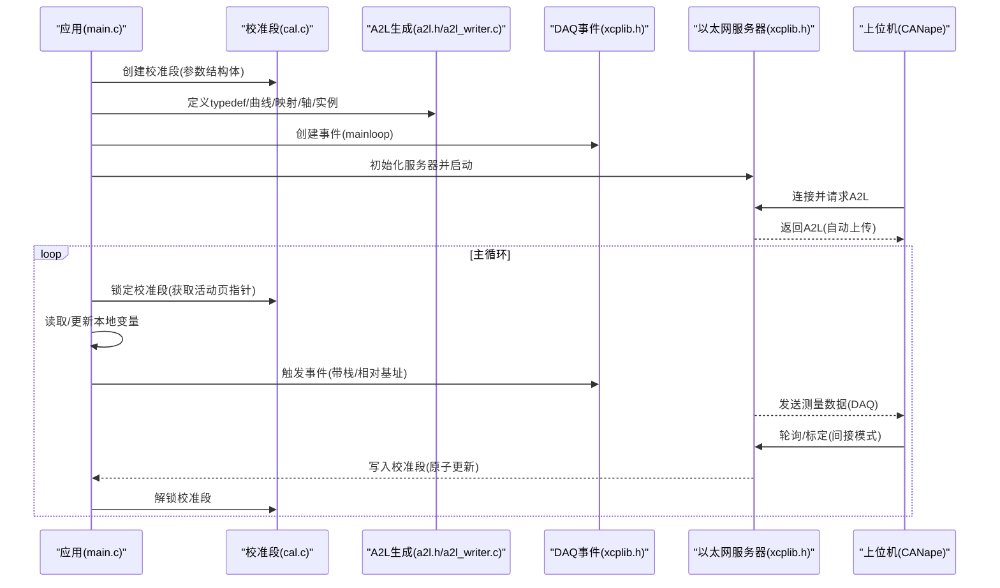
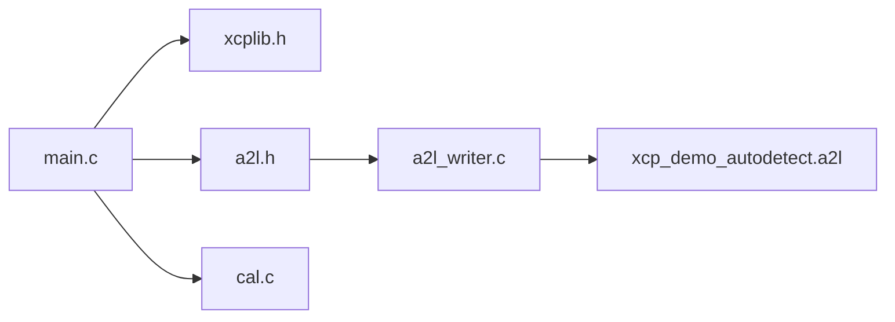

# C语言复杂对象示例

<cite>
**本文引用的文件**
- [examples/c_demo/src/main.c](file://examples/c_demo/src/main.c)
- [examples/c_demo/README.md](file://examples/c_demo/README.md)
- [examples/c_demo/CANape/xcp_demo_autodetect.a2l](file://examples/c_demo/CANape/xcp_demo_autodetect.a2l)
- [inc/a2l.h](file://inc/a2l.h)
- [inc/xcplib.h](file://inc/xcplib.h)
- [src/cal.c](file://src/cal.c)
- [src/a2l_writer.c](file://src/a2l_writer.c)
</cite>

## 目录
1. [简介](#简介)
2. [项目结构](#项目结构)
3. [核心组件](#核心组件)
4. [架构总览](#架构总览)
5. [详细组件分析](#详细组件分析)
6. [依赖关系分析](#依赖关系分析)
7. [性能考虑](#性能考虑)
8. [故障排查指南](#故障排查指南)
9. [结论](#结论)
10. [附录](#附录)

## 简介
本文件围绕 c_demo 示例，系统讲解在 XCP 传输中如何处理结构体、数组、指针等复杂数据类型的序列化与标定/测量。重点包括：
- 映射表（maps）和曲线（curves）的定义与使用
- 原子更新机制如何保证多线程环境下的数据一致性
- 轮询模式的实现与优化技巧
- 复杂数据类型的 A2L 描述生成、内存布局优化与性能调优策略
- 面向复杂数据结构应用的最佳实践

## 项目结构
c_demo 示例位于 examples/c_demo，包含应用主程序、CANape 工程与自动生成的 A2L 描述文件。核心入口为 main.c，通过 XCPlite API 完成：
- XCP 服务器初始化与事件创建
- 校准段（Calibration Segment）创建与锁/解锁访问
- A2L 类型定义与实例化（含曲线、映射、轴）
- 全局变量与栈变量的测量注册
- 自定义内存访问回调（可选）

图表来源
- [examples/c_demo/src/main.c:130-183](file://examples/c_demo/src/main.c#L130-L183)
- [inc/xcplib.h:36-56](file://inc/xcplib.h#L36-L56)
- [inc/a2l.h:20-46](file://inc/a2l.h#L20-L46)
- [src/cal.c:119-180](file://src/cal.c#L119-L180)
- [src/a2l_writer.c:42-90](file://src/a2l_writer.c#L42-L90)

章节来源
- [examples/c_demo/src/main.c:130-183](file://examples/c_demo/src/main.c#L130-L183)
- [examples/c_demo/README.md:1-28](file://examples/c_demo/README.md#L1-L28)

## 核心组件
- 校准段（Calibration Segment）：提供工作页（RAM）与参考页（FLASH），支持无锁、一致性的原子访问与页面切换。
- A2L 生成器：运行时自动生成 A2L，支持绝对/相对/栈/段地址模式，支持 typedef、曲线、映射、轴、组等。
- DAQ 事件：用于触发测量，支持时间戳与多基址扩展。
- 以太网服务器：XCP over Ethernet/TCP/UDP 的收发队列与状态管理。
- 应用特定内存访问：可注册读/写回调以访问用户虚拟地址空间。

章节来源
- [inc/xcplib.h:61-139](file://inc/xcplib.h#L61-L139)
- [inc/a2l.h:20-46](file://inc/a2l.h#L20-L46)
- [examples/c_demo/src/main.c:81-121](file://examples/c_demo/src/main.c#L81-L121)

## 架构总览
下图展示了 c_demo 从应用到协议层与 A2L 文件的整体交互流程，涵盖校准段、事件触发、测量与轮询路径。

图表来源
- [examples/c_demo/src/main.c:130-183](file://examples/c_demo/src/main.c#L130-L183)
- [examples/c_demo/src/main.c:286-324](file://examples/c_demo/src/main.c#L286-L324)
- [src/cal.c:119-180](file://src/cal.c#L119-L180)
- [src/a2l_writer.c:42-90](file://src/a2l_writer.c#L42-L90)

## 详细组件分析

### 复杂数据类型与序列化
- 结构体：params_t 包含标量、二维数组（map）、一维数组（curve）及共享轴（curve_axis）。通过 A2L typedef 将结构体成员映射为标定参数或测量项。
- 数组与矩阵：演示了 float 一维数组与二维矩阵的测量注册，支持多维记录布局。
- 指针与栈变量：通过“栈地址模式”与“相对地址模式”，对局部变量进行安全测量；同时演示了基于模块基址的相对寻址。

关键要点
- 使用 A2lSetSegmentAddrMode 将结构体成员注册到校准段，获得原子访问与页面切换能力。
- 使用 A2lSetStackAddrMode/A2lSetRelativeAddrMode 对栈/堆变量进行测量，避免全局污染。
- 曲线与映射通过 A2lTypedefCurveComponent/A2lTypedefMapComponent 声明，支持固定轴或共享轴。

章节来源
- [examples/c_demo/src/main.c:33-58](file://examples/c_demo/src/main.c#L33-L58)
- [examples/c_demo/src/main.c:158-183](file://examples/c_demo/src/main.c#L158-L183)
- [examples/c_demo/src/main.c:211-257](file://examples/c_demo/src/main.c#L211-L257)
- [inc/a2l.h:323-408](file://inc/a2l.h#L323-L408)

### 映射表（maps）与曲线（curves）
- 映射表：8x8 二维数组 map，使用固定轴（FIX_AXIS）描述维度与步长。
- 曲线：8 点一维数组 curve，支持固定轴或共享轴（curve_axis）。
- 轴：curve_axis 作为共享轴，供多个曲线复用，减少冗余。

A2L 中的体现
- TYPEDEF_STRUCTURE 定义 params_t 的结构与偏移。
- TYPEDEF_CHARACTERISTIC 定义曲线与映射的记录布局与轴信息。
- INSTANCE 将结构体实例映射到 ECU 地址空间。

章节来源
- [examples/c_demo/src/main.c:165-178](file://examples/c_demo/src/main.c#L165-L178)
- [examples/c_demo/CANape/xcp_demo_autodetect.a2l:70-79](file://examples/c_demo/CANape/xcp_demo_autodetect.a2l#L70-L79)
- [examples/c_demo/CANape/xcp_demo_autodetect.a2l:122-123](file://examples/c_demo/CANape/xcp_demo_autodetect.a2l#L122-L123)

### 原子更新机制与线程一致性
- 校准段提供工作页与参考页，XCP 客户端可通过 SET_CAL_PAGE 切换活动页。
- 应用侧通过 XcpLockCalSeg/XcpUnlockCalSeg 获取当前活动页指针，确保读取一致且无锁等待。
- 间接标定模式（CANape 工具启用）保证批量写入原子生效，避免中间态被读取。

一致性保障
- 主循环中将当前活动页拷贝到静态副本，校验 test_byte1 == -test_byte2，若不一致则打印警告，验证原子性。
- 校准段列表与内存分配采用原子操作与互斥保护，避免并发竞争。

章节来源
- [examples/c_demo/src/main.c:286-324](file://examples/c_demo/src/main.c#L286-L324)
- [inc/xcplib.h:61-139](file://inc/xcplib.h#L61-L139)
- [src/cal.c:119-180](file://src/cal.c#L119-L180)

### 轮询模式的实现与优化
- 轮询：CANape 配置为每秒轮询一次栈变量 counter，无需 DAQ 事件即可读取其值。
- 实现：通过 A2lSetStackAddrMode 将局部变量注册为测量，并在主循环中触发事件（即使未订阅，也可用于轮询路径）。
- 优化建议：
  - 降低轮询频率以减少总线负载。
  - 使用事件分组（GROUP）组织相关测量，便于批量订阅。
  - 合理设置队列大小，避免丢包。

章节来源
- [examples/c_demo/README.md:60-67](file://examples/c_demo/README.md#L60-L67)
- [examples/c_demo/src/main.c:211-244](file://examples/c_demo/src/main.c#L211-L244)
- [examples/c_demo/CANape/xcp_demo_autodetect.a2l:93-101](file://examples/c_demo/CANape/xcp_demo_autodetect.a2l#L93-L101)

### A2L 描述文件生成与内存布局
- 运行时生成：A2lInit 配置后，根据注册信息动态生成 A2L，支持模板与一次性写入。
- 内存段：MEMORY_SEGMENT 定义校准段地址范围与页属性，支持校验与只读页。
- 记录布局：RECORD_LAYOUT 定义不同基本类型的记录格式，CURVE/MAP 使用 AXIS_DESCR 描述轴。

优化建议
- 对齐：ALIGNMENT_* 设置为 1 以获得紧凑布局，减少带宽占用。
- 组：按功能划分 GROUP，提升工具端组织效率。
- 符号前缀：开启项目名前缀以避免命名冲突。

章节来源
- [src/a2l_writer.c:42-90](file://src/a2l_writer.c#L42-L90)
- [examples/c_demo/CANape/xcp_demo_autodetect.a2l:140-160](file://examples/c_demo/CANape/xcp_demo_autodetect.a2l#L140-L160)
- [inc/a2l.h:58-66](file://inc/a2l.h#L58-L66)

### 应用特定内存访问
- 通过 ApplXcpRegisterReadCallback/WriteCallback 注册回调，实现对用户虚拟地址空间的读写。
- 示例中 app_memory 结构体通过相对基址与地址扩展暴露给上位机。

注意事项
- 边界检查：回调内需校验读写范围，防止越界。
- 延迟写入：可在回调中实现延迟提交以保证一致性。

章节来源
- [examples/c_demo/src/main.c:81-121](file://examples/c_demo/src/main.c#L81-L121)
- [examples/c_demo/src/main.c:275-283](file://examples/c_demo/src/main.c#L275-L283)

## 依赖关系分析
- main.c 依赖 xcplib.h（XCP 核心、事件、服务器）、a2l.h（A2L 生成接口）。
- a2l.h 依赖 a2l_writer.c（实际写入逻辑）与 xcplib.h（事件/段句柄）。
- cal.c 提供校准段 RCU，被 main.c 调用以实现原子访问。
- A2L 文件由 a2l_writer.c 在运行期生成，反映内存段、事件、测量与标定项。

图表来源
- [examples/c_demo/src/main.c:130-183](file://examples/c_demo/src/main.c#L130-L183)
- [inc/a2l.h:20-46](file://inc/a2l.h#L20-L46)
- [src/a2l_writer.c:42-90](file://src/a2l_writer.c#L42-L90)
- [src/cal.c:119-180](file://src/cal.c#L119-L180)

章节来源
- [examples/c_demo/src/main.c:130-183](file://examples/c_demo/src/main.c#L130-L183)
- [inc/a2l.h:20-46](file://inc/a2l.h#L20-L46)
- [src/a2l_writer.c:42-90](file://src/a2l_writer.c#L42-L90)
- [src/cal.c:119-180](file://src/cal.c#L119-L180)

## 性能考虑
- 最小周期时间：通过 delay_us 控制主循环休眠，评估系统可持续的最小测量周期。
- 无锁队列：XCPlite 的测量队列支持极低延迟（典型平台可达亚微秒级锁时间）。
- 校准段原子访问：无互斥、无 CAS 的轻量锁，避免上下文切换开销。
- 队列大小：OPTION_QUEUE_SIZE 应足够大以容纳突发测量数据，避免溢出。
- 日志级别：调试时可提高日志等级观察命令流，但生产环境建议降低以减少开销。

章节来源
- [examples/c_demo/README.md:76-95](file://examples/c_demo/README.md#L76-L95)
- [examples/c_demo/src/main.c:16-28](file://examples/c_demo/src/main.c#L16-L28)

## 故障排查指南
- 连接失败：检查 CANape 设备配置中的 IP 与端口，确认服务器已启动。
- A2L 未更新：确认 A2L 模式（WRITE_ONCE/FINALIZE_ON_CONNECT）与 EPK 版本匹配。
- 校准不一致：检查间接标定模式是否启用，确保 test_byte1/test_byte2 约束满足。
- 轮询无数据：确认事件已创建且变量已注册到对应地址模式；检查队列是否溢出。
- 回调越界：检查应用特定内存回调的边界判断，避免访问非法地址。

章节来源
- [examples/c_demo/README.md:50-57](file://examples/c_demo/README.md#L50-L57)
- [examples/c_demo/src/main.c:98-119](file://examples/c_demo/src/main.c#L98-L119)
- [examples/c_demo/src/main.c:286-324](file://examples/c_demo/src/main.c#L286-L324)

## 结论
c_demo 展示了在 XCP 环境中处理复杂数据类型的完整流程：通过校准段实现原子一致的标定访问，借助 A2L 生成器将结构体、曲线、映射与轴映射到上位机工具，利用 DAQ 事件与轮询模式实现高效测量。结合合理的内存布局与性能调优，可在多线程环境下稳定运行并满足实时性要求。

## 附录
- 最佳实践
  - 优先使用校准段承载需要原子更新的复杂结构。
  - 使用 typedef 统一描述结构体，便于工具端解析与维护。
  - 将相关测量分组，减少工具端配置复杂度。
  - 谨慎设置队列大小与日志级别，平衡吞吐与开销。
  - 对栈/堆变量使用栈/相对地址模式，避免全局污染。
  - 在回调中严格进行边界检查，必要时实现延迟写入以保证一致性。