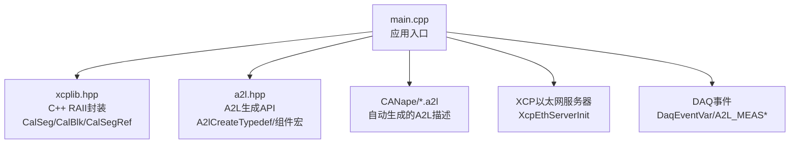
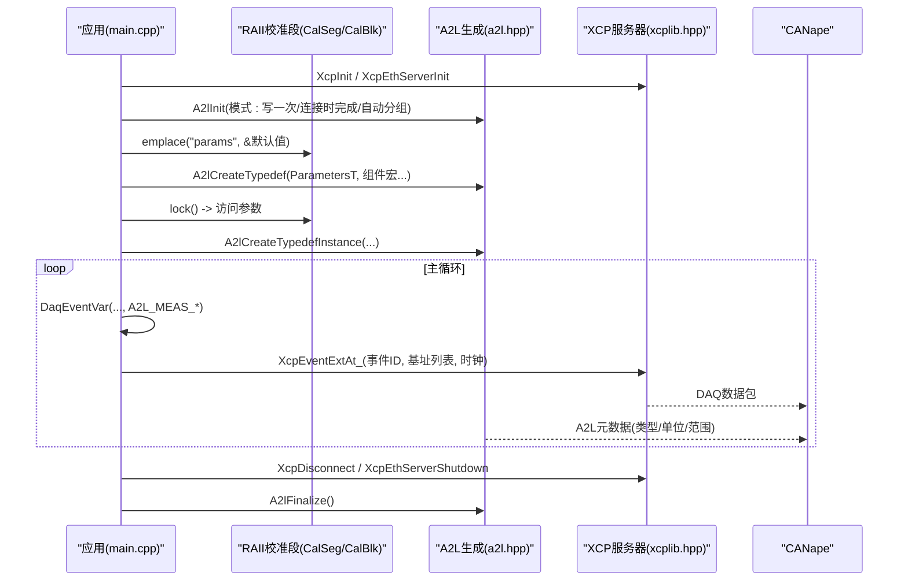
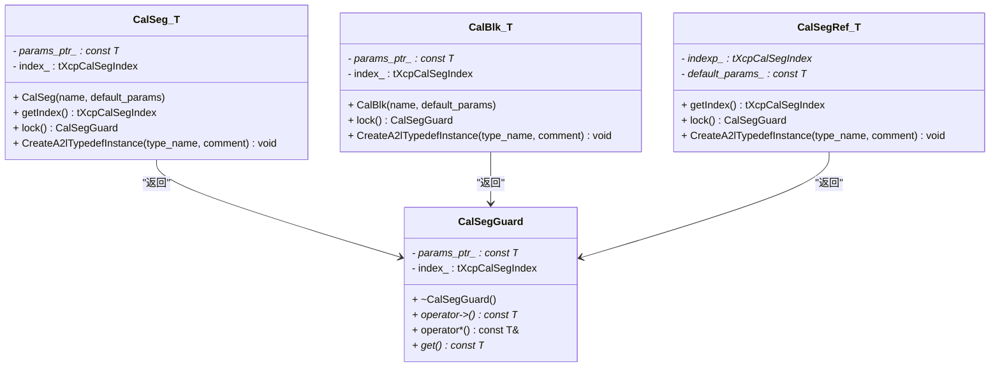
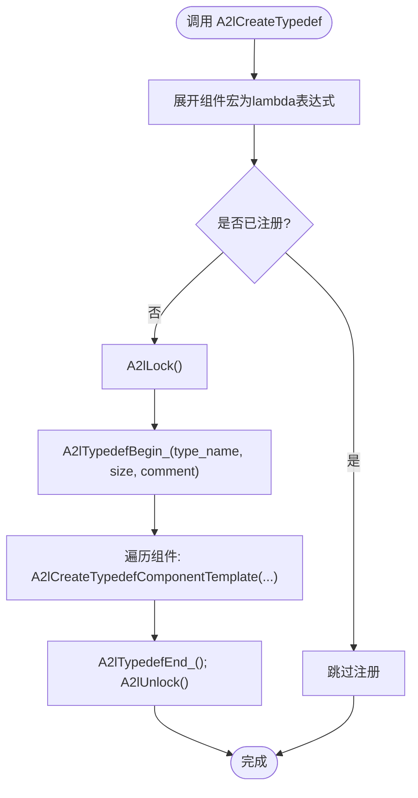
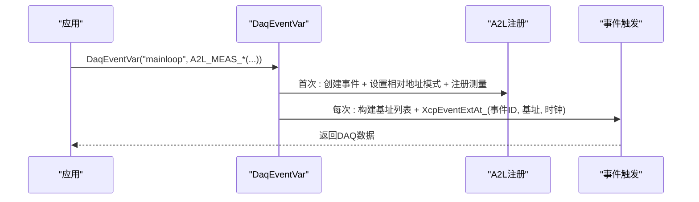
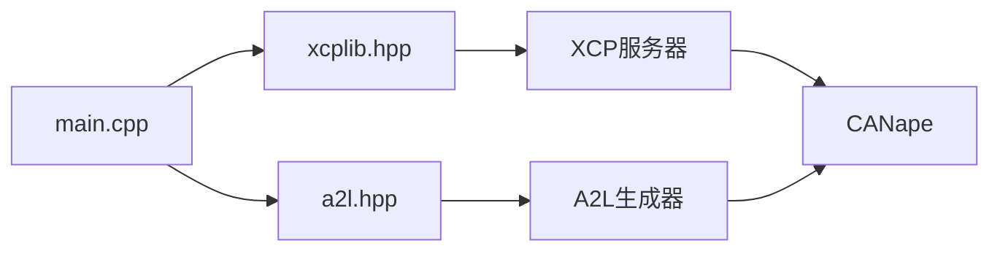

# Hello XCP C++示例

<cite>
**本文引用的文件**
- [examples/hello_xcp_cpp/src/main.cpp](file://examples/hello_xcp_cpp/src/main.cpp)
- [examples/hello_xcp_cpp/README.md](file://examples/hello_xcp_cpp/README.md)
- [inc/xcplib.hpp](file://inc/xcplib.hpp)
- [inc/a2l.hpp](file://inc/a2l.hpp)
- [examples/hello_xcp/src/main.c](file://examples/hello_xcp/src/main.c)
- [examples/hello_xcp_cpp/CANape/hello_xcp_cpp_autodetect.a2l](file://examples/hello_xcp_cpp/CANape/hello_xcp_cpp_autodetect.a2l)
- [docs/xcplib.md](file://docs/xcplib.md)
</cite>

## 目录
1. [简介](#简介)
2. [项目结构](#项目结构)
3. [核心组件](#核心组件)
4. [架构总览](#架构总览)
5. [详细组件分析](#详细组件分析)
6. [依赖关系分析](#依赖关系分析)
7. [性能考量](#性能考量)
8. [故障排查指南](#故障排查指南)
9. [结论](#结论)
10. [附录](#附录)

## 简介
本文件面向C++开发者，系统性讲解XCPlite的hello_xcp_cpp示例，重点聚焦：
- C++版本的RAII封装设计：使用智能指针与自动资源管理简化校准段生命周期。
- C与C++ API差异对比：类型安全、异常安全、变参宏/模板的优势。
- 变参宏在C++中的使用方式与收益。
- 完整代码解析、构建配置与CANape集成方法。
- 帮助快速上手XCPlite高级用法（事件测量、A2L生成、校准段等）。

## 项目结构
hello_xcp_cpp示例位于examples/hello_xcp_cpp，包含：
- src/main.cpp：C++示例主程序，演示XCP服务器初始化、A2L运行时生成、RAII校准段、事件测量、类成员测量等。
- CANape/：预配置的CANape工程与自动生成的A2L文件，用于连接和观测数据。
- README.md：构建与运行说明、特性对照表。

图表来源
- [examples/hello_xcp_cpp/src/main.cpp:183-295](file://examples/hello_xcp_cpp/src/main.cpp#L183-L295)
- [inc/xcplib.hpp:32-284](file://inc/xcplib.hpp#L32-L284)
- [inc/a2l.hpp:100-320](file://inc/a2l.hpp#L100-L320)
- [examples/hello_xcp_cpp/CANape/hello_xcp_cpp_autodetect.a2l:70-117](file://examples/hello_xcp_cpp/CANape/hello_xcp_cpp_autodetect.a2l#L70-L117)

章节来源
- [examples/hello_xcp_cpp/README.md:1-67](file://examples/hello_xcp_cpp/README.md#L1-L67)

## 核心组件
- RAII校准段封装：xcp::CalSeg<T>、xcp::CalBlk<T>、xcp::CalSegRef<T>提供锁守卫与A2L实例注册能力。
- A2L生成API：A2lCreateTypedef配合A2L_*_COMPONENT组件宏，实现“声明即定义”的类型化A2L描述。
- 事件测量：DaqEventVar + A2L_MEAS/A2L_MEAS_PHYS/A2L_MEAS_INST(A_PTR)，支持局部变量、全局变量、类实例测量。
- 以太网XCP服务器：XcpInit + XcpEthServerInit启动服务，A2lInit启用运行时A2L生成。

章节来源
- [inc/xcplib.hpp:32-284](file://inc/xcplib.hpp#L32-L284)
- [inc/a2l.hpp:100-320](file://inc/a2l.hpp#L100-L320)
- [examples/hello_xcp_cpp/src/main.cpp:183-295](file://examples/hello_xcp_cpp/src/main.cpp#L183-L295)

## 架构总览
下图展示从应用到协议层的数据流与控制流：应用通过C++ RAII封装访问校准段，通过事件宏触发测量，A2L生成器将类型信息写入A2L，CANape通过XCP读取并显示。

图表来源
- [examples/hello_xcp_cpp/src/main.cpp:183-295](file://examples/hello_xcp_cpp/src/main.cpp#L183-L295)
- [inc/xcplib.hpp:454-493](file://inc/xcplib.hpp#L454-L493)
- [inc/a2l.hpp:296-320](file://inc/a2l.hpp#L296-L320)

## 详细组件分析

### RAII校准段封装（CalSeg/CalBlk/CalSegRef）
- CalSeg<T>：运行时创建校准段，构造时调用XcpCreateCalSeg；lock()返回CalSegGuard，析构时自动解锁，确保异常安全与RAII语义。
- CalBlk<T>：单值或复杂类型的校准块封装，同样提供lock()守卫。
- CalSegRef<T>：基于ELF段注册的只读句柄，适合无A2L/RTOS场景；lock()在索引未就绪时回退到默认页，避免空指针。

图表来源
- [inc/xcplib.hpp:38-110](file://inc/xcplib.hpp#L38-L110)
- [inc/xcplib.hpp:112-180](file://inc/xcplib.hpp#L112-L180)
- [inc/xcplib.hpp:182-253](file://inc/xcplib.hpp#L182-L253)

章节来源
- [inc/xcplib.hpp:38-253](file://inc/xcplib.hpp#L38-L253)

### A2L生成与类型化组件宏
- A2lCreateTypedef：以“类型名+注释+组件列表”的方式一次性声明结构体/类的A2L类型，内部使用lambda与offsetof/decltype推导字段偏移与类型。
- 组件宏：
  - A2L_PARAMETER_COMPONENT：标量校准参数
  - A2L_CURVE_COMPONENT/A2L_MAP_COMPONENT/A2L_AXIS_COMPONENT：曲线/映射/轴
  - A2L_MEASUREMENT_COMPONENT/A2L_MEASUREMENT_ARRAY_COMPONENT：测量组件
  - A2L_TYPEDEF_COMPONENT：嵌套typedef引用
- 线程安全：内部使用std::call_once与A2lLock/A2lUnlock保证唯一注册与互斥保护。

图表来源
- [inc/a2l.hpp:296-320](file://inc/a2l.hpp#L296-L320)
- [inc/a2l.hpp:132-235](file://inc/a2l.hpp#L132-L235)

章节来源
- [inc/a2l.hpp:100-320](file://inc/a2l.hpp#L100-L320)

### 事件测量与变参宏
- DaqEventVar(event_name, ...): 首次调用创建事件并注册测量项，后续每次调用触发事件并采集数据。
- A2L_MEAS/A2L_MEAS_PHYS：捕获变量地址、名称、单位、物理范围，自动选择绝对/栈帧相对/相对基址模式。
- A2L_MEAS_INST/A2L_MEAS_INST_PTR：对类实例进行整体测量，支持堆对象与栈对象。

图表来源
- [inc/xcplib.hpp:454-493](file://inc/xcplib.hpp#L454-L493)
- [inc/xcplib.hpp:329-340](file://inc/xcplib.hpp#L329-L340)

章节来源
- [inc/xcplib.hpp:329-493](file://inc/xcplib.hpp#L329-L493)

### C与C++ API差异对比
- 生命周期管理：
  - C：手动XcpLockCalSeg/XcpUnlockCalSeg，易遗漏解锁导致死锁或数据不一致。
  - C++：CalSeg::lock()返回RAII守卫，作用域结束自动解锁，异常安全。
- 类型安全：
  - C：需显式设置A2lSetSegmentAddrMode并逐个A2lCreateParameter。
  - C++：A2lCreateTypedef+组件宏自动推导类型、偏移、维度，减少错误。
- 变参宏优势：
  - C：可选OPTION_USE_VARIADIC_MACROS路径，但仍需手动处理地址模式。
  - C++：DaqEventVar内部分配独立相对地址扩展，无需共享基址，混合局部/全局/成员/堆实例更简洁。
- 异常安全：
  - C++：RAII与std::optional结合，确保即使抛出异常也能正确释放资源。

章节来源
- [examples/hello_xcp/src/main.c:175-266](file://examples/hello_xcp/src/main.c#L175-L266)
- [examples/hello_xcp_cpp/src/main.cpp:212-233](file://examples/hello_xcp_cpp/src/main.cpp#L212-L233)
- [docs/xcplib.md:127-184](file://docs/xcplib.md#L127-L184)

### 变参宏在C++中的使用方式与优势
- 使用方式：
  - 事件：DaqEventVar("event", A2L_MEAS(var,"comment"), A2L_MEAS_PHYS(var,"unit",min,max), ...)
  - 类型：A2lCreateTypedef(Type, "comment", A2L_PARAMETER_COMPONENT(field,...), A2L_CURVE_COMPONENT(...), ...)
- 优势：
  - 编译期推导：利用decltype/offsetof/extent_v自动获取类型、偏移、维度。
  - 一次性注册：std::call_once保证线程安全且仅注册一次。
  - 可读性高：声明即文档，减少样板代码。

章节来源
- [inc/a2l.hpp:132-235](file://inc/a2l.hpp#L132-L235)
- [inc/xcplib.hpp:454-493](file://inc/xcplib.hpp#L454-L493)

### 完整代码解析（main.cpp）
- 初始化：
  - XcpInit：设置项目名、版本、模式（本地/持久化/共享内存）。
  - XcpEthServerInit：绑定地址、端口、TCP/UDP、队列大小。
  - A2lInit：启用运行时A2L生成，模式包括写一次、连接时完成、自动分组。
- 校准段：
  - gCalSeg.emplace("params", &kParameters)：创建RAII校准段。
  - A2lCreateTypedef(ParametersT, ...)：声明参数结构体的A2L类型。
  - CreateA2lTypedefInstance：注册实例到A2L。
- 事件测量：
  - FloatingAverage类：构造函数中注册类成员为A2L typedef；calc函数内使用DaqEventVar测量局部变量与成员。
  - mainloop事件：测量全局计数器、局部计数器、输入电压、平均电压、FloatingAverage实例。
- 退出流程：
  - XcpDisconnect、A2lFinalize、XcpEthServerShutdown。

章节来源
- [examples/hello_xcp_cpp/src/main.cpp:183-295](file://examples/hello_xcp_cpp/src/main.cpp#L183-L295)

## 依赖关系分析
- main.cpp依赖：
  - xcplib.hpp：提供XCP核心API与C++ RAII封装。
  - a2l.hpp：提供A2L生成API与组件宏。
- 运行时依赖：
  - XCP以太网服务器：监听端口5555，接收CANape连接。
  - A2L文件：自动生成hello_xcp_cpp_autodetect.a2l，包含类型、实例、事件、组等信息。

图表来源
- [examples/hello_xcp_cpp/src/main.cpp:183-295](file://examples/hello_xcp_cpp/src/main.cpp#L183-L295)
- [examples/hello_xcp_cpp/CANape/hello_xcp_cpp_autodetect.a2l:70-117](file://examples/hello_xcp_cpp/CANape/hello_xcp_cpp_autodetect.a2l#L70-L117)

章节来源
- [examples/hello_xcp_cpp/src/main.cpp:183-295](file://examples/hello_xcp_cpp/src/main.cpp#L183-L295)

## 性能考量
- 校准段访问：
  - RCU机制：XcpLockCalSeg/XcpUnlockCalSeg无锁、可重入，适合高频访问。
  - RAII守卫：最小化锁定时间，避免阻塞XCP写入。
- 事件触发：
  - 首次注册开销：std::call_once确保仅一次注册。
  - 每次触发：构建基址列表并调用XcpEventExtAt_，开销低。
- A2L生成：
  - 连接时完成：A2L_MODE_FINALIZE_ON_CONNECT减少启动延迟。
  - 自动分组：A2L_MODE_AUTO_GROUPS提升工具易用性。

[本节为通用指导，不直接分析具体文件]

## 故障排查指南
- 无法连接CANape：
  - 检查IP地址与端口（默认5555），确认防火墙设置。
  - 验证A2L文件是否成功生成并加载。
- 校准段未更新：
  - 确认gCalSeg->lock()作用域正确，避免长时间持有锁。
  - 检查A2L_MODE是否设置为写一次或连接时完成。
- 事件未触发：
  - 确认DaqEventVar首次调用已执行，事件已创建。
  - 检查A2L生成是否启用（OPTION_ENABLE_A2L_GENERATOR）。

章节来源
- [examples/hello_xcp_cpp/README.md:48-54](file://examples/hello_xcp_cpp/README.md#L48-L54)
- [docs/xcplib.md:547-604](file://docs/xcplib.md#L547-L604)

## 结论
hello_xcp_cpp示例展示了XCPlite在C++环境下的最佳实践：
- 使用RAII封装简化校准段生命周期管理，提升类型安全与异常安全。
- 借助变参宏与模板，实现“声明即定义”的A2L生成，减少样板代码。
- 通过事件测量机制，灵活采集局部、全局、类实例数据。
- 与CANape无缝集成，支持自动A2L上传与实时观测。

[本节为总结，不直接分析具体文件]

## 附录
- 构建命令：
  - ./build.sh examples
  - cmake -B build -S . -DXCPLITE_BUILD_EXAMPLES=ON -DCMAKE_BUILD_TYPE=Debug
  - cmake --build build --target hello_xcp_cpp
- CANape配置：
  - 打开CANape.ini，确认XCP UDP端口5555，自动A2L上传已启用。
- 参考文档：
  - docs/xcplib.md：API参考与使用示例。
  - examples/hello_xcp_cpp/README.md：特性对照与下一步学习路径。

章节来源
- [examples/hello_xcp_cpp/README.md:31-44](file://examples/hello_xcp_cpp/README.md#L31-L44)
- [docs/xcplib.md:1-626](file://docs/xcplib.md#L1-L626)