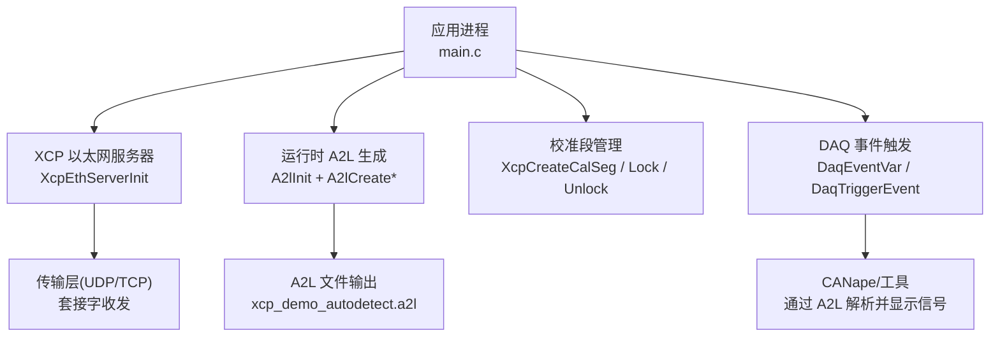
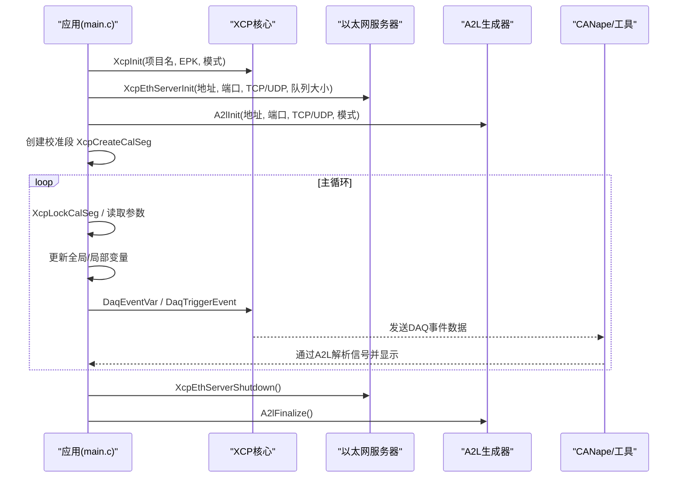
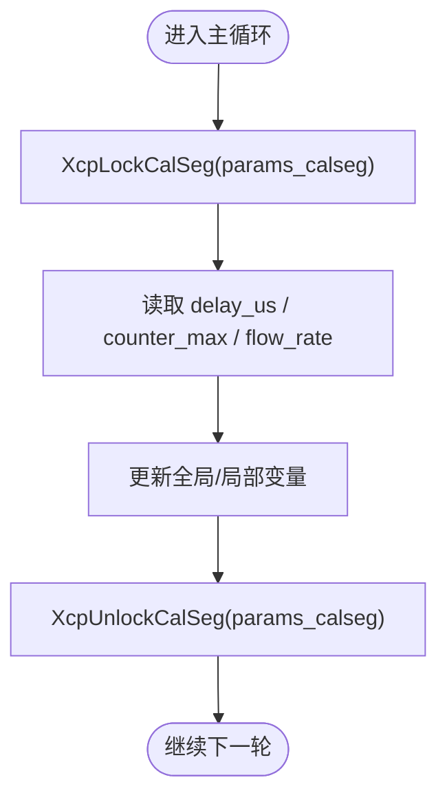
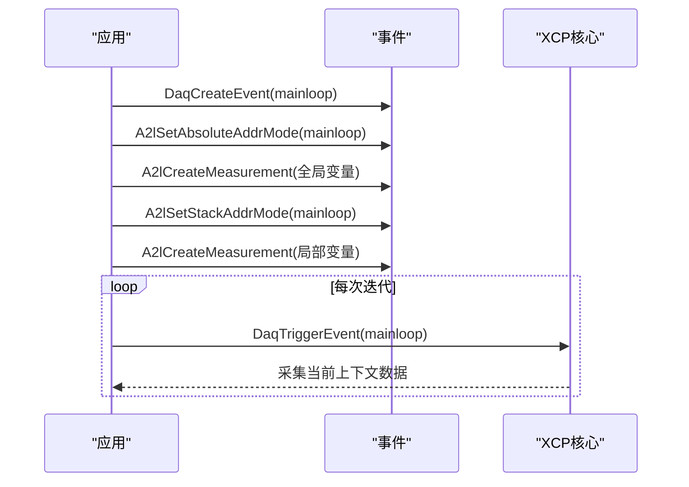
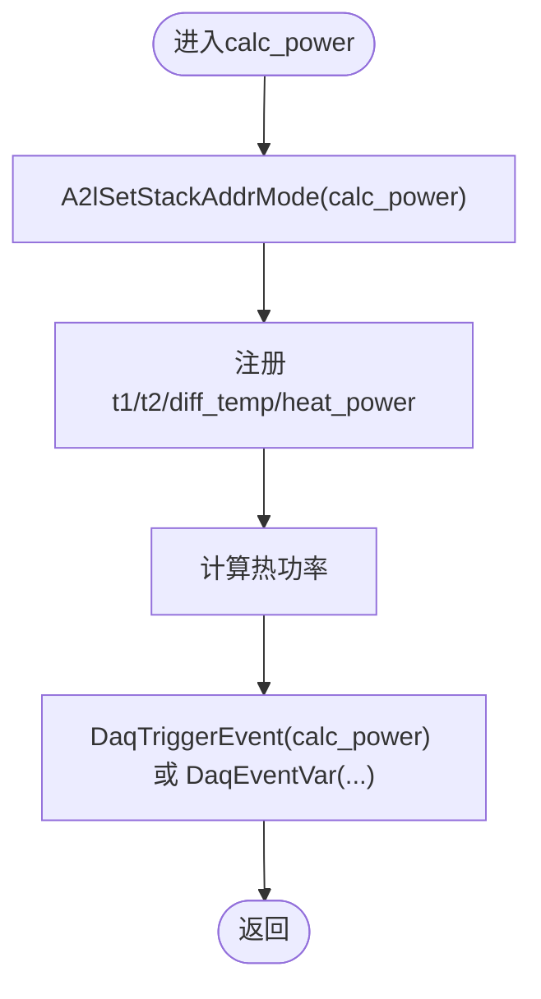
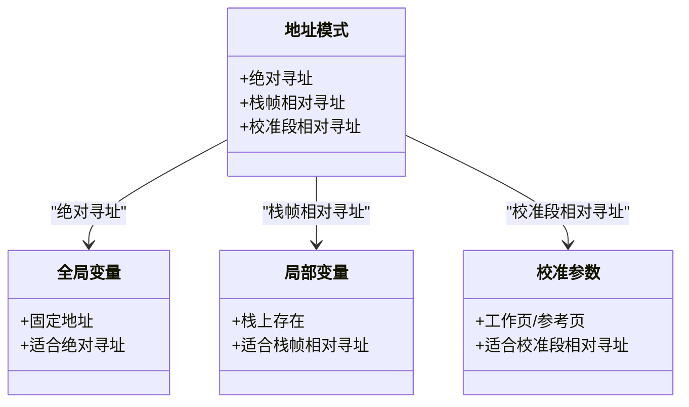
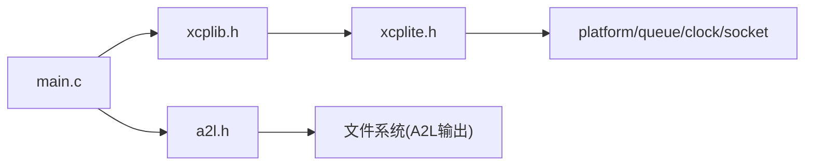

# Hello XCP C示例

<cite>
**本文引用的文件**
- [examples/hello_xcp/src/main.c](file://examples/hello_xcp/src/main.c)
- [examples/hello_xcp/README.md](file://examples/hello_xcp/README.md)
- [inc/xcplib.h](file://inc/xcplib.h)
- [src/xcplite.h](file://src/xcplite.h)
- [docs/xcplib.md](file://docs/xcplib.md)
- [docs/TECHNICAL.md](file://docs/TECHNICAL.md)
- [docs/XCP_INTRODUCTION.md](file://docs/XCP_INTRODUCTION.md)
- [examples/hello_xcp/CANape/xcp_demo_autodetect.a2l](file://examples/hello_xcp/CANape/xcp_demo_autodetect.a2l)
</cite>

## 目录
1. [简介](#简介)
2. [项目结构](#项目结构)
3. [核心组件](#核心组件)
4. [架构总览](#架构总览)
5. [详细组件分析](#详细组件分析)
6. [依赖关系分析](#依赖关系分析)
7. [性能与资源占用](#性能与资源占用)
8. [构建、CANape配置与调试](#构建canape配置与调试)
9. [故障排查](#故障排查)
10. [结论](#结论)
11. [附录：入门路径与最佳实践](#附录入门路径与最佳实践)

## 简介
本文件面向初学者，基于 hello_xcp C 示例，系统讲解最简单的 XCPlite 实现。内容覆盖：
- XCP 服务器初始化与启动
- 校准段创建与参数访问
- 全局变量与栈变量的测量（DAQ事件）
- 函数插桩（参数与局部变量测量）
- 变参宏 API 与手动宏 API 的差异与选择建议
- 三种地址模式的工作原理：绝对寻址、栈帧相对寻址、校准段相对寻址
- 完整构建步骤、CANape 项目配置方法与调试技巧
- 从零理解 XCP 协议与 XCPlite 库的学习路径

## 项目结构
hello_xcp 示例位于 examples/hello_xcp，包含：
- src/main.c：应用主程序，演示 XCP 初始化、A2L 生成、校准段、事件与测量
- CANape/：预配置的 CANape 工程与自动生成的 A2L 文件，便于快速连接与观测

图表来源
- [examples/hello_xcp/src/main.c:146-177](file://examples/hello_xcp/src/main.c#L146-L177)
- [examples/hello_xcp/CANape/xcp_demo_autodetect.a2l:1-169](file://examples/hello_xcp/CANape/xcp_demo_autodetect.a2l#L1-L169)

章节来源
- [examples/hello_xcp/README.md:1-72](file://examples/hello_xcp/README.md#L1-L72)
- [examples/hello_xcp/src/main.c:146-282](file://examples/hello_xcp/src/main.c#L146-L282)

## 核心组件
- XCP 服务器初始化与运行
  - XcpInit：初始化单例，设置项目名、EPK版本与模式
  - XcpEthServerInit：启动以太网服务器（UDP/TCP），配置队列大小
  - XcpSetLogLevel：设置日志级别
- A2L 运行时生成
  - A2lInit：启用运行时 A2L 生成，支持写一次/始终重写/连接时最终化/自动分组等模式
  - A2lCreateParameter/A2lCreateMeasurement/A2lCreatePhysMeasurement：注册参数与测量项
- 校准段
  - XcpCreateCalSeg：创建带工作页（RAM）和参考页（FLASH）的校准段
  - XcpLockCalSeg/XcpUnlockCalSeg：无等待、可递归的安全访问
- DAQ 事件与测量
  - DaqCreateEvent/DaqEventVar：创建事件并注册测量变量
  - DaqTriggerEvent：触发事件，采集当前上下文数据
- 地址模式
  - A2lSetAbsoluteAddrMode：绝对寻址（全局变量）
  - A2lSetStackAddrMode：栈帧相对寻址（局部变量）
  - A2lSetSegmentAddrMode：校准段相对寻址（参数偏移）

章节来源
- [inc/xcplib.h:39-124](file://inc/xcplib.h#L39-L124)
- [inc/xcplib.h:396-420](file://inc/xcplib.h#L396-L420)
- [inc/xcplib.h:547-643](file://inc/xcplib.h#L547-L643)
- [examples/hello_xcp/src/main.c:146-282](file://examples/hello_xcp/src/main.c#L146-L282)

## 架构总览
下图展示 hello_xcp 的核心交互流程：应用调用 XCP API 初始化服务器与 A2L 生成；在循环中锁定校准段读取参数，更新全局/局部变量，并通过事件触发采集；CANape 通过 A2L 描述解析并显示信号。

图表来源
- [examples/hello_xcp/src/main.c:146-282](file://examples/hello_xcp/src/main.c#L146-L282)
- [examples/hello_xcp/CANape/xcp_demo_autodetect.a2l:1-169](file://examples/hello_xcp/CANape/xcp_demo_autodetect.a2l#L1-L169)

## 详细组件分析

### XCP 服务器初始化与启动
- 关键步骤
  - 设置日志级别
  - 初始化 XCP 单例（项目名、EPK、模式）
  - 启动以太网服务器（绑定地址、端口、TCP/UDP、队列大小）
  - 启用运行时 A2L 生成（可选）
- 注意事项
  - 必须在启动服务器前完成 XcpInit
  - 队列大小应足够容纳至少 10ms 的预期流量

章节来源
- [examples/hello_xcp/src/main.c:153-173](file://examples/hello_xcp/src/main.c#L153-L173)
- [docs/xcplib.md:283-333](file://docs/xcplib.md#L283-L333)

### 校准段创建与参数访问
- 创建校准段
  - XcpCreateCalSeg("params", &params, sizeof(params))
  - 使用 A2lSetSegmentAddrMode 将后续参数注册为“校准段相对寻址”
  - 注册参数：counter_max、delay_us、flow_rate
- 安全访问
  - XcpLockCalSeg 返回活动页指针（工作页或参考页）
  - XcpUnlockCalSeg 释放锁
  - 支持递归锁定与并发安全（RCU原子机制）

图表来源
- [examples/hello_xcp/src/main.c:227-251](file://examples/hello_xcp/src/main.c#L227-L251)
- [inc/xcplib.h:70-124](file://inc/xcplib.h#L70-L124)

章节来源
- [examples/hello_xcp/src/main.c:175-196](file://examples/hello_xcp/src/main.c#L175-L196)
- [inc/xcplib.h:70-124](file://inc/xcplib.h#L70-L124)

### 全局变量与栈变量测量（DAQ事件）
- 全局变量测量
  - 使用 A2lSetAbsoluteAddrMode 后注册测量项
  - 适合固定地址的全局变量
- 栈变量测量
  - 使用 A2lSetStackAddrMode 后注册测量项
  - 针对函数局部变量，基于栈帧基址解析
- 事件触发
  - DaqEventVar 一次性创建/注册并触发
  - 或手动：DaqCreateEvent + A2lCreate* + DaqTriggerEvent

图表来源
- [examples/hello_xcp/src/main.c:201-221](file://examples/hello_xcp/src/main.c#L201-L221)
- [inc/xcplib.h:570-643](file://inc/xcplib.h#L570-L643)

章节来源
- [examples/hello_xcp/src/main.c:201-221](file://examples/hello_xcp/src/main.c#L201-L221)
- [inc/xcplib.h:570-643](file://inc/xcplib.h#L570-L643)

### 函数插桩（参数与局部变量测量）
- 在 calc_power 中：
  - 使用 A2lSetStackAddrMode 注册函数参数与局部变量
  - 在计算完成后触发事件 calc_power
  - 或使用变参宏 DaqEventVar 自动处理地址模式
- 注意：被插桩函数不应内联，否则栈帧相对寻址可能失效

图表来源
- [examples/hello_xcp/src/main.c:90-138](file://examples/hello_xcp/src/main.c#L90-L138)
- [inc/xcplib.h:570-643](file://inc/xcplib.h#L570-L643)

章节来源
- [examples/hello_xcp/src/main.c:90-138](file://examples/hello_xcp/src/main.c#L90-L138)

### 变参宏 API 与手动宏 API 的区别与选择
- 变参宏 API（默认启用 OPTION_USE_VARIADIC_MACROS）
  - 优点：一行完成事件创建、注册与触发；自动识别绝对/栈帧相对寻址；简洁易用
  - 适用：快速集成、减少样板代码
- 手动宏 API（关闭 OPTION_USE_VARIADIC_MACROS）
  - 优点：更细粒度控制；显式设置地址模式；适合复杂场景或需要精确控制的场合
  - 适用：高级用户、对性能/行为有严格要求的场景
- 选择建议
  - 初学者与大多数场景优先使用变参宏 API
  - 当需要明确控制地址模式或避免隐式行为时，使用手动宏 API

章节来源
- [examples/hello_xcp/README.md:19-24](file://examples/hello_xcp/README.md#L19-L24)
- [examples/hello_xcp/src/main.c:95-135](file://examples/hello_xcp/src/main.c#L95-L135)

### 三种地址模式工作原理
- 绝对寻址（Absolute）
  - 用于全局变量，直接以模块基址+偏移访问
  - 通过 A2lSetAbsoluteAddrMode 设置
- 栈帧相对寻址（Stack frame relative）
  - 用于函数局部变量，基于触发时的栈帧基址解析
  - 通过 A2lSetStackAddrMode 设置；底层使用 xcp_get_frame_addr()
- 校准段相对寻址（Calibration segment relative）
  - 用于校准参数，以校准段内的偏移访问
  - 通过 A2lSetSegmentAddrMode 设置；配合 XcpLockCalSeg 获取活动页指针

图表来源
- [inc/xcplib.h:547-643](file://inc/xcplib.h#L547-L643)
- [docs/TECHNICAL.md:269-313](file://docs/TECHNICAL.md#L269-L313)

章节来源
- [inc/xcplib.h:547-643](file://inc/xcplib.h#L547-L643)
- [docs/TECHNICAL.md:269-313](file://docs/TECHNICAL.md#L269-L313)

## 依赖关系分析
- 应用层依赖
  - xcplib.h：提供公共 API（XCP 服务器、校准段、事件、A2L 相关宏）
  - a2l.h：A2L 生成接口
- 内部依赖
  - xcplite.h：协议层内部接口与状态结构
  - 平台抽象：队列、原子操作、时间、套接字等
- 外部依赖
  - 操作系统：线程、内存分配、文件系统（A2L 写入）、时钟
  - 工具链：ELF/Mach-O 链接器节区（xcp_evts、xcp_cals、xcp_meta）

图表来源
- [examples/hello_xcp/src/main.c:10-12](file://examples/hello_xcp/src/main.c#L10-L12)
- [src/xcplite.h:17-36](file://src/xcplite.h#L17-L36)

章节来源
- [src/xcplite.h:17-36](file://src/xcplite.h#L17-L36)
- [docs/TECHNICAL.md:356-394](file://docs/TECHNICAL.md#L356-L394)

## 性能与资源占用
- 静态内存：约 10 KB（DAQ表、校准段页面）
- 堆内存：约 32 KB（传输层队列，可配置）
- 栈内存：每线程约 1 KB（接收/发送线程）
- 触发开销
  - 事件触发为无等待生产者实现
  - 部分宏首次按名称查找事件并缓存结果
- 注意事项
  - 队列大小需足够覆盖预期流量（建议至少 10ms）
  - 避免内联含栈相对测量的函数

章节来源
- [docs/TECHNICAL.md:5-24](file://docs/TECHNICAL.md#L5-L24)
- [docs/TECHNICAL.md:28-52](file://docs/TECHNICAL.md#L28-L52)

## 构建、CANape配置与调试

### 构建步骤
- 使用仓库脚本
  - ./build.sh examples
  - ./build/hello_xcp
- 使用 CMake
  - cmake -B build -S . -DXCPLITE_BUILD_EXAMPLES=ON -DCMAKE_BUILD_TYPE=Debug
  - cmake --build build --target hello_xcp
  - ./build/hello_xcp

章节来源
- [examples/hello_xcp/README.md:35-48](file://examples/hello_xcp/README.md#L35-L48)

### CANape 项目配置
- 打开 CANape/CANape.ini
- 预配置为 XCP over UDP，端口 5555，自动上传 A2L
- 若无法连接，检查设备配置中的 IP 地址与传输层设置

章节来源
- [examples/hello_xcp/README.md:52-58](file://examples/hello_xcp/README.md#L52-L58)

### 调试技巧
- 设置日志级别
  - XcpSetLogLevel(4) 可打印 XCP 命令，便于定位问题
- 观察 A2L 生成
  - 确认 xcp_demo_autodetect.a2l 已生成且包含事件与参数定义
- 验证事件与测量
  - 在 CANape 中查看 calc_power 与 mainloop 事件的数据流
- 常见问题
  - 端口冲突：更换端口或关闭占用进程
  - A2L 不更新：检查 A2L_MODE 与 EPK 版本匹配
  - 数据不一致：确保校准段锁定范围正确，避免跨线程竞争

章节来源
- [examples/hello_xcp/src/main.c:153-163](file://examples/hello_xcp/src/main.c#L153-L163)
- [examples/hello_xcp/CANape/xcp_demo_autodetect.a2l:69-87](file://examples/hello_xcp/CANape/xcp_demo_autodetect.a2l#L69-L87)

## 故障排查
- 服务器未启动
  - 检查 XcpInit 是否成功，模式是否正确
  - 确认端口未被占用
- A2L 未生成或不同步
  - 检查 A2lInit 模式（写一次/始终重写/连接时最终化）
  - 确认 EPK 版本与工具期望一致
- 测量数据为空或不稳定
  - 确认事件已创建并触发
  - 校验地址模式设置（绝对/栈帧/校准段）
  - 避免内联导致栈帧相对寻址失效
- 校准参数读写异常
  - 确保使用 XcpLockCalSeg/XcpUnlockCalSeg 包裹访问
  - 检查校准段创建与参数注册顺序

章节来源
- [examples/hello_xcp/src/main.c:153-177](file://examples/hello_xcp/src/main.c#L153-L177)
- [inc/xcplib.h:70-124](file://inc/xcplib.h#L70-L124)
- [docs/TECHNICAL.md:56-86](file://docs/TECHNICAL.md#L56-L86)

## 结论
hello_xcp 展示了 XCPlite 的最小可用实现：从服务器初始化、A2L 生成、校准段管理到事件测量与函数插桩。通过变参宏 API 可快速上手，手动宏 API 则提供更精细的控制。掌握三种地址模式是正确使用 XCPlite 的关键。结合 CANape 与 A2L，可实现高效的实时数据采集与参数标定。

## 附录：入门路径与最佳实践
- 学习路径
  - 阅读 XCP 简介，理解协议与 A2L 的作用
  - 运行 hello_xcp，观察 CANape 中的数据
  - 逐步尝试其他示例（c_demo、multi_thread_demo、cpp_demo）
- 最佳实践
  - 使用校准段管理参数，保证一致性
  - 合理设置日志级别与队列大小
  - 避免内联含栈相对测量的函数
  - 使用 A2lOnce 或线程本地存储避免重复注册
  - 离线 A2L 工作流下，遵循 ELF/DWARF 标记约定

章节来源
- [docs/XCP_INTRODUCTION.md:1-41](file://docs/XCP_INTRODUCTION.md#L1-L41)
- [docs/TECHNICAL.md:89-117](file://docs/TECHNICAL.md#L89-L117)