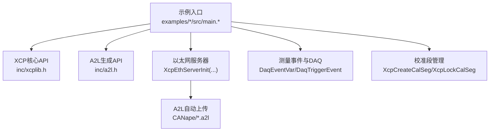
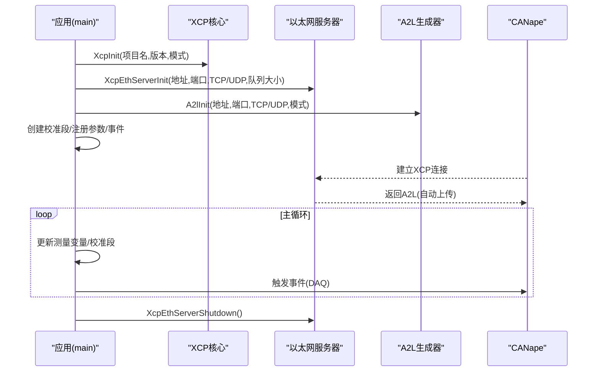
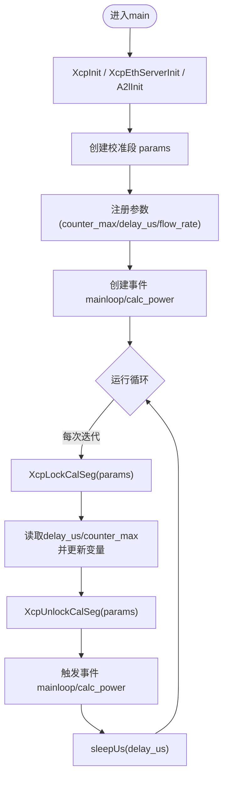
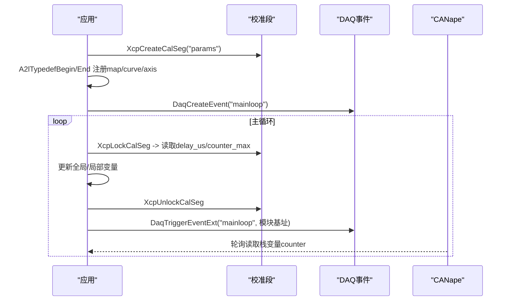
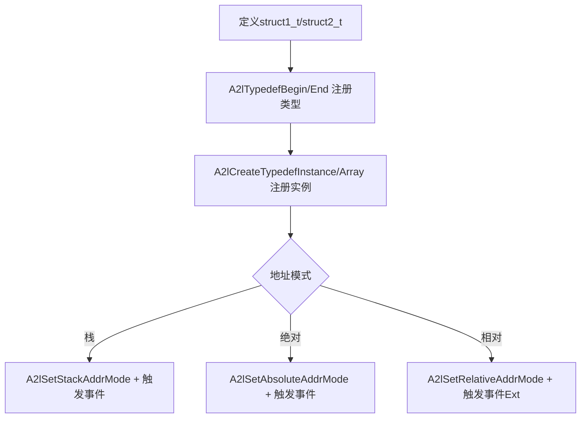
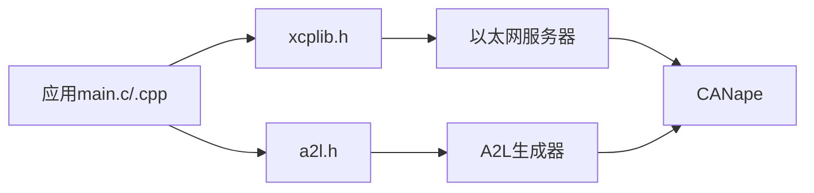

# 基础示例程序

<cite>
**本文引用的文件**
- [examples/hello_xcp/src/main.c](file://examples/hello_xcp/src/main.c)
- [examples/hello_xcp_cpp/src/main.cpp](file://examples/hello_xcp_cpp/src/main.cpp)
- [examples/c_demo/src/main.c](file://examples/c_demo/src/main.c)
- [examples/struct_demo/src/main.c](file://examples/struct_demo/src/main.c)
- [inc/xcplib.h](file://inc/xcplib.h)
- [inc/a2l.h](file://inc/a2l.h)
- [examples/hello_xcp/CANape/xcp_demo_autodetect.a2l](file://examples/hello_xcp/CANape/xcp_demo_autodetect.a2l)
- [examples/c_demo/CANape/xcp_demo_autodetect.a2l](file://examples/c_demo/CANape/xcp_demo_autodetect.a2l)
- [examples/hello_xcp/README.md](file://examples/hello_xcp/README.md)
- [examples/c_demo/README.md](file://examples/c_demo/README.md)
- [examples/struct_demo/README.md](file://examples/struct_demo/README.md)
- [docs/xcplib.md](file://docs/xcplib.md)
</cite>

## 目录
1. [简介](#简介)
2. [项目结构](#项目结构)
3. [核心组件](#核心组件)
4. [架构总览](#架构总览)
5. [详细组件分析](#详细组件分析)
6. [依赖关系分析](#依赖关系分析)
7. [性能考虑](#性能考虑)
8. [故障排查指南](#故障排查指南)
9. [结论](#结论)
10. [附录：CANape配置与A2L生成、调试技巧](#附录canape配置与a2l生成调试技巧)

## 简介
本章节面向初学者，系统讲解XCPlite中最基础的三个示例：hello_xcp（C）、hello_xcp_cpp（C++）以及c_demo（复杂数据类型处理），并补充struct_demo的自定义数据结构测量。你将学会：
- 如何初始化XCP库、启动以太网服务器
- 如何创建校准段（Calibration Segment）并安全访问
- 如何注册测量事件与变量（全局、栈、堆、指针）
- 如何处理复杂数据类型（结构体、数组、多维数组、曲线/地图）
- 如何通过运行时A2L生成机制，自动生成A2L描述文件并在CANape中自动加载
- 常见调试技巧与问题定位方法

## 项目结构
仓库中的示例位于 examples/ 目录下，每个示例包含：
- src/：应用源码（main.c / main.cpp）
- CANape/：预配置的CANape工程与自动生成的A2L文件
- README.md：构建与使用说明



图表来源
- [examples/hello_xcp/src/main.c:146-173](file://examples/hello_xcp/src/main.c#L146-L173)
- [examples/hello_xcp_cpp/src/main.cpp:183-210](file://examples/hello_xcp_cpp/src/main.cpp#L183-L210)
- [inc/xcplib.h:39-53](file://inc/xcplib.h#L39-L53)
- [inc/a2l.h:56-66](file://inc/a2l.h#L56-L66)

章节来源
- [examples/hello_xcp/README.md:1-72](file://examples/hello_xcp/README.md#L1-L72)
- [examples/c_demo/README.md:1-99](file://examples/c_demo/README.md#L1-L99)
- [examples/struct_demo/README.md:1-50](file://examples/struct_demo/README.md#L1-L50)

## 核心组件
- XCP初始化与服务器
  - XcpInit：初始化XCP单例并激活协议栈
  - XcpEthServerInit：启动以太网XCP服务器（TCP/UDP）
  - XcpSetLogLevel：设置日志级别
- 校准段（Calibration Segment）
  - XcpCreateCalSeg：创建带工作页/参考页的校准段
  - XcpLockCalSeg/XcpUnlockCalSeg：无锁、可重入地访问当前活动页
  - A2lSetSegmentAddrMode + A2lCreateParameter/A2lCreateTypedefInstance：在A2L中描述参数
- 测量事件与DAQ
  - DaqCreateEvent/DaqEventVar/DaqTriggerEvent：定义并触发事件
  - A2lSetAbsoluteAddrMode/A2lSetStackAddrMode/A2lSetRelativeAddrMode：选择地址模式（全局/栈/相对基址）
  - A2lCreateMeasurement/A2lCreatePhysMeasurement：注册测量变量及物理单位/范围
- A2L生成
  - A2lInit：启用运行时A2L生成
  - A2lFinalize：完成A2L写入（可在连接时或提前）
  - A2L_MODE_*：控制生成策略（仅写一次、连接时完成、自动分组等）

章节来源
- [inc/xcplib.h:39-53](file://inc/xcplib.h#L39-L53)
- [inc/xcplib.h:70-139](file://inc/xcplib.h#L70-L139)
- [inc/a2l.h:56-66](file://inc/a2l.h#L56-L66)
- [docs/xcplib.md:75-125](file://docs/xcplib.md#L75-L125)

## 架构总览
下图展示了从应用到XCP协议栈与工具链的整体数据流：应用通过API注册测量与校准段，运行期生成A2L；CANape连接后自动获取A2L并进行测量/标定。



图表来源
- [examples/hello_xcp/src/main.c:146-173](file://examples/hello_xcp/src/main.c#L146-L173)
- [examples/hello_xcp_cpp/src/main.cpp:183-210](file://examples/hello_xcp_cpp/src/main.cpp#L183-L210)
- [examples/hello_xcp/CANape/xcp_demo_autodetect.a2l:1-10](file://examples/hello_xcp/CANape/xcp_demo_autodetect.a2l#L1-L10)

## 详细组件分析

### hello_xcp（C）——最简XCP服务器与测量
- 初始化流程
  - 设置日志级别
  - 调用XcpInit激活XCP
  - 启动以太网服务器
  - 启用A2L生成
- 校准段
  - 使用XcpCreateCalSeg创建名为“params”的校准段
  - 通过A2lSetSegmentAddrMode将后续参数注册为“校准段相对”地址
  - 使用A2lCreateParameter逐个注册counter_max、delay_us、flow_rate
- 测量事件
  - 全局变量：绝对地址模式，注册温度、能量、计数器
  - 局部变量：栈帧相对模式，注册循环内计数器
  - 函数内测量：calc_power内部对局部变量和参数进行事件注册与触发
- 关键要点
  - 支持两种风格：可变宏一次性注册+触发，或手动分步注册+触发
  - 校准段访问采用无锁、可重入的锁定方式，保证线程安全与一致性



图表来源
- [examples/hello_xcp/src/main.c:146-173](file://examples/hello_xcp/src/main.c#L146-L173)
- [examples/hello_xcp/src/main.c:175-196](file://examples/hello_xcp/src/main.c#L175-L196)
- [examples/hello_xcp/src/main.c:223-273](file://examples/hello_xcp/src/main.c#L223-L273)

章节来源
- [examples/hello_xcp/src/main.c:146-282](file://examples/hello_xcp/src/main.c#L146-L282)
- [examples/hello_xcp/README.md:1-72](file://examples/hello_xcp/README.md#L1-L72)

### hello_xcp_cpp（C++）——RAII与类型化校准段
- 初始化流程与C版一致，但使用C++头文件与RAII封装
- 校准段
  - 使用xcp::CalSeg<ParametersT>包装结构体参数
  - 通过A2lCreateTypedef声明字段（含map/curve/axis等）
  - 以gCalSeg.emplace("params", &kParameters)创建实例
- 测量与事件
  - 类FloatingAverage内部通过A2L_MEAS_*注册成员变量与输入输出
  - 主循环中通过DaqEventVar注册全局/局部变量与对象实例
- 优势
  - RAII确保锁作用域最小化，减少XCP写阻塞
  - 类型推导简化A2L生成，降低出错概率

```mermaid
classDiagram
class ParametersT {
+uint32_t delay_us
+uint16_t counter_max
+uint8_t counter_state
+double min
+double max
+uint8_t map[4][8]
+uint16_t curve[16]
+uint16_t axis[16]
}
class FloatingAverage {
-size_t current_index_
-uint8_t sample_count_
-double sum_
-double samples_[64]
+calc(input) double
}
class CalSeg_T {
+lock() ParametersT*
+CreateA2lTypedefInstance(name, desc)
}
CalSeg_T --> ParametersT : "管理RAM/FLASH页"
FloatingAverage --> CalSeg_T : "可选 : 读取min/max"
```

图表来源
- [examples/hello_xcp_cpp/src/main.cpp:40-60](file://examples/hello_xcp_cpp/src/main.cpp#L40-L60)
- [examples/hello_xcp_cpp/src/main.cpp:101-152](file://examples/hello_xcp_cpp/src/main.cpp#L101-L152)
- [examples/hello_xcp_cpp/src/main.cpp:212-233](file://examples/hello_xcp_cpp/src/main.cpp#L212-L233)

章节来源
- [examples/hello_xcp_cpp/src/main.cpp:183-298](file://examples/hello_xcp_cpp/src/main.cpp#L183-L298)

### c_demo ——复杂数据类型与一致性更新
- 复杂校准对象
  - 结构体params_t包含字节、字、长整型、二维map、一维curve与共享axis
  - 使用A2lTypedefBegin/End与A2lTypedefMapComponent/A2lTypedefCurveComponentWithSharedAxis等宏注册
- 多地址模式
  - 绝对地址：全局变量测量
  - 栈帧相对：局部变量测量
  - 相对基址：无需校准段的直接内存访问（ApplXcpRegisterReadCallback/WriteCallback）
- 一致性更新
  - 通过间接标定模式，确保同一校准段内的多个参数原子更新
  - 演示了test_byte1与test_byte2的一致性断言
- 异步轮询
  - 对栈上变量counter支持CANape轮询读取，无需事件触发



图表来源
- [examples/c_demo/src/main.c:158-183](file://examples/c_demo/src/main.c#L158-L183)
- [examples/c_demo/src/main.c:286-325](file://examples/c_demo/src/main.c#L286-L325)
- [examples/c_demo/src/main.c:84-121](file://examples/c_demo/src/main.c#L84-L121)

章节来源
- [examples/c_demo/src/main.c:130-376](file://examples/c_demo/src/main.c#L130-L376)
- [examples/c_demo/README.md:1-99](file://examples/c_demo/README.md#L1-L99)

### struct_demo ——自定义结构与数组测量
- 纯测量示例（无校准段）
  - 定义嵌套结构体struct1_t/struct2_t，包含数组与结构体成员
  - 使用A2lTypedefBegin/End为结构体定义测量类型
  - 通过A2lCreateTypedefInstance/Array注册实例与数组
- 地址模式
  - 栈：局部变量与数组
  - 绝对：静态/全局变量
  - 相对：堆分配对象的指针（需配合事件与基址）
- 关键点
  - 结构体对齐与填充由编译器决定，示例中使用static_assert验证布局
  - 通过不同事件分别管理栈/堆变量的相对地址



图表来源
- [examples/struct_demo/src/main.c:32-57](file://examples/struct_demo/src/main.c#L32-L57)
- [examples/struct_demo/src/main.c:93-106](file://examples/struct_demo/src/main.c#L93-L106)
- [examples/struct_demo/src/main.c:135-153](file://examples/struct_demo/src/main.c#L135-L153)

章节来源
- [examples/struct_demo/src/main.c:68-183](file://examples/struct_demo/src/main.c#L68-L183)
- [examples/struct_demo/README.md:1-50](file://examples/struct_demo/README.md#L1-L50)

## 依赖关系分析
- 应用层依赖
  - xcplib.h：提供XCP核心API（初始化、服务器、校准段、状态查询）
  - a2l.h：提供A2L生成API（类型检测、地址模式、事件与参数注册）
- 运行时依赖
  - 以太网服务器：绑定地址与端口，维护测量队列
  - A2L生成器：根据代码中的注册信息生成A2L，支持连接时完成、仅写一次、自动分组等模式
- 工具链依赖
  - CANape：通过A2L自动上传，进行测量与标定



图表来源
- [inc/xcplib.h:39-53](file://inc/xcplib.h#L39-L53)
- [inc/a2l.h:56-66](file://inc/a2l.h#L56-L66)
- [examples/hello_xcp/CANape/xcp_demo_autodetect.a2l:1-10](file://examples/hello_xcp/CANape/xcp_demo_autodetect.a2l#L1-L10)

章节来源
- [inc/xcplib.h:39-53](file://inc/xcplib.h#L39-L53)
- [inc/a2l.h:56-66](file://inc/a2l.h#L56-L66)

## 性能考虑
- 校准段访问
  - 无锁、可重入的锁定机制，避免互斥锁开销，适合高频调用
  - 建议尽量缩小锁定作用域，减少XCP写操作阻塞时间
- 测量队列
  - 合理设置测量队列大小，覆盖至少10ms的预期流量，避免丢包
- 事件粒度
  - 将相关变量放入同一事件，减少多次触发开销
  - 对栈变量使用轮询时注意频率，避免过多总线负载
- 日志级别
  - 生产环境建议固定较低日志级别，减少CPU占用

[本节为通用指导，不直接分析具体文件]

## 故障排查指南
- 无法连接CANape
  - 检查设备配置中的IP地址与端口是否与服务器一致
  - 确认防火墙未拦截UDP/TCP端口
- A2L未自动上传
  - 确认A2lInit已调用且模式包含连接时完成
  - 查看控制台日志，确认A2L生成是否成功
- 测量值异常或不一致
  - 检查地址模式是否正确（绝对/栈/相对）
  - 对于校准段，确保使用XcpLockCalSeg/XcpUnlockCalSeg包裹访问
  - 对于间接标定，确保在同一事件中同步更新
- 栈变量轮询失败
  - 确保使用DaqTriggerEventExt并传入正确的模块基址
  - 检查CANape轮询周期是否合理

章节来源
- [examples/hello_xcp/README.md:52-58](file://examples/hello_xcp/README.md#L52-L58)
- [examples/c_demo/README.md:60-80](file://examples/c_demo/README.md#L60-L80)
- [examples/struct_demo/README.md:45-50](file://examples/struct_demo/README.md#L45-L50)

## 结论
通过hello_xcp与hello_xcp_cpp两个入门示例，你可以快速掌握XCP服务器的初始化、校准段的使用与测量事件的注册。c_demo进一步展示了复杂数据类型（结构体、数组、曲线/地图）的处理与一致性更新。struct_demo则专注于自定义结构的测量。结合运行时A2L生成与CANape的自动加载，开发者可以高效地完成数据采集与标定任务。

[本节为总结性内容，不直接分析具体文件]

## 附录：CANape配置与A2L生成、调试技巧
- CANape项目配置
  - 打开对应示例的CANape.ini，确认传输层为UDP或TCP，端口为5555
  - 若无法连接，检查设备配置中的IP地址与协议层设置
- A2L生成过程
  - 应用启动时调用A2lInit启用运行时A2L生成
  - 首次连接时根据代码中的注册信息生成A2L并自动上传至CANape
  - 可通过A2L_MODE_WRITE_ONCE避免重复覆盖，或通过A2L_MODE_FINALIZE_ON_CONNECT在连接时完成
- 调试技巧
  - 提高日志级别至4，观察XCP命令交互
  - 使用间接标定模式确保多参数原子更新
  - 对栈变量轮询时，关注轮询周期与队列容量，避免过载

章节来源
- [examples/hello_xcp/CANape/xcp_demo_autodetect.a2l:1-10](file://examples/hello_xcp/CANAPE/xcp_demo_autodetect.a2l#L1-L10)
- [examples/c_demo/CANape/xcp_demo_autodetect.a2l:1-10](file://examples/c_demo/CANape/xcp_demo_autodetect.a2l#L1-L10)
- [examples/hello_xcp/README.md:52-58](file://examples/hello_xcp/README.md#L52-L58)
- [examples/c_demo/README.md:60-80](file://examples/c_demo/README.md#L60-L80)