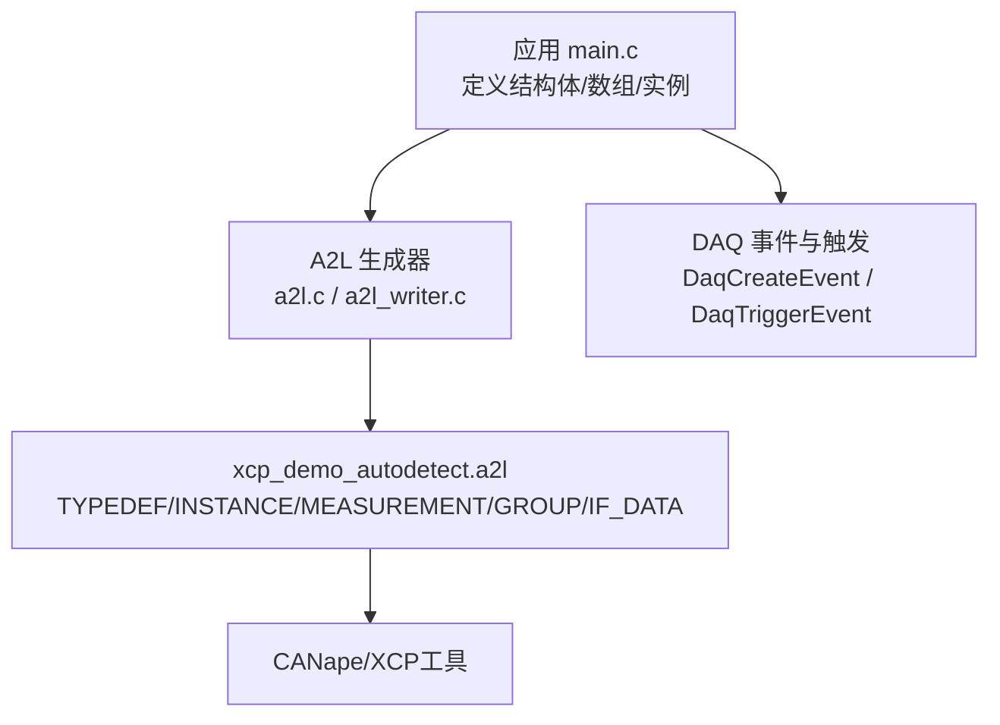
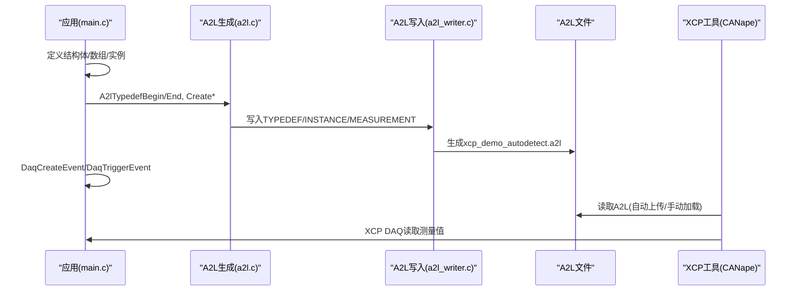
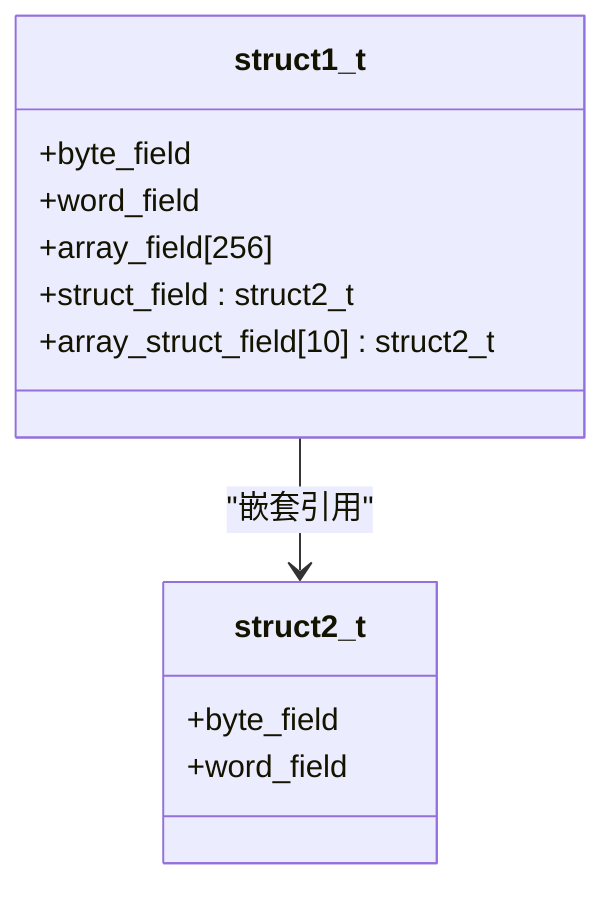
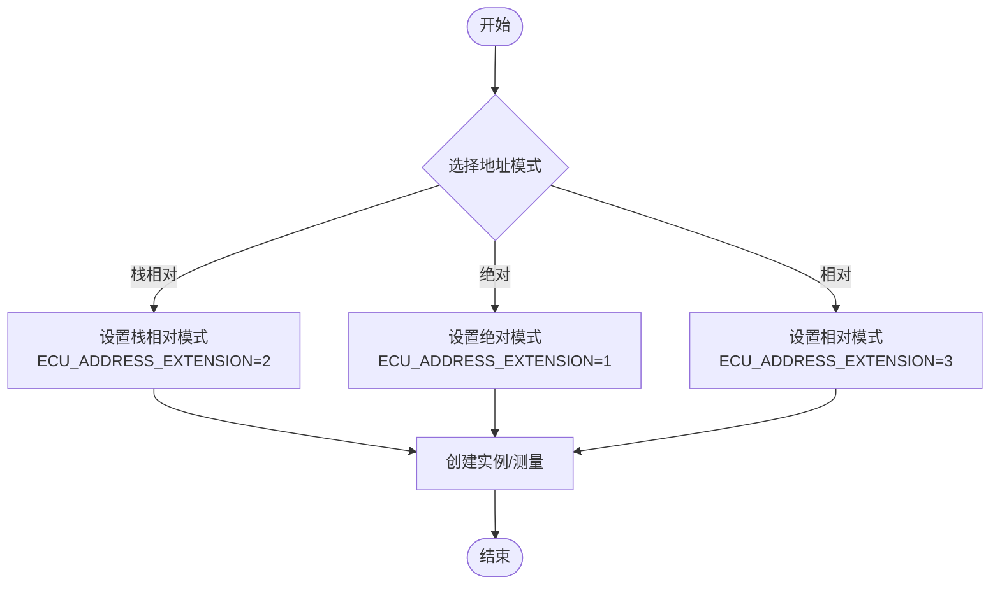
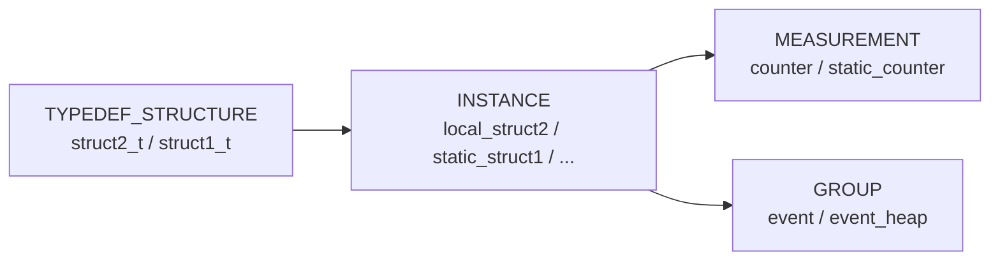
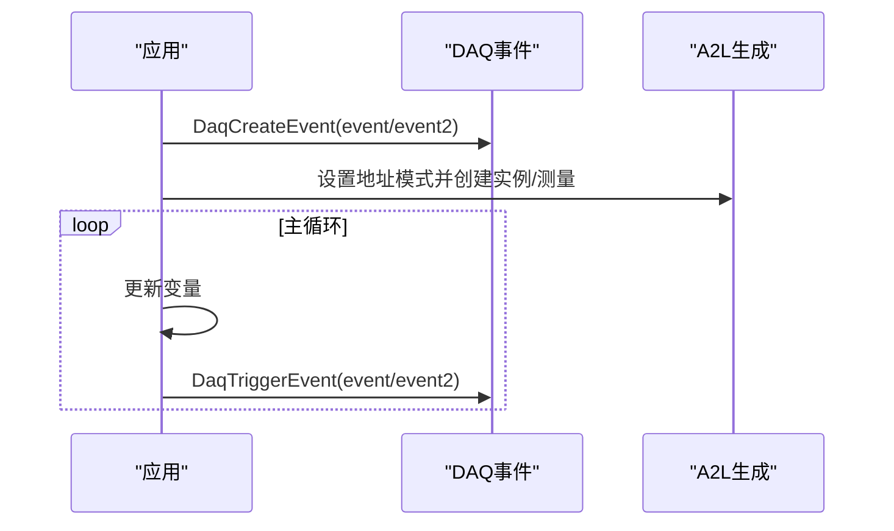
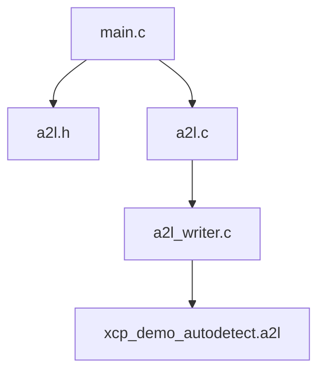

# 结构体测量示例

<cite>
**本文引用的文件**
- [examples/struct_demo/src/main.c](file://examples/struct_demo/src/main.c)
- [examples/struct_demo/CANape/xcp_demo_autodetect.a2l](file://examples/struct_demo/CANape/xcp_demo_autodetect.a2l)
- [examples/struct_demo/README.md](file://examples/struct_demo/README.md)
- [inc/a2l.h](file://inc/a2l.h)
- [src/a2l.c](file://src/a2l.c)
- [src/a2l_writer.c](file://src/a2l_writer.c)
- [docs/OFFLINE_A2L.md](file://docs/OFFLINE_A2L.md)
</cite>

## 目录
1. [简介](#简介)
2. [项目结构](#项目结构)
3. [核心组件](#核心组件)
4. [架构总览](#架构总览)
5. [详细组件分析](#详细组件分析)
6. [依赖关系分析](#依赖关系分析)
7. [性能与内存对齐](#性能与内存对齐)
8. [故障排查指南](#故障排查指南)
9. [结论](#结论)
10. [附录](#附录)

## 简介
本文件围绕 struct_demo 示例，系统讲解如何在 XCPlite 中为复杂业务对象（嵌套结构体、结构体数组、typedef 自定义类型）配置 XCP 测量，并在 A2L 文件中正确描述层次化数据结构。文档同时说明编译器内存对齐对数据传输的影响及处理方法，演示如何通过类型别名简化复杂结构的定义与管理，并给出字节序处理、内存访问优化与调试技巧，帮助在嵌入式应用中可靠地传输复杂业务对象。

## 项目结构
struct_demo 示例包含：
- 应用代码：定义嵌套结构体、数组、实例化测量变量、创建事件与触发采集
- 自动生成的 A2L：描述 TYPEDEF_STRUCTURE、INSTANCE、MEASUREMENT、GROUP、IF_DATA 等
- 配套文档：简要说明构建与 CANape 连接方式

图表来源
- [examples/struct_demo/src/main.c:93-153](file://examples/struct_demo/src/main.c#L93-L153)
- [src/a2l.c:36-80](file://src/a2l.c#L36-L80)
- [src/a2l_writer.c:42-57](file://src/a2l_writer.c#L42-L57)
- [examples/struct_demo/CANape/xcp_demo_autodetect.a2l:23-51](file://examples/struct_demo/CANape/xcp_demo_autodetect.a2l#L23-L51)

章节来源
- [examples/struct_demo/README.md:1-50](file://examples/struct_demo/README.md#L1-L50)

## 核心组件
- 结构体与 typedef 定义：通过 A2lTypedefBegin/A2lTypedefEnd 将 C 结构体注册为可复用的测量类型，支持嵌套结构与数组字段
- 测量实例：使用 A2lCreateTypedefInstance / A2lCreateTypedefInstanceArray / A2lCreateMeasurement 将具体实例暴露给 XCP
- 地址模式：栈相对、绝对、相对三种模式分别用于局部变量、全局变量与堆指针
- 事件与触发：通过 DaqCreateEvent 与 DaqTriggerEvent 组织批量采集
- A2L 输出：自动生成 TYPEDEF_STRUCTURE、INSTANCE、MEASUREMENT、GROUP、IF_DATA 等条目

章节来源
- [examples/struct_demo/src/main.c:32-106](file://examples/struct_demo/src/main.c#L32-L106)
- [examples/struct_demo/src/main.c:128-170](file://examples/struct_demo/src/main.c#L128-L170)
- [inc/a2l.h:19-46](file://inc/a2l.h#L19-L46)
- [examples/struct_demo/CANape/xcp_demo_autodetect.a2l:23-51](file://examples/struct_demo/CANape/xcp_demo_autodetect.a2l#L23-L51)

## 架构总览
下图展示了从应用层到 A2L 文件的整体数据流与控制流：

图表来源
- [examples/struct_demo/src/main.c:93-170](file://examples/struct_demo/src/main.c#L93-L170)
- [src/a2l.c:36-80](file://src/a2l.c#L36-L80)
- [src/a2l_writer.c:42-57](file://src/a2l_writer.c#L42-L57)
- [examples/struct_demo/CANape/xcp_demo_autodetect.a2l:23-51](file://examples/struct_demo/CANape/xcp_demo_autodetect.a2l#L23-L51)

## 详细组件分析

### 嵌套结构体与数组的测量配置
- 嵌套结构体：先为内层结构体（如 struct2_t）创建 TYPEDEF_STRUCTURE，再在外层结构体（如 struct1_t）中以 STRUCTURE_COMPONENT 引用该类型，实现层次化描述
- 数组字段：外层结构体中的数组字段以 MATRIX_DIM 标注维度，A2L 中对应矩阵型测量
- 结构体数组：通过 A2lCreateTypedefInstanceArray 将结构体数组作为一组实例暴露，A2L 中同样以 MATRIX_DIM 表示元素个数

图表来源
- [examples/struct_demo/src/main.c:32-47](file://examples/struct_demo/src/main.c#L32-L47)
- [examples/struct_demo/CANape/xcp_demo_autodetect.a2l:23-33](file://examples/struct_demo/CANape/xcp_demo_autodetect.a2l#L23-L33)

章节来源
- [examples/struct_demo/src/main.c:93-106](file://examples/struct_demo/src/main.c#L93-L106)
- [examples/struct_demo/CANape/xcp_demo_autodetect.a2l:23-33](file://examples/struct_demo/CANape/xcp_demo_autodetect.a2l#L23-L33)

### 地址模式与实例化
- 栈相对地址模式：用于函数局部变量，A2L 中 ECU_ADDRESS_EXTENSION=2，固定事件绑定
- 绝对地址模式：用于全局/静态变量，ECU_ADDRESS_EXTENSION=1
- 相对地址模式：用于堆指针，ECU_ADDRESS_EXTENSION=3，需配合独立事件与基址

图表来源
- [examples/struct_demo/src/main.c:135-151](file://examples/struct_demo/src/main.c#L135-L151)
- [examples/struct_demo/CANape/xcp_demo_autodetect.a2l:35-51](file://examples/struct_demo/CANape/xcp_demo_autodetect.a2l#L35-L51)

章节来源
- [examples/struct_demo/src/main.c:128-170](file://examples/struct_demo/src/main.c#L128-L170)
- [examples/struct_demo/CANape/xcp_demo_autodetect.a2l:35-51](file://examples/struct_demo/CANape/xcp_demo_autodetect.a2l#L35-L51)

### A2L 中的层次化数据类型描述
- TYPEDEF_STRUCTURE：定义可复用结构类型，包含各字段的名称、偏移与尺寸
- INSTANCE：将具体变量映射到 TYPEDEF_STRUCTURE，附带地址与事件信息
- MEASUREMENT：基本类型的测量项
- GROUP：将相关测量分组，便于工具侧管理

图表来源
- [examples/struct_demo/CANape/xcp_demo_autodetect.a2l:23-51](file://examples/struct_demo/CANape/xcp_demo_autodetect.a2l#L23-L51)
- [examples/struct_demo/CANape/xcp_demo_autodetect.a2l:101-104](file://examples/struct_demo/CANape/xcp_demo_autodetect.a2l#L101-L104)

章节来源
- [examples/struct_demo/CANape/xcp_demo_autodetect.a2l:23-51](file://examples/struct_demo/CANape/xcp_demo_autodetect.a2l#L23-L51)
- [examples/struct_demo/CANape/xcp_demo_autodetect.a2l:101-104](file://examples/struct_demo/CANape/xcp_demo_autodetect.a2l#L101-L104)

### 事件与触发流程
- 创建事件：DaqCreateEvent(event), DaqCreateEvent(event2)
- 设置地址模式后创建测量/实例
- 循环中更新变量并触发事件，使工具同步采集

图表来源
- [examples/struct_demo/src/main.c:128-170](file://examples/struct_demo/src/main.c#L128-L170)

章节来源
- [examples/struct_demo/src/main.c:128-170](file://examples/struct_demo/src/main.c#L128-L170)

## 依赖关系分析
- 应用代码依赖 A2L API（inc/a2l.h）进行类型与实例注册
- A2L 生成器（src/a2l.c）维护当前地址模式、事件、统计等信息
- A2L 写入器（src/a2l_writer.c）负责输出标准 A2L 文本，包括 MOD_COMMON、IF_DATA、EVENTS、GROUPS 等
- 最终 A2L 文件被 XCP 工具解析，建立测量通道

图表来源
- [examples/struct_demo/src/main.c:15-17](file://examples/struct_demo/src/main.c#L15-L17)
- [src/a2l.c:36-80](file://src/a2l.c#L36-L80)
- [src/a2l_writer.c:42-57](file://src/a2l_writer.c#L42-L57)

章节来源
- [examples/struct_demo/src/main.c:15-17](file://examples/struct_demo/src/main.c#L15-L17)
- [src/a2l.c:36-80](file://src/a2l.c#L36-L80)
- [src/a2l_writer.c:42-57](file://src/a2l_writer.c#L42-L57)

## 性能与内存对齐
- 字节序：A2L 头部明确声明 BYTE_ORDER MSB_LAST，确保跨平台一致的数据解释
- 对齐：MOD_COMMON 中各项 ALIGNMENT_* 设置为 1，避免额外填充导致的偏移差异；C 结构体中的编译器填充会在 A2L 中体现为字段偏移，需保证实例布局与 A2L 一致
- 内存访问优化：
  - 尽量使用连续内存块（数组、结构体数组）减少随机访问
  - 合理组织结构体字段顺序以减少填充
  - 使用 volatile 或捕获机制避免寄存器驻留导致不可测
- 调试技巧：
  - 使用 static_assert 校验结构体大小与预期一致
  - 通过 A2L 中的偏移验证字段布局是否符合预期
  - 利用事件分组与固定事件提高采集一致性

章节来源
- [examples/struct_demo/CANape/xcp_demo_autodetect.a2l:10-19](file://examples/struct_demo/CANape/xcp_demo_autodetect.a2l#L10-L19)
- [examples/struct_demo/src/main.c:32-60](file://examples/struct_demo/src/main.c#L32-L60)
- [docs/OFFLINE_A2L.md:85-163](file://docs/OFFLINE_A2L.md#L85-L163)

## 故障排查指南
- 变量未出现在 A2L：检查是否处于无事件的函数作用域，或变量被优化到寄存器而未标记 volatile
- 地址错误：确认地址模式设置与实例位置匹配（栈/绝对/相对），以及 ECU_ADDRESS_EXTENSION 是否正确
- 结构体偏移异常：核对编译器填充与 A2L 中 STRUCTURE_COMPONENT 的偏移是否一致
- 事件冲突：同一事件在不同函数中使用捕获时，仅第一个捕获生效，需区分事件或使用不同事件
- 工具连接问题：确认 A2L 中 IF_DATA 的协议与端口配置与应用一致

章节来源
- [docs/OFFLINE_A2L.md:85-163](file://docs/OFFLINE_A2L.md#L85-L163)
- [examples/struct_demo/CANape/xcp_demo_autodetect.a2l:119-167](file://examples/struct_demo/CANape/xcp_demo_autodetect.a2l#L119-L167)

## 结论
struct_demo 展示了在 XCPlite 中为复杂业务对象配置 XCP 测量的完整流程：通过 typedef 定义可复用类型，结合嵌套结构与数组，灵活使用三种地址模式将实例暴露给 XCP；A2L 自动生成层次化类型描述与测量项，配合事件分组与固定事件提升采集效率与一致性。遵循内存对齐与字节序约定，辅以合理的内存布局与调试手段，可在嵌入式应用中稳定传输复杂对象。

## 附录
- 构建与运行：参考示例 README，使用提供的脚本或 CMake 构建目标
- CANape 配置：打开 CANape.ini，确保 XCP over TCP 端口与 IP 配置正确，启用自动 A2L 上传

章节来源
- [examples/struct_demo/README.md:28-50](file://examples/struct_demo/README.md#L28-L50)