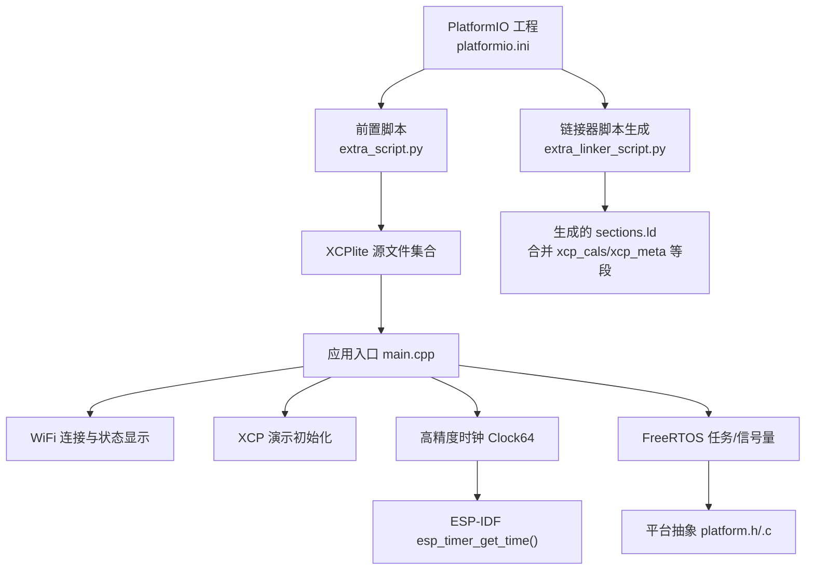
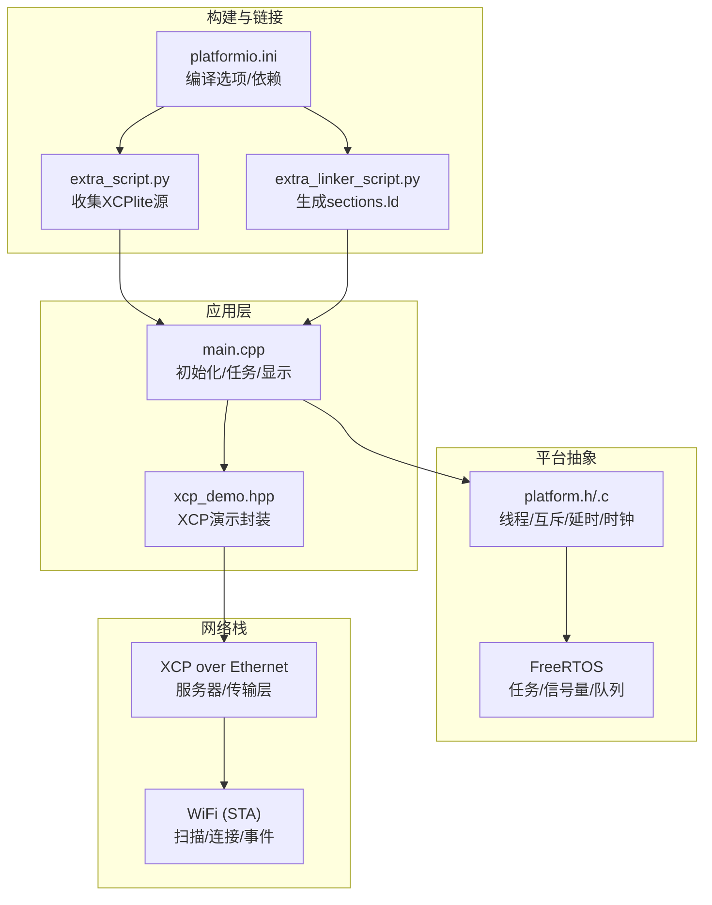
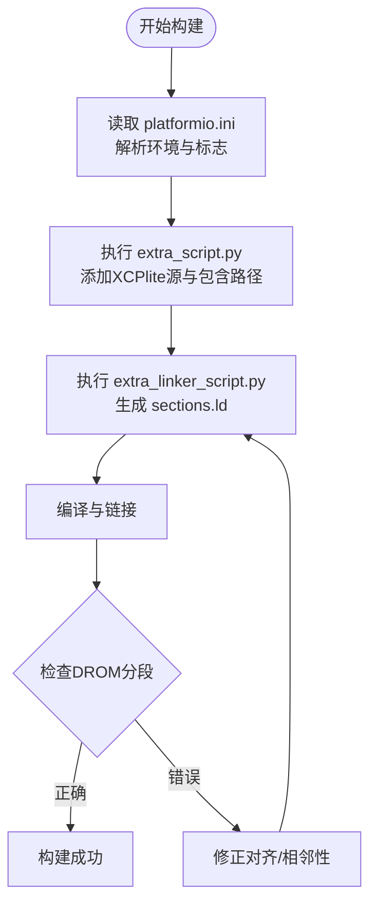
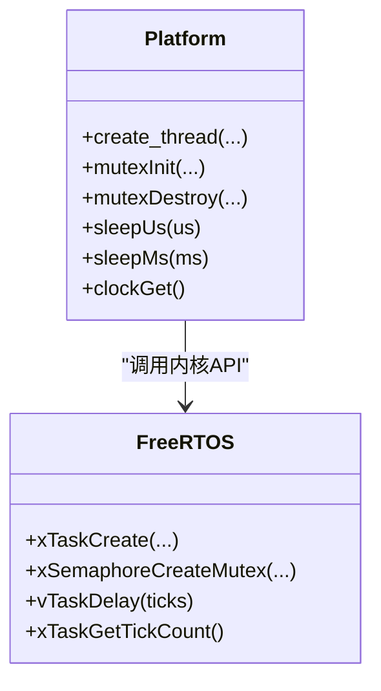
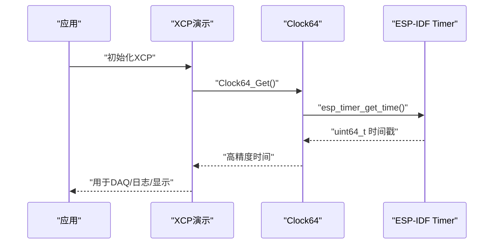
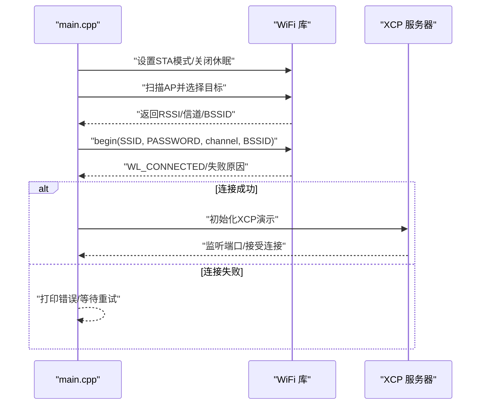
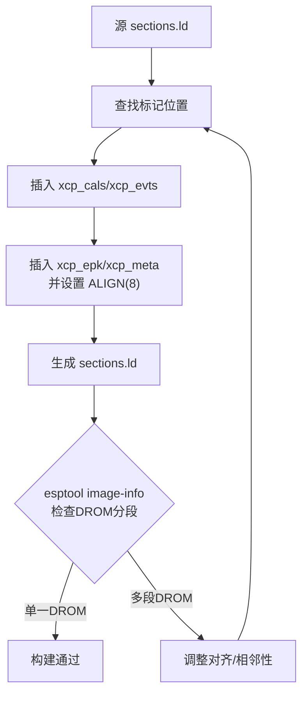
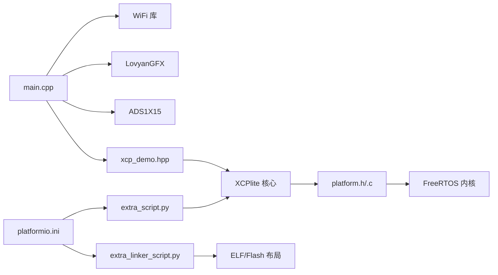

# ESP32平台集成

<cite>
**本文引用的文件**
- [platformio.ini](file://examples/freertos_demo/freertos_esp32_demo/platformio.ini)
- [extra_script.py](file://examples/freertos_demo/freertos_esp32_demo/extra_script.py)
- [extra_linker_script.py](file://examples/freertos_demo/freertos_esp32_demo/extra_linker_script.py)
- [main.cpp](file://examples/freertos_demo/freertos_esp32_demo/src/main.cpp)
- [clock64.h](file://examples/freertos_demo/freertos_esp32_demo/include/clock64.h)
- [clock64.c](file://examples/freertos_demo/freertos_esp32_demo/src/clock64.c)
- [xcp_demo.hpp](file://examples/freertos_demo/freertos_esp32_demo/include/xcp_demo.hpp)
- [platform.h](file://src/platform.h)
- [platform.c](file://src/platform.c)
</cite>

## 目录
1. [简介](#简介)
2. [项目结构](#项目结构)
3. [核心组件](#核心组件)
4. [架构总览](#架构总览)
5. [详细组件分析](#详细组件分析)
6. [依赖关系分析](#依赖关系分析)
7. [性能考虑](#性能考虑)
8. [故障排查指南](#故障排查指南)
9. [结论](#结论)
10. [附录](#附录)

## 简介
本文件面向在ESP32微控制器上集成XCPlite的工程师，提供从开发环境搭建、PlatformIO工程配置、FreeRTOS任务管理到网络通信（WiFi）、高精度时钟源与时间同步、内存分区与Flash布局、以及调试与功耗优化的完整实践指南。文档基于仓库中的ESP32 FreeRTOS示例工程与XCPlite平台抽象层进行说明，确保内容可直接映射到实际代码与构建脚本。

## 项目结构
ESP32集成以“freertos_esp32_demo”示例为核心，结合XCPlite源码与平台抽象层完成：
- PlatformIO工程配置：定义目标板、框架、编译宏、库依赖与前后置脚本。
- 应用入口：Arduino风格的setup/loop，初始化显示、IO、模拟输入、WiFi连接并启动XCP演示。
- 高精度时钟：通过ESP-IDF的高分辨率定时器暴露Clock64接口。
- XCPlite集成：通过额外脚本将必要的XCPlite源文件纳入构建，并通过链接器脚本调整Flash只读数据段布局。
- 平台抽象：FreeRTOS路径下的线程、互斥量、延时、时钟等实现。

**图示来源**
- [platformio.ini:11-43](file://examples/freertos_demo/freertos_esp32_demo/platformio.ini#L11-L43)
- [extra_script.py:1-29](file://examples/freertos_demo/freertos_esp32_demo/extra_script.py#L1-L29)
- [extra_linker_script.py:1-73](file://examples/freertos_demo/freertos_esp32_demo/extra_linker_script.py#L1-L73)
- [main.cpp:378-415](file://examples/freertos_demo/freertos_esp32_demo/src/main.cpp#L378-L415)
- [clock64.c:1-22](file://examples/freertos_demo/freertos_esp32_demo/src/clock64.c#L1-L22)
- [platform.h:381-418](file://src/platform.h#L381-L418)

**章节来源**
- [platformio.ini:11-43](file://examples/freertos_demo/freertos_esp32_demo/platformio.ini#L11-L43)
- [extra_script.py:1-29](file://examples/freertos_demo/freertos_esp32_demo/extra_script.py#L1-L29)
- [extra_linker_script.py:1-73](file://examples/freertos_demo/freertos_esp32_demo/extra_linker_script.py#L1-L73)
- [main.cpp:378-415](file://examples/freertos_demo/freertos_esp32_demo/src/main.cpp#L378-L415)
- [clock64.c:1-22](file://examples/freertos_demo/freertos_esp32_demo/src/clock64.c#L1-L22)
- [platform.h:381-418](file://src/platform.h#L381-L418)

## 核心组件
- 平台抽象层（FreeRTOS）：提供线程创建、互斥锁、延时、时钟等API，屏蔽不同平台差异。
- 高精度时钟：ESP32使用ESP-IDF高分辨率定时器作为64位时钟源，供XCP DAQ与时间戳使用。
- WiFi网络栈：Arduino WiFi库用于STA模式连接，扫描AP并建立TCP/UDP服务承载XCP over Ethernet。
- 构建与链接：PlatformIO脚本收集XCPlite源文件；链接器脚本生成sections.ld，确保xcp_cals、xcp_meta等段与.rodata相邻且对齐，避免DROM分段导致启动失败。
- 应用入口：初始化外设、WiFi、XCP演示，并在循环中维护任务与状态显示。

**章节来源**
- [platform.h:381-418](file://src/platform.h#L381-L418)
- [platform.c:78-90](file://src/platform.c#L78-L90)
- [platform.c:458-497](file://src/platform.c#L458-L497)
- [clock64.c:1-22](file://examples/freertos_demo/freertos_esp32_demo/src/clock64.c#L1-L22)
- [main.cpp:168-304](file://examples/freertos_demo/freertos_esp32_demo/src/main.cpp#L168-L304)
- [extra_script.py:13-28](file://examples/freertos_demo/freertos_esp32_demo/extra_script.py#L13-L28)
- [extra_linker_script.py:8-73](file://examples/freertos_demo/freertos_esp32_demo/extra_linker_script.py#L8-L73)

## 架构总览
下图展示了ESP32集成中各模块的交互关系：应用层通过平台抽象调用FreeRTOS内核能力；WiFi负责网络接入；XCPlite通过以太网传输层提供服务；链接器脚本保证关键数据段在Flash中的连续映射。

**图示来源**
- [main.cpp:378-415](file://examples/freertos_demo/freertos_esp32_demo/src/main.cpp#L378-L415)
- [platform.h:381-418](file://src/platform.h#L381-L418)
- [platform.c:78-90](file://src/platform.c#L78-L90)
- [platformio.ini:11-43](file://examples/freertos_demo/freertos_esp32_demo/platformio.ini#L11-L43)
- [extra_script.py:13-28](file://examples/freertos_demo/freertos_esp32_demo/extra_script.py#L13-L28)
- [extra_linker_script.py:8-73](file://examples/freertos_demo/freertos_esp32_demo/extra_linker_script.py#L8-L73)

## 详细组件分析

### PlatformIO工程配置与构建流程
- 目标与框架：指定espressif32平台与lilygo-t-display-s3板型，使用Arduino框架。
- 编译宏：启用_FREE_RTOS、选择RTOS配置头、可选显示/IO/模拟输入功能开关。
- 库依赖：LovyanGFX用于显示，ADS1X15用于模拟输入。
- 前后置脚本：
  - extra_script.py：将XCPlite必要源文件加入构建，并设置包含路径。
  - extra_linker_script.py：复制并修改ESP-IDF的sections.ld，插入xcp_cals、xcp_evts、xcp_epk、xcp_meta等段，确保与.flash.rodata相邻并对齐，避免DROM分段导致启动崩溃。

**图示来源**
- [platformio.ini:11-43](file://examples/freertos_demo/freertos_esp32_demo/platformio.ini#L11-L43)
- [extra_script.py:1-29](file://examples/freertos_demo/freertos_esp32_demo/extra_script.py#L1-L29)
- [extra_linker_script.py:8-73](file://examples/freertos_demo/freertos_esp32_demo/extra_linker_script.py#L8-L73)

**章节来源**
- [platformio.ini:11-43](file://examples/freertos_demo/freertos_esp32_demo/platformio.ini#L11-L43)
- [extra_script.py:1-29](file://examples/freertos_demo/freertos_esp32_demo/extra_script.py#L1-L29)
- [extra_linker_script.py:8-73](file://examples/freertos_demo/freertos_esp32_demo/extra_linker_script.py#L8-L73)

### FreeRTOS任务管理与平台抽象
- 线程创建：在ESP32下使用xTaskCreate或xTaskCreateStatic，支持静态分配与动态分配两种模式。
- 互斥量：支持递归与非递归互斥量，适配configUSE_RECURSIVE_MUTEXES与configSUPPORT_STATIC_ALLOCATION。
- 延时：sleepUs/sleepMs基于vTaskDelay，粒度为系统tick（通常1ms）。
- 线程本地存储与函数签名适配：统一FreeRTOS/POSIX/Windows的线程函数返回类型与退出方式。

**图示来源**
- [platform.h:381-418](file://src/platform.h#L381-L418)
- [platform.c:78-90](file://src/platform.c#L78-L90)
- [platform.c:370-404](file://src/platform.c#L370-L404)
- [platform.c:458-497](file://src/platform.c#L458-L497)

**章节来源**
- [platform.h:381-418](file://src/platform.h#L381-L418)
- [platform.c:78-90](file://src/platform.c#L78-L90)
- [platform.c:370-404](file://src/platform.c#L370-L404)
- [platform.c:458-497](file://src/platform.c#L458-L497)

### 高精度时钟源与时基
- ESP32使用ESP-IDF的高分辨率定时器（esp_timer_get_time），提供微秒级精度与64位计数。
- 应用通过Clock64接口获取当前时间，用于XCP DAQ与时间戳。
- 平台抽象层在FreeRTOS路径下提供基于Tick的时钟接口，可注册更高精度回调以满足CLOCK_TICKS_PER_S需求。

**图示来源**
- [clock64.h:1-11](file://examples/freertos_demo/freertos_esp32_demo/include/clock64.h#L1-L11)
- [clock64.c:1-22](file://examples/freertos_demo/freertos_esp32_demo/src/clock64.c#L1-L22)
- [platform.c:458-497](file://src/platform.c#L458-L497)

**章节来源**
- [clock64.h:1-11](file://examples/freertos_demo/freertos_esp32_demo/include/clock64.h#L1-L11)
- [clock64.c:1-22](file://examples/freertos_demo/freertos_esp32_demo/src/clock64.c#L1-L22)
- [platform.c:458-497](file://src/platform.c#L458-L497)

### WiFi模式下的网络通信
- 工作模式：STA模式，禁用Wi-Fi休眠以降低延迟。
- 连接流程：扫描网络，选择最强信号AP，按信道与BSSID连接；超时处理与断线事件回调。
- 状态显示：串口输出与屏幕显示连接状态、IP地址、XCP连接与DAQ运行状态。

**图示来源**
- [main.cpp:168-304](file://examples/freertos_demo/freertos_esp32_demo/src/main.cpp#L168-L304)
- [main.cpp:378-415](file://examples/freertos_demo/freertos_esp32_demo/src/main.cpp#L378-L415)

**章节来源**
- [main.cpp:168-304](file://examples/freertos_demo/freertos_esp32_demo/src/main.cpp#L168-L304)
- [main.cpp:378-415](file://examples/freertos_demo/freertos_esp32_demo/src/main.cpp#L378-L415)

### 内存分区表与Flash存储优化
- 链接器脚本生成：extra_linker_script.py复制ESP-IDF的sections.ld，插入xcp_cals、xcp_evts、xcp_epk、xcp_meta等段，并确保与.flash.rodata相邻且对齐。
- 对齐要求：每个输出段末尾使用ALIGN(8)，避免esptool将ELF段拆分为多个DROM段，导致Bootloader仅映射最后一段而引发启动崩溃。
- 验证方法：使用esptool image-info查看DROM分段情况，确认只有一个连续的rodata段。

**图示来源**
- [extra_linker_script.py:8-73](file://examples/freertos_demo/freertos_esp32_demo/extra_linker_script.py#L8-L73)

**章节来源**
- [extra_linker_script.py:8-73](file://examples/freertos_demo/freertos_esp32_demo/extra_linker_script.py#L8-L73)

### 堆内存管理与策略
- 任务栈：在FreeRTOS路径下，任务栈大小可通过OPTION_FREERTOS_STACK_BYTES配置，ESP32平台直接使用字节数而非StackType_t单位。
- 互斥量：支持静态分配（StaticSemaphore_t）与动态分配，根据configSUPPORT_STATIC_ALLOCATION选择。
- 建议：在高负载场景下评估任务栈深度，必要时增大OPTION_FREERTOS_STACK_BYTES；对频繁创建的互斥量优先使用静态分配以减少碎片。

**章节来源**
- [platform.h:381-418](file://src/platform.h#L381-L418)
- [platform.c:370-404](file://src/platform.c#L370-L404)

## 依赖关系分析
- 应用依赖：main.cpp依赖WiFi库、显示库、ADS1115驱动与XCPlite演示封装。
- 构建依赖：platformio.ini声明框架、板型、编译宏与库依赖；extra_script.py收集XCPlite源；extra_linker_script.py生成sections.ld。
- 平台依赖：platform.h/.c在FreeRTOS路径下依赖FreeRTOS内核API与ESP-IDF定时器。

**图示来源**
- [platformio.ini:11-43](file://examples/freertos_demo/freertos_esp32_demo/platformio.ini#L11-L43)
- [extra_script.py:13-28](file://examples/freertos_demo/freertos_esp32_demo/extra_script.py#L13-L28)
- [extra_linker_script.py:8-73](file://examples/freertos_demo/freertos_esp32_demo/extra_linker_script.py#L8-L73)
- [platform.h:381-418](file://src/platform.h#L381-L418)

**章节来源**
- [platformio.ini:11-43](file://examples/freertos_demo/freertos_esp32_demo/platformio.ini#L11-L43)
- [extra_script.py:13-28](file://examples/freertos_demo/freertos_esp32_demo/extra_script.py#L13-L28)
- [extra_linker_script.py:8-73](file://examples/freertos_demo/freertos_esp32_demo/extra_linker_script.py#L8-L73)
- [platform.h:381-418](file://src/platform.h#L381-L418)

## 性能考虑
- 时钟精度：使用ESP-IDF高分辨率定时器可获得微秒级精度，适合XCP DAQ与高精度时间戳。
- 任务调度：合理设置任务优先级与栈大小，避免高优先级任务长时间占用CPU。
- 网络栈：关闭WiFi休眠可降低连接延迟；在低负载时可根据功耗需求恢复休眠。
- 链接器优化：确保xcp_cals/xcp_meta与.rodata相邻且对齐，减少DROM分段带来的启动风险与访问开销。

[本节为通用性能指导，不直接分析具体文件]

## 故障排查指南
- 启动崩溃（DROM分段）：若出现“Image contains multiple DROM segments. Only the last one will be mapped.”，检查extra_linker_script.py是否生成了正确的sections.ld，确认xcp_epk与xcp_meta段对齐且相邻。
- WiFi连接失败：检查SSID/PASSWORD是否正确，确认2.4GHz频段与信号强度；查看断线原因与状态码。
- 显示/IO异常：确认OPTION_DISPLAY/OPTION_IO宏启用，引脚配置与电源控制正确。
- 模拟输入未检测到：检查I2C地址与SDA/SCL引脚，确认ADS1115供电与连线。

**章节来源**
- [extra_linker_script.py:8-73](file://examples/freertos_demo/freertos_esp32_demo/extra_linker_script.py#L8-L73)
- [main.cpp:168-304](file://examples/freertos_demo/freertos_esp32_demo/src/main.cpp#L168-L304)
- [main.cpp:310-372](file://examples/freertos_demo/freertos_esp32_demo/src/main.cpp#L310-L372)

## 结论
通过在ESP32上使用PlatformIO与Arduino框架，结合XCPlite的平台抽象层与示例工程，可实现稳定的XCP over Ethernet服务。借助ESP-IDF高分辨率定时器与FreeRTOS任务管理，满足高精度时间与实时性需求。链接器脚本的精细控制确保了Flash只读数据段的连续映射，避免启动问题。按照本文提供的配置与实践，可在ESP32平台上快速搭建可靠的XCPlite集成方案。

[本节为总结性内容，不直接分析具体文件]

## 附录
- 开发环境搭建：安装PlatformIO，选择espressif32平台与对应板型；配置编译宏与库依赖。
- 烧录工具配置：使用PlatformIO内置esptool，设置upload_speed与monitor_speed。
- 串口调试：通过monitor_port与monitor_speed查看串口输出，包括WiFi状态、XCP连接与DAQ信息。
- 性能分析与功耗优化：
  - 使用esptool image-info检查DROM分段。
  - 调整任务优先级与栈大小，评估CPU占用。
  - 根据场景开启/关闭WiFi休眠，平衡功耗与延迟。

[本节为补充信息，不直接分析具体文件]