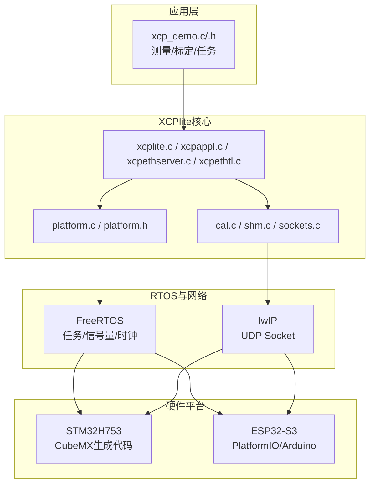
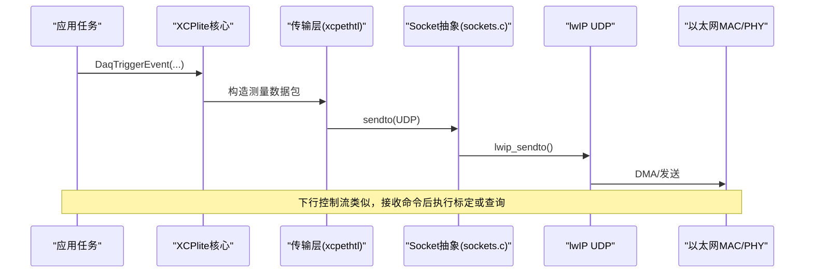
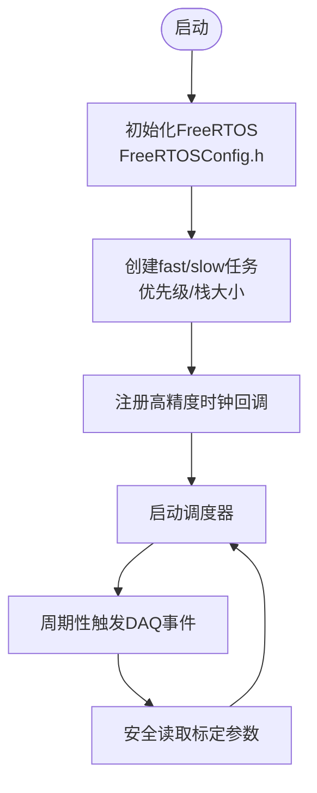
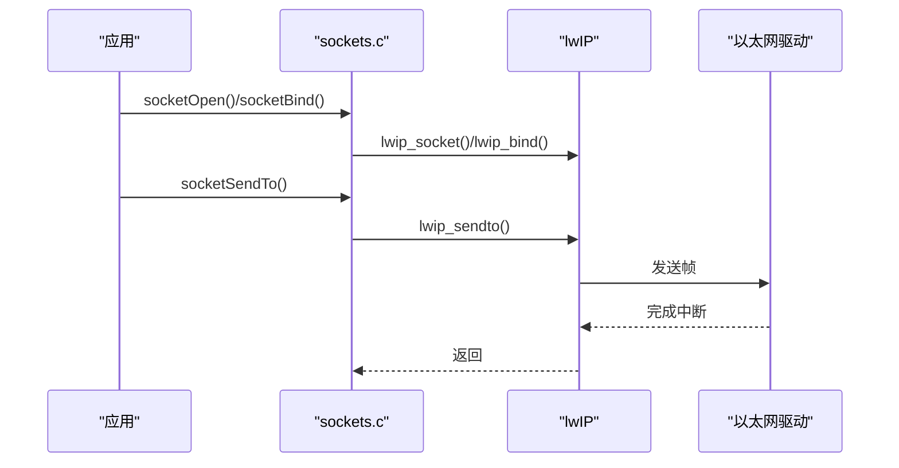
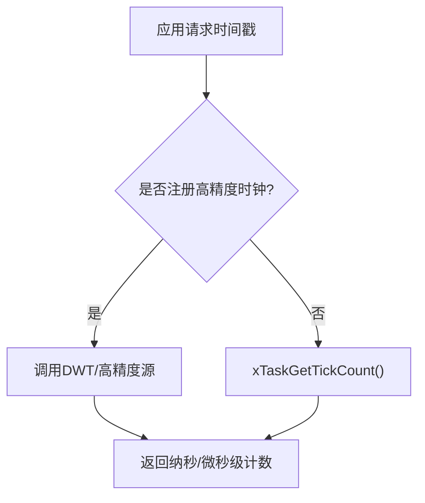
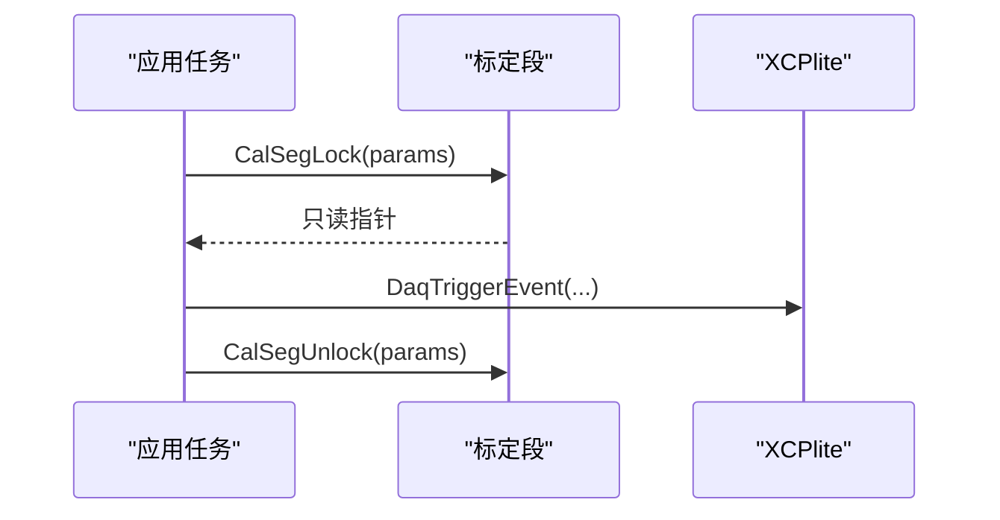
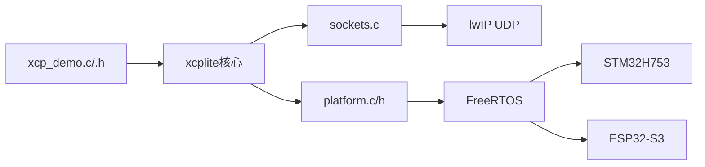

# FreeRTOS嵌入式平台

<cite>
**本文引用的文件**
- [README.md](file://examples/freertos_demo/README.md)
- [freertos_stm32_demo/README.md](file://examples/freertos_demo/freertos_stm32_demo/README.md)
- [freertos_esp32_demo/README.md](file://examples/freertos_demo/freertos_esp32_demo/README.md)
- [xcplib_rtos_cfg.h](file://src/xcplib_rtos_cfg.h)
- [platform.h](file://src/platform.h)
- [platform.c](file://src/platform.c)
- [sockets.c](file://src/sockets.c)
- [FreeRTOSConfig.h](file://examples/freertos_demo/freertos_stm32_demo/Core/Inc/FreeRTOSConfig.h)
- [platformio.ini](file://examples/freertos_demo/freertos_esp32_demo/platformio.ini)
- [xcp_demo.h](file://examples/freertos_demo/xcp_demo.h)
- [xcp_demo.c](file://examples/freertos_demo/xcp_demo.c)
</cite>

## 目录
1. [简介](#简介)
2. [项目结构](#项目结构)
3. [核心组件](#核心组件)
4. [架构总览](#架构总览)
5. [详细组件分析](#详细组件分析)
6. [依赖关系分析](#依赖关系分析)
7. [性能与内存优化](#性能与内存优化)
8. [故障排查指南](#故障排查指南)
9. [结论](#结论)
10. [附录：构建、配置与最佳实践](#附录构建配置与最佳实践)

## 简介
本文件面向在FreeRTOS环境下集成XCPlite的工程师，覆盖STM32与ESP32两大平台的实现差异、内存限制优化策略、实时性保证机制、FreeRTOS配置文件要求、任务优先级分配、栈空间管理、内存池配置、lwIP网络栈集成、以太网驱动适配、UDP通信配置、构建系统（PlatformIO vs CubeMX）与工具链设置、调试流程、内存使用分析与性能调优建议，并提供完整的代码示例路径与最佳实践指导。

## 项目结构
- 示例工程位于 examples/freertos_demo，包含三类演示：
  - freertos_emu_demo：基于POSIX模拟器的FreeRTOS路径验证
  - freertos_esp32_demo：基于ESP32 + PlatformIO + Arduino框架
  - freertos_stm32_demo：基于STM32H753 + STM32CubeMX + FreeRTOS
- 共享应用逻辑位于 examples/freertos_demo/xcp_demo.c/.h，可在C/C++下编译
- 平台抽象与FreeRTOS适配位于 src/platform.*、src/sockets.c
- FreeRTOS与XCPlite配置分别由 FreeRTOSConfig.h（平台侧）与 xcplib_rtos_cfg.h（库侧）提供

图表来源
- [xcp_demo.c:38-65](file://examples/freertos_demo/xcp_demo.c#L38-L65)
- [platform.c:455-497](file://src/platform.c#L455-L497)
- [sockets.c:55-108](file://src/sockets.c#L55-L108)

章节来源
- [README.md:1-12](file://examples/freertos_demo/README.md#L1-L12)
- [freertos_stm32_demo/README.md:1-15](file://examples/freertos_demo/freertos_stm32_demo/README.md#L1-L15)
- [freertos_esp32_demo/README.md:1-33](file://examples/freertos_demo/freertos_esp32_demo/README.md#L1-L33)

## 核心组件
- 平台抽象层（platform.h/c）
  - 线程/互斥/时钟/睡眠/原子等跨平台接口；FreeRTOS路径下封装xTaskCreate、xSemaphore*、vTaskDelay、xTaskGetTickCount等
- 套接字抽象层（sockets.c）
  - FreeRTOS路径默认使用lwIP UDP socket API；TCP未实现
- XCPlite RTOS配置（xcplib_rtos_cfg.h）
  - 针对嵌入式目标裁剪：MTU=1500、DAQ/校准内存、队列大小、事件数、无文件系统/A2L在线生成、绝对地址模式等
- 应用示例（xcp_demo.c/.h）
  - 初始化XCP服务器、注册高精度时钟回调、创建高/低优先级任务、触发DAQ事件、声明可标定参数段

章节来源
- [platform.h:300-451](file://src/platform.h#L300-L451)
- [platform.c:78-90](file://src/platform.c#L78-L90)
- [platform.c:455-497](file://src/platform.c#L455-L497)
- [sockets.c:55-108](file://src/sockets.c#L55-L108)
- [xcplib_rtos_cfg.h:44-142](file://src/xcplib_rtos_cfg.h#L44-L142)
- [xcp_demo.c:38-65](file://examples/freertos_demo/xcp_demo.c#L38-L65)
- [xcp_demo.h:14-19](file://examples/freertos_demo/xcp_demo.h#L14-L19)

## 架构总览
XCPlite在FreeRTOS上的数据流与控制流如下：
- 应用任务通过DaqCreateEvent/DaqTriggerEvent标记测量点，并通过CalSegDecl/CalSegLock/CalSegUnlock安全访问标定参数
- XCP协议层将测量数据打包为UDP报文，经lwIP发送；接收端解析命令并执行标定/采集
- 平台抽象层提供时钟、延时、线程、互斥等能力；FreeRTOS路径下使用内核API与lwIP socket

图表来源
- [xcp_demo.c:38-65](file://examples/freertos_demo/xcp_demo.c#L38-L65)
- [sockets.c:164-200](file://src/sockets.c#L164-L200)

## 详细组件分析

### FreeRTOS配置与任务模型
- FreeRTOSConfig.h（STM32示例）
  - 启用静态/动态分配、最大优先级、堆大小、定时器、递归互斥、溢出检测等
  - 增加TLS槽以满足lwIP per-thread netconn semaphore需求
- 任务优先级与栈
  - 示例中fastTask优先级最高，slowTask较低；两者可绑定到同一核以观察调度抖动
  - 栈大小在xcp_demo.h中定义，可根据实际压测调整
- 时钟
  - 默认使用xTaskGetTickCount（1ms粒度），可通过ApplXcpRegisterGetClockCallback注册更高精度时钟（如DWT）

图表来源
- [FreeRTOSConfig.h:59-172](file://examples/freertos_demo/freertos_stm32_demo/Core/Inc/FreeRTOSConfig.h#L59-L172)
- [xcp_demo.h:14-19](file://examples/freertos_demo/xcp_demo.h#L14-L19)
- [xcp_demo.c:51-56](file://examples/freertos_demo/xcp_demo.c#L51-L56)

章节来源
- [FreeRTOSConfig.h:59-172](file://examples/freertos_demo/freertos_stm32_demo/Core/Inc/FreeRTOSConfig.h#L59-L172)
- [xcp_demo.h:14-19](file://examples/freertos_demo/xcp_demo.h#L14-L19)
- [xcp_demo.c:51-56](file://examples/freertos_demo/xcp_demo.c#L51-L56)

### 套接字与lwIP集成
- 套接字抽象
  - FreeRTOS路径使用lwIP UDP socket；TCP未实现
  - 支持bind、recvfrom、sendto、shutdown、close等基础操作
- lwIP选项（STM32示例）
  - 启用RAW socket用于ICMP ping监听
  - 强制TX单pbuf拷贝，避免DMA不可达内存区域
  - 调整LwIP堆位置避免与RX池冲突
  - 为netconn每线程信号量配置TLS索引
- 以太网驱动适配
  - ethernetif.c中提升输入线程栈与优先级，确保负载下及时收包
  - 链接脚本中将DMA描述符与RX池放入DMA可访问区域

图表来源
- [sockets.c:84-134](file://src/sockets.c#L84-L134)
- [freertos_stm32_demo/README.md:112-125](file://examples/freertos_demo/freertos_stm32_demo/README.md#L112-L125)

章节来源
- [sockets.c:55-200](file://src/sockets.c#L55-L200)
- [freertos_stm32_demo/README.md:73-125](file://examples/freertos_demo/freertos_stm32_demo/README.md#L73-L125)

### 平台时钟与实时性保证
- 默认时钟
  - 基于xTaskGetTickCount，分辨率受configTICK_RATE_HZ影响
- 高精度时钟
  - 示例中通过Clock64_Init与ApplXcpRegisterGetClockCallback注册DWT等高精时钟，提高DAQ时间戳精度
- 延时与调度
  - sleepUs/sleepMs在FreeRTOS路径下映射到vTaskDelay，最小粒度为一个tick
  - 任务优先级与CPU亲和（可选）有助于降低抖动

图表来源
- [platform.c:455-497](file://src/platform.c#L455-L497)
- [xcp_demo.c:51-56](file://examples/freertos_demo/xcp_demo.c#L51-L56)

章节来源
- [platform.c:78-90](file://src/platform.c#L78-L90)
- [platform.c:455-497](file://src/platform.c#L455-L497)
- [xcp_demo.c:51-56](file://examples/freertos_demo/xcp_demo.c#L51-L56)

### 标定与测量（线程安全与离线A2L）
- 标定参数段
  - 使用CalSegDecl/CalSegDeclRef声明，XcpInit时自动发现并注册
  - 访问时使用CalSegLock/CalSegUnlock保证一致性；C++版本提供RAII句柄
- 测量事件
  - 使用DaqCreateEvent/DaqTriggerEvent在任务中打点，支持全局、静态与局部变量（需volatile保持可见）
- 离线A2L生成
  - 通过xcpclient从ELF中的xcp_evts、xcp_cals、xcp_meta等段生成A2L，无需运行时A2L生成

图表来源
- [xcp_demo.c:131-178](file://examples/freertos_demo/xcp_demo.c#L131-L178)
- [README.md:156-189](file://examples/freertos_demo/README.md#L156-L189)

章节来源
- [xcp_demo.c:131-178](file://examples/freertos_demo/xcp_demo.c#L131-L178)
- [README.md:156-189](file://examples/freertos_demo/README.md#L156-L189)

### 构建系统与工具链
- STM32（CubeMX）
  - 修改FreeRTOSConfig.h、MPU、SystemClock、lwipopts.h、链接脚本等
  - 使用CMake或Vector工具链；示例中包含自定义链接脚本与用户代码区
- ESP32（PlatformIO）
  - 通过platformio.ini添加编译定义与额外脚本
  - 使用extra_script.py筛选XCPlite源文件，extra_linker_script.py处理ELF段布局
  - 支持WiFi连接、LCD显示、I2C ADC等外设

章节来源
- [freertos_stm32_demo/README.md:69-125](file://examples/freertos_demo/freertos_stm32_demo/README.md#L69-L125)
- [freertos_esp32_demo/platformio.ini:11-43](file://examples/freertos_demo/freertos_esp32_demo/platformio.ini#L11-L43)
- [freertos_esp32_demo/README.md:286-338](file://examples/freertos_demo/freertos_esp32_demo/README.md#L286-L338)

## 依赖关系分析
- 应用层依赖XCPlite核心与平台抽象
- XCPlite核心依赖套接字抽象与lwIP
- 平台抽象依赖FreeRTOS内核API
- 不同平台对网络栈与链接布局有特殊要求

图表来源
- [xcp_demo.c:38-65](file://examples/freertos_demo/xcp_demo.c#L38-L65)
- [platform.c:455-497](file://src/platform.c#L455-L497)
- [sockets.c:55-108](file://src/sockets.c#L55-L108)

章节来源
- [xcp_demo.c:38-65](file://examples/freertos_demo/xcp_demo.c#L38-L65)
- [platform.c:455-497](file://src/platform.c#L455-L497)
- [sockets.c:55-108](file://src/sockets.c#L55-L108)

## 性能与内存优化
- 内存限制优化
  - 调整OPTION_CAL_MEM_SIZE、OPTION_DAQ_MEM_SIZE、OPTION_QUEUE_32_SEGMENT_COUNT、OPTION_DAQ_EVENT_COUNT等
  - 队列缓冲区固定大小，不依赖堆；每个段约1480字节（MTU=1500）
  - 将队列缓冲与状态放置于.dtcm/.noncacheable或自定义section，必要时在RTOS配置中重定向
- 实时性保证
  - 使用高精度时钟（DWT）替代tick-based时钟
  - 合理设置任务优先级与栈大小，必要时绑定到同一核观察调度抖动
  - 减少临界区长度，优先使用临界区而非互斥锁（queue32m默认）
- 网络栈优化
  - 启用LWIP_NETIF_TX_SINGLE_PBUF避免DMA不可达内存
  - 调整TCPIP_MBOX_SIZE等以应对高负载
  - 将DMA相关区域设为缓存可访问（MPU配置）

章节来源
- [README.md:193-253](file://examples/freertos_demo/README.md#L193-L253)
- [xcplib_rtos_cfg.h:86-135](file://src/xcplib_rtos_cfg.h#L86-L135)
- [freertos_stm32_demo/README.md:131-159](file://examples/freertos_demo/freertos_stm32_demo/README.md#L131-L159)

## 故障排查指南
- 常见问题
  - 无法ping通：检查以太网驱动线程栈与优先级、lwipopts.h RAW socket与TLS配置
  - UDP丢包：增大TCPIP_MBOX_SIZE，确认TX单pbuf拷贝已启用
  - HardFault：关闭未对齐访问陷阱，正确配置MPU区域
  - 栈溢出：启用configCHECK_FOR_STACK_OVERFLOW，调整任务栈大小
- 调试手段
  - 使用日志级别（XcpSetLogLevel）定位问题
  - 通过串口输出RSSI、通道、加密方式、BSSID、断开原因与IP地址（ESP32）
  - 使用示波器观察任务引脚翻转，评估XCP开销与周期抖动

章节来源
- [freertos_stm32_demo/README.md:98-125](file://examples/freertos_demo/freertos_stm32_demo/README.md#L98-L125)
- [freertos_esp32_demo/README.md:20-33](file://examples/freertos_demo/freertos_esp32_demo/README.md#L20-L33)
- [README.md:208-253](file://examples/freertos_demo/README.md#L208-L253)

## 结论
XCPlite在FreeRTOS下的集成通过平台抽象与lwIP套接字抽象实现了跨平台的一致性。STM32与ESP32在构建系统、网络栈配置与链接布局上存在差异，但均可通过合理的FreeRTOS配置、任务优先级与栈管理、以及XCPlite RTOS配置达到稳定可靠的实时测量与标定。结合高精度时钟、内存池与队列优化，可在资源受限的嵌入式平台上获得良好的实时性与吞吐表现。

## 附录：构建、配置与最佳实践
- 构建步骤
  - STM32：使用CubeMX生成基础工程，按示例修改FreeRTOSConfig.h、lwipopts.h、链接脚本与MPU配置，加入XCPlite源文件与头文件路径
  - ESP32：使用PlatformIO，配置platformio.ini的编译定义与脚本，按需启用显示/ADC功能
- 关键配置项
  - FreeRTOS：configSUPPORT_STATIC_ALLOCATION、configMAX_PRIORITIES、configMINIMAL_STACK_SIZE、configNUM_THREAD_LOCAL_STORAGE_POINTERS
  - XCPlite RTOS：OPTION_MTU、OPTION_CAL_MEM_SIZE、OPTION_DAQ_MEM_SIZE、OPTION_QUEUE_32_SEGMENT_COUNT、OPTION_DAQ_EVENT_COUNT
- 最佳实践
  - 始终使用宏进行测量与标定注册，以便离线A2L生成
  - 局部测量变量加volatile以保持优化后的可见性
  - 在高负载场景下，适当提升以太网输入线程优先级与栈大小
  - 使用高精度时钟提升DAQ时间戳精度
  - 通过日志与示波器联合评估XCP开销与任务抖动

章节来源
- [freertos_stm32_demo/README.md:69-125](file://examples/freertos_demo/freertos_stm32_demo/README.md#L69-L125)
- [freertos_esp32_demo/README.md:83-101](file://examples/freertos_demo/freertos_esp32_demo/README.md#L83-L101)
- [README.md:305-423](file://examples/freertos_demo/README.md#L305-L423)