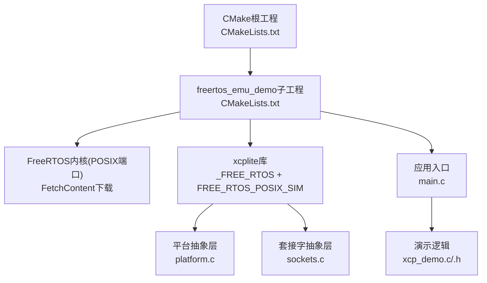
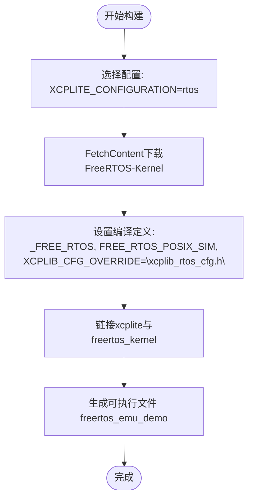
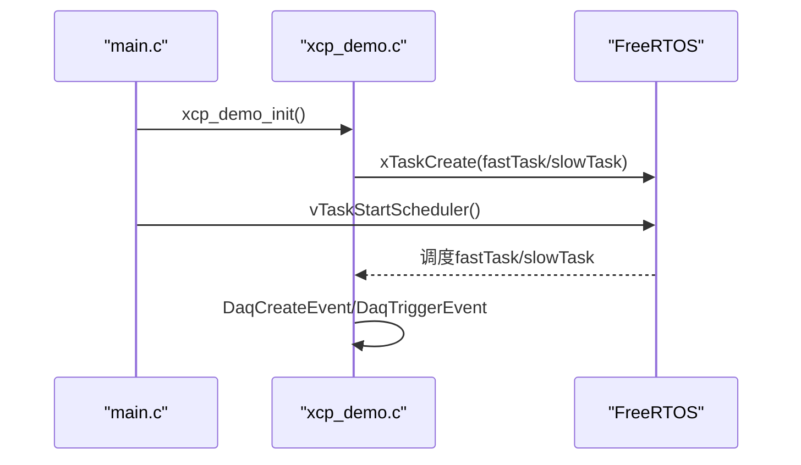
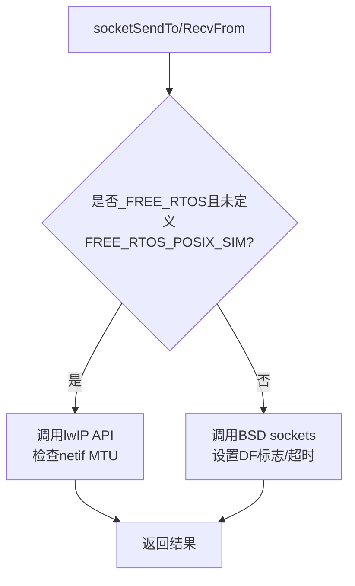
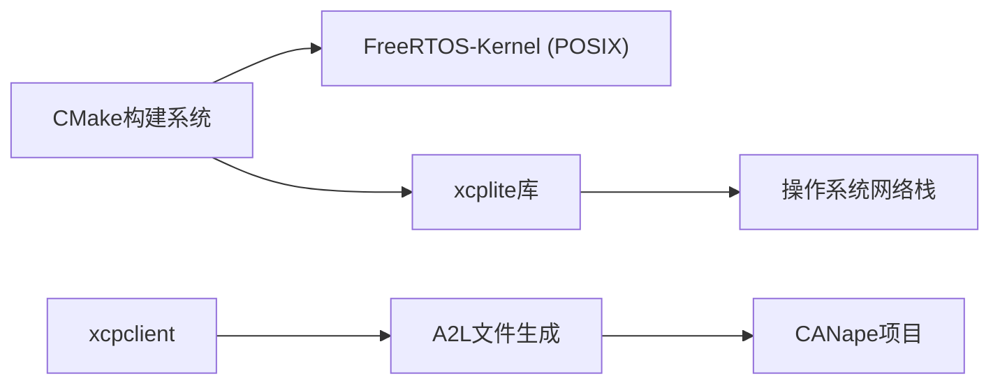

# FreeRTOS模拟器示例

<cite>
**本文引用的文件**
- [examples/freertos_demo/README.md](file://examples/freertos_demo/README.md)
- [examples/freertos_demo/freertos_emu_demo/README.md](file://examples/freertos_demo/freertos_emu_demo/README.md)
- [examples/freertos_demo/freertos_emu_demo/CMakeLists.txt](file://examples/freertos_demo/freertos_emu_demo/CMakeLists.txt)
- [examples/freertos_demo/freertos_emu_demo/src/main.c](file://examples/freertos_demo/freertos_emu_demo/src/main.c)
- [examples/freertos_demo/freertos_emu_demo/FreeRTOSConfig.h](file://examples/freertos_demo/freertos_emu_demo/FreeRTOSConfig.h)
- [examples/freertos_demo/xcp_demo.c](file://examples/freertos_demo/xcp_demo.c)
- [examples/freertos_demo/xcp_demo.h](file://examples/freertos_demo/xcp_demo.h)
- [src/xcplib_rtos_cfg.h](file://src/xcplib_rtos_cfg.h)
- [src/platform.c](file://src/platform.c)
- [src/sockets.c](file://src/sockets.c)
- [CMakeLists.txt](file://CMakeLists.txt)
- [examples/freertos_demo/freertos_emu_demo/CANape/freertos_demo.cna](file://examples/freertos_demo/freertos_emu_demo/CANape/freertos_demo.cna)
- [examples/freertos_demo/freertos_emu_demo/CANape/CANape.ini](file://examples/freertos_demo/freertos_emu_demo/CANape/CANape.ini)
</cite>

## 目录
1. [简介](#简介)
2. [项目结构](#项目结构)
3. [核心组件](#核心组件)
4. [架构总览](#架构总览)
5. [详细组件分析](#详细组件分析)
6. [依赖关系分析](#依赖关系分析)
7. [性能考量](#性能考量)
8. [故障排查指南](#故障排查指南)
9. [结论](#结论)
10. [附录](#附录)

## 简介
本文件面向在Linux/macOS桌面环境使用FreeRTOS POSIX模拟器运行XCPlite的开发者，系统性说明如何安装配置模拟器、设置CMake构建、调整FreeRTOS与XCPlite配置，以及在模拟器环境下理解网络栈实现、任务调度模拟与内存管理策略。文档还涵盖编译与运行演示程序、与CANape工具集成、调试技巧、性能分析与常见问题解决方案，并提供完整的代码路径引用与最佳实践指导，帮助快速验证嵌入式XCP应用。

## 项目结构
freertos_emu_demo位于examples/freertos_demo下，通过CMake FetchContent拉取FreeRTOS-Kernel（POSIX端口），将每个FreeRTOS任务映射为pthread，并使用SIGUSR1/SIGUSR2进行任务切换，从而在桌面端以真实FreeRTOS语义运行XCP测量与标定逻辑。



图表来源
- [CMakeLists.txt:17-45](file://CMakeLists.txt#L17-L45)
- [examples/freertos_demo/freertos_emu_demo/CMakeLists.txt:16-46](file://examples/freertos_demo/freertos_emu_demo/CMakeLists.txt#L16-L46)
- [examples/freertos_demo/freertos_emu_demo/CMakeLists.txt:77-96](file://examples/freertos_demo/freertos_emu_demo/CMakeLists.txt#L77-L96)

章节来源
- [CMakeLists.txt:17-45](file://CMakeLists.txt#L17-L45)
- [examples/freertos_demo/freertos_emu_demo/CMakeLists.txt:16-46](file://examples/freertos_demo/freertos_emu_demo/CMakeLists.txt#L16-L46)
- [examples/freertos_demo/freertos_emu_demo/README.md:15-41](file://examples/freertos_demo/freertos_emu_demo/README.md#L15-L41)

## 核心组件
- 构建系统：根CMakeLists提供多配置开关（default/no_a2l/ptp/shm/rtos/raw），选择rtos时启用freertos_emu_demo目标；子工程CMakeLists通过FetchContent获取FreeRTOS-Kernel并配置编译器定义。
- 运行时：FreeRTOS POSIX模拟器将任务映射到pthread，使用信号进行调度；应用通过vTaskStartScheduler启动调度器。
- 网络栈：在POSIX模拟器下，sockets.c走非FreeRTOS分支，使用标准BSD sockets；在真实FreeRTOS目标上则调用lwIP socket API。
- 时钟与睡眠：platform.c根据平台分支实现sleepUs/sleepMs与clockGet；FreeRTOS路径基于tick计数，可注册高精度回调。
- 配置覆盖：xcplib_rtos_cfg.h对默认配置进行覆盖，适配嵌入式资源限制与FreeRTOS特性。

章节来源
- [CMakeLists.txt:17-45](file://CMakeLists.txt#L17-L45)
- [examples/freertos_demo/freertos_emu_demo/CMakeLists.txt:77-96](file://examples/freertos_demo/freertos_emu_demo/CMakeLists.txt#L77-L96)
- [examples/freertos_demo/freertos_emu_demo/src/main.c:71-86](file://examples/freertos_demo/freertos_emu_demo/src/main.c#L71-L86)
- [src/sockets.c:53-268](file://src/sockets.c#L53-L268)
- [src/platform.c:78-155](file://src/platform.c#L78-L155)
- [src/platform.c:455-500](file://src/platform.c#L455-L500)
- [src/xcplib_rtos_cfg.h:44-142](file://src/xcplib_rtos_cfg.h#L44-L142)

## 架构总览
下图展示从应用初始化到XCP服务器监听、任务创建、DAQ事件触发与CANape采集的整体流程。

```mermaid
sequenceDiagram
participant App as "应用main.c"
participant Demo as "xcp_demo.c"
participant XCP as "xcplite库"
participant Net as "sockets.c"
participant OS as "FreeRTOS/POSIX"
participant CANape as "CANape"
App->>Demo : xcp_demo_init()
Demo->>XCP : XcpInit / XcpCreateEpk
Demo->>XCP : XcpEthServerInit(UDP 5555)
XCP->>Net : socketOpen/BIND/SETTIMEOUT
Note over XCP,Net : 模拟器使用BSD sockets; 真实目标使用lwIP
Demo->>OS : vTaskStartScheduler()
OS-->>Demo : fastTask/slowTask运行
Demo->>XCP : DaqCreateEvent / DaqTriggerEvent
XCP->>Net : socketSendTo(UDP数据包)
CANape->>XCP : XCP命令(测量/标定)
XCP-->>CANape : DAQ数据/校准响应
```

图表来源
- [examples/freertos_demo/freertos_emu_demo/src/main.c:71-86](file://examples/freertos_demo/freertos_emu_demo/src/main.c#L71-L86)
- [examples/freertos_demo/xcp_demo.c:38-65](file://examples/freertos_demo/xcp_demo.c#L38-L65)
- [src/sockets.c:84-162](file://src/sockets.c#L84-L162)
- [examples/freertos_demo/xcp_demo.c:244-315](file://examples/freertos_demo/xcp_demo.c#L244-L315)

## 详细组件分析

### 构建与配置（CMake与FreeRTOS）
- 根CMakeLists支持XCPLITE_CONFIGURATION=rtos，启用freertos_emu_demo目标，并通过add_subdirectory引入子工程。
- 子工程CMakeLists：
  - 使用FetchContent下载FreeRTOS-Kernel V11.1.0，设置FREERTOS_PORT=GCC_POSIX、FREERTOS_HEAP=3。
  - 创建freertos_config接口库暴露FreeRTOSConfig.h给内核。
  - 为目标添加编译定义：_FREE_RTOS、FREE_RTOS_POSIX_SIM、XCPLIB_CFG_OVERRIDE="xcplib_rtos_cfg.h"。
  - 链接xcplite与freertos_kernel，并包含必要的头文件路径。



图表来源
- [CMakeLists.txt:409-419](file://CMakeLists.txt#L409-L419)
- [examples/freertos_demo/freertos_emu_demo/CMakeLists.txt:16-46](file://examples/freertos_demo/freertos_emu_demo/CMakeLists.txt#L16-L46)
- [examples/freertos_demo/freertos_emu_demo/CMakeLists.txt:77-96](file://examples/freertos_demo/freertos_emu_demo/CMakeLists.txt#L77-L96)

章节来源
- [CMakeLists.txt:409-419](file://CMakeLists.txt#L409-L419)
- [examples/freertos_demo/freertos_emu_demo/CMakeLists.txt:16-46](file://examples/freertos_demo/freertos_emu_demo/CMakeLists.txt#L16-L46)
- [examples/freertos_demo/freertos_emu_demo/CMakeLists.txt:77-96](file://examples/freertos_demo/freertos_emu_demo/CMakeLists.txt#L77-L96)

### FreeRTOS配置（FreeRTOSConfig.h）
- 关键设置：configTICK_RATE_HZ=1000（1ms tick）、configMINIMAL_STACK_SIZE=4096 words、configTOTAL_HEAP_SIZE=1MB（heap_3委托malloc）、configMAX_PRIORITIES=7、configUSE_TIMERS=1。
- 这些值针对POSIX开发调优，移植到MCU时需减小堆与栈大小。

章节来源
- [examples/freertos_demo/freertos_emu_demo/FreeRTOSConfig.h:14-66](file://examples/freertos_demo/freertos_emu_demo/FreeRTOSConfig.h#L14-L66)
- [examples/freertos_demo/freertos_emu_demo/README.md:45-61](file://examples/freertos_demo/freertos_emu_demo/README.md#L45-L61)

### 应用入口与任务调度
- main.c中注册信号处理函数，调用xcp_demo_init初始化XCP服务，然后启动FreeRTOS调度器（vTaskStartScheduler）。
- xcp_demo.c创建两个任务：fastTask（高优先级周期任务）与slowTask（低优先级后台任务），并在任务内创建并触发DAQ事件，更新全局变量与本地测量变量。



图表来源
- [examples/freertos_demo/freertos_emu_demo/src/main.c:57-86](file://examples/freertos_demo/freertos_emu_demo/src/main.c#L57-L86)
- [examples/freertos_demo/xcp_demo.c:244-315](file://examples/freertos_demo/xcp_demo.c#L244-L315)
- [examples/freertos_demo/xcp_demo.c:418-459](file://examples/freertos_demo/xcp_demo.c#L418-L459)

章节来源
- [examples/freertos_demo/freertos_emu_demo/src/main.c:57-86](file://examples/freertos_demo/freertos_emu_demo/src/main.c#L57-L86)
- [examples/freertos_demo/xcp_demo.c:244-315](file://examples/freertos_demo/xcp_demo.c#L244-L315)
- [examples/freertos_demo/xcp_demo.c:418-459](file://examples/freertos_demo/xcp_demo.c#L418-L459)

### 网络栈实现（模拟器与目标差异）
- 模拟器（POSIX）：sockets.c在非_FREE_RTOS分支中使用标准BSD sockets，绑定UDP端口5555，设置超时，发送/接收数据包。
- 真实FreeRTOS目标：若定义OPTION_FREERTOS_LWIP，则使用lwIP socket API（lwip_socket/lwip_sendto等），并对MTU进行检查与警告。



图表来源
- [src/sockets.c:53-268](file://src/sockets.c#L53-L268)
- [src/sockets.c:272-470](file://src/sockets.c#L272-L470)

章节来源
- [src/sockets.c:53-268](file://src/sockets.c#L53-L268)
- [src/sockets.c:272-470](file://src/sockets.c#L272-L470)

### 时钟与睡眠（高精度时间戳）
- platform.c在_FREE_RTOS分支下，sleepUs/sleepMs基于vTaskDelay，粒度为1ms（由configTICK_RATE_HZ决定）。
- clockGet在FreeRTOS路径下使用xTaskGetTickCount转换为配置的CLOCK_TICKS_PER_S单位；可通过ApplXcpRegisterGetClockCallback注册更高精度时钟（如DWT）。

章节来源
- [src/platform.c:78-155](file://src/platform.c#L78-L155)
- [src/platform.c:455-500](file://src/platform.c#L455-L500)
- [examples/freertos_demo/xcp_demo.c:51-56](file://examples/freertos_demo/xcp_demo.c#L51-L56)

### 内存管理与队列策略
- xcplib_rtos_cfg.h覆盖默认配置：
  - OPTION_QUEUE_32强制使用32位无锁队列（避免64位原子操作）。
  - OPTION_CAL_MEM_SIZE与OPTION_DAQ_MEM_SIZE限制标定与DAQ内存占用。
  - OPTION_MTU=1500，确保UDP载荷不超过链路MTU。
  - 静态分配队列缓冲区（固定大小），不依赖堆。
- 日志级别5可查看内存使用情况（如queue32缓冲大小、tXcpData大小等）。

章节来源
- [src/xcplib_rtos_cfg.h:86-142](file://src/xcplib_rtos_cfg.h#L86-L142)
- [examples/freertos_demo/README.md:193-253](file://examples/freertos_demo/README.md#L193-L253)

### 与CANape集成
- CANape项目文件（.cna/.ini）预置了测量对象、校准参数与虚拟函数（如fastTaskCycleTime/slowTaskCycleTime）。
- A2L文件由xcpclient离线生成或预置，包含XCP IF_DATA与事件描述。
- 连接方式：CANape通过UDP连接到XCP服务器（默认端口5555），读取A2L中的地址信息。

章节来源
- [examples/freertos_demo/freertos_emu_demo/CANape/freertos_demo.cna:35-78](file://examples/freertos_demo/freertos_emu_demo/CANape/freertos_demo.cna#L35-L78)
- [examples/freertos_demo/freertos_emu_demo/CANape/CANape.ini:304-313](file://examples/freertos_demo/freertos_emu_demo/CANape/CANape.ini#L304-L313)
- [examples/freertos_demo/README.md:79-131](file://examples/freertos_demo/README.md#L79-L131)

## 依赖关系分析
- 构建期依赖：CMake、FreeRTOS-Kernel（FetchContent）、线程库、数学库（Unix）。
- 运行期依赖：FreeRTOS内核（POSIX端口）、操作系统网络栈（BSD sockets或lwIP）。
- 工具链依赖：xcpclient（Rust）用于离线A2L生成与命令行测试。



图表来源
- [CMakeLists.txt:156-161](file://CMakeLists.txt#L156-L161)
- [CMakeLists.txt:245-303](file://CMakeLists.txt#L245-L303)
- [examples/freertos_demo/freertos_emu_demo/CMakeLists.txt:16-46](file://examples/freertos_demo/freertos_emu_demo/CMakeLists.txt#L16-L46)

章节来源
- [CMakeLists.txt:156-161](file://CMakeLists.txt#L156-L161)
- [CMakeLists.txt:245-303](file://CMakeLists.txt#L245-L303)
- [examples/freertos_demo/freertos_emu_demo/CMakeLists.txt:16-46](file://examples/freertos_demo/freertos_emu_demo/CMakeLists.txt#L16-L46)

## 性能考量
- 任务优先级与核亲和性：可将任务绑定到同一核心观察调度行为（通过xTaskCreatePinnedToCore）。
- 队列与内存：调整OPTION_QUEUE_32_SEGMENT_COUNT与OPTION_DAQ_EVENT_COUNT平衡吞吐与RAM占用。
- 时钟分辨率：使用高精度时钟回调降低时间戳误差；合理设置CLOCK_TICKS_PER_S。
- 日志级别：开启日志级别5监控内存与队列状态，定位瓶颈。

[本节为通用性能建议，无需特定文件引用]

## 故障排查指南
- 构建失败：
  - 确认已设置XCPLITE_CONFIGURATION=rtos并启用XCPLITE_BUILD_EXAMPLES=ON。
  - 首次构建需联网下载FreeRTOS-Kernel，确保网络可达。
- 运行崩溃：
  - 检查FreeRTOSConfig.h中的堆与栈大小是否足够；POSIX模拟器默认较大，移植至MCU需缩减。
  - 信号处理：SIGINT/SIGTERM会调用XcpDisconnect与XcpEthServerShutdown，确保清理资源。
- 网络问题：
  - 端口冲突：确认5555端口未被占用。
  - MTU过大：若超过链路MTU，sockets.c会发出警告；调整OPTION_MTU或减少DAQ负载。
- 无法连接CANape：
  - 确认A2L文件中的IP地址正确（默认127.0.0.1用于本地回环）。
  - 防火墙规则允许UDP通信。

章节来源
- [examples/freertos_demo/freertos_emu_demo/README.md:15-41](file://examples/freertos_demo/freertos_emu_demo/README.md#L15-L41)
- [examples/freertos_demo/freertos_emu_demo/src/main.c:57-66](file://examples/freertos_demo/freertos_emu_demo/src/main.c#L57-L66)
- [src/sockets.c:200-248](file://src/sockets.c#L200-L248)
- [examples/freertos_demo/README.md:129-131](file://examples/freertos_demo/README.md#L129-L131)

## 结论
通过FreeRTOS POSIX模拟器，开发者可在桌面环境以接近真实嵌入式的方式验证XCPlite应用。结合CMake构建系统、FreeRTOS配置覆盖与平台抽象层，能够无缝切换POSIX与目标平台。配合CANape与xcpclient，可实现高效的测量、标定与离线A2L生成工作流。遵循本文档的配置与最佳实践，可显著缩短嵌入式XCP应用的开发与调试周期。

[本节为总结性内容，无需特定文件引用]

## 附录
- 快速开始：
  - 构建：cmake -B build-rtos -S . -DXCPLITE_CONFIGURATION=rtos -DXCPLITE_BUILD_EXAMPLES=ON -DCMAKE_BUILD_TYPE=Debug
  - 运行：./build-rtos/freertos_demo
- 常用命令：
  - 生成A2L模板：xcpclient --offline --udp --dest-addr 127.0.0.1 --elf <elf> --a2l <a2l> --create-a2l-template
  - 测量变量：xcpclient --udp --dest-addr 127.0.0.1 --a2l <a2l> --mea global_counter
  - 标定参数：xcpclient --udp --dest-addr 127.0.0.1 --a2l <a2l> --cal parameters.counter_max 500

章节来源
- [examples/freertos_demo/freertos_emu_demo/README.md:30-41](file://examples/freertos_demo/freertos_emu_demo/README.md#L30-L41)
- [examples/freertos_demo/README.md:85-124](file://examples/freertos_demo/README.md#L85-L124)