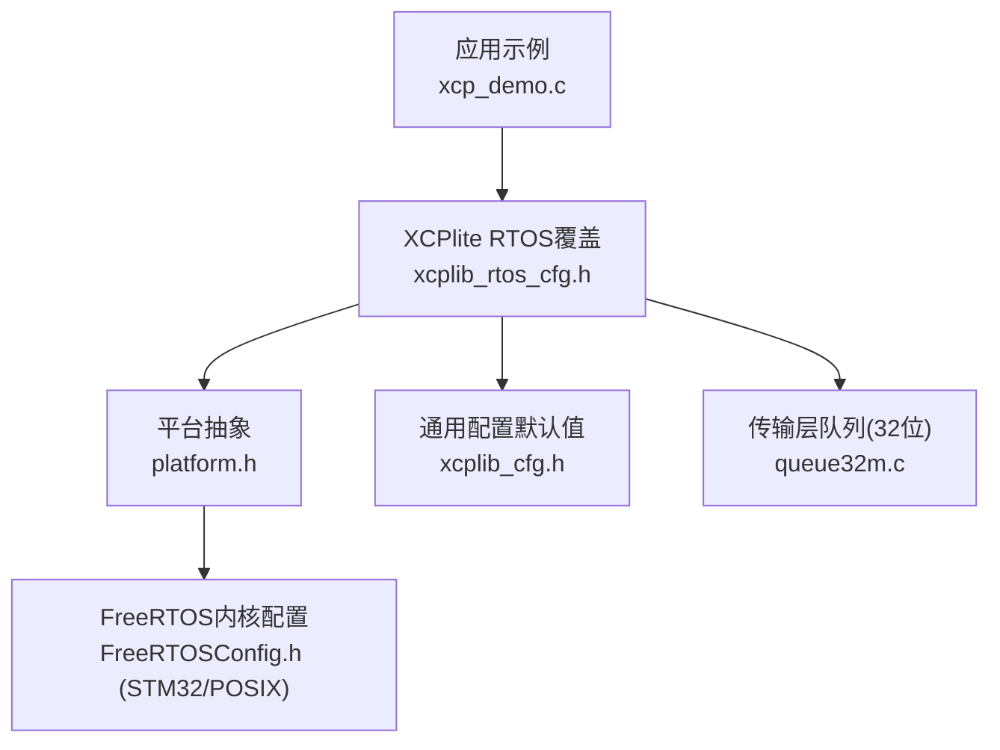
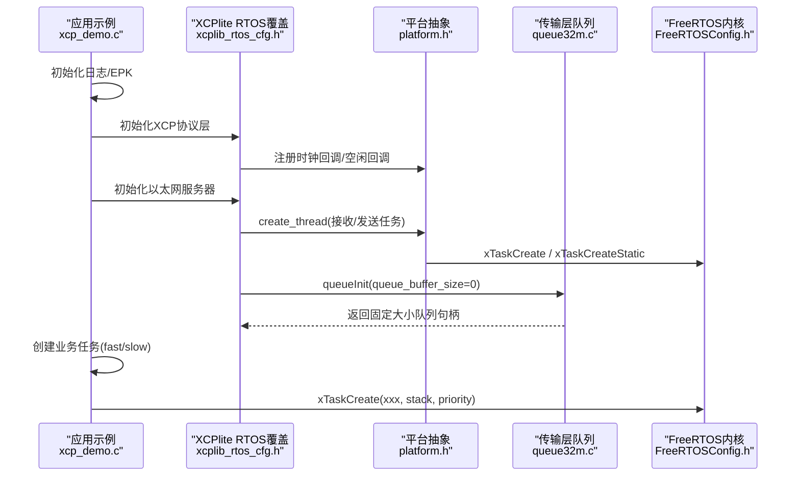
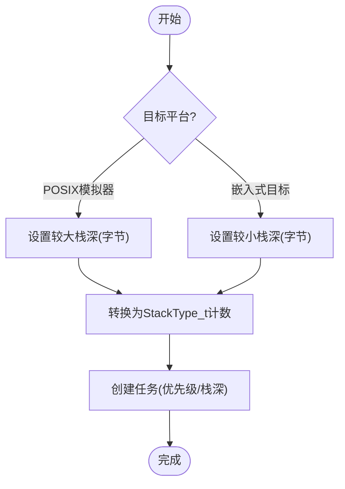
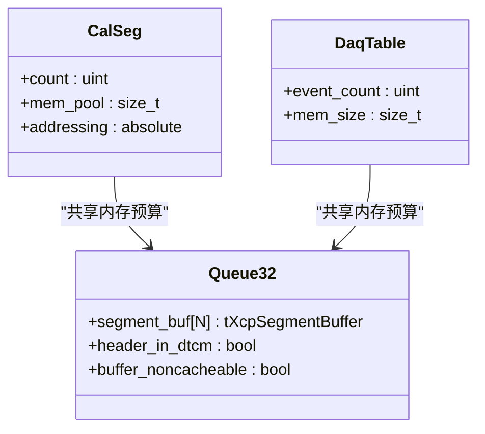
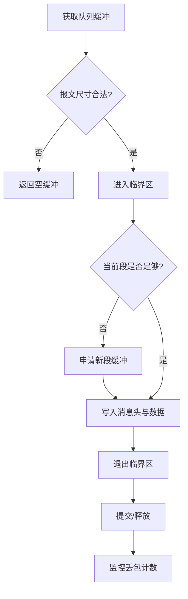
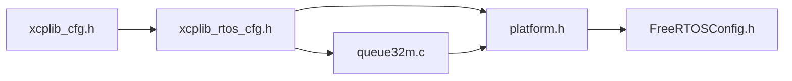

# FreeRTOS配置指南

<cite>
**本文引用的文件**
- [src/xcplib_rtos_cfg.h](file://src/xcplib_rtos_cfg.h)
- [examples/freertos_demo/freertos_emu_demo/FreeRTOSConfig.h](file://examples/freertos_demo/freertos_emu_demo/FreeRTOSConfig.h)
- [examples/freertos_demo/freertos_stm32_demo/Core/Inc/FreeRTOSConfig.h](file://examples/freertos_demo/freertos_stm32_demo/Core/Inc/FreeRTOSConfig.h)
- [examples/freertos_demo/xcp_demo.c](file://examples/freertos_demo/xcp_demo.c)
- [src/platform.h](file://src/platform.h)
- [src/xcplib_cfg.h](file://src/xcplib_cfg.h)
- [src/queue32m.c](file://src/queue32m.c)
</cite>

## 目录
1. [简介](#简介)
2. [项目结构](#项目结构)
3. [核心组件](#核心组件)
4. [架构总览](#架构总览)
5. [详细组件分析](#详细组件分析)
6. [依赖关系分析](#依赖关系分析)
7. [性能考量](#性能考量)
8. [故障排查指南](#故障排查指南)
9. [结论](#结论)
10. [附录：配置模板与最佳实践](#附录：配置模板与最佳实践)

## 简介
本指南面向在FreeRTOS上集成XCPlite的工程师，系统阐述任务优先级分配、栈空间大小计算、内存池配置策略、内核参数调优、队列深度设置、事件标志组配置，以及Cortex-M平台的原子操作支持、时钟源选择与中断优先级管理。文档同时覆盖内存限制优化（静态/动态）、A2L生成与上传关闭、DAQ与校准段配置，并提供可复用的配置模板、调优建议与常见问题诊断方法。

## 项目结构
- FreeRTOS内核配置由平台示例提供：
  - POSIX模拟器：[examples/freertos_demo/freertos_emu_demo/FreeRTOSConfig.h](file://examples/freertos_demo/freertos_emu_demo/FreeRTOSConfig.h)
  - STM32目标：[examples/freertos_demo/freertos_stm32_demo/Core/Inc/FreeRTOSConfig.h](file://examples/freertos_demo/freertos_stm32_demo/Core/Inc/FreeRTOSConfig.h)
- XCPlite对FreeRTOS的覆盖配置位于：[src/xcplib_rtos_cfg.h](file://src/xcplib_rtos_cfg.h)
- 平台抽象与线程/互斥量/时钟等封装在：[src/platform.h](file://src/platform.h)
- 通用构建选项与默认值在：[src/xcplib_cfg.h](file://src/xcplib_cfg.h)
- 传输层队列实现（FreeRTOS 32位路径）在：[src/queue32m.c](file://src/queue32m.c)
- 应用示例初始化与任务创建在：[examples/freertos_demo/xcp_demo.c](file://examples/freertos_demo/xcp_demo.c)

图表来源
- [src/xcplib_rtos_cfg.h:1-142](file://src/xcplib_rtos_cfg.h#L1-L142)
- [src/platform.h:100-170](file://src/platform.h#L100-L170)
- [examples/freertos_demo/freertos_stm32_demo/Core/Inc/FreeRTOSConfig.h:59-175](file://examples/freertos_demo/freertos_stm32_demo/Core/Inc/FreeRTOSConfig.h#L59-L175)
- [examples/freertos_demo/freertos_emu_demo/FreeRTOSConfig.h:14-92](file://examples/freertos_demo/freertos_emu_demo/FreeRTOSConfig.h#L14-L92)
- [src/xcplib_cfg.h:73-163](file://src/xcplib_cfg.h#L73-L163)
- [src/queue32m.c:117-137](file://src/queue32m.c#L117-L137)

章节来源
- [src/xcplib_rtos_cfg.h:1-142](file://src/xcplib_rtos_cfg.h#L1-L142)
- [src/platform.h:100-170](file://src/platform.h#L100-L170)
- [examples/freertos_demo/freertos_stm32_demo/Core/Inc/FreeRTOSConfig.h:59-175](file://examples/freertos_demo/freertos_stm32_demo/Core/Inc/FreeRTOSConfig.h#L59-L175)
- [examples/freertos_demo/freertos_emu_demo/FreeRTOSConfig.h:14-92](file://examples/freertos_demo/freertos_emu_demo/FreeRTOSConfig.h#L14-L92)
- [src/xcplib_cfg.h:73-163](file://src/xcplib_cfg.h#L73-L163)
- [src/queue32m.c:117-137](file://src/queue32m.c#L117-L137)

## 核心组件
- FreeRTOS内核配置
  - 抢占式调度、时间片、最大优先级数、最小栈深、堆大小、定时器任务优先级、递归互斥量、统计与跟踪开关等。
  - 参考：POSIX模拟器与STM32目标的FreeRTOSConfig.h。
- XCPlite RTOS覆盖配置
  - 任务栈大小与优先级、lwIP套接字API、时钟分辨率与纪元、MTU、TCP禁用、持久化/A2L/ELF上传禁用、校准段数量与内存、DAQ事件与内存、32位队列与临界区同步等。
- 平台抽象
  - 线程创建/销毁、互斥量、高精度时钟、原子类型与模拟、FreeRTOS特定宏定义与适配。
- 传输层队列
  - 针对FreeRTOS 32位的单消费者多生产者环形队列，使用临界区或ESP平台专用互斥，支持固定大小的段缓冲，避免DMA缓存一致性问题的内存放置。

章节来源
- [examples/freertos_demo/freertos_emu_demo/FreeRTOSConfig.h:14-92](file://examples/freertos_demo/freertos_emu_demo/FreeRTOSConfig.h#L14-L92)
- [examples/freertos_demo/freertos_stm32_demo/Core/Inc/FreeRTOSConfig.h:59-175](file://examples/freertos_demo/freertos_stm32_demo/Core/Inc/FreeRTOSConfig.h#L59-L175)
- [src/xcplib_rtos_cfg.h:44-142](file://src/xcplib_rtos_cfg.h#L44-L142)
- [src/platform.h:300-451](file://src/platform.h#L300-L451)
- [src/queue32m.c:152-177](file://src/queue32m.c#L152-L177)

## 架构总览
下图展示从应用到FreeRTOS内核的关键调用链与数据流，包括XCP服务器初始化、以太网服务启动、任务创建、队列与内存配置。

图表来源
- [examples/freertos_demo/xcp_demo.c:38-65](file://examples/freertos_demo/xcp_demo.c#L38-L65)
- [src/xcplib_rtos_cfg.h:44-89](file://src/xcplib_rtos_cfg.h#L44-L89)
- [src/platform.h:381-418](file://src/platform.h#L381-L418)
- [src/queue32m.c:217-257](file://src/queue32m.c#L217-L257)
- [examples/freertos_demo/freertos_stm32_demo/Core/Inc/FreeRTOSConfig.h:62-78](file://examples/freertos_demo/freertos_stm32_demo/Core/Inc/FreeRTOSConfig.h#L62-L78)

## 详细组件分析

### 任务优先级与栈空间
- 任务优先级
  - FreeRTOSConfig中定义最大优先级数与定时器任务优先级；STM32示例启用递归互斥量与统计能力。
  - XCPlite内部XCP服务器任务优先级默认基于空闲任务+2，可在RTOS覆盖中调整。
- 栈空间大小
  - POSIX模拟器需要更大的栈；嵌入式目标默认较小。可通过覆盖宏调整字节级栈深，平台抽象将其转换为StackType_t计数。
  - 应用侧任务栈需根据实际负载评估，可使用高水位标记进行测量。

图表来源
- [src/xcplib_rtos_cfg.h:44-53](file://src/xcplib_rtos_cfg.h#L44-L53)
- [src/platform.h:381-397](file://src/platform.h#L381-L397)
- [examples/freertos_demo/freertos_emu_demo/FreeRTOSConfig.h:14-24](file://examples/freertos_demo/freertos_emu_demo/FreeRTOSConfig.h#L14-L24)
- [examples/freertos_demo/freertos_stm32_demo/Core/Inc/FreeRTOSConfig.h:62-78](file://examples/freertos_demo/freertos_stm32_demo/Core/Inc/FreeRTOSConfig.h#L62-L78)

章节来源
- [src/xcplib_rtos_cfg.h:44-53](file://src/xcplib_rtos_cfg.h#L44-L53)
- [src/platform.h:381-397](file://src/platform.h#L381-L397)
- [examples/freertos_demo/freertos_emu_demo/FreeRTOSConfig.h:14-24](file://examples/freertos_demo/freertos_emu_demo/FreeRTOSConfig.h#L14-L24)
- [examples/freertos_demo/freertos_stm32_demo/Core/Inc/FreeRTOSConfig.h:62-78](file://examples/freertos_demo/freertos_stm32_demo/Core/Inc/FreeRTOSConfig.h#L62-L78)

### 内存池配置策略（校准段与DAQ）
- 校准段
  - 默认启用校准段管理与内存池；RTOS覆盖将段数量与总内存调整为适合SRAM的大小，并采用绝对寻址以兼容多数工具。
- DAQ表
  - 每个测量信号占用固定字节数的DAQ表内存；RTOS覆盖减少事件数量与DAQ内存以适配嵌入式资源。
- 队列缓冲区
  - 32位FreeRTOS路径使用固定大小的段缓冲数组，按tXcpSegmentBuffer对齐；队列头置于零等待区域以提升性能，段缓冲置于非缓存区域以避免DMA一致性问题。

图表来源
- [src/xcplib_rtos_cfg.h:91-135](file://src/xcplib_rtos_cfg.h#L91-L135)
- [src/queue32m.c:100-137](file://src/queue32m.c#L100-L137)

章节来源
- [src/xcplib_rtos_cfg.h:91-135](file://src/xcplib_rtos_cfg.h#L91-L135)
- [src/queue32m.c:100-137](file://src/queue32m.c#L100-L137)

### 队列深度设置与同步机制
- 队列深度
  - 32位FreeRTOS路径使用固定大小队列，忽略传入的缓冲区大小；通过OPTION_QUEUE_32_SIZE控制段数量。
- 同步机制
  - 默认使用临界区（taskENTER_CRITICAL），在ESP平台使用portMUX_TYPE；可选启用互斥量但会增加开销。
- 溢出处理
  - 当无可用段缓冲时记录丢包计数，供上层监控。

图表来源
- [src/queue32m.c:274-361](file://src/queue32m.c#L274-L361)
- [src/queue32m.c:389-463](file://src/queue32m.c#L389-L463)

章节来源
- [src/queue32m.c:274-361](file://src/queue32m.c#L274-L361)
- [src/queue32m.c:389-463](file://src/queue32m.c#L389-L463)

### 事件标志组与线程间同步
- FreeRTOSConfig启用事件标志组相关API，便于ISR与任务间快速同步。
- 应用示例中使用任务延时与计数器检测 overrun，体现事件驱动的任务调度模式。

章节来源
- [examples/freertos_demo/freertos_stm32_demo/Core/Inc/FreeRTOSConfig.h:100-122](file://examples/freertos_demo/freertos_stm32_demo/Core/Inc/FreeRTOSConfig.h#L100-L122)
- [examples/freertos_demo/xcp_demo.c:244-315](file://examples/freertos_demo/xcp_demo.c#L244-L315)

### 不同硬件平台的特定配置要求
- Cortex-M原子操作
  - 平台抽象说明32位RMW原子通常基于LDREX/STREX；64位原子不可用，因此强制使用32位队列。
- 时钟源选择
  - 默认1us分辨率；若自定义时钟需定义每秒钟滴答数，并在应用中注册时钟回调。
- 中断优先级管理
  - STM32示例定义NVIC优先级位数、库最低/最高SysCall优先级及内核中断优先级；确保调用FreeRTOS API的中断不超过最高SysCall优先级。

章节来源
- [src/platform.h:114-138](file://src/platform.h#L114-L138)
- [src/xcplib_rtos_cfg.h:63-78](file://src/xcplib_rtos_cfg.h#L63-L78)
- [examples/freertos_demo/freertos_stm32_demo/Core/Inc/FreeRTOSConfig.h:129-153](file://examples/freertos_demo/freertos_stm32_demo/Core/Inc/FreeRTOSConfig.h#L129-L153)

### 内存限制优化技术（静态/动态）
- 静态内存
  - FreeRTOSConfig可选择静态分配；平台抽象在静态模式下为XCP服务器任务提供静态TCB与栈缓冲。
- 动态内存
  - 默认启用动态分配；POSIX模拟器使用系统malloc/free，堆大小可配置。
- 队列与DAQ/校准段
  - 通过宏调整内存池大小与事件数量，避免超出SRAM限制；队列缓冲放置在非缓存区域以减少DMA一致性开销。

章节来源
- [examples/freertos_demo/freertos_emu_demo/FreeRTOSConfig.h:39-44](file://examples/freertos_demo/freertos_emu_demo/FreeRTOSConfig.h#L39-L44)
- [examples/freertos_demo/freertos_stm32_demo/Core/Inc/FreeRTOSConfig.h:62-78](file://examples/freertos_demo/freertos_stm32_demo/Core/Inc/FreeRTOSConfig.h#L62-L78)
- [src/platform.h:399-418](file://src/platform.h#L399-L418)
- [src/xcplib_rtos_cfg.h:91-135](file://src/xcplib_rtos_cfg.h#L91-L135)
- [src/queue32m.c:100-137](file://src/queue32m.c#L100-L137)

### 完整配置模板与最佳实践
- 任务优先级
  - 将XCP服务器任务设置为高于应用任务的优先级，确保实时响应；定时器任务优先级设为最高或次高。
- 栈空间
  - 使用高水位标记测量实际峰值，预留20%余量；POSIX模拟器显著增大栈深。
- 队列深度
  - 根据最大报文累积与网络吞吐估算段数量；固定队列更稳定且易于定位问题。
- 事件与DAQ
  - 合理设置事件数量与DAQ内存，避免过度碎片化；每个信号占用固定字节。
- 校准段
  - 使用绝对寻址提升兼容性；限制段数量与内存池大小以适应SRAM。
- 时钟
  - 明确分辨率与纪元；必要时注册自定义时钟回调。
- 中断
  - 严格限制调用FreeRTOS API的中断优先级；内核中断优先级与库优先级正确移位。

章节来源
- [src/xcplib_rtos_cfg.h:44-135](file://src/xcplib_rtos_cfg.h#L44-L135)
- [src/platform.h:381-418](file://src/platform.h#L381-L418)
- [examples/freertos_demo/freertos_stm32_demo/Core/Inc/FreeRTOSConfig.h:62-153](file://examples/freertos_demo/freertos_stm32_demo/Core/Inc/FreeRTOSConfig.h#L62-L153)

### 性能基准测试结果
- 由于仓库未包含具体基准测试输出，建议在目标平台上：
  - 使用FreeRTOS高水位标记测量任务栈使用情况。
  - 监控队列丢包计数与队列级别，评估拥塞情况。
  - 使用计时器或示波器测量关键路径延迟（如DAQ触发、以太网发送）。
  - 在不同负载下对比不同队列深度与DAQ事件数量的影响。

[本节为通用指导，不直接分析具体文件]

## 依赖关系分析
- 构建期依赖
  - xcplib_cfg.h提供默认选项；RTOS覆盖在编译时通过宏覆盖默认值。
- 运行期依赖
  - platform.h根据平台宏选择FreeRTOS API；队列实现依赖平台抽象提供的临界区/互斥量。
- 外部依赖
  - lwIP用于以太网传输；FreeRTOS内核提供任务、队列、事件标志组与定时器。

图表来源
- [src/xcplib_cfg.h:18-204](file://src/xcplib_cfg.h#L18-L204)
- [src/xcplib_rtos_cfg.h:1-142](file://src/xcplib_rtos_cfg.h#L1-L142)
- [src/platform.h:100-170](file://src/platform.h#L100-L170)
- [src/queue32m.c:16-32](file://src/queue32m.c#L16-L32)

章节来源
- [src/xcplib_cfg.h:18-204](file://src/xcplib_cfg.h#L18-L204)
- [src/xcplib_rtos_cfg.h:1-142](file://src/xcplib_rtos_cfg.h#L1-L142)
- [src/platform.h:100-170](file://src/platform.h#L100-L170)
- [src/queue32m.c:16-32](file://src/queue32m.c#L16-L32)

## 性能考量
- 队列与DMA
  - 将队列头置于零等待区域，段缓冲置于非缓存区域，避免显式缓存清理/失效，降低CPU开销。
- 同步方式
  - 优先使用临界区而非互斥量，减少上下文切换与优先级反转风险。
- 栈与堆
  - 合理设置最小栈深与堆大小，避免频繁分配；静态分配提高确定性。
- 时钟与DAQ
  - 使用高分辨率时钟与合适的DAQ事件频率，避免过载。

章节来源
- [src/queue32m.c:100-137](file://src/queue32m.c#L100-L137)
- [src/queue32m.c:152-177](file://src/queue32m.c#L152-L177)
- [src/xcplib_rtos_cfg.h:63-78](file://src/xcplib_rtos_cfg.h#L63-L78)

## 故障排查指南
- 常见错误
  - 未定义CLOCK_TICKS_PER_S导致编译失败；需在RTOS覆盖中明确时钟分辨率。
  - 队列溢出导致丢包；检查OPTION_QUEUE_32_SIZE与网络负载。
  - 中断优先级过高导致SysCall失败；调整configMAX_SYSCALL_INTERRUPT_PRIORITY。
  - 栈溢出；使用高水位标记与溢出检测。
- 诊断步骤
  - 启用调试日志与统计功能；监控队列级别与丢包计数。
  - 逐步缩小DAQ事件数量与校准段内存，定位瓶颈。
  - 在POSIX模拟器验证逻辑，再移植到目标平台。

章节来源
- [src/xcplib_rtos_cfg.h:63-78](file://src/xcplib_rtos_cfg.h#L63-L78)
- [src/queue32m.c:389-463](file://src/queue32m.c#L389-L463)
- [examples/freertos_demo/freertos_stm32_demo/Core/Inc/FreeRTOSConfig.h:129-153](file://examples/freertos_demo/freertos_stm32_demo/Core/Inc/FreeRTOSConfig.h#L129-L153)

## 结论
通过在FreeRTOS上合理配置任务优先级、栈空间、内存池与队列深度，并结合平台特定的原子操作、时钟源与中断优先级管理，可以在资源受限的嵌入式环境中稳定运行XCPlite。建议采用静态内存与固定队列提升确定性，使用高水位标记与监控指标持续优化性能。

[本节为总结性内容，不直接分析具体文件]

## 附录：配置模板与最佳实践
- 任务优先级与栈深
  - 设置XCP服务器任务优先级高于应用任务；POSIX模拟器增大栈深。
- 内存池
  - 校准段数量与内存池大小适配SRAM；DAQ事件数量与内存按需调整。
- 队列深度
  - 固定队列大小，避免运行时分配；监控丢包与队列级别。
- 时钟与中断
  - 明确分辨率与纪元；限制调用FreeRTOS API的中断优先级。
- 调试与优化
  - 启用统计与跟踪；使用高水位标记与计时器评估性能。

章节来源
- [src/xcplib_rtos_cfg.h:44-135](file://src/xcplib_rtos_cfg.h#L44-L135)
- [src/platform.h:381-418](file://src/platform.h#L381-L418)
- [examples/freertos_demo/freertos_stm32_demo/Core/Inc/FreeRTOSConfig.h:62-153](file://examples/freertos_demo/freertos_stm32_demo/Core/Inc/FreeRTOSConfig.h#L62-L153)