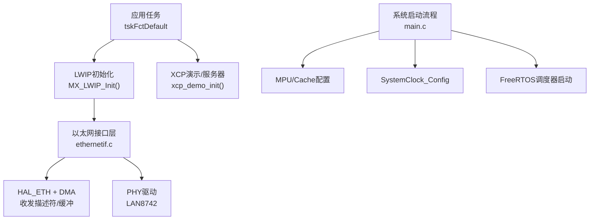
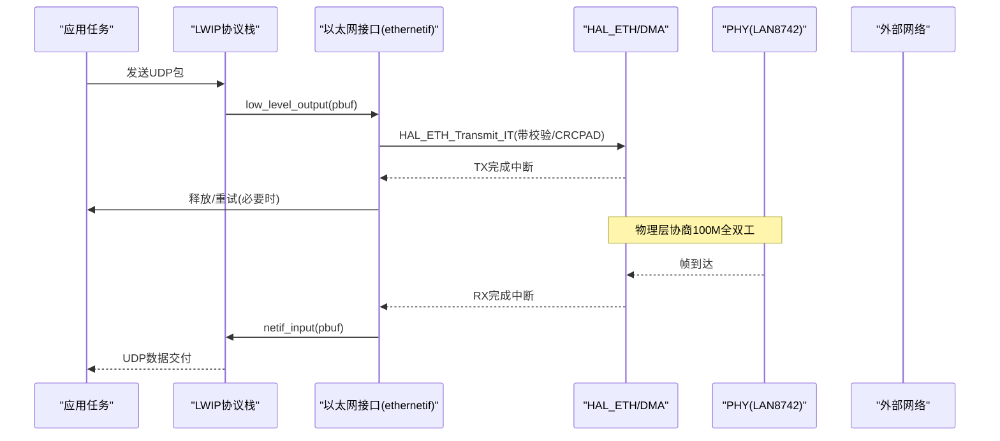
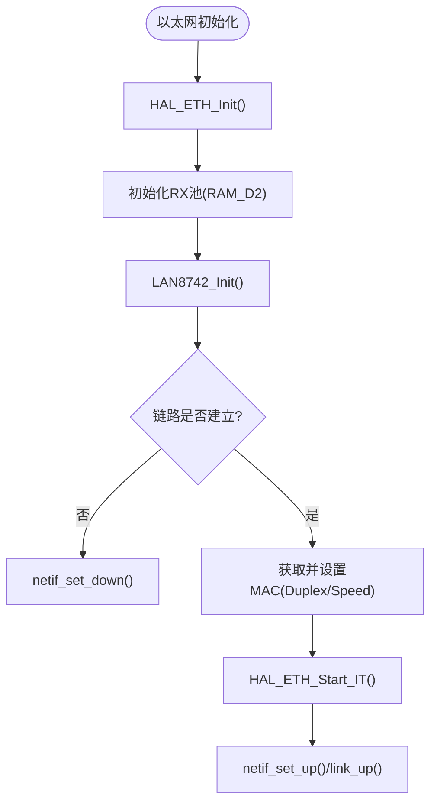
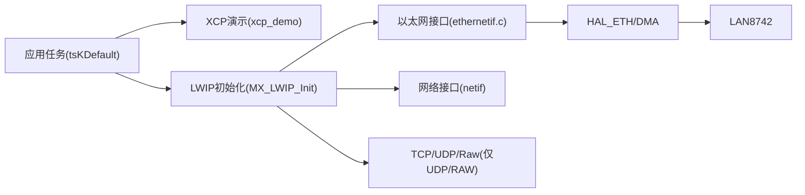

# STM32平台集成

<cite>
**本文引用的文件**
- [README.md](file://examples/freertos_demo/freertos_stm32_demo/README.md)
- [lwip_configuration.md](file://examples/freertos_demo/freertos_stm32_demo/lwip_configuration.md)
- [CMakeLists.txt](file://examples/freertos_demo/freertos_stm32_demo/CMakeLists.txt)
- [main.c](file://examples/freertos_demo/freertos_stm32_demo/Core/Src/main.c)
- [freertos.c](file://examples/freertos_demo/freertos_stm32_demo/Core/Src/freertos.c)
- [FreeRTOSConfig.h](file://examples/freertos_demo/freertos_stm32_demo/Core/Inc/FreeRTOSConfig.h)
- [ethernetif.c](file://examples/freertos_demo/freertos_stm32_demo/LWIP/Target/ethernetif.c)
- [lwipopts.h](file://examples/freertos_demo/freertos_stm32_demo/LWIP/Target/lwipopts.h)
- [STM32H753XX_FLASH.ld](file://examples/freertos_demo/freertos_stm32_demo/STM32H753XX_FLASH.ld)
- [stm32h7xx_it.c](file://examples/freertos_demo/freertos_stm32_demo/Core/Src/stm32h7xx_it.c)
- [CMakeLists.txt](file://CMakeLists.txt)
- [BUILDING.md](file://docs/BUILDING.md)
</cite>

## 目录
1. [简介](#简介)
2. [项目结构](#项目结构)
3. [核心组件](#核心组件)
4. [架构总览](#架构总览)
5. [详细组件分析](#详细组件分析)
6. [依赖关系分析](#依赖关系分析)
7. [性能考虑](#性能考虑)
8. [故障排除指南](#故障排除指南)
9. [结论](#结论)
10. [附录](#附录)

## 简介
本文件面向在STM32（以STM32H753为例）上集成XCPlite的完整工程实践，覆盖CubeMX工程配置、FreeRTOS内核设置、lwIP网络栈配置、以太网驱动适配、时钟与缓存/MPU优化、DMA与中断处理、内存布局、构建系统（原生CMake与PlatformIO差异）、ST-Link调试集成、硬件连接与引脚分配、以及性能调优与故障排除。内容基于仓库中的STM32 FreeRTOS示例与文档进行系统化整理，确保读者可据此完成从工程搭建到稳定运行的全流程集成。

## 项目结构
该STM32示例位于 examples/freertos_demo/freertos_stm32_demo，主要包含：
- CubeMX生成的外设初始化与系统时钟配置（main.c、freertos.c等）
- FreeRTOS内核配置（FreeRTOSConfig.h）
- lwIP网络栈配置与以太网接口实现（LWIP/Target/ethernetif.c、lwipopts.h）
- 链接脚本与内存布局（STM32H753XX_FLASH.ld）
- 中断服务程序（stm32h7xx_it.c）
- CMake工程定义（CMakeLists.txt）
- 说明文档（README.md、lwip_configuration.md）

图表来源
- [main.c:86-153](file://examples/freertos_demo/freertos_stm32_demo/Core/Src/main.c#L86-L153)
- [freertos.c:229-277](file://examples/freertos_demo/freertos_stm32_demo/Core/Src/freertos.c#L229-L277)
- [ethernetif.c:211-359](file://examples/freertos_demo/freertos_stm32_demo/LWIP/Target/ethernetif.c#L211-L359)

章节来源
- [README.md:1-172](file://examples/freertos_demo/freertos_stm32_demo/README.md#L1-L172)
- [CMakeLists.txt:1-118](file://examples/freertos_demo/freertos_stm32_demo/CMakeLists.txt#L1-L118)

## 核心组件
- 系统启动与初始化：关闭未对齐访问异常、启用I/D Cache、配置MPU、系统时钟、外设、FreeRTOS并启动调度器。
- FreeRTOS：任务创建、堆大小、优先级、TLS槽位用于每线程netconn信号量。
- lwIP与以太网：零拷贝RX池、TX单pbuf复制策略、ETH DMA描述符与缓冲放置于RAM_D2、网卡中断优先级与回调、PHY初始化与链路状态管理。
- 链接脚本与内存布局：DTCMRAM作为栈/堆，RAM_D2放置DMA描述符与RX池，FLASH中保留XCP校准与事件段。
- 中断与错误处理：ETH_IRQHandler转发至HAL；HardFault捕获关键寄存器便于事后调试。

章节来源
- [main.c:86-153](file://examples/freertos_demo/freertos_stm32_demo/Core/Src/main.c#L86-L153)
- [FreeRTOSConfig.h:59-172](file://examples/freertos_demo/freertos_stm32_demo/Core/Inc/FreeRTOSConfig.h#L59-L172)
- [ethernetif.c:100-133](file://examples/freertos_demo/freertos_stm32_demo/LWIP/Target/ethernetif.c#L100-L133)
- [ethernetif.c:211-359](file://examples/freertos_demo/freertos_stm32_demo/LWIP/Target/ethernetif.c#L211-L359)
- [lwipopts.h:44-176](file://examples/freertos_demo/freertos_stm32_demo/LWIP/Target/lwipopts.h#L44-L176)
- [STM32H753XX_FLASH.ld:58-133](file://examples/freertos_demo/freertos_stm32_demo/STM32H753XX_FLASH.ld#L58-L133)
- [stm32h7xx_it.c:86-105](file://examples/freertos_demo/freertos_stm32_demo/Core/Src/stm32h7xx_it.c#L86-L105)
- [stm32h7xx_it.c:188-194](file://examples/freertos_demo/freertos_stm32_demo/Core/Src/stm32h7xx_it.c#L188-L194)

## 架构总览
下图展示了从应用任务到以太网发送/接收的数据流，以及中断与DMA交互路径。

图表来源
- [ethernetif.c:377-446](file://examples/freertos_demo/freertos_stm32_demo/LWIP/Target/ethernetif.c#L377-L446)
- [ethernetif.c:456-499](file://examples/freertos_demo/freertos_stm32_demo/LWIP/Target/ethernetif.c#L456-L499)
- [ethernetif.c:211-359](file://examples/freertos_demo/freertos_stm32_demo/LWIP/Target/ethernetif.c#L211-L359)

## 详细组件分析

### 系统启动与时钟/缓存/MPU
- 启动入口关闭未对齐访问异常，避免newlib启动代码导致的HardFault。
- 启用I-Cache与D-Cache提升取指与数据访问性能。
- MPU三段式配置：
  - 区域0：4GB地址空间设为强序/不可缓存，保护外设安全。
  - 区域1：RAM_D2（0x3000_0000，256KB）设为可缓存，供以太网DMA使用。
  - 区域2：AXI SRAM（0x2400_0000，512KB）设为可缓存+可缓冲。
- 系统时钟：HSE旁路+PLL，AHB分频为2，使HCLK达到200MHz，满足100Mbps以太网带宽需求。

章节来源
- [main.c:86-153](file://examples/freertos_demo/freertos_stm32_demo/Core/Src/main.c#L86-L153)
- [main.c:159-211](file://examples/freertos_demo/freertos_stm32_demo/Core/Src/main.c#L159-L211)
- [main.c:219-266](file://examples/freertos_demo/freertos_stm32_demo/Core/Src/main.c#L219-L266)
- [README.md:73-103](file://examples/freertos_demo/freertos_stm32_demo/README.md#L73-L103)

### FreeRTOS内核配置
- 启用动态/静态分配、空闲钩子关闭、Tick频率1kHz。
- 最小栈大小2048字节，总堆64KB。
- 最大优先级56，支持递归互斥量、计数信号量、软件定时器。
- 开启CMSIS-RTOS V2特性（挂起/枚举、事件标志、定时器、互斥）。
- 将configASSERT实现为关中断+死循环，便于调试定位。
- 增加TLS槽位数（1），配合lwIP per-thread netconn信号量。

章节来源
- [FreeRTOSConfig.h:59-172](file://examples/freertos_demo/freertos_stm32_demo/Core/Inc/FreeRTOSConfig.h#L59-L172)
- [README.md:87-96](file://examples/freertos_demo/freertos_stm32_demo/README.md#L87-L96)

### lwIP与以太网驱动适配
- 零拷贝RX池：自定义RxBuff_t按32字节对齐，放入RAM_D2，减少拷贝开销。
- TX路径：启用LWIP_NETIF_TX_SINGLE_PBUF，强制将TX数据复制到单一pbuf，保证DMA可访问性（因XCPlite可能传递栈/堆缓冲区）。
- 描述符与缓冲：DMARxDscrTab/DMATxDscrTab置于RAM_D2特定段，RX池基址避开冲突区域。
- 中断与线程：
  - ETH_IRQn优先级需≥configLIBRARY_MAX_SYSCALL_INTERRUPT_PRIORITY（5），调用FreeRTOS API（信号量释放）。
  - ethernetif_input线程优先级osPriorityRealtime，保障高负载下及时收包。
- PHY：LAN8742通过MDIO初始化，自动协商100M全双工，更新MAC配置并启动中断模式。
- 时间源：sys_now()返回HAL_GetTick()，供LWIP内部计时。

图表来源
- [ethernetif.c:211-359](file://examples/freertos_demo/freertos_stm32_demo/LWIP/Target/ethernetif.c#L211-L359)
- [ethernetif.c:621-684](file://examples/freertos_demo/freertos_stm32_demo/LWIP/Target/ethernetif.c#L621-L684)

章节来源
- [ethernetif.c:63-133](file://examples/freertos_demo/freertos_stm32_demo/LWIP/Target/ethernetif.c#L63-L133)
- [ethernetif.c:211-359](file://examples/freertos_demo/freertos_stm32_demo/LWIP/Target/ethernetif.c#L211-L359)
- [ethernetif.c:377-499](file://examples/freertos_demo/freertos_stm32_demo/LWIP/Target/ethernetif.c#L377-L499)
- [ethernetif.c:608-611](file://examples/freertos_demo/freertos_stm32_demo/LWIP/Target/ethernetif.c#L608-L611)
- [lwipopts.h:44-176](file://examples/freertos_demo/freertos_stm32_demo/LWIP/Target/lwipopts.h#L44-L176)
- [README.md:112-125](file://examples/freertos_demo/freertos_stm32_demo/README.md#L112-L125)

### 内存布局与链接脚本优化
- 栈与堆：默认放置在DTCMRAM（0x2000_0000），避免被以太网DMA访问问题。
- RAM_D2（0x3000_0000）：放置以太网DMA描述符与RX池，确保DMA可访问且与lwIP heap不重叠。
- FLASH段：显式保留xcp_cals与xcp_evts段，防止--gc-sections裁剪导致XCP对象丢失。
- TLS段：DTCMRAM内定义.tdata/.tbss，提供TLS支持。

章节来源
- [STM32H753XX_FLASH.ld:58-133](file://examples/freertos_demo/freertos_stm32_demo/STM32H753XX_FLASH.ld#L58-L133)
- [STM32H753XX_FLASH.ld:181-268](file://examples/freertos_demo/freertos_stm32_demo/STM32H753XX_FLASH.ld#L181-L268)
- [README.md:122-125](file://examples/freertos_demo/freertos_stm32_demo/README.md#L122-L125)

### 中断处理机制
- ETH_IRQn：在中断中将以太网全局中断转发给HAL_ETH_IRQHandler，进而触发RX/TX完成回调与错误回调。
- HardFault_Handler：捕获HFSR、CFSR、MMFAR、BFAR、AFSR及PC，便于调试时查看崩溃上下文。
- TIM7_IRQHandler：用于系统滴答或应用定时，调用HAL_TIM_IRQHandler。

章节来源
- [stm32h7xx_it.c:86-105](file://examples/freertos_demo/freertos_stm32_demo/Core/Src/stm32h7xx_it.c#L86-L105)
- [stm32h7xx_it.c:172-194](file://examples/freertos_demo/freertos_stm32_demo/Core/Src/stm32h7xx_it.c#L172-L194)
- [ethernetif.c:621-684](file://examples/freertos_demo/freertos_stm32_demo/LWIP/Target/ethernetif.c#L621-L684)

### 高精度时间戳与时间源
- 当前实现使用HAL_GetTick()作为LWIP时间源（毫秒级），适用于一般网络栈计时。
- 若需要更高精度（如PTP同步），可在目标平台启用socket硬件时间戳能力（参考根项目ptp配置与工具链），但本STM32示例未直接启用该功能。

章节来源
- [ethernetif.c:608-611](file://examples/freertos_demo/freertos_stm32_demo/LWIP/Target/ethernetif.c#L608-L611)
- [CMakeLists.txt:15-35](file://CMakeLists.txt#L15-L35)
- [BUILDING.md:11-24](file://docs/BUILDING.md#L11-L24)

### 构建系统：原生CMake与PlatformIO差异
- 原生CMake（示例工程）：
  - 通过CMakeLists.txt添加CubeMX生成源码、XCPlite库与应用源文件，定义_FREE_RTOS与配置覆盖头。
  - 使用target_compile_definitions注入XCPLITE_CONFIGURATION=rtos与XCPLIB_CFG_OVERRIDE。
- PlatformIO（ESP32示例）：
  - platformio.ini中通过build_flags引入相同宏（_FREE_RTOS、XCPLITE_CONFIGURATION=rtos、XCPLIB_CFG_OVERRIDE），体现跨平台一致的编译选项。
- 根项目CMake：
  - 提供多配置（default/no_a2l/ptp/shm/rtos/raw），rtos配置面向嵌入式目标，减小占用并禁用文件系统。

章节来源
- [CMakeLists.txt:1-118](file://examples/freertos_demo/freertos_stm32_demo/CMakeLists.txt#L1-L118)
- [platformio.ini:11-43](file://examples/freertos_demo/freertos_esp32_demo/platformio.ini#L11-L43)
- [CMakeLists.txt:15-35](file://CMakeLists.txt#L15-L35)
- [BUILDING.md:11-24](file://docs/BUILDING.md#L11-L24)

### ST-Link调试集成
- 错误处理：Error_Handler中关闭中断后进入无限循环，便于ST-Link断点调试时查看完整调用栈。
- HardFault上下文：在HardFault_Handler中保存关键寄存器，便于调试器查看崩溃现场。
- 串口输出：USART3重定向printf到ST-LINK虚拟COM口，便于调试日志输出。

章节来源
- [main.c:294-303](file://examples/freertos_demo/freertos_stm32_demo/Core/Src/main.c#L294-L303)
- [stm32h7xx_it.c:86-105](file://examples/freertos_demo/freertos_stm32_demo/Core/Src/stm32h7xx_it.c#L86-L105)
- [README.md:108-110](file://examples/freertos_demo/freertos_stm32_demo/README.md#L108-L110)

## 依赖关系分析

图表来源
- [freertos.c:229-277](file://examples/freertos_demo/freertos_stm32_demo/Core/Src/freertos.c#L229-L277)
- [ethernetif.c:211-359](file://examples/freertos_demo/freertos_stm32_demo/LWIP/Target/ethernetif.c#L211-L359)

章节来源
- [freertos.c:229-277](file://examples/freertos_demo/freertos_stm32_demo/Core/Src/freertos.c#L229-L277)
- [ethernetif.c:211-359](file://examples/freertos_demo/freertos_stm32_demo/LWIP/Target/ethernetif.c#L211-L359)

## 性能考虑
- 时钟与带宽：AHB分频为2，HCLK提升至200MHz，满足100Mbps以太网吞吐。
- 缓存与MPU：RAM_D2区域可缓存，提高DMA与CPU共享内存访问效率；AXI SRAM可缓存+缓冲。
- 传输策略：启用LWIP_NETIF_TX_SINGLE_PBUF，避免非DMA可访问内存导致的传输失败。
- 队列与邮箱：在高负载下可适当增大TCPIP_MBOX_SIZE与DEFAULT_UDP_RECVMBOX_SIZE，降低丢包概率。
- 线程优先级：以太网接口线程设置为实时优先级，确保及时响应数据包。

章节来源
- [README.md:73-80](file://examples/freertos_demo/freertos_stm32_demo/README.md#L73-L80)
- [README.md:131-159](file://examples/freertos_demo/freertos_stm32_demo/README.md#L131-L159)
- [lwip_configuration.md:52-79](file://examples/freertos_demo/freertos_stm32_demo/lwip_configuration.md#L52-L79)

## 故障排除指南
- 未对齐访问导致HardFault：确认已清除SCB_CCR_UNALIGN_TRP位，允许Normal内存上的未对齐访问。
- 以太网无法上线：检查PHY初始化返回值与链路状态；确认MAC地址、RMII引脚与时钟配置正确。
- 数据包丢失：在高负载下增大TCPIP_MBOX_SIZE与DEFAULT_UDP_RECVMBOX_SIZE；确认RX池充足与描述符数量合理。
- 栈溢出：启用configCHECK_FOR_STACK_OVERFLOW并实现vApplicationStackOverflowHook，观察任务栈水位。
- 调试困难：利用HardFault_Handler保存的寄存器信息，结合ST-Link断点与串口日志定位问题。

章节来源
- [main.c:86-96](file://examples/freertos_demo/freertos_stm32_demo/Core/Src/main.c#L86-L96)
- [ethernetif.c:211-359](file://examples/freertos_demo/freertos_stm32_demo/LWIP/Target/ethernetif.c#L211-L359)
- [README.md:131-159](file://examples/freertos_demo/freertos_stm32_demo/README.md#L131-L159)
- [stm32h7xx_it.c:86-105](file://examples/freertos_demo/freertos_stm32_demo/Core/Src/stm32h7xx_it.c#L86-L105)

## 结论
通过在STM32H753上正确配置CubeMX、FreeRTOS与lwIP，并对以太网驱动、时钟、缓存/MPU、DMA与中断进行针对性优化，可实现稳定高效的XCPlite集成。合理的内存布局与构建配置确保了资源可用性与可维护性。结合ST-Link调试与串口日志，能够快速定位与解决常见问题。建议在量产前进行压力测试与性能评估，按需调整队列与邮箱大小，确保在高负载下的稳定性。

## 附录

### 硬件连接与引脚分配（基于示例）
- RMII接口引脚（由HAL_ETH_MspInit配置）：
  - PC1: ETH_MDC
  - PA1: ETH_REF_CLK
  - PA2: ETH_MDIO
  - PA7: ETH_CRS_DV
  - PC4: ETH_RXD0
  - PC5: ETH_RXD1
  - PB13: ETH_TXD1
  - PG11: ETH_TX_EN
  - PG13: ETH_TXD0
- 其他：
  - USART3: 重定向printf到ST-LINK虚拟COM口
  - LED: 绿/橙/红LED用于指示运行与Ping活动

章节来源
- [ethernetif.c:621-684](file://examples/freertos_demo/freertos_stm32_demo/LWIP/Target/ethernetif.c#L621-L684)
- [README.md:108-110](file://examples/freertos_demo/freertos_stm32_demo/README.md#L108-L110)

### 构建方式对比（CMake vs PlatformIO）
- CMake（STM32示例）：
  - 通过add_subdirectory引入CubeMX生成源码，显式添加XCPlite源文件与头文件路径，定义-Free_RTOS与配置覆盖头。
- PlatformIO（ESP32示例）：
  - 通过build_flags注入相同宏，体现跨平台一致的配置方式。
- 根项目CMake：
  - 提供多配置选择，rtos配置面向嵌入式目标，减小占用并禁用文件系统。

章节来源
- [CMakeLists.txt:1-118](file://examples/freertos_demo/freertos_stm32_demo/CMakeLists.txt#L1-L118)
- [platformio.ini:11-43](file://examples/freertos_demo/freertos_esp32_demo/platformio.ini#L11-L43)
- [CMakeLists.txt:15-35](file://CMakeLists.txt#L15-L35)
- [BUILDING.md:11-24](file://docs/BUILDING.md#L11-L24)